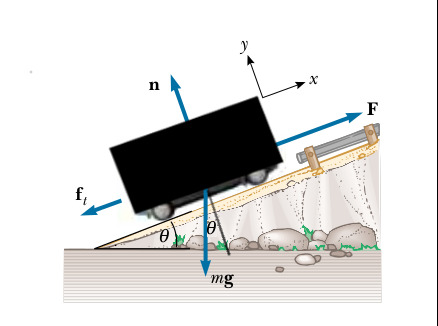
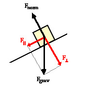

# Temel Fizik 1, İvme, Hız, Yerçekimi

Calculus'un gerçek dünyada belki de en iyi örneği bir arabanın hız
göstergesi ve kilometre sayacı arasındaki ilişkidedir. Bu iki aletin
ölçümlerini birbirinden bağımsız aldığını düşünelim, mesela araba
tekerleğine (ya da onu döndüren her neyse) direk bağlı bir şekilde
katedilen gerçek mesafeyi ve hızı ölçebiliyorlar. Soru şu: bu ölçümlerden
biri elimizde olmasa, bir ölçümü diğerine bakarak hesaplayabilir miydik?
Mesela arabanın hızı (velocity) $v$'nin $t_0,t_1$ arasındaki her zaman
noktasındaki kaydı elimizde olsa, bu aralıkta katedilen mesafe (distance)
$f$'yi hesaplayabilir miydik?  Ya da mesafe bilinseydi o zaman hızı
bulabilir miydik?

Calculus bu geçişi sağlayabilir. $f$'den $v$'ye gidiş türev ile, $v$'den
$f$'ye gidiş entegral ile [1, sf. 1]. 


İlkokulda öğretilen fizik aslında Calculus ile yapılan hesabın
genelleştirilmiş hali. Orada öğrencilere öğretilen problemlerde hız
çoğunlukla sabit oluyor, mesela $v = 60 m/h$ (mil / saat). 2 saat
gidildikten sonra katedilen mesafe 120 mil. Bu hesabın bir çarpım olduğunu
biliyoruz, bu çarpım aslında altta soldaki figürdeki alana (area) tekabül
ediyor. Aynı şekilde eğer sürekli mesafeyi ölçüyor olsaydık, alt sağdaki
ölçümlerdeki gibi mesela, bu grafikten geriye hıza geçmek demek bir bölüm
gerektirir, ve bölüm aslında bir eğim (slope) hesabıdır.


Calculus'un değeri $v,f$ sabit olmadığı zaman ortaya çıkıyor. O zaman basit
çarpım ve bölüm yeterli değil. Mesela ya mesafe $f$ artık bir fonksiyon
$f=t^2$ ile temsil ediliyor olsaydı? O zaman hızı elde etmek için bir türev
almak gerekir, bölüm yetmez, ki türevin sonucu da hala $t$ ve diğer başka
değişkenlere bağlı bir başka fonksiyon olabilir.


Üstteki örnekte türev $2t$. Bu tek bir sayı değil, her $t$ noktasında
farklı değer veren bir fonksiyon. Entegral aynı şekilde, gerçi üstteki
örnekte hala üçgen alan hesabı kolay olabilir, ama çok daha çetrefil bir
hız fonksiyonu olduğunu düşünelim, mesela $v(x) = 4 - x$ ($t$ yerine $x$
kullandık şimdi), ya da $v(x) = x^2 + \cos(x)$. Buradaki alan hesabı için
bir entegral gerekir. Entegralleri toplam değil çarpım olarak görmek
hakkında bir yazı için [7]. Eğer elimizde analitik fonksiyon değil pür sayı
değerleri olsaydı, bu sefer sayısal türev ya da entegral almamız gerekirdi,
ki bunun tekniklerini ileride göreceğiz.

Özetlemek gerekirse hız $v(t) = \frac{df}{dt}$, ve mesafe $f(t) = \int v(t)\mathrm{d} t$.


Üstteki örnekte $v(x) = 4 - x$ hızını görüyoruz. Entegral 

$$ \int v(x) \mathrm{d} x = 4x - \frac{1}{2}x^2 + C $$

$C$ sabiti grafikte atlanmış. Bu sabit orada çünkü $C$ için hangi sayı
olursa olsun türev alırken yokolur, yani $C=1,2,3..$ ile hep aynı türevi
elde ederiz. Bu sebeple o sabiti problemden başka şekillerde elde etmemiz
gerekir. Alan hesabının kendisi için bu fark etmez, çünkü alan hesabında
çıkartma yaparken $C$'ler iptal olur, 

$$ 
\int_{x=1}^{x=3} v(x) \mathrm{d} x = f(3) - f(1) = 
(7 \frac{1}{2} + C) - (3 \frac{1}{2} + C) = 4
$$

İvme

Hız mesafedeki değişim ise mesafedeki değişimin değişimi, yani hızın
değişimine ivme adı verilir. İvme için türevin türevi gerekiyor, yani 

$$ \frac{d^2f}{dt^2} = \frac{d}{dt} \frac{df}{dt} $$

Yerçekimi

Peki hız, ivme gibi kavramlar nereden geliyor? Burada İsaac Newton'a şapka
çıkartmak lazım. Şimdi aklımıza $F = ma$ Newton kanunu geliyor, yani kütle
üzerinde uygulanan kuvvet, kütle ve ivmenin çarpımına eşittir. Fakat Newton
aslında direk $F=ma$ formülü keşfetmedi. Bu formül keşfettiği diğer başka
bir kavramın özel halidir. Newton'un 2. Kanunu şöyle der "bir cismin
momentumunun değişim oranı (bir zaman anında) o cisme uygulanan kuvvete
doğru orantılıdır''. Momentum nedir? Fizikte her terimin spesifik bir
tanımı var. Momentum hız demek değildir. Eğer ağır bir objeyi itersem bu
obje yavaş ilerler, hafif bir objeyi aynı kuvvetle itersem daha hızlı
ilerler, ama momentum iki durumda da aynıdır. Momentum kütle ve hızın
çarpımıdır. Ayrıca Newton momentumdaki *değişimden* bahsetmiştir, yani
başlangıç formülü şudur:

$$ F = \frac{d}{dt} (mv)$$

Sabit $m$ için

$$ F = m \frac{dv}{dt} = ma$$

Çünkü hızın türevi ivmedir. İşte şimdi ünlü formüle eriştik.

Üstteki formülü vektörel formda da belirtmek mümkündür, mesela $m$ kütlesine
uygulanan kuvvet üç boyutlu olabilir, $\vec{F} = [\begin{array}{ccc} F_x & F_y & F_z \end{array}]$ gibi, 
aynı şekilde $\vec{a}$ bir vektör olabilir, o zaman

$$
\vec{F} = m \vec{a}
$$

deriz, ya da notasyon bazen vektörel değişkenleri koyu gösterilebilir,

$$
\mathbf{F} = m \mathbf{a}
$$


Bu arada kütle $m$ sabittir dedik, fakat bazen böyle olmayabilir
de.. Mesela bir roket uçarken yakıt kullanır, ve o yakıt kullanılıp
azaldıkça roketin kütlesi de değişir. O zaman roket hakkında hesap yapan
fizikçiler üstteki türevdeki $m$'i sabit alamaz.

Sonuçta Newton bilimcilere ivme ile kuvvet arasında bir ilişki sunmuş
oldu. Nerede bir hızlanma varsa orada bir kuvvet vardır diyordu bize,
dinamik alanına girecek kendinden sonraki bilimcilere kuvveti bulun ve onu
yaratan şeyi modellemeye uğraşın diye bir tavsiye veriyordu. İlk örnekleri
Newton'un kendisi verdi, mesela yerçekim kuvvetini açıkladı, onun için
spesifik bir formül ortaya attı. Bu ünlü Uzaklığın Karesinin Tersi (Inverse
Square Law) kanunu.

Uzayda iki kütle düşünelim, iki gezegen mesela, arasında $r$ uzaklığı olan
bu iki obje arasındaki çekim kuvveti

$$ F = G \frac{m_1m_2}{r^2}$$

$G$ evrensel bir sabit, dikkat bu bizim dünyamızın yerçekim sabiti küçük
$g$ değildir, ki bilindiği gibi o değer 9.807.. diye giden bir sabit.

Soru

Dünyanın yerçekim sabiti $g$ nasıl hesaplanır? 

Cevap

Bir deney yapmamız lazım, mesela bir belli yüksekliklerden bir top atıp ne
kadar zamanda yere düştüğünü saniye olarak kaydedebiliriz. O zaman bize
mesafeyi zamana bağlayan ve onu $g$ ile ilişkilendiren bir formül
lazım. Önce $g$ formülü.

Kütleler arasındaki uzaklık kütlelerin merkezine göre hesaplanır, yani tüm
çekim kuvvetinin her iki objenin tam merkezinden geldiği kabul edilir. O
zaman, ve eğer iki obje mesela dünya ve onun üzerinde duran bir bir cisim
ise, bu cismin dünya çapına göre "uzaklığı'' yaklaşık olarak yine dünya
çapının kendisidir.

Eğer $m = m_1$, ki $m_1$ ufak olan obje, $m_2$ dünya, ve $r$ dünya çapı
dersek, ve şöyle bir gruplama sonrası [2, sf. 9-6], $g = Gm_2 / r^2$,

$$ F = m g$$

elde ederiz. Bu gruplama yapılabildi çünkü grubun içindeki tüm değerler bilinen
sabit değerler. Bu arada bilinen $g$ değerinden geriye giderek $G$'yi de
hesaplayabiliriz, birazdan göreceğiz.

Devam edelim, mesafe / zaman formülü için, üstteki formülü ve ivme diferansiyel
denklemi ile beraber düşünürsek,

$$ mg = m(\frac{d^2x}{dt^2})$$

Değil mi? Eşitliğin her iki tarafı da kuvvet, sağ tarafta alınan mesafenin
ikinci türevi var, ki bu ivmedir. $m$'ler iptal olur, ve bir kez entegral
alınca 

$$ v(t) = v_0 + gt$$

Bir kez daha

$$ 
x(t) = x_0 + v_0t + \frac{1}{2}gt^2
\qquad (1)
$$

$x_0,v_0$ sabitler, ama deneyimizde başlangıç hızı $v_0=0$ alacağız, ayrıca
başlangıç mesafesi de $x_0=0$, geriye kalanlar,

$$ x = \frac{1}{2}gt^2$$

Güzel. Şimdi elimizdeki ölçümler hangi mesafeden top atıldığı $x$, ve
düşüşün kadar zaman aldığı $t$. Mesafe metre, zaman saniye olarak.

Ölçümler gerçek bir deneyden alınmıştır.

```python
import pandas as pd
from StringIO import StringIO
s = """t;x
0.32;0.5
0.35;0.6
0.38;0.7
0.42;0.8
0.58;1.7
"""
df = pd.read_csv(StringIO(s),sep=';')
df.plot(x='t',y='x',kind='scatter')
plt.xlim(0,0.80)
plt.savefig('phy_005_basics_01_05.jpg')
```


$g$ hesabına gelelim: Üstteki formüle göre $x$ ile $1/2 t^2$ arasında
lineer bir ilişki var. Bu ilişki $g$'nin ta kendisi! O zaman bahsedilen
değerler arasında lineer regresyon kullanırsak $g$'yi bulabiliriz!

```python
import statsmodels.formula.api as smf
df['t2'] = 1/2. * df.t**2
results = smf.ols('x ~ 0 + t2', data=df).fit()
print results.params['t2']
```

```
9.84948009784
```

Ünlü $g$'yi yaklaşık olarak bulduk.

Büyük $G$

$g = Gm_2 / r^2$ ise $G = g r^2 / m_2$ demektir, ki $m_2$ dünyanın kütlesi, $r$
ise dünyanın yarıçapı. Yaklaşık bilinen değerleri kullanırsak,

```python
m2 = 5.972e24 # kg
r = 6371000 # metre
g = 9.8
G = g*r**2 / m2
print (G)
```

```
6.660724745478902e-11
```

Fena değil! Gerçek değer 6.67408 $10^{-11}$ $m^3$ $kg^{-1}$ $s^{-2}$. Eğer fi
tarihinde bir bilimci mesela bu konuda çalışıyorsa $G$ ona gezegenler arası
güçleri hesaplamak için gerekli olurdu, dünyanın kütlesini dünyanın çapından
yola çıkarak kabaca bulabilirdi, ve böylece bir evrensel çekim sabitine
erişebilirdi. Newton hakikaten de bunu yaptı, dünyanın yoğunluğuna (ki oradan
kütle bulunabilir) kestirme bir hesapla "suyun 5 ya da 6 katıdır'' dedi, gerçek
değer 5.515'e oldukca yaklaşmıştı.

İş (Work)

İş, günlük terminolojideki iş kavramından farklı. Bir sandalyeyi kaldırıp birkaç
dakika tutsam çok iş yapmış gibi gelebilir bana [1, sf. 184], ama aslında fiziki
iş tanımı açısından hiç iş yapmadım. Fizikteki iş bir objeyi bir yönde hareket
ettiren güç çarpı o objenin aynı yöndeki katettiği mesafe $d$. Eğer kuvvet
vektörü tam o yönde değilse o yöne tekabül eden bileşenine bakılır, $W = F d
\cos\theta$.


İş bir enerji transferidir. Eğer uygulanan kuvvet işin yönü ile aynı
ise işaret pozitiftir. Eğer tersi ise işaret negatiftir. Bir objeyi
kaldırırıp bir seviyeye getirirsem kaldırma kuvveti kaldırma yönünde,
işin işareti pozitif. Ama o obje üzerindeki yerçekimsel kuvvetin
yaptığı iş negatif, çünkü harekete ters yönde. 

Türetmek için (1) ile başlayalım, $g$ yerine genel bir ivme $a$ alalım, ve
biraz düzenleyince,

$$
x - x_0 = v_0 t + \frac{1}{2} a t^2
$$

Bir diğer formül

$$
v = v_0 + a t
$$

Bu iki formülü birleştirerek $t$'yi yokedebiliriz [3, sf. 24], 

$$
t = \frac{v-v_0}{a}
$$

$$
x - x_0 = 
v_0 \left(\frac{v-v_0}{a}\right) + 
\frac{1}{2} \left(\frac{v-v_0}{a}\right)^2
$$

$$
= v_0 \left(\frac{v-v_0}{a}\right) + \frac{1}{2} \frac{(v-v_0)^2}{a}
$$

$$
2a (x-x_0) = 2 v_0 (v-v_0) + (v-v_0)^2
$$

$$
= 2 v_0 v - 2 v_0^2 + v^2 - 2 v v_0 + v_0^2
$$

$$
2a (x-x_0) = v^2 - v_0^2 
$$

$$
v^2 = v_0^2 + 2a (x-x_0)  
\qquad (2)
$$

Şimdi kinetik enerjiden başlayarak iş formülünü türetelim. Mesela bir
ipteki boncuğa kuvvet uyguladık, boncuk $x$ yönünde $d$ kadar kaydı. 

$$
F_x = m a_x
\qquad (3)
$$

Kuvvet sabit ise o zaman ivme de sabittir, o zaman (2) formülünü
kullanabiliriz. 

$$
v^2 = v_0^2 + 2 a_x d
$$

Eğer $a_x$ için çözersek [3, sf. 152], 

$$
a_x = \frac{v^2 - v_0^2 }{2 d}
$$

Bu formülü (3)'e sokalım,

$$
F_x = m \left( \frac{v^2 - v_0^2 }{2d} \right)
$$

$$
F_x d = \frac{1}{2} m v^2 - \frac{1}{2} m v_0^2
$$

Yani yapılan iş ile objeye (boncuğa) enerji transfer
edilmiştir. Başlangıçtaki kinetik enerji $\frac{1}{2} m v_0^2$ yapılan iş
ile $\frac{1}{2} m v^2$ olmuş. Aradaki fark $F_x d$ ile hesaplanıyor, ki bu
çoğunlukla $W$ ile tanımlanan iş. 

Güç (Power)

Bir zaman aralığında yapılan ise güç adı verilir. Mesela $\Delta t$ zaman
aralığında bir objeye kuvvet uyguladık ve bir iş yapıldı, bu süre içinde
uygulanan güç

$$
P = \frac{W}{\Delta t}
$$

ile gösterilir. Nesne üzerinde yapılan iş onun enerjisinin arttırır, bu sebeple
gücün daha genel tanımı enerji transfer oranıdır. Bir $t$ anında, o anlık gücü
üstte gösterilen ortalama güç hesabının limite giden formu olarak
gösterebiliriz [8, sf. 200],

$$
P \equiv \lim_{\Delta t \to 0} \frac{W}{\Delta t} = \frac{\mathrm{d} W}{\mathrm{d} t}
$$

Eğer uygulanan gücün yol açtığı yer değişimini sonsuz küçük $\mathrm{d} s$ ile
belirtsek, $\mathrm{d} W = F \cdot \mathrm{d} s$ diyebilirdik o zaman üstteki formül

$$
P = \frac{\mathrm{d} W}{\mathrm{d} t} = F \cdot \frac{\mathrm{d} s}{\mathrm{d} t} = F \cdot v
$$

ki burada $v = \mathrm{d} s / \mathrm{d} t$ eşitliğini kullandık. Yani elimizde kuvvet ve hız
var ise, yer değişimine bakmadan gücü direk bu iki öğeden bulabiliriz, çünkü hız
zaten birim zamandaki yer değişimini temsil ediyor.

Örnek

Arabaların motor gücünden çok bahsedilir, ki o baglamda beygir gücü (horsepower
-HP-) kelimesi çok duyulur. Bunun tarihi sebepleri var ama hp birimi rahatça
Watt birimine çevirilebilir, 1 HP = 745.69 Watt.

Bir soru soruldu, mobil küçük ev (tiny house) modası var, acaba bu tür bir evi
hareket ettirmek için ne kadar kuvvet gerekir? Bu evler olabildiğince küçük
oluyor, boyutlar uzunluk 6 metre, genişlik 2.5 metre, yükseklik 3 metre, bir
kutu düşünelim. Ağırlığı 3 ton olsun. Bu tür bir evi 50 km / saat ile hareket
ettirmek için ne kadar güç gerekir?

Burada farklı noktalarda gereken kuvveti düşünmek gerekiyor. Mesela düz satıhta
taşıtı 0 dan 50'ye getirmek için gereken kuvvet. Daha sonra 50'de sürekli gitmek
için daha az kuvvet gerekir, araç momentumu kazandı ve onu tutmaya meyillidir,
ama hala rüzgarın karşı itişi ve sürtünmeyi sürekli yenmemiz gerekiyor yani ona
eşit bir kuvvet üretmek lazım. Tabii 0-50 arasında aynı işin yapılması
gerekli. Bir diğer senaryo yokuş yukarı çıkmak, diyelim yine 0-50 km/saat hızına
erişmemiz gerekiyor ve bu senaryoda bir de yerçekimi kısmen aracı geriye doğru
çekecek, onunla mücadele edilmesi gerekli. Bu sonuncusu herhalde en kötü senaryo.



Hava itişi kolay, bir $A$ alanına $v$ hızında çarpan havanın geri itişi

$$
f_a = \frac{1}{2} D \rho A v^2
$$

ile hesaplanabilir. Hızı metre / saniye ile gösterelim,

```python
v = np.round(50*1000.0 / 3600.0,2)
print (v)
```

```
13.89
```

Hava itişi

```python
h = 3.0
w = 2.5
l = 6.0
m = 3000
```

```python
A  = w*h
D = 0.5
rho = 1.3
f_a = 1/2 * D * rho * A * v**2
print (np.round(f_a,2), 'N')
```

```
470.27 N
```

Sürtünme yerçekimi kuvveti $mg$ çarpı bir sürtünme katsayısı $\mu$ ile bulunur,
bu katsayı normal satıh için $\mu = 0.016$'dir, düz satıh için $f_r = m g \mu$
(yerçekimi kuvvetinin tek bileşeni dikey olduğu zaman),

```python
mu = 0.016
f_r = m * 9.8 * mu
print (f_r, 'N')
```

```
470.4000000000001 N
```

Yokuş yukarı durumunda yerçekimin yere doğru bastıran bileşenine bakmak lazım,
bu tabii daha az olur, yani sürtünme etkisi azalmış olur, ama diğer yandan eğim
yüzünden geriye doğru yerçekim artar.

Şimdi 0-50 hızlanmasını hesaplayalım, diyelim ki bir dakika içinde bu hızlanmayı
yapmak istiyoruz, sabit ivme ile diyelim, o zaman ivme $a = v / \Delta t$ ile
hesaplanabilir, ki $\Delta t = 60 s$.

```python
dt = 60
a = v / dt
f_s = m*a
print (f_s, 'N')
```

```
694.5 N
```

O zaman düz ortamda hızlanma, sürtünme, ve hava itişiyle mücadele etmek için
gereken güç

```python
print ( (f_r + f_a + f_s) * v, 'KWatt')
```

```
22318.499261665234 KWatt
```

Tipik bir arabanın motoru 120 HP gücündedir, bu 90 KWatt demektir. Yani arabanın
bu durum için yeterli gücü var.

Şimdi yukarı çıkış durumuna bakalım. Yokus $\theta = 20$ olsun. Yerçekimi
kuvvetinin bileşenleri şöyle ayrılabilir,



Yere dik olan bileşen $m g \cos\theta$, paralel olan $m g \sin\theta$. Paralele
$f_p$, dik olana $f_n$ diyelim,

```python
f_p = m * 9.8 * np.sin(np.deg2rad(20))
print (f_p)
```

```
10055.392213774661
```

Yeni sürtünme dik olan $f_n$'e göre olacak,

```python
f_n = m * 9.8 * np.cos(np.deg2rad(20))
f_r = f_n * mu
print (f_r)
```

```
442.0314088176914
```

Ayrıca hızı azaltalım, yokuş yukarı çıkıyoruz, 20 km/saat ile gidebilmek yeterli
olsun, yük fazla,

```python
dt = 60
v = np.round(20*1000.0 / 3600.0,2)
a = v / dt
f_s = m*a
print (f_s, 'N')
```

```
278.0 N
```

Şimdi hepsini bir araya koyalım, yokuş yukarı 0-20 hızlanması yapıyoruz,
sürtünme, geriye doğru çekilme, ve hava ile boğuşmak lazım, gereken kuvvet,

```python
F = f_r + f_a + f_s + f_p
print (F*v, 'Watt')
```

```
62526.06762686348 Watt
```

Bir araba motoru hala bu gücü sağlayabilir.

Yokuş Yukarı Sabit Hız

İvmelenmeyi gözönüne almak istemiyorsak [9], sadece yokus yukarı yerçeki
kuvvetine yetecek bir kuvvetle belli sabit bir hızda gitmek için gereken gücü
hesaplamamız gerekse, mesela 8.53 derece yukarı, saatte 90 km/s, 1200 kg
ağırlığındaki araba için, $P = F \cdot v$ formülünden hareketle,

```python
print (int(1200 * 9.8 * (90 / 3.6) * np.sin(8.53) / 1000.0), 'KWatt')
```

```
229 KWatt
```

İzafi Enerji Formülü

İzafi mekanikte kuvvet ve momentumdan başlayan formül biraz daha değişiyor [10].

$$
F = \frac{\mathrm{d} (mv)}{\mathrm{d} t}
$$

tanımında $m$'in değişmediğini farz etmiştik. Fakat izafi mekanikte enerji
uygulandıkça kütlenin büyüdüğünü göz önüne almak lazım. Bu büyüme faktörü
$\gamma = \left(1 - \frac{v^2}{c^2} \right)^{-1/2}$, yani bu faktöre oranla
kütle büyüyecek. Entegral şu hale geliyor,

$$
E_k = \int_{0}^{t} \frac{\mathrm{d} (\gamma mv)}{\mathrm{d} t} \mathrm{d} x
$$

Bu entegral biraz daha karmaşık ama sonunda

$$
E_k = (\gamma - 1)mc^2
$$

elde ederiz. Yani kütleyi daha fazla hızlandırmak için gittikçe daha fazla iş
yapmak gerekir çünkü enerji eklendikçe kütle daha ağırlaşır. 

Kaynaklar 

[1] Strang, *Calculus, 4th Edition*

[2] Feynman, *The Feynman Lectures on Physics, Volume I*

[3] Resnick, Fundamentals of Physics, 10th Ed

[4] [https://physics.stackexchange.com/questions/241507/would-this-be-correct-for-kinetic-energy-in-special-relativity](https://physics.stackexchange.com/questions/241507/would-this-be-correct-for-kinetic-energy-in-special-relativity)

[5] Resnick, Fundamentals of Physics, 8th Ed

[7] Bayramlı, Çok Değişkenli Calculus, *Entegralleri Nasıl Düşünelim*

[8] Wikipedia, [https://en.wikipedia.org/wiki/Earth_mass#Early_estimates](https://en.wikipedia.org/wiki/Earth_mass#Early_estimates)

[9] Kelly, *University of Auckland, Solid Mechanics, Part I*

[10] Masson, *Elastic Collisions in 3D*, [https://exploratoria.github.io/exhibits/mechanics/elastic-collisions-in-3d/index.html](https://exploratoria.github.io/exhibits/mechanics/elastic-collisions-in-3d/index.html)


