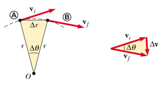
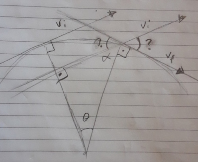
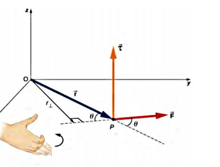
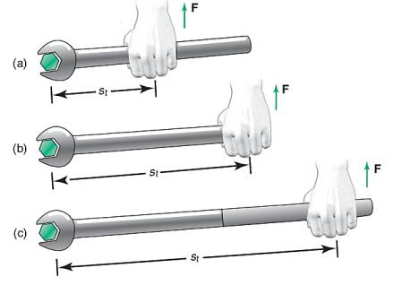
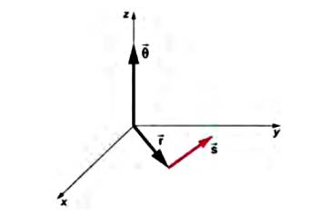
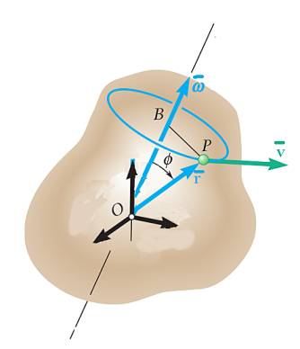
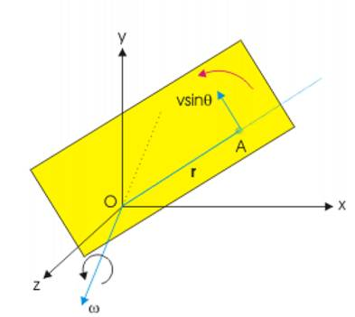
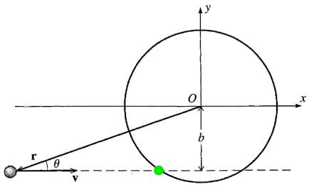

# Temel Fizik 2, Dönüşsel Kuvvet

Dönüşler, Dönme Direnci (Moment of Inertia)

Saat yönü tersi yönde bir dönüş düşünelim, $s$ kadar dönüş olduysa, orijine
uzaklık $r$ ise, açısal mesafe [1, sf. 297]

$$
\theta = \frac{s}{r}
$$

ki $\theta$ radyan. Ya da

$$
s = r \theta
$$

Çemberin tamamı $2\pi$ rad (tam bir dönüş), meselâ 60 derece $\pi / 3$
rad. Çemberin çevresinin formülü $2\pi r$, eğer $\theta = \pi / 3$ rad ise,
$s = \pi / 3 \cdot r$.

Açısal hızı bir $P$ noktasının teğetsel hızından yola çıkarak
hesaplayabiliriz, bu noktanın teğetsel hızı sonsuz ufak $s$'nin zamana göre
değişimi olacaktır, yani $v = ds / dt$, 

$$
v = \frac{ds}{dt} = r \frac{d\theta}{dt}
$$

Elde edilen $d\theta / dt$ açısal değişimi gösteriyor, bu işte açısal
hızdır, ona $\omega$ diyelim, o zaman teğetsel hızı açısal hız ile şöyle
gösterebiliriz,

$$
v = r\omega
$$

Formül diyor ki dönen bir katı objenin herhangi bir noktasının teğetsel
hızı, o noktanın dönüş eksenine olan uzaklığı çarpı açısal hızına
eşittir. O zaman, her ne kadar katı objenin her noktası aynı açısal hızla
dönüyor olmasına rağmen her noktanın lineer hızı aynı değildir, çünkü $r$
her nokta için aynı değil. Üstteki formül dönüş merkezinden uzaklaştıkça
hızın artacağını söylüyor. Teğetsel hızı hayal etmek için o noktada ayakta
durabiliyor olsak yüzümüze çarpacak rüzgar hızını hayal edebiliriz. 

İvmeyi de dahil edelim, açısal ivme ile teğetsel ivmenin bağlantısına
bakalım, $v$'nin zamana göre türevini alırsak,

$$
a_t = \frac{dv}{dt} = r \frac{d\omega}{dt}
$$

$$
a_t = r \alpha
$$

Dönüşsel Kinetik Enerji

Dönmekte olan katı bir objenin kinetik enerjisini nasıl hesaplarız? 

Objenin en ufak parçalarından başlayarak bunu yapmaya uğraşalım. Obje
$z$ ekseni etrafında dönüyor olsun, ve açısal hızı $\omega$
diyelim. Obje içindeki her parçacık $i$'nin kütlesi $m_i$ diyelim,
kinetik enerji bu parçacığın lineer hızına bağlıdır (objenin her
parçacığı aynı açısal hızda döner ama farklı noktalarda lineer hız
$v_i$ farklı olabilir, $v_i = r_i \omega$ üzerinden), o zaman her
parçacık için kinetik enerji [1, sf. 299]

$$
K_i = \frac{1}{2} m_i v_i^2
$$

ile gösterilebilir. Tüm obje için, 

$$
K_R = \sum_i K_i =
\sum_i \frac{1}{2} m_i v_i^2 =
\frac{1}{2} \sum_i m_i r_i^2 \omega^2
$$

Bu ifadede $\omega^2$'yi dışarı çekebiliriz, çünkü her parçacık için aynı,

$$
K_R = \frac{1}{2} \left( \sum_i m_i r_i^2 \right) \omega^2
$$

Parantez içindeki ifadeye bir isim verip değişken atayarak daha da işi
basitleştirebiliriz, bu ifadeye dönme direnci (moment of inertia) ismi
verilir,

$$
I \equiv  \sum_i m_i r_i^2
$$

$I$'nin birimi $kg \cdot m^2$'dir, bu notasyonla nihai denklem

$$
K_R = \frac{1}{2} I \omega^2
$$

haline gelir. 

Umarım lineer hareketin kinetik enerjisi $\frac{1}{2} m v^2$ ile dönüşsel
hareketteki kinetik enerji $\frac{1}{2} I \omega^2$ arasındaki benzerlik
dikkati çekmiştir. Lineerden dönüşsele geçerken / karşılaştırmalı
düşünürken $I$ hep $m$ yerine geçer, böyle görülür. Dönme direnci $I$ aynen
isminin çağrıştırdığı gibi bir kütlenin dönmeye olan gösterdiği dirençtir,
aynen bir objenin kütlesinin lineer harekete olan gösterdiği direnç olması
gibi. 

Önemli bir nokta daha, $I$ formülündeki $r_i$ dikkati çekmiştir, her $m_i$
parçacığının aynı birim ağırlıkta olduğunu farzetsek bile objenin farklı
noktalarında dönüş eksenine farklı uzaklıklar olabilir, yani bu uzaklıklar
objenin şekline göre değişik olacaktır. Mesela bir dikdörtgensel plakayı
orta noktasından döndürüyorsak ene ve boya olan uzaklıklar farklı
olacaktır. Bu sebeple tahmin edebileceğimiz üzere her obje için farklı $I$
hesabı olmalıdır. Bu hesabın detayları için [1, sf. 301]'e bakılabilir. İki
örnek obje için $I$ altta görülüyor.

Merkezcil Kuvvet (Centripetal Force)

Bir gezegenin güneş etrafında dönüşünün yörüngesi, ya da ipe bağlanmış bir
kütleyi elimizle çevirdiğimizde bu dönüşün oluşturduğu çembersel gidiş yolu
merkezcil kuvvet ile alakalıdır. İp örneğinde eğer herhangi bir noktada ipi
bıraksak, ya da gezegen yörünge dönüşü sırasında kütleler arası yerçekim birden
bire iptal olsa, eğer yörüngeye teğet bir hız vektörü düşünsek obje o vektör
yönünde yoluna devam ederdi. Fakat kuvvet varlığı sayesinde hız o yönde değil,
bir sonraki noktada yine daireye orada teğet olan bir hız vektörüne
dönüşüyor.

Üstteki resime göre $v_i$ vektörü $v_f$ haline geliyor. Bu değişimi
gerçekleştiren, dıştan içe doğru $v_i$'i bastıran, merkeze *çeken* kuvvet
merkezcil kuvvettir [1, sf. 91].

Kuvveti hesaplamak için vektörel ivmeyi hesaplayabiliriz. $\mathbf{v}_i,\mathbf{v}_f$
vektörel farkı üstteki ikinci resimde gösteriliyor, iki vektörü dipleri biraraya gelecek
şekilde tekrar resimlendirirsek, $\Delta \mathbf{v} = \mathbf{v}_i - \mathbf{v}_f$ 
olarak gözüküyor.  Bu vektörel farktır. İvme için bu farkı $\Delta t$ ile
böleriz, yani iki vektörün arasındaki zaman farkına.

$$
\frac{\Delta \mathbf{v}}{\Delta t} = \mathbf{a}
\qquad (2)
$$

$\Delta v / \Delta t$ ifadesine başka bir yönden erişmeye uğraşalım, iki üstteki
resimde soldaki resimde bir kenarı $r$ bir kenarı $\Delta r$ olan bir üçgen var,
dikkat vektör $\mathbf{r}$ değil skalar $r$. Aynı resimde sağda kenarları
$\Delta v$ ve $v$ olan bir diğer üçgen var, yine skalar. Ayrıca belirtelim,
$|\mathbf{v}_i| = |\mathbf{v}_f| = v$, yani her iki hız vektörünün büyüklüğü
(magnitude) aynı. Aslında bu iki üçgen benzer üçgenlerdir, aynı $\theta$ açısına
sahiplerdir.  İspat için alttaki resme bakalım,

Soru işareti olan acılar $\theta$ olmalı, çünkü $\alpha + \theta = 90$, aynı
şekilde $\theta$ ile bilinmeyen acı toplanınca 90 derece olmalı, demek ki
bilinmeyen açı $\theta$'dır, ve onun zıttındaki açı da aynı olacağı için
$\theta$'dır.

Benzerliği ispatladık, şimdi benzerlikten hareketle şu ifadeyi yazabiliriz,

$$
\frac{\Delta v}{v} = \frac{\Delta r}{r}
$$

Bu denklemi $\Delta v$ için yeniden düzenlersek, $\Delta v = v \Delta r / r$
olur, ve onu (2) formülünün skalar haline sokarsak,

$$
a = \frac{v \Delta r}{r \Delta t}
$$

elde ederiz. Şimdi $\Delta t \to 0$ durumunu düşünelim, yani bakılan aralık
küçülecek, o zaman $\Delta r / \Delta t$ oranının hız $v$'ye yaklaşmasını
bekleriz, $\lim_{\Delta t \to 0} \Delta r / \Delta t = v$.
O zaman üstteki formül

$$
a = \frac{v^2}{r}
$$

olarak yazılabilir. Merkezcil kuvveti hesaplamak için kütle $m$ çarpı ivme
formülü üzerinden,

$$
F_{merkezcil} = m \frac{v^2}{r}
$$

denebilir. Yani hızın karesi çarpı bilinen kütle bölü bilinen yörünge çapı
bize gereken kuvveti verir.

Tork (Torque)

Bir kuvvetin bir objeyi bir eksen etrafında döndürme kabiliyeti bir vektör
büyüklüğü olan tork ile ölçülür. Dönme eksenine olan uzaklık burada önemli
rol oynar, bir kapının kolu menteşeye olabildiği kadar uzaktır, çünkü
mesafe arttıkça aynı kuvvet ile daha fazla dönme, daha çok tork elde
edilir.

Tork her zaman dönme eksenine teğet olan kuvvet için hesaplanır, ve
uzaklık, kol uzaklığı, kuvvetin uygulandığı noktada eksene olan
uzaklıktır. Üstteki resimdeki tork $\tau$

$$
\tau = F \sin \phi = F d
$$

ile hesaplanır, ki $d = r \sin\phi$ olarak tanımladık.

Dikkat, tork türetilebilecek bir kavram değildir, bir tanımdır. Dönme merkezine
uzaklık çarpı kuvvet bazı kavramları biraraya getirmesi açısından faydalı, bu
sebeple kullanılıyor. Tork kuvvet ile karıştırılmamalı. Kuvvet lineer harekette
değişiklik yaratır, kuvvet dönüşsel harekette de değişiklik yaratır, ama bu tür
değişimde hem kuvvet hem de dönüş merkezine olan kol uzaklığı aynı oranda rol
oynar. Torkun birimi kuvvet çarpı uzunluk, yani Newton metredir. Diğer yandan
yapılan iş (work) ve torkun birimleri aynıdır, ama bu iki kavram da birbirinden
farklı.

Tork $\vec{\tau}$ üç boyutta

$$
\vec{\tau} = \vec{r} \times \vec{F}
$$

olarak hesaplanabilir, bu durumda $\vec{\tau}$ vektörünün büyüklüğü hesaplanan
tork olacaktır [4]. Çapraz çarpımdan biliyoruz ki

$$
|\tau| = | \vec{r} \times \vec{F} | = r F \sin\theta
$$

Örnek

Çocuk parklarında tahtıravallı vardır, diyelim bir uçta şişman bir çocuk
biniyor, 10 Newton güç uyguluyor. Diğer yanda daha zayıf çocuk, o 5 Newton
güç uyguluyor. Bu tahtıravallı hala dengede durabilir, eğer dönme noktasına
şişman çocuk 1 metre, diğeri 2 metre uzakta oturuyorlarsa. Niye? Çünkü bu
durumda iki tarafın uyguladığı tork birbirine eşit olacaktır.

Şimdi kavramsal konulara birazdan daha yakından bakalım. Kavramsal olarak niye
üstteki vida sıkma yöntemlerinden en alttaki (üçüncü) en kolay olanı? Bunu
anlamak için alttaki şekle bakalım,

Görüldüğü gibi bize gereken vidadaki dönme için gereken bir $\theta$ var
diyelim, bu $\theta$ açısı 1'inci noktada az bir mesafe 2'inci noktada daha
fazla ile bir çembersel mesafeye sebep oluyor. Birinci mesafeyi daha fazla bir
kuvvet ile ($F_1 > F_2$) aşmak lazım, aynı kuvvetin uygulandığı noktayı,
mesafeyi arttırarak bir anlamda dış çembersel mesafeyi kuvvet ile değiş tokuş
etmiş oluyoruz. Bu mekanizmanın nasıl işlediğini anlamak istiyoruz.

Vidanın kendi etrafındaki en ufak çemberi düşünelim, o çemberin bir $s$ parçası
kadar dönmesi lazım, ve vidanın $F$ kuvveti ile dönmeye direndiğini düşünelim, o
zaman yapılması gereken iş $F \cdot s$. Bu demektir ki o işi daha büyük bir
çember üzerinden yaparsak, $s$ büyüyeceği için $F$'nin küçülmesinde problem
yoktur, çünkü aynı $F \cdot s$ değerine ulaşmak için bir değer büyüdüğünde
diğeri küçülebilir.

Burada anahtar kelime "yapılan iş'' ve aslında çember etrafında yapılan
bildiğimiz lineer iş. Eğer anahtarı çevirirken çember etrafında katedilen ufak
lineer mesafeleri entegre etsek (kuvvet ile çarpıp toplasak) elde edilecek iş
hesabından bahsediyoruz. Dönme kavramı sihirli farklı bir dünyada yaşamıyor, biz
hala lineer bir iş yapıyoruz, kuvvet ile direk bir şeyi itiyoruz ya da
çekiyoruz.  Vida, anahtar kolu ile bu iş dönüşsel bir aksiyona çevriliyor.

Hesabı yapmak için önce çember uzunluğu kavramını görelim; iki boyutta tek
düzlem üzerinde $r$ yarıçaplı $\theta$ açısı için katedilen ufak mesafe $s$
tanıdık $s = \theta r$ formülü ile hesaplanabiliyor.

Eğer üç boyutta hesap yapmak isteseydik, bu uzayda herhangi bir yöne doğru
gösterebilecek bir $\vec{r}$ için ufak bir numara kullanabiliriz, $\theta$'yi
sayfadan bize doğru gösteren $\vec{r}$'ye dik olan bir vektör olarak düşünelim,
vektör büyüklüğü eski skalar $\theta$'nin büyüklüğüne tekabül edecek, $\vec{s}$
hesabı için çapraz çarpım kullanırız,

$$
\vec{s} = \vec{\theta} \times \vec{r}
\qquad (1)
$$

Bu kullanımın iki boyut üzerinde hala geçerli olduğunu doğrulayabiliriz, [7]'de
gördük ki

$$
|A \times B| = |A||B|\sin\phi
$$

ki $\phi$ iki vektör arasındaki açıdır. Buradaki kullanımda $\vec{\theta}$ ve
$\vec{r}$ dik, o zaman $\phi=90$,

$$
|\vec{s}| = |\vec{\theta}| |\vec{r}| \sin(90) \implies s = \theta \cdot r
$$

Bir önceki hesaba gelmiş olduk. Fakat çapraz çarpım formunun iyi tarafı
üç boyutta kullanılabilmesi. 

Şimdi üstteki hesabı ufak $\mathrm{d} \vec{s}$'ler için yapıp onları yapılan işi
gezdiği çember parçası için entegre edeceğiz, ve bu hesabın bize tork hesabına
götürdüğünü göreceğiz. (1) formülünün sonsuz ufak formunu türetelim,

$$
\mathrm{d} \vec{s} =
\mathrm{d} (\vec{\theta} \times \vec{r} ) =
\mathrm{d} \theta \times \vec{r} + \mathrm{d} \vec{r} \times \vec{\theta} =
\mathrm{d} \theta \times \vec{r}
$$

Basitleştirme mümkün oldu çünkü $\mathrm{d} \vec{r} = 0$, bu mantıklı onun zamana göre
değişimi sözkonusu değil. Kuvveti uygularken somun anahtarını nereden
tuttuğumuzu değiştirmiyoruz. Toplam yapılan iş için bahsettiğimiz entegrasyonu
yapalım, kuvvet çarpı mesafe, yani $\mathrm{d} \vec{s}$, ve bunu tüm $\mathrm{d} \vec{s}$'ler
için topluyoruz,

$$
W = \int \vec{F} \cdot \mathrm{d} \vec{s} =
\int \vec{F} \cdot (\mathrm{d} \vec{\theta} \times \vec{r}) =
\int \mathrm{d} \vec{\theta} \cdot (\vec{r}  \times \vec{F}) 
$$

Son geçişi yapmak mümkün oldu çünkü bilinen bir eşitliğe göre
$\vec{a} \cdot (\vec{b} \times \vec{c}) = \vec{b} \cdot (\vec{c} \times \vec{a})$

Son formülde bir $\vec{r}  \times \vec{F}$ büyüklüğü var, bu tork hesabıdır! O
zaman

$$
W = \int  \vec{\tau} \cdot \mathrm{d} \vec{\theta}
$$

diyebiliriz [4]. Yani bir kol çevirmekle yapılan toplam iş o işin gezdiği
açı boyunca uygulanan torkların toplamına eşittir. Tork ise kol uzunluğu
ile direk bağlantılı olduğu için daha büyük $\vec{r}$ daha fazla yapılan
iş demek olacaktır!

Not: Bazı kaynaklarda, mesela yapısal mekanik (structural mechanics) alanında,
uzaklık çarpı kuvvet büyüklüğü "moment'' olarak ta geçiyor olabilir.

Açısal Hız (Angular Velocity)

Bir katı gövdenin herhangi bir eksen üzerinde döndüğünü düşünelim.  Bu kütlenin
bizim önceden sabitlediğimiz bir eksen sistemi olabilir, ama o eksenin herhangi
bir kolu etrafında olması şart değil bu dönmenin, herhangi bir eksen.

Üstteki resimde [8, sf. 920] eksen $\bar{w}$ vektörü etrafında olarak
gösterildi, ve açısal hızın büyüklüğü ise $\bar{w}$ vektörünün büyüklüğüne eşit,
yani $|\bar{w}|$.  Açısal hız en basit halde alttaki şekilde hareketle
anlaşılabilir, $\theta$ açısının katettiği çembersel mesafe $r\theta$'dir, eğer
zamansal $\theta(t)$ biliniyorsa, $\omega = \dot{\theta}$ bize açısal hızı, ve
$v = r\omega$ ise teğetsel hız $v$'yi verir.

Üç boyutlu ortamda $v$ ve $r$ iki üstteki resimde görüldüğü üzere birer vektör
olur, bu durumda açısal hız $v$'yi, daha doğrusu $\bar{v}$ vektörünü
hesaplamanın bir diğer yolu,

$$
\bar{v} = \bar{\omega} \times \bar{r}
$$

çapraz çarpımıdır. Bu nasıl oldu? Yine iki üstteki resme bakarsak hız için önce
bize yarıçap lazım, semboller karışmasın artık yarıçap $r$ değil, $\bar{r}$
vektörü direk parçacığın yerine işaret ediyor, yarıçap $BP$ çizgisi. O çizginin
uzunluğu [6, sf. 10] ($r$ değerini $\bar{r}$'nin uzunluğu olarak alalım) şu
formül değil mi? $r\sin\phi$. Evet. O zaman $\omega$ açısal hızı ile çarparsak,
açısal hız vektörü büyüklüğünü

$$
|\bar{v}| = r \sin\phi \omega
$$

elde edebiliriz. Bu bir büyüklük tabii, hala vektörsel değil. Peki bu büyüklüğü
bir vektöre nasıl çeviririz?  Açısal hızın yönünü birim vektör olarak kullansak?
Evet, bu yönün her zaman $\bar{r}$ ve $\bar{\omega}$ vektörlerinin oluşturduğu
düzleme dik olacağını biliyoruz, bu bize çapraz çarpım işlemini hatırlatmalı, o
zaman

$$
\bar{v} = r \sin\phi \omega
\left( \frac{\bar{\omega} \times \bar{r}}{| \bar{\omega} \times \bar{r} |}  \right)
$$

Daha basitleştirme yapmak mümkün, [7]'den hatırlarsak,
$|\bar{\omega} \times \bar{r} | = \omega r \sin\phi$, üstte yerine koyarsak,

$$
 = r \sin\phi \omega
\left( \frac{\bar{\omega} \times \bar{r}}{\omega r \sin\phi}  \right)
$$

$$
 = \bar{\omega} \times \vec{r}
$$

Peki $\bar{\omega} \times \vec{r}$ formülünden $\vec{\omega}$'yi geri elde etmek
mümkün mü?

Üstteki resme uygun durumlar için, $\bar{\omega}$ parçacık $\vec{r}$'sinin
oluşturduğu çemberin düzleminden yukarı çıkıyor,

$$ \bar{v} = \bar{\omega} \times \vec{r}
$$

İki tarafı soldan $\bar{r}$ ile çapraz çarpalım,

$$
\bar{r} \times \bar{v} = \bar{r} \times (\bar{\omega} \times \vec{r})
$$

Sağ taraf üzerinde "BAC-CAB açılımı'' denen tekniği uygulayabiliriz [11]

Buna göre [9]

$$
= \bar{\omega} (\bar{r} \cdot \bar{r}) - \bar{r}(\bar{r} \cdot \bar{\omega})
$$

$\bar{r}$ ve $\bar{\omega}$ birbirine dik olduğuna göre noktasal çarpımları
sıfırdır. $|\bar{r}|^2 = \bar{r} \cdot \bar{r}$, o zaman

$$
\bar{r} \times \bar{v}  = \bar{\omega} |\vec{r}|^2
$$

$$
\bar{\omega}  = \frac{\bar{r} \times \bar{v}}{|\vec{r}|^2} 
$$

Açısal Momentum

Bir parçacığın açısal momentumu onun lineer momentumuna benzer şekilde
hesaplanır, lineer durumda $m \vec{v}$ hesabını yapıyoruz. Açısal durumda kütle
$m$ yerine dönme direnci $I$ kullanılacaktır, hız ise açısal hız $\vec{\omega}$
olacaktır. Açısal momentum $\vec{L}$,

$$
\vec{L} = I \vec{\omega}
$$

$\vec{L}$ ve $\vec{\omega}$'nin aynı yöne işaret ettiğine dikkat. Bir parçacık 
için $I = r^2 m$ olur, $\vec{\omega} = (\vec{r} \times \vec{v}) / r^2$ biraz
önce gördüğümüz gibi. O zaman

$$
L = (r^2 m) \left( \frac{\vec{r} \times \vec{v}}{r^2}  \right)
$$

$$
= m (\vec{r} \times \vec{v})
$$

$$
 = \vec{r} \times m\vec{v}
$$

$m\vec{v}$ ifadesi cogunlukla $\vec{p}$ ile gosterilir [5], yani

$$
L = \vec{r} \times \vec{p}
$$

Aynen momentumun zamansal türevinin bir lineer kuvvet sonucunu vermesi gibi
açısal momentumun zamansal türevi tork olacaktır [10, sf. 90]. Vektör işaretini
yazmadan,

$$
\dot{L} = \frac{\mathrm{d} }{\mathrm{d} t} (r \times p)  =
(\dot{r} \times p) + (r \times \dot{p})
$$

Bir numara yapalım, hızı $v = \frac{\mathrm{d} r}{\mathrm{d} t} = \dot{r}$ olarak ta
gösterebiliriz, çünkü $r$'nin zamansal değişimi hızdır, bu durumda üstte
eşitliğin sağ tarafındaki $p$ yerine $m\dot{r}$ koyabiliriz, ve bakıyoruz ki
$\dot{r}$ ile $m\dot{r}$ gibi iki paralel vektörün çapraz çarpımını alıyoruz, bu
tür bir çarpım sıfıra eşittir, iptal olur. Ayrıca $\dot{p}$ yerine parçacık
üstüne etki eden tüm kuvvetleri alırsak, $F$ diyelim, yeni denklem,

$$
\dot{L} = T = r \times F
$$

olacaktır. $T$ parçacığa etki eden net tork olarak isimlendirilebilir.

Soru

Ufak bir yapışkan topun $xy$ düzleminde dönebilen, başta hareketsiz bir plağa
$v$ hızında fırlatıldığını düşünelim [10, sf. 96], plak okuyucuya doğru çıkan
$z$ düzlemi etrafında dönüyor olacak, dönüşte hiçbir sürtünme yok, bu durumda
çarpmadan ortaya çıkan momentum muhafaza edilecek. Çarpma sonrası top ve plak
beraber dönecekler, bu dönüş hızı $\omega$'yi bulun.

Cevap

Çarpma öncesi plağın sıfır momentumu var, topun ise $l = r \times p$. Burada $r$
orijine $O$'ya göre tam çarpışma noktasına olan uzaklık, o nokta yeşille
işaretli, ve $b$. İki boyutta baktığımız için vektörelden skalar forma
geçebiliriz, o zaman $r \times p = r (mv) \sin \theta = m v b$.

Çarpışma sonrası top plağa yapışmış halde, ağırlık artmış olacak, transfer
edilen momentum her iki kütleyi hesaba katılacak şekilde alınmalı, ve açısal
hızı onun üzerinden hesaplıyoruz, $L = I \omega$ formülünü hatırlayalım, $L$
transfer edildi onu biliyoruz, $I$ hesabında top için $mR^2$, plak için
$\frac{1}{2} M R^2$, toplam $I = (m+M/2) R^2$, demek ki

$$
m v b = (m + M/2) R^2 \omega
$$

Yer değiştirince

$$
\omega = \frac{m}{m + M/2} \cdot \frac{vb}{R^2}
$$

Kaynaklar

[1] Resnick, *Fundamentals of Physics, 8th Ed*

[2] Heuvel, *Pool Hall Lessons: Fast, Accurate Collision Detection Between Circles or Spheres*,
    [https://www.gamasutra.com/view/feature/131424/pool_hall_lessons_fast_accurate_.php?print=1](https://www.gamasutra.com/view/feature/131424/pool_hall_lessons_fast_accurate_.php?print=1)

[3] Wikipedia, *Elastic collision*, [https://en.wikipedia.org/wiki/Elastic_collision](https://en.wikipedia.org/wiki/Elastic_collision)

[4] Clark, *Physics 121, General Physics I, Muhlenberg College*,
    [https://phys.libretexts.org/Courses/Muhlenberg_College/MC%3A_Physics_121_-_General_Physics_I](https://phys.libretexts.org/Courses/Muhlenberg_College/MC%3A_Physics_121_-_General_Physics_I)

[5] Wikipedia, *Angular Momentum*
    [https://en.wikipedia.org/wiki/Angular_momentum](https://en.wikipedia.org/wiki/Angular_momentum)

[6] Schaub, *Analytical Mechanics of Space Systems*

[7] Bayramlı, *Cok Degiskenli Calculus, Ders 2*

[8] Beer, *Vector Mechanics for Engnineers*

[9] Stackexchange, [https://physics.stackexchange.com/questions/292822/how-to-derive-the-formula-for-angular-velocity-in-three-dimensions](https://physics.stackexchange.com/questions/292822/how-to-derive-the-formula-for-angular-velocity-in-three-dimensions)

[10] Taylor, *Classical Mechanics*

[11] Bayramlı, *Cok Degiskenli Calculus, Ders 3*

