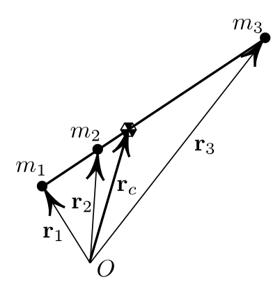
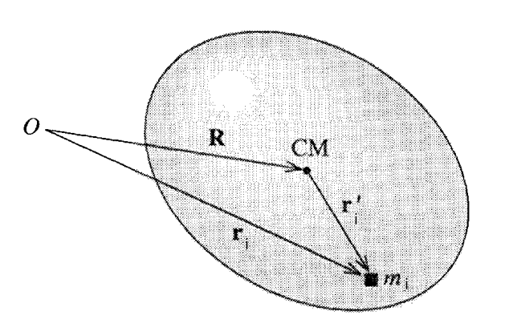
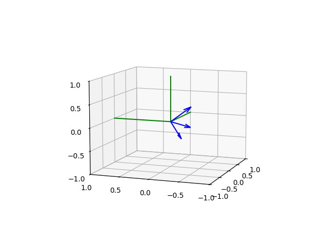

# Temel Fizik 4 

Parçacıklar, Çok Parçacıklı Sistemler, Katı Gövde (Rigid Body)

Kütle Merkezi

Küresel, birörnek parçacıklara uygulanan kuvvetin onların merkezine uygulandığı
farzedilebilir, ya da parçacık sanki noktasal bir parçacık imiş gibi işlemler
yapılabilir. Fakat bu faraziyeyi nasıl doğrularız? Ayrıca farklı şekillerde,
homojen bir maddeden oluşmayan objeleri nasıl idare ederiz?

Burada kütle merkezi (center of mass) kavramı yardımcı olur, mesela $N$ tane
$m_i$ kütlesine sahip parçacığın kütle merkezi

$$
r_c =
\sum_{i=1}^{N} \frac{m_i}{m} r_i =
\frac{1}{m} \sum_{i=1}^{N} m_i r_i
$$

ile hesaplanabilir. Bu bir nevi bir ağırlıklı ortalama. $O$ bir referans
noktasıdır, mesela kordinat orijini, $r_i$ ise $O$'dan parçacık konumuna işaret
eden bir vektör, parçacığın yeri [7, sf. 77].



Dikkat edersek parçacıklar ayrı ayrı duruyor, ama birazdan göreceğiz ki bu
parçacıklar tek bir katı gövde objenin içinde olsalar da hesap geçerli
oluyor. Hatta gövde katı olmasa bile, mesela titreşen, salınımda olan
moleküllere, öğelere sahip objeler bile belli şartlara uyuyorlarsa aynı kurallar
ile idare edilebiliyorlar. $F_{ij}$ her $i$ parçacığının $j$ parçacığından
hissettiği kuvvet olsun, ve $F_i$ değeri de $i$ parçacığı üzerindeki tüm dış
kuvvetlerin toplamı olsun. Newton'un ikinci kuralını her parçacık için yazarsak,
$i$'nin hissettiği tüm kuvvetlerin toplamı solda kütle çarpı ivmeye eşit
olacaktır,

$$
m_i \ddot{r}_i = \sum_{j \ne i} F_{ij} + F_i
$$

ki $\ddot{r} = \mathrm{d}^2 / \mathrm{d} t^2 r$, zamana göre ikinci türev anlamında.

Fakat Newton'un etki-tepki üçüncü kuralına göre her parçacık uyguladığı kuvvet
kadar ters yönde geri bir kuvvet hisseder, yani $F_{ij} = -F_{ji}$, olmalı, o
zaman her iki tarafta tüm $i$'ler üzerinden bir toplama yapınca parçacık
sistemindeki bu "iç'' kuvvetler birbirini nötralize etmeliler, üstteki
formülden geriye kalanlar,

$$
\sum m_i \ddot{r}_i =  \sum F_i
$$

olur. $\sum F_i$ değeri sisteme uygulanan tüm dış kuvvetler $F_{ext}$ olarak
görülebilir. Sol tarafı $m$ ile hem bölüp, hem çarpalım,

$$
m \frac{\mathrm{d}^2}{\mathrm{d} t^2} \underbrace{\sum \frac{m_i}{m} r_i}_{r_c} =
F_{ext}
$$

İşaretli yerde bir $r_c$ elde ettiğimizi görüyoruz, o zaman 

$$
m\ddot{r}_c = F_{ext}
$$

diyebiliriz, yani tüm sistemin kütle merkezi tek bir parça gibi görülebilir,
hesaplarda $m$ ve $F_{ext}$ ile beraber bu şekilde kullanılabilir, ki
o merkezin ivmesi $\ddot{r_c}$ olacaktır.

İşin ilginç tarafı bu sistem ayrı ayrı parçalar olsun, ya da aynı katı gövde
içindeki "bloklar'' olsun bu hesap yine işliyor olacaktır, çünkü düşünürsek bir
katı obje içindeki blokların, parçacıkların da birbiri üzerinde kuvvetleri de
birbirini nötralize ederler, hatta katı olmayan ama parçaları titreşen obje için
de aynı argüman, ve aynı formül kullanılabilir.

Toplam lineer momentum oldukça basit,

$$
P = \sum_i p_i = \sum_i m_i \dot{r}_i = M \dot{R}
$$

Yani kütle merkezi üzerinden tüm kütle için bir momentum kullanılabilir.

Toplam Açısal Momentum

Tek parça için $l = r \times p$ olan momentumların bir parçacık sisteminde
hesaplamak istersek daha önce lineer momentumda olduğu gibi toplam alabiliriz,

$$
L = \sum_{i=1}^{N} l_i = \sum_{i=1}^{N} r_i \times p_i
$$

Bir katı gövdede hesap aynıdır, ve daha önce gördüğümüz kütle için parçacıkların
birbiri üzerine uyguladığı kuvvetlerin iptal olması durumunu, parçacıkların
birbirine uyguladığı torkların iptali olarak açısal ortama taşıyabiliyoruz, yani
üstteki formül doğru, detaylar için [8, sf. 94].

Kütle merkezinin toplam açısal momentumun hesabında oynadığı rol biraz daha
karmaşık ama bir o kadar önemli [8, sf. 368].

Yine bir katı gövde düşünelim, $N$ tane her biri $m_i$ ağırlığında parçacıktan
oluşuyor olsun, altta resmedildiği gibi, kütle elipsoid şeklinde.



$m_i$'nin herhangi bir şekilde seçilen referans / orijin noktası $O$'ya göre
olan yeri $r_i$ ile gösteriliyor. Kütle merkezi (center of mass) CM ile,
CM'nin $O$'ya göre yeri $R$, $m_i$'nin CM'ye izafi olarak yeri $r_i'$. Yani

$$
r_i = R + r_i'
\qquad (7)
$$

doğru olacak. Şimdi $O$'ya göre parçacık $i$ için açısal momentum hesaplarsak

$$
l_i = r_i \times p_i = r_i \times m_i \dot{r}_i
$$

$l,p,r$ vektörsel değerler.

O zaman $O$ referansına izafi olarak toplam momentum

$$
L = \sum_i l_i = \sum_i r_i \times p_i = \sum_i r_i \times m_i \dot{r}_i
$$

Eğer (7) denklemini üste sokarsak,

$$
L = \sum_i (\dot{R} + \dot{r}_i') \times m_i (\dot{R} + \dot{r}_i' )
$$

Şu kuralı [8] kullanarak

$$
(A + B) \times (C+D) = (A \times B) + (A \times C) + (B \times C) + (B \times D) 
$$

açılımı yapabiliriz, 

$$
 = \sum_i (\dot{R} + \dot{r}_i') \times (m_i \dot{R} + m_i \dot{r}_i' )
$$


$$
= \sum_i (R \times m_i \dot{R}) +
  (R \times m_i \dot{r}_i') +
  (r_i' \times m_i \dot{R}) +
  (r_i\ \times m_i \dot{r}_i')   
$$

$M = \sum_i m_i$ diyelim, ki $M$ tüm kütle,

$$
L = R \times M\dot{R} +
R \times \sum m_i \dot{r}_i' +
(\sum r_i' m_i) \times \dot{R} +
\sum r_i' \times m_i \dot{r}_i'
\qquad (8)
$$

Bu son denklem üzerinde oldukca fazla basitleştirme mümkün. Mesela üçüncü
terimde parantezler içinde olan formül sıfıra eşit, niye? Kütle merkezi
formülünü yazarsak,

$$
R = \frac{1}{M} \sum m_i r_i
$$

$$
MR = \sum m_i r_i
$$

Aynı şekilde izafi açılımı yapalım,

$$
= m_i (R + r_i') = \sum m_i R + \sum m_i r_i'
$$

Yani

$$
MR = MR + \sum m_i r_i'
$$

elde ederiz, ve bu formülün doğru olması için $\sum m_i r_i' = 0$ olması gerekir.

Yani (8) denkleminin üçüncü terimi sıfır. O terimin türevini alırsak
ikinci terimin elde edileceğini görürüz, o zaman o da sıfır olur. Geriye
kalanlar,

$$
L = R \times P + \sum_i r_i' \times m_i \dot{r}_i' 
$$

Birinci terim kütle merkezinin $O$'ya göre açısal momentumu, ikincisi hareketin
kütle merkezine göre olan açısal momentumu. Üstteki formül sayesinde bir
katı gövdenin açısal momentumunu iki parçaya bölerek düşünmek mümkün oluyor.

CM Torku CM Açısal Momentumu

Şimdi şu soruyu soralım: katı gövdenin açısal momentum değişimi (dönüşsel
kuvvet, tork) ona uygulanan, ve yine onun CM'sine göre uygulanmış dış torka eşit
midir? Cevap evet olacak ama bu aslında ilk başta çok bariz olmayabiliyor, çünkü
CM ivmeleniyor, bu eşitlik o durumda da geçerli olur mu? Fakat CM ivmeleniyor
olsa bile cevap değişmiyor.

İspatlamak için CM etrafındaki açısal momentumu formülize edelim [9, sf 37],

$$
L_{CM} = \sum r_i' \times m_i \dot{r}_i' 
$$

CM etrafında uygulanan tork, üstteki açısal momentumun zamansal türevidir, 

$$
\dot{L}_{CM} = \sum \dot{r}_i \times m_i \dot{r}_i' + \sum r_i' \times m_i\ddot{r}_i'
$$

Eşitliğin sağındaki ilk terim sıfır çünkü iki paralel vektörün çapraz çarpımı
sıfırdır. Kalanlarla devam edersek, $r_i = r_i' + R$ olduğu için oradan
$\ddot{r}_i = \ddot{r}_i' + \ddot{R}$ ve oradan $\ddot{r}_i' = \ddot{r}_i -
\ddot{R}$ diyoruz, üstteki ikinci terimde yerine koyunca

$$
= \sum r_i' \times m_i (\ddot{r}_i - \ddot{R})
$$

$$
= \sum (r_i' \times m_i \ddot{r}_i) - (r_i' \times m_i \ddot{R})
$$

$$
= \sum (r_i' \times m_i \ddot{r}_i) - \sum (r_i' \times m_i \ddot{R})
$$

İlk terimde kuvvet tanımı görülüyor,

$$
= \sum (r_i' \times F_i ) - \sum (r_i' \times m_i \ddot{R})
$$

İkinci terimde $m_i$ yer değiştirebilir,

$$
= \sum (r_i' \times F_i ) - \sum (m_i r_i' \times \ddot{R})
$$

$\sum m_i r_i'=0$ olduğunu hatırlarsak ikinci terim kaybolur,

$$
= \sum r_i' \times F_i 
$$

Geriye kalan dışarıdan CM etrafında uygulanan tork tanımı değil midir? Evet.  O
zaman dışarıdan CM etrafında uygulanan tork ile başladığımız ifade
$\dot{L}_{CM}$ yani CM etrafındaki momentum değişimi arasındaki eşitliği
ispatlamış olduk.

Atalet Matrisi (Inertia Matrix, Tensor)

Bir objenin havaya fırlatıldığını düşünelim, fırlatma sırasında dönüş te var,
çetrefil bir hareket sözkonusu yani. Fakat şimdiye kadar gördüğümüz teknikler
ile hala bu hareketi analiz edebiliriz, hem lineer momentum, hem de açısal
momentum kütle merkezi odaklı olarak analiz edilebiliyor. Herhangi bir katı
gövde, cisim şeklini ve hareketi analiz için şimdi bazı genel formülleri
ortaya koyalım. 

Gövdenin açısal momentumu $L$ için [1, sf. 379],

$$
L = \sum m_i r_i \times v_i
$$

ki $L,r,v$ vektör. $v = \omega \times r$ eşitliğini üste sokarsak,

$$
L = \sum m_i r_i \times (\omega \times r_i)
\qquad (1)
$$

Şimdi bu son ifadenin her vektörü öğelerini kullanarak açılımını yapalım böylece
başka bir forma erişmeyi umuyoruz. $\omega = [\begin{array}{ccc} \omega_x&\omega_y&\omega_z \end{array}]^T$
ve $r = [\begin{array}{ccc} x&y&z \end{array}]^T$ öğelerini kullanacağız, ve
üstteki formülün $A \times (B \times C)$ formunda olduğunu farkediyoruz, o zaman
genel bir $r \times (\omega \times r)$ üzerinde BAC-CAB açılımı yapmayı
deneyebiliriz, bu açılım hatırlarsak,

$$
A \times (B \times C) = B(A \cdot C) - C(A \cdot B)
$$

idi. Kendi denklemimiz üzerinde bu açılım

$$
r \times (\omega \times r) = \omega (r \cdot r) - r(r \cdot \omega)
$$

şeklinde olacaktır. Açılımı yapınca 3 x 1 boyutunda bir vektör elde ediyoruz
onun sadece ilk öğesine, $x$ için olan durumuna bakalım,

$$
r \times (\omega \times r)_x = \omega_x (x^2 + y^2 + z^2) - x(\omega_x x + \omega_y y + \omega_z z)
$$

$\omega_x x^2$ iki yerden iptal olur, kalanlar,

$$
 = \omega_x ( y^2 + z^2) - \omega_y xy + \omega_z xz
$$

Her üç öğe için açılım yapınca,

$$
r \times (\omega \times r) =
\left[\begin{array}{c}
(y^2 + z^2) \omega_x - xy \omega_y - xz \omega_z \\
-yx \omega_x + (z^2 + x^2)\omega_y - yz \omega_z \\    
-zx \omega_x - zy \omega_y + (x^2+y^2)\omega_z
\end{array}\right]
$$

Ve ana formülde $m_i$ çarpımı olduğunu unutmayalım,

$$
m r \times (\omega \times r) =
\left[\begin{array}{c}
m (y^2 + z^2) \omega_x - m xy \omega_y - m xz \omega_z \\
-m yx \omega_x + m (z^2 + x^2)\omega_y - m yz \omega_z \\    
-m zx \omega_x - m zy \omega_y + m (x^2+y^2)\omega_z
\end{array}\right]
$$

Üstteki sonucu (1)'e sokunca, ve notasyonel olarak bazı rahatlıklar düşünerek,
mesela $I_{xx} = \sum_i m_i (y_i^2 + z_i^2)$ gibi, ya da $I_{xy} = - \sum_i m x_i y_i$.
Bunları da yerine koyunca, $L_x,L_y,L_y$ diyelim,

$$
L_x = I_{xx} \omega_x + I_{xy} \omega_y + I_{xz} \omega_z
$$

$$
L_y = I_{yx} \omega_x + I_{yy} \omega_y + I_{yz} \omega_z
$$

$$
L_z = I_{zx} \omega_x + I_{zy} \omega_y + I_{zz} \omega_z
$$

Fakat bu son sonuç hala biraz sadeleştirilebilir. İfadeye bakarsak onu bir
matris çarpı bir vektör çarpımı ile temsil edebiliriz gibi geliyor,
hakikaten de

$$
I = \left[\begin{array}{ccc}
I_{xx} & I_{xy} & I_{xz} \\
I_{yx} & I_{yy} & I_{yz} \\
I_{zx} & I_{zy} & I_{zz} 
\end{array}\right], \quad
\omega = \left[\begin{array}{c}
\omega_x \\ \omega_y \\ \omega_z
\end{array}\right]
$$

üzerinden $I \omega$ çarpımının (2) sonucunu vereceğini görebiliriz. Böylece
gayet sade

$$
L = I \omega
$$

ifadesine geri gelmiş olduk.

$I$, atalet matrisidir, ve her katı kütle şekline göre farklı olacak bir
matristir. O zaman bir objenin açısal momentumunun nasıl olacağını hesaplamak
için önce o objenin atalet matrisine hesaplamak gerekir.

Not: Üstte tork diye adlandırılan büyüklük, yani kuvvet çarpı bir merkeze olan
uzaklık hesabı, bazı kaynaklarda *moment* diye geçer, mesela inşaat
mühendisliğinde bükülme momenti (bending moment) sözünü görebiliriz.
Bu terimi *momentum* ile karıştırmamak lazım, ki onun da açısal ve
lineer çeşitleri var, bu farklı bir kavram.

Ataletin Asal Eksenleri (Principal Axes of Inertia) 

Bir konu daha var tabii; dikkat edersek $I$ matrisini çekip çıkardığımız hesap
bir $O$ referansını merkez alıyordu. "Genel bir $O$ olsun'' dedik ve oradan
türetmeye devam ettik. Fakat bazı referansların, yani dönüşün neyin etrafında
olduğunun, her seçime göre farklı $I$'lara sebebiyet verebileceğini görmek
gerekir. Lineer cebirsel olarak $L$ ile $\omega$'nin aynı yönü göstermesi için
$I$'nin köşegen matris olması gerekir. Fakat elde köşegen matris olmasa da
$\omega$'yi bizim değiştirerek, aynı refarans $O$'dan geçen ama farklı öyle bir
yönü göstermektir ki, bu eksen etrafında bir köşegen $I$ elde edilsin ve hareket
simetrik hale gelsin.

Bu hesap için özdeğer, özvektör hesabını yapmak lazım, ya da atalet matrisinin
köşegenleştirilmesini [2] (diagonalization) gerçekleştirmek lazım. Eğer $I$
köşegen değil ise, öyle bir $\omega$ bulalım ki $L = I \omega$ hesabındaki
$L$, $I \omega$ ile aynı yönü göstersin, yani

$$
I\omega = \lambda \omega
$$

haline gelsin. Bu bir özdeğer problemi değil midir? Evet. 

Örnek olarak [1, sf. 382]'deki $O$ etrafında dönen küp orneğini kullanalım,


Bu referansa göre atalet matrisi

$$
I = \left[\begin{array}{rrr}
8 & -3 & -3 \\
-3 & 8 & -3 \\
-3 & -3 & 8
\end{array}\right]
$$

olarak bulunmuş. Görüldüğü gibi $I$ köşegen değil. Kosegenlestirmek icin,

```python
import numpy.linalg as lin
I = np.array([[8, -3, -3],
              [-3, 8, -3],
              [-3, -3, 8]])
e,evec = lin.eig(I)
print (e)
print (evec)
print (evec[:,0])
```

```
[11.  2. 11.]
[[ 0.81649658 -0.57735027  0.        ]
 [-0.40824829 -0.57735027 -0.70710678]
 [-0.40824829 -0.57735027  0.70710678]]
[ 0.81649658 -0.40824829 -0.40824829]
```

Demek ki yeni $I$ matrisi

$$
I = \left[\begin{array}{rrr}
11 & 0 & 0 \\
0 & 2 & 0 \\
0 & 0 & 11 
\end{array}\right]
$$

olmalı.

Üç tane $\omega$ vektörü elde edildi, bunlar tabii ki birbirine dik, hepsini
grafikleyelim, yeşil çizgiler $x,y,z$ eksenleri olmak üzere,

```python
from mpl_toolkits import mplot3d
import sys; sys.path.append("../phy_072_rot")
import plot3d

fig, ax = plt.subplots(1, 1, subplot_kw={'projection': '3d'})
SCALE = 0.5
plot3d.plot_vector(ax, [0,0,0],evec [:,0]*SCALE)
plot3d.plot_vector(ax, [0,0,0],evec [:,1]*SCALE)
plot3d.plot_vector(ax, [0,0,0],evec [:,2]*SCALE)
ax.view_init(elev=10, azim=200)
ax.set_xlim(-1,1)
ax.set_ylim(-1,1)
ax.set_zlim(-1,1)
ax.plot([0,1],[0,0],[0,0],color = 'g')
ax.plot([0,0],[0,1],[0,0],color = 'g')
ax.plot([0,0],[0,0],[0,1],color = 'g')
ax.locator_params(tight=True, nbins=4)
plt.savefig('phy_005_basics_04_02.png')
```




Kaynaklar

[1] Taylor, *Classical Mechanics*

[2] Bayramlı, *Lineer Cebir, Ders 22*

[3] Rotenberg, *CSE169: Computer Animation, UCSD*

[4] Bayramlı, *Lineer Cebir, Ders 5*

[5] Witkin, *Physically Based Modeling*

[7] Levi, *Classical Mechanics with Calculus of Variations and Optimal Control*

[8] Bayramlı, *Cok Degiskenli Calculus, Ders 3*
    
[9] Taylor, *Classical Mechanics Problem Solutions*


