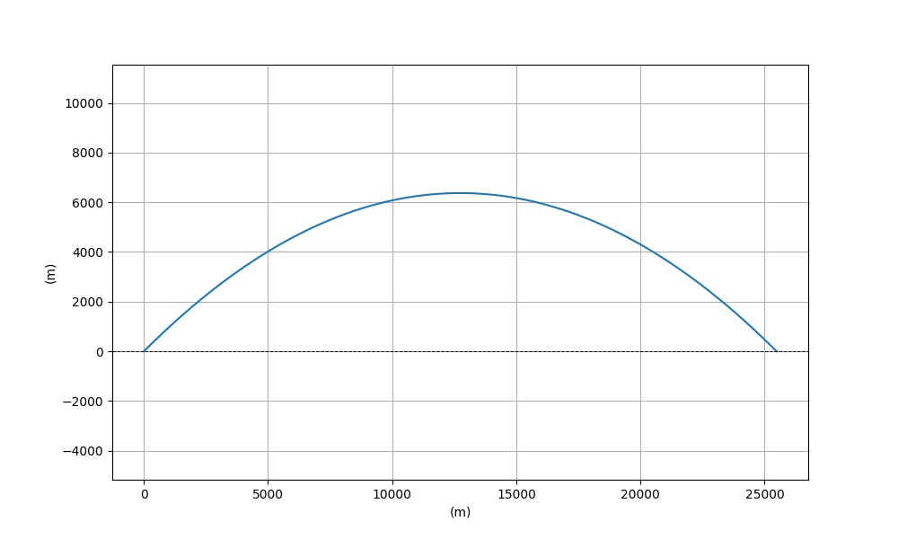
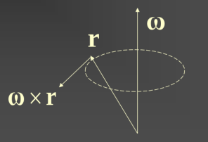
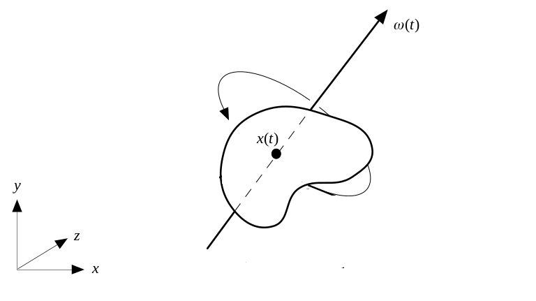
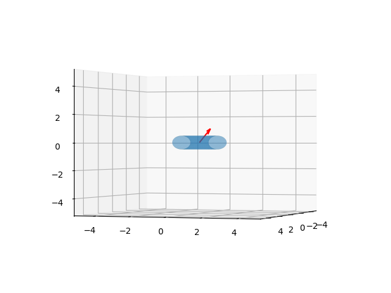
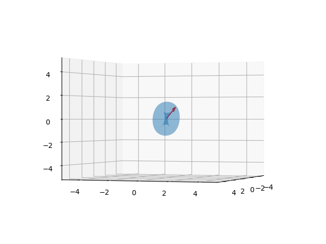

# Hareketin Katı-Gövde Denklemleri - 1

Runge-Kutta Hesabı

İleride lazım olacak bir hesapsal yöntemi görelim, katı gövde cisimlerinin
hareketi için diferansiyel denklemleri entegre etmemiz gerekiyor, bunun
için Runge-Kutta yaklaşımını bir örnek üzerine görebiliriz.

Not: Alttaki örnekte ilk uygulanan kuvvet bir başlangıç lineer hıza
dönüştürüldü. Bu gösterim amaçlı yapıldı, sonraki örneklerde ilk
uygulanan kuvveti direk momentuma çevireceğiz.

Örnek

İki boyutlu ortamda ağırlığı $m=1$ kg olan bir topu 45 derece açıyla
sağ yukarı doğru atıyoruz, uyguladığımız kuvvet 500 Newton. Bu topun
gidiş yönü nasıl hesaplanır?

Sistem denklemi şöyle entegre edilir, sistem $\dot{x} = v_x$, $\dot{y}
= v_y$ $\dot{v} = a$. Sürekli etki eden tek ivme etkisi yerçekimi
$g$. Sistem bir vektör üzerinden temsil edilebiliyor,

$$
\left[\begin{array}{c}
\dot{x} \\ \dot{y} \\ \dot{v}
\end{array}\right] = F(\vec{x},t)
$$

```python
import numpy as np
import matplotlib.pyplot as plt

def rk4_step(func, dt, t, y):
    k1 = dt * func(t, y)
    k2 = dt * func(t + 0.5 * dt, y + 0.5 * k1)
    k3 = dt * func(t + 0.5 * dt, y + 0.5 * k2)
    k4 = dt * func(t + dt, y + k3)
    return y + (k1 + 2*k2 + 2*k3 + k4) / 6

def projectile_motion_eom(t, X):
    x, y_pos, vx, vy = X

    g = 9.81  # yercekimi
    m = 1     # topun kutlesi

    dx_dt = vx
    dy_dt = vy
    dvx_dt = 0.0 
    dvy_dt = -g  

    return np.array([dx_dt, dy_dt, dvx_dt, dvy_dt])

m = 1.0
initial_force = 500.0  # baslangic kuvveti, Newton 
force_direction = np.array([1.0, 1.0])
force_direction = force_direction / np.linalg.norm(force_direction) 

dt = 0.01  # zaman dilimi (saniye)

# Initial position [x0, y0]
x0 = 0.0
y0 = 0.0

initial_acceleration = initial_force / m * force_direction
initial_velocity_magnitude = initial_force / m 
                                                                                                                                             
initial_velocity_vector = initial_velocity_magnitude * force_direction
vx0 = initial_velocity_vector[0]
vy0 = initial_velocity_vector[1]

print(f"Baslangic Hizi: [{vx0:.2f} m/s, {vy0:.2f} m/s]")

initial_state = np.array([x0, y0, vx0, vy0])

time_points = [0.0]
state_history = [initial_state]
current_state = initial_state
current_time = 0.0

while current_state[1] >= 0:
    current_state = rk4_step(projectile_motion_eom, dt, current_time, current_state)
    current_time += dt
    if current_state[1] < 0: break

    time_points.append(current_time)
    state_history.append(current_state)

state_history = np.array(state_history)
x_positions = state_history[:, 0]
y_positions = state_history[:, 1]
vx_values = state_history[:, 2]
vy_values = state_history[:, 3]

plt.figure(figsize=(10, 6))
plt.plot(x_positions, y_positions)
plt.xlabel('(m)')
plt.ylabel('(m)')
plt.grid(True)
plt.axhline(0, color='black', linestyle='--', linewidth=0.7) # yer
plt.axis('equal') 
plt.savefig('phy_005_basics_05_05.jpg')

print(f"\nBitis Zamani: {time_points[-1]:.2f} saniye")
print(f"Son yer: x = {x_positions[-1]:.2f} m, y = {y_positions[-1]:.2f} m")
print(f"Son hız: vx = {vx_values[-1]:.2f} m/s, vy = {vy_values[-1]:.2f} m/s")
```

```
Baslangic Hizi: [353.55 m/s, 353.55 m/s]

Bitis Zamani: 72.08 saniye
Son yer: x = 25484.13 m, y = 0.07 m
Son hız: vx = 353.55 m/s, vy = -353.55 m/s
```




Rotasyon Matrisi ve Türevi

Bir 3 x 3 dönüş matrisi ile herhangi bir vektörü döndürebileceğimizi biliyoruz.
Yersel taşıma daha da basit, 3 boyutlu bir vektör sadece, mevcut konuma
ekleyerek yeni konumu elde ediyoruz.

Bir katı gövdeyi parçacıkları üzerinden alırsak, ve bu gövdenin açısal dönüşsel
olarak hangi yöne baktığını bir dönüş matrisi $R$ ile temsil edersek, her
parçacık üzerinde bu işlemin uygulandığını düşünebiliriz. Ayrıca konumsal
taşınma ve bakılan yön başlangıçtaki bir "gövde uzayı''na (body space) göre
yapılabilir, gövdenin kütle merkezini dünya kordinatlarının (0,0,0) orijin
noktasında ve yönü herhangi bir (başta belli) yöne doğru alalım, hareketler hep
bu konuma referansla, onu değiştirecek şekilde düşünülebilir.  Mesela gövde
üzerindeki, gövde uzayındaki, herhangi bir $p_0$ noktasını düşünelim, $t$ anında
bu noktanın dünya uzayındaki konumu

$$
p(t) = R(t) p_0 + x_{CM}(t)
$$

ki $x_{CM}(t)$ bir yersel taşınma, ve $R(t)$ açısal dönüş. Tabii taşınma her
zaman kütle merkezine uygulandığı için $x_{CM}$ aynı zamanda kütle merkezinin
her $t$ anında dünya uzayında olduğu yeri de gösteriyor.


Türeve gelirsek, bir vektör $r$'nin orijin etrafında döndüğünü
düşünelim. Herhangi bir anda bu dönüşün açısal hızı $\omega$ çapraz çarpımla
hesaplanabilir,



Hız tabii ki sonsuz küçük zamandaki yer değişimi olduğu için onu

$$
\frac{\mathrm{d} r}{\mathrm{d} t} = \omega \times r
$$

olarak ta görebiliriz. Şimdi bir katı gövdeyi düşünelim, onun baktığı yön
(orientation) bir matris $R$ içinde. Bu matrisin her kolonunda bir eksen var,
ilk kolon $x$, ikinci $y$, vs. Eğer gövdenin baktığı yönü $R$ ile temsil
ediyorsak tüm bu kolonlar gövde dönerken değişecektir. Eğer dönüş $\omega$ ise
her eksenin açısal hızı $\omega$ demek, o zaman bu eksenlerin, $b,c,d$ diyelim,
açısal hızı ayrı ayrı $\omega \times b$, $\omega \times c$, $\omega \times d$
olarak bulunabilir, ki bunların her biri aynı zamanda ayrı birer türevdir. Tüm
matrisin türevi

$$
\frac{\mathrm{d} R}{\mathrm{d} t} = \tilde \omega \cdot R
$$

ki $\tilde \omega$ ile $\omega$'yi eksi bakışımlı [4] bir matris hale getirdik,
böylece çapraz çarpımı noktasal çarpım haline çevirmiş oluyoruz [5, sf. 9], [3].

Devam edelim, diğer konuları daha önce bir gövdenin her bakımdan konumunu,
statüsünü temsil etmek için gerekli matematiği gördük. Bu konumu
$\overline{X}(t)$ ile gösterebiliriz,

$$
\overline{X} = \left[\begin{array}{c}
x_{CM}(t) \\ R(t) \\ P(t) \\ L(t)
\end{array}\right]
$$

Momentum $P(t) = v(t) M$ olduğu için $v(t) = \frac{P(t)}{M}$.

$I(t)$'yi yukarıda gördük, $I(t) = R(t) I_{body} R(t)^T$.

$L(t) = I(t) \omega(t)$ olduğu için $\omega(t) = I(t)^{-1} L(t)$

Hepsini biraraya koyunca $\overline{X}$'nin türevi

$$
\frac{\mathrm{d}}{\mathrm{d} t} \overline{X}(t) =
\frac{\mathrm{d}}{\mathrm{d} t}
\left[\begin{array}{c}
x_{CM}(t) \\ R(t) \\ P(t) \\ L(t)
\end{array}\right]
=
\left[\begin{array}{c}
v(t) \\ \tilde \omega \cdot R(t) \\ F(t) \\ \tau(t)
\end{array}\right]
$$

Katı-Gövde Simülasyonu

Dönüş

Bir örnek gövde üzerinde simülasyon yapmaya uğraşalım. Elimizde bir simit, ya da
geometride torus denen bir şekil var. Bu dosya STL denen bir format içinde,
detaylar için [6]. Kuvvet uygulama sonrası lineer ve açısal momentum içeren
simülasyon için pek çok değişkeni diferansiyel tanımları üzerinden entegre
etmemiz gerekiyor, daha basit bir örnek ile, özellikle sabit bir açısal hız
üzerinden salt döndürme ile başlamak uygun olabilir. [2]'te tarif edilen
döndürme matrisi türevini hatırlarsak,

$$
\frac{\mathrm{d} R}{\mathrm{d} t} = \tilde \omega \cdot R
$$

Döndürmeyi bir $\omega$ etrafında düşünüyorduk, $\omega$'nin büyüklüğü
açısal dönme hızına tekabül ediyordu, ve $\tilde \omega$ eksi-bakışımlı
matris idi.



Tüm bunları entegre edici `odeint` çağrısının kabul edeceği bir formda
nasıl kullanırız? Bu çağrı düzleştirilmiş bir liste içinde diferansiyel
sonuçların, ve ana değişkenlerin olmasını bekliyor. O zaman $R$'yi kolon bazlı
olmak üzere düzleştiririz, ve gerektiği o listeden matris formuna geçeriz, vs.

```python
from scipy.integrate import odeint
from stl import mesh

def skew(a):
   return np.array([[0,-a[2],a[1]],[a[2],0,-a[0]],[-a[1],a[0],0]])

your_mesh = mesh.Mesh.from_file('torus.stl')
prop = your_mesh.get_mass_properties()
R0 = np.eye(3,3)
omega = np.array([1.0,1.0,1.0])
#omega = np.array([0.0,1.0,0.0])
skew_omega = skew(omega)
   
def dRdt(u,t):   
   R1x,R1y,R1z,R2x,R2y,R2z,R3x,R3y,R3z = u
   R = np.array([R1x,R1y,R1z,R2x,R2y,R2z,R3x,R3y,R3z])
   R = R.reshape((3,3)).T
   res = np.dot(skew_omega, R)
   return list(res.T.flatten())

LIM = 5
STEPS = 20
t=np.linspace(0.0, 3.0, STEPS)
R0 = np.eye(3,3)
u0 = R0.flatten()
u1=odeint(dRdt,list(u0),t)
```

Üstte görülen mesela `R1x` $R$ matrisinin 1'inci kolonunun $x$ değişkeni
anlamında.

Simülasyonda simit şeklinin baktığı yön $R$ içinde, ve grafik amaçlı olarak her
seferinde simit şeklini sıfırdan yükleyip son $R$'ye ilerletiyoruz, ve her
adımda bu grafiği basıyoruz. Simülasyonu hesapladık, tüm sonuç `u1`
içinde, görüntüden bazı seçilmiş kareler altta görülebilir,

```python
import matplotlib.pyplot as plt
from mpl_toolkits import mplot3d

def plot_vector(fig, orig, v, color='blue'):
   ax = fig.gca(projection='3d')
   orig = np.array(orig); v=np.array(v)
   ax.quiver(orig[0], orig[1], orig[2], v[0], v[1], v[2],color=color)
   ax = fig.gca(projection='3d')  
   return fig

for i in range(STEPS):
    fig = plt.figure()
    axes = mplot3d.Axes3D(fig)
    your_mesh = mesh.Mesh.from_file('torus.stl')
    R = u1[i].reshape((3,3)).T
    your_mesh.rotate_using_matrix(R)
    scale = your_mesh.points.flatten()
    axes.add_collection3d(mplot3d.art3d.Poly3DCollection(your_mesh.vectors,alpha=0.3))
    plot_vector(fig, [0,0,0], omega, color='red')
    axes.auto_scale_xyz(scale, scale, scale)
    axes.set_xlim(-LIM,LIM);axes.set_ylim(-LIM,LIM);axes.set_zlim(-LIM,LIM)
    axes.view_init(azim=20,elev=0)
    plt.savefig('/tmp/rotate_%02d.png' % i)  
```






```python
! convert -delay 20 -loop 0 /tmp/rotate*.png /tmp/torus_rotate1.gif
```

Animasyon sonucu [1]'de.

Torus şekli hakkında bazı istatistikler alttadır.

```python
from stl import mesh

your_mesh = mesh.Mesh.from_file('torus.stl')

prop = your_mesh.get_mass_properties()
print ('hacim',np.round(prop[0],3))
print ('yercekim merkezi (COG)',np.round(prop[1],3))
print ('COG noktasinda atalet matrisi')
print (np.round(prop[2],3))
```

```
hacim 4.918
yercekim merkezi (COG) [-0.  0. -0.]
COG noktasinda atalet matrisi
[[ 3.223 -0.     0.   ]
 [-0.     3.223  0.   ]
 [ 0.     0.     5.832]]
```

COG sıfır noktasında olması, ayrıca atalet matrisinin köşegen olması mantıklı
çünkü simit şekli simetrik.

Üstteki simülasyonda kuvvetler, lineer, açısal momentum gibi kavramlar
gösterilmedi, bir sonraki yazıda tüm kavramların olduğu bir simülasyon olacak,
yazıda dönüş matematiği de sayısal açıdan daha sağlam farklı bir yaklaşım
kullanıyor olacak.

Atalet Matrisi ve Dönüşler

Daha önce atalet matrisi $I(t)$'yi görmüştük,

$$
I(t) = \sum \left[\begin{array}{ccc}
m_i (y_i^2 + z_i^2) & -m_i x_i y_i & m_i x_i z_i \\
-m_i y_i x_i & m_i (x_i^2 + z_i^2) & -m_i y_i z_i \\
-m_i z_i x_i & -m_i z_i y_i & m_i (x_i^2 + y_i^2)
\end{array}\right]
$$

Burada $x,y,z$ değerleri gövde uzayında, her nokta $r_i'$ için $x_i,y_i,z_i$
değerleri $r_i - \chi(t)$ içeriğiyle hesaplanıyor. Ayrıca bir obje dönerse, onun
belli noktalarının eksenden olan uzaklıkları değişir ve farklı bir $I$ elde
ederiz... fakat üstteki hesabı obje hareket ederken sürekli yapmak oldukca
külfetlidir. Acaba $I$'nin bir baz kısmını hesaplasak, sonra dönüşe göre onu
güncellesek olmaz mı?

Bunun bir yolu var [5, sf. 14]. $r_i'^T r_i' = x_i^2 + y_i^2 + z_i^2$ olduğundan
hareketle, önceki $I$ denklemini şu şekilde yazabiliriz,

$$
I(t) = \sum
m_i r_i'^T r_i' \left[\begin{array}{ccc}
1 & 0 & 0 \\ 
0 & 1 & 0 \\ 
0 & 0 & 1 
\end{array}\right] -
\left[\begin{array}{ccc}
m_i x_i^2 & -m_i x_i y_i & m_i x_i z_i \\
-m_i y_i x_i & m_i y_i^2 & -m_i y_i z_i \\
-m_i z_i x_i & -m_i z_i y_i & m_i z_i^2
\end{array}\right]
$$

Simdi en sağdaki matrise dikkat edelim, onu bir dış çarpım (outer product)
olarak temsil edebiliriz, alttaki gibi,

$$
r_i' r_i'^T = \left[\begin{array}{c}
x_i \\ y_i \\ z_i
\end{array}\right]
\left[\begin{array}{ccc}
x_i & y_i & z_i
\end{array}\right] =
\left[\begin{array}{ccc}
x_i^2 &  x_i y_i &  x_i z_i \\
y_i x_i & y_i^2 & y_i z_i \\
z_i x_i & z_i y_i & z_i^2
\end{array}\right]
$$

Bunu kullanarak ve 3 x 3 boyutlu birim matrisini $\overline{1}$ ile göstererek
(normalde bu matris için $I$ notasyonu kullanılır ama o hard bu yazıda
kapılmış durumda),

$$
I(t) = \sum m_i ((r_i'^T r_i') \overline{1} - r_i' r_i'^T)
$$

Bu nasıl faydalı? Çünkü $r_i(t) = R(t) r_{0i} + x_{CM}(t)$ ki $r_{0i}$
başlangıçtaki kütlede $i$ parçacığın yeri, ve sabit, o zaman

$$
r_i(t) - x_{CM}(t) = R(t) r_{0i} = r_i'(t)
$$

Şimdi $r_i'(t) = R(t) r_{0i}$ eşitliğini iki üstteki formülde kullanırsak,

$$
I(t) = \sum
m_i ( (R(t) r_{0i})^T  (R(t) r_{0i})  \overline{1} -  (R(t) r_{0i})  (R(t) r_{0i})^T  )
$$

$$
= \sum
m_i ( r_{0i}^T R(t)^T R(t) r_{0i} \overline{1} -  R(t) r_{0i} r_{0i}^T R(t)^T )
$$

$R(t)$ dikgen, ortonormal matris oldugu icin $R(t)^TR(t) = \overline{1}$

$$
= \sum
m_i ( (r_{0i}^T r_{0i}) \overline{1} -  R(t) r_{0i} r_{0i}^T R(t)^T )
$$


Üstteki formülde ikinci terimde $R(t) .. R(t)^T$ ifadesi var, bunu
birinci terime de eklemek için, ve $r_{0i}^T r_{0i}$ bir tek sayı değer
olduğu için ve $R(t) R(t)^T$'nin birim matris olmasından hareketle,

$$
= \sum
m_i ( R(t) (r_{0i}^T r_{0i}) R(t)^T \overline{1} -  R(t) r_{0i} r_{0i}^T R(t)^T )
$$

Böylece $R(t)$ ve $R(t)^T$ dışarı çekilebiliyor,

$$
= R(t) \left( \sum 
m_i (( r_{0i}^T r_{0i}) \overline{1} -  r_{0i} r_{0i}^T
\right)  R(t)^T 
$$

Böylece parantez içindeki, $I_{body}$ denebilecek değerler parçacıkların
gövdenin ilk konumundaki yerlerine (ve değişmeyen kütle $m_i$ değerine) göre
hesaplanabileceği için, onu bir kez hesaplayabiliriz, ve sonra ona $R(t)$'leri
uygulayarak istediğimiz güncel $I(t)$ değerini elde ederiz [5, sf. 15].

$$
I(t) = R(t) I_{body} R(t)^T
$$

$I$'nin tersi $I_{body}^{-1}$ de gerekli (niye birazdan göreceğiz) fakat bu
hesap ta başta hesaplanıp depolanabilir, çünkü

$$
I^{-1} = ( R(t) I_{body} R(t)^T )^{-1} 
$$

$$
(R(t)^T)^{-1} I_{body}^{-1} R(t)^{-1} 
$$

$$
= R(t) I_{body}^{-1} R(t)^T
$$

$R(t)^T = R(t)^{-1}$ ve $R(t)^T = R(t)$ olduğunu hatırlayalım çünkü $R(t)$
orthonormal, dikgen bir matris. 

Kaynaklar

[1] Bayramlı, *Animasyon 1*,
    [https://www.dropbox.com/scl/fi/l9wjyc2nar8bwucasfqpf/torus_rotate1.gif?rlkey=mhnye63g5auddh7m3e993ic43&st=ttluuezu&raw=1](https://www.dropbox.com/scl/fi/l9wjyc2nar8bwucasfqpf/torus_rotate1.gif?rlkey=mhnye63g5auddh7m3e993ic43&st=ttluuezu&raw=1)

[2] Bayramlı, *Fizik, Temel Fizik 4, Katı Gövde*

[3] Rotenberg, *CSE169: Computer Animation, UCSD*

[4] Bayramlı, *Lineer Cebir, Ders 5*

[5] Witkin, *Physically Based Modeling*

[6] Bayramlı, *3D Baskıya Hazır CAD Tasarımlarına Erişmek, Numpy-STL*,
    [https://burakbayramli.github.io/dersblog/sk/2020/08/numpy-stl.html](https://burakbayramli.github.io/dersblog/sk/2020/08/numpy-stl.html)


