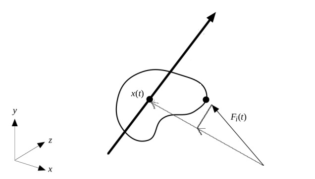

# Hareketin Katı-Gövde Denklemleri - 2

Daha önce rotasyon matrisi bazlı hareket denklemlerini vermiştik. Bu yazıda
cisim duruşu ve dönüş mekaniğini kuaterniyon kavramı üzerinden hesaplayacağız,
daha önce görülen bazı kavramların da tekrar üzerinden geçeceğiz.

Lineer Hız, Momentum

Cisim yeri ve hızı şöyle alakalı,

$$
\frac{\mathrm{d} x(t)}{\mathrm{d} t} = v(t)
$$

Katı gövdenin momentumu

$$
p(t) = m v(t)
$$

Newton'un ikinci kanununa gore,

$$
\frac{\mathrm{d} p(t)}{\mathrm{d} t} = F(t)
$$

Yani momentumun zamansal türevi kuvvettir. Hareket hesaplarında $F$ entegre
edilerek $p$ hesaplanır, $p$'yi $m$ ile bölerek $v$ elde ederiz, ve onu entegre
ederek cisim yeri $x$ elde edilir [1, sf. 466].

Açısal Momentum

Lineer momentum kavramı anlaşılması kolay, onu bir tür atalet olarak görüyoruz,
hareket eden bir objenin düz bir çizgi üzerindeki hareketini devam ettirmeye
olan meyili. Tabii ki bu meyil, hareketin devamlılığı o anki hız ve cismin
kütlesiyle orantılı, $mv$ buradan geliyor. Açısal momentum da benzer bir kavram,
tek fark bir eksen etrafında dönmekte olan bir cismin dönmeye devam etme meyili.
O zaman üç boyutta, orijin etrafındaki açısal momentum $\vec{L}$, $m$ kütleli
cismin orijine olan uzaklığı $\vec{r}$ ile $m\vec{v}$ çapraz çarpımıdır [1, sf. 42].

$$
L = r \times p = r \times mv
$$

Aynen kuvvetin momentumun zamansal türevi olması gibi, tork benzer şekilde
açısal momentumun türevidir, bunu görmek için üstteki $L$'nin türevini alalım,

$$
\frac{\mathrm{d} L}{\mathrm{d} t} = \frac{\mathrm{d} (r \times p)}{\mathrm{d} t}
$$

Eşitliğin sağındaki türev zincirleme kuralı ile şöyle açılır,

$$
= r \times \frac{\mathrm{d} p}{\mathrm{d} t} + \frac{\mathrm{d} r}{\mathrm{d} t} \times p
$$

$\mathrm{d} p / \mathrm{d} t = F$, $\mathrm{d} r / \mathrm{d} t = v$ olduğunu biliyoruz, üstte yerine
geçirelim,

$$
= r \times F + v \times p
$$

Fakat $v$ ile $p$ aynı yöne işaret eden vektörler, onların çapraz çarpımı sıfır,
geri kalanlar,

$$
\frac{\mathrm{d} L}{\mathrm{d} t} = r \times F = \tau
$$

Bir diğer eşitlik

$$
L(t) = J(t) w(t)
$$

Bu formül açısal momentum ile açısal hız $w$ (diğer kaynaklarda $\omega$) ile
ilişkilendirir, lineer momentum'daki kütle yerine burada $J$ (diğer kaynaklarda
$I$ diye geçer) var, ki $J$ bir atalet tensoru, objenin şekline, ağırlık
dağılımına göre değişir, ve bu değerin kendisi de obje döndükçe değişime uğrar.

Hesaplarda gereken uygulanan tork $\tau(t)$'un sebep olduğu cisim dönüşünü
bulmak, bunun için $\tau$ entegre edilerek $L$ elde edilir, $L$ değeri $J$ ile
bölünerek (daha doğrusu $J$ bir matris olduğu için onun tersi alıp çarpılarak)
$w$ elde edilir. Kuaterniyon durumunda

$$
\frac{\mathrm{d} q(t)}{\mathrm{d} t} = \frac{1}{2} \omega(t) q(t)
$$

entegre edilerek objenin dönüş sonrası yeni işaret ettiği yer bulunur (burada
$\omega$ açısal hızı temsil eden kuaterniyon). Üstteki denklemi türetmek
gerekirse [4, sf. 264] kaynağına başvurulabilir. Herhangi iki kuaterniyonun bir
geçiş kuaterniyonu ile birbirine bağlanabildiğini biliyoruz. O zaman ufak bir
zaman dilimi $\Delta t$ içinde $q(t)$ ve $q(t + \Delta t)$ kuaterniyonlarının
nasıl ilişkili olduğuna bakarız, yani aradığımız bir $\Delta r(t)$ öyle ki

$$
q(t + \Delta t) = q(t) \Delta r(t)
$$

olsun, ve

$$
\Delta r(t) = \cos (\Delta \alpha) + v(t) \sin(\theta \alpha)
$$

Üstteki formülü kuaterniyon tanımından [3] biliyoruz, dönüş açısı $2 \Delta
\alpha$, ve etrafında dönüşün yapıldığı eksen vektör $v(t)$.

Dönüş açısı $\Delta \alpha$ çok ufak, bu sebeple küçük açı yaklaşıklaması [5]
üzerinden $\cos(\Delta \alpha) \approx 1$, $\sin(\Delta \alpha) \approx \Delta
\alpha$, o zaman

$$
\Delta r(t) = 1 + v(t) (\Delta \alpha)
$$

Bu demektir ki

$$
q(t + \Delta t) = q(t) [1 + v(t) (\Delta \alpha)]
$$

$$
 = q(t)  + q(t) v(t) (\Delta \alpha)
$$

$$
\Rightarrow q(t + \Delta t) - q(t) = q(t) v(t) (\Delta \alpha)
$$

Şimdi her iki tarafı $\Delta t$ ile bölüp limit uygularsak,

$$
\frac{\mathrm{d} q}{\mathrm{d} t} = \lim_{\Delta t \to 0} \frac{q(t + \Delta t) - q(t)}{\Delta t}
$$

$$
= \lim_{\Delta t \to 0} \frac{q(t) v(t) (\Delta \alpha)}{\Delta t}
$$

Dikkat edersek skalar $\Delta \alpha$ değişimi $\Delta t$ ile bölünüyor, bu bize
skalar açısal değişim $\omega(t)$'yı verir. Bu açısal hızın vektör $v(t)$ ile
çarpılması ise $v(t)$ etrafındaki skalar açısal değişim $\vec{\omega}(t)$'yı
verir, yani

$$
= q(t) v(t) \omega(t) = q(t) \vec{\omega}(t)
$$

Son formül dönüş açısı $2 \Delta \alpha$ içindi, eğer $\Delta \alpha$
istiyorsak, formülü $1/2$ ile çarparız. Böylece 

$$
\frac{\mathrm{d} q(t)}{\mathrm{d} t} = \frac{1}{2} \vec{\omega}(t) q(t)
$$

formülüne erişmiş olduk. $q(t)$ için gereken entegrasyon üstteki formül
üzerinden yapılır.

Not: Hesapsal hataların birikmemesi için $q(t)$'yi sürekli normalize etmek
iyi bir fikirdir, bu normalizasyon

$$
q(t) = \frac{\hat{q(t)}}{|\hat{q(t)}|}
$$

ile gerçekleştirilebilir [1, sf. 468].

Açısal hız: diyelim $\omega$ radyan/saniye birimli açısal hız, ve kuaterniyon
olarak paylaşılmış. Eğer bir zaman dilimi $\Delta t$ içinde $\omega$ sabit ise,
bu zaman sonrası toplam dönüş $q'$ ne olurdu? Bu durumda formül,

$$
q' = q + \frac{\Delta t}{2} \omega q
$$

olur, ki $\omega$ yine kuaterniyon olarak gösterilen açısal hız.

Hepsini bir araya koyarsak entegrasyonun uygulanacağı nihai yapı şu şekilde
gösterilebilir,

$$
\frac{\mathrm{d}}{\mathrm{d} t}
\left[\begin{array}{c}
x \\ q \\ p  \\ L
\end{array}\right] =
\left[\begin{array}{c}
\dot{x} \\ \dot{q} \\ \dot{p}  \\ \dot{L}
\end{array}\right] =
\left[\begin{array}{ccc}
m^{-1} p \\ \omega q / 2 \\ F \\ \tau
\end{array}\right]
$$

Başlangıç Kuvvetleri

Şimdi "sıfırıncı anda'' yani ilk başlangıçta uygulanan kuvvetleri, lineer,
açısal, hesaplamak lazım. Obje üzerinde uygulanan noktaya bildiğimizi
farzedelim, sonu o noktada başlangıcı nesne ağırlık merkezinde olan bir vektör
ile kuvvet vektörü arasında çapraz çarpım yapıyoruz, bu bize torku veriyor.


Benzer şekilde sonu nesne merkezinde başı o noktada olan bir vektör daha var,
lineer kuvvet bu doğrultuda uygulanacak, o vektör üzerine iki üstte görülen
kırmızı vektörü yansıtıyoruz, bu da lineer kuvvet oluyor. Bir üstteki resim
üzerinde gösterirsek,



Daha önce söylediğimiz gibi her iki kuvvet de ilk anda lineer ve açısal
momentumu ekileyen faktörler, sonraki adımlarda etkileri yok.

Başlangıç torku ve kuvvetin nasıl başlangıç hızına çevirilecebileceğini daha
önceki derste gördük.

Uygulanan kuvveti şöyle seçelim, STL objesi üzerindeki üçgenlerden birinin
köşesini son nokta olarak alalım, uzayda herhangi bir noktası başlangıç
noktası olarak alalım, ve ilk kuvvet bu vektör olsun.

```python
import numpy.linalg as lin
from mpl_toolkits import mplot3d
from stl import mesh

mesh1 = mesh.Mesh.from_file('../../sk/2020/08/shapes/Prism_hexagon.stl')

def plot_vector1(fig, orig, v, color='blue'):
   '''
   baslangıcı orig olan v büyüklüğü/yönünde olan vektorü çiz
   '''
   ax = fig.gca(projection='3d')
   orig = np.array(orig); v=np.array(v)
   ax.quiver(orig[0], orig[1], orig[2], v[0], v[1], v[2],color=color)
   ax = fig.gca(projection='3d')  
   return fig

def plot_vector2(fig, torig, tend, color='blue'):
   '''
   baslangic torig bitis tend olmak uzere bir vektor ciz
   '''
   ax = fig.gca(projection='3d')
   v = tend - torig
   ax.quiver(torig[0], torig[1], torig[2], v[0], v[1], v[2],color=color)
   ax = fig.gca(projection='3d')  
   return fig

tidx = 7
f0 = np.array([40,20,10])
f1 = mesh1.vectors[tidx][0]
cog = mesh1.get_mass_properties()[1]

a = f1-f0
b = cog-f0
flin = (a.dot(b) / (lin.norm(b)**2))*b

tau = np.cross(f1-cog,f1-f0)
figure = plt.figure()
ax = mplot3d.Axes3D(figure)
obj = mplot3d.art3d.Poly3DCollection(mesh1.vectors)
obj.set_edgecolor('k')
obj.set_alpha(0.3)
ax.add_collection3d(obj)
plot_vector2(figure, f0, f1)
plot_vector1(figure, cog, tau, color='cyan')
plot_vector1(figure, f0, flin, color='cyan')
ax.plot(cog[0], cog[1], cog[2], 'gs')
ax.set_xlim(30,70);ax.set_ylim(-10,30); ax.set_zlim(-10,30)
ax.text(65,0,8,r'$\tau$',fontsize=20)
ax.text(35,5,8,r'$F$',fontsize=20)
ax.text(35,5,-3,r'$F_{cog}$',fontsize=20)
ax.view_init(elev=20, azim=40)
plt.savefig('phy_005_basics_06_01.jpg')
```


Kuvvet uygulama yönü ve onun kütle merkezine doğru olan yansıması gösterildi,
ayrıca yerçekim merkezi de bir ufak küp olarak nesne içinde belirtiliyor.
Merkeze olan bileşen kuvveti gösteren vektörün üçü tabii ki merkeze dokunuyor
olmalı, biz burada gösterim amaçlı olarak hem kuvveti hem de bileşenini aynı
başlangıçtan gösterdik. Yansıtma hesabı için bkz [6]. Tork vektörü de
hesaplanıyor, ve COG çıkışlı olarak gösteriliyor. Objenin dönüşü bu vektör
etrafında ve vektörün büyüklüğüne oranlı hızda olacaktır.


[devam edecek]

Kaynaklar

[1] Eberly, *Game Physics 2nd Ed*

[2] Bayramlı, *Diferansiyel Denklemler Ders 2*

[3] Bayramlı, *Döndürme (Rotation) - 2*

[4] Kuipers, *Quaternions and Rotation Sequences*

[5] Bayramlı, *Normal Diferansiyel Denklemler, Trigonometri*

[6] Bayramlı, *Lineer Cebir Ders 15*


