# Materyel Mekaniği - 1

Eksenel Yükleme (Uniaxial Loading)

Pek çok problemde kullanılan en temel deformasyon (yamulma, şekil değiştirme)
türü altta görülen tür yüklemedir. Bir demir, ya da plastik çubuk iki kuvvetle
boyu yönünde (tek bir eksende yani) iki tarafa doğru çekilir, bizim
ilgilendiğimiz çubukta seçilen herhangi bir noktanın nereye gittiği, yani o tek
eksendeki deformasyonun ne olduğu.

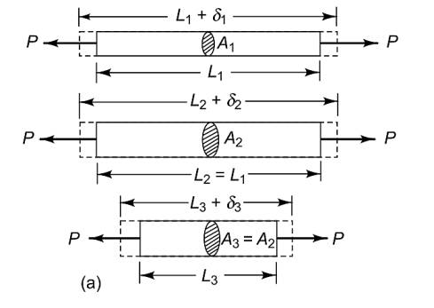

Diyelim ki üstteki her üç çubuk aynı maddeden yapılmış, farklı uzunlukları ve
kalınlıkları var, her çubuğa sıfırdan başlayarak belli seviyelerde $P$ kuvveti
ile yük uyguluyoruz, ve çubuğun uzunluk değişimi (elongation) $\delta$
değerinin, ki tek boyuttaki deformasyon budur, ne olduğuna bakıyoruz. Her 1,2,3
çubuğu için $P/A$ ve $\delta/L$ değerlerini grafiklersek çoğunlukla sonuç ya alt
soldaki gibi ya da sağdaki gibi çıkacaktır [1, sf. 76].

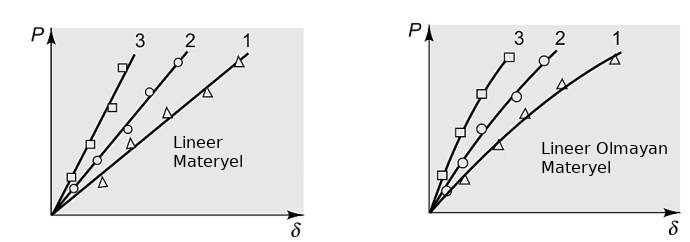

Eğer materyelin eksenel yük ve uzama ilişkisi lineer ise o zaman sonuç soldaki
resim gibi çıkar. Grafiğin eğimine elastiklik genliği (modulus of elasticity)
adı verilir ve çoğunlukla ona $E$ sembolü verilir. Formülsel olarak belirtirsek,

$$
E = \frac{P/A}{\delta / L}
\qquad (1)
$$

$E$ formülüne Young'in Genliği (Young's Modulus) ismi de verilir. 

$\delta/L$ büyüklüğü mevcut büyüklüğe nazaran ne kadar uzama olduğunu gösteren
bir oran, mesela 200 cm için 2 cm büyüme var ise 2/200, bu bir tür yüzde hesabı
olarak görülebilir (ek olarak yüz ile de çarpmak gerekir ama aşağı yukarı öyle).

Not: $P$ çoğunlukla basınç (pressure) için kullanılır ama burada kuvvet.

$P/A$'nin birimi kuvvet bölü birim alan olduğu ve $\delta / L$ birimsiz olduğu
için $E$'nin birimi de kuvvet bölü birim alan olacaktır. Daha ileride göreceğiz
ki $P/A$ bir alan $A$ üzerindeki ortalama *stres* değeridir, $\delta / L$
ise $L$ boyunca hissedilen *gerinim* değeridir (strain).

Yani $E$ birimi Newton bölü metrekare olacaktır, $N/m^2$ ya da Pascal, Pa terimi
kullanılabilir. Bazı tipik değerler demir ve çelik için $200\cdot 10^6$ kilo
Newton / $m^2$, aliminyum için $69 \cdot 10^6$ $kN / m^2$.

(1) formülünü düzenleyip tekrar yazarsak, 

$$
\delta = \frac{PL}{AE}
$$

Üstteki formül Hooke Kanunu'nun basit bir formudur aslında; bu isim Robert Hooke
bilimcisine atfendir, ki pek çok materyelin yük-deformasyon eğrisinin lineer
olduğunu keşfeden Hooke'tur. Bu arada materyelin eğrisi lineer ise bu durum
sarma yaylar (coiled springs) için de aynıdır. Kavramsal ve formülsel olarak
bir demir çubuğu yay olarak görsek mesela $10^3 mm^2$ genişliğinde ve
1 metre uzunluğunda, Hooke Kanunu

$$
F = k x
$$

ki $F$ kuvvet, $k$ yay sabiti ve $x$ uzama, mevcut semboller ile,

$$
P = k \delta
$$

$$
k = \frac{P}{\delta}
$$

$$
= \frac{P}{PL / AE} = \frac{1}{L / AE} = \frac{AE}{L} =
\frac{10^3 10^{-3} 205}{1} =
205 GN/m
$$

Alan Atalet Momenti (Area Moment of Inertia)

Herhangi bir şekil için, o şekilde olan bir eksene olan uzaklık karesinin alan
üzerinden entegre edilmesiyle "alan atalet momenti'' sonucu elde ediliyor
[4, sf. 362]. 

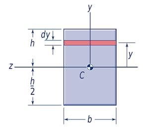

Formül, $z$ eksen bazlı olarak

$$
I_z = \int_A y^2 \mathrm{d} A
$$

Bu entegral belli şekiller / alanlar için muhakkak hep aynı olur. Üstteki kalıp
bazı alanlarda, mesela inşaat mühendisliğinde, çok ortaya çıktığı için
bilinir, ve belli şekiller için $I$ formülü önceden hesaplanmıştır.

Üstteki basit bir şekil tabii ki, ama onun da bir formülü var, eğer türetmek
istersek,

$$
I_z = \int_{-h/2}^{h/2} y^2 (b \mathrm{d} y) = b \frac{y^3}{3} \bigg\vert_{-h/2}^{h/2} =
\frac{b h^3}{12}
$$

Yani dikdörtgensel şekiller için $I_z$ gerektiğinde hemen üstteki formül
kullanılabilir. Dairesel, üçgensel, vb. pek çok şekil için bu hesap mevcut.

Normal Stres

Materyel mekaniğindeki anahtar kavramlardan biri stres kavramı. Bu kavram kuvvet
kavramı ile alakalı fakat aynı değil [1, sf. 2]. Niceliksel olarak stres iç
kuvvetlerin şiddeti (intensity), ya da etkisi. Etki sözü kuvvetin yayıldığı bir
alanı ima ediyor, o zaman stres

$$
Stres = \frac{Kuvvet}{Alan}
$$

olarak tanımlanabilir, yani stres kuvvetin birim alan üzerinde yarattığı etkiyi,
şiddeti ölçmek için kullanılır. Stres birimi $Newton / m^2$, bir diğer ismi
Pascal (Pa)'dır. Normal stresi hayal edebilmek için alttaki görüntülere bakalım,
bir demir çubuk (bar) olsun, ona eksenel şekilde (ilk resim), tam dikey yönde
$P$ büyüklüğünde bir yük uygulanmış. Eksenel yönde uygulanan ve maddeyi uzatmaya
meyilli kuvvetlere gerilimsel (tension) kuvvetler, ufaltmaya / ezmeye / basmaya
uğraşan kuvvetlere sıkıştırma (compression) kuvvetleri denir. Altta görülen
eksenel kuvvet gerilimsel bir kuvvet.

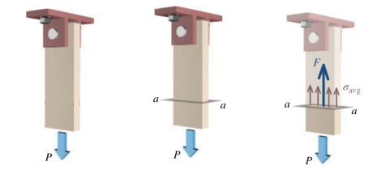

Uygulanan kuvvetin madde içindeki etkilerini görmek için çubuk hayali bir düzlem
ile kesilebilir (üstteki ortadaki resim). Bu kesme ardından ortaya çıkan
kuvvetleri hesaba katmak gerekir, bu durumda bir $F$ vektörü olması gerekir ki
bu vektör $P$'nin tam tersi yönde ona aynı yönde olan büyüklüktedir. Eğer stresi
hesaplamak istersek

$$
\sigma_{avg} = \frac{F}{A}
$$

diyebiliriz, ki $A$ alanı çubuğun kesme düzlemindeki alanıdır.

Bir ortalama elde edildi çünkü kesit üzerindeki tüm kuvvetleri merkeze etki eden
tek bir $F$'ye indirgedik, ve alana böldük. Fakat $\sigma$ görülen kesitin her
noktasında farklı olabilen bir fonksiyon da olabilirdi, üç boyutta
$\sigma(x,y,z)$ gibi. Bu durumda sonsuz küçük alan üzerinden Calculus kullanarak
bir stres tanımı yapmak gerekir,

$$
\sigma = \lim_{\Delta A \to 0} \frac{\Delta F}{\Delta A}
$$

Hesap alttaki resmi referans alıyor,

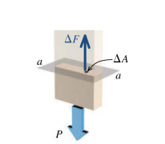

Diğer yönden eğer stresten başlayıp $P$'yi elde etmek istiyorsak,

$$
P = \int \sigma \mathrm{d} A
$$

Yani tüm alan üzerinden her ufak alan parçasında etki eden $\sigma$'ları
entegre edince $P$'ye ulaşıyoruz.

Kesim Stresi (Shear Stress)

Kesim stresi bir yapıyı kopartma, kesme yönünde etki eden streştir. Daha
önce gördüğümüz kesit alanını düşünürsek, o alana dik değil, ona paralel
yöndeki bir etkiden bahsediyoruz. Yapıların dayanıklı olmasını istiyorsak
onları hem normal hem de kesim stres limitlerine göre tasarlamamız gerekir.

Normal strese benzer şekilde, ki hesabı $\sigma = P/A$ idi, kesim stresi kesim
yükü bölü (teğet olunan) alan ile hesaplanır. Alttaki resme bakalım, (a)
resminde $P$ yükü uygulanmış, bu yük iki yük arasındaki hayali bir alan
üzerindeki alanda teğet şekilde bir $\tau$ stresi yaratır. Bu stresin yaratacağı
değişiklik biraz abartılı olsa da (c,d) resimlerinde gösteriliyor.

Resmin abartılı hali gösterim amaçlı fakat kesim stresinin sonuçları hakikaten
ciddi olabilir. Mesela alttaki vida dayanamayacağı bir kesim stresi yüzünden
dikey yönde kopmuştur.

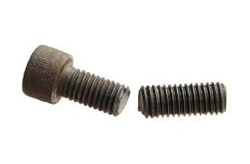

Normal streste olduğu gibi $\tau = V / A$ bir ortalamadır, fonksiyonel bir
$\tau$ limitler ile elde edilebilir, oradan $V$ hesabı $V = \int \tau \mathrm{d} A$. 

Çubuk Bükülme Gerinimi (Beam Bending Strain)

Daha önce gördüğümüz üzere bir normal gerinim $\epsilon$'nin baz tanımı

$$
\epsilon = \Delta L / L
\qquad (2)
$$

ki $L$ mevcut uzunluk, $\Delta L$ uygulanan kuvvet sonucu elde edilen uzama [2].
Bu formülü ufak bir demir çubuk parçasının bükülmesine uygulayabilir miyiz
acaba? 

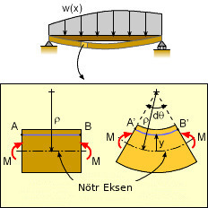

Üstteki resme göre formülleri yazabiliriz. Gösterilen çubuk herhangi bir
çubuk, tipi ve onun üzerindeki yükün dağılımı farketmiyor.

Resimde alt solda bükülme öncesi, sağda sonrası görülüyor, bükülme nötr eksenden
$\rho$ uzaklığındaki bir nokta etrafında ve $\mathrm{d}\theta$ kadar. $\rho$'ya bükülme
çemberinin / eğiminin yarıçapı (radius of curvature) ismi de verilir. Bükülme
öncesi $AB$ uzunluğu mesela görülen mavi çizgi için $A'B'$ haline gelecek. Ama
dikkat edersek nötr eksene yakın noktalar daha az uzayacak, uzaklar daha
fazla.. bu uzaklığı bir $y$ üzerinden temsil edebiliriz. O uzaklığı hesaba katan
bir gerinim formülü nasıl elde ederiz?

Nötr eksene $y$ uzaklığındaki $AB$ bükülme sonrası $A'B'$ oldu ise, bu durumu
(2) bazında belirtelim,

$$
\epsilon = \frac{A'B' - AB}{AB}
$$

Şimdi $A'B'$ hesabına gelelim. Dikkat edersek $A'B'$ ufak bir çember çevresi,
verili yarıçapı ve açı üzerinden bu çember çevresi hesaplanabilir, tüm daire
çevresi muhakkak $2 \pi r$, açısı bilinen ufak parçalar için $\pi \theta$,
burada açı $\theta$ tüm $2 \pi$'ye oranlı, radyan olarak. O zaman

$$
AB = \rho \mathrm{d} \theta
$$

$A'B'$ için ufak dairenin yarıçapı değişir, nötr eksene $y$ kadar uzak isek,
$A'B'$ yarıçapı $\rho - y$, demek ki 

$$
A'B' = (\rho - y) \mathrm{d} \theta
$$

Bunları (2)'ye koyarsak,

$$
\epsilon = \frac{(\rho - y) \mathrm{d} \theta - \rho \mathrm{d} \theta}{\rho \mathrm{d}\theta} =
\frac{\rho \mathrm{d}\theta - y \mathrm{d}\theta - \rho \mathrm{d}\theta}{\rho \mathrm{d}\theta} =
- \frac{y \mathrm{d}\theta}{\rho \mathrm{d}\theta}
$$

$$
\epsilon = - \frac{y}{\rho}
$$

Üstteki gerinim formülünü stres formülüne dönüştürebiliriz, Hooke'un Kanunu
$\sigma = E \epsilon$ üzerinden,

$$
\sigma = -E y / \rho
\qquad (4)
$$

Kirişte Bükülme Momenti (Elastik Durum)

Moment kuvvet çarpı döndürmenin etrafında olduğu merkeze olan mesafe olarak
hesaplanır, tork kavramıyla alakalıdır. Bir musluğu döndürdüğümüzde iki yönden
kuvvet uygularız, her iki kuvvet musluğun merkezine oranla birer tork uygular,
bu bir moment ortaya çıkartır.

Eğer bir kirişe eksenel kuvvet uyguluyorsam bu kirişin bükülmesi de o kirişin
içinde momentler yaratacaktır.

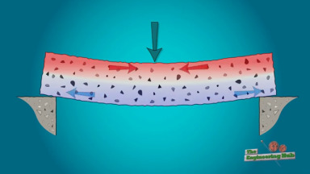

Bükülme resimde görüldüğü gibi kirişin üst kısımlarını sıkıştırmaya, alt
kısımlarını ise esnemeye / çekilmeye mağruz eder. 

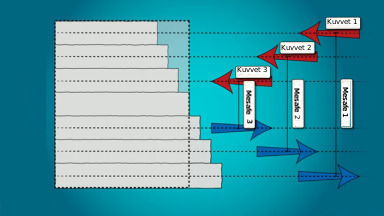

Kirişi yatay ufak kesitlere bölerek bakarsak, üstteki resimdeki gibi, üstteki
şeritlere dışarıdan içe doğru, alttaki şeritlere ise içeriden dışa doğru eksenel
kuvvetler uygulanmış gibi kabul edebiliriz. Normal yöndeki kuvvetler eksenel
yönde birbirini iptal edeceği için o yöndeki etkisi sıfır kabul edilir. Ama o
kuvvetlerin etrafında dönüş olduğu bir nötr eksene olan mesafesini de göz önüne
alırsak, her ufak kesitin uyguladığı bir moment olacaktır.

Üç boyutta şöyle bakalım,

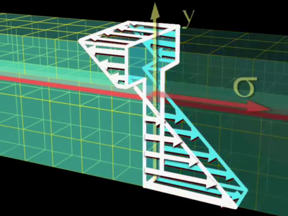

Stres $\sigma$ baktığımız yüzeyde kirişin her noktasındaki ufak $\mathrm{d} A$
alanındaki stresi gösteriyor, $y$ ise nötr eksene olan uzaklık, tork / moment
bu uzaklık (kol) üzerinden uygulanacak.

Her noktadaki kuvvet $F = \sigma \mathrm{d} A$ olur, çünkü stres kuvvet bölü alandır,
moment hesabı için mesafe ile çarparız, yani $y \sigma \mathrm{d} A$. Tüm yüzeydeki
momenti bulmak için [3],

$$
M = - \int_A y \sigma \mathrm{d} A
$$

Eksi işareti saat yönü tersini eksi kabul ettiğimiz için eklendi.

$\sigma = -Ey/\rho$ olduğunu biliyoruz,

$$
M = - \int_A y \left[ \frac{-Ey}{\rho} \right] \mathrm{d} A
$$

Eksiler iptal olur, $y$ parantez dışına çıkar,

$$
M = \int_A y^2 \left[ \frac{E}{\rho} \right] \mathrm{d} A
$$

$E/\rho$ sabit olduğu için entegral dışına alınır,

$$
M = \frac{E}{\rho} \int_A y^2 \mathrm{d} A
$$

Entegral atalet momentidir, ona $I$ diyebiliriz, 

$$
M = \frac{EI}{\rho}
$$

Yani momenti bükülme acısı $\rho$ ve $E,I$ sabitleri ile (ki $I$ kirişin kesit
şekli ile alakalıdır) hesaplayabiliyoruz. Not: $EI$ sabitine literatürde eğilme
esnemezliği (flexural rigidity) ismi verilir.

$\rho$'dan kurtulmak için (4)'ü $\rho$ için düzenleyip üstteki formüle sokarsak,

$$
EI / (-Ey / \sigma )  = M
$$

Basitleştirince

$$
\sigma = - \frac{M y}{I}
$$

Bu formül bükülme normal stres (flexure) formülüdür [2], [6, sf. 364].

Kesme Kuvveti ve Dağıtık Yük

Bir kiriş üzerindeki kuvvetleri anlamak için onun ufak bir parçasına
odaklanalım. Bu parçanın boyutları sonsuz küçük, eni $\mathrm{d} x$ büyüklüğünde, ve
$M$ ile $V$'ye bakarken yatay olarak $\mathrm{d} M$ ve $\mathrm{d} V$ noktalarındaki moment ve
kesmeye / teğetlemeye bakıyoruz.

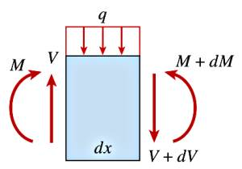

Bu ufak parçanın üzerindeki kuvvetler görülüyor, üstte dağıtık (distributed) bir
yük var, bu bir kesme etkisi $V$ yaratır, ayrıca bükülme momentleri de
mevcuttur. İşaret notasyonu olarak yükler aşağı ise pozitif, moment için
saat yönü tersi pozitif, saat yönü negatif.

Şimdi ilk önce dikey yöndeki kuvvetlere bakalım, burada yük, ve kesme
kuvvetleri var. Üstteki figürde görülen yatay yöndeki tüm kuvvetlerin toplamı
denge gerekliliği sebebiyle sıfır olmalıdır [6, sf. 321].

$$
\sum_{dik} = 0, \quad V - q \mathrm{d} x - (V + \mathrm{d} V) = 0
$$

Yani

$$
\frac{\mathrm{d} V}{\mathrm{d} x} = -q
\qquad (3)
$$

Böylece kirişin üzerindeki dağıtık yük ile aynı kiriş üzerindeki kesme
kuvveti arasında bir ilişkiyi ortaya çıkarmış oldum. 

Bükülme Momenti

Momentler için de bir denge formülü ortaya çıkartabilirim. Moment hesabı için
bir nokta seçilmeli, ufak parçanın sağ noktasını baz alıyorum (resimde
işaretli),

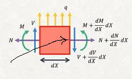

Referans nokta gerekli çünkü hatırlarsak moment bir nokta etrafındaki
döndürmeye bağlıdır, kuvvet dönüş çapına teğet olan kuvvettir. O zaman 

$$
\sum M_{X} = -M + \left( M + \frac{\mathrm{d} M}{\mathrm{d} X} \mathrm{d} X \right) -
V \mathrm{d} X - q \mathrm{d} X \left( \frac{\mathrm{d} X}{2}  \right) = 0
$$

Formüldeki $\mathrm{d} X / 2$ nereden çıktı? Moment için bir kuvvet uygulama uzaklığı
lazım, uzaklık için de tek bir noktayı seçmek gerekli; bu sebeple $q$'nun etki
ettiği bölgedeki kuvveti tek bir noktaya yapılıyormuş gibi farzediyoruz, o
bölgenin tam ortasına, yani $- \mathrm{d} X / 2$ noktasına.  Kuvvet büyüklüğü için o
tüm alana etki eden kuvveti bulmak lazım, $q \mathrm{d} X$.

Devam edelim, $M$ terimleri iptal olur, kalanları tekrar düzenleriz,

$$
V \mathrm{d} X + \frac{q}{2} \mathrm{d} X^2 = \frac{\mathrm{d} M}{\mathrm{d} X} \mathrm{d} X
$$

Eşitliğin her yerini $\mathrm{d} X$'e bölelim,

$$
V + \frac{q}{2} \mathrm{d} X = \frac{\mathrm{d} M}{\mathrm{d} X} 
$$

$\mathrm{d} X \to 0$ iken limiti alırsak, eşitliğin solundaki ikinci terim yokolur,

$$
V = \frac{\mathrm{d} M}{\mathrm{d} X}
\qquad (4)
$$

Böylece bir eşitlik daha elde ettim, teğetsel / kesme kuvveti $X$'e göre
momentteki değişim oranına eşit. Bir önceki eşitlik yük ve kesme, bu eşitlik
kesme ve moment arasında idi. Bu ilişkiler Statik (Statics) dersinden
geliyor, onları bulmak kolaydı.

Kaynaklar

[1] Philpot, *Mechanics of Materials*

[2] Gramoll, *Mechanics*,
    [http://www.ecourses.ou.edu/cgi-bin/ebook.cgi?topic=me](http://www.ecourses.ou.edu/cgi-bin/ebook.cgi?topic=me)

[3] BioMechie, *Bending Moment, Elastic Case*,
    [https://www.youtube.com/watch?v=asBW0Ojc0bY](https://www.youtube.com/watch?v=asBW0Ojc0bY)
    
[4] Craig, *Mechanics of Materials, Third Edition*

[6] Gere, *Mechanics of Materials*

