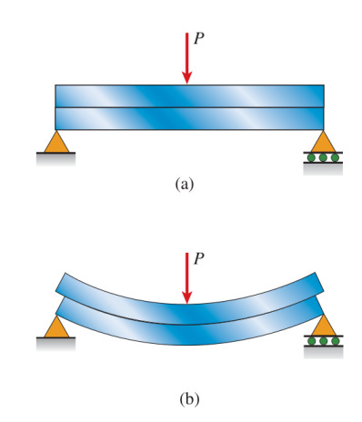
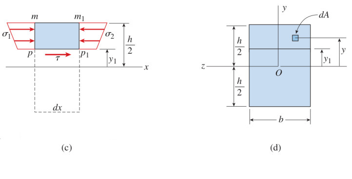
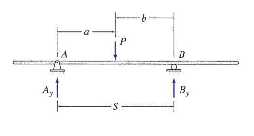
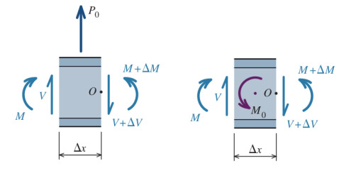

# Materyel Mekaniği - 2

Kirişin Yatay Kesme Stresi

Yatay kesme stresinin mevcut olduğunun belki de en iyi ispatı alttaki şekli
göstermek. İki tane tıpatıp aynı kirişi üst üste koysak ve üstten bir $P$ yükü
uygulasak, eğer kirişler arası sürtünme çok az ise kirişler birbirinden ayrı
şekilde büküleceklerdi, (b) şeklinde görüldüğü gibi.

Şimdi hayal edelim ki kirişler birbirine tutkal ile yapıştırıldı, bu şekilde iki
parça tek bir parça haline geldi. Bu birleşik kiriş yüklendiğinde o yapıştırılan
yatay yüzeyde stresler oluşmalıdır ki yapıştırılmış yüzeyin üst (b) şekildeki
gibi kayması engellensin. Bu kesme stresleri sayesinde tek birleşik kiriş ayrı
ayrı iki kirişten daha katıdır / serttir (stiff). Aynı kavram genel olarak
moleküler yapışma ile tek parça nesnelere de uygulayanabilirdi. Bir vidaya dikey
yönde uygulanan yük kesme yönünde stres yaratır, ki bu stresler moleküler
bağlantılar üzerinden ortaya çıkar.

Türetmeye gelelim [2, sf. 388]. Birörnek bükülmeye maruz olan bir kirişi
düşünelim, yine üstteki (a) resmini referans alıyoruz, bu kirişte $\mathrm{d} x$
genişliğindeki ufak bir parçaya odaklanalım, bu ufak parçanın sol kısmına etki
eden kesme kuvveti ve bükülme momenti $V$ ve $M$. Eksende sağa gittikçe bu
değerler değişik olabileceği için parçanın sağında $V + \mathrm{d} V$ ve $M + \mathrm{d} M$
olacaktır.

$\sigma_1$ ve $\sigma_2$ formüllerini yazalım, bükülme normal stres (flexure)
formülünden $\sigma = My / I$ olduğunu biliyoruz,

$$
\sigma_1 = -\frac{My}{I}, \quad
\sigma_2 = \frac{(M + \mathrm{d} M)y}{I}
$$

Üstteki (b) resminde daha da ufak bir bölgeye odaklanalım, alttaki (c)
resminde daha net gösteriliyor,

Bu parçanın en üst kısmı kirişin en üstü, orada yatay kesme stresi yok.
Parçanın alt kısmındaki strese $\tau$ diyelim. (c) figürünün sol taraftan
bakılan hali (d) resminde. Kuvvetleri düşünürsek, $F_1,F_2,F_3$ diyelim alttaki
gibi olur.

Denge açısından

$$
F_3 = F_2 - F_1
$$

olmalıdır.

Bu kuvvetleri yerine koyalım o zaman, mesela $\sigma_1$'den hareketle,

$$
\sigma_1 \mathrm{d} A = \frac{My}{I} \mathrm{d} A
$$

Tüm $F_1$ kuvveti için tanımladığımız alan üzerinden entegral alalım,

$$
F_1 = \int \sigma_1 \mathrm{d} A = \int \frac{My}{I} \mathrm{d} A
$$

$F_2,F_3$ için benzer şekilde,

$$
F_2 = \int \sigma_2 \mathrm{d} A = \int \frac{(M + \mathrm{d} M)y}{I} \mathrm{d} A
$$

$$
F_3 = \int \frac{(M + \mathrm{d} M)y}{I} \mathrm{d} A -  \int \frac{My}{I} \mathrm{d} A =
\int \frac{(\mathrm{d} M)y}{I} \mathrm{d} A
$$

$$
F_3 = \frac{\mathrm{d} M}{I} \int y \mathrm{d} A
$$

$F_3$'e farklı bir açıdan yaklaşalım, eğer $b$ boyunca kesme stresi $\tau$
değişmiyor ise, o zaman $F_3$'ü alttaki gibi de belirtebilirdik,

$$
F_3 = \tau b \mathrm{d} x
$$

Kuvvet eşittir stres çarpı alandır, $b \mathrm{d} x$ ile belirtilen alan üstteki
resimde görülüyor, kirişin altındaki eni $b$ boyu $\mathrm{d} x$ olan bölgeden
bahsediyoruz. Burada $\tau$ sabit ise üstteki çarpım yapılabilir, tabii ki
$\tau$ büyüklüğü $y$'ye bağlı olduğu için aşağı, yukarı değişimde $\tau$
değişirdi.

Devam edelim, son iki formülü birleştirince

$$
\frac{\mathrm{d} M}{I} \int y \mathrm{d} A = \tau b \mathrm{d} x
$$

Tekrar düzenleyince

$$
\tau = \frac{\mathrm{d} M}{\mathrm{d} x} \left( \frac{1}{Ib}  \right) \int y \mathrm{d} A
$$

$\mathrm{d} M / \mathrm{d} x$ büyüklüğü kesme kuvveti $V$'ye eşittir. 

$$
\tau =  \frac{V}{Ib} \int y \mathrm{d} A
$$

$\int y \mathrm{d} A$ entegrali $Q$ ile gösterilir, alansal bir momenttir, yine kiriş
yan yüzey şekli ile alakalı, standart şekiller için bilinen formüller vardır, o
zaman nihai formül

$$
\tau =  \frac{VQ}{Ib}
$$

Kirişin Yatay Kesme Stresi - Alternatif Anlatım

Kesme stresi $\tau$'yu bulmak için yine kirişin ufak bir kısmına odaklanalım,

Tüm etki eden kuvvetlerin toplamı sıfır olmak zorundadır [3],

$$
-P + (P + \mathrm{d} P) + \tau b \mathrm{d} x = 0
$$

ki $b$ kesme stresinin uygulandığı noktadaki kiriş derinliğidir. 

$$
-\mathrm{d} P/\mathrm{d} x = \tau b
\qquad (1)
$$

$P$'yi bulmak için $A$ bölgesindeki stresleri entegre ediyoruz,

$$
\int_A \mathrm{d} P = \int_A \sigma_b \mathrm{d} A
$$

Fakat daha önce bulduk ki $\sigma_b = -My / I$, yerine koyunca,

$$
P = \int_A - \frac{My}{I} \mathrm{d} A
$$

$M$ ve $I$ sabittir, entegral dışına çıkartılabilir,

$$
P = - \frac{M}{I} \int_A y \mathrm{d} A = - \frac{MQ}{I}
$$

ki görülen entegral bir alanın kütle merkezini bulmak için kullanılan standart
bir entegraldir, $Q = \int_A y \mathrm{d} A$. Devam edelim üstte bulunan $P$'yi (1)'e
sokunca,

$$
- \frac{\mathrm{d}}{\mathrm{d} x} \left( - \frac{MQ}{I} \right) = \tau b
$$

$$
\frac{Q}{I} \frac{\mathrm{d} M}{\mathrm{d} x} = \tau b
$$

Şimdi hatırlarsak $\mathrm{d} M/\mathrm{d} x$ türevi yatay kesme / teğetsel yükü $V$'ye
eşittir. O zaman

$$
\frac{Q}{I} V = \tau b
$$

Nihai yatay kesme stres denklemi,

$$
\tau = \frac{V Q}{I b}
$$

Problemler

Altta kiriş odaklı bazı örnek problemleri çözeceğiz. Bir kirişe yük
uygulandığında dengenin muhafaza edilmesi için kiriş içinde kuvvetler oluşur.
Bu iç kuvvetler kirişin destek yapısına göre farklı şekillerde ortaya çıkabilir
[1].

Üstteki soldaki resimde mesela iki boyutta pimli destek dönüşe izin verir,
tekerlekli yatay sağ, sol hareketi ve dönüşü serbest bırakır. Sabit destekte hiç
harekete izin yoktur. Hangi harekete izin verilmediğine göre yük uygulanması
ardından üst sağdaki iç kuvvetler ortaya çıkacaktır, bunlar pimli durumda dikey
ve yatay kuvvetler, tekerlekli durumda dikey kuvvet, sabit durumda ise her üç
mümkün tepkilerdir, yani moment, dikey ve yatay.

Yükler noktasal ya da dağıtık şekilde uygulanabilir, altta noktasal kuvvet,
dağıtık kuvvet ve noktasal moment örneklerini görüyoruz.

Tipik olarak problemin beklediği kesim kuvveti ve bükülme momenti grafikleridir,
bu grafiklerde $x$ ekseni yatay olarak kirişin kendisi, $y$ ekseni ise o noktada
etki eden kesim ya da moment büyüklüğüdür.

Çözme yöntemi olarak iki yaklaşım mevcut, biri her kritik noktada kirişin
hissettiği içsel kuvvetler ve momentleri hesaplamak için o noktalarda denge
denklemlerini kullanmak, ki bu denklemlere (ve temel fiziğe göre) kirişe
uyguladığımız hayali bir kesitte etki eden tüm kuvvetler ve momentler birbirini
dengelemeli. Ardından bu kesit tüm kiriş boyunca kaydırılır ve gereken kuvvetler
aynı denge üzerinden hesaplanır. Eğer tüm yükler noktasal ise bu yaklaşım iyi
işler.

Bir diğer yaklaşım Calculus kullanmak. Bu yaklaşım temelde sürekli bazda çözüm
verdiği için dağıtık yük durumunda daha kolay işler, kritik noktalara odaklanmak
yerine pür formulsel düşünebiliriz . Daha önce görmüştük ki kesim kuvvet
formülünün eğimi (türevi) o noktadaki uygulanan yükün negatifidir $\mathrm{d} V / \mathrm{d} x
= -w$, ve bükülme moment grafiğinin eğimi ise o noktadaki kesim kuvvetine
eşittir, $\mathrm{d} M / \mathrm{d} x = V$. Şimdi ters yönde gidersek, ilk formülü entegre
edince mesela iki nokta arasındaki kesme kuvveti farkının yükleme eğrisinin
altında kalan aynı noktalar arasındaki alanın olduğunu görebilirdik.

$$
V_2 - V_1 = - \int_{x_1}^{x_2} w \mathrm{d} x
$$

İkinci formülü entegre edince iki nokta arasındaki bükülme moment farkının kesme
kuvveti eğrisinin altında kalan alanın olduğunu bulurduk [1].

$$
M_2 - M_1 = \int_{x_1}^{x_2} V \mathrm{d} xa
$$

Problem 1

Üstüne birörnek yük $q$ uygulanan bir dirsekli (cantilever) kiriş için kesme
kuvveti ve bükülme momenti diyagramı çizin [2, sf. 334].

Çözüm

$$
V - V_A = V - 0 = V = -\int_{0}^{x} q \mathrm{d} x = -qx
$$

$$
M - M_A = M - 0 = M = \int_{0}^{x} -qx \mathrm{d} x = -\frac{qx^2}{2}
$$

Problem 2

Alttaki kiriş için kesme ve bükülme moment diyagramlarını oluşturun [4, sf. 179].

Çözüm

Önce hareketsizliğin olduğu noktalardaki reaksiyon kuvvetlerini bulmak gerekir.
Bu kuvvetler denge noktasında dikey ve yatay kuvvetlerin toplamının sıfır olma
zorunluluğu üzerinden hesaplanabilirler.

Fakat bazı durumlarda zorluk çıkabilir, mesela eğer üstteki örnekte tek bir
reaksiyon noktası olsa aşağı yöndeki kuvvetleri toplayıp tek reaksiyona
eşitleyebilirdik. Fakat iki reaksiyon noktası var, etki iki tane reaksiyona
nasıl yayılır? Bu noktada bükülme momentlerini dahil ederek ortaya bir formül
çıkartabiliriz. Reaksiyonlar bilinmiyor olsa da birer kuvvettirler, ve bu
kuvvetler, yük kuvvetleri ile beraber diğer sabit noktalar üzerinde bir moment
oluştururlar. Genel bir figür üzerinde görelim [4, sf. 86],

Reaksiyonlar $A_y$ ve $B_y$ nasıl hesaplanır? Moment dengesi $M_A = 0$ ve
$M_B = 0$ olmalı,

$$
M_A = 0 = B_y S - P a \to B_y = P \frac{a}{S}
$$

$$
M_B = 0 = -A_y S + P b \to A_y = P \frac{b}{S}
$$

Burada gördüğümüz $a/S$ ve $b/S$ basit birer orantıdan ibaret, yani tek $P$
yükünü mesafe oranlarına göre iki reaksiyon arasında paylaştırabiliriz.

Problemimiz icin

$$
A_y = 60 (6/9) + 150 (3/9) = 90 kN
$$

Bir tane reaksiyonu bulunca aslında diğerini dikey kuvvetlerin toplamının sıfır
olma şartından elde edebiliriz,

$$
90 - 60 - 150 + D_y = 0 
$$

$$
D_y = 120 kN
$$

Kesme diyagramı için kesme kuvvetinin yükün entegrali olduğunu hatırlayalım.
Entegral demek alan demektir, bu problemde elimizde bir analitik sürekli
fonksiyon yok, bazı yerlerde noktasal yükler var. Eğer bir alan olarak yük
uygulaması var ise, bu durumda dikdörtgensel alanları hesaplamak yeterli olurdu
(bir problemde hem noktasal, hem alansal yük uygulaması aynı anda olabilir).

A üzerinde noktasal +90 kN yük var, kesme kuvvetine ne olur? Burada noktasal
veri ile çalışmamız gerekiyor. Tam yükün uygulandığı noktada çok ufak bir
$\Delta x$ alanına odaklanalım, bu ufak parçanın serbest-kütle (free-body)
diyagramı şuna benzer [5, sf. 208], alt solda,

Dikey yöndeki kuvvetleri toplayıp sıfıra eşitlersek, ve $\Delta V$ için
çözersek,

$$
P_0 + V - (V + \Delta V) = 0 \to \Delta V = P_0
$$

Yük noktasında kesme kuvveti farkı yüke eşitmiş, o zaman kesme kuvveti 90 kN'e
zıplar.

Daha ilerlemeden bir noktasal bükülme momenti uygulansa ne olur onu da
görelim. Yine üstteki resimde sağdaki figüre bakalım, buradaki ufak parçanın
serbest-gövde diyagramında tüm momentlerin toplamını sıfıra eşitleyelim,
etrafında dönme olan referans noktası $O$ olsun, ve $\Delta M$ için çözelim,

$$
M_0 -M - V \Delta x + M + \Delta M = 0 
$$

$$
\Delta M = M_0 + V \Delta x
$$

$\Delta x$ sıfıra yaklaştıkça (noktasal bu demek) üstteki,

$$
\Delta M = M_0
$$

eşitliğine yaklaşır.

Problemimizle devam edelim, 90 kN'e zıplama oldu, kesme kuvveti grafiği o
noktaya çıkar, B noktasına kadar düz devam eder, 60 kN ters yönde yük alınca 30
kN'ye düşüş olur, C'ye gelince yine aşağı yönde 150 kN yük alınca -120'ye düşüş
olur. Yani grafik şuna benzer,

Moment grafiğine geldik, analitik versiyondaki alan hesabı burada ayrıksal
bağlamda uygulanabilir, üstteki figürde alanların içine büyüklüklerini yazdık,
270, 90, -360 diye. Tabii her noktada o noktanın solundaki alan dikdörtgen
toplamları hesaba alınmalı, bu da bize alttaki şekli verir,

Problem 3

Alttaki destekli kiriş için kesme kuvveti ve bükülme moment diyagramlarını
çizin. Maksimum bükülme momentinin hangi noktada olduğunu bulun.

Reaksiyonları bulalım, hareketi engelleyen bir nokta var, kirişin duvara
bağlandığı yer, orada dikey ve bükülme engelleniyor, o zaman iki tane reaksiyon
ortaya çıkar, $A_y$ ve $M_y$ diyelim, denge denklemleri üzerinden,

$$
\sum F_y = A_y + 180 kN - 50 kN = 0 \to A_y = -130 kN
$$

Bükülme moment dengesi üzerinden,

$$
\sum M_A = (180 kN)(1.5 m) - (50 kN)(5 m) - 140 kN \cdot m - M_A = 0 \to M_A =
-120 kN
$$

Kesme kuvveti diyagramını alttaki gibi çizeriz,

Daha önce türettiğimiz $\Delta V = A_y$ eşitliği üzerinden grafik hemen -130
kN'ye düşecektir. Dağıtık yükün altındaki alanın, entegralinin kesme kuvvetine
eşit olması bilgisini kullanacağız şimdi, bu örnekte analitik formül yok, alan
hesabını basit dikdörtgen hesabı ile yapabiliriz, başlangıç kesme kuvvetinden 3
metre sonra 60 kN/m çarpı 3 m = 180 kN eklenmiş olacak, bu bizi 50 kN
seviyesinde getirir. Bu geçiş lineer olur, bir eğim üzerinden, hesaplanan alan
sağa gittikçe gittikçe büyüyen dikdörtgenler vasıtasıyla.  Devam ediyoruz, D
noktasına gelene kadar değişim yok, o noktada ters yönde 50 kN var, böylece
kesme kuvveti 0 seviyesine iniyor.

$g$ noktasını bulmak için -130 kN'i nötralize etmek için kaç metre boyunca 60
kN/m dağıtık yük eklemek gerekir sorusunu cevaplamak lazım, basit bir bölme
işlemi 130 / 60 = 2.1668 metre.

Bükülme moment diyagramı kesme kuvveti diyagramının alan hesabı üzerinden
yapılacak,

Başlangıç bükülme momenti ilk anda $-120 kN \cdot m$ seviyesine düşer, çünkü
orada noktasal bir moment var. Daha sonraki eklenen moment için son iki
diyagramdaki $g-j$ eşlemesine bakalım, oraya gelirken bir üçgen alanı var (yeşil
renkli) bu alan -130 kN çarpı 2.1667 m bolu 2 ile hesaplanır, ve -140.8355
sonucunu verir. Bu alanı -120 $kN \cdot m$'ye ekleyince -260.8355 $kN \cdot m$
elde edilir. Dikkat oraya giderken ortaya çıkan eğri bir parabölün parçası,
hatırlarsak $y=x$'in entegrali $x^2$, yani bir parabol.

Geri kalan noktalar benzer şekilde, $l-m$ geçişine dikkat, orada bir 140 $kN
\cdot m$ büyüklüğünde noktasal moment uygulandığı için direk bir zıplama var,
gerisi lineer şekilde devam ediyor.

Kaynaklar 

[1] The Efficient Engineer, *Understanding Shear Force and Bending Moment Diagrams*,
    [https://youtu.be/C-FEVzI8oe8](https://youtu.be/C-FEVzI8oe8)

[2] Gere, *Mechanics of Materials, 7th Edition*

[3] Gramoll, *Mechanics*,
    [http://www.ecourses.ou.edu/cgi-bin/ebook.cgi?topic=me](http://www.ecourses.ou.edu/cgi-bin/ebook.cgi?topic=me)

[4] Kassimali, *Structural Analysis, 6th Ed*

[5] Philpot, *Mechanics of Materials*
    

