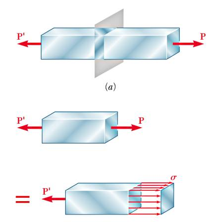
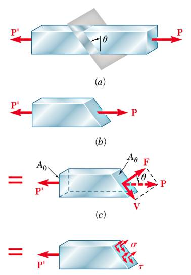
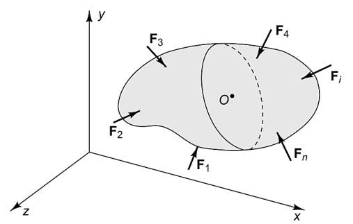
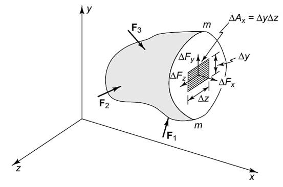

# Materyel Mekaniği - 3

Normal ve Kesme (Shear) Stresleri

Bir öğeyi (member), onun üzerindeki stresi analiz etmenin yollarından
biri bu öğe içine bir düzlem koyulduğunu hayal etmek, alttaki gibi [4, sf. 26],



Öğe iki yanından $P$ ile çekiliyor, ve bunun stres etkileri hayali düzlem
üzerinde $\sigma$ olarak görülüyor. Üstteki etki en temel versiyon, düzlem
uygulanan $P$'ye tam dik, bu sebeple hesabı basit $\sigma = P / A$, ki $A$
düzlemin öğeyi kestiği noktadaki alanı, ve kesme $\tau = 0$ çünkü uygulanan
kuvvetin dikey bileşeni sıfır.

Fakat analiz düzlemin öğeyi belli bir açıyla kestiği şekilde de yapılabilirdi.
Bu durumda $P$'nin dikey ve yatay bilesenleri farklı olur, 



Görülen $\theta$ açısı için

$$
F = P \cos \theta, \quad V = P \sin \theta
$$

Ayrıca $F,V$ kuvvetlerinin etki ettiği alan da farklıdır, ona $A_\theta$
diyelim, dikey kesimdeki alan $A_0$ olsun, o zaman $A_0 = A_\theta \cos \theta$.

Yeni düzlem için $\sigma,\tau$ ne olur? Hesaplayalım,

$$
\sigma = \frac{F}{A_\theta}, \quad \tau = \frac{V}{A_\theta}
$$

$$
\sigma = \frac{P \cos \theta}{A_0 / \cos\theta}, \quad
\tau = \frac{P \sin \theta}{A_0 / \cos\theta}
$$

$$
\sigma = \frac{P}{A_0} \cos^2 \theta \quad
\tau = \frac{P}{A_0} \sin\theta \cos\theta
$$

Son iki formüle bakarsak, $\sigma$'nin en yüksek değerinin $\theta=0$'da
olacağını görebiliriz, çünkü o noktada kosinüs 1 değerindedir. $\tau$ için
en yüksek değer 45 derecede oluyor, o zaman her iki maksimumu $\sigma_m, \tau_m$
diyelim,

$$
\sigma_m = \frac{P}{A_0}
$$

$$
\tau_m = \frac{P}{A_0} \sin 45^{\circ} \cos 45^{\circ} = \frac{P}{2 A_0}
$$

Çok Boyutta Kuvvetler

Giriş dersinden hatırlarsak kuvvet uygulanan kirişlerdeki deformasyon maddenin
özellikleriyle ilişkilendirilebiliyordu, bunun için birim alandaki kuvvet ve
birim boya tekabül eden uzama gözönüne alınıyordu. Çok boyuta geçerken ilk
olarak birim alan bazlı içsel kuvvetlerin alttaki gibi genel bir nesneye nasıl
uygulanacağını görelim [5, sf. 184].



Bir $O$ noktasına etki eden iç kuvvetleri incelemek için o noktadan geçen bir
düzlem hayal edebiliriz, düzlemi temsil eden ona dik normal vektör $n$ olsun.
Eğer düzlemi ufak parçalara bölsek ve her bölgeye etki eden kuvvetleri ölçsek
oradaki etki eden kuvvetlerin birinden diğerine değişebileceğini görürdük.


Eğer benzer şekilde $O$ merkezli bir ufak kare $\Delta A$ ele alsak orada etki
eden bir $\Delta F$ olacaktır. $\Delta F$'nin düzleme dik olması gerekmez,
herhangi bir açıda duran bir vektör olabilir, cismin altındaki kuvvetler üstten
alta doğru bastıran kuvvetlerden daha büyükse $\Delta F$ onların tek bir
noktadaki bir tür birleşimi olduğu için yukarı doğru gösteriyor olurdu muhakkak.

Şimdi stres vektörü kavramını tanıştıralım; eğer $\Delta A$ limite doğru giderse

$$
T_n = \lim_{\Delta A \to 0} \frac{\Delta F}{\Delta A}
$$

büyüklüğü stres vektörünü tanımlar.

Dikkat edersek $\Delta F$ büyüklüğü düzlemin duruşuna, yani $n$'ye bağlı olduğu
için özellikle $n$ ibaresini $T$ sembolüne ekledik; her değişik $n$ değişik bir
$T_n$ değerini verebileceği için.

Herhangi bir düzlem kullanabiliriz demiştik, fakat tekrarlanabilirlik, net ifade
açısından her eksene dik birer düzlem, toplam üç tane kullanmak daha iyi
olacak. Örnek $x$ eksenine dik olan bir düzlem altta,



Daha önce gördüğümüz $\Delta F$'in üstteki resimde düzleme göre bileşenlerine
ayıracağız, bunlar $\Delta F_x$, $\Delta F_y$, $\Delta F_z$. Baktığımız alan ise
kenarları $\Delta y$ ve $\Delta z$ olan bir dikdörtgen, alan $\Delta A_x$ ise
(notasyon olarak dik olduğumüz eksenin sembolünü verdik)
$\Delta A_x = \Delta y \Delta z$.

Daha önce olduğu gibi burada da limit tekniğini kullanabiliriz, $\Delta A_x \to
0$ olacak. Fakat yine notasyonel olarak referans eksen yönündeki strese $\sigma$
sembolü üzerinden normal stres , o eksene dik yani düzleme paralel olan
bileşenlere $\tau$ üzerinden kesme (shear) stresi adlarını vereceğiz.
Limitlerle beraber,

$$
\sigma_x = \lim_{\Delta A_x \to 0 } \frac{\Delta F_x}{\Delta A_x}
$$

$$
\tau_{xy} = \lim_{\Delta A_x \to 0 } \frac{\Delta F_y}{\Delta A_x}
$$

$$
\tau_{xz} = \lim_{\Delta A_x \to 0 } \frac{\Delta F_z}{\Delta A_x}
$$

Aynı düzlemle kesme tekniğini iki diğer eksen $y,z$ için de kullanırsak, ve
benzer hesapları yaparsak oradan da altı tane stres değeri elde ederiz, toplam
dokuz tane, hepsi bir arada bir matris içinde,

$$
\left[\begin{array}{rrr}
\sigma_x & \tau_{xy} & \tau_{xz} \\
\tau_{yx} & \sigma_y & \tau_{yz} \\
\tau_{zx} & \tau_{zy} & \sigma_z
\end{array}\right]
$$

Üç Boyutta Eşyönlü (Isotropic) Stres-Gerinim İlişkisi 

Şimdi bir kütleye uygulanan stres sonucu ortaya çıkan gerinimi üç boyut için
formülize edeceğiz [3, sf. 871]. Maddenin lineer elastik ve eşyönlü olduğu farz
edilecek, yani uygulanan bir stres farklı yönlerde etkilere sebep olursa bu etki
her yönde eşit şekilde ortaya çıkacak. Aradığımız formül Hooke Kanunu'nun üç
boyutlu hali, buna bazı kaynaklar (listelenen şartlar için) Genelleştirilmiş
Hooke Kanunu ismi de verebiliyor.

Bir gövdeyi her eksen üzerinden $\sigma_x$, $\sigma_y$, $\sigma_z$ streslerine
tabi tutacağız ve sonuçları inceleyeceğiz. Mesela temel Hooke Kanunu $\sigma = E
\epsilon$'den yola çıkarak $\epsilon_x^x = \sigma_x / E$ diyebiliriz,
$\epsilon_x^x$ büyüklüğündeki üstsimge gerinimin $x$ stresi sebebiyle olduğunu
söylüyor, diğerleri de olacak.


Fakat stres-gerinim ilişkisi sadece tek eksenle kısıtlı değil. Bir eksende stres
uyguladığımızda bunun diğer eksenler üzerinde de etkileri olacaktır.  Çünkü
madde bir yöne uzayıp şekil değiştirir fakat diğer eksenlerde ufalma olacağı
için o eksenlerde eksi yönde gerinim olur.

Mesela üstte ortadaki resmi düşünürsek, $\sigma_y$ stresi uygulandığında $x$
yönünde bir negatif gerinim olur, çünkü madde o eksen bağlamında içe doğru
daralır, şekil değiştirir, bunu formül

$$
\epsilon_x^y =  \frac{- v \sigma_y}{E}
$$

ile gösterebiliriz ki $v$ Poisson oranı. Dikkat $y$ yönündeki stresin etkisi
sadece $E$ sabiti ile değil $v/E$ sabiti ile $y$ eksenine yansıyor. Bu normal
olmalı çünkü bir eksene direk uygulanan stres ve onun aynı eksende yol açtığı
gerinim diğer eksenlerdeki yan etki gibi görülebilecek gerinimler ile aynı
olamaz.

Benzer şekilde $z$ stresinin yol açtığı gerinim

$$
\epsilon_x^z =  \frac{- v \sigma_z}{E}
$$

Tüm bu gerinimleri toplarsak $x$ eksenindeki toplam gerinim elde edilir,

$$
\epsilon_x = \epsilon_x^x + \epsilon_x^y + \epsilon_x^z
$$

$$
= \frac{\sigma_x}{E} - \frac{v \sigma_y}{E} - \frac{v \sigma_z}{E} 
$$

Benzer şekilde $y$ ve $z$ yönündeki gerinimler de elde edilebilir,

$$
\epsilon_y = \frac{\sigma_y}{E} - \frac{v \sigma_x}{E} - \frac{v \sigma_z}{E} 
$$

$$
\epsilon_z = \frac{\sigma_z}{E} - \frac{v \sigma_x}{E} - \frac{v \sigma_y}{E} 
$$

Son üç denklemi birleştirip stresler solda olacak şekilde düzenlersek,

$$
\sigma_x = \frac{E}{(1+v)(1-2v)} [\epsilon_x (1-v) + v \epsilon_y + v \epsilon_z ]
$$

$$
\sigma_y = \frac{E}{(1+v)(1-2v)} [ v \epsilon_x + \epsilon_y (1-v) + v \epsilon_z  ]
$$

$$
\sigma_z = \frac{E}{(1+v)(1-2v)} [v \epsilon_x + v \epsilon_y + \epsilon_z (1-v)  ]
$$

Ayrıca normal stresler için kullanılan Hooke Kanunu $\sigma = E \epsilon$ benzer
bir şekilde kesme (shear) stresi ve kesme gerinimi için de geçerlidir, ama
sabit $E$ yerine $G$ kullanılır,

$$
\tau = G \gamma
$$

$G$ sabitine Kesme Genliği (Shear Modulus) ismi veriliyor, birazdan nasıl
türetildiğini göreceğiz. 0 zaman üç boyutta ortaya çıkabilecek üç kesme
stresi

$$
\tau_{xy} = G \gamma_{xy} \qquad 
\tau_{yz} = G \gamma_{yz} \qquad 
\tau_{zx} = G \gamma_{zx}
$$

$G$ ile $E$ arasında bir ilişki var, bu formül

$$
G = \frac{E}{2(1+v)}
$$

Bu formülün nasıl türetildiğini birazdan göreceğiz.

Şimdi üstteki tüm formülleri matris formunda bir araya koyabiliriz,

$$
\left[\begin{array}{c}
\sigma_x \\ \sigma_y \\ \sigma_z \\ \tau_{xy} \\ \tau_{yz} \\ \tau_{zx}
\end{array}\right] =
\frac{E}{(1+v)(1-2v)}
\left[\begin{array}{cccccc}
1-v &  v  &  v  &            0      &               0  &  0  \\
 v  & 1-v &  v  &            0      &               0  &  0  \\
 v  &  v  & 1-v &            0      &               0  &  0  \\
 0  &  0  &  0  & \dfrac{1-2v}{2}   &               0  &  0  \\
 0  &  0  &  0  &            0      &  \dfrac{1-2v}{2} &  0  \\
 0  &  0  &  0  &            0      &               0  &  \dfrac{1-2v}{2} 
\end{array}\right]
\left[\begin{array}{c}
\epsilon_x \\ \epsilon_y \\ \epsilon_z \\ \gamma_{xy} \\ \gamma_{yz} \\ \gamma_{zx}
\end{array}\right]
$$

Matrisin sol alt kısmının simetri sebebiyle sağ üst kısım ile aynı olduğuna
dikkat.

Eğer gerinim değişkenlerini eşitliğin solunda stresleri sağda tutmak istersek,
üstteki matrisin tersini bulmamız lazım [8, sf. 161], sembolik ters alma
işlemini `sympy` ile yapabiliriz,

```python
import sympy as sym
E, v = sym.symbols('E v')
matrix = E/((1+v)*(1-2*v))*sym.Matrix([[1-v,v,v,0,0,0],
                     [v,1-v,v,0,0,0],
		     [v,v,1-v,0,0,0],
		     [0,0,0,(1-2*v)/2,0,0],
                     [0,0,0,0,(1-2*v)/2,0],
		     [0,0,0,0,0,(1-2*v)/2]])
sym.latex(matrix.inv())
```


$$
\left[\begin{matrix}\dfrac{1}{E} & - \dfrac{v}{E} & - \dfrac{v}{E} & 0 & 0 & 0\\- \dfrac{v}{E} & \dfrac{1}{E} & - \dfrac{v}{E} & 0 & 0 & 0\\- \dfrac{v}{E} & - \dfrac{v}{E} & \dfrac{1}{E} & 0 & 0 & 0\\0 & 0 & 0 & \dfrac{2 v + 2}{E} & 0 & 0\\0 & 0 & 0 & 0 & \dfrac{2 v + 2}{E} & 0\\0 & 0 & 0 & 0 & 0 & \dfrac{2 v + 2}{E}\end{matrix}\right]
$$

Bir basitleştirme daha yapılabilir, bunu kendimiz görebiliyoruz, $1/E$ dışarı
çekelim, hepsini bir araya koyalım,

$$
\left[\begin{array}{c}
\epsilon_x \\ \epsilon_y \\ \epsilon_z \\ \gamma_{xy} \\ \gamma_{yz} \\ \gamma_{zx}
\end{array}\right] =
\frac{1}{E}
\left[\begin{array}{cccccc}
1 & -v & -v & 0 & 0 & 0 \\
-v & 1 & -v & 0 & 0 & 0 \\
-v & -v & 1 & 0 & 0 & 0 \\
0 & 0 & 0 & 2(1+v) & 0 & 0 \\
0 & 0 & 0 & 0 & 2(1+v) & 0 \\
0 & 0 & 0 & 0 & 0 & 2(1+v)
\end{array}\right]
\left[\begin{array}{c}
\sigma_x \\ \sigma_y \\ \sigma_z \\ \tau_{xy} \\ \tau_{yz} \\ \tau_{zx}
\end{array}\right]
$$

Düzlem Stresi (Plane Stres)

Eğer bir gövde sadece iki boyutta strese tabi tutuluyorsa bu gövdenin "düzlem
stresi'' durumunda olduğu söylenir [3, sf. 70]. Bu tür stres / gerinimde
$\sigma_z = \tau_{xz} = \tau_{yz} = 0$'dir yani üçüncü boyut $z$ eksenine dönük
hiçbir aksiyon yoktur. Bu durumda Genel Hooke Kanunu alttaki üç denkleme
indirgenebilir,

$$
\epsilon_x = \frac{1}{E} (\sigma_x - v \sigma_y )
$$

$$
\epsilon_y = \frac{1}{E} (\sigma_y - v \sigma_x )
$$

$$
\gamma_{xy} = \frac{1}{G} \tau_{xy}
$$

Üç boyutlu durumda olduğu gibi üstteki formülleri matris formunda
gösterebiliriz,

$$
\left[\begin{array}{c}
\epsilon_{x} \\ \epsilon_{y} \\ \gamma_{xy}
\end{array}\right] =
\frac{1}{E}
\left[\begin{array}{ccc}
1 & -v & 0 \\
-v & 1 & 0 \\
0 & 0 & 2(1+v)
\end{array}\right]
\left[\begin{array}{c}
\sigma_x \\ \sigma_y \\ \tau_{xy}
\end{array}\right]
$$

Yine bir yer değiştirme işlemi yapılabilir, üstteki matrisin tersini alırsak
stresler sola geçer, 

$$
\left[\begin{array}{c}
\sigma_x \\ \sigma_y \\ \tau_{xy}
\end{array}\right] = 
\frac{E}{(1-v)^2}
\left[\begin{array}{ccc}
1 & v & 0 \\ v & 1 & 0 \\ 0 & 0 & \dfrac{(1-v)}{2}
\end{array}\right]
\left[\begin{array}{c}
\epsilon_{x} \\ \epsilon_{y} \\ \gamma_{xy}
\end{array}\right] 
$$

Bazı formülasyonlarda üstteki matrisin çarpan sabitin böleninde $(1+v)$
görülebiliyor, bu durumda $(1-v)^2=(1+v)(1-v)$ olduğunu hatırlayalım, ve ona
göre matrisin tüm öğeleri $(1-v)$ ile bölünmüş olacaktır, farketmez, her iki
form da aynı sonucu verir.

Kaynaklar

[2] Bayramlı, *Normal Diferansiyel Denklemler, Trigonometri*

[3] Craig, *Mechanics of Materials, Third Edition*

[4] Mazurek, *Mechanics of Materials, 6th Edition*

[5] Crandall, An Introduction to the Mechanics of Solids


