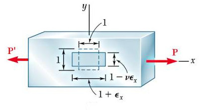
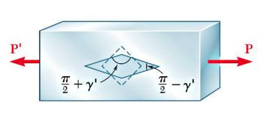
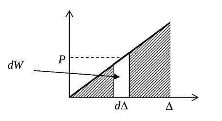
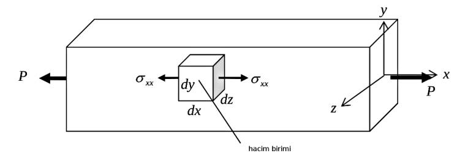
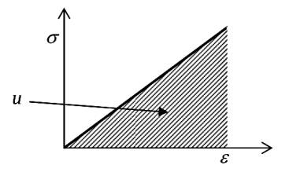

# Materyel Mekaniği - 4

Kesme Genliği, $E,G$ İlişkisi

İki yanından $P$ ile çekilen bir inşaat parçası düşünelim, bu parça içinde
kenarları birim uzunluğundaki hayali bir küp olsun. Çekme sonucu bir uzama
oluşacaktır bu uzama gerginlik eksenel yönde $\epsilon_x$ olsun, $P$'ye
$E$ üzerinden bağlıdır. Çekim kuvvetinin eksene dik yönde etkileri de vardır,
bu etki bir Poisson oranı $\nu$ üzerinden olur, yani
$\epsilon_y = \epsilon_z = -\nu \epsilon_x$.

Şimdi aynı küpü köşegen şekilde hayali bir düzlemle 45 derecede keselim, ve aynı
kuvvet uygulaması ardından alttaki resimde koyu renkle görülen parçaya
ne olacağını düşünelim.

Bu küp yarısı parçanın kenarları dikey $1-\nu \epsilon_x$, yatay $1 + \epsilon_x$
noktasına gelecektir. Peki yeni $\beta$ acısı ne olur? Bunun için iki
üstteki küpün 45 derece çevrilmiş halini düşünelim,

Burada görülen açı değişimi sağ ve sol kenarlarda $\frac{\pi}{2} - \gamma'$.
Daha önce gördük ki 45 derecede konumlanmış bir düzleme etki eden kesme
kuvveti maksimum büyüklüktedir, yani $\gamma_m = \gamma'$. Şimdi bir düşünsel
takla daha atalım, iki üstteki $\beta$ açısına nasıl eriştik? Bu açı bir küpün
45 derecede kesilmiş halinden gelmedi mi? Evet. O zaman bu $\beta$ açısının
geldiği nokta üstteki resimde sağ ve solda görülen açı değişiminin yarısıdır
[2, sf. 102], yani

$$
\beta = \frac{\pi}{4} - \frac{\gamma_m}{2}
$$

Bu formüle iki açı farkının tanjantı eşitliğini [5] uygularsak,

$$
\tan \beta =
\dfrac{\tan \dfrac{\pi}{4} - \tan \dfrac{\gamma_m}{2}}
      {1 + \tan \dfrac{\pi}{4} \tan \dfrac{\gamma_m}{2}}
$$

$$
= \frac{1 - \tan \frac{\gamma_m}{2}}{1 + \tan \frac{\gamma_m}{2} }
$$

$\gamma_m / 2$ çok ufak bir açı olduğu için $\tan \gamma_m / 2 = \gamma_m / 2$
kabul edilebilir,

$$
\tan \beta = \dfrac{1 - \dfrac{\gamma_m}{2}}{1 + \dfrac{\gamma_m}{2}}
$$

Diğer yandan iki üstteki resimde üçüncü kısımda bir eşitlik ima ediliyor,
$\beta$ acısının karşı kenarı $1 - \nu \epsilon_x$ komşu kenarı $1 +
\epsilon_x$ olduğuna göre, o zaman $\tan\beta$ şu şekilde de gösterilebilir,

$$
\tan\beta = \frac{1 - \nu \epsilon_x}{1 + \epsilon_x}
$$

Üstteki formülü iki üstteki ile eşitlersek ve $\gamma_m$ için çözersek,

$$
\gamma_m = \dfrac{(1+\mu)\epsilon_x}{ 1 + \dfrac{1-\mu}{2} \epsilon_x}
$$

$\epsilon_x << 1$ olduğu için yani 1'den çok daha küçük bir değer olduğu için
bölende $\frac{1-\mu}{2} \epsilon_x$ değerinin yok olduğunu ve geriye
sadece 1 kaldığını farz edebiliriz, o zaman üstteki,

$$
\gamma_m = (1+\mu) \epsilon_x
$$

kabul edilebilir. Bu bize maksimum kesme gerinmesi $\gamma_m$ ve eksenel gerinme
$\epsilon_x$ arasında aradığımız ilişkiyi verecektir. Şimdi $E,\mu,G$ sabitleri
arasındaki ilişkiyi bulmak için sunları hatırlayalım, Hooke Kanunu sebebiyle
$\gamma_m = \tau_m / G$, ve bir eksenel yük için $\epsilon_x = \sigma_x /
E$. Demek ki üstteki formül,

$$
\frac{\tau_m}{G} = (1+\nu) \frac{\sigma_x}{E}
$$

ya da

$$
\frac{E}{G} = (1+\nu) \frac{\sigma_x}{\tau_m}
$$

olarak yazılabilir. Tekrar hatırlarsak tarif ettiğimiz şekiller için
$\sigma_x = P / A$ ve $\tau_m = P / 2A$, o zaman $\sigma_x / \tau_m = 2$.
Yani üstteki formül

$$
\frac{E}{G} = (1+\nu) 2
$$

olur, $G$ için tekrar düzenlersek,

$$
G = \frac{E}{2(1+\nu)}
$$

Gerinim Enerji Yoğunluğu (Strain Energy Density)

Yapılan iş ve enerji arasındaki bağlantıyı işledik. Şimdi bir maddeye uygulanan
stres ve onun sebep olduğu gerinimin yol açtığı esnemeden bahsedelim, bir kuvvet
uygulanıyor ve bir esneme oluyor, bu hesap kuvvet çarpı mesafe ile yapılan iş
olarak hesaplanabilir. Diyelim ki bir çubuk (bar) üzerinde tek eksenel $P$
kuvveti uygulanıyor, sonucunda $\mathrm{d} \Delta$ kadar uzama var [4, sf. 243],

Yapılan iş

$$
\mathrm{d} W = P \mathrm{d} \Delta
$$

Eğer $P$ sürekli uygulansa ve uzama devam etse tüm ufak uzamalar üzerinden
yapılan iş $\mathrm{d} \Delta$ üzerinden bir entegral gerektirir, fakat alttaki
gibi basit durumda sadece üçgen alan hesabı yeterli,

Şu formülü kullanabiliriz,

$$
U = \frac{1}{2} P \Delta
$$

Önceden hatırlarsak $\Delta = PL / EA$ idi, o zaman üstteki 

$$
U = \frac{P^2 L}{2 E A}
\qquad (4)
$$

olur.

Yoğunluğa gelirsek; gerinim enerjisi madde içinde farklı seviyelerde olabilir,
onu sonsuz ufak bir hacim için hesaplarız ve gerektiğinde sonrada tüm enerji
için tüm hacim üzerinden entegre ederiz.

Alttaki çubuktaki ufak bir hacim birimine bakalım, birimin kenarları $\mathrm{d} x$,
$\mathrm{d} y$, $\mathrm{d} z$ büyüklüğünde, birimin hacmi tabii ki $\mathrm{d} V = \mathrm{d} x \mathrm{d} y \mathrm{d}
z$.

Formül (4) kullanalım, stres için $\sigma$ sembolü kullanacağız, stres kuvvet
bölü alan demektir, ufak birimdeki alan $A = \mathrm{d} y \mathrm{d} z$, o zaman
$P = \sigma_{xx} \mathrm{d} y \mathrm{d} z$, üstteki ufak birimdeki gerinim enerjisi

$$
U = \frac{(\sigma_{xx} \mathrm{d} y \mathrm{d} z)^2 \mathrm{d} x}{2 E \mathrm{d} y \mathrm{d} z} =
\frac{\sigma_{xx}^2 \mathrm{d} y^2 \mathrm{d} z^2 \mathrm{d} x}{2 E \mathrm{d} y \mathrm{d} z} =
\frac{\sigma_{xx}^2 \mathrm{d} y \mathrm{d} z \mathrm{d} x}{2 E} 
$$

$$
= \frac{\sigma_{xx}^2 \mathrm{d} V}{2 E} 
$$

Yoğunlukla ilgileniyoruz demiştik, bize birim hacimdeki $U$ lazım, o zaman
yoğunluk $u$

$$
u = \frac{\sigma_{xx}^2}{2 E}
$$

Hooke Kanunu $\sigma_{xx} = E \epsilon_{xx}$ üzerinden üstteki son formül,
gerinim enerji yoğunluğu

$$
u = \frac{1}{2} \sigma_{xx} \epsilon_{xx}
$$

olarak ta gösterilebilir. Alttaki resimde görülebileceği gibi bu tek eksenel
stres-gerinim eğrisinin altında kalan alandır,

Daha çetrefil $\sigma-\epsilon$ ilişkileri (ve eğrileri) için $u$ hesabı
bir entegral olacaktır,

$$
u = \int_{0}^{\epsilon_{T}} \sigma_{xx} \mathrm{d} \epsilon_{xx} 
$$

Gerinim, esneme, enerji alakası şöyle de görülebilir, uygulanan stresin
oluşturduğu esneme bir iş yapıyor, bu iş ile enerjiyi esnemeye transfer
ediyoruz, bir lastiği uzattığımızda enerji o lastiğin "elastisitesine''
aktarılıyor sanki, bu işin / enerjinin birim hacimdeki ölçüsü gerilim
enerji yoğunluğunu veriyor bize.

İlerlemeden önce birazdan lazım olacak iki formülü bulalım. Daha önce gördük ki

$$
I = \int \int X_2^2 \mathrm{d} X_2 \mathrm{d} X_3
$$

ve

$$
M = \int \int -X_2 \sigma_{11} \mathrm{d} X_2 \mathrm{d} X_3
$$

Üstteki iki formülü birleştirelim, $M$ içinde $I$ oluşturalım, ve yerine koyalım,

$$
M = \int \int -\frac{X_2}{X_2^2} X_2^2 \sigma_{11} \mathrm{d} X_2 \mathrm{d} X_3 =
-\frac{1}{X_2} \sigma_{11} I 
$$

Buradan $\sigma_{11}$ eşitliğine geçilir,

$$
\implies \sigma_{11} = -\frac{M X_2}{I}
$$

Kaynaklar

[1] Crandall, *An Introduction to the Mechanics of Solids*

[2] Mazurek, *Mechanics of Materials, 6th Edition*

[3] Craig, *Mechanics of Materials, Third Edition*

[4] Kelly, *University of Auckland, Solid Mechanics, Part I*

[5] Bayramlı, *Normal Diferansiyel Denklemler, Trigonometri*

[6] Gere, *Mechanics of Materials*

[7] Khennane, *Introduction to Finite Element Analysis using Matlab and Abaqus*

