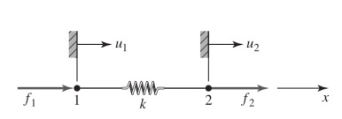
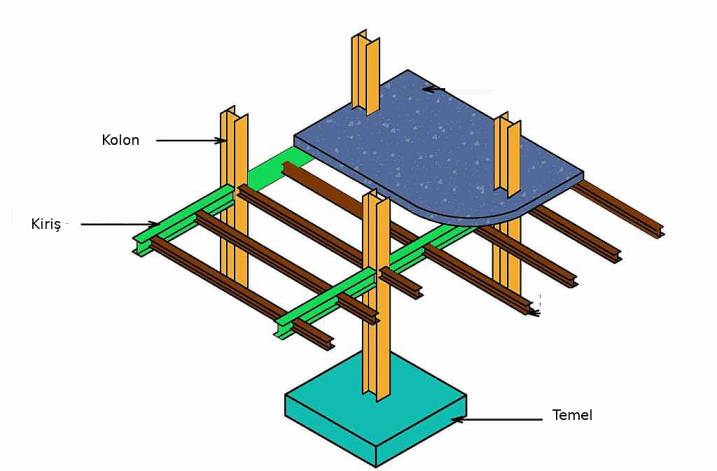

# Materyel Mekaniği - 5

Direk Direngenlik Metotu (Direct Stiffness Method)

Direngenlik metotunu anlamak için direngenlik matrisi kavramını işlemek
gerekir. Bu konuya biraz [5]'de değindik. Bir öğe grubunun, sistemin direngenlik
matrisi düğümsel yer değişimler $u$ ile düğümsel kuvvetler $F$'yi ilintilendiren
bir $K$ matrisidir, öyle ki

$$
F = K u
$$

eşitliği geçerlidir. Alttaki gibi bir sistem olsun [7, sf. 21],



Üstteki sistem kısım kısım incelenen daha büyük bir yay sisteminin parçası
olabilir, birazdan göreceğimiz en basit örnekte sol taraf hareket etmiyor, bu
sebeple $u_1$ yer değişimini düşünmek anlamsız, fakat 1 noktasının tam yayın
esneyen kısmını işaret ettiği durumda ve daha büyük bir sistem var ise bu nokta
da hareket edecektir.

Herneyse $u_1$ şimdilik hareket edemez olsa da formülasyonu yapalım. Yayın
toplam esnemesi

$$
\delta = u_2 - u_1
$$

Eğer yay sabiti $k$ ise yaydaki etki eden kuvvet

$$
f = k \delta = k (u_2 - u_1)
$$

Kuvvet denge koşulu için $f_1 + f_2  = 0$, yani $f_1 = -f_2$ olur, o zaman
her düğümdeki kuvvetleri genel formül üzerinden şöyle açabiliriz,

$$
f_1 = -k (u_2 - u_1)
$$

$$
f_2 = k(u_2 - u_1)
$$

Matris formunda üstteki iki formül

$$
\left[\begin{array}{cc}
k & -k \\ -k & k
\end{array}\right]
\left[\begin{array}{c}
u_1 \\ u_2 
\end{array}\right] =
\left[\begin{array}{c}
f_1 \\ f_2 
\end{array}\right]  \Rightarrow
Ku = f
$$

Eger ornek bazi sayilari kullanip yer degisim hesabini yaparsak,

```python
import numpy.linalg as lin
k = 2
K = np.array([[k+0.00001, -k],[-k, k]])
f = np.array([[-10],[10]])
print (np.dot (lin.inv(K), f) )
```

```
[[0.]
 [5.]]
```

$u_2 = 5$, ve $u_1 = 0$ çıktı.

Üstdüşüm (Superposition)

Eğer iki tane yay sistemini birbiriyle bağlı olarak işlemek istersek [4, sf. 40],
üstdüşüm tekniği kullanılabilir. Üstdüşüm basit bir matris toplamı ile
yapılabiliyor. Alttaki örneğe bakalım,


İki yay var, birbirlerine bağlılar, iki yayın sabitleri $k_1$, $k_2$
olsun. Her iki yayın direngenlik matrisi ayrı ayrı (tekabül eden yer değişim
değişkenleri matris kolon etiketi olarak gösteriliyor),

$$
k^{(1)} =
\begin{array}{cc} & \begin{array}{cc} u_1 & u_3 \end{array} \\ &
\left[
\begin{array}{cc}
k_1 & -k_1 \\ -k_1 & k_1
\end{array}
\right]
\end{array} 
\qquad
k^{(2)} =
\begin{array}{cc} & \begin{array}{cc} u_3 & u_2 \end{array} \\ &
\left[
\begin{array}{cc}
k_2 & -k_2 \\ -k_2 & k_2
\end{array}
\right]
\end{array}
$$

İki yay sistemini tek sistem haline getirmek aslında basit bir matris
toplamından ibaret fakat bu matrisin kolonları aynı değişkenlere tekabül ediyor
olmalı. O zaman her iki 2 x 2 matrisi genişletip 3 x 3 matrisi haline
getirirsek, değişken etiketlerini eşitlersek bu yeni iki matrisi
toplayabiliriz.

$$
k^{(1)} =
\begin{array}{cc} & \begin{array}{ccc} u_1 & u_2 & u_3 \end{array} \\ &
\left[
\begin{array}{ccc}
k_1 & 0 & -k_1 \\
0 & 0 & 0 \\
-k_1 & 0 & k_1
\end{array}
\right]
\end{array} \qquad
k^{(2)} =
\begin{array}{cc} & \begin{array}{ccc} u_1 & u_2 & u_3 \end{array} \\ &
\left[
\begin{array}{ccc}
0 & 0 & 0 \\
0 & k_2 & -k_2 \\
0 & -k_2 & k_2
\end{array}
\right]
\end{array} \qquad
$$

Dikkat edilirse mesela ilk matrisin $u_2$ kolonu tamamen sıfır çünkü 2 x 2
halindeki $k^{(1)}$ matrisinde bu değişken yoktu. Yeni genişletilmiş matrise
geçerken olmayan değişkenin kolonunu sıfırlarsak aslında aynı matrisi elde etmiş
oluruz.

Artık iki matrisi toplayabiliriz,

$$
\left[\begin{array}{ccc}
k_1 & 0 & -k_1 \\
0 & k_2 & -k_2 \\
-k_1 & -k_2 & k_1+k_2
\end{array}\right]
\left[\begin{array}{c}
u_1 \\ u_2 \\ u_3
\end{array}\right] =
\left[\begin{array}{c}
F_{1x} \\ F_{2x} \\ F_{3x}
\end{array}\right]
$$

Sınır Şartları (Boundary Conditions)

Resimde gösterilen örnekte sol tarafın duvara sabitlendiğini görüyoruz.
Sabitlenme demek notasyonumuz itibariyle $u_1 = 0$ demektir. Bu bir
sınır şartıdır, onu bir şekilde sistemimize dahil etmemiz gerekir.
Değeri üstteki sistemde yerine koyarsak,

$$
\left[\begin{array}{ccc}
k_1 & 0 & -k_1 \\
0 & k_2 & -k_2 \\
-k_1 & -k_2 & k_1+k_2
\end{array}\right]
\left[\begin{array}{c}
0 \\ u_2 \\ u_3
\end{array}\right] =
\left[\begin{array}{c}
F_{1x} \\ F_{2x} \\ F_{3x}
\end{array}\right]
$$

Matris sistemini cebirsel olarak tekrar açarsak,

$$
k_1(0) + (0) u_2 - k_1 u_3 = F_{1x}
$$

$$
0(0) + k_2 u_2 - k_2 u_3 = F_{2x}
$$

$$
-k_1 (0) - k_2 u_2 + (k_1+k_2) u_3 = F_{3x}
$$

elde edilir. Bu sistemde sadece ikinci ve üçüncü denklemi matris olarak
yazabiliriz,

$$
\left[\begin{array}{cc}
k_2 & -k_2 \\ -k_2 & k_1 + k_2 
\end{array}\right]
\left[\begin{array}{c}
u_1 \\ u_2
\end{array}\right] =
\left[\begin{array}{c}
F_{2x} \\ F_{3x}
\end{array}\right]
$$

Bu son matrisi elde etmek için bir anlamda önceki matrisin birinci satırı ve
kolonunu dışarı attık, kenara ayırdık, ve kalanlarla yeni bir sistem yarattık.
Fakat dikkat bu $F_{1x}$ sıfır demek değildir, onun hala bir ifadesi var,
$F_{1x} = -k_1 u_3$, ve bu eşitliği bir kez sistemin geri kalanının çözdükten
sonra dönüp ayrıca bulmamız gerekiyor.

Devam edelim, yeni sistemi çözersek,

$$
\left[\begin{array}{ccc}
u_2 \\ u_3
\end{array}\right] =
\left[\begin{array}{cc}
k_2 & -k_2 \\ -k_2 & k_1 + k_2 
\end{array}\right]^{-1}
\left[\begin{array}{c}
F_{2x} \\ F_{3x}
\end{array}\right]
$$

$$
= \left[\begin{array}{cc}
\dfrac{1}{k_2} + \dfrac{1}{k_1} & \dfrac{1}{k_1} \\
\dfrac{1}{k_1} & \dfrac{1}{k_1} 
\end{array}\right]
\left[\begin{array}{c}
F_{2x} \\ F_{3x}
\end{array}\right]
$$

$u_2,u_3$ bir kez elde edildikten sonra $F_{1x} = -k_1 u_3$ formülü
ile $F_{1x}$ elde edilebilir.

Euler-Bernoulli Kirişleri (Beams)



Mühendislikte, özellikle inşaat mühendisliğinde kirişler yaygın bilinen
bir konudur. Bir kiriş bağlamında


   * Kesme (Shear) Kuvvet Fonksiyonu $V(X_1)$
   * Bükülme Moment Fonksiyonu $M(X_1)$
   * Saptırma (Deflection) Fonksiyonu $y(X_1)$


gibi kalemlerle ilgileniyor olabilirim. Bu kalemlerden ilk ikisi çok basittir.
Üçüncü hesap kirişin "servis edebilir'' olup olmadığını söyleyebilir mesela, ki
insanlar bu kirişin üstünde yürüdüğünde oraya buraya savrulmasınlar (saptırma bu
hesabı bize verebilir). İşte üstteki türden hesapları yapabilmek için
Euler-Bernoulli kiriş faraziyesinden yola çıkmak yaygın bir yaklaşımdır.  Bu
önkabuller nelerdir?


   * Deformasyonlar ufak: Bu doğal bir varsayım, inşaat mühendisliğinde
     mesela eğer ortada bir deprem yok ise çok büyük şekil değişiklikleri
     beklemeye gerek yok. 
   * Kiriş lineer elastik eşyönlü (isotropic) maddeden yapılmış: inşaat
     mühendisliğindeki çelik kirişlerin zaten böyle olduğu farz edilir.
   * Poisson oranı etkileri yoksayılır.
   * Düzlem bölümler düzlem kalır (plane sections remain plain). Boyu
     eninden çok daha fazla olan nesnelerde bu doğrudur, fakat daha ufak
     parçalarda varsayım tutmayabilir.


Kaynaklar

[1] Kim, *Introduction to Non-linear Finite Element Analysis*

[2] Petitt, *Intro to the Finite Element Method*, University of Alberta,
    [https://www.youtube.com/watch?v=2iUnfPRk6Ro&list=PLLSzlda_AXa3yQEJAb5JcmsVDy9i9K_fi](https://www.youtube.com/watch?v=2iUnfPRk6Ro&list=PLLSzlda_AXa3yQEJAb5JcmsVDy9i9K_fi)
    
[3] Adeeb, *Introduction to Solid Mechanics, Online Book*,
    [https://engcourses-uofa.ca/books/introduction-to-solid-mechanics/](https://engcourses-uofa.ca/books/introduction-to-solid-mechanics/)

[4] Logan, *A First Course in the Finite Element Method*

[5] Bayramlı, *Hesapsal Bilim, Ders 1-8*

[7] Hutton, *Fundamentals of Finite Element Analysis*


