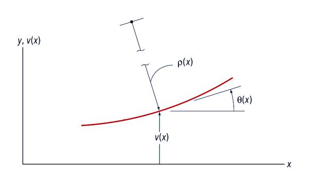
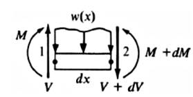
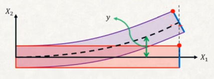
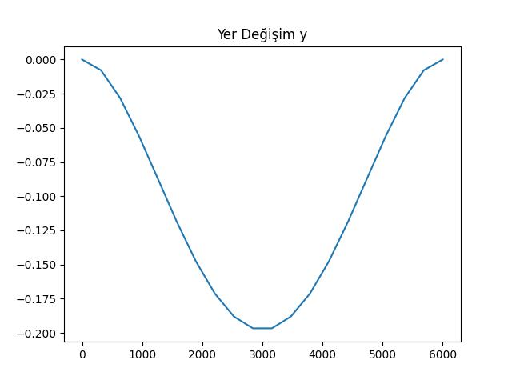
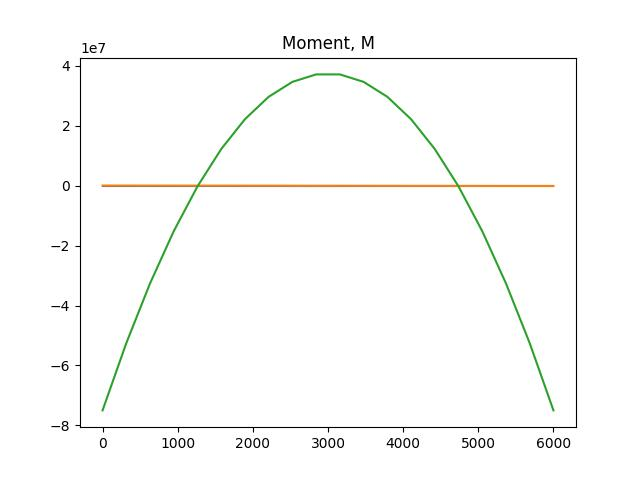
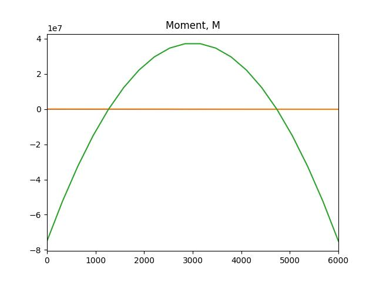
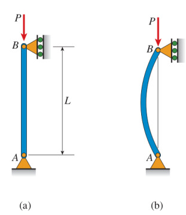
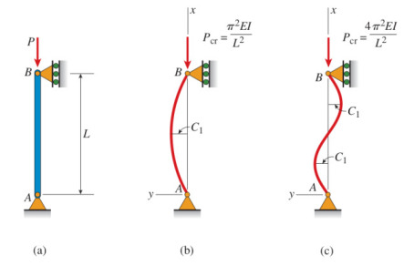

# Materyel Mekaniği - 6

Bükülen bir çubuğun formüllerine bir giriş [3]'te yapıldı. Orada moment-eğri
(moment-curvature) formülü gösterilmişti.

$$
M(x) = \frac{E(x)I(x)}{\rho(x)} = \frac{EI}{\rho}
\qquad (1)
$$

Şimdi bu formülü genişletelim, ve bir ikinci derece türeve eşitleyelim.


Resimde gösterilen semboller $M$ bükme momenti, $\rho$ çubuğun $+y$ tarafındaki
bükülme çemberinin, eğiminin yarıçapı (radius of curvature).  $v$ ise yine $+y$
kısmındaki yer değişimidir. Çubuğa uygulanan kuvvet dağılımının ne olduğu
önemli değil, sonuçta odaklandığımız çubuğun ufak bir kısmı.

[7] kaynağında bir çemberi (yarıçapını) onun bir eğriye dokunduğu noktadaki
türevler üzerinden temsil etme tekniğini paylaştık. Bu formülü mevcut probleme
uygulayabiliriz.



Üstteki örnekte çemberin yarıçapı $\rho$, türevler ise $\mathrm{d} v / \mathrm{d} x$.
Formül [6, sf. 466],

$$
\frac{1}{\rho} =
\frac
{\dfrac{\mathrm{d}^2 v}{\mathrm{d} x^2}}
{ \left[ 1 + \left( \dfrac{\mathrm{d} v}{\mathrm{d} x}  \right)^2 \right]^{3/2} }
$$

Üstteki problemde eğim çok ufaktır o zaman $\mathrm{d} v / \mathrm{d} x$ ufak kabul edilir
(resimdeki eğim eğitim amaçlı abartılmış), demek ki bölendeki kare hesabı
daha da ufalır, geriye sadece 1 kalır, 1 ile bölümü yok sayarız, geriye kalanlar

$$
\frac{1}{\rho} \approx \frac{\mathrm{d}^2 v}{\mathrm{d} x^2}
\qquad (2)
$$

Şimdi (1) formülünü tekrar düzenlersek,

$$
\frac{1}{\rho} = \frac{M}{EI }
$$

diyebilirdik. Bu formülün sol tarafının (2) sol tarafı ile aynı olduğunu
görüyoruz. Demek ki onları eşitleyebiliriz, moment-eğri formülü şu hale gelir,

$$
\frac{\mathrm{d}^2 v}{\mathrm{d} x^2} = \frac{M}{E I}
$$

Formüller daha kısa olsun diye bazı notasyonel ekler yapalım,

$$
v' = \frac{\mathrm{d} v}{\mathrm{d} x} \quad 
v'' = \frac{\mathrm{d}^2 v}{\mathrm{d} x^2} \quad 
M' = \frac{\mathrm{d} M}{\mathrm{d} x} \quad 
$$

İki üstteki formül kısa notasyonla söyle olur,

$$
EI v'' = M
\qquad (3)
$$

Bir formül daha, sonra faydalı olacak, hatırlarsak,

$$
v = \frac{\mathrm{d} M}{\mathrm{d} x}
$$

idi, o zaman (3)'teki formülün iki tarafının $x$'e göre türevini alırsak,

$$
EI v''' = \frac{\mathrm{d} M}{\mathrm{d} x} = V
$$

Yani [5, sf. 683]

$$
v = EI v''' = EI \frac{\mathrm{d}^3 v}{\mathrm{d} x^3}
\qquad (6)
$$

Ayrıca [4]'de gösterilmişti, $\mathrm{d} v / \mathrm{d} x = -q$ olduğu için

$$
EI v'''' = \frac{\mathrm{d} v}{\mathrm{d} x} = -q
$$

ifadesi de doğrudur.

Farklı bir açıdan / anlatımla şimdiye kadar görülenleri tekrarlamak iyi
olabilir, ve önceki derste gösterilenlerle beraber aynı formüllere erişmeye 
çalışalım [8, sf. 172]. Alttaki ufak parçaya bakalım,



Dikey kuvvetleri toplarsak,

$$
-w \mathrm{d} x - \mathrm{d} V = 0 
$$

$$
w = -\frac{\mathrm{d} V}{\mathrm{d} x}
$$

Momentleri toplarsak ve sıfıra eşitlersek,

$$
-V \mathrm{d} x + \mathrm{d} M + w(x) \mathrm{d} x \left( \frac{\mathrm{d} x}{2}  \right) = 0
$$

$$
V = \frac{\mathrm{d} M}{\mathrm{d} x}
$$

Bükülme momenti ile kesme kuvveti arasındaki eşitlik elde edilebildi çünkü
eşitliğin sol tarafını $\mathrm{d} x$ ile böldük, ve sonucun limitini aldık, $\mathrm{d} x$
sıfıra yaklaşırken $w(x)$ terimi yokoldu.

Ayrıca daha önceden biliyoruz ki eğrilik $\kappa$ ile moment arasında
bir ilişki var,

$$
\kappa = \frac{1}{\rho} = \frac{M}{EI}
$$

Ufak açılar için eğrilik

$$
\kappa = \frac{\mathrm{d}^2 v}{\mathrm{d} x^2}
$$

Eğriliğin diğer formülünü üstteki eşitliğin sağ kısmına eşitleyelim,

$$
\frac{\mathrm{d}^2 v}{\mathrm{d} x^2} = \frac{M}{EI}
$$

$M$ için çözersek,

$$
EI \frac{\mathrm{d}^2 v}{\mathrm{d} x^2} = M
$$

Bir türev alalım,

$$
\frac{\mathrm{d} }{\mathrm{d} x} EI \frac{\mathrm{d}^2 v}{\mathrm{d} x^2} = \frac{\mathrm{d} M}{\mathrm{d} x}
$$

Sağ tarafın $V$ olduğunu biliyoruz,

$$
\frac{\mathrm{d} }{\mathrm{d} x} EI \frac{\mathrm{d}^2 v}{\mathrm{d} x^2} = V
$$

Bir türev daha alırsak,

$$
\frac{\mathrm{d}^2 }{\mathrm{d} x^2} EI \frac{\mathrm{d}^2 v}{\mathrm{d} x^2} = \frac{\mathrm{d} V}{\mathrm{d} x}
$$

Bu sağ tarafın da $-w$ olduğunu biliyoruz,

$$
\frac{\mathrm{d}^2 }{\mathrm{d} x^2} EI \frac{\mathrm{d}^2 v}{\mathrm{d} x^2} = -w
$$

Eğer $EI$ sabit ise üstteki formül şöyle yazılabilir,
        
$$
EI \frac{\mathrm{d}^4 v}{\mathrm{d} x^4} = -w
$$

Problem 1

Alttaki 6 metreli Euler-Bernoulli kirişinin uygulanan $q$ yükü sebebiyle sahip
olacağı yer değişim fonksiyonunu bulun. Kirişin Young genliği 20,000 MPa, ve ona
eşit şekilde dağılmış bir 45 kN / m $q$ yükü uygulanıyor, kalınlığı 600 mm,
yüksekliği 800 mm.


Euler-Bernoulli kirişlerini temel alan analizleri üç adıma bölmek mümkündür.

Alttaki resmi referans alalım,



1) Uygulanan yük $q$'yu kullanarak saptırma (deflection) fonksiyonu $y$'yi hesapla,

$$
q = E I \frac{\mathrm{d}^4 y}{\mathrm{d} X_1^4}
$$

Formülde görüyoruz eğer $q$ biliniyorsa ve elde yeterli sınır şartları var ise
(dört tane) diferansiyel denklemi kullanarak $y$'yi bulabiliriz
[1, Lecture 2, 2:02:00]. 

2) Saptırma $y$ bulunduktan sonra onu kullanarak kesme (shear) ve bükülme
momentini hesapla,

$$
M = E I \frac{\mathrm{d}^2 y}{\mathrm{d} X_1^2}, \quad
V = E I \frac{\mathrm{d}^3 y}{\mathrm{d} X_1^3} 
$$

çünkü sonuçta $M,V$ hesapları $y$'nin birer fonksiyonu, elde edilen $M,V$
sonuçları $X_1$'in fonksiyonları olacak tabii ki.

3) Oradan hareketle moment ve kesme $M,V$ bulunanca stres bileşenlerini
bulabilirim,

$$
\sigma_{11} = -\frac{M X_2}{I}, \quad
\sigma_{12} = -\frac{VQ}{I b}
\qquad (2)
$$

Çözüm

Bir dikdörtgenin atalet momenti $b h^3 / 12$. EI tabii ki Young'in genliği çarpı
bu sayı olur. Aradığımız $y$ denklemi, dördüncü dereceden bir diferansiyel
denklem çözeceğiz. Dördüncü derece demek nihai çözüm için dört tane sınır
şartı gerekli demek. Bu şartları vermeden çözersek,

```python
import sympy as sym
L = 6000 # mm bazinda
Em = 20000
b = 500
h = 800
Ig = (b * h**3)/12
EI = sym.Integer(Em) * sym.Integer(Ig)
q = -25 # Newton icin 1000 carpip mm icin 1000 ile bolduk ayni kaldi
X1, X2 = sym.symbols('X1, X2')
y = sym.Function('y')
sol = sym.dsolve(EI*y(X1).diff(X1,4)-q, y(X1))
print (sym.latex(sol))
```

```
y{\left(X_{1} \right)} = C_{1} + C_{2} X_{1} + C_{3} X_{1}^{2} + C_{4} X_{1}^{3} - \frac{25 X_{1}^{4}}{10240000000000008}
```

Çağrı `dsolve` sıfıra eşitlik faraziyesi ile hareket ediyor, bu sebeple
üstteki çağrıda diferansiyel denklemin neye eşit olduğunu berlirtmedik, sıfıra
eşitlik farz edildi.

$$
y{\left(X_{1} \right)} = C_{1} + C_{2} X_{1} + C_{3} X_{1}^{2} + C_{4} X_{1}^{3} - \frac{25 X_{1}^{4}}{10240000000000008}
$$

$X_1^4$ katsayısı [1, Lecture 2]'de 1 bölü büyük bir sayı olarak gösterilmiş,
acaba aynı sonuca vardık mı? Kontrol edelim,

```python
print (1/(25./10240000000000008.))
```

```
409600000000000.3
```

Katsayı aynı. Gördüldüğü gibi çözümde 4 tane sabit var, bu sabitler orada çünkü
sınır şartlarını tanımlamadık. Onlar tanımlanınca sabitler yokolacak,

```python
y1 = y(X1).subs(X1,0)
y2 = y(X1).subs(X1,L)
th = y(X1).diff(X1)
th1 = th.subs(X1,0)
th2 = th.subs(X1,L)
sol = sym.dsolve(EI*y(X1).diff(X1,4)-q, y(X1),ics={y1:0,y2:0,th1:0,th2:0})
print (sym.latex(sol))
```

```
y{\left(X_{1} \right)} = - \frac{25 X_{1}^{4}}{10240000000000008} + \frac{12500 X_{1}^{3}}{426666666666667} - \frac{37500000 X_{1}^{2}}{426666666666667}
```

$$
y{\left(X_{1} \right)} = - \frac{25 X_{1}^{4}}{10240000000000008} + \frac{12500 X_{1}^{3}}{426666666666667} - \frac{37500000 X_{1}^{2}}{426666666666667}
$$

Şimdi kesme $V$ ve moment $M$ hesaplanabilir, bu fonksiyonlar $y$'nin farklı
derecedeki türevlerini içeriyor, 

```python
y = sol.rhs
V = EI * y.diff(X1,3)
M = EI * y.diff(X1,2)
print (V)
print (M)
```

```
74999.9999999999 - 25.0*X1
-12.5*X1**2 + 74999.9999999999*X1 - 74999999.9999999
```

Stres öğesini hesaplayabilirim şimdi, formülleri (2)'de,

```python
S11 = -M * X2 / Ig
print (sym.simplify(S11))
```

```
X2*(5.85937499999999e-10*X1**2 - 3.515625e-6*X1 + 0.003515625)
```

```python
Q = b*((h/2) - X2) * ((h/2)+(X2/2))
S12 = (-V * Q) / (Ig*b)
print (S12)
```

```
9.375e-14*(200000.0 - 500*X2)*(25.0*X1 - 74999.9999999999)*(X2/2 + 400.0)
```

Yer değişim sonucunu grafikleyelim,

```python
u = sym.lambdify(X1, y,'numpy')
x = np.linspace(0,L,20)
plt.plot(x,u(x))
plt.title(u'Yer Değişim y')
plt.savefig('phy_020_strs_03_03.jpg')
```



Akla yatkın, ortalara doğru kirişin bükülmesi daha fazla her iki yana doğru daha
az.

Kesme ve momenti de grafikleyelim,

```python
v = sym.lambdify(X1, V,'numpy')
x = np.linspace(0,L,20)
plt.plot(x,v(x))
plt.title(u'Kesme, V')
plt.savefig('phy_020_strs_03_04.jpg')
```


```python
m = sym.lambdify(X1, M,'numpy')
x = np.linspace(0,L,20)
plt.plot(x,m(x))
plt.title('Moment, M')
plt.savefig('phy_020_strs_03_05.jpg')
```



```python
s11f = sym.lambdify([X1,X2], S11,'numpy')
x = np.linspace(0,L,20)
y = np.linspace(-h/2,h/2,20)
xg,yg = np.meshgrid(x,y)
zg = s11f(xg,yg)
plt.contourf(xg,yg,zg,cmap='gnuplot2')
plt.savefig('phy_020_strs_03_06.jpg')
```



Yine beklenen bir sonuç; grafiğin üst kısmında koyu maviye yakın yerde sıkışma
(compression) var orada materyel daralma, içe doğru baskı yaşıyor. Alt kısımda
ise gerginlik var, burada materyel yanlara doğru çekiliyor. Desteklere yakın
noktalarda alt sol ve sağda sıkışma görüyoruz, onun üstünde gerginlik.  Bunlar
da mantıklı.

Burkulma (Buckling)

Yük taşıyan yapılar, yapının şekline, tipine göre değişik şekillerde akşama /
arıza / bozulma gösterebilirler. Mesela araba aksi sürekli üstüne yük uygulana
uygulana bir gün kırılabilir, ya da bir kiriş uzun süre sonra aşırı yüklenme
sonrası gereğinden fazla bükülme yapabilir. Bu tür bozulmaların önüne geçmek
için yapılar tasarlanırken yapıdaki hiçbir parçanın materyelinin dayanamayacağı
maksimum stres ve yer değişikliğine maruz kalmamalarına dikkat edilir, yapı öyle
hazırlanır ki bu tür stresler belli sınırları aşmasın [9], [5, sf. 819].



Aksama çeşitlerinden bir diğeri burkulmadır, burada özellikle uzun ve nisbeten
yatay yönde ince olan sütunlardan bahsediyoruz ve yük dikey olarak uygulanıyor.
Eğer uzunluğu yönde uygulanan yük gereğinden fazla ise bir öğe yatay eğim
göstererek bozulma gösterebilir, bu durumda birimin burkulduğuu söyleriz.

Kritik Yük

Burkulma belli bir yük sonrası birdenbire ortaya çıkan bir durumdur, birim
stabil iken stabil olmayan bir hale geçer, bu geçişin olduğu eksenel yüke
kritik yük ismi verilir ve notasyonda $P_{cr}$ ile gösterilir.

Kritik yükü hesaplamak için daha önce türettiğimiz bükülme moment denklemini
kullanabiliriz. Bu denklemi hatırlarsak

$$
EI v'' = M
\qquad (4)
$$

Kullanacağımız test yapısı iki ucunden pimlenmiş sütun olacak. Üstteki denklem
burkulma için uygun çünkü sütun sanki bir kirişmis gibi eğilme gösterecek.
İkinci derece diferansiyel denklem kullandık (diğer çeşitleri de görmüştük)
çünkü onun çözümü en basit [5, sf. 825].



Denklemdeki $M$ herhangi bir noktadaki bükülme momenti, $v$ yatay sapma, ve $EI$
eğilme esnemezliği (flexural rigidity). Burkulma formülasyonu için üstteki
resimlere bakalım, (a) resminde uygulanan kuvveti görüyoruz, $A$ noktasındaki
denge denklemleri neye benzer? $A$'da yatay yönde yük yoktur o zaman bir kesme
kuvveti gerekmez. $A$'daki moment dengesi

$$
M - Pv = 0 \Rightarrow M = Pv
$$

Tabii ki hem $M$ hem de $v$ sütünun hangi noktasına baktığıma bağlı, yani $x$.
Üstteki formülle (4) denklemini değiştirelim,

$$
EI v'' + Pv = 0
$$

Bir düzenleme, 

$$
v'' + \frac{P}{EI} v = 0
$$

Notasyon temiz olsun diye $k^2 = \frac{P}{EI}$ diyelim, o zaman 

$$
v'' + k^2 v = 0
$$

Genel matematik dersinden [10] bilinecegi uzere bu formulun genel cozumu

$$
v = C_1 \sin kx + C_2 \cos kx
$$

ki $C_1,C_2$ entegrasyon sabitleri (değerleri sinir şartlarından elde edilecek),
iki tane sabit var ki bu sayı diferansiyel denklemin derecesi ile uyumlu,
sezgisel olarak bu mantıklı, sonuca erişmek için ikinci derece diferensiyel
denklemi iki kere entegre etmek gerekir, bu sırada iki tane sabit ortaya çıkar.

Problemimizin sınır şartları nedir? Üstteki resme bakınca görüyoruz, pimle
sabitlenmiş uçlar

$$
v(0) = 0, \quad v(L) = 0
$$

demektir. İlk şart

$$
v(0) = 0 = \cancel{\sin (k \cos 0)} + C_2 \cos (k \cdot 0) \Rightarrow
0 = C_2 \cos 0 \Rightarrow
C_2 = 0
$$

O zaman genel çözümü

$$
v = C_1 \sin kx 
$$

olarak değiştirmek gerekir. İkinci şartı uygulayınca 

$$
v(L) = C_1 \sin kL = 0
$$

Bu sonuca bakarak ya $C_1$ ya da $\sin kL$ sıfır sonucuna varıyoruz. $C_1$
sıfır olması önemsiz (trivial) bir sonuç.

$$
\sin kL = 0
$$

sonucu daha ilginç ve Burkulma Denklemi diye bilinen formül işte bu sonuç.  Bu
formülün tatmin edilmesi doğal olarak $kL = 0, \pi, 2\pi,...$ noktalarında olur.
$kL = 0$ olması $P=0$ demektir, bu da ilginç değildir, o zaman bizi ilgilendiren
çözümler

$$
kL = n\pi, \quad n=1,2,3,...
$$

alanında olmalı. Daha önce yaptığımız $k$ tanımından $P = k^2 EI$ olur,
yani çözüm $P$ bazında da temsil edilebilir,

$$
P = \frac{n^2 \pi^2 EI}{L^2}, \quad n=1,2,3,..
$$

Bu formül burkulma denklemini tatmin eden $P$ değerleri verir, ve (önemsiz olan
haricinde) diferansiyel denklemine uygun sonuçlar verir.

Burkulma sırasında ortaya çıkan sapma eğrisinin formülü o zaman 

$$
v = C_1 \sin kx  = C_1 \sin \frac{n\pi x}{L}, \quad n=1,2,3,..
$$

Sadece ve sadece $P$'nin gösterilen değerlerden birine sahip olduğu zaman
sütunun üstteki formülün verdiği bir şekilde eğrilmesi mümkündür. 

Şimdi kritik yük konusuna dönersek, bu değer $n=1$ noktasında elde edilecek $P$
değeridir,

$$
P_{cr} = \frac{\pi^2 EI}{L^2}
$$

Ona tekabül eden burkulma eğrisi de yine $n=1$ için

$$
v = C_1 \sin \frac{\pi x}{L}
$$

olacaktır.

Kaynaklar

[1] Petitt, *Intro to the Finite Element Method*, University of Alberta,
    [https://youtu.be/IzUfWuh8B8Q](https://youtu.be/IzUfWuh8B8Q)

[2] Gramoll, *Mechanics*,
    [http://www.ecourses.ou.edu/cgi-bin/ebook.cgi?topic=me](http://www.ecourses.ou.edu/cgi-bin/ebook.cgi?topic=me)

[3] Bayramlı, *Fizik, Materyel Mekaniği - 1*
    
[4] Bayramlı, *Fizik, Materyel Mekaniği - 2*

[5] Gere, *Mechanics of Materials, 7th Edition*

[6] Craig, *Mechanics of Materials, Third Edition*

[7] Bayramlı, *Çok Değişkenli Calculus, Eğrilik (Curvature)*

[8] Logan, *A First Course in the Finite Element Method*

[9] The Efficient Engineer, *Understanding Buckling*,
    [https://youtu.be/21G7LA2DcGQ](https://youtu.be/21G7LA2DcGQ)

[10] Bayramli, *Diferansiyel Denklemler - 9*
    


