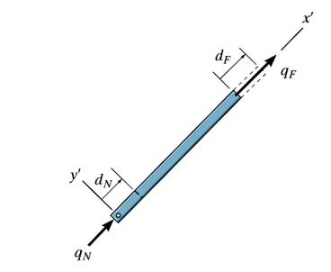
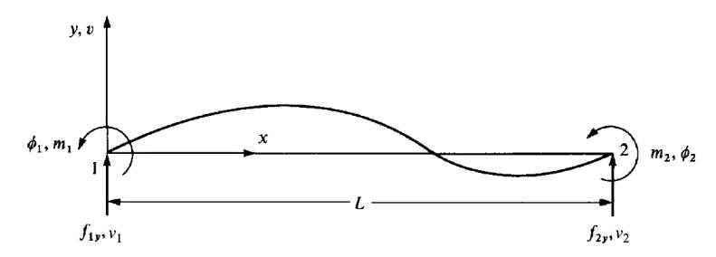
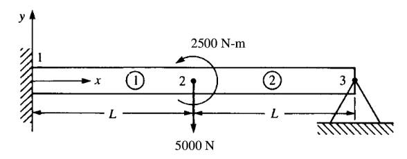
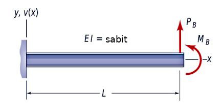
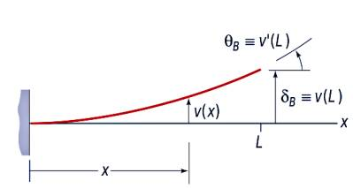
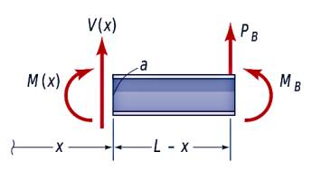

# Materyel Mekaniği - 7

Tek Öğe Direngenlik (Stiffness) Matrisi

Tek bir bağlantı parçasının direngenliğini hesaplamak istiyoruz, bunu hem
eksenel yöndeki yer değişmeleri, hem de bükülme, eğilme gibi eksene dik
uygulanan yönlerden de hesaplamak istiyoruz.

Şekil Fonksiyonları (Shape Functions)

Diyelim ki bir çubuğa bakıyorum ve onun üzerinde iki tane düğüm tanımladım,
düğümlerden biri $X_1 = x_1$ noktasında diğeri $X_2 = x_2$ noktasında.


Ve yine diyelim ki bu iki düğümdeki yer değişimi $u_i$ değerlerini biliyorum,
eldeki örnek için $u_1$ ve $u_2$, kabaca alttaki gibi olsun,


Şekle gelelim; eğer bu iki düğüm üzerinden bir lineer bağlantı kullanmak
istiyorsam yani iki düğüm arasında aradeğerleme yapacak fonksiyon lineer olsun
diyorsam, yapılacak olan bariz aslında,


Aradeğerleme $u_e$ bu şekilde. Peki o fonksiyonda bilinmeyen $a_0,a_1$ nasıl
bulunacak? Biz nihai sonuç olarak bu katsayılarla ilgilenmiyoruz, bizi tek
ilgilendiren yer değişim fonksiyonu, bunu belirtmiştik. O zaman üstteki
fonksiyonu $u_1,u_2$ temelli olarak tekrar yazabilir miyiz acaba? Eğer $x_1$
noktasında fonksiyon değeri $u_1$, $x_2$ noktasında $u_2$ ise,

$$
u(x_1) = a_0 + a_1 x_1 = u_1
$$

$$
u(x_2) = a_0 + a_1 x_2 = u_2
$$

İki bilinmeyen var, iki denklem var, çözüm [1, Ders 2]

$$
a_0 = \frac{u_2 x_1 - u_1 x_2}{L}, \qquad a_1 = \frac{u_2 - u_1}{L}
$$

$L$ kırmızı ile gösterilen parçanın uzunluğu sadece, yani $x_2 - x_1$.

Üstteki $a_0,a_1$ değerlerini nasıl bulduğumuzu merak edenler için

$$
u(x_1) = a_0 + a_1 x_1 = u_1, \quad
u(x_2) = a_0 + a_1 x_2 = u_2
$$

ile başlarız, ikinci formülden birinciyi çıkartırsak,

$$
(x_2 - x_1) a_1 = u_2 - u_1 \to a_1 = \frac{u_2 - u_1}{L}
$$

ki $L = x_2 - x_1$

$a_0$'i bulmak için birinci formüldeki $a_1$'i alıp, yani
$a_1 = \frac{u_1 - a_0}{x_1}$, ikinciye sokuyoruz,


$$
a_0 + \frac{\frac{u_1 - a_0}{x_1}}{x_1} x_2 = u_2
$$

$$
x_1 a_0 + u_1 x_2 - a_0 x_2 = u_2 x_2
$$

$$
u_1 x_2 - u_2x_1 = -a_0 x_1 + a_0 x_2
$$

$$
= a_0 (x_2 - x_1) = a_0 L
$$

$$
a_0 = \frac{u_1 x_2 - u_1 x_2}{L}
$$

Devam edelim.

$a_0,a_1$ degerlerini $u_e$ icine koyunca,

$$
u = \frac{u_2 x_1 - u_1 x_2}{L} - \frac{u_2 - u_1}{L} X_1
$$

Biraz daha cebirsel değiştirme sonrası

$$
u = \frac{(x_2 - X_1)}{L} u_1 + \frac{(X_1 - x_1)}{L} u_2
$$

Bu son değişimi yaptık çünkü bu formda dikkat edersek denklem daha önce
gördüğümüz Galerkin deneme fonksiyonlarına benziyor,

$$
u = u_1 \phi_1(X_1) + u_2 \phi_2 (X_1)
$$

kalıbında görüldüğü gibi. Deneme fonksiyonlarında $u_1,u_2$ sabit değerlerdi, bu
bölümde gördüğümüz $u_i$ değerleri de öyle aslında. Bilinen $u_i$ değerlerini
yaklaşık temsile uğraşıyoruz, gerçi çözüm mekaniği içinde o $u$ değerleri de
hesaplanıyor fakat bu belli formülasyonlar için onların bilindiği
farzedilebilir.

Şimdi $\phi_1,\phi_2$ fonksiyonları bizim önceden seçtiğimiz fonksiyonlardı,
polinom seçtiğimizde $X_1,X_1^2$ gibi hesaplar kullandık. Üstteki türetim
sonrası $N_1,N_2$ var, ve ulaştığımız fonksiyonlar

$$
N_1 = \frac{(x_2 - X_1)}{L}, \quad N_2 = \frac{(X_1 - x_1)}{L} 
$$

Bu şekil fonksiyonları neye benziyor acaba? Alttaki gibi,


Bu iki fonksiyonu üst üste koyduğumuzda (superimpose) yani topladığımızda,
sonucun mavi çizgiyi aynen vereceğini görebilirdik.

İlginç bir diğer özellik, eğer mesela $N_2$'ye tek başına bakarsam, onun ilk
düğümde 0 değerinde, ikinci düğümde 1 değerinde olduğunu görebiliriz.  Eğer
$N_3$ olsa bu şekil de birinci ve ikinci düğümde sıfır olurdu. Diğer yandan her
şekil fonksiyonu ait olduğu düğümde 1 değerindedir. $N_1$ birinci düğümde 1
değerinde, $N_2$ ikinci düğümde 1 değerinde, vs. Bu şekil fonksiyonları öyle
tasarlanmıştır.

Fakat üstteki türetimden daha basit olanı iki noktadaki farkı uzunluğa bölmek,
ve $x$ ile çarpıp başlangıç değerine eklemek. Altta bu teknik kullanılacak.

Makaskiriş

Önce makaskiriş (truss) mekaniği ile başlayalım. Makaskiriş konusuna [4]'te
değinilmişti. Daha önce [1]'de gördüğümüz formülü hatırlarsak,

$$
E = \frac{P/A}{\delta / L}
$$

Biraz farklı notasyon [3, sf. 344] ile buna

$$
\Delta = \frac{NL}{AE}
$$

diyebiliriz, ki $E$ yine Young'in Genliği, $N$ uygulanan kuvvet, $A$ çubuk
alanı, $L$ uzunluğu.


Makaşkiriş öğelerinin sadece eksenel yüklenebildiklerini biliyoruz, eğer üstteki
figür gibi bir senaryo olsaydı, alt uçtan $q'_N$ kuvveti uygulanmış, diğer nokta
bir pime bağlı, bu durumda önceki formülü değiştirip [3, sf. 542]

$$
\Delta = \frac{NL}{AE} \to \frac{\Delta AE}{L} = N
$$

ve $\Delta$ yerine yer değişim $d_N$, kuvvet $N$ için $q'_N$ kullanırız,

$$
q'_N = \frac{AE}{L} d_N
$$

Pimli noktada denge durumunda üstteki kuvvete tepki olarak ona eşdeğerde ama
eksi yönde bir kuvvet oluşmalıdır, ona $q'_F$ diyelim, o zaman diğer uçta

$$
q'_F = -\frac{AE}{L} d_N
$$

olur.


Eğer pimli noktayı değiştirsek, üstteki duruma baksak, o zaman yer değişim
$d_F$ içeren iki formül şöyle olur,

$$
q''_N = - \frac{AE}{L} d_F \quad
q''_F = - \frac{AE}{L} d_F 
$$



Gördüğümüz iki senaryo, yani bir uçta pim var diğerinde yok, sonra tam tersi,
bize dört formül verdi. Eğer her uçta pim olduğu durumu elde etmek istersek, ki
bu durum daha büyük bir makaskiriş sisteminde olurdu, o zaman bu dört formülü
üst üste koymak (superposition) gerekli,

$$
q_N = q'_N + q''_N 
$$

$$
q_F = q'_F + q''_F
$$

Yani

$$
q_N = \frac{AE}{L} d_N - \frac{AE}{L} d_F
$$

$$
q_F = -\frac{AE}{L} d_N + \frac{AE}{L} d_F
$$

Üstteki iki formülü matris formunda yazmak istersek,

$$
\left[\begin{array}{c}
q_N \\ q_F
\end{array}\right] =
\left[\begin{array}{cc}
1 & -1 \\ -1 & 1
\end{array}\right]
\left[\begin{array}{c}
d_N \\ d_F
\end{array}\right] 
$$

Daha kısa olarak

$$
q = k' d
$$

ki $q,k',d$ vektör, matris formundadır ve

$$
k' = \left[\begin{array}{cc}
1 & -1 \\ -1 & 1
\end{array}\right]
$$

$k'$ matrisine öğe direngenlik matrisi (member stiffness matrix) olarak bilinir.

Kirişler (Beams)

Eksene dik (transverse) yüklerin dinamiğini hesaplamak için kiriş formülasyonu
gerekli. Bu kiriş parçasının iki ucuna bakacağız, bu uçlar yer değişimine ve
ufak bir dönüş açısına sahip olabilecekler. Yani her uçta iki olmak üzere
bu sistemde toplam dört derece serbestlik var. Fonksiyon $v(x)$,


Bu fonksiyonu

$$
v(x) = a_1 x^3 + a_2 x^2 + a_3 x + a_4
\qquad (7)
$$

küpsel polinom ile temsil edebiliriz, bu uygun çünkü 4 derece serbestlik var
demiştik, üstteki formülde de böyle. Ayrıca küpsel fonksiyonlar iki parça
yanyana geldiğinde eğimsel ve yer değişim sürekliliğini de sağlayabilirler.

$x=0$ ve $x=L$ noktalarında elde edilebilecek formüllere bakalım [2, sf. 170],

$$
v(0) = v_1 = a_4
$$

$$
\frac{\mathrm{d} v(0)}{\mathrm{d} x} = \phi_1 = a_3
$$

$$
v(L) = v_2 = a_1 L^3 + a_2 L^2 + a_3 L + a_4 
$$

$$
\frac{\mathrm{d} v}{\mathrm{d} x}(L) = \phi_2 = 3 a_1 L^2 + 2 a_2 L + a_3
$$

ki $\phi = \mathrm{d} v / \mathrm{d} x$, üstteki resimde ima edildiği gibi, ve $\phi$'nin
ufak dönüşlere tekabül ettiği durumlar için.

Üstteki dört formülü kullanarak (7) içindeki katsayılar yerine serbestlik
derecesi değişkenleri $v_1,v_2,\phi_1,\phi_2$ kullanabiliriz, biraz cebirsel
takla atmak lazım. $a_3,a_4$ için ne koyulacağı bariz, bunlar sırasıyla
$\phi_1,v_1$ olacak. Geriye $a_1,a_2$ kalıyor, bunun için $v_2,\phi_2$
formüllerini $a_1$ için düzenleyip birbirine eşitlersek, iptaller sonrası
geriye $a_2$ eşitliği ortaya çıkacaktır. Mesela $a_2$ için

$$
a_1 = (v_2 - a_2 L^2 - a_3L - a_4) / L^3, \quad
a_1 = (\phi_2 - 2a_2 L - a_3) / 3L^2
$$

$$
\frac{v_2}{L^3} - \frac{a_2}{L} - \frac{\phi_1}{L^2} - \frac{v_1}{L^3} =
\frac{\phi_2}{3L^2} - \frac{2a_2}{3L} - \frac{\phi_1}{3L^2}
$$

$$
-\frac{a_2}{L} + \frac{2a_2}{3L} =
-\frac{v_2}{L^3} + \frac{\phi_1}{L^2} + \frac{v_1}{L^3} + \frac{\phi_2}{3L^2} - \frac{\phi_1}{3L^2}
$$

$$
-\frac{a_2}{3L} = \frac{v_1 - v_2}{L^3} + \frac{\phi_2}{3L^2} + \frac{2 \phi_1}{3L^2}
\Rightarrow a_2 = -\frac{3}{L^2} (v_1-v_2) - \frac{1}{L} (2\phi_1 + \phi_2)
$$

Benzer şekilde $a_1$ elde edilebilir, sonuç,

$$
v =
\left[
  \frac{2}{L^3} (v_1 - v_2) + \frac{1}{L^2} (\phi_1 - \phi_2) 
\right] x^3 +
\left[
  -\frac{3}{L^2} (v_1 - v_2) - \frac{1}{L} (2\phi_1 + \phi_2)
\right] x^2 +
\phi_1 x + v_1
\qquad (8)
$$

Bu nihai formül kullanılarak kiriş öğe direngenlik matrisi elde
edilebilir. Bu matris için iki uçtaki kesme kuvvetleri ve
bükülme momentleri gerekiyor, onlara $f_{1y}$, $m_1$, $f_{2y}$,
$m_2$ diyelim,



Moment $m(x)$, kesme / teğetsel $v(x)$ formüllerini bir kez daha hatırlarsak

$$
m(x) = EI \frac{\mathrm{d}^2 v}{\mathrm{d} x^2}, \quad
V = EI \frac{\mathrm{d}^3 v}{\mathrm{d} x^3}
$$

Türevi alınan $v$ formülü (8)'de gösterilen olacak, o zaman

$$
f_{1y} = V = EI \frac{\mathrm{d}^3 v(0)}{\mathrm{d} x^3} =
\frac{EI}{L^3} (12 v_1 + 6L \phi_1 - 12 v_2 + 6L \phi_2 )
$$

$$
m_1 = -m = -EI \frac{\mathrm{d}^2 v(0)}{\mathrm{d} x^2} =
\frac{EI}{L^3} ( 6L v_1 + 4L^2 \phi_1 - 6L v_2 + 2 L^2 \phi_2 )
$$

$$
f_{2y} = -V = -EI \frac{\mathrm{d}^3 v(L)}{\mathrm{d} x^3} =
\frac{EI}{L^3} (-12 v_1 - 6L \phi_1 + 12 v_2 - 6L \phi_2 )
$$

$$
m_2 = m = EI \frac{\mathrm{d}^2 v(L)}{\mathrm{d} x^2} =
\frac{EI}{L^3} ( 6L v_1 + 2L^2 \phi_1 - 6L v_2 + 4 L^2 \phi_2)
$$

Değişkenler $m,V$ bir önceki resimde (en sağ) gösterilmişti. İşaret kuralları
şöyle, momentler ve rotasyonlar saat yönü tersinde artı işaretlidir, kuvvetler
ve yer değişimler pozitif $y$ yönünde artı işaretlidir.

Matris formunda üstteki dört formülü şu şekilde tanimlayabiliriz,

$$
\left[\begin{array}{c}
f_{1y} \\ m_1 \\ f_{2y} \\ m_2
\end{array}\right] =
\frac{EI}{L^3}
\left[\begin{array}{cccc}
12 & 6L & -12 & 6L \\
6L & 4L^2 & -6L & 2L^2 \\
-12 & -6L & 12 & -6L \\
6L & 2L^2 & -6L & 4L^2
\end{array}\right]
\left[\begin{array}{ccc}
v_1 \\ \phi_1 \\ v_2 \\ \phi_2
\end{array}\right]
$$

Direngenlik matrisi denen büyüklük $EI / L^3$ çarpı üstteki formülde görülen
4 x 4 matrisidir, yani eşitliğin sağında orta kısımda olan değerler.

Örnek

Daha önce makaskirişlerde gördüğümüz gibi üstdüşüm tekniğini normal kirişler
için de kullanmak mümkündür. Alttaki gibi bir yapı düşünelim [2, sf. 181],



$EI$ büyüklüğünün tüm kiriş boyunca sabit olduğunu kabul edelim. Kirişin orta
noktasına 5000 N kuvveti ve 2500 Nm momenti uygulanıyor. Kiriş en solda bir
duvara sabitlenmiş, sağ noktasında ise bir pimle destekleniyor (pimler
dönüşe izin verir ama yer değişime izin vermez). 

Bu yapıyı üç tane düğüm (node) üzerinden ayrıksal hale getirebiliriz,
düğümler 1,2, ve 3, ve elde iki tane kiriş var, grafikte görülüyor.

Bu iki kiriş parçası için direngenlik matrisleri,

$$
k^{(1)} = \frac{EI}{L^3}
\begin{array}{cc} & \begin{array}{rrrr} v_1 & \phi_1 & v_2 & \phi_2 \end{array} \\ &
\left[
\begin{array}{cccc}
  12 & 6L & -12 & 6L \\
  6L & 4L^2 & -6L & 2L^2 \\
  -12 & -6L & 12 & -6L \\
  6L & 2L^2 & -6L & 4L^2
\end{array}
\right]
\end{array} 
$$

$$
k^{(2)} = \frac{EI}{L^3}
\begin{array}{cc} & \begin{array}{rrrr} v_2 & \phi_2 & v_3 & \phi_3 \end{array} \\ &
\left[
\begin{array}{cccc}
  12 & 6L & -12 & 6L \\
  6L & 4L^2 & -6L & 2L^2 \\
  -12 & -6L & 12 & -6L \\
  6L & 2L^2 & -6L & 4L^2
\end{array}
\right]
\end{array} 
$$

Tüm direngenlik matrisini oluşturmak için yine direk direngenlik metotunu
kullanırız, üstdüşüm uygulayınca her iki matris genişletilir, ve üst üste konur,
nihai sonuç,

$$
\left[\begin{array}{c}
F_{1y} \\ M_1 \\ F_{2y} \\ M_2 \\ F_{3y} \\ M_3
\end{array}\right] =
\frac{EI}{L^3}
\left[\begin{array}{cccccc}
12 & 6L & -12 & 6L & 0 & 0 \\
6L & 4L^2 & -6L & 2L^2 & 0 & 0 \\
-12L & -6L & 12+12 & -6L+6L & -12 & 6L \\
6L & 2L^2 & -6L+6L & 4L^2+4L^2 & -6L & 2L^2 \\
0 & 0 & -12 & -6L & 12 & -6L \\
0 & 0 & 6L & 2L^2 & -6L & 4L^2
\end{array}\right]
\left[\begin{array}{c}
v_1 \\ \phi_1 \\ v_2 \\ \phi_2 \\ v_3 \\ \phi_3
\end{array}\right]
$$

Bu noktada sınır şartlarını, ya da kısıtlamaları sisteme dahil edebiliriz.
Düğüm 1'de bir sabit destek var, düğüm 3'te bir menteşe (hinge) desteği var,
bu demektir ki

$$
\phi_1 = 0, \qquad
v_1 = 0, \qquad
v_3 = 0
$$

En sağ uçta $v_3 = 0$ oldu çünkü menteşe dönüşe izin verir, yer değişime
izin vermez, $\phi_3$ değeri sıfırdan büyük olabilir, ama $v_3$ sıfır olur.

Kısıtlamaları dahil edince birinci, ikinci ve beşinci satır ve kolonları
dışarıda bırakarak bir sistem elde edebiliriz,

$$
\left[\begin{array}{c}
-5000 \\ 5000 \\ 0
\end{array}\right] =
\frac{EI}{L^3}
\left[\begin{array}{ccc}
24 & 0 & 6L \\
0 & 8L^2 & 2L^2 \\
6L & 2L^2 & 4L^2
\end{array}\right]
\left[\begin{array}{c}
v_2 \\ \phi_2 \\ \phi_3
\end{array}\right]
$$

```python
from sympy import symbols, simplify, latex
from sympy.matrices import Matrix
L,E,I = symbols("L, E, I")
A = Matrix([[24,0,6*L], [0,8*L**2,2*L**2],[6*L,2*L**2,4*L**2]])
b = Matrix([[-5000],[5000],[0]])
sol = A.solve(b)
```

Elde edilen `sol` sonucuna baktığımızda, biraz basitleştirme sonrası

$$
\left[\begin{array}{c}
v_2 \\ \phi_2 \\ \phi_3
\end{array}\right] =
\frac{625}{L}
\left[\begin{array}{c}
(3-7L)/12 \\
(5-L)/4L \\
(L-1)/L
\end{array}\right]
$$

sonucu çıkıyor.

Cebirsel Form

Bazi tür problemleri çözmek için alttaki form kullanılabilir, (3)'teki iki
dereceli diferansiyel denklemi kullanırız. Mesela alttaki gibi bir problem
olsun,



Sol ucu sabit bir dirsekli kiriş (cantilevel beam) var. Bu kirişe dikey yönde en
sağ ucunde $P_B$ yükü ve $M_B$ momenti uygulanıyor. Bu sistemde eğim $v'(x)$ ve
sapma $v(x)$ için gereken ifadeyi bulalım.

Uygulanan iki kuvvet kirişi yukarı doğru eğer, o zaman eğim alttakine benzer,



$M(x)$ bulmak için herhangi bir noktadaki hissedilen momentlerin toplamının
sıfır olduğunu hatırlayalım,

$$
M(x) - P_B(L-x) - M_B = 0
$$

Moment-eğri denklemini (3) kullanalım, ve üsttekileri o denkleme koyalım,

$$
EIv'' = M(x) = P_B(L-x) - M_B
$$

Aradığımız sonuç $v$ ve $v'$. O zaman üstteki denklemi iki kere entegre etmemiz
gerekli.

$$
EI v' = M_B x + P_B Lx - P_B \left( \frac{x}{2} \right)^2 + C_1
\qquad (4)
$$

$$
EIv = M_B \left( \frac{x^2}{2} \right) +
P_B L  \left( \frac{x^2}{2} \right) -
P_B \left( \frac{x^3}{6} \right) +
C_1 x + C_2
\qquad (5)
$$



Şimdi sınır şartlarını probleme uygulayalım, bu değerler bilinenler
olarak bilinmeyen değerlerin bulunmasına yardımcı olacak. Sınır şartları
problem tanımında tarif edildi, kirişin bir ucu sabitlenmiş o zaman
$x=0$ noktasında hem eğim hem de sapma sıfır olmalı. Yani

$$
v'(0) = 0,\quad v(0) = 0
$$

Şartlardan ilkini $v'(0)=0$ ve $x=0$ kullanırsak (4) şu hale gelir,

$$
EI v' = C_1 = 0
$$

$v(0)=0$ ve $x=0$ kullanırsak (5) şöyle olur,

$$
EIv = C_2 = 0
$$

Demek ki (4) ve (5) şöyle yazılabilir,

$$
v'(x) = \frac{1}{EI} \left[
  M_B x + P_B Lx - P_B \left( \frac{x}{2} \right)^2
\right]
$$

$$
v(x) = \frac{1}{EI} \left[
  M_B \left( \frac{x^2}{2} \right) + 
  P_B L  \left( \frac{x^2}{2} \right) -
  P_B \left( \frac{x^3}{6} \right)
\right]
$$

Artık üstteki formülleri kullanarak kirişin en son noktasında, yani $x=L$'de, ya
da $B$ yerinde, sapmanın ne olacağını hesaplayabiliriz. Yerine koyarsak, sapma
$\delta_B$ diyelim,

$$
\delta_B = v(L) =
\frac{1}{EI} \left[
M_B \left( \frac{L^2}{2}  \right) +
P_B \left( \frac{L^3}{3}  \right)
\right]
$$

Aynı noktadaki sapma açısı $\theta_B$

$$
\theta_B = v'(L) =
\frac{1}{EI} \left[
M_B L + P_B \left( \frac{L^2}{2} \right) 
\right]
$$

Bir diğer formda denklemler şöyle gösterilebilir,

$$
\delta = \left( \frac{L^3}{3EI} \right) P +
\left( \frac{L^2}{2EI} \right) M
$$

$$
\theta = \left( \frac{L^2}{2EI} \right) P +
\left( \frac{L}{EI} \right) M
$$

Üstteki formülleri $P,M$ eşitlikleri olarak tekrar düzenleyebiliriz.
Birinci formülü $\frac{3EI}{L^3}$ ikincisini $\frac{2EI}{L^2}$ ile
çarparsak mesela her iki formülde $P$ tek başına kalır, ikinci formülden
birinciyi çıkartıp $P$'ler iptal edilir, basitleştirme sonrası $M$ elde
edilir, benzer şekilde $P$ bulunur, sonuç

$$
P = \left( \frac{12EI}{L^3}  \right) \delta -
\left(  \frac{6EI}{L^2} \right) \theta
$$

$$
M = - \left( \frac{6 EI}{L^2}  \right) \delta +
\left( \frac{4 EI}{L}  \right) \theta
$$

Kaynaklar

[1] Bayramlı, *Fizik, Materyel Mekaniği - 1*

[2] Logan, *A First Course in the Finite Element Method, 5th Edition*

[3] Hibbeler, *Structural Analysis, 8th Edition*

[4] Bayramlı, *Hesapsal Bilim, Ders 1-15*


