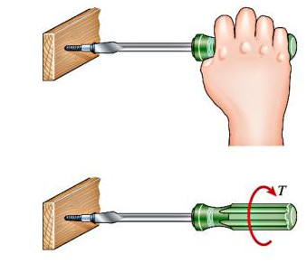
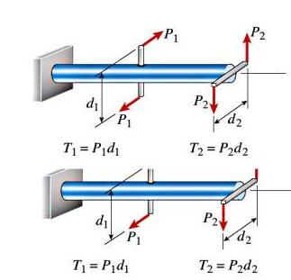
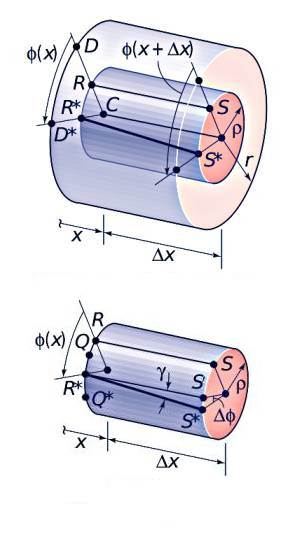
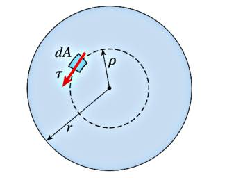
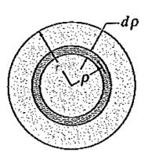

# Materyel Mekaniği - 9

Burulma (Torsion)

Eksenel ve eksene dik yüklemelerden biraz daha çetrefil analiz gerektiren bir
yük uygulama şekli, bir çubuğun büküldüğü zaman ortaya çıkan burulma durumudur.
Burulma bir öğe momentlerle, ya da torklarla dönüşsel olarak yüklendiği zaman
ortaya çıkar [1, sf. 224].

Mesela üstteki ilk resimde bir vidanın döndürülmesi görülüyor, bu durumda el bir
$T$ torku uygular. Bir arabanın tekerlek aksı, şaftı ya da gemilerin pervanesine
(propeller) dönüş ileten aks aynı davranışı sergiler.  Altta üçüncü resimde
görülen tork ilk nokta için $T_1 = P_1 d_1$ ile, ikincisi $T_2 = P_2 d_2$ ile
hesaplanabilir.

Burulma deformasyonunun mekaniğine biraz daha yakından bakalım. Bir çubuğu
$\phi(x)$ açısına gelecek şekilde büküyoruz, ve burulma bir $\gamma$ kesme
gerginliğine yol açıyor.

Amacımız burulma deformasyonu (dönüş açısı $\phi$) ve onun sebep olduğu kesme
gerginliği $\gamma$ arasında bir ilişki elde etmek. Üstteki ilk şekil çubuğun
bir $x$ bağlamındaki bir parçasını gösteriyor, altındaki ise o parçanın içindeki
daha ufak yarıçaptaki bir parçasını [3, sf. 240].

Burulma önce ve sonrası aynı figürde, mesela üstteki resimde ikinci şekle
bakarsak, QRS açısı bir dik açı, burulma sonrası elde edilen Q*R*S* açısı
dik değildir.

$\gamma$ büyüklüğünü bulmak için üstteki resimde ikinci figure bakalım, $S^{\ast}$ ve
$S'$ arasındaki uzunluğu, $R^{\ast}$ ve $S'$ uzunluğuna bölersek (bu yapılabilir
çünkü ufak açılar sözkonusu ise tanjant hesabı aşağı yukarı açının kendisine
eşittir [2]) istenen sonucu bulabiliriz. Tabii $R^{\ast}S'$ uzunluğu $\Delta x$,
ve $S^{\ast}S'$ uzunluğu çember çevresinin ufak bir parçası, onu  $\rho \Delta \phi$
ile buluruz, bunları bir limit hesabı ile ifade edersek, ve $\Delta x \to 0$
iken

$$
\gamma = \lim_{\Delta x \to 0} \frac{S^{\ast}S'}{R^{\ast} S'} =
\lim_{\Delta x \to 0} \frac{\rho \Delta \phi}{\Delta x} =
\rho \frac{\mathrm{d} \phi}{\mathrm{d} x}
$$

O zaman eksenel yuvarlak olan bir birimin burumsal deformasyon için
gerginlik-yer değişim (strain-displacement) denklemi

$$
\gamma = \gamma(x,\rho) = \rho \frac{\mathrm{d} \phi}{\mathrm{d} x}
\qquad (1)
$$

$\phi$'in $x$'e göre türevi alınabildi çünkü formülü $x$'e bağlıdır, bunu
üstteki grafikte ilk figürde görüyoruz, $\phi(x)$ açısı $\phi(x+\Delta x)$
açısından farklı. Eğer $\phi$'yi formülsel olarak düşünsek herhalde $x$ arttıkça
ona lineer oranla artan bir açı büyüklüğü formülize edilebilirdi. $\Delta \phi$
değeri $\Delta x$ sonrası $\phi(x)$'in ne kadar değiştiğini temsil ediyor,
doğal olarak o da $x$'e bağlıdır.

Genel olarak kesme / teğetsel gerginliği ve stresi arasındaki ilişkiyi daha önce
gördük, burada da bir Hooke Kanunu var,

$$
\tau = G \gamma
$$

$G$ sabiti kesme modülüsü. Üstteki formüle (1)'i sokarsak,

$$
\tau = G \rho \frac{\mathrm{d} \phi}{\mathrm{d} x}
\qquad (3)
$$

Bu formül bize bir kesitteki kesme streslerinin dağılımını veriyor. Eğer
çubuk materyeli homojen (her yerde aynı), yani $G$ sabit ise kesme stresi
merkezden dışa doğru çıktıkça $\rho$'ya oranlı lineer bir şekilde artacaktır.

Tork hesabına gelelim. $\tau$ stresleri sürekli olarak yüzeyde etkili oldukları
için bir moment etkisi yaratıyorlar, bu momentlerin toplamı çubuğa uygulanan
torka eşit olacaktır. Merkeze yarıçapsal $\rho$ uzaklığında bir $\mathrm{d} A$ parçası
düşünelim,

Bu ufak bölgeye etki eden kesme stresi $\tau \mathrm{d} A$'dir, ki $\tau$ yarıçap
$\rho$'da etkili olan kesme stresidir. Bu kuvvetin momenti kuvvet çarpı
merkeze olan uzaklık, bu örnekte uzaklık yine yarıçapın kendisi, tüm bu
momentleri bulup alan üzerinden entegre edersek,

$$
T = \int_A \rho \left( G \rho \frac{\mathrm{d} \phi}{\mathrm{d} x} \right) \mathrm{d} A
$$

Eğer $G$ değişkeni $\rho$'dan bağımsız ise, 

$$
T = G \frac{\mathrm{d} \phi}{\mathrm{d} x} \int_A \rho^2 \mathrm{d} A
\qquad (2)
$$

Entegral içinde kalan kısım $\int_A \rho^2 \mathrm{d} A$ aslında her şekil için belli
bir formüle sahip olan kutupsal dönme direnci (polar moment of inertia),
notasyonda $I_P$ olarak geçer, bu örnekte bir çember şekli var, bu şekil için
görülen entegral

$$
I_P = \int_A \rho^2 \mathrm{d} A
$$

Üstteki hesabı yapmak için alttaki şekli düşünelim, 

$\mathrm{d} A$'yi şekilde görülen koyu gri ince halka olarak kabul edelim, o halkanın
alanı nedir? Bu alanı kenarı halkanın uzunluğu çarpı eni ile hesaplayabiliriz
[4, sf. 474]. En olarak sonsuz küçük $\mathrm{d} \rho$ alalım, çevre bilinen formül
$2\pi\rho$, demek ki $\mathrm{d} A = 2\pi\rho \mathrm{d} \rho$. Tüm entegral,

$$
I_P = \int_A \rho^2 \mathrm{d} A =
\int_{0}^{r} \rho^2 (2\pi\rho \mathrm{d} \rho) =
2\pi \int_{0}^{r} \rho^3 \mathrm{d} \rho =
2\pi \frac{1}{4} \rho^4 \bigg\vert_{0}^{r}
$$

$$
I_P = \frac{\pi}{2} r^4
$$

Biz (2) ile devam edelim, o formülde $I_P$ notasyonu kullanalım şimdilik,

$$
T = G \frac{\mathrm{d} \phi}{\mathrm{d} x} I_P
$$

$$
\frac{\mathrm{d} \phi}{\mathrm{d} x} = \frac{T}{G I_P}
$$

Üstteki formül ile (3) formülünü birleştirirsek [3, sf. 243],

$$
\frac{T}{G I_P} = \frac{\tau}{G \rho }
$$

$$
\frac{T}{I_P} = \frac{\tau}{\rho }
$$

$$
\tau = \frac{T\rho}{I_P} 
$$

Fonksiyonları tüm değişkenleri ile belirtirsek,

$$
\tau \equiv \tau(x,\rho) = \frac{T(x) \rho}{I_P(x)} 
$$

Burulma Formülünü (Torsion Formula) bulmuş olduk.

Çoğunlukla burulan bir öğenin maksimum kesme stresi ile ilgileniyoruz, o
zaman formül

$$
\tau_{max} = \frac{T_{max} r}{I_P} 
$$

haline gelir. Ayrıca (1) formülünü baz alınca, en dışta, değişimin maksimum
olduğu yerde,

$$
\gamma_{max} = r \frac{\mathrm{d} \phi}{\mathrm{d} x}
$$

ifadesi de doğrudur. 

Kaynaklar

[1] Gere, *Mechanics of Materials*

[2] Bayramlı, *Normal Diferansiyel Denklemler, Trigonometri*

[3] Craig, *Mechanics of Materials*

[4] Hibbeler, *Statics and Mechanics of Materials*

