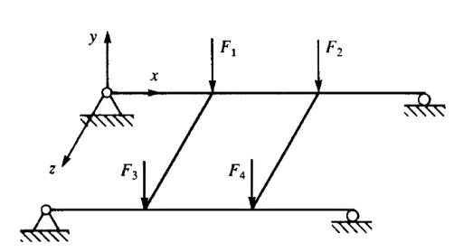
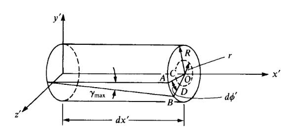
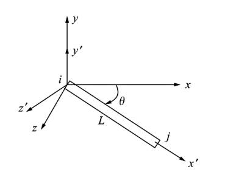
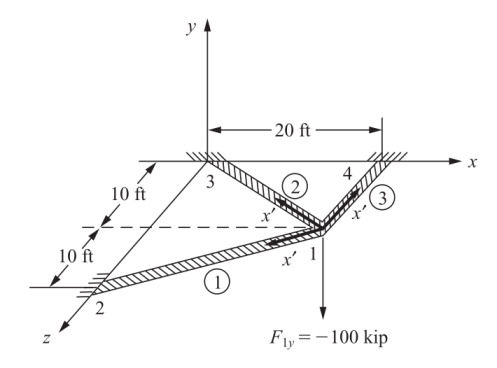

# Materyel Mekaniği - 10

Izgara Denklemleri

Yapısal mekanikte ızgara yüklerin dik uygulandığı bir sistemdir. Izgaranın
öğelerinin katı (rigid) şekilde bağlandığı farz edilir, yani ögelerin birbirine
bağlandığındaki açılar aynı kalır. Düğüm noktalarında burumsal ve bükülme
momentleri süreklilik gösterir. Izgara örnekleri bir evin tabanı (floor) ya da
bir köprünün alt yüzeyi olabilir [3, sf. 262].



Ama ızgara denklemlerine detaylı giriş yapmadan önce Galerkin, ve şekil
fonksiyonları (shape function) konusuna bakalım.

Alttaki gibi bir denklem düşünelim,

$$
E I \frac{\mathrm{d}^4 y}{\mathrm{d} X_1^4} = q
\qquad (1)
$$

Biraz düzenleme sonrası

$$
E I \frac{\mathrm{d}^4 y}{\mathrm{d} X_1^4} - q = 0
$$

elde ederim. Amacım öyle bir yaklaşık $y$, ya da $y_{approx}$ diyelim, bulmak ki
üstteki denklemi çözebileyim. Bunu $y$ yerine onu yaklaşık temsil edebilen bir
diğer fonksiyonu geçirerek yapabilirim. Bir polinom bu işi görebilir; Pek çok
diğer yöntemin kullandığı tipik bir polinom vardır,

$$
y_{approx} = a_0 + a_1 X_1 + a_2 X_1^2 
$$
diye gider, aslında daha genel olarak olan her terimde "bir katsayı çarpı
$X_1$'in bir tür fonksiyonu'' gibi bir toplam kullanmak daha iyi olabilir,
bu formda,

$$
y_{approx} = a_0 \phi_0(X_1) + a_1 \phi_1(X_1) + a_2 \phi_2(X_1) 
$$

Daha kısa olarak

$$
y_{approx} = \sum_{i=0}^{n} a_i \phi_i(X) 
$$

Dikkat $\phi_i(X)$ içinde $X$ var bu $X = X_1,X_2,..,X_n$ anlamında, cebirsel
olarak her $\phi$ fonksiyonuna $X$ geçildiğini düşünebiliriz ama her $\phi_i$
tüm $X$ öğelerini kullanmayabilir; üstteki polinom örneğinde mesela $\phi_1$
fonksiyonu sadece $X_1$'i kullanarak bir hesap yapar, diğerleri diğer şekillerde.

Not, $y_{approx}$ gerekli (essential) sınır şartlarını yerine getirmelidir.

Şimdi ızgara formülleriyle devam edelim. Şekil fonksiyonları lazım olacak o
konuyu [5]'te görmüştük. Bu sistemin öğelerinin katı (rigid) şekilde
bağlandığını söylemiştik, yani öğelerin birbirine bağlandığındaki açılar aynı
kalır, düğüm noktalarında burumsal ve bükülme momentleri süreklilik gösterir. O
zaman bu tür bir ızgaranın her ögesinin her ucunda 3 olmak üzere 6 derece
serbestliği olacaktır.


Değişkenlere bakarsak, sol uçta mesela $v'_1$ var, bu yer değişimi.  Bir diğer
değişken $\phi'_{1z}$ bükülme açısı, notasyonel olarak hangi eksen etrafında
dönüldüğünü değişkene yazıyoruz. Sol kısım için üçüncü değişken yine dönüş
açısı, ama bu seferki burulma sebebiyle ortaya çıkıyor, $x$ ekseni etrafında bu
sebeple ona $\phi'_{1x}$ diyoruz. Aynı notasyonu sağ kısma uyguluyoruz, $v'_2$,
$\phi'_{2z}$ ve $\phi'_{2x}$ elde ediyoruz.

Burulma icin alttaki çubuğu düşünelim [3, sf. 264],


Eğer bir $\phi'$ açısı 1 noktasında $\phi'_{1x}$ 2 noktasında $\phi'_{2x}$
olsun istiyorsak ve aradaki değişim lineer ise,

$$
\phi' = \left( \frac{\phi'_{2x} - \phi'_{1x}}{L}  \right) x' + \phi'_{1x}
\qquad (2)
$$

Eğer şekil fonksiyonu $N_1,N_2$ kullanmak istersek ki her iki fonksiyon
sırasıyla $x'$ değişkeninin birer fonksiyonu, yani

$$
\phi' = N_1 \phi'_{1x} + N_2 \phi'_{2x}
$$

olacak şekilde, o zaman

$$
N_1 = 1 - \frac{x'}{L}, \quad N_2 = \frac{x'}{L}
$$

ile bunu yapabilirdik. Matris formunda

$$
\phi' = [\begin{array}{cc} N_1 & N_2 \end{array}]
\left[\begin{array}{c}
\phi'_{1x} \\ \phi'_{2x}
\end{array}\right]
$$



Maksimum kesme (shear) gerginliğini bulmak için daha önceki formülü
hatırlayalım,

$$
\gamma_{max} = \frac{R \mathrm{d} \phi'}{\mathrm{d} x'}
$$

Herhangi bir $r$ yarıçapı için

$$
\gamma = \frac{r \mathrm{d} \phi'}{\mathrm{d} x'}
$$

Üstteki formüle (2)'deki ifadeyi sokarsak,

$$
\gamma =
\frac{r \mathrm{d} \phi'}{\mathrm{d} x'} =
\frac{r}{L} ( \phi'_{2x} - \phi'_{1x}  )
\qquad (3)
$$

[2] dersinde görmüştük ki Burulma Formülü (Torsion Formula)

$$
\tau = \frac{T\rho}{I_P}
$$

[3, sf. 265] notasyonu ile belirtirsek 

$$
\tau = \frac{m'_x R}{J}
$$

Ya da

$$
m'_x = \frac{\tau J}{R}
$$

Lineer elastik eşyönlü (isotropic) materyeller için kesme stresi $\tau$ ve kesme
gerginliği $\gamma$ arasındaki ilişkiyi

$$
\tau = G \gamma
$$

olarak biliyoruz. Üstteki formülü iki üsttekine sokunca,

$$
m'_x = \frac{G J}{R} \gamma
$$

Bu formüle (3)'ü sokarsak, 

$$
m'_x = \frac{G J}{R} \frac{R}{L} ( \phi'_{2x} - \phi'_{1x}  )
$$

$$
m'_x = \frac{G J}{L} ( \phi'_{2x} - \phi'_{1x}  )
$$

Son bulduğumuz formül $1x,2x$ ifadeleri içeriyor fakat aslında genel bir
$x$ için bu hesap yapıldı. Eğer gerçekten 1 noktasındaki torku hesaplamak
istiyorsak (resmi tekrar paylaşalım),


Formül,

$$
m'_{1x} = \frac{G J}{L} ( \phi'_{1x} - \phi'_{2x}  )
$$

Dikkat edersek 1 eksi 2 yazdık, burulma açısı 2'ye giderken büyüyecek, 1'de
sabit. 2 noktası için [4],

$$
m'_{2x} = \frac{G J}{L} ( \phi'_{2x} - \phi'_{1x}  )
$$

Son iki formülü matris formunda yazabiliriz,

$$
\left[\begin{array}{c}
m'_{1x} \\ m'_{2x} 
\end{array}\right] =
\frac{GJ}{L}
\left[\begin{array}{rr}
1 & -1 \\ -1 & 1
\end{array}\right]
\left[\begin{array}{c}
\phi'_{1x} \\ \phi'_{2x} 
\end{array}\right]
\qquad (5)
$$

Demek ki direngenlik matrisi eşitliğin sağındaki ortada kalan bölümdür. Bu
matris burulma (torsion) etkilerini gösteriyor, etkiler tek bir kiriş öğesi
temel alınarak hesaplandı.

Eğer burulma etkilerini bükülme (bending) ve kesme stres etkileriyle
birleştirmek istiyorsak [5]'teki formülü kullanabiliriz, hatırlarsak bu
formüldeki direngenlik matrisi, yine tek bir kiriş öğesi için, şöyleydi,

$$
\frac{EI}{L^3}
\left[\begin{array}{cccc}
12 & 6L & -12 & 6L \\
6L & 4L^2 & -6L & 2L^2 \\
-12 & -6L & 12 & -6L \\
6L & 2L^2 & -6L & 4L^2
\end{array}\right]
\qquad (4)
$$

Matris bir değişken listesini referans alıyor muhakkak, bu liste daha
önce göstermiştik ki $f_{1y}, m_1, f_{2y}, m_2$, yer değişim için
$v_1, \phi_1, v_2, \phi_2$. 

Bize gereken (5)'teki burulma mantığını (4)'teki bükülme ve yer değişim mantığı
ile birleştirmek. Bu birleşmiş eşitliğin solunda, kirişin bir tarafı için eksene
dik yer değişim kuvveti, burulma torku ve bükülme momenti, $f'_{1y}$, $m'_{1x}$,
$m'_{1z}$ olacak, öğenin sağ kısmı için benzer durum, $f'_{2y}$, $m'_{2x}$,
$m'_{2z}$.  Eşitliğin sağında, direngenlik matrisini çarpacak yine 6 değişken
var, bunlar $v'_1$, $\phi'_{1x}$, $\phi'_{1z}$, $v'_2$, $\phi'_{2x}$,
$\phi'_{2z}$. Üstdüşüm ile birleştirme için değişken listesini 1, 2, 3, 4, 5, 6
diye etiketlesem, o zaman 1, 3, 4, 6 değişkenleri (4)'ten 2, 5 değişkenleri
(5)'ten geliyor olurdu. Birleşmiş sistem,

$$
\left[\begin{array}{c}
f'_{1y} \\ m'_{1x} \\ m'_{1z} \\ f'_{2y} \\ m'_{2x} \\ m'_{2z} 
\end{array}\right] =
\left[\begin{array}{cccccc}
\dfrac{12 EI}{L^3} & 0 & \dfrac{6 EI}{L^2} & \dfrac{-12EI}{L^3} & 0 & \dfrac{6EI}{L^2}\\
 & \dfrac{GJ}{L} & 0 & 0 & \dfrac{-GJ}{L} & 0 \\
 & & \dfrac{4EI}{L} & \dfrac{-6EI}{L^2} & 0 & \dfrac{2EI}{L} \\
 & & & \dfrac{12EI}{L^3} & 0 & \dfrac{-6EI}{L^2} \\
 & & & & \dfrac{GJ}{L} & 0 \\
 & & & & & \dfrac{4EI}{L} 
\end{array}\right]
\left[\begin{array}{c}
v'_1 \\ \phi'_{1x} \\ \phi'_{1z} \\ v'_2 \\ \phi'_{2x} \\ \phi'_{2z}
\end{array}\right]
$$

Üstteki matris simetriktir, bu sebeple sol alt kısmı boş bıraktık, üst sağ kısım
ile simetriktir. Direngenlik matrisi $k'$ ortadaki 6x6 matrisi olarak kabul
edilebilir.

Yine `sympy` ile sağlama yapalım,

```python
from sympy import symbols, pprint, latex
from sympy.matrices import Matrix
import pandas as pd
pd.set_option('display.max_columns', None)

G,J,E,L,I = symbols("G,J,E,L,I")
```

```python
vars1 = ['phi1x','phi2x']
M1 = pd.DataFrame([[1,-1],[-1,1]],index=vars1)
M1 = (G*J/L)*M1
M1.columns = vars1
print (M1)
```

```
        phi1x   phi2x
phi1x   G*J/L  -G*J/L
phi2x  -G*J/L   G*J/L
```

```python
vars2 = ['v1','phi1z','v2','phi2z']
M2 = pd.DataFrame([[12, 6*L,-12,6*L],
                  [6*L,4*L**2,-6*L,2*L**2],
                  [-12,-6*L,12,-6*L],
                  [6*L,2*L**2,-6*L,4*L**2]],index=vars2)
M2 = (E*I/L**3)*M2
M2.columns = vars2
print (M2)
```

```
                 v1        phi1z            v2        phi2z
v1      12*E*I/L**3   6*E*I/L**2  -12*E*I/L**3   6*E*I/L**2
phi1z    6*E*I/L**2      4*E*I/L   -6*E*I/L**2      2*E*I/L
v2     -12*E*I/L**3  -6*E*I/L**2   12*E*I/L**3  -6*E*I/L**2
phi2z    6*E*I/L**2      2*E*I/L   -6*E*I/L**2      4*E*I/L
```

```python
import sys; sys.path.append('../phy_020_strs_08')
import dfutil

all_vars = ['v1','phi1x','phi1z','v2','phi2x','phi2z']
M1f = dfutil.expand_dataframe(M1,all_vars)
M2f = dfutil.expand_dataframe(M2,all_vars)
Mall = M1f + M2f
print (Mall)
```

```
                 v1   phi1x        phi1z            v2   phi2x        phi2z
v1      12*E*I/L**3       0   6*E*I/L**2  -12*E*I/L**3       0   6*E*I/L**2
phi1x             0   G*J/L            0             0  -G*J/L            0
phi1z    6*E*I/L**2       0      4*E*I/L   -6*E*I/L**2       0      2*E*I/L
v2     -12*E*I/L**3       0  -6*E*I/L**2   12*E*I/L**3       0  -6*E*I/L**2
phi2x             0  -G*J/L            0             0   G*J/L            0
phi2z    6*E*I/L**2       0      2*E*I/L   -6*E*I/L**2       0      4*E*I/L
```

Izgarayı yerel kordinat sisteminden globala çeviren transform matrisi ise
alttadır,

$$
T_G = \left[\begin{array}{cccccc}
1 & 0 & 0 & 0 & 0 & 0 \\
0 & C & S & 0 & 0 & 0 \\ 
0 & -S & C & 0 & 0 & 0 \\ 
0 & 0 & 0 & 1 & 0 & 0 \\ 
0 & 0 & 0 & 0 & C & S \\ 
0 & 0 & 0 & 0 & -S & C 
\end{array}\right]
$$

ki buradaki $\theta$ $x$ ve $x'$ arasındaki açıdır, $i$,$j$ düğümlerini baz
alacak şekilde figür altta gösteriliyor,



$C$ ve $S$ her öge için hesaplanır, $j$ öğenin üç noktası $i$ başlangıç
noktası ise,

$$
C = \cos\theta = \frac{x_j - x_i}{L}, \quad
S = \sin\theta = \frac{z_j - z_i}{L},
$$

O zaman global direngenlik matrisi $k$ şu formül olacaktır [3, sf. 269],

$$
k = T_G^T k' T_G
$$

Problem

Alttaki ızgara sistemini analiz edin [3, sf. 265], ızgarada üç tane öğe var,
sistem düğüm 2, 3 ve 4 noktasında sabitlenmiş halde, ve sisteme dikey yönde 100
kip büyüklüğünde bir kuvvet uygulanıyor. Global kordinat sistemi düğüm 3
merkezlidir (o nokta orijin, [0,0,0] kabul edilebilir).  Tüm öğeler için $E = 30
\times 10^3$ ksi, $G = 12 \times 10^3$ ksi, $I = 400$ inch, $J = 110$ inch
olsun.



Çözüm

Bu probleme yaklaşım [6]'dakine benziyor, şekle bakarak öğe öğe $k$ matrislerini
oluşturuyoruz (üç tane), ve her ögenin değişkenlerini bu öğelerin üç noktalarına
bakarak isimlendiriyoruz. Sonra her $k$ matrisini tüm değişken listesine
genişleterek bu genişletilmiş matrisleri birbiri ile topluyoruz (üstdüşümleme),
çünkü bu noktada matrisler aynı değişken listesine tekabül ediyorlar. Bu şekilde
bir lineer cebir $Ax = b$ sistemi yaratmış oluyoruz ve bu sistemi lineer cebirle
çözüyoruz. Eğer varsa çözümden önce sıfır olan değişkenleri (sınır şartları) ana
matristen atıyoruz, böylece boyutu daha küçük bir sistem elde ediliyor
(neredeyse tüm problemlerde böyle şartlar vardır), ve çözüm daha basitleşiyor.

$k'$ matrisini biraz önce üstte sembolik olarak bulmuştuk, onu kullanarak ve
döndürme matrisleri ile $k$ hesabı yapılabilir,

```python
import pandas as pd
from sympy import symbols, latex, simplify
from sympy.matrices import Matrix
pd.set_option('display.max_columns', None)

G,J,C,S,L,E,I = symbols("G,J,C,S,L,E,I")
kprime = Matrix(Mall)

T_G = Matrix([[1,0,0,0,0,0],
              [0,C,S,0,0,0],
              [0,-S,C,0,0,0],
              [0,0,0,1,0,0],
              [0,0,0,0,C,S],
              [0,0,0,0,-S,C]])
k_G = T_G.transpose()*kprime*T_G
```

Her öge için $E,G,I,J$ değişkenleri aynı, değişik olabilecek büyüklükler $C,S$
ve $L$. Ana sabitleri bir sözlük içine koyalım, farklı olan büyüklükleri onun
üzerine ekleriz, sonra her öge için sayısal değerleri bu eklenmiş sözlük ile
cebirsel / sembolik sonuçta `subs` ile yerlerine koyacağız, böylece her
ögenin sayısal matrisini elde etmiş olacağız.

```python
d = {E:30000.0, G: 12000, I: 400, J: 110}
```

Öğe 1

Resme bakarak 1 öğesinin uzunluğu $L$ nedir? Bir kenarı 20 ft diğer kenarı 10 ft
olan bir üçgen var orada, o zaman $L = \sqrt{ 20^2 + 10^2} = 22.36$ ft. Inch
dönüşümü için 12 ile çarpmak lazım, 1 ft = 12 inch. $C$ ve $S$ için

$$
C = \cos \theta = \frac{x_2-x_1}{L} = -20-0 / 22.36 = -0.894
$$

$$
S = \sin \theta = \frac{z_2-z_1}{L} = 10-0 / 22.36 = 0.447
$$

```python
d1 = d.copy(); d1.update({L:22.36*12, C:-0.894, S: 0.447})
df1 = k_G.subs(d1)
df1 = pd.DataFrame(np.array(df1).astype(np.float64))
df1.columns = ['v1','phi1x','phi1z','v2','phi2x','phi2z']
```

Dikkat değişken isimleri öğenin uçlarındaki düğüm sayılarından geliyor. Öğe 1'in
sonunda 2 düğümü, başında 1 düğümü var, bu sebeple buradaki $k$ matrisinin
değişkenleri $v_1,\phi_{1x},\phi_{1z},v_2,\phi_{2x},\phi_{2z}$ olmalı.

Öğe 2

$$
C = \frac{x_3-x_1}{L} = -20-0 / 22.36 = -0.894
$$

$$
S = \frac{z_3-z_1}{L} = -10-0 / 22.36 = -0.447
$$

Aynı $L$ değişkenini kullandık büyüklük 1 öğesi ile aynı çıktı fakat farklı
olabilirdi, her ögenin uzunluğu değişik olabilir.

```python
d2 = d.copy(); d2.update({L:22.36*12, C:-0.894, S: -0.447})
df2 = k_G.subs(d2)
df2 = pd.DataFrame(np.array(df2).astype(np.float64))
df2.columns = ['v1','phi1x','phi1z','v3','phi3x','phi3z']
```

Öğe 3

$$
C = \frac{x_4-x_1}{L} = 20-20 / 10 = 0
$$

$$
S = \frac{z_4-z_1}{L} = 0-10 / 10 = -1
$$

```python
d3 = d.copy(); d3.update({L:10*12, C:0, S: -1})
df3 = k_G.subs(d3)
df3 = pd.DataFrame(np.array(df3).astype(np.float64))
df3.columns = ['v1','phi1x','phi1z','v4','phi4x','phi4z']
```

Öğelerin $k$ matrisleri tamamlandı. Şimdi genişletme, toplama ve gereksiz
değişkenleri çıkartma aşamasına geldik. [6]'daki kod fonksiyonlarını
`dfutil` dosyasından alabiliriz, bu fonksiyonlar değişken genişletme, ve
atma işlemlerini yapıyordu.

Altta her üç $k$ matrisini bu problemin ana değişken listesi ile genişletiyoruz,
ve toplamayı yapıyoruz, sonra toplam matrisinden gereksiz değişkenleri
çıkartıyoruz.

```python
import sys; sys.path.append('../phy_020_strs_08')
import dfutil
all_vars = ['v1','phi1x','phi1z','v2','phi2x','phi2z','v3','phi3x','phi3z','v4','phi4x','phi4z']
df1f = dfutil.expand_dataframe(df1,all_vars)
df2f = dfutil.expand_dataframe(df2,all_vars)
df3f = dfutil.expand_dataframe(df3,all_vars)
  
dfall = df1f + df2f + df3f
dfall = dfutil.drop_col_row(dfall, ['v2','phi2x','phi2z','v3','phi3x','phi3z','v4','phi4x','phi4z'])
print (dfall)
```

```
                v1          phi1x          phi1z
v1       98.241813    5000.000000   -1788.108717
phi1x  5000.000000  479351.695886       0.000000
phi1z -1788.108717       0.000000  298917.977639
```

Atılan değişkenler sınır şartlarından geliyor, bu şartlar,

$$
v_2 = \phi_{2x} = \phi_{2z} = v_3 = \phi_{3x} = \phi_{3z} = v_4 = \phi_{4x} = \phi_{4z} = 0
$$

Sebebini şekle bakarak anlayabiliriz, 2, 3 ve 4 düğümleri sabitlenmiş
durumdalar, o noktalarda hiçbir yönde yer değişim olamaz, bu değişkenler
dolayısıyla sıfır olacaktır.

Nihai $k$ matrisin elde ettik. Şimdi,

$$
\left[\begin{array}{c}
F_{1y} = -100 \\ M_{1x} = 0 \\ M_{1z} = 0
\end{array}\right]
\left[\begin{array}{ccc}
   98.241813 &   5000.000000 &   -1788.108717 \\
 5000.000000 &  479351.695886 &       0.000000 \\
-1788.108717  &      0 &  298917.977639
\end{array}\right]
\left[\begin{array}{c}
v_1 \\ \phi_{1x} \\ \phi_{1z}
\end{array}\right]
$$

```python
import numpy.linalg as lin

b = np.array([-100.0,0,0])

x = lin.solve(dfall, b)

print (x)
```

```
[-2.82552252  0.02947233 -0.0169021 ]
```

Sonuç bulundu, $v_1 = -2.8255$ in, $\phi_{1x} = 0.02947$ rad, $\phi_{1z} =
-0.01690$ rad.

Sonuçlara bakınca düğüm 1'in $y$ yönündeki yer değişiminin alta doğru olduğunu
anlıyoruz, çünkü sonucun işareti negatif. $x$ ekseni etrafındaki dönüş pozitif,
$z$ ekseni etrafındaki ise negatif. Alt yöne doğru olan yükü göz önünde tutunca
bu sonuç beklenmez değil.

Her öge üzerinde etki eden kuvvetleri $f' = k'_G T_G d$ ile bulabiliriz, biraz
önce hesapladığımız $d$ vektörüdür, $T_G,k'_G$ zaten biliniyor, çarpımı yapınca
gerekli sonuçlar elde edilir.

Kaynaklar

[1] Petitt, *Finite Element Method Theory*, University of Alberta,
    [https://www.youtube.com/watch?v=2iUnfPRk6Ro&list=PLLSzlda_AXa3yQEJAb5JcmsVDy9i9K_fi](https://www.youtube.com/watch?v=2iUnfPRk6Ro&list=PLLSzlda_AXa3yQEJAb5JcmsVDy9i9K_fi)

[2] Bayramlı, *Fizik, Materyel Mekaniği 9*

[3] Logan, *A First Course in the Finite Element Method, 6th Ed*

[4] Barsoum, *5 4 Grid Element Equations and Stiffness Matrix*,
    [https://youtu.be/Jejd1UGqq1s](https://youtu.be/Jejd1UGqq1s)

[5] Bayramlı, *Fizik, Materyel Mekanigi 7*

[6] Bayramlı, *Fizik, Materyel Mekanigi 8*


