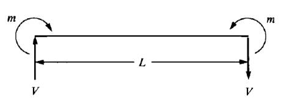
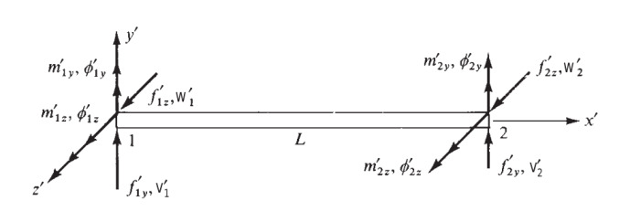
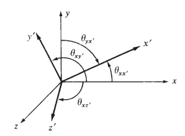
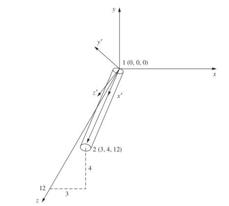
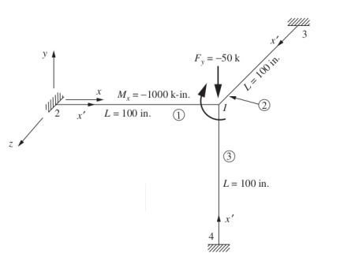

# Materyel Mekaniği - 11

Üç boyutta herhangi bir yönde olabilecek bir kiriş öğesinin direngenlik
matrisini bu bölümde geliştirelim [2, sf. 281]. Literatürde bu yapılara uzay
çerçeveleri (space frame) denebiliyor. Bunu yapabilmek için daha önce gördüğümüz
eksenel, iki boyutlu kiriş, burulma direngenlik matrislerini birleştireceğiz.

İki boyuttaki kirişin mekaniği alttaki gibiydi [1],




Şimdi işaretler alttaki gibi olacak,



İki boyutlu kiriş matrisini [1] iki kez kullanacağız, ilki $x-z$ düzlemi icin,
ikincisi $x-y$ düzlemi için,

$x-z$ düzlemi

$$
\frac{EI_y}{L^4}
\left[\begin{array}{cccc}
12L & -6L  & -12L & -6L^2 \\
    & 4L^3 & 6L^2 & 2L^3  \\
    &      & 12L  & 6L^2  \\
    &      &      & 4L^3
\end{array}\right]
\qquad (1)
$$

$x-y$ düzlemi

$$
\frac{EI_y}{L^4}
\left[\begin{array}{cccc}
12L & 6L  & -12L & 6L^2 \\
    & 4L^3 & -6L^2 & 2L^3  \\
    &      & 12L  & -6L^2  \\
    &      &      & 4L^3
\end{array}\right]
\qquad (2)
$$

Dikkat edersek $x-y$ düzleminin matrisi [1] matrisi ile aynı. $x-z$ düzlemi
matrisinin bazı işaretleri farklı, bunun sebebi düzlemdeki bükülmenin sağ el
kuralına göre farklı yönleri gösterebilmesi. Mesela [1]'deki 

$$
m_1 = -m = -EI \frac{\mathrm{d}^2 v(0)}{\mathrm{d} x^2} =
\frac{EI}{L^3} ( 6L v_1 + 4L^2 \phi_1 - 6L v_2 + 2 L^2 \phi_2 )
$$

formülünü hatırlarsak, o formülde bir uçta $m$ diğer üçta $-m$ vardı, fakat
üstteki figürde $x-z$ düzlemindeki iki uçtaki $m$ değerleri aynı işarettedir,
sağ el kuralını düşünürsek $x-z$'deki bükülme 1 noktasında kağıttan bize doğru
gösteriyor, 2 noktasında aynı şekilde. O zaman üstteki formüldeki işaretler
değişir,

$$
\Rightarrow \frac{EI}{L^3} ( -6L v_1 - 4L^2 \phi_1 + 6L v_2 - 2 L^2 \phi_2 )
$$

Bir değişim daha açılarda, üstteki formülde $\phi_1,\phi_2$ olan acılar,
üç boyuttaki üstteki şekilde bunlar $\phi_{1y}$ ve $\phi_{2y}$. Bu açılar
iki boyutlu durumun aksine artı yönde tam ters işaretli, tersi yönde bir
yer değişim $v_1,v_2$'ye sebep oluyorlarlar, bu yüzden o işaretler de
tersine dönüyor, notasyonu da düzeltince,

$$
\Rightarrow \frac{EI}{L^3} ( -6L v_1 + 4L^2 \phi_{1y} + 6L v_2 + 2 L^2 \phi_{2y} )
$$

Böylece matrisin ikinci satırında $-6,+4,+6,+2$ katsayılarını elde ediyoruz.
Bu işaretlerin (1) matrisinin ikinci satırıyla aynı olduğunu görebiliriz,
diğer satırlar benzer şekilde değiştiriliyorlar.

Üstdüşüm (Superposition)

Artık bahsedilen matrisleri birleştirebiliriz. Bu üstdüşümü `sympy`  ile
otomatik olarak yapacağız, daha önce sayısal değerler için kullandığımız
`expand_dataframe` kodu yine kullanılabilecek, çünkü kod bir `pandas`
Dataframe'i baz alıyor, bu Dataframe içinde herhangi bir obje depolamak mümkün,
oraya sayılar yerine `sympy` sembolik matematik objeleri koyabiliriz. Bir
bonus ta elde ediyoruz, toplama işlemi `sympy` tipleri için önceden
tanımlıdır, yani eğer üstdüşüm sırasında çakışma olursa, sembolik objeler
birbiriyle toplanacaktır!

```python
from sympy import symbols, pprint, latex
from sympy.matrices import Matrix
import pandas as pd, pickle
pd.set_option('display.max_columns', None)

all_vars = ['u1','v1','w1','phi1x','phi1y','phi1z',\
            'u2','v2','w2','phi2x','phi2y','phi2z']
A,G,J,E,L,Iy,Iz = symbols("A,G,J,E,L,Iy,Iz")
```

Önce üstte bahsedilen iki düzlemi alalım,

```python
# x-z
vars1 = ['w1','phi1y','w2','phi2y']
M1 = pd.DataFrame([[12*L, -6*L**2,-12*L,-6*L**2],
                  [-6*L**2,4*L**3,6*L**2,2*L**3],
                  [-12*L,6*L**2,12*L,6*L**2],
                  [-6*L**2,2*L**3,6*L**2,4*L**3]],index=vars1)
M1.columns = vars1
M1 = M1 * (E*Iy/L**4 )
# x-y
vars2 = ['v1','phi1z','v2','phi2z']
M2 = pd.DataFrame([[12*L, 6*L**2,-12*L,6*L**2],
                  [6*L**2,4*L**3,-6*L**2,2*L**3],
                  [-12*L,-6*L**2,12*L,-6*L**2],
                  [6*L**2,2*L**3,-6*L**2,4*L**3]],index=vars2)
M2.columns = vars2
M2 = M2 * (E*Iz/L**4 )
```

Şimdi [1]'deki eksenel yükleri tanımlayan makaskiriş direngenlik matrisini
alalım,

```python
# Eksenel Yuk
vars3 = ['u1','u2']
M3 = pd.DataFrame([[1,-1],[-1,1]],index=vars3)
M3.columns = vars3
M3 = M3 * (A*E/L)
```

[4]'te tanımladığımız burulma mekaniğinin matrisini belirtelim,

```python
# Burulma (Torsion)
vars4 = ['phi1x','phi2x']
M4 = pd.DataFrame([[1,-1],[-1,1]],index=vars3)
M4.columns = vars4
M4 = M4 * (G*J/L)
```

Hepsini üstdüşüm ile birleştirelim,

```python
import sys; sys.path.append('../phy_020_strs_08')
import dfutil

M1f = dfutil.expand_dataframe(M1,all_vars)
M2f = dfutil.expand_dataframe(M2,all_vars)
M3f = dfutil.expand_dataframe(M3,all_vars)
M4f = dfutil.expand_dataframe(M4,all_vars)
Mall = Matrix(M1f + M2f + M3f + M4f)
pickle.dump(Mall,open("Mall.pkl","wb")) # dosyaya yaz ileride lazim olacak
```

```python
print (latex(Mall)[:100],'...')
```

```
\left[\begin{array}{cccccccccccc}\frac{A E}{L} & 0 & 0 & 0 & 0 & 0 & - \frac{A E}{L} & 0 ...
```

$$
\left[\begin{array}{cccccccccccc}\frac{A E}{L} & 0 & 0 & 0 & 0 & 0 & - \frac{A E}{L} & 0 & 0 & 0 & 0 & 0\\0 & \frac{12 E Iz}{L^{3}} & 0 & 0 & 0 & \frac{6 E Iz}{L^{2}} & 0 & - \frac{12 E Iz}{L^{3}} & 0 & 0 & 0 & \frac{6 E Iz}{L^{2}}\\0 & 0 & \frac{12 E Iy}{L^{3}} & 0 & - \frac{6 E Iy}{L^{2}} & 0 & 0 & 0 & - \frac{12 E Iy}{L^{3}} & 0 & - \frac{6 E Iy}{L^{2}} & 0\\0 & 0 & 0 & \frac{G J}{L} & 0 & 0 & 0 & 0 & 0 & - \frac{G J}{L} & 0 & 0\\0 & 0 & - \frac{6 E Iy}{L^{2}} & 0 & \frac{4 E Iy}{L} & 0 & 0 & 0 & \frac{6 E Iy}{L^{2}} & 0 & \frac{2 E Iy}{L} & 0\\0 & \frac{6 E Iz}{L^{2}} & 0 & 0 & 0 & \frac{4 E Iz}{L} & 0 & - \frac{6 E Iz}{L^{2}} & 0 & 0 & 0 & \frac{2 E Iz}{L}\\- \frac{A E}{L} & 0 & 0 & 0 & 0 & 0 & \frac{A E}{L} & 0 & 0 & 0 & 0 & 0\\0 & - \frac{12 E Iz}{L^{3}} & 0 & 0 & 0 & - \frac{6 E Iz}{L^{2}} & 0 & \frac{12 E Iz}{L^{3}} & 0 & 0 & 0 & - \frac{6 E Iz}{L^{2}}\\0 & 0 & - \frac{12 E Iy}{L^{3}} & 0 & \frac{6 E Iy}{L^{2}} & 0 & 0 & 0 & \frac{12 E Iy}{L^{3}} & 0 & \frac{6 E Iy}{L^{2}} & 0\\0 & 0 & 0 & - \frac{G J}{L} & 0 & 0 & 0 & 0 & 0 & \frac{G J}{L} & 0 & 0\\0 & 0 & - \frac{6 E Iy}{L^{2}} & 0 & \frac{2 E Iy}{L} & 0 & 0 & 0 & \frac{6 E Iy}{L^{2}} & 0 & \frac{4 E Iy}{L} & 0\\0 & \frac{6 E Iz}{L^{2}} & 0 & 0 & 0 & \frac{2 E Iz}{L} & 0 & - \frac{6 E Iz}{L^{2}} & 0 & 0 & 0 & \frac{4 E Iz}{L}\end{array}\right]
$$

Bu matrisin [2, sf. 282]'deki matris ile aynı olduğunu göreceğiz.

Döndürme işlemine geldik, döndürme için bir $T$ matrisi gerekiyor ki daha önce
olduğu gibi bir $T^T k' T$ işlemini yapabilelim. Bu $T$ matrisi içinde dört tane
3x3 boyutunda $\lambda$ matris bloğu olacak, $T$ köşegeni üzerinde
tekrarlanacaklar, ki böylece her değişken bloğu çarpılabilsin /
döndürülebilsin. Bu bloklar $(u_1,v_1,w_1)$, $(\phi_{1x},\phi_{1y},\phi_{1z})$,
$(u_2,v_2,w_2)$, $(\phi_{2x},\phi_{2y},\phi_{2z})$ [2, sf. 282].

$$
T = \left[\begin{array}{cccc}
[\lambda] &  & & \\
 & [\lambda] & & \\
 & & [\lambda] & \\
 & & & [\lambda]
\end{array}\right]
$$

Her $\lambda$ matrisi "yön kosinüsleri'' denen değerleri içeriyor olacak, bu
kavramın detayları için bkz [6, sf. 73], [5, sf. 224], özet olarak tarif etmek
gerekirse bir vektörün ya da yeni kordinat sisteminin yeni ekseninin, referans
bir diğer ekseni ile olan açısının kosinüsü olarak görebiliriz.



Eğer eksen değişimi, transformasyonunu hesaplıyorsak $y$ ekseninin yeni $x'$
ekseni ile oluşturduğu açı $\cos_{yx'}$ olarak gösterilebilir, ya da kısaca
$C_{yx'}$, tüm bu kombinasyonlar için elde edilen açılar bir matris içinde
$\lambda$'da yer alır,

$$
\lambda = \left[\begin{array}{ccc}
C_{xx'} & C_{yx'} & C_{zx'} \\
C_{xy'} & C_{yy'} & C_{zy'} \\
C_{xz'} & C_{yz'} & C_{zz'} 
\end{array}\right]
$$

Sonlu Öğeler (Finite Element) bu hesap şu şekilde uygulanır, FEM problemlerinde
genellikle yapılan bir kiriş parçası transform edilmiş $x'$ ekseni kabul edilir,
ve geri kalan $\lambda$ değerleri buna göre doldurulur. Bu durumda kirişin uç ve
baş noktasını kullanarak $x'$ ile oluşan açıları şöyle bulabiliriz,

$$
\cos_{xx'} = \frac{x_2 - x_1}{L} = l
$$

$$
\cos_{yx'} = \frac{y_2 - y_1}{L} = m
$$

$$
\cos_{zx'} = \frac{z_2 - z_1}{L} = n
$$

ki kirişin son noktası $x_2,y_2,z_2$, baş noktası $x_1,y_1,z_1$, uzunluk $L$.

Kiriş bazlı yeni eksen oluştururken bir kez $x'$ elde ettikten sonra diğer
eksenleri ona göre bulabiliriz, diğer herhangi bir vektörle oluşturulan düzleme
dik olan yeni bir vektörü $y'$ için kullanabilirdik mesela, [2]'de yapılan $x'$
ile $z$ ekseninin çapraz çarpımını almaktır. Bilindiği gibi iki vektöre dikgen
üçüncü bir vektör çapraz çarpım ile hesaplanır, böylece $x'$ eksenine dikgen bir
$y'$ elde etmiş oluruz, sonra $x'$ ile $y'$ ekseninin bir çapraz çarpımı daha
alınarak her iki eksene dikgen üçüncü eksen $z'$ bulunabilir.  Bu hesapla elde
edilen $x',y',z'$ bir kordinat ekseninin sahip olması gerekli tüm koşulları
yerine getiriyor.

Biraz önceki semboller üzerinde görelim, $i,j,k$ birim vektörler, notasyonda
genellikle $\mathbf{i},\mathbf{j},\mathbf{k}$ olarak gösterilirler.

$$
z \times x' = y' = \frac{1}{D}
\left[\begin{array}{ccc}
i & j & k \\ 0 & 0 & 1 \\ l & m & n
\end{array}\right]
$$

$$
y' = - \frac{m}{D} i + \frac{l}{D} j
$$

$$
D = (l^2 + m^2)^{1/2}
$$

Simdi $z'$ ekseni,

$$
z' = x' \times y' = \frac{1}{D}
\left[\begin{array}{ccc}
i & j & k \\ l & m & n \\ -m & l & 0
\end{array}\right]
$$

$$
z' = -\frac{ln}{D} i - \frac{mn}{D} j + D k 
$$

Sonuçları bir araya koyarsak,

$$
\lambda = \left[\begin{array}{ccc}
l & m & n \\
-\dfrac{m}{D} & \dfrac{l}{D} & 0 \\
-\dfrac{ln}{D} & -\dfrac{mn}{D} & D
\end{array}\right]
$$

Üstteki matris bir vektörü yerel kordinat sisteminden global kordinat sistemine
çevirebilir. $T$ içinde üstteki matrisleri kullanırız, ve $T^T k' T$ hesabını
yaparız.

Problem 5.7



Üstteki şekil için gereken $\lambda$ matrisini bulun [2, sf. 285].

Çözüm

Önce kiriş uzunluğunu bulalım.

```python
np.sqrt(3**2 + 4**2 + 12**2)
```

```
Out[1]: 13.0
```

Şimdi uzunluğu kullanarak $x'$ eksenini bulalım, daha önce bahsedildiği gibi bu
eksenin çubuğun bir ucundan başlayıp onunla aynı yönü gösterdiği kabul edilir.
Bu değerlere $l_x,l_y,l_z$ diyelim, $\lambda$ matrisinin ilk satırı bu değerler,

$$
l_x = \frac{x_2 - x_1}{L} = \frac{3 = 0}{13} = \frac{3}{13}
$$

$$
m_x = \frac{y_2 - y_1}{L} = \frac{4-0}{13} = \frac{4}{13}
$$

$$
n_x = \frac{z_2 - z_1}{L} = \frac{12 = 0}{13} = \frac{12}{13}
$$

Şimdi $D$ hesabını yapabiliriz,

$$
D = (l_x^2 + m_x^2)^{1/2} =
\left[
  \left(\frac{3}{13}\right)^2 +
  \left(\frac{4}{13}\right)^2
\right]^{1/2} = \frac{5}{13}
$$

$y'$ eksenini hesaplamak için

$$
l_y = -\frac{m}{D} = -\frac{4}{5}
$$

$$
m_y = \frac{l}{D} = \frac{3}{5}
$$

$$
n_y = 0
$$

$z'$ ekseni

$$
l_z = -\frac{l_x n_x}{D} =
\frac{-\frac{3}{13} \frac{12}{13}}{\frac{5}{13}} =
- \frac{36}{65}
$$

$$
m_z =
-\frac{m_x n_x}{D} =
\frac{-\frac{4}{13} \frac{12}{13}}{\frac{5}{13}} =
-\frac{48}{65}
$$

$$
n_z = D = \frac{5}{13}
$$

Tek bir matriste üstteki tüm değerleri gösterelim,

$$
\lambda = \left[\begin{array}{ccc}
\frac{3}{13} & \frac{4}{13} & \frac{12}{13} \\
-\frac{4}{5} & \frac{3}{5} & 0 \\
-\frac{36}{65} & -\frac{48}{65} & \frac{5}{13}
\end{array}\right]
$$

Problem 5.8

Alttaki uzay çerçevesindeki düğüm 1 noktasındaki yer değişimlerini ve dönüşleri
hesaplayın. Her üç kiriş parçası için $E=30,000$ ksi, $G=10,000$ ksi, $J = 50$
$in^4$, $I_y=100$ $in^4$, $I_z = 100$ $in^4$, $A=10$ $in^2$, $L = 100$ in.
değerleri geçerlidir [2, sf. 287].



Çözüm

Üç kiriş parçası uzunluk, madde, yapı açısından birbirlerine eşit olduğu için
$k$ matrisini bir kere hesaplamak yeterli. 

```python
from sympy.matrices import Matrix
from sympy import symbols, latex
import pickle, pandas as pd
pd.set_option('display.max_columns', None)
import sys; sys.path.append('../phy_020_strs_08')
import dfutil

A,G,J,E,L,Iy,Iz = symbols("A,G,J,E,L,Iy,Iz")
Mall = pickle.load(open('Mall.pkl','rb'))

D = {E: 30000, G: 10000, J:50, Iy:100, Iz:100, A:10, L:100}
kprime = Mall.subs(D)
print (latex(kprime)[:100], '..')
```

```
\left[\begin{array}{cccccccccccc}3000 & 0.0 & 0.0 & 0.0 & 0.0 & 0.0 & -3000 & 0.0 & 0.0 & 0.0 & 0.0  ..
```

$$
{\scriptsize
\left[\begin{array}{cccccccccccc}3000 & 0 & 0 & 0 & 0 & 0 & -3000 & 0 & 0 & 0 & 0 & 0\\0 & 36 & 0 & 0 & 0 & 1800 & 0 & -36 & 0 & 0 & 0 & 1800\\0 & 0 & 36 & 0 & -1800 & 0 & 0 & 0 & -36 & 0 & -1800 & 0\\0 & 0 & 0 & 5000 & 0 & 0 & 0 & 0 & 0 & -5000 & 0 & 0\\0 & 0 & -1800 & 0 & 120000 & 0 & 0 & 0 & 1800 & 0 & 60000 & 0\\0 & 1800 & 0 & 0 & 0 & 120000 & 0 & -1800 & 0 & 0 & 0 & 60000\\-3000 & 0 & 0 & 0 & 0 & 0 & 3000 & 0 & 0 & 0 & 0 & 0\\0 & -36 & 0 & 0 & 0 & -1800 & 0 & 36 & 0 & 0 & 0 & -1800\\0 & 0 & -36 & 0 & 1800 & 0 & 0 & 0 & 36 & 0 & 1800 & 0\\0 & 0 & 0 & -5000 & 0 & 0 & 0 & 0 & 0 & 5000 & 0 & 0\\0 & 0 & -1800 & 0 & 60000 & 0 & 0 & 0 & 1800 & 0 & 120000 & 0\\0 & 1800 & 0 & 0 & 0 & 60000 & 0 & -1800 & 0 & 0 & 0 & 120000\end{array}\right]
}
$$

Geri kalan her parça için dönüş matrislerini hesaplamak gerekecek. Altta bu
hesapları görebiliriz.

Parça 1

Önce parça 1 hesapları yapalım, bu parça düğüm 2 noktasından başlayıp
düğüm 1 noktasına gidiyor. O zaman $x'$ ekseni için

$$
l = 1, \quad m = 0, \quad n = 0, \quad D = 1
$$

Diğer hesaplar

$$
I_y = -\frac{m_x}{D}, \quad
m_y = \frac{1}{D}, \quad
n_y = 0
$$

$$
i_z = -\frac{l_x n_x}{D} = 0, \quad
m_z = -\frac{m_x n_x}{D} = 0, \quad
n_z = D = 1
$$

Matris içinde gösterirsek,

$$
\lambda = \left[\begin{array}{ccc}
1 & 0 & 0 \\ 0 & 1 & 0 \\ 0 & 0 & 1
\end{array}\right]
$$

Sonuç şaşırtıcı olmasa gerek, çünkü yeni $x$ eski $x$ ile aynı. Bu parça için
sanki eksen hiç değişmesin demiş olduk ve sonuç olarak çarpılınca hiçbir
değişiklik yaratmayacak birim matrisi elde ettik. Bu matrisi büyük $T$ içinde
köşegenlere parça parça yerleştirince yine birim matris elde edilir, yani
$T^T k'T$ aynı $k'$ matrisini verir.

```python
T_P1 = np.eye(12,12)
res1 = np.array(kprime)
vars1 = ['u2','v2','w2','phi2x','phi2y','phi2z','u1','v1','w1','phi1x','phi1y','phi1z']
df1 = pd.DataFrame(res1,columns=vars1)
```

Parça 2

Bu parça düğüm 3 noktasıdan düğüm 1 noktasına gidiyor. O zaman $x'$ ekseni
global $z$ ekseni ile aynı şey, o zaman ve yine önceki formüllere bakarak,

$$
\lambda = \left[\begin{array}{ccc}
0 & 0 & 1 \\ 0 & 1 & 0 \\ -1 & 0 & 0
\end{array}\right]
$$

elde ederiz. $T$ matrisi suna benzer,

```python
T_P2 = np.array([
[0, 0,1, 0,0,0, 0,0,0, 0,0,0 ],
[0, 1,0, 0,0,0, 0,0,0, 0,0,0 ],
[-1,0,0, 0,0,0, 0,0,0, 0,0,0],
[0, 0,0, 0,0,1, 0,0,0, 0,0,0 ],
[0, 0,0, 0,1,0, 0,0,0, 0,0,0],
[0, 0,0,-1,0,0, 0,0,0, 0,0,0],
[0, 0,0, 0,0,0, 0,0,1, 0,0,0 ],
[0, 0,0, 0,0,0, 0,1,0, 0,0,0 ],
[0, 0,0, 0,0,0,-1,0,0, 0,0,0],
[0, 0,0, 0,0,0, 0,0,0, 0,0,1],
[0, 0,0, 0,0,0, 0,0,0, 0,1,0 ],
[0, 0,0, 0,0,0, 0,0,0,-1,0,0]])

res2 = T_P2.transpose()*kprime*T_P2
vars2 = ['u3','v3','w3','phi3x','phi3y','phi3z','u1','v1','w1','phi1x','phi1y','phi1z']
df2 = pd.DataFrame(np.array(res2),columns=vars2)
print (latex(res2)[:100],'..')
```

```
\left[\begin{array}{cccccccccccc}36 & 0 & 0 & 0 & 1800 & 0 & -36 & 0 & 0 & 0 & 1800 & 0\\0 & 36 & 0  ..
```

$$
\scriptsize
\left[\begin{array}{cccccccccccc}36 & 0 & 0 & 0 & 1800 & 0 & -36 & 0 & 0 & 0 &
    1800 & 0\\0 & 36 & 0 & -1800 & 0 & 0 & 0 & -36 & 0 & -1800 & 0 & 0\\0 & 0 &
    3000 & 0 & 0 & 0 & 0 & 0 & -3000 & 0 & 0 & 0\\0 & -1800 & 0 & 120000 & 0 & 0
    & 0 & 1800 & 0 & 60000 & 0 & 0\\1800 & 0 & 0 & 0 & 120000 & 0 & -1800 & 0 &
    0 & 0 & 60000 & 0\\0 & 0 & 0 & 0 & 0 & 5000 & 0 & 0 & 0 & 0 & 0 & -5000\\-36
    & 0 & 0 & 0 & -1800 & 0 & 36 & 0 & 0 & 0 & -1800 & 0\\0 & -36 & 0 & 1800 & 0
    & 0 & 0 & 36 & 0 & 1800 & 0 & 0\\0 & 0 & -3000 & 0 & 0 & 0 & 0 & 0 & 3000 &
    0 & 0 & 0\\0 & -1800 & 0 & 60000 & 0 & 0 & 0 & 1800 & 0 & 120000 & 0 &
    0\\1800 & 0 & 0 & 0 & 60000 & 0 & -1800 & 0 & 0 & 0 & 120000 & 0\\0 & 0 & 0
    & 0 & 0 & -5000 & 0 & 0 & 0 & 0 & 0 & 5000\end{array}\right]
$$

Parça 3

Bu parça için $x'$ eksenini düğüm 4'ten düğüm 1'e gidiyor şekilde ayarlıyoruz,

$$
l = \frac{0 - 0}{100} = 0, \quad
m = \frac{0 - (-100)}{100} = 1, \quad
n = \frac{0 - 0}{100} = 0
$$

Ayrica $D = 1$.

Simdi $l,m,n$ hesaplanabilir,

$$
l_y = - \frac{m}{D} = -1, \quad
m_y = \frac{L}{D} = 0, \quad
n_y = 0
$$

$$
l_z = - \frac{ln}{D} = 0, \quad
m_z = - \frac{mn}{D} = 0, \quad
n_z = D = 1
$$

O zaman

$$
[ \lambda ] = \left[\begin{array}{rrr}
0 & 1 & 1 \\ -1 & 0 & 0 \\ 0 & 0 & 1
\end{array}\right]
$$

```python
T_P3 = np.array([
[0, 1,0, 0,0,0, 0,0,0, 0, 0,0 ],
[-1,0,0, 0,0,0, 0,0,0, 0, 0,0 ],
[0, 0,1, 0,0,0, 0,0,0, 0, 0,0],
[0, 0,0, 0,1,0, 0,0,0, 0, 0,0 ],
[0, 0,0,-1,0,0, 0,0,0, 0, 0,0],
[0, 0,0, 0,0,1, 0,0,0, 0, 0,0],
[0, 0,0, 0,0,0, 0,1,0, 0, 0,0 ],
[0, 0,0, 0,0,0,-1,0,0, 0, 0,0 ],
[0, 0,0, 0,0,0, 0,0,1, 0, 0,0],
[0, 0,0, 0,0,0, 0,0,0, 0, 1,0],
[0, 0,0, 0,0,0, 0,0,0,-1, 0,0 ],
[0, 0,0, 0,0,0, 0,0,0, 0, 0,1]])

res3 = T_P3.transpose()*kprime*T_P3
vars3 = ['u4','v4','w4','phi4x','phi4y','phi4z','u1','v1','w1','phi1x','phi1y','phi1z']
df3 = pd.DataFrame(np.array(res3),columns=vars3)
print (latex(res3)[:100],'..')
```

```
\left[\begin{array}{cccccccccccc}36 & 0 & 0 & 0 & 0 & -1800 & -36 & 0 & 0 & 0 & 0 & -1800\\0 & 3000  ..
```

$$  
\scriptsize
\left[\begin{array}{cccccccccccc}36 & 0 & 0 & 0 & 0 & -1800 & -36 & 0 & 0 & 0 &
    0 & -1800\\0 & 3000 & 0 & 0 & 0 & 0 & 0 & -3000 & 0 & 0 & 0 & 0\\0 & 0 & 36
    & 1800 & 0 & 0 & 0 & 0 & -36 & 1800 & 0 & 0\\0 & 0 & 1800 & 120000 & 0 & 0 &
    0 & 0 & -1800 & 60000 & 0 & 0\\0 & 0 & 0 & 0 & 5000 & 0 & 0 & 0 & 0 & 0 &
    -5000 & 0\\-1800 & 0 & 0 & 0 & 0 & 120000 & 1800 & 0 & 0 & 0 & 0 &
    60000\\-36 & 0 & 0 & 0 & 0 & 1800 & 36 & 0 & 0 & 0 & 0 & 1800\\0 & -3000 & 0
    & 0 & 0 & 0 & 0 & 3000 & 0 & 0 & 0 & 0\\0 & 0 & -36 & -1800 & 0 & 0 & 0 & 0
    & 36 & -1800 & 0 & 0\\0 & 0 & 1800 & 60000 & 0 & 0 & 0 & 0 & -1800 & 120000
    & 0 & 0\\0 & 0 & 0 & 0 & -5000 & 0 & 0 & 0 & 0 & 0 & 5000 & 0\\-1800 & 0 & 0
    & 0 & 0 & 60000 & 1800 & 0 & 0 & 0 & 0 & 120000\end{array}\right]
$$

Tüm parçalar için $T^T k'T$ matrisini elde ettik, artık üstdüşüm ile hepsini
toplayıp sınır şartlarını uygulayabiliriz ve ardından yer değişim için çözüm
yapabiliriz.

```python
all_vars = ['u1','v1','w1','phi1x','phi1y','phi1z',\
            'u2','v2','w2','phi2x','phi2y','phi2z',\
            'u3','v3','w3','phi3x','phi3y','phi3z',\
            'u4','v4','w4','phi4x','phi4y','phi4z']
df1f = dfutil.expand_dataframe(df1,all_vars)
df2f = dfutil.expand_dataframe(df2,all_vars)
df3f = dfutil.expand_dataframe(df3,all_vars)
df_super = df1f + df2f + df3f
drop_cols = ['u2','v2','w2','phi2x','phi2y','phi2z', \
             'u3','v3','w3','phi3x','phi3y','phi3z',\
             'u4','v4','w4','phi4x','phi4y','phi4z']
df_super = dfutil.drop_col_row(df_super,drop_cols)
df_super = df_super.applymap(lambda x: np.round(np.float(x),0))
print (df_super)
```

```
           u1      v1      w1     phi1x     phi1y     phi1z
u1     3072.0     0.0     0.0       0.0   -1800.0    1800.0
v1        0.0  3072.0     0.0    1800.0       0.0   -1800.0
w1        0.0     0.0  3072.0   -1800.0    1800.0       0.0
phi1x     0.0  1800.0 -1800.0  245000.0       0.0       0.0
phi1y -1800.0     0.0  1800.0       0.0  245000.0       0.0
phi1z  1800.0 -1800.0     0.0       0.0       0.0  245000.0
```

Yer değişimlerini kuvvetlerle ilintilendiren denklemi

$$
f = k d
$$

olarak görmüştük. Üstdüşüm ile birleştirip sınır şartları ile ufalttığımız
matris bize bir global $k$ verdi. Global kuvvetlerin ne olduğunu da problem
tanımından biliyoruz, bunlar $F_{1y} = -50$ kips, ve $M_{1x} = -1000$ k-inch.  O
zaman $f = kd$ sisteminde bilinen $f,k$ ve bilinmeyen $d$ için lineer cebirin
tanıdık çözüm işlemini uygulayabiliriz.

```python
import numpy.linalg as lin
d = lin.solve(df_super,np.array([[0,-50,0,-1000,0,0]]).T)
d = pd.DataFrame(d,index=df_super.index)
d
```

```
Out[1]: 
              0
u1     0.000071
v1    -0.013995
w1    -0.002352
phi1x -0.003996
phi1y  0.000018
phi1z -0.000103
```

Yer değişimleri böylece hesaplandı. Şimdi her öge için yerel etki eden
kuvvetleri $f' = k' T d$ hesabı ile bulabiliriz. Tabii boyutlara dikkat etmek
gerekiyor, mesela birinci parçanın kullandığı değişken listesi farklı, $d$
vektörünü o değişken listesi için uyarlamak lazım, Pandas yazılımı burada
yardıma yetişiyor, bir seri (liste, vektör) objesini bir diğeri ile yaratırken
eksik olan indis (değişken) değerler varsa onlar için boş değer atayabilir, o
boş değerlere biz sıfır dersek istediğimiz sonucu elde edebiliriz. Mesela
birinci parça için

```python
pd.DataFrame(d,index=vars1)
```

```
Out[1]: 
              0
u2          NaN
v2          NaN
w2          NaN
phi2x       NaN
phi2y       NaN
phi2z       NaN
u1     0.000071
v1    -0.013995
w1    -0.002352
phi1x -0.003996
phi1y  0.000018
phi1z -0.000103
```

sonucunu alabiliyoruz, görüldüğü gibi parça 1 için $d$'de olan değerler
dolduruldu, diğerleri boş bırakıldı.  Bu tekniği tüm parçalara uygulayalım ve
kuvvet tarafındaki değişkenlerin $u_1,v_1..,\phi_{1x},\phi_{1y},...$ için
$f_{1x},f_{1y},..,M_{1x},M_{1y},..$ şeklinde gittiğini dikkate alalım,

Parça 1

```python
d_expanded1 = pd.DataFrame(d,index=vars1).fillna(0)
f1 = np.dot(np.dot(kprime, T_P1), d_expanded1)
f1
```

```
Out[1]: 
array([[-0.212947726538524],
       [0.317807629532996],
       [0.0526267712100185],
       [19.9804522034949],
       [-3.16535930819590],
       [18.9906685952123],
       [0.212947726538524],
       [-0.317807629532996],
       [-0.0526267712100185],
       [-19.9804522034949],
       [-2.09731781280595],
       [12.7900943580873]], dtype=object)
```

Parça 2

```python
d_expanded2 = pd.DataFrame(d,index=vars2).fillna(0)
f2 = np.dot(np.dot(kprime, T_P2), d_expanded2)
f2
```

```
Out[1]: 
array([[7.05566800597642],
       [7.69678764990490],
       [-0.0294858721432362],
       [0.516714519760416],
       [0.940272859466836],
       [264.956669274276],
       [-7.05566800597642],
       [-7.69678764990490],
       [0.0294858721432362],
       [-0.516714519760416],
       [2.00831435485679],
       [504.722095716214]], dtype=object)
```

Parça 3

```python
d_expanded3 = pd.DataFrame(d,index=vars3).fillna(0)
f3 = np.dot(np.dot(kprime, T_P3), d_expanded3)
f3
```

```
Out[1]: 
array([[41.9854047205621],
       [-0.183461854395287],
       [-7.10829477718644],
       [-0.0890034579491625],
       [235.532025638353],
       [-6.07280560120188],
       [-41.9854047205621],
       [0.183461854395287],
       [7.10829477718644],
       [0.0890034579491625],
       [475.297452080291],
       [-12.2733798383269]], dtype=object)
```

Bu değerlerin [2, sf. 291]'deki sonuçlarla aynı olduğunu görebiliriz.

Kaynaklar

[1] Bayramlı, *Fizik, Materyel Mekaniği 7*

[2] Logan, *A First Course in the Finite Element Method, 6th Ed*

[3] Witt *Concepts and Apps of FEM*

[4] Bayramlı, *Fizik, Materyel Mekaniği 9*

[5] Dunn, *3D Math Primer for Graphics and Game Development*

[6] Stasa, *Applied Finite Element Analysis for Engineers*


