# Dalga Denklemi (Wave Equation)

Matematiksel açıdan bir dalga hareket eden herhangi bir fonksiyondur. Bir
fonksiyonu mesela sağa taşımak için ona geçilen değeri $x$'den $x-x_0$'a
değiştirmek yeterlidir, ki $x_0$ pozitif bir sayı [5].

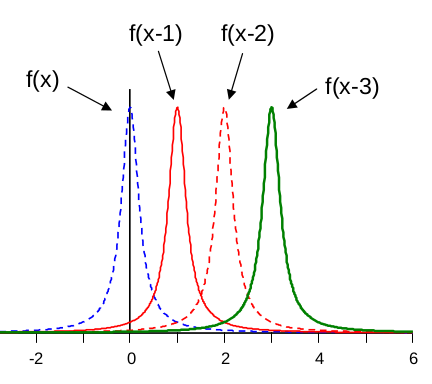

Degil mi? Bunu kendimiz kontrol edebiliriz,

```python
x = np.linspace(-5,5,100)
y = -x**2 +3
plt.plot(x,y)
plt.grid(True)
plt.xlim(-4,4)
plt.ylim(-1,3)
plt.savefig('compscieng_app45cfd1_08.png')
```


```python
x = np.linspace(-5,5,100)
x0 = 3
y = -(x-x0)**2 +3
plt.plot(x,y)
plt.grid(True)
plt.xlim(-4,4)
plt.ylim(-1,3)
plt.savefig('compscieng_app45cfd1_09.png')
```

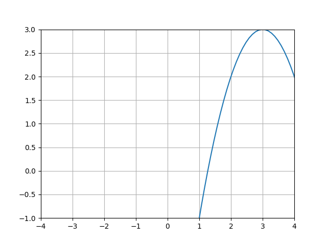

Fonksiyonu $x_0$ kadar sağa taşımış olduk.

Bu taşımanın zaman içinde sürekli sağa olacak şekilde olmasını isteseydik, yani
bir "dalga'' yaratmak isteseydik, o zaman $x_0 = v t$ kullanabilirdik, bu
durumda zaman geçtikçe yer değişim artardı, böylece dalganın akma görüntüsü
ortaya çıkardı.

O zaman diyebiliriz ki $f(x-vt)$ ileri, ya da sağa doğru aktarılan (propagate)
bir dalgayı temsil eder, $v$ dalga hızı olarak görülebilir. Dışarıdan parametre
aktarımı karışıklık yaratıyorsa, dalgayı bir fonksiyon olarak göstermek için
$u(x,t)$ tanımlarız [6, sf. 420], ve

$$
u(x,t) = (x - ct)
\qquad (3)
$$

$t=0$ anında dalganın "profili'' $f(x)$, bu sağa taşınan şekildir, "bozulmadır
(disturbence)''. Önemli bir nokta üstteki tarif edilen taşımanın çarpıtma,
kırılma olmadan gerçekleştiği, bu bariz ama yine de üzerinde basalım, fonksiyon
ne ise o halde taşınıyor. Tüm dalgalar böyle değil, gerçek dünyada da böyle
değil bildiğimiz gibi, üstteki lineer dalgalar, ya da lineer kısmi diferansiyel
denklemlerin çözümü olan dalga profilleri bu şekilde davranıyor. Giderken
kırılan, çarpıtmaya uğrayan dalgalar gayrı-lineer süreçlerin bir sonucu.

Eğer üstteki denklemi sonuç olarak veren bir model görmek istersek, $u_x$ ve
$u_t$ hesaplayabiliriz,

$$
u_t = -c f'(x-ct), \quad  u_x = f'(x-ct), 
$$

Buradan hareketle

$$
u_t + c u_x = 0
$$

eşitliğini kurabiliriz. Üstteki bir lineer kısmi diferansiyel denklem ve en
basit dalga denklemi. Ona yatay iletim (advection) denklemi deniyor ve genel
çözümü (3) ki $f$ turevi alinabilen herhangi bir fonksiyon.

Sinüssel Dalga

En basit (plane wave) ve temel hareket eden dalgalardan bir diğeri sinüssel
dalga. Bu dalganın başlangıç hali

$$
y = A \sin \left( \frac{2\pi}{\lambda} x \right)
$$

Aslında sadece $\sin x$ denebilirdi, fakat $\lambda$ ile dalga boyunu tanımlamak
istiyorsak üstteki eki yapmak gerekir, dikkat edersek $x = 0$'da $\sin(0)$,
$x = \lambda$'da  $\sin 2\pi$. Böylece periyotu $\lambda$ haline getirmiş
olduk [8, sf. 503]. Eğer bu dalgayı sağa kaydırmak istiyorsak, aynı şekilde
$x$ değerine ekleme yapma tekniğini uygularız,

$$
y = A \sin \left[ \frac{2\pi}{\lambda} (x - vt) \right]
$$

Üstteki form hala $f(x-vt)$ bir anlamda, yani aynı yaklaşımı kullanmış oluyoruz.

Tanım itibariyle tek bir dalganın (wavelength) bir noktadan baştan sona geçmesi
bir zaman periyotu $T$'de olur denir, bu tanıma göre hızı görmenin bir diğer
yolu $v = \frac{\lambda}{T}$, bu eşitliği üstteki denkleme sokarsak,

$$
y = A \sin \left[ 2\pi \left( \frac{x}{\lambda} - \frac{t}{T} \right) \right]
$$

Biraz sabit enflasyonu oldu, $2\pi,\lambda,T$, azaltmak için

$$
k \equiv \frac{2\pi}{\lambda}, \qquad 
\omega \equiv \frac{2\pi}{T}
$$

Böylece iki üstteki denklem

$$
y = A \sin(kx - \omega t)
$$

olarak yazılabilir.

Doğal olarak frekans $f = 1/T$. Alternatif formlar $v = \omega / k$, ve
$v = \lambda f$ da mümkün.

Ayrıca çoğu hesap yapılırken $\sin$ içeren form kullanılmıyor, $\cos$'lu form
alınıp (temelde bir değişiklik yok) bir de Euler formülü $\exp(i\theta) =
\cos\theta + i\sin\theta$ üzerinden (ve yükseklik $A$ ile [10])

$$
u(x,t) = A e^{i(kx - \omega t)}
$$

geçişi yapılıyor. Ardından yine Euler formülü üzerinden reel kısma dönülünce
($i$ içeren kısım hayali kısım) sonuca varılmış olunuyor. $\exp$ ile işlem
yapmanın faydaları var, türevler daha kolay mesela, aynı bazda çarpım işlemleri
toplama dönüşüyor, vs.

Dalga Denklemini Türetmek

Önce ip üzerinde titreşimlerin hareketi sonucu olan dalga denklemini türetelim
[2,3,4]. Bir ipte dalga onun salınımı ile oluşacak, ve bu salınım sırasında bir
anda, tek bir fotoğraf karesinde görüntü alt soldaki gibi olabilir,


İp iki tarafından hareket etmeyen yerlere bağlanmış (duvar mesela) uzunluk $L$,
ip materyelinin yoğunluğu $\rho$, ki bu tüm ipin kütlesi bölü uzunluğu olarak ta
görülebilir, bu örnekte sabit, ipin gerginliği kuvvet olarak $T$, bu da sabit,
ve yerçekimi kuvvetine göre çok daha fazla böylece yerçekim ivmelenmesi $g$'yi
yok sayabiliyoruz. Sürtünme yok. Tek boyutta bakıyoruz, $y(x,t)$ ipin bir $x$
noktasındaki dikey yer değişimini gösteriyor.

Denklemi ortaya çıkartmak için aslında Newton'un $F=ma$'sından daha fazlasına
ihtiyacımız yok. Üst sağdaki resimde gösterildiği gibi tek bir sonsuç ufak
bölgeye odaklanırsak, ya da alt resimde olduğu gibi,

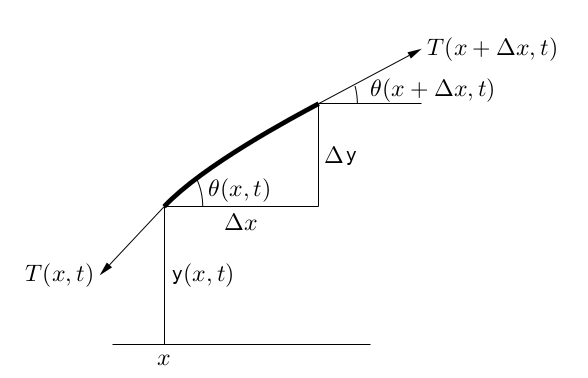

$F$ için gereken net kuvveti ipin iki yanyana noktası arasındaki gerginliğin
dikey bileşenlerinin farkı olarak görebiliriz, yani $T(x+\Delta x,t)$ ve
$T(x,t)$ kuvvetlerinin dikey bileşen farkı. İki noktadaki acılar da
$\theta(x,t)$ ile gösteriliyor, $x+\Delta x$'teki acı $\theta(x+\Delta x)$. Bu
dikey bileşenlerin farkını, ya da tüm $y$ kuvvetlerinin toplanını o zaman 

$$
\sum F_y = T(x+\Delta x,t) \sin\theta(x+\Delta x,t) - T(x,t) \sin\theta(x,t)
$$

ile hesaplayabiliriz. Modeldeki faraziyeler ışığında biliyoruz ki $y/L$ çok
küçük, o zaman $\theta$ çok küçük. Demek ki sinüs ifadelerini
basitleştirebiliriz, [6]'dan biliyoruz ki

$$
\sin\theta \approx \tan\theta = \partial y / \partial x
$$

Demek ki

$$
\sum F_y =
T \frac{\partial y}{\partial x} \bigg\vert_{x+\Delta x} -
T \frac{\partial y}{\partial x} \bigg\vert_{x}
$$

Son geldiğimiz noktada birinci türevler üzerinden bir $x$ farklılığı görüyoruz,
bu bize bir türev işlemini daha hatırlatıyor, eğer $\Delta x$ ile bölünme de
olsaydı, o zaman ikinci türev elde ettik diyebilirdik,

$$
\frac{
T \frac{\partial y}{\partial x} \bigg\vert_{x+\Delta x} -
T \frac{\partial y}{\partial x} \bigg\vert_{x}
}{\Delta x} \approx T \frac{\partial^2 y}{\partial x^2}
$$

Fakat önemli değil, biraz masajlama yaparsak, 

$$
T \frac{\partial y}{\partial x} \bigg\vert_{x+\Delta x} -
T \frac{\partial y}{\partial x} \bigg\vert_{x} \approx
T \frac{\partial^2 y}{\partial x^2} \Delta x 
$$

İstenilen sonucu elde ederiz, 

$$
\sum F_y \approx T \frac{\partial^2 y}{\partial x^2} \Delta x
$$

Diğer taraftan $F=ma$ eşitliğinin sağ tarafına bakarsak, baktığımız ufak bölge
için kütle $\rho\Delta x$, yatay ivmelenme ise $y$ yer değişiminin zamana göre
ikinci kısmi türevi,

$$
\sum F_y = \rho \Delta x \frac{\partial^2 y}{\partial t^2}
$$

Bu son iki denklemi birbirine eşitlersek, $\Delta x$'ler iptal olur, 

$$
T \frac{\partial^2 y}{\partial x^2}  =
\rho \frac{\partial^2 y}{\partial t^2}
$$

Sabitleri sağ tarafa taşırsak, ve $c = \sqrt{T / \rho}$ tanımı üzerinden,

$$
\frac{\partial^2 y}{\partial x^2}  =
\frac{1}{c^2}\frac{\partial^2 y}{\partial t^2}
$$

Dalga denklemini elde etmiş olduk.

Alternatif Anlatım

PDE'lerin ortaya çıkabileceği durumlardan biri, ayrıksal parçacıklardan oluşan
bir sistemin limite gittiği andır [8]. Bu tür şartlarda ODE'lerden oluşan bir
sistem limite giderken bir PDE ortaya çıkartabiliyor. Süreklilik Mekaniğinden
(Continuum Mechanics) bir örnek vereceğiz yani.

Sistem ayrıksal başlayacak, süreklilik limitine gidecek. Mesela sıvılar
mekaniğinde (fluid mechanics) Euler denklemi, Navier-Stokes denklemleri sıvı
sisteminin (şu gibi mesela) süreklilik limitidir. Bu denklemler sıvı içindeki
ufak parçacıkları tarif etmezler, sistemin bütününe bakarlar.

Hepimiz Newton Kanunu biliyoruz (ki bu kanun bu derste ihtiyacımız olan
yegane fizik bilgisi)

$$ m \frac{d^2x}{dt^2} = F(x) $$

Formül ne diyor? Kütle çarpı ivme eşittir kuvvet. Gayet basit.

Diyelim ki elimizde $N$ tane tane parçacık var, $i=1,..,N$, ve bu
parçacıklar birbirleriyle etkileşim halindeler, aralarında bir tür çekim
var belki, ya da başka bir kuvvet. O zaman her parçacık için ayrı ayrı
hareket kanunu işleyecek. Ve $i$'inci parçacık üzerinde bir kuvvet var, ve
bu kuvvet sistemdeki tüm diğer değişkenlerle bir şekilde bağımlı. $x$ tabii
ki pozisyon değişkeni. O zaman

$$ m_i \frac{d^2x_i}{dt^2} = F_i(\vec{x}) $$

Dikkat edersek, $F$ fonksiyonuna giren parametre tüm parçacıklar, yani o
parçacığın hissettiği kuvvet bir şekilde tüm diğer parçacıklarla alakalı. 

Başlangıç Şartı

$i$'inci parçacığın başlangıç konumu

$$ x_i(0) = \hat{x}_i $$

Tipik olarak başlangıç hızı da verilir

$$ \frac{dx_i}{dt}(0) = \hat{v}_i $$

Üstteki bir başlangıç değer problemi (initial value problem). Biz bu derste
PDE bazında sınır değerli problemlerle uğraşacağız. 

Bu tür başlangıç değer problemleri iyi huyludur, çünkü, mesela bu örnekte
2. derece bir diferansiyel denklem var elimizde, ve bağımlı değişken $x$
var, ve bize verilen koşulu anlamak için alttaki resme bakalım

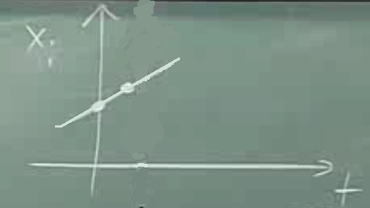

Bize verilenler, $t=0$ anında $x_i$ noktasının olduğu yere ek olarak
(soldaki nokta), bir de o noktadaki eğim bilgisi. Bu tür bilgi verilince,
parçacığın hangi yöne gitmeye meyilli olacağını da görmüş oluyoruz. Sanki
bir top ateşlenmiş, ve topun ateş ettiği anda nerede olduğuna ek olarak
topun namlusunun gösterdiği yer de bize söyleniyor.

Bu iyi huylu bir problem. Sınır değerli denklemler çok daha karmaşık
olabiliyor. Bu arada "sınır koşullu'' kelimesindeki "sınır'' çoğunlukla
bir fiziksel şeye tekabül eder, mesela bir ip vardır, ve ipin "sonunda''
yani sınırlarında değerin ne olması gerektiği sabitlenir. 

Devam edelim. Kurmak istediğimiz model bir tür "gitar teli'' modeli. 

$y_i$ = $i$'inci parçacığın yüksekliği olsun. 

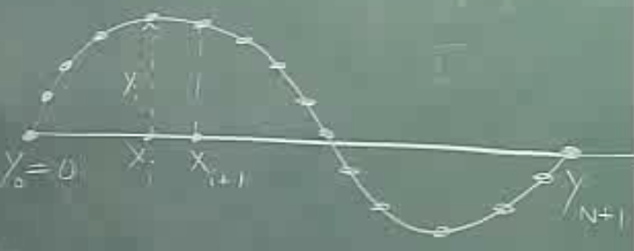

Tel üzerinde bir sürü parçacık var, tel iki ucundan sabitlenmiş durumda. Bu
problemde yatay hareketle ilgilenmiyoruz, sadece yukarı / aşağı hareketle
ilgileniyoruz. Bir tanım daha:

$$ \Delta x = x_{i+1} - x_i  $$

Basitleştirme amacıyla bu tanımı yaptık. Tüm parçacıkların arasındaki
mesafeyi sabit, ve aynı olarak aldık. Benzer şekilde

$$ m_i \equiv m $$

Yani tüm parçacıklar aynı kütleye sahip. 

Şimdi Newton Kanununu parçacıklara uygulayalım [1]. 

$$ m \frac{d^2Y_i}{dt^2} = 
\tau \bigg( \frac{Y_{i+1}- Y_i}{\Delta x} \bigg) -
\tau \bigg( \frac{Y_{i}- Y_{i-1}}{\Delta x} \bigg) 
$$

Bununla ne demiş olduk? $i$'inci parçacığın hissettiği çekimin, o
parçacığın sağında ve solunda bağlı olduğu diğer parçacıkla bağının ipteki
eğimi ile orantılı olduğunu söylemiş olduk.

$\tau$ her tel için farklı olacak bir gerginlik sabiti, ama belli bir
telde, her parçacık için aynı. 


Üstteki formül aslında yerel türevin "ucuz'' bir yaklaşıksallaması. 

Gerginlikle kurulan alaka akla yatkın olmalı, düşünürsek ipte parçacık ne
kadar yüksekte olursa üzerinde o kadar güç hissederdi, yanındaki
parçacıklar(lar) tarafından aşağı çekilirdi, ne kadar altta ise o kadar az
güç hissederdi. Tabii "diğer parçacıklara göre'' yukarıda ya da aşağıda
olmanın ölçüsü de iki parçacık arasındaki ipin eğimi. 

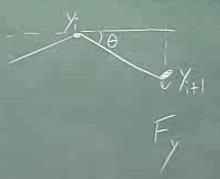

Diğer bir açıdan yaklaşırsak

$$ F_y \equiv \tau \sin\theta $$

da diyebilirdik. Sadece $\sin$ kullandık çünkü daha önce belirttiğimiz gibi,
sadece dikey hareketlere bakıyoruz, yatay hareketlerle ilgilenmiyoruz (o
yüzden $\cos$ yok).

Bir yaklaşıksallama yapabiliriz şimdi, eğer $\theta << 1$ ise, yani açı 1
sayısından çok küçük ise, $\sin \theta \approx \tan \theta$ sayılabilir, bu
sonuç Taylor Serileri ile alakalı ve $\tan$ fonksiyonu, $\sin / \cos$
olduğu için ve sıfıra yakın değerlerde bölen $\theta$'nin sıfıra
yakınlığından cos üzerinden hep 1'e yakın olacağı için, $\tan$ bir nevi
$\sin$ sayılabilir. Peki bu problemde $\tan \theta$ nasıl hesaplanır?

$$  \tan\theta = \frac{\Delta y}{\Delta x} $$

$$ = \frac{Y_{1+1}-Y_i}{\Delta x} $$

Yani yine aynı yere gelmiş olduk. 

Bu model bir "en yakın komşu'' modelidir, her parçacık yakınındaki
parçacıktan etkileniyor. 

Ana formülü şu şekilde tekrar organize ederek yazalım:

$$ \frac{d^2Y_i}{dt^2} = 
\tau \frac{\Delta x}{m} \bigg[
\frac{Y_{i+1} - 2Y_i + Y_{i-1}}{\Delta x^2}
\bigg]
$$

Köşeli parantez içindeki ifade Calculus'ta 2. türevin ayrıksal formdaki
yaklaşıksallaması değil mi?

Ayrıksal modelimiz böyle. Şimdi süreklilik limitine geçmek istiyorsak,
mesela sonsuz sayıda parçacık olduğu bir duruma geçmek isteyebiliriz,
$\lim_{N \to \infty}$, elimizde sonlu / belli miktarda bir tel var, bu durumda 
sonsuz sayıda parçacık demek bu parçacıkların arasındaki mesafenin sıfıra 
gitmesi demektir, o zaman $\lim_{\Delta x \to \infty}$. 

Formül için bunun anlamı nedir? $\Delta x$ ve $m$ arasındaki oran sonlu
(finite) bir sayıya yaklaşacak demektir, ki bu sayıya yoğunluk
diyebiliriz. Oran niye sıfıra gitmiyor? Süreklilik sistemlerin kullanılan
bir numara bu,

$$ \rho = \lim_{\Delta x \to 0} \frac{m}{\Delta x} $$

$\Delta x$'in aşağı indiğini düşünüyoruz, ama olabilecek çok ufak bir hacim
hayal ederek mesela molekül boyutundan daha fazla aşağı inmeyeceğini
söylüyoruz, $m$ aynı şekilde küçülüyor, ve oran bize bir yoğunluk hesabı
veriyor.

Taylor Serileri hakkında hızlı bir ders

$$ Y_{i+1}=Y(x_i + \Delta x) $$

Eğer $\Delta x$ çok küçük ise

$$ = 
\underbrace{Y(x_i)}_{Y_i} + \Delta x \frac{dY}{dx}|_{x_i} + 
\frac{\Delta x^2}{2}\frac{dY^2}{dx^2}|_{x_i} + 
O(\Delta x^3)
$$

Daha kısa bir şekilde yazalım

$$ Y_{i+1} = Y_i + \Delta x Y_i' + \frac{\Delta x^2}{2}Y_i'' + ... 
$$

Aynı şeyi $Y_{i-1}$ için yapabiliriz

$$ Y_{i-1} = Y_i - \Delta x Y_i' + \frac{\Delta x^2}{2}Y_i'' + ... 
$$

Not: Eşitliğin sağındaki eksi, artı işaretlerinin nereden geldiğini merak
ediyorsak [1] notlarında $u(x-h)$ açılımına bakabiliriz.

Son iki formülü toplarsak

$$ Y_{i+1} + Y_{i-1} = 2Y_i + \Delta x^2 Y_i''  + O(\Delta x^4)$$

O zaman 2. türevin $x_i$'daki yaklaşıksallaması 

$$ Y_i'' = \frac{Y_{i+1} - 2Y_i + Y_{i-1}}{\Delta x^2} + O(\Delta x^2) $$

O zaman ana formülde

$$ \frac{d^2Y_i}{dt^2} = 
\tau \frac{\Delta x}{m} \bigg[\underbrace{
\frac{Y_{i+1} - 2Y_i + Y_{i-1}}{\Delta x^2}
}_{\to \frac{\partial ^2y}{\partial x^2}}
\bigg]
$$

Yani $\Delta x \to 0$ iken köşeli parantez içi $\partial ^2y/\partial x^2$'e
gider. Niye kısmi türeve gider? Çünkü ayrıksal değişimi sadece $x$ üzerinde
yaptık, fakat $Y$ içinde aynı zamanda $t$ de var. Notasyon olarak ODE dili
kullanmamız kafa karıştırmasın, görüntü basit olsun diye bunu yaptık. Ama
değişimin $x$ te olması sebebiyle türev kısmı türev oldu.

O zaman bu sistemin süreklilik limiti, $\Delta x \to 0$ iken

$$ 
\frac{\partial ^2Y}{\partial x^2} = 
\frac{\tau}{\rho}\frac{\partial ^2y}{\partial x^2}
$$

olacaktır. Bu denklem fizikte iyi bilinen dalga denklemidir. İnsanlar
çoğunlukla 

$$ c^2 = \frac{\tau}{\rho} $$

şeklinde yazarlar ve $c$ böylece "dalga hızı'' olarak kullanılabilir. 

Eğer teli bir noktasında titrettiğimiz düşünürsek, ve telin sonlu değil
sonsuz olduğunu düşünelim, o zaman "hareket eden dalgalar (traveling
waves)'' fenomenini görürüz. Alttaki resimde $t=0$ anında bir tepe noktası
var (tele vurduk), ve ikinci resimde iki tane tepe noktası sağa ve sola
eşit şekilde hareket ediyorlar. 

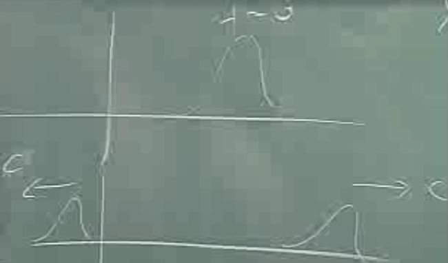

PDE'ler ayrıksal sistemlerin, ODE'lerin, süreklilik limitinde doğal olarak
ortaya çıkarlar. Bu tür yaklaşıksallamaları ben araştırmalarımda sürekli
kullanıyorum [hoca uygulamalı matematikçi], akışkanlık mekaniğinde mesela,
bir sıvının, molekülün kısımlarını alıyoruz, ve kısımlar birbirleri ile
etkileşimde oluyorlar. Ya da mesela yoğunluk değişkenini, kütleyi bir
sürekli fonksiyon haline getiririz, ve parçacık hızı yerine sıvının
tamamının hızına bakarız. Yani bu çok kullanılan bir teknik. Çoğunlukla
ayrıksal bir ağ yapısı için analitik bir denklem bulmak çok zordur, o
sebeple süreklilik yaklaşıksallaması kullanılır zaten. Belki üstteki
problem için alternatif çok kötü olmayabilirdi, mesela burada ODE'leri
matris formunda yazarak ta çözüme gidebilirdik, bu çok zor olmazdı, fakat
çoğu zaman bunu yapmak hakikaten zor olabiliyor.

Niye sistemi analitik olarak görmek istiyoruz? Çünkü o zaman formülasyonu
istediğimiz gibi manipüle ederek, analitik şekilde istediğimiz yoldan
ilerleyebiliyoruz.

Bir PDE kategorisinden bahsedelim, bu tür PDE'ler en çok kullandığım
PDE'lerden, lineer 1. derece denklemler. Ve bu arada "karakteristikler''
kavramından bahsedeceğiz. 

1'inci Derece, Lineer PDE, 2 Bağımsız Değişken

$$ u = u(x,y) $$

PDE

$$ a(x,y)u_x + b(x,y)u_y + c(x,y)u = f(x,y) $$

Operatör olarak 

$$ \mathcal{L}u = f $$

$$ \mathcal{L} = a \frac{\partial }{\partial x} +
b \frac{\partial }{\partial y} +
c \frac{\partial }{\partial z} 
$$

Karakteristik kavramından birazdan istifade edeceğiz, ama şimdi bu tür
denklemleri kaba kuvvet kullanarak, "değişken değiştirme (change of
variables)'' yöntemi ile nasıl çözülebileceğini gösterelim. 

Tanım

Cauchy Problemi: $u(\vec{x})$ tanımı gerektirir. Bu tür problemler
1. derece, 2 değişken, vs. gibi tanımlarla sınırlı değil aslında, çok daha
genel bir tanım onlar, bu tür problemlerde bir "Cauchy Verisi (Cauchy
Data)''nden bahsedilir.

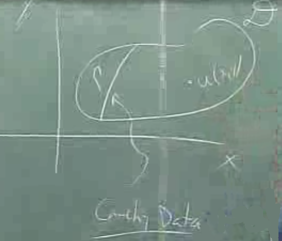

Üstteki resimde bu veri $D$ alanı (domain) içindeki $\Gamma$ ile işaretli
çizgidir, ki $u$'nun bu çizgi üzerindeki değeri diyelim ki

$$ u|_{\Gamma} = \alpha(x,y) $$

ki $\alpha(x,y)$ herhangi bir sonuç. 

Mesela $\Gamma$ çizgisi $x=\sin(y)$ ile tanımlı eğri, ve $u$ onun üzerinde
$u=y^2$ olmalı.

Bu tür bir koşula Cauchy Verisi ismi veriliyor, bizim örneğimizde bu bir
tür sınır koşulunu andırıyor.

Bir kordinat sistemi nedir? 

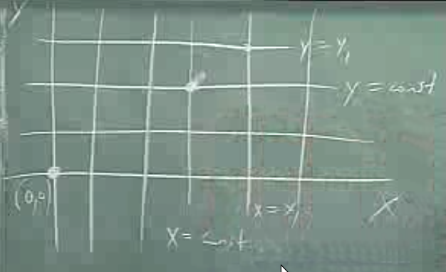

Diyelim ki öyle bir fonksiyon kümesi var ki, onlar üzerinden PDE'lerimizi
değişik bir kordinat sisteminde temsil etmemiz mümkün olacak. 

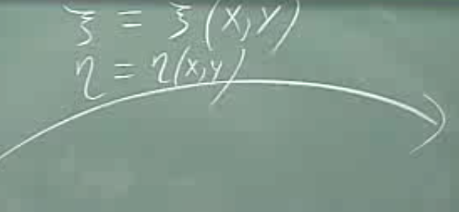

$\xi$ ve $\eta$'yi kesit eğrileri (level curves) üzerinden incelemek
mümkündür. Bu fonksiyonları belli sabitlere eşitleyip, durumlarına
bakabiliriz, sonra sabitleri değiştiririz, bir daha bakarız, vs. 

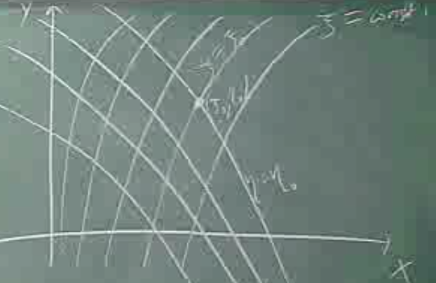

Üstteki resimde mesela, sağa yatık tüm eğriler, her biri değişik bir sabite
(İngilizce const diye yazılmış) eşit olacak şekildeki $\xi$ eğrileri
olabilir. Sola yatik $\eta$ çizgileri de olabilir. Ortadaki nokta iki
önceki resimdeki bir noktanın bu yeni kordinata eşlenmiş bir nokta mesela.

Gerekliliklerimiz

Eşleme, transformasyon bire bir (one-to-one) olmalı. İlk kordinat
sistemindeki her nokta, diğer kordinat sistemindeki tek bir noktaya
eşleniyor olmalı. 

Jacobian'ı yokolmayan (non-vanishing) olmalı. 

$$ 
\left(\begin{array}{rr}
\xi & \eta \\
x & y
\end{array}\right) = 
\left|\begin{array}{rr}
\xi_x & \xi_y \\
\eta_x & \eta_y
\end{array}\right| =
\xi_x \eta_y - \xi_y \eta_x \ne 0
$$

Üstteki ifade Calculus'un Dolaylı Fonksiyon Teorisi (Implicit Function
Theorem of Calculus) ile alakalı. Bu teorinin yerel bağlamda niye birebir
eşleme yarattığını merak ediyorsanız Calculus kaynaklarına
danışabilirsiniz. 

Amaç: Şunu 

$$ au_x + bu_y + cu = f $$

transform et ve suna çevir

$$ W_\xi + h(\xi, \eta)W = R(\xi,\eta)$$


$$ W(\xi,\eta) \equiv u \bigg( x(\xi,\eta),y(\xi,\eta) \bigg) $$

Birebir transformasyon istemiştik, o zaman eşleme geriye çevirilebilir
(invertible) de olmalı, yani istersek $x,y$ değişkenlerini $\xi,\eta$
çerçevesinde temsil edebiliyor olmamız lazım. 

Dikkat: $W_\eta$ yoktur, bu sayede iki üstteki formül 1. derece ODE haline
gelir, entegre edici faktör kullanıp entegre edip Cauchy Verisini
uygulayarak bu problemi çözebilirsiniz. Analitik olarak biraz karmaşıklığa
sebep verebilir, ama bu en azından mümkün bir stratejidir. 

Şimdi sıra transformasyonu bulmaya geldi. $x,y$ değişkenlerini $\xi,\eta$
çerçevesinde temsil edelim. Zincirleme Kanununu kullanalım. 

$$ \frac{\partial }{\partial x}u \equiv
\frac{\partial }{\partial x}W(\xi(x,y),\eta(x,y)) =
W_\xi\eta_x + W_\eta\eta_x 
$$

$$ \frac{\partial }{\partial y}u =
W_\xi\eta_y + W_\eta\eta_y
$$

Bunu orijinal denkleme sokalım 

$$ 
a(\xi,\eta) \bigg[W_\xi \eta_x + W_\eta\eta_x \bigg] +
b(\xi,\eta) \bigg[W_\xi \eta_y + W_\eta\eta_y  \bigg] + 
c(\xi,\eta)W = f(\xi,\eta)
$$

Tekrar düzenleyelim

$$ = 
\bigg[ a\xi_x + b\xi_y \bigg] W_\xi + 
\bigg[ a\eta_x + b\eta_y \bigg] W_\eta +
cW = f
$$

Şöyle seç

1)

$$ a \eta_x + b \eta_y = 0 $$

$$ \Rightarrow \frac{\eta_x}{\eta_y} = -\frac{b(x,y)}{a(x,y)}$$

2)

$$ \xi = x $$

Böylece 

$$ h = \frac{c}{a} $$

$$ R = \frac{f}{a} $$

elde edilir. 

Unutmayalım Jacobian şartını tatmin etmemiz lazım. 

Farz edelim 

$$ \eta_y \ne 0 $$

Bu işe yarar 

$$ J = \xi_x\eta_y - \cancelto{0}{\xi_y}\eta_y $$

$$ J = \eta_y \ne 0 $$

Bir dahaki derste $\eta$'yi nasıl hesaplayacağımızı göreceğiz. 

Diğer bir açıdan bakarsak, mesela matematikçi David Mumford [7] türetirken ($i$
yerine $k$ kullanmış)


$$ 
\tau \bigg( \frac{Y_{i+1}- Y_i}{\Delta x} \bigg) +
\tau \bigg( \frac{Y_{i-1}- Y_{i}}{\Delta x} \bigg) 
$$

Yani bir parçacığın üzerindeki kuvvet sağındaki ve solundaki kuvvetlerin
"toplamı'' olarak görülüyor, bu formül de aynı kapıya çıkıyor.

Kaynaklar

[1] Bayramlı, Hesapsal Bilim, Ders 2 

[2] Landau, *Landau Computational Physics Course, Video Lectures*,
    [https://www.youtube.com/playlist?list=PLnWQ_pnPVzmJnp794rQXIcwJIjwy7Nb2U](https://www.youtube.com/playlist?list=PLnWQ_pnPVzmJnp794rQXIcwJIjwy7Nb2U)

[3] Landau, *Computational Physics*

[4] Feldman, *Math 256, Differential Equations, Lecture Notes*
    [http://www.math.ubc.ca/~feldman/m256/](http://www.math.ubc.ca/~feldman/m256/)

[5] Murlow, *Partial Differential Equations for Scientists and Engineers*, sf. 27

[6] Bayramlı, *Normal Diferansiyel Denklemler Ders Notlari, Ekler, Trigonometri*

[7] Mumford, *Chapter Ten: The Vibrating String and PDE's*,
    [https://www.dam.brown.edu/people/mumford/beyond/coursenotes/2006PartIIIa.pdf](https://www.dam.brown.edu/people/mumford/beyond/coursenotes/2006PartIIIa.pdf)

[8] Resnick, *Fundamentals of Physics, 8th Ed*
    
[9] Weinstein, *Analytic Methods for PDEs, APMA E6301, Columbia University*

[10] Peer, *PY3102, Quantum Mechanics*,
     [http://www.physics.ucc.ie/apeer/py3102.html](http://www.physics.ucc.ie/apeer/py3102.html)

     

