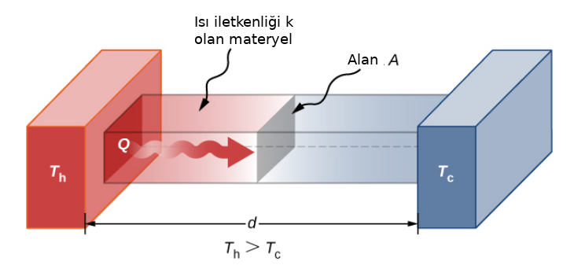
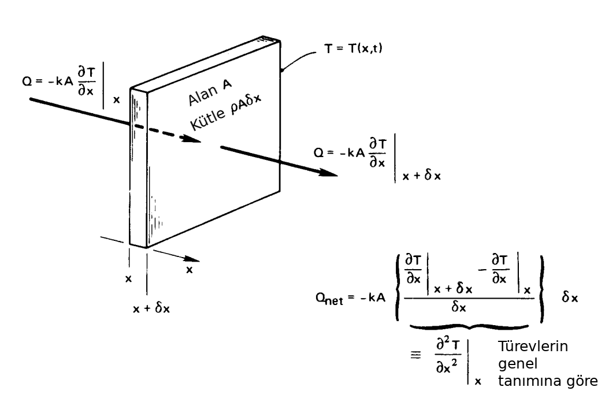

# Isı Denklemi (Heat Equation)

Bir gövdede, cisimde ne zaman bir sıcaklık (temperature) gradyanı var ise, yani
çoktan aza doğru bir farklılık, fark vektörü mevcut ise, orada bir enerji
transferi olur, bu transfer yüksek sıcaklıktan alçak sıcaklık yönüne doğru
olur. Bu alandaki Fourier kanunu der ki birim alan bazlı ısı iletimi (ısı akışı
-heat flux-) bu bahsedilen sıcaklık gradyanı ile direk orantılıdır. Formül
olarak

$$
\frac{\dot{Q}}{A} \propto \frac{\mathrm{d} T}{\mathrm{d} x}
$$

$\dot{Q}$, yani $\mathrm{d} Q / \mathrm{d} t$ ısı transfer hızı (Watt olarak), $A$ ısı
transferinin üzerinden olduğu $m^2$ alan, ki bu alan ısı akışına dik olan
alandır, $\frac{\mathrm{d} T}{\mathrm{d} x}$ sıcaklık gradyanı birimi $C / m$ ki tek boyutta
$T-x$ diyagramındaki sıcaklık eğrisinin eğimi olarak görülebilir (eğim tabii ki
yukarı doğru giden bir eğride yükselişin yönünü gösterir, yani gradyan).

Orantılı olma ilişkisini bir sabit dahil ederek eşitliğe çevirebiliriz,

$$
\frac{\dot{Q}}{A} = -k \frac{\mathrm{d} T}{\mathrm{d} x}
$$

ya da

$$
\dot{Q} = -k A \frac{\mathrm{d} T}{\mathrm{d} x}
$$

$k$ birimi $W/m \cdot C$ içerir. Eksi işaretinin formüle dahil edilmesinin sebebi
yüksek sıcaklıktan düşüğe olan ısı akışını pozitif olarak göstermek istememiz;
alçalan bir eğride eğim (gradyan) bildiğimiz gibi eksi işaretli olur, o zaman
artan $x$ yönünde ters yönde bir ısı akışı olurdu, bunu pozitif yapmak için eksi
ile çarpıyoruz.

Üstteki denklem eğer materyelin katsayısı tüm materyel boyunca sabit ise, 

$$
P = \frac{\mathrm{d} Q}{\mathrm{d} t} = \frac{k A (T_h - T_c)}{d}
$$

olarak basitleştirilebilir.

Soru

Duvar kalınlığı 13 cm olan bir ev düşünelim, ve bu duvarın ortalama ısı iletim
katsayısı cam pamuğunun (glass wool) iki katı [3]. Farz edelim ki hiç pencere ve
kapı yok. Tüm duvarların toplam alanı 120 $m^2$ ve içeride sıcaklığın 18 derece
Celcius olmasını istiyoruz, dışarıda sıcaklık 5 derece. İçeriye kaç tane 1
kilowatt'lik ısıtıcı koymamız gerekir ki bu sıcaklığı elde edelim?

Cevap

Fourier ısı tranfer formülü

$$
\frac{\mathrm{d} Q}{\mathrm{d} t} = \frac{k A (T_2 - T_1)}{d}
$$

Cam pamuğu iletkenliği 0.042 $W / m \cdot C$. Alan $A = 120 m^2$. Dışarısı $T_2
= 18$, içerisi $T_1 = 5$. Duvar kalınlığı $d = 13 cm = 0.13 m$.

$$
= \frac{2 (0.042) (120) (18-5)}{0.13} = 1008 \textrm{ Watt}
$$

Demek ki 1 kilowatt'lik ısıtıcı yeterli olacak.

Çözümün ima ettiği kavrama dikkat edelim; içeride bir ideal sıcaklık dışarıda
bilinen bir sıcaklık üzerinden bir ısı transferi hesaplıyoruz. Elde edilen sonuç
birim zamanda dışarı akan, "kaybedilen'' enerjidir, güçtür. O zaman içerisinin
istenilen sıcaklıkta olmasını istersek bu kaybı telafi edecek ısıyı içeriye
eklememiz gerekir, işte 1 kilowatt'lik ısıtıcı burada devreye giriyor.

Soru

İletkenlik sabiti $k$ nasıl bulunuyor?

Cevap

Deneyler ile bu yapılabilir; her materyel teker teker alınır, mesela üstteki cam
pamuğu, ya da beton, ve bilinen kalınık, ve alanla bu materyeller hazırlanır,
sonra deneyde bilinen güç uygulanır, ve ısının materyelin sol tarafında ne
kadar, sağ tarafında ne kadar olduğu, o noktaya ne kadar hızla eriştiğine
bakılır, kaydedilir. Bu ölçümler Fourier ısı transfer denkleminde bilinenler
olacaktır, tek bilinmeyen ise $k$ sabiti. Bilinmeyen için denklem çözülünce her
materyelin sabiti elde edilir.

Genelleştirilmiş Tek Boyutlu Isı İletim Denklemi

Bu alanda genel olarak gorulen kismi turevsel denklem (PDE) su formdadir,

$$
\frac{\partial T^2}{\partial x^2} = \frac{1}{\alpha} \frac{\partial T}{\partial t}
$$

Fourier kanunundan üsttekine nasıl erişiriz? Bu aslında basit. $\delta x$
genişliğinde $A$ alanında bir kesit düşünelim, bu kesite sol tarafından akan
ısının formülü $Q = -kA \frac{\partial T}{\partial x}$ olacaktır, sağda ise yine
aynı formül fakat $x + \delta x$ noktasında. Eğer $\delta x$ bazlı değişimi
istiyorsak aradaki farkı $\delta x$ ile böleriz, fakat bu bizi türev tanımına
götürmez mi? Tabii başlangıçtaki formülde zaten bir türev vardı o zaman ikinci
derece türeve geçiş yapmamız gerekiyor,

Böylece net elde edilen $Q_{net} = -k A \frac{\partial T^2}{\partial x^2} \delta x$
oluyor [4, sf. 18].

Biz $Q$'den kurtulmak istiyoruz, onu farklı bir şekilde belirtmenin yolu şöyle,
$c$ sabiti $J / kg \cdot C$ biriminde, onu bir kütle ile çarparsak, ve sıcaklık
değişimi üzerinden bir işi değimine erisebiliriz, $\rho$ yoğunluk, $kg/m^3$
biriminde, $A$ alan, $T$ birimi Celcius C üzerinden,
$c \rho A \delta x \frac{\partial T}{\partial t}$ ile $-Q_{net}$ elde edilir,
iki tarafı birbirine eşitlersek,

$$
\frac{\partial T^2}{\partial x^2} = \frac{\rho c}{k} \frac{\partial T}{\partial t}
$$

Kısaltmak için,

$$
 \frac{\rho c}{k} = \frac{1}{\alpha}
$$

diyelim, o zaman

$$
\frac{\partial T^2}{\partial x^2} = \frac{1}{\alpha} \frac{\partial T}{\partial t}
$$

sonucuna erişiyoruz.

Alternatif Anlatım

Bu denklemi türetmek için "enerjinini muhafazası (conservation of
energy)'' kuralını kullanacağız. Bu muhafaza kuralını bir eşitliğe
çevireceğiz, ve bu eşitliği manipüle ederek ortaya bir kısmi türevsel
denklem (PDE) çıkartacağız. Baz aldığımız fiziksel ortam bir metal çubuk,
ki bu çubukta materyel yoğunluğu her noktada aynı [2].  Formül şöyle;

$[x,x+\Delta x]$ içindeki net ısı değişimi = Tanımlanan bölge
sınırlarındaki net ısı akışı + $[x,x+\Delta x]$ içinde üretilen ısı miktarı

$[x,x+\Delta x]$ içindeki toplam ısıyı nasıl hesaplarız? Eğer $u(x,t)$
metal çubuğun $x$ noktasında $t$ anındaki ısıyı veriyorsa, verilen kesit
üzerinden bir entegral alırız,

$$
[x,x+\Delta x] \textit{ İçindeki Toplam Isı} = 
cpA \int_{ x}^{x+\Delta x}u(s,t) \mathrm{d} s
$$

Tanımlanan bölge içindeki net ısı değimini ise alttaki ile hesaplarız,
üstteki formülün zamana göre türevini alırız. 

$$
\frac{d}{dt} \int_{ x}^{x+\Delta x} c\rho A u(s,t) \mathrm{d} s = 
c\rho A  \int_{ x}^{x+\Delta x} u_t(s,t) \mathrm{d} s
$$

Türevin entegral içine nüfuz ettiğini görüyoruz, sabit olan $c\rho A$ ise
dışarı çıkartılıyor. Bu son ifade, enerji formülünün sol tarafı. Sağ tarafı
şöyle ifade edilebilir

$$ = kA [ u_x(x+\Delta x,t) - u_x(x,t)] A \int_{x}^{x+\Delta x} f(s,t) \mathrm{d} s $$

Newton'un kuralı ısı akışının ısı fonksiyonunun uzaklıksal gradyanına
(spatial gradient) orantılı olduğunu söyler. Uzaklıksal gradyan
$u_x$'tır. Uzaklıksal gradyan, yani $u_x$, sonsuz küçük boyutta yanyana iki
parçacağın ısı farkını verecektir. Bu farkı, $[x,x+\Delta x]$'in iki ucunda
alırsak, yani farkların farkını bize gereken orantıyı verecektir. Sezgizel
olarak bunun niye olduğunu anlamak için fizik kaynaklarına başvurmak
faydalı olabilir. Formülün tamamı şöyle

$$
c\rho A  \int_{ x}^{x+\Delta x} u_t(s,t) \mathrm{d} s =
kA [ u_x(x+\Delta x,t) - u_x(x,t)] A \int_{x}^{x+\Delta x} f(s,t) \mathrm{d} s 
\qquad (1)
$$

Bu noktada üstteki formülde entegrallerden kurtulmak istiyoruz. Ne
yaparız?  Ortalama Değer Teoremi'en ihtiyacımız var, bu teori {\em
  Calculus'un Temel Teoremi} yazısında işlendi. Teoriye göre, eğer $f(x)$
bir $[a,b]$ aralığında sürekli ise o zaman en az bir $\xi$ olmalı, $a <
\xi < b$ olacak şekilde ve

$$ \int_{ a}^{b} f(x) \mathrm{d} x = f(\xi)(b-a)  $$

doğru olmalıdır. Bu teoriyi (1)'e uygularsak,

$$ c\rho A u_t(\xi_1,t)\Delta x = 
kA[u_x(x+\Delta x, t) - u_x(x,t)] + 
Af(\xi_2,t)\Delta x
 $$

$$ x < \xi < x+\Delta x $$

elde ederiz. $\xi_1,\xi_2$ yerine sadece $\xi$ kullanılabilir, sebebini
altta göreceğiz, sonra iki tarafı $c\rho A \Delta x$'e bölersek

$$
u_t(\xi,t) =  \frac{k}{c\rho}
\bigg[
\frac{u_x(x+\Delta x,t) - u_x(x,t)} {\Delta x}
\bigg]
+ \frac{ 1}{c\rho}f(\xi,t)
$$

Şimdi 

$$ \Delta x \to 0 $$

olsun, bu durumda üstteki büyük parantez içindeki bölüm bir kısmi türev
haline gelecektir, $\xi \to x$ olacaktır, çünkü aralık öyle küçülüyor ki
arada kalan $\xi$ değeri sadece $x$ olabilir.

$$ u_t(x,t) = \alpha^2u_{xx}(x,t) + F(x,t) $$

Ayrıca

$$ \alpha^2 = \frac{k}{c\rho} $$

$$ F(x,t) = \frac{1}{c\rho}f(x,t) $$

eşitliklerini kullandık.

Kaynaklar

[1] Rathore, *Engineering Heat and Mass Transfer, 3rd Edition*

[2] Murlow, *Partial Differential Equations for Scientists and Engineers*, sf. 27

[3] OpenStax, *University Physics II, Thermodynamics, Electricity and Magnetism*

[4] Lienhard, *A Heat Transfer Textbook*

