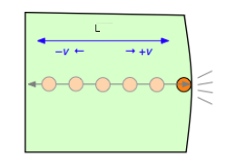
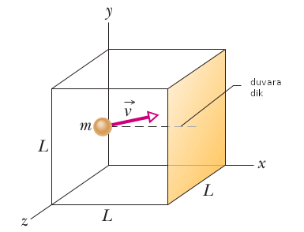
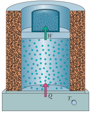
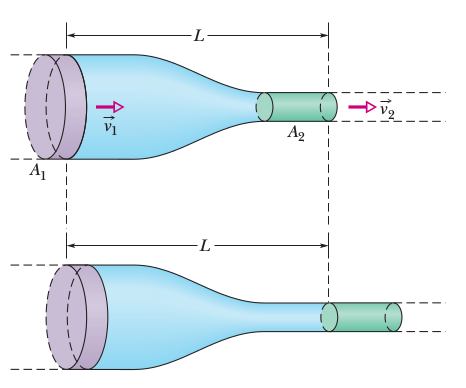
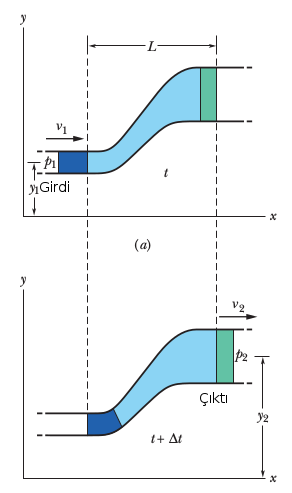
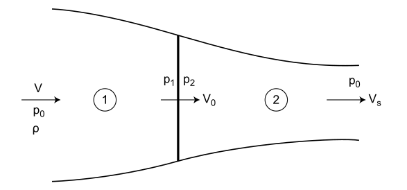
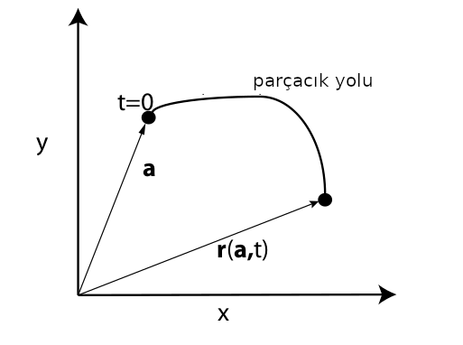
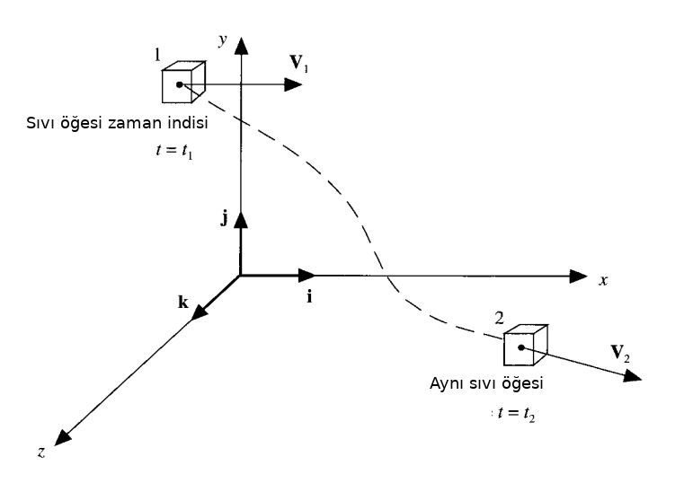

# Sıvı ve Gaz Mekaniği - 1

İdeal Gazlar Kanunu (İdeal Gas Law)

Önce bazı terimler. Bir mol (mole) terimi mesela, mol önceden belirli bir
molekül sayısıdır. Tutarlı olması için herkesin kabul ettiği bir sayı, özel bir
temel parçacığa bağlanmış, bir mol 12 gramlık karbon-12 içindeki atom sayısı
[2, sf. 550]. Mole molekül sayısı aynı zamanda ünlü Avagadro sabitidir,
$N_A$ ile gösterilir,

$$
N_A = 6.02 x 10^{23} mol^{-1}
$$

Yani bir mol içinde üstteki kadar molekül var. Bir materyal içinde kaç mol var
hesabı için $n = N / N_A$ kullanabiliriz, $N$ tüm molekül sayısı, $N_A$ bir mol
içindeki molekül sayısı, bölüm bize istenen sonucu verir.

Basınç

Peki mikro etkileşimlerden yola çıkarak basınç kavramını türetebilir miyiz
acaba? 19'uncu yüzyıl sonlarına doğru bu başarıldı. Basıncın gaz moleküllerinin
bir yüzeye çarpmasından ortaya çıktığını hatırlayalım. Bu kuvvet tabii ki Newton
kanunundan hareketle,

$$
f = m a = m \frac{\mathrm{d} v}{\mathrm{d} t}
$$

Hız $v$'ye molekül içinde olduğu kabın / yüzey duvarına çarptığında ona dik olan
hız diyelim [1]. Bu türevi hesaplamak için, ki birim zamanda hız değişimi
gerekiyor, kenarları $L$ uzunluğunda bir küp içinde tek bir gaz molekül olduğunu
düşünelim.

Basitleştirme amacıyla diyelim ki bu molekül sürekli küp kutu içinde ileri geri
gidip geliyor, bir duvara çarpınca bir süre sonra geri geliyor. Bu molekül bir
duvara çarptığında $v$ hızında çarptığında (yani $mv$ momentumuyla) elastik
olarak geri sekecektir, ve $-v$ ile tam ters yöne geri gitmeye başlayacaktır.



O zaman her çarpışma için hız değişimi $2v$, momentum değişimi ise $2mv$
olur.

Tabii aslında eğer daha genel formülize etmek gerekirse bu çarpışma sırasında
$\bar{v}$ hızının duvara dik olan bileşeni $v_x$'yi düşünüyoruz.



Yani momentum değişimi

$$
\Delta p_x = (-m v_x) - (m v_x) = - 2 m v_x 
$$

Demek ki duvara transfer edilen momentum $2 m v_x$. 

Birim zaman $\Delta t$'ye bir molekün iki çarpışma arasında geçen zaman dersek,
ve $v_x$ hızında $2L$ yol katedilmişse, $\Delta t  = 2 L / v_x$ demektir, ve

$$
F = \frac{\Delta p_x}{\Delta t} = \frac{2 m v_x}{2 L / v_x} = \frac{m v_x^2}{L}
$$

Basınç birim alana uygulanan kuvvettir, ve küpün bir kenarının $L^2$ alanında
olduğunu düşünürsek, 

$$
P = \frac{m v^2}{L^3} = \frac{m v^2}{V}
$$

$V$'yi kutunun hacmi olarak aldık, ve $V = L^3$.

Birden fazla molekülü düşünmek istiyoruz şimdi, mesela bir averaj
üzerinden.. Fakat her molekül hem negatif hem pozitif yönde aşağı yukarı aynı
miktarda hareket yapar (rasgele hareket olduğu için) ve bu tür bir hareket
üzerinden averaj almak bizi sıfır değerine götürür. Bu sebeple ortalamasını
almadan önce hızların karesini almak istiyoruz,

$$
\bar{v^2} = \frac{v_1^2 + v_2^2 + ... + v_N^2 }{N} = \frac{\sum_i v_i^2}{N}
$$

ve ortalama değeri bulmak için $\sqrt{\bar{v^2}}$ kullanıyoruz. Bu hesaba kök
kare ortalaması (root mean square -RMS-) ismi de verilir. Şimdi tüm $N$
moleküller üzerinden bir basınç hesaplamak istersek, $N$ tane molekül, ama belli
bir anda sadece Kartezyen kordinat sisteminde sadece üç yönden sadece biri
yönünde etki var, o zaman $N$ ile çarpıp 3'e bölmek lazım, 

$$
P = \frac{N}{3} \frac{m \bar{v^2}}{V}
$$

Bu formül içinde bir kinetik enerji formülasyonu görülebiliyor, averaj kinetik
enerjiye $\epsilon = m \bar{v^2} / 2$ dersek, üstteki formülü

$$
PV = \frac{N}{3} m \bar{v^2} = \frac{2}{3} N \epsilon
$$

olarak yazabiliriz.

Eğer bu formülü sıcaklık içerek şekilde değiştirmek istiyorsak; biliyoruz ki
sisteme eklenen her Joule enerji ve bir derece sıcaklık değişimi arasındaki
ilişkiyi $k$ sabiti kontrol eder [5, 29-16] bu sabit $k = 1.38 x 10^{23}$ Joule
/ Kelvin'dir, o zaman enerjiden sıcaklığa geçiş için $kT$ kullanabiliriz, hatta
bir $3/2$ eklenerek üstteki 2/3 iptali amaçlanır,

$$
\epsilon = \frac{3}{2} k T
$$

Ve,

$$
PV = \left( \frac{2}{3} N \right) \left( \frac{3}{2} k T \right) = N k T
$$

Devam edelim, $n = N / N_A$ olduğunu da biliyoruz ki $N_A = 6.02 x 10^{23}$,
Avagadro'nun sayısı, $n$ örneklemdeki mol sayısı, $N$ ise örneklemdeki tüm
moleküller [2, sf. 550],

$$
PV = n N_A k T
$$

Tabii bu bizi $R$ denen bir diğer sabite götürüyor, $R = 8.31 J/mol \cdot
K$. Onun $k$ ve $N_A$ ile ilişkisi şöyle,

$$
k = \frac{R}{N_A}
$$

O zaman,

$$
PV = n R T
$$

İdeal gazlar kanununa erişmiş olduk.


Mol sayısını şöyle ifade edebilirdik,

$$
n = m / w_m
$$

ki $m$ gazın kütlesi, $w_m$ ise moleküler ağırlık. Bunları birbirine bölünce
doğal olarak mol sayısı ortaya çıkar, $n$'yi iki üstteki formüle koyunca,

$$
PV = \frac{m}{w_m} R T
$$

Bir düzenleme yaparsak,

$$
P = \frac{m}{V} \frac{R}{w_m} T
$$

$m/V$ yoğunluk, ona $\rho$ diyebiliriz, $R / w_m$ ise evrensel gaz
sabiti $R$'nin gazın moleküler ağırlığına bölünmüş hali, ona
yeni bir sabit $R_m$ diyebiliriz, o zaman daha öz

$$
P = \rho R_m T
$$

formülü elde edilir.

İç Enerji (Internal Energy)

Daha önce görmüştük, tek atomun ortalama hareketsel kinetik enerjisi
sıcaklığa bağlıydı, ona daha önce $\epsilon$ demiştik, şimdi $K_{avg}$
diyelim, ki $K_{avg} = 3/2 k T$. O zaman, ve $n$ mol miktarında bir
örneklemin içinde $n N_A$ molekül olacağı için, örneklemin iç
enerjisi $E_{int}$ şöyle hesaplanabilir [2, sf. 564],

$$
E_{int} = (n N_A) K_{avg} = (n N_A) (\frac{3}{2} k T)
$$

Daha önce gördük $k = R/N_A$, üstteki $E_{int}$ içine koyarsak,

$$
E_{int} = \frac{3}{2} n R T
$$

Mol Spesifik Isı (Molar Specific Heat of a Gas)

Bir gazın sıcaklık artışına tekabül eden ısı enerjisi (girdisi) faydalı
olabilecek bir büyüklüktür, fakat aynı sıcaklık değişimine giden ayrı yollar,
farklı ısı hesaplarına sebep verebilir. Değişimin en çok ortaya çıkan iki
versiyonu için farklı bir mol spesifik ısı öne sürmek daha iyi olur, bunlardan
biri basınç sabit tutulduğu durumdaki, diğeri de hacim sabit tutulduğu
durumdaki mol spesifik ısı.

$$
Q = n C_P \Delta T
\tag{2}
$$

$$
Q = n C_V \Delta T
\tag{1}
$$

Üstteki $C_V$ sabit hacimdeki mol spesifik ısı, $C_P$ sabit basınçtaki.

Sabit hacim durumu için $Q = \Delta E_{int}$, o zaman 

$\Delta E_{int} = n C_V \Delta T$

Eğer sıcaklıkta değişim yoksa 

$E_{int} = n C_V T$

Bu denklem tüm ideal gazlar için geçerlidir, ideal gaz derken molekülünde birden
fazla atom olan gazlar için.

Basınç sabit tutulduğu durumdaki molar spesifik ısıdan hareket ederek bir ilginç
formüle daha ulaşabiliriz; Bu durumda ideal gazın sıcaklığını daha önce olduğu
gibi ufak $\Delta T$ kadar arttırdığımızı düşünüyoruz, fakat şimdi eklenen
enerji hem gazın sıcaklığını arttıracak, hem de iş yapacak, altta görülen
pistonu üste itmek gibi (çünkü basınç sabit dedik, hacim sabit demedik). 



Erişmek istediğimiz hem $C_P$ hem $C_V$ içeren bir formül bulmak, o zaman
Termodinamiğin İlk Kanunu ile başlayalım,

$$
\Delta E_{int} = Q - W
$$

$E_{int}$ bir materyelin iç ısısı, ve sadece materyelin o anki iç konumuna bağlı
(sıcaklığı, basıncı ve hacmi). $Q$ değişkeni sistemin çevresindekilerle yaptığı
ısı alışverisini temsil ediyor, artı değerler materyel ısı çekiyor, negatif ısı
veriyor demektir. $W$ ise sistemin yaptığı iş (work). Eğer sistem genişliyorsa
mesela iş yapılıyordur, genişleme ya da daralma yoksa $W=0$.

Üstteki formül içine bildiğimiz diğer formülleri koyabiliriz, mesela (1)'i
sokarsak,

$$
n C_V \Delta T = Q - W
\tag{5}
$$

Yapılan iş $W$ hesaplamak için üstteki resmi düşünelim, alt bölmedeki gaz
pistonu yukarı doğru iterek iş yapabilir. Bu işin pistonu $\vec{F}$ kuvvetiyle
ve $\mathrm{d} \vec{s}$ kadar sonsuz ufak bir değişime uğrattığını düşünelim.  Bu
değişim çok ufak olduğu için $\vec{F}$'nin o değişim sırasında sabit olduğunu
farz edebiliriz [2, sf. 529]. Bir diğer çıkarsama $\vec{F}$'nin $p A$'ya eşit
olduğu - basınç $p$ kuvvet bölü alan $A$ ise aynı $p$ ile $A$'yi çarparsak
kuvvete geri geliriz. Diferansiyel yapılan iş

$$
\mathrm{d} W = \vec{F} \cdot \mathrm{d} \vec{s} = (pA) (\mathrm{d} s) = p (A \mathrm{d} s)
$$

O zaman $V_i$ ile $V_f$ hacim değişimleri arasında yapılan iş üstteki formülün
entegralidir,

$$
W = \int \mathrm{d} W = \int_{V_i}^{V_f} p \mathrm{d} V
$$

Bu hesabın detaylarına şimdi girmeyeceğiz, ama baktığımız sabit hacim
durumu için üstteki hesap daha basitleşiyor, $W = p \Delta V$. Ayrıca
ideal gaz kanunu $pV = n R T$ olduğu için $p \Delta V = n R \Delta T$
de yazılabilir, o zaman $p \Delta V$ yerine $n R \Delta T$ kullanmak
mümkün, (5)'e sokarsak,

$$
n C_V \Delta T = Q - n R \Delta T
$$

$Q$ ise basınç sabit durumdaki (2) formülünden geliyor zaten,

$$
n C_V \Delta T = n C_P \Delta T - n R \Delta T
$$

Her şeyi $n \Delta T$ ile bölersek,

$$
C_V = C_P - R
$$

Ya da

$$
C_P - C_V = R
\tag{4}
$$

Bir diğer kullanışlı ilginç sabit

$$
\gamma = C_P / C_V
\tag{3}
$$

oranıdır. Bu oran, politropik (polytrophic) gazlar denen, sabit hacimdeki
durumun enerjisinin hesaplamak için faydalı. Tek bir mol için

$$
E_{int} = C_V T
$$

ile başlarsak, ve $T = p / R\rho$ formülünü $T$'ye sokunca [3, sf. 295],

$$
E_{int} = \frac{C_V}{R} \frac{p}{\rho}
$$

Gruplamayı bu şekilde yaptık çünkü birazdan $C_V/R$ yerine başka bir formül
bulacağız. Devam edelim (3)'ten hareketle $\gamma C_V = C_P$ diyebiliriz. Bu
formülü $C_P$ için (4)'ye koyalım,

$$
\gamma C_V - C_V = R \implies C_V(\gamma-1) = R \implies \frac{C_V}{R} =
\frac{1}{\gamma-1}
$$

Bu sonuç iki üstteki ilk terim ile uyumlu, o zaman 

$$
E_{int} = \frac{p}{\rho (\gamma - 1)}
$$

Bu form politropik ideal gazların konum formülü (equation of state for an ideal
polytropic gas) olarak biliniyor.

Gazlar, Sıvılar, Hava Dinamiği

Süreklilik Denklemi

Farklı noktalarda boyutları farklı olan bir tüp içinde istikrarlı akış içindeki
bir sıvının $v$ ve $A$ ifadelerini birbiriyle ilintilendiren bir formül kurmak
istiyoruz. Bir $t$ zamanından başlayarak $\Delta t$ kadar süre içindeki tüpün
solunda oluşan hacim ve bu hacmi dışarı itmesi gereken, eğer sıvı sıkıştırılamaz
ise, sağda eşit bir hacim vardır. Soldan $\Delta V$ girmişse sağdan $\Delta V$
çıkmalıdır.



Genel bağlamda $\Delta x = v \Delta t$ ise,

$$
\Delta V = A \Delta x = A v \Delta t
$$

Şimdi tüpün solu ve sağı özelinde,

$$
\Delta V = A_1 v_1 \Delta t = A_2 v_2 \Delta t
$$

$$
A_1 v_1 = A_2 v_2
$$

Üsttekine süreklilik denklemi adı veriliyor.

Bu denklemi 

$$
R_V = A v = \textrm{sabit}
$$

olarak ta yazabiliriz, çünkü süreklilik denklemi herhangi iki nokta için
doğru olmalıdır, o zaman üstteki ifade de geçerlidir. $R_V$'ye hacim akış
oranı denir. 

Ek olarak sıvının yoğunluğu her yerde eşit ise, mesela $\rho$ diyelim, o
zaman 

$$
R_m = \rho R_v = \rho A v = \textrm{sabit}
\tag{3}
$$

sonucuna da varılabilir [9, sf. 399].

Bernoulli Deklemi

İstikrarlı akış halindeki bir sıvıyı düşünelim, alttaki resimdeki gibi
yandan görülen bir tüpte / boruda akıyor. Diyelim ki 1. resim ile 2. resim
arasında geçen zaman $\Delta t$ ve o zaman içinde koyu mavi olan bölüm
kadar sıvı hacmi yer değiştiriyor [8, sf 402].



Bu değişimin tüp sonunda yeşil bölge kadar hacim değişikliğine yol
açar diyelim, ve önemli bir nokta iki hacim birbirine eşittir.  Eğer
1. resimdeki sıvının girişteki yükseklik, hız, ve basıncı
$y_1,v_1,p_1$ ile temsil ediliyorsa, 2. resimde diğer uçtaki
$y_2,v_2,p_2$ diyelim, bu değişkenler

$$
p_1 + \frac{1}{2} \rho v_1^2 + \rho g y_1 =
p_2 + \frac{1}{2} \rho v_2^2 + \rho g y_2 
\tag{1}
$$

formülü ile birbiriyle bağlıdır, ki $\rho$ sıvı yoğunluk
sabiti. Üstteki denklemi

$$
p + \frac{1}{2} \rho v^2 + \rho g y = \textrm{bir sabit}
\tag{2}
$$

olarak ta yazabiliriz. Bu son formül Bernoulli'nin formülüdür, onun
daha yaygın bilinen formudur.

Formüle erişmek için iş-kinetik enerji teorisinden başlayabiliriz, 

$$
W = \Delta K
$$

Yapılan iş kinetik enerjideki değişime eşittir. Sıvı için kinetik enerji
değişimi sıvının tüp başında ve sonundaki hızı ile alakalı olmalıdır [9,
sf. 403],

$$
\Delta K = \frac{1}{2} \Delta m v_2^2 - \frac{1}{2} \Delta m v_1^2 
$$

ki $\Delta m$ tüpün başında $\Delta t$ anında içeri giren sıvı kütlesi. Onu
$\Delta m = \rho \Delta V$ olarak ta yazabiliriz ki $\Delta V$ aynı zaman
aralığında giren sıvı hacmi.

$$
= \frac{1}{2} \rho \Delta V(v_2^2 - v_1^2)
$$

Şimdi basıncı dahil edelim, bu da bir kuvvet, tüpün başında pozitif iş
yapıyor, sonunda içerideki tüm sıvının kütlesi üzerinden ters yönde iş
yapıyor, genel olarak 

$$
F \Delta x  = (pA)(\Delta x) = p(A\Delta x) = p \Delta V
$$

denebilir, o zaman baştaki iş $p_1 \Delta V$, sondaki iş $p_2 \Delta V$,
toplam

$$
W_p = -p_2 \Delta V + p_1 \Delta V
$$

$$
= - (p_2-p_1) \Delta V
$$

Yerçekimin yaptığı iş negatiftir, $W_g$ diyelim, kuvvet çarpı yer
değişikliği. Kuvvet $\Delta m g$, yer değişikliği $y_2-y_1$. 

$$
W_g = -\Delta m g (y_2 - y_1)
$$

$$
= -\rho g \Delta V (y_2-y_1)
$$


Hepsini bir araya koyarsak, yapılan iş eşittir kinetik enerji değişimi
üzerinden,

$$
W = W_g + W_p = \Delta K
$$

$$
-\rho g \Delta V(y_2-y_1) - \Delta V(p_2-p_1) = 
\frac{1}{2} \rho \Delta V(v_2^2 - v_1^2)
$$

Tekrar düzenlersek (1)'e erisebiliriz. (2) denklemi (1)'e bakmanın bir
diğer yönü, çünkü aslında (2) diyor ki basınç $P$ artı kinetik enerji
$\frac{1}{2} \rho v^2$ artı yerçekimsel potansiyel enerji yoğunluğu
$\rho g y$'yi tüp akışındaki herhangi iki noktada hesaplarsak birbirlerine
eşit olmalılar. O zaman, $p + \frac{1}{2} \rho v^2 + \rho g y$ formülü her
noktada aynı olacağına göre bu ifadenin bir sabite eşit olduğu da
söylenebiliyor. Yani

$$
p + \frac{1}{2} \rho v^2 + \rho g y = \textrm{bir sabit}
$$

oluyor. Diğer bir yönden bakarsak, üstteki formüle bir enerji denklemi de
denebilir. Tüm formülü $\rho$ ile bölersek,

$$
\frac{p}{\rho} + \frac{1}{2} v^2 + gh = \textrm{sabit}
$$

Buradaki $p / \rho$ basınç enerjisi, $\frac{1}{2}v^2$ kinetik enerji, $gy$ ise
potansiyel enerji. Bir sıvı (ya da aerodinamik durumunda hava) ögesi, parçacığı
bir tüpte akarken toplam enerjisinin muhafaza eder.

Bir hava taşıtının etrafından akan hava durumunda öğelerin dikey yer
değişimi genellikle çok küçüktür o zaman yok sayılabilirler, bu durumda
Bernoulli denklemi 

$$
p + \frac{1}{2} \rho v^2 = \textrm{sabit}
$$

formuna indirgenebilir [7, sf 97]. $\frac{1}{2}\rho v^2$ terimine dinamik basınç
(dynamic pressure) ismi de veriliyor, bu terim birim hacimdeki ve $\rho$
yoğunluğundaki havaya $v$'ye hızlandırılınca eklenen kinetik enerjiyi temsil ediyor.

Basınç Katsayısı (Pressure Coefficient)

Aerodinamikte bazı öğeleri tekil boyutsuz sayılara indirgemek faydalı
olabiliyor. Mesela eğer bir kanat kesidi (airfoil) etrafındaki havanın kesite
nasıl basınç uyguladığına bakıyorsak, basınç katsayısı $C_p$ burada faydalı
olabiliyor, örnek için [9], $C_p$'yi şöyle tanımlıyoruz,

$$
C_p \equiv \frac{p - p_\infty}{\frac{1}{2} \rho_\infty v_\infty^2}
$$

ki $p_\infty$ incelenen parçanın dışında kalan havanın normal basıncı,
$v_\infty$ hızı, $\rho_\infty$ ise o havanın yoğunluğu.

Denkleme yakından bakarsak olabilecek en az $v=0$ ile $C_p$'nin olabileceği en
büyük değer 1'dir. Akışın olmadığı noktaları tıkanıklık bölgeleri (stagnation
point) ismi verilir. Akışın $p < p_\infty$ bölgelerinde ise $C_p$ negatif
olacaktır.

Helikopter

Bir helikopterin pervanesi dönerken üstteki hava parçacıklarını alıp aşağı
doğru iter. Olanları sanki bir tüp içinde sıvı akışıymış gibi görebiliriz,
ama ufak bir fark var, altta dikey çizgiyle gösterilen (yandan bakış)
pervane sıvıya, daha doğrusu havaya bir enerji ekler.



Bu sebeple bir enerji hesabı yapmak istiyorsak Bernoulli denklemini iki
bölgeye ayrı ayrı uygulamamız gerekir. Pervane öncesi, ve sonrası [8,
sf. 66].

$$
p_0 + \frac{1}{2} \rho V^2 = p_1 + \frac{1}{2} \rho V_0^2
$$

Ve

$$
p_2 + \frac{1}{2} \rho V_0^2 = p_0 + \frac{1}{2} \rho V_s^2
$$

Değişkenlerin ne olduğunu açıklamak gerekirse pervane diskine girmeden önce
hava heryerde birörnek $V$ hızında ve $p_0$ basıncına sahip. Diske
yaklaştığında hava $V_0$ hızına getiriliyor ve basıncı $p_1$'e
düşüyor. Disk üzerinde onun uyguladığı enerji ile basınç $p_2$'ye
arttırılıyor ama süreklilik bağlamında hızının çok fazla artışı mümkün
değil. Disk arkasında, tüpün ikinci bölümünde hava genişliyor, basınç
$p_0$'ye dönüyor, bu noktada hızı $V_s$.

Şimdi üstteki denklemleri şu şekilde yazarsak, 

$$
p_1 + \frac{1}{2} \rho V_0^2 = p_0 + \frac{1}{2} \rho V^2
$$

$$
p_2 + \frac{1}{2} \rho V_0^2 = p_0 + \frac{1}{2} \rho V_s^2
$$

ve bir üstteki denklemi iki üstteki denklemden çıkartırsak, 

$$
\left(p_2 + \frac{1}{2} \rho V_0^2 \right) - 
\left(p_1 + \frac{1}{2} \rho V_0^2 \right) = 
\left(p_0 + \frac{1}{2} \rho V_s^2 \right) - 
\left(p_0 + \frac{1}{2} \rho V^2 \right)
$$

Basitleştirince,

$$
p_2 - p_1 = \frac{1}{2} \rho (V_s^2 - V^2)
\tag{4}
$$

Devam edelim, daha önce (3)'te gördük ki, eğer alan için $S$, hız için
$V_0$ kullanırsak, 

$$
R_m = \rho S V_0
$$

Momentum kütle çarpı hızdır, momentum artışı ise diske giren kütle artış
oranı çarpı hız olarak temsil edilebilir, o zaman biraz önce gördüğümüz
$V_s-V$ hız artışının ima ettiği momentum artışı üstteki eşitliğin sol
tarafında $R_m (V_s - V)$. Tüm formüle uygulayınca 

$$
R_m (V_s - V) = \rho S V_0  (V_s - V)
$$

Üstteki eşitliğin sol tarafına itiş kuvveti (thrust) de denebilir. Yani
$T$,

$$
T = \rho S V_0  (V_s - V)
$$

olur. Değişik bir açıdan bakarsak itiş $T$ diskin iki tarafındaki basınç
farkından da hesaplanabilir, basınç çarpı alan eşittir kuvvet üzerinden,

$$
T = S (p_2 - p_1)
$$

Şimdi (4)'e dönelim. Eğer (4)'daki ifadeyi üstteki formüle $p_2-p_1$'den
sokarsak, ve her iki $T$'yi birbirine eşitlersek, 

$$
\frac{1}{2} \rho S (V_s^2 - V^2) = \rho S V_0 (V_s - V)
$$

Basitleştirmek için

$$
\frac{1}{2} \rho S (V_s - V)(V_s + V) = \rho S V_0 (V_s - V)
$$

$$
V_0 = \frac{1}{2} (V_s + V)  
\tag{5}
$$

Helikopter Asılı Dururken

$W$ ağırlığındaki bir helikopterin askıda kalması için ne kadar güç
gerekir? Bir helikopterin askıda kalması için onun ağırlığına eş büyüklükte
bir itiş kuvveti olmalı. 1'inci itiş formülünden hareketle

$$
W = T = \rho S V_0  (V_s - V)
$$

Hareket ettirilen hava hızı $V = 0$ olacak, pervane alanı dışında kalan
havanın hızını yok sayıyoruz.

Bu durumda, ve pervane alanı $A$ diyerek

$$
W = \rho A V_0 V_s
$$

Diğer yandan (5)'i alırsak, ve $V=0$,

$$
V_0 = \frac{1}{2} V_s
$$

Ya da

$$
V_s = 2 V_0
$$

Bunu alıp $W$ formülüne sokalım,

$$
W = 2 \rho A V_0^2
$$

Ya da

$$
V_0 = \sqrt{W / 2 \rho A} 
\tag{6}
$$

Şimdi uygulananması gereken gücü düşünelim, güç tanımı birim zamandaki
enerji aktarımıdır. Enerji nedir? Üstteki durumda enerji kinetik enerjidir.
Birim zamanda hız pervane dışında $V$, enerji ise $\frac{1}{2}V^2$, pervane
enerji eklemesi sonucu $\frac{1}{2} V_s^2$. Yani enerji eklemesi
$1/2(V_s^2 - V^2)$. Birim zamandaki kütle farkı $R_m = \rho S V_0$
demiştik, hepsini bir araya koyarsak,

$$
P = R_E = \rho S V_0 \frac{1}{2} (V_s^2 - V^2)
$$

Bu formül birim zamandaki havanın kinetik enerjisindeki artışı gösteriyor,
yani uygulanacak güç $P$'yi gösteriyor. Basitleştirelim, $V=0$ olacak,
$V_s = 2 V_0$, alan $S=A$,

$$
= \rho A V_0^3 \frac{1}{2} 2^2 V_0^2
$$

$$
= 2 \rho A V_0^3
$$

(6)'daki $V_0$'yu buraya sokarsak,

$$
= 2 \rho A \left( \frac{W}{ 2 \rho A} \right)^{3/2}
$$

$$
P = \sqrt{ \frac{W^3}{2 \rho A} }
$$

ki $\rho$ standart deniz seviyesi hava yoğunluğu. Demek ki diske
uygulanması gereken güç budur.

Dikkat; üstteki hesaplar uygulanan gücün tamamının pervaneye
aktarılabildiğini varsayıyor. Pratikte bu doğru olmayabilir, pervane şekli,
ve diğer sebeplerden uygulanan güçte kayıp olabilir. Hesaplar idealize
ortamdaki hesaplardır yani, kabaca akıl yürütmek için faydalıdır. İyi bir
başlangıç noktası olacaklardır.

Örnek

Bir helikopter düşünelim, ağırlığı $W = 24000$ Newton olsun, disk alanı
$A = 176.7$ $m^2$. Deniz seviyesi hava yoğunluğu $\rho = 1.226$
$kg \cdot m^{-3}$ üzerinden helikopteri havada tutmak için gereken güç
nedir?

```python
rho0 = 1.226
W = 24000
A = 176.7
print ( np.sqrt( W**3 / (2 * rho0 * A)  ), 'Watt'  )  
```

```
178623.4013246838 Watt
```

Birimlerin doğru olduğunu kontrol edebilirsiniz. Newton $kg \cdot m \cdot
s^{-2}$, Joule $kg \cdot m^2 \cdot s^{-2}$. Üstteki hesaplar $kg \cdot m
\cdot s^{-3}$ verecek, yani Joule / saniye, yani enerji bölü saniye ki bu
da Watt tanımı. 

Örnek

Ufak bir helikopter düşünelim, ağırlığı $W = 1.22$ kg olsun, disk alanı
$A = 0.18$ $m^2$. Helikopteri havada tutmak için gereken güç nedir?

Dikkat kg verildi, ama Newton lazım, önce $9.8 m \cdot s^{-2}$ ile çarpmak gerekli.

```python
rho0 = 1.226
W = 1.22*9.8
A = 0.18
print ( np.sqrt( W**3 / (2 * rho0 * A)  )  )  
```

```
62.22750295064798
```

Örnek

100 kg yükü 3 $m$ pervane yarıçapı ile taşımak için ne kadar güç gerekir?

```python
rho0 = 1.226
W = 100 * 9.8
r = 3.0
A = np.pi * r**2
print ( np.sqrt( W**3 / (2 * rho0 * A)  ), 'Watt'  ) 
```

```
3684.5350274555626 Watt
```

Euler ve Lagrange, Materyel Türev

Euler ve Lagrange bakış açısı arasındaki farklarla başlayalım. Bu iki bakış
açısı bir sıvının dinamiğini nasıl incelediğimiz ile alakalı. Eğer bir nehirdeki
kirlilik yoğunluğunu ölçüyorsak mesela, bunu herhangi bir $x,y,z$ noktasında
yapabiliriz, ve diyelim ki kirlilik belli bir yerde hiç değişmiyor, ertesi gün
gelsek aynı yerde aynı ölçümü alıyoruz [11, sf 78]. Bu yere bağımlı Euler açısı.

Fakat farklı yerlerde farklı ölçümler olabilir, mesela nehir boyunca bir kayık
içinde sabit hızda gidersek yoğunluk lineer oranda artıyor. Bu durumda pir paket
sıvıyı takip ettiğimizi düşünebiliriz, o paketin açısından elde edilen ölçümler
Lagrange bakış açısıdır. 

İki bakış açısı arasında gidip gelmenin yolu materyel türev. Böylece Euler
bazındaki değişim kullanılarak Lagrange tarifi yapılabiliyor. Bu önemli çünkü
ölçümler çoğunlukla Euler formatında düşünülür (bir yerde duran ölçüm aleti
idare etmesi ve temsili daha rahat bir kavramdır), ayrıca matematik Euler
ortamında biraz daha kolay manipüle edilebilir hale geliyor [12].

Lagrange ile bir parçacık hayal ediyoruz, onu tanımlamanın bir yolu $t=0$ anında
nerede olduğu. Daha sonra bu başlangıç noktasındaki sıvı paketinin hangi yolu
takip ettiğini $\bar{r}(t)$ ile tarif ediyoruz, ki $\bar{r}(t)$ parametrik bir
eğri olarak alabiliriz, $r = ( x(t), y(t), z(t) )$. Eğer bir başlangıç
noktasını $a$ olarak tanımlarsak bu başlangıcın ve yol denkleminin bir parçacığı
tarif ettiğini düşünebiliriz,



Herhangi bir ölçümü alalım [13], biraz önce kirlilik örneği verdik, bu
sıcaklık ta olabilirdi, ölçüm $F(t,x,y,z)$ olsun, $t$ anında ve $x,y,z$
noktasında yapılan ölçüm, bu ölçüme Calculus'un Zincirleme Kuralını uygularsak,
değişim oranını materyel türev $D F / Dt$'yi nasıl elde edebileceğimizi
görebiliriz,

$$
\frac{D F}{D t} =
\frac{\partial F}{\partial t} +
\frac{\partial F}{\partial x} \frac{\partial x}{\partial t} + 
\frac{\partial F}{\partial y} \frac{\partial y}{\partial t} + 
\frac{\partial F}{\partial z} \frac{\partial z}{\partial t} 
$$

$(\frac{\partial x}{\partial t}, \frac{\partial y}{\partial t},\frac{\partial
z}{\partial t})$ hız olarak görülebilir, ona $\bar{u} = (u,v,w)$ vektörü diyelim,

$$
\frac{D F}{D t} =
\frac{\partial F}{\partial t} +
\frac{\partial F}{\partial x} u + 
\frac{\partial F}{\partial y} v + 
\frac{\partial F}{\partial z} w 
$$

Ayrica $(\frac{\partial F}{\partial x},\frac{\partial F}{\partial y},\frac{\partial F}{\partial z})$
gradyan vektoru $\nabla F$,

$$
\frac{\partial F}{\partial t} + \bar{u} \cdot \nabla F
$$

Burada $\frac{\partial F}{\partial t}$ ölçülen $F$'nin tek, sabit bir yerde
zamana göre değişimidir. Bu terime yapılan ekler hareket halindeki parçanın ek
olarak göreceği ölçüm değişim oranı olacaktır.

Alınan türev bir operatör olarak görülebilir, 

$$
\frac{D ()}{D t} = \frac{\partial () }{\partial t} + \bar{u} \cdot \nabla ()
$$

Üzerinde operatör uygulanan $()$ içine gider, $F$ için

$$
\frac{D F}{D t} = \frac{\partial F}{\partial t} + \bar{u} \cdot \nabla F
$$

ile önceki formüle eriştik.

Şimdi ilginç bir noktaya geldik, süreklilik denklemi (1)'i, $\rho$ ölçümü
üzerinde materyel türev uygulanmış formu olarak görmek mümkün,

$$
\frac{D \rho}{D t} + \rho \nabla \cdot \bar{u} = 0
$$

İlginç bir diğer bakış açısı Anderson kitabından [16, sf. 43]. Hız $x,y,z$
noktasında $t$ anındaki $u,v,w$ hız vektörü

$$
u = u(x,y,z,t)
$$

$$
v = u(x,y,z,t)
$$

$$
w = u(x,y,z,t)
$$

ile gösteriliyor olsun, ve bu nokta ve zamandaki yoğunluk $\rho$ ise

$$
\rho = \rho(x,y,z,t)
$$


Ufak sıvı hacimlerine bakıyoruz, ve $t_1$ anında 1 noktasındaki öğenin
yoğunluğu

$$
\rho_1 = \rho(x_1,y_1,z_1,t_1)
$$



Daha sonraki bir $t_2$ anında aynı sıvı öğesi 2 noktasına gitti diyelim, bu
noktada yoğunluk

$$
\rho_2 = \rho(x_2,y_2,z_2,t_2)
$$

Şimdi 1 noktası etrafında 2 noktasına doğru bir Taylor açılımı yapabiliriz,
yüksek dereceli diğer terimler (high-order terms) HOT ile belirterek,

$$
\rho_2 =
\rho_1 + \left( \frac{\partial \rho}{\partial x}  \right)_1 (x_2-x_1) +
\left( \frac{\partial \rho}{\partial y}  \right)_1 (y_2-y_1) +
\left( \frac{\partial \rho}{\partial z}  \right)_1 (z_2-z_1) +
\left( \frac{\partial \rho}{\partial t}  \right)_1 (t_2-t_1) +
HOT
$$

$\rho_1$ terimini sol tarafa geçirip her sey $t_2-t_1$ ile bolersek ve
HOT'yi yoksayarsak,

$$
\frac{\rho_2-\rho_1}{t_2-t_1} =
\left( \frac{\partial \rho}{\partial x}  \right)_1 \frac{(x_2-x_1)}{t_2-t_1} +
\left( \frac{\partial \rho}{\partial y}  \right)_1 \frac{(y_2-y_1)}{t_2-t_1} +
\left( \frac{\partial \rho}{\partial z}  \right)_1 \frac{(z_2-z_1)}{t_2-t_1} +
\left( \frac{\partial \rho}{\partial t}  \right)_1
\tag{3}
$$

Eşitliğin sol tarafına dikkat edersek bu sıvının 1 noktasından 2 noktasına
giderken deneyimlediği zamanda ortalama değişim değil midir? Limite giderken
yani $t_2$ zamanı $t_1$'e sonsuz yaklaştırılırken,

$$
\lim_{t_2 \to t_1} \frac{\rho_2-\rho_1}{t_2-t_1} = \frac{D\rho}{D t}
$$

ki burada $D\rho/D t$ sembolü yoğunluğun 1 noktasından geçerken yaşadığı
*anlık* değişimdir.

Yaygın adlandırma kuralları bu sembole maddi, materyel türev (substantial
derivative) $D/Dt$ adını verir. Dikkat edelim $D\rho/Dt$ yoğunluğun sıvı öğesi
hareket ederken zamana göre değişim oranıdır. Gözlerimiz o sıvı paketine
kitlenmiş durumdadır, onu izlemekteyiz, ve 1 noktasında geçerken onun
yoğunluğunun değişimini raporlamak istiyoruz. Bu rapor
$(\partial \rho / \partial t)_1$'den farklı, burada sabit 1 noktasındaki
yoğunluğun zamana göre değişim oranını raporluyoruz. Bu durumda gözler 1
noktasına kitlenmiş durumda, sadece orada olup bitenlerle ilgileniyoruz. 

(3) denklemine dönersek, alttakilerin doğru olduğunu bildiğimize göre,

$$
\lim_{t_2 \to t_1} \frac{x_2 - x_1}{t_2 - t_1} \equiv u
$$

$$
\lim_{t_2 \to t_1} \frac{y_2 - y_1}{t_2 - t_1} \equiv v
$$

$$
\lim_{t_2 \to t_1} \frac{z_2 - z_1}{t_2 - t_1} \equiv w
$$

o zaman (3) denkleminin tamamını $t_2 \to t_1$ ile limite götürdüğümüzde

$$
\frac{D\rho}{D t} =
u \frac{\partial \rho}{\partial x} + 
v \frac{\partial \rho}{\partial y} + 
w \frac{\partial \rho}{\partial z} + 
\frac{\partial \rho}{\partial t} 
$$

ifadesini elde ederiz. Bu ifadeyi genelleştirerek bir operatör haline de
getirebiliriz,

$$
\frac{D}{D t} =
u \frac{\partial }{\partial x} + 
v \frac{\partial }{\partial y} + 
w \frac{\partial }{\partial z} + 
\frac{\partial \rho}{\partial t} 
$$

Kaynaklar

[1] Chang, *Physical Chemistry for the Biosciences*,
    [https://chem.libretexts.org/@go/page/41408](https://chem.libretexts.org/@go/page/41408)

[2] Resnick, Fundamentals of Physics, 10th Ed

[3] Leveque, Finite Volume Methods

[4] Feynman, *Feynman Lectures on Physics, I*


[5] Resnick, *Fundamentals of Physics, 10th Ed*

[6] Khanacademy, 
    [https://www.khanacademy.org/science/physics/fluids/fluid-dynamics/a/what-is-bernoullis-equation](https://www.khanacademy.org/science/physics/fluids/fluid-dynamics/a/what-is-bernoullis-equation)

[7] Wittenberg, *Flight Physics*

[8] Carpenter, *Aerodynamics for Engineering Students*

[9] Bayramlı, *SU2*,
    [https://burakbayramli.github.io/dersblog/sk/2021/10/su2.html](https://burakbayramli.github.io/dersblog/sk/2021/10/su2.html)

[10] Aerodynamics for Engineering Students

[11] Storey, *Fluid Dynamics*

[12] Lumley, *Eulerian and Lagrangian Descriptions in Fluid Mechanics*,
    [https://www.youtube.com/watch?v=XDrt-uATAY8](https://www.youtube.com/watch?v=XDrt-uATAY8)

[13] Berloff, *Introduction to Geophysical Fluid Dynamics*,
    [https://wwwf.imperial.ac.uk/~pberloff/gfd_lectures.pdf](https://wwwf.imperial.ac.uk/~pberloff/gfd_lectures.pdf)

[14] Matthews, *Vector Calculus*

[15] Bayramlı, *Cok Boyutlu Calculus, Ders 28,29*
    
[16] Anderson, *Computational Fluid Dynamics, the basics with applications*

[17] Liu, *Particle Methods for Multi-scale and Multi-physics*

[19] Kreyzig, *Advanced Engineering Mathematics, 10th Edition*

[20] *Mathematics, Numerics, Derivations, and OpenFOAM*

[21] *Introduction to Atmospheric Physics, 2nd Edition*

[22] Hesthaven, *Numerical Methods for Conservation Laws*

[23] Versteeg, *An Introduction to CFD*

[24] Katz, *Introduction to Fluid Mechanics*

[25] Bayramlı, *Fizik, İdeal Gazlar Kanunu*

[26] Leveque, *Numerical Methods for Conservation Laws*

[27] Bayramlı, *Fizik, Gazlar, Sıvılar 1*

[28] Leveque, *Finite Volume Methods*

[29] Zingale, *Tutorial on Computational Astrophysics*,
    [https://zingale.github.io/comp_astro_tutorial/advection_euler/euler/euler.html](https://zingale.github.io/comp_astro_tutorial/advection_euler/euler/euler.html)

[30] Mueller, *Essentials of Computational Fluid Mechanics*
    

