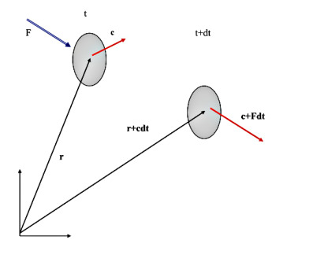

# Sıvı ve Gaz Mekaniği - 2

### Maxwell-Boltzmann Hız Dağılım Fonksiyonu

Bir kap içine sıkıştırılmış bir gazın davranışını tanımlamaya
çalıştığınızı hayal edin. Makroskopik düzeyde sistem sakin ve durağan
görünür; sıcaklık, basınç ve hacim gibi birkaç kararlı özellikle
karakterize edilir. Yine de bu sakin yüzeyin altında kaotik bir
mikro-alem yatar. Oda sıcaklığında bir metreküp hava, yaklaşık
$10^{25}$ adet bireysel molekül içerir. Bu parçacıkların her biri,
komşularıyla saniyede milyarlarca kez çarpışarak, sürekli enerji
alışverişi yaparak ve yön değiştirerek, kesintisiz ve çılgın bir
hareket halindedir.

Klasik fizik perspektifinden bakıldığında, bu moleküllerin her biri
Newton'un hareket yasalarına uymaktadır. Sonsuz hesaplama gücüne sahip
mükemmel bir dünyada, tüm $10^{25}$ parçacık için hareket
denklemlerini yazarak konumlarını ve hızlarını zaman içinde takip
etmeyi hayal edebiliriz. Deterministik veya yörünge tabanlı tanımlama
olarak bilinen bu yaklaşım, moleküler dinamik simülasyonlarının
temelidir. Ancak gerçek, makroskopik bir gaz hacmi için bu hayal
matematiksel ve fiziksel bir imkânsızlıktır. Veri miktarı inanılmaz
derecede büyüktür; üstelik daha da kötüsü, sistem aşırı kaotik bir
duyarlılık sergilemektedir. Yalnızca tek bir molekülün başlangıç
konumu veya hızındaki mikroskopik bir belirsizlik, art arda
gerçekleşen çarpışmalar yoluyla üstel biçimde büyüyerek, bir
mikrosaniyenin çok küçük bir kesrinde her türlü kesin uzun vadeli
hesabı tamamen anlamsız kılacaktır.

İstatistiksel Bakışa Geçiş

Bireysel yörüngeleri takip edemediğimiz için temel hedefimizi
değiştirmemiz gerekir. Belirli bir hıza hangi molekülün sahip olduğunu
bilme yolundaki umutsuz arayıştan vazgeçeriz ve bunun yerine çok daha
güçlü bir soru sorarız: Ortalama olarak kaç molekül, belirli bir
aralıktaki hızlara sahiptir? Bu paradigma değişimi bizi deterministik
takipten istatistiksel mekaniğin alanına taşır.

Bunu yapmak için bir hız dağılım fonksiyonu $f(\vec{v})$
tanımlarız. Ayrık bir sayı listesi yerine, hızı sürekli bir manzara
olarak ele alırız. $f(\vec{v})$ fonksiyonu bir olasılık yoğunluğu
olarak işlev görür; herhangi bir andaki anlık görüntüde, bir molekülün
belirli bir hızda belirli bir yönde hareket etme olasılığını
haritalandırır. Dikkat çekici biçimde, bireysel yörüngeler kaotik ve
öngörülemez olsa da bu hızların toplu dağılımı inanılmaz derecede
kararlıdır. Termal denge durumunda, sayısız çarpışmanın
rastgeleleştirici etkisi tam bir kaos yaratmaz; bunun yerine sistemi
son derece düzenli, öngörülebilir ve matematiksel olarak kesin bir hız
dağılımına doğru iter. Bu dağılım fonksiyonuna hâkim olarak, tek bir
molekülün durumunu hiçbir zaman bilmemize gerek kalmadan makroskopik
özellikleri —bir duvara uygulanan basınç, bir delikten geçiş hızı ya
da gazın ortalama kinetik enerjisi gibi— hesaplama olanağı elde
ederiz. Bu giriş, James Clerk Maxwell'in 1860'ta yanıtlamaya çalıştığı
soruyu ortaya koyar: bu kararlı dağılım manzarasının matematiksel
şekli nasıl olmalıdır?

Problem Uzayının Tanımlanması: Hız Uzayı

Termal denge halindeki klasik bir makroskopik gazı ele
alalım. Bireysel moleküller sürekli hareket etmekte, çarpışmakta ve
yön değiştirmektedir. Her bir parçacığı takip edemediğimiz için, üç
boyutlu bir sürekli olasılık yoğunluk fonksiyonu tanımlarız:

$$f(v_x, v_y, v_z)$$

Bu fonksiyon, bir molekülün $\vec{v} = (v_x, v_y, v_z)$ hız vektörüne
sahip olma olasılığını bize verir.

Çözümü izole etmek için yalnızca iki temel fiziksel simetriye
dayanırız. Başka hiçbir şey varsaymayız.

Aksiyom 1: Eşyönlülük (Istotrophy), yani uzayın tercih ettiği bir yön
olmaması.

Gaz denge halindeyse ve üzerine tercihli olarak etki eden dış alanlar
(yerçekimi gibi) yoksa, bir molekülün hareket ettiği yön genel
olasılığını değiştiremez. Dağılım yalnızca hızın mutlak büyüklüğüyle
ilgilenmelidir:

$$v = \sqrt{v_x^2 + v_y^2 + v_z^2}$$

Bu nedenle, 3 boyutlu hız dağılımı yalnızca hızın bir fonksiyonuna
indirgenir:

$$f(v_x, v_y, v_z) = f(v)$$

Aksiyom 2: İstatistiksel Bağımsızlık

Bir molekülün x eksenindeki hızının, y veya z eksenlerindeki hız
üzerinde sihirli bir etki ya da kısıtlama yaratmadığını varsayarız. Bu
bileşenler birbirine dik ve bağımsız olduğundan, ortak olasılık üç
bağımsız 1 boyutlu dağılımın çarpımına ayrışmalıdır:

$$f(v_x, v_y, v_z) = \phi(v_x)\phi(v_y)\phi(v_z)$$

Not: Gösterimi sade tutmak ve fonksiyonları birbirine karıştırmamak
için, tek bileşenli 1 boyutlu dağılımı temsil etmek üzere $\phi$,
toplam 3 boyutlu hız dağılımını temsil etmek için ise $f$
kullanıyoruz.

Temel Fonksiyonel Denklem

Aksiyom 1 ile Aksiyom 2'yi eşitlemek bize başlangıç matematiksel
manzaramızı verir:

$$f(v) = \phi(v_x)\phi(v_y)\phi(v_z)$$

Fonksiyonel Denklemi Çözme (Türev Numarası)

Birleşik bir değişkene bağlı bir fonksiyonun, ayrı bağımsız
değişkenlerin çarpımına eşit olduğu bir denklemimiz var. Bunları
birbirinden ayırmak için her iki tarafı da tek bir bileşen olan
$v_x$'e göre türev alırız [5].

Sol tarafta zincir kuralını kullanarak:

$$
\frac{\partial f(v)}{\partial v_x} =
\frac{\ud f(v)}{\ud v} \cdot \frac{\partial v}{\partial v_x}
$$

$v = (v_x^2 + v_y^2 + v_z^2)^{1/2}$ olduğundan, kısmi türevi şudur:

$$
\frac{\partial v}{\partial v_x} = \frac{1}{2}(v_x^2 + v_y^2 + v_z^2)^{-1/2} \cdot 2v_x = \frac{v_x}{v}
$$

Bunu sol tarafa geri koyarak ve bağımsız sağ tarafı $v_x$'e göre türev
alarak ($v_y$ ve $v_z$'yi sabit kabul ederek):

$$f'(v) \cdot \frac{v_x}{v} = \phi'(v_x)\phi(v_y)\phi(v_z)$$

Bunu düzenlemek için her iki tarafı da orijinal fonksiyonel
denklemimiz olan $f(v) = \phi(v_x)\phi(v_y)\phi(v_z)$'ye böleriz:

$$\frac{f'(v) \cdot \frac{v_x}{v}}{f(v)} = \frac{\phi'(v_x)\phi(v_y)\phi(v_z)}{\phi(v_x)\phi(v_y)\phi(v_z)}$$

Sağ taraftaki eşleşen terimleri sadeleştiririz:

$$\frac{f'(v)}{f(v) \cdot v} \cdot v_x = \frac{\phi'(v_x)}{\phi(v_x)}$$

Son olarak her iki tarafı $v_x$'e böleriz:

$$\frac{f'(v)}{f(v) \cdot v} = \frac{\phi'(v_x)}{\phi(v_x) \cdot v_x}$$

Değişkenlerin Ayrılmasının Gücü

Az önce izole ettiğimiz denkleme dikkatle bakın:

$$\underbrace{\frac{f'(v)}{f(v) \cdot v}}_{\text{Yalnızca } v\text{'ye bağlı}} = \underbrace{\frac{\phi'(v_x)}{\phi(v_x) \cdot v_x}}_{\text{Yalnızca } v_x\text{'e bağlı}}$$

Sol taraf $v$'yi içermektedir ($v_y$ ve $v_z$'yi de kapsar). Sağ taraf ise açıkça yalnızca $v_x$'e bağlıdır.

$v_x$'i tamamen sabit tutarsanız ve $v_y$'yi değiştirirseniz, sağ
taraf değişemez. Dolayısıyla sol taraf da değişemez. $v$'nin bir
fonksiyonunun tüm değerler için bir $v_x$ fonksiyonuyla özdeş biçimde
eşit olmasının tek yolu, her iki tarafın da aynı evrensel sabite eşit
olmasıdır.

Bu ayırma sabitini $-2\alpha$ olarak adlandıralım (eksi işareti,
matematiğin sonsuz patlamalar yerine bir denge durumu üretmesini
sağlar):

$$\frac{\phi'(v_x)}{\phi(v_x) \cdot v_x} = -2\alpha$$

Yeniden düzenleyince bize birinci mertebeden ayrılabilir bir basit
(ordinary) diferansiyel denklem verir:

$$\frac{\phi'(v_x)}{\phi(v_x)} = -2\alpha v_x$$

Her iki tarafı $v_x$'e göre entegre ederiz:

$$\int \frac{1}{\phi(v_x)} \ud\phi(v_x) = \int -2\alpha v_x \ud v_x$$

$$\ln \phi(v_x) = -\alpha v_x^2 + C$$

1 boyutlu dağılımı çözmek için her iki tarafın üstelini alırız:

$$\phi(v_x) = e^C \cdot e^{-\alpha v_x^2}$$

$A = e^C$ (normalizasyon sabitimiz) olsun:

$$\phi(v_x) = A e^{-\alpha v_x^2}$$

Uzay esyönlü olduğundan, $y$ ve $z$ dağılımları bunu mükemmel biçimde
yansıtır:

$$\phi(v_y) = A e^{-\alpha v_y^2}, \quad \phi(v_z) = A e^{-\alpha v_z^2}$$

Bilinmeyenlerin Çözümü ($A$ ve $\alpha$)

Başarıyla bir Gauss şekli türettik, ancak $A$ ve $\alpha$ sabitleri
hâlâ soyuttur. Bunları fiziksel kısıtlamaları kullanarak hesaplamamız
gerekir.

Kısıtlama 1: Toplam Olasılık ($A$'nın bulunması)

Bir molekülün hız uzayında bir yerde bulunması gerekir. Bu nedenle,
olasılığı $-\infty$'dan $+\infty$'a kadar tüm olası hızlar üzerinden
entegre etmek kesinlikle 1'e eşit olmalıdır.

$$\int_{-\infty}^{\infty} \phi(v_x) \ud v_x = 1 \implies A \int_{-\infty}^{\infty} e^{-\alpha v_x^2} \ud v_x = 1$$

Standart Gauss integral özdeşliğini $\int_{-\infty}^{\infty} e^{-ax^2} \ud x = \sqrt{\frac{\pi}{a}}$ kullanarak:

$$A\sqrt{\frac{\pi}{\alpha}} = 1 \implies A = \sqrt{\frac{\alpha}{\pi}}$$

1 boyutlu dağılımımız güncellenir:

$$\phi(v_x) = \left(\frac{\alpha}{\pi}\right)^{1/2} e^{-\alpha v_x^2}$$

Kısıtlama 2: Ortalama Kinetik Enerji ($\alpha$'nın bulunması)

Klasik termodinamikten, tek bir eksen boyunca bir molekülün ortalama
öteleme kinetik enerjisinin sıcaklıkla şu şekilde ilişkili olduğunu
biliriz:

$$\langle E_x \rangle = \frac{1}{2}m\langle v_x^2 \rangle = \frac{1}{2}kT$$

Burada $k$ Boltzmann sabiti ve $T$ sıcaklıktır. Bu, $\langle v_x^2
\rangle$ beklenti değerinin $\frac{kT}{m}$'ye eşit olması gerektiği
anlamına gelir.

Olasılık fonksiyonumuzu kullanarak beklenti değerini hesaplayalım:

$$\langle v_x^2 \rangle = \int_{-\infty}^{\infty} v_x^2 \cdot \phi(v_x) \ud v_x = \left(\frac{\alpha}{\pi}\right)^{1/2} \int_{-\infty}^{\infty} v_x^2 \, e^{-\alpha v_x^2} \ud v_x$$

$\int_{-\infty}^{\infty} x^2 e^{-ax^2} \ud x = \frac{1}{2a}\sqrt{\frac{\pi}{a}}$ Gauss özdeşliğini kullanarak:

$$\langle v_x^2 \rangle = \left(\frac{\alpha}{\pi}\right)^{1/2} \cdot \left(\frac{1}{2\alpha}\sqrt{\frac{\pi}{\alpha}}\right) = \frac{1}{2\alpha}$$

Şimdi türettiğimiz beklenti değerini termodinamik gerçeğimizle eşitleriz:

$$\frac{1}{2\alpha} = \frac{kT}{m} \implies \alpha = \frac{m}{2kT}$$

$\alpha$'yı $A$ denklemimize geri koyabiliriz:

$$A = \left(\frac{m}{2\pi kT}\right)^{1/2}$$

Tam 3 Boyutlu Hız Dağılım Fonksiyonunun Oluşturulması

Üç 1 boyutlu dağılımı çarparak ($\phi(v_x)\phi(v_y)\phi(v_z)$) toplam
3 boyutlu hız dağılımını elde ederiz:

$$f(v_x, v_y, v_z) = \left(\frac{m}{2\pi kT}\right)^{3/2} e^{-\frac{m(v_x^2 + v_y^2 + v_z^2)}{2kT}} = \left(\frac{m}{2\pi kT}\right)^{3/2} e^{-\frac{mv^2}{2kT}}$$

Hız Vektörlerinden Tek Sayısal Hıza Geçiş

Şu an, $f(v_x, v_y, v_z) \ud v_x \ud v_y \ud v_z$, hız
uzayındaki sonsuz küçük bir kutu içinde bir molekül bulma olasılığını
temsil etmektedir. Ancak biz, yönden bağımsız olarak hız (v)
dağılımını istiyoruz.

Geometrik olarak, aynı hıza $v$ sahip tüm noktalar, $v$ yarıçaplı bir
kürenin yüzeyini oluşturur. Hızdaki $\ud v$ artışı, bu kürenin
etrafına ince bir küresel kabuk eklemeye karşılık gelir [2, sf. 20].

Bu ince kabuğun hız uzayındaki hacmi, yüzey alanı ile kalınlığının
çarpımına eşittir: $4\pi v^2 \ud v$.

Bu nedenle, nihai tek sayı hız dağılımı $F(v)$'yi elde etmek için 3
boyutlu hız olasılık yoğunluğunu bu geometrik kabuk hacim çarpanıyla
çarparız:

$$F(v) \ud v = f(v) \cdot 4\pi v^2 \ud v$$

$$F(v) = 4\pi \left(\frac{m}{2\pi kT}\right)^{3/2} v^2 \, e^{-\frac{mv^2}{2kT}}$$

Bu, sıfır varsayımdan hareketle, saf kalkülüs ve temel termodinamik
ilişkiler kullanılarak açıkça inşa edilmiş, tamamlanmış
Maxwell-Boltzmann hız dağılım fonksiyonudur.

### Boltzmann Taşıma Denklemi

Sert küresel parçacıklardan oluşan ve büyük hızlarla hareket eden
seyrek bir gaz düşünelim. Parçacıkların etkileşimlerini yalnızca
elastik çarpışmalarla sınırlandırıyoruz. Varsayım olarak herhangi bir
anda her bir parçacığın konum vektörünü ve hızını bilmek mümkün
olabilir. Bu tür bilgi, sistemin tam dinamik durumunu verir ve klasik
mekanikle birlikte tüm gelecekteki durumların tam olarak tahmin
edilmesine olanak tanır [1]. Ancak gerçekçi bir simülasyonda bu tür
bir takip, muazzam bilişim kaynakları gerektirir.

Ama alternatif olarak sistemi bir *dağılım* fonksiyonu $f(r, c, t)$
ile tanımlayabiliriz. Burada dağılım, koordinatların konum, hız
vektörleri ve zamandan oluştuğu bir "faz uzayı"nda yer
alır. İstatistiksel Mekanik, $f(r, c, t)$ dağılımının belirli bir
konum ve hıza sahip herhangi bir molekülü bulma olasılığını verdiği
istatistiksel bir imkan sunar.

Not: Elbette dağılım fonksiyonları, temel olasılıkta olduğu gibi,
belirli bir $r, c, t$ değeri için tek bir olasılık vermiyor, gerçek
olasılıklar için bölgelerden söz ederiz (faz uzayının); örneğin $r$
ile $r+\Delta r$ arasındaki bir alan. $[r, r + \Delta r]$ hacim
elemanında yer alan ve hızları $[c, c + \Delta c]$ aralığında olan
$f(c, r, t)\Delta c \Delta r$ kadar molekül bulunduğunu
söyleyebiliriz. Hızlar $c$ için "aralık" ifadesi garip gelebilir;
ancak ilgilendiğimiz faz uzayında durum tam olarak budur. Diyelim ki
$(2, 1)$ noktasında ve çevresindeki $\Delta r$ içinde yalnızca $c =
(3, 4)$ hızına sahip tek bir molekül yoktur. Orada bir "bulut" vardır.

- Bazı moleküllerin $c = (3, 4)$ hızı olabilir.
- Bazılarının $c = (-1, 2)$ hızı olabilir.
- Bazılarının $c = (5, 0)$ hızı olabilir.

$f(r, c, t)\Delta r$ fonksiyonu, o tek noktadaki her olası hız vektörü
için sayıyı verir.

Kuvvet Uygulamak, Dinamikleri Değiştirmek

Şimdi bu sisteme $F$ ile temsil edilen bir kuvvet uygulandığında ne
olduğunu düşünelim. Bu kuvvet bir alan niteliğinde olacaktır; her
yerde hissedilen $F(r)$ kuvvetidir. $t$ anında mevcut bir hız da
vardır. Şimdilik moleküller arasındaki iç çarpışmaları göz ardı
edeceğiz.

Bu değişiklikleri $f$ üzerinde yansıtmamız gerekir. Hareket eden bir
parçacığın konumu $x$ ve hızı $c$ zamanın $t$ açık birer fonksiyonu
olduğundan, dağılım fonksiyonu $f(x(t), c(t), t)$ olarak yazılabilir.

$$\ud f = \frac{\partial f}{\partial t}\ud t + \frac{\partial f}{\partial r}\ud r + \frac{\partial f}{\partial c}\ud c$$

$f$'nin zamanla doğrudan nasıl değiştiğini (şimdilik dış kuvvet
olmaksızın) öğrenmek istiyorsak, standart çok değişkenli zincir
kuralını kullanarak toplam türevini alırız. $f$'nin zamanla değişen üç
bileşeni olduğundan (konum, hız ve zamanın kendisi), diferansiyel
hesabın zincir kuralı bunu üç temiz parçaya ayırır:

$$\frac{\ud f}{\ud t} = \frac{\partial f}{\partial t} + \frac{\partial f}{\partial r}\frac{\ud r}{\ud t} + \frac{\partial f}{\partial c}\frac{\ud c}{\ud t}$$

Daha sonra uygulanan $F$ kuvvetini hesaba katarak bu takip
türevlerinin gerçek fiziksel tanımlarını yerine koyarız.

Zaman: $\frac{\ud t}{\ud t}$ yalnızca 1'dir.

Hız: $\frac{\ud x}{\ud t}$, hızın $(v)$ tanımıdır.

İvme: $\frac{\ud c}{\ud t}$, ivmenin tanımıdır; Newton'un İkinci
Yasası bunu $\frac{F}{m}$ olarak tanımlar.

Bu değerleri doğrudan zincir kuralına koyarak şunu elde ederiz:

$$
= \frac{\partial f}{\partial t} +
c \cdot \frac{\partial f}{\partial x} +
\frac{F}{m} \cdot \frac{\partial f}{\partial c}
$$

Yukarıdaki denklem Boltzmann taşıma denklemi olarak bilinir [2,
sf. 27]. Vektör gösterimi ile:

$$
\frac{\ud f}{\ud t} = \frac{\partial f}{\partial t} +
c \cdot \frac{\partial f}{\partial r} +
\frac{F}{m}\frac{\partial f}{\partial c}
\tag{1}
$$

Bu formülasyon çarpışma olmadığını varsaydı. Bu durumda, $\ud f/\ud t$
aracılığıyla değişimden sonra yeni konumlarındaki $f(r, c, t)$
parçacıklarını takip ettiğimizde dağılım tamamen aynı
kalırdı. Dolayısıyla $(1)$ için $\ud f/\ud t = 0$ diyebiliriz. Ancak
çarpışmalar söz konusu olsaydı, bunu formülasyona sağ tarafta bir
$\Omega$ aracılığıyla dahil etmemiz gerekirdi:

$$
\frac{\partial f}{\partial t} + c \cdot \frac{\partial f}{\partial r} + \frac{F}{m}\frac{\partial f}{\partial c} = \Omega
$$

Boltzmann Taşıma Denklemi için Alternatif Yollar

Denklem (1)'e ulaşmanın başka bir yolu daha vardır. Birim kütleli bir
gaz molekülüne etki eden dış bir $F$ kuvveti, molekülün hızını $c$'den
$c + F\ud t$'ye ve konumunu $r$'den $r + c \ud t$'ye
değiştirecektir. Dış kuvvet uygulanmadan önceki $f(r, c, t)$ molekül
sayısı, moleküller arasında hiçbir çarpışma gerçekleşmemesi halinde,
bozulma sonrasındaki molekül sayısı olan $f(r + c\ud t,\, c + F\ud
t,\, t + \ud t)$'ye eşittir.

[3, sf. 46] şöyle ifade eder: Her molekülün, $r$ ve $t$'nin bir
fonksiyonu olabilen ancak $c$'nin fonksiyonu olmayan dış bir $mF$
kuvvetine maruz kaldığı bir gazı ele alalım. $t$ ile $t + \ud t$
zamanları arasında, başka bir molekülle çarpışmayan herhangi bir
molekülün $c$ hızı $c + F\ud t$'ye, konum vektörü $r$ ise $r +
c\ud t$'ye değişecektir. $t$ anında $[r, r + \ud r]$ hacim
elemanında yer alan ve hızları $[c, c + \ud c]$ aralığında olan $f(c,
r, t)\ud c\ud r$ kadar molekül vardır. $\ud t$ aralığından sonra,
çarpışmaların etkisi göz ardı edilebilseydi, aynı moleküller ve
yalnızca onlar, $[r + c\ud t,\, r + c\ud t + \ud r]$ hacmini
dolduran ve hızları $[c + F\ud t,\, c + F\ud t + \ud c]$
aralığında olan kümeyi oluştururdu.

Sonuç olarak şunu elde ederiz:

$$f(c + F\ud t,\, r + c\ud t,\, t + \ud t) = f(c, r, t)\ud c\ud r = 0$$

Zaman Diferansiyelini İzole Etmek: Cebirsel değişime başlamak için
denklemin her iki tarafını toplam diferansiyel hacim elemanı $\ud
c\ud r\ud t$'ye böleriz. $\ud c$ ve $\ud r$ her iki tarafta çarpan
olarak göründüğünden hemen sadeleşir:

$$\frac{f(c + F\ud t,\, r + c\ud t,\, t + \ud t) - f(c, r, t)}{\ud t} = 0$$

Şimdi, sol tarafın $\ud t \to 0$ limitini değerlendirmemiz
gerekir. Bunu yapmak için kaydırılmış $f(c + F\ud t,\, r + c\ud
t,\, t + \ud t)$ fonksiyonunu açmamız gerekiyor. Çok değişkenli Taylor
açılımı ile bunu yapabiliriz. Taban koordinatlarından biraz uzakta
kaydırılmış bir fonksiyonu değerlendirmek için birinci mertebeden çok
değişkenli Taylor serisi açılımı lazım.

Bağımsız değişkenlere $(x_1, x_2, x_3, \ldots)$ bağlı genel bir $f$
fonksiyonu için, $(a_1, a_2, a_3, \ldots)$ taban noktası etrafındaki
resmi birinci mertebe Taylor açılımı açık koordinat farklarıyla şöyle
yazılır:

$$f(x_1, x_2, \ldots) \approx f(a_1, a_2, \ldots) + \frac{\partial f}{\partial x_1}(x_1 - a_1) + \frac{\partial f}{\partial x_2}(x_2 - a_2) + \ldots$$

Dağılım fonksiyonumuz $f$, yedi ayrı değişkene bağlı olduğundan — üç
konum koordinatı $(x, y, z)$, üç hız koordinatı $(u, v, w)$ ve zaman
$(t)$ — resmi ders kitabı açılımı şöyle görünür:

$$f(x,y,z,u,v,w,t) \approx f(a_x,a_y,a_z,a_u,a_v,a_w,a_t) + \frac{\partial f}{\partial x}(x-a_x) + \frac{\partial f}{\partial y}(y-a_y) + \frac{\partial f}{\partial z}(z-a_z) + \frac{\partial f}{\partial u}(u-a_u) + \frac{\partial f}{\partial v}(v-a_v) + \cdots$$

Fiziksel sistemimizde, taban noktamızı ve kaydırılmış değerlendirme
noktamızı oluşturmak için koordinatları eşleştiririz:

- Taban Noktası $(a_x, a_y, \ldots)$: Başlangıç durumu $(x, y, z, u, v, w, t)$
- Değerlendirme Noktası $(x, y, \ldots)$: $\ud t$ süresinden sonra kaydırılmış durum, yani $(x + u\ud t,\, y + v\ud t,\, z + w\ud t,\, u + F_x\ud t,\, v + F_y\ud t,\, w + F_z\ud t,\, t + \ud t)$

Şimdi zorunlu ders kitabı çıkarma terimlerinin $(x - a_x)$, $(y -
a_y)$ vb. fiziksel büyüklerimize nasıl dönüştüğüne bakın:

- Konum $x$ çıkarması: $(x + u\ud t) - x = u\ud t$
- Konum $y$ çıkarması: $(y + v\ud t) - y = v\ud t$
- Konum $z$ çıkarması: $(z + w\ud t) - z = w\ud t$
- Hız $u$ çıkarması: $(u + F_x\ud t) - u = F_x\ud t$
- Hız $v$ çıkarması: $(v + F_y\ud t) - v = F_y\ud t$
- Hız $w$ çıkarması: $(w + F_z\ud t) - w = F_z\ud t$
- Zaman $t$ çıkarması: $(t + \ud t) - t = \ud t$

Bu tam varyasyonları resmi Taylor açılımı formülüne geri koyarak şunu elde ederiz:

$$f(c+F\ud t,\, r+c\ud t,\, t+\ud t) \approx f(c,r,t) + \frac{\partial f}{\partial x}(u\ud t) + \frac{\partial f}{\partial y}(v\ud t) + \frac{\partial f}{\partial z}(w\ud t) + \frac{\partial f}{\partial u}(F_x\ud t) + \frac{\partial f}{\partial v}(F_y\ud t) + \frac{\partial f}{\partial w}(F_z\ud t) + \frac{\partial f}{\partial t}(\ud t) + O(\ud t^2)$$

Not: $O(\ud t^2)$, $\ud t^2$ veya daha yüksek mertebeden terimlerle
orantılı küçük yüksek mertebe matematiksel terimleri temsil eder;
limit alınırken bu terimler güvenle sıfıra gider.

Yerine Koyma ve Cebirsel Sadeleştirme: Şimdi yeni genişletilmiş
ifadeyi 1. Adımdaki denge denkleminin payına koyarız:

$$\frac{\left[f(c,r,t) + \frac{\partial f}{\partial t}\ud t + \left(u\frac{\partial f}{\partial x} + v\frac{\partial f}{\partial y} + w\frac{\partial f}{\partial z}\right)\ud t + \left(F_x\frac{\partial f}{\partial u} + F_y\frac{\partial f}{\partial v} + F_z\frac{\partial f}{\partial w}\right)\ud t + O(\ud t^2)\right] - f(c,r,t)}{\ud t} = 0$$

Payın başındaki özgün $f(c, r, t)$ dağılım fonksiyonu değerinin payın
sonundaki $-f(c, r, t)$ ile mükemmel biçimde sadeleştiğine dikkat
edin:

$$\frac{\frac{\partial f}{\partial t}\ud t + \left(u\frac{\partial f}{\partial x} + v\frac{\partial f}{\partial y} + w\frac{\partial f}{\partial z}\right)\ud t + \left(F_x\frac{\partial f}{\partial u} + F_y\frac{\partial f}{\partial v} + F_z\frac{\partial f}{\partial w}\right)\ud t + O(\ud t^2)}{\ud t} = 0$$

Paydaki $\ud t$'ye böleriz; paydaki kalan her terim en az bir $\ud t$
çarpanı taşımaktadır:

$$= \frac{\partial f}{\partial t} + u\frac{\partial f}{\partial x} + v\frac{\partial f}{\partial y} + w\frac{\partial f}{\partial z} + F_x\frac{\partial f}{\partial u} + F_y\frac{\partial f}{\partial v} + F_z\frac{\partial f}{\partial w} + O(\ud t)$$

Limiti Uygulamak: Son olarak $\ud t$'yi sıfıra götürürüz ($\ud t \to
0$).

$O(\ud t)$ içine hapsolmuş herhangi bir yüksek dereceli terimi hâlâ
bir $\ud t$ çarpanı taşıdığından tam olarak $0$'a iner. Birinci
mertebeden türevler ise $\ud t$ terimleri zaten temiz biçimde
bölündüğünden hiç etkilenmez.

Bu, klasik genişletilmiş Boltzmann Denklemini geride bırakarak
cebirsel geçişi tamamlar:

$$= \frac{\partial f}{\partial t} + u\frac{\partial f}{\partial x} + v\frac{\partial f}{\partial y} + w\frac{\partial f}{\partial z} + F_x\frac{\partial f}{\partial u} + F_y\frac{\partial f}{\partial v} + F_z\frac{\partial f}{\partial w}$$

$$= \frac{\partial f}{\partial t} + c \cdot \frac{\partial f}{\partial r} + F \cdot \frac{\partial f}{\partial c}$$

Kaynaklar

[1] Sukop, *Lattice Boltzmann Modeling*

[2] Mohamad, *Lattice Boltzmann Method with Computer Codes, 2nd Edition*

[3] Chapman, *The Mathematical Theory of Non-Uniform Gases*

[4] Gibiansky, <a href="https://www.gibiansky.com/blog/physics/lattice-boltzmann-method/index.html">Lattice Boltzmann Method</a>

[5] Rodrigues, <a href="https://www.researchgate.net/publication/388525760_Deriving_the_Maxwell-Boltzmann_speed_distribution_function">Deriving the Maxwell-Boltzmann speed distribution function</a>
