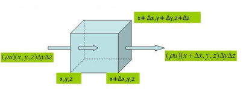
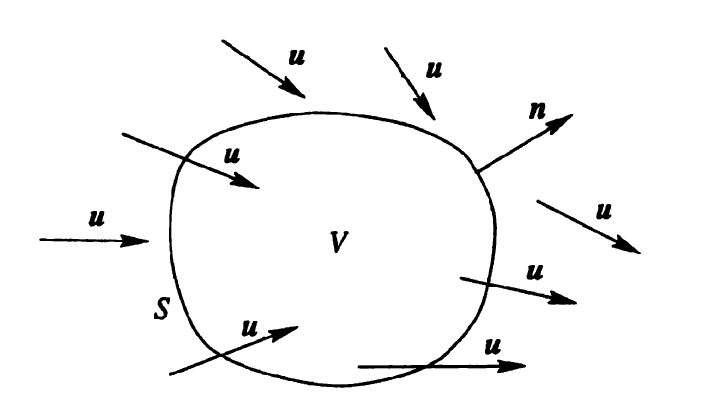
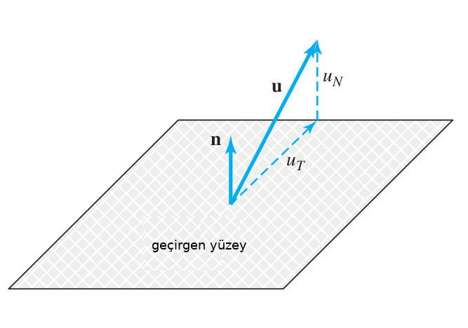

# Sıvı ve Gaz Mekaniği - 2

Kütle Muhafazası, Süreklilik Formülü (Continuity Equation)

Ufak bir kutu ya da hacim ögesi hayal edelim [13, 16 sf. 50, 17 sf. 10, 19 sf. 404, 21
  sf 95, 20 sf. 9], kenarları çok küçük $\Delta x$, $\Delta y$, $\Delta z$
boyutlarında, ve bu kutu uzayda sabitlenmiş, içinden sıvı akıyor. Sabitlenmiş
bir noktada olanlara baktığımız için bu Euler bakış açısı, detaylarını ileride
göreceğiz. Neyse, şimdi sadece $x$ yönündeki kütle değişimine bakalım,

Sıvının akış hızı $u(x,y,z) = (u,v,w)$, ve yoğunluğu $\rho$ olsun. Birim zamanda
içeri akan net kütleyi giren eksi çıkan kütle olarak hesaplayacağız. Bu zamanda
$x$ yönünde akış kenarları $\Delta y$, $\Delta z$ ve $u(x,y,z)$ (ufak dik duran
bir pizza kutusu gibi) olan bir kesit düşünebilir. Bu birim zamandaki akış
hacmi.  Onu yoğunluk ile çarpınca kütle elde edilir, aynı şeyi $x + \Delta x$
noktası için de yaparız, ve farklarını alırız,

$$
\rho(x,y,z)u(x,y,z)\Delta y \Delta z -
\rho(x+\Delta x,y,z) u(x+\Delta x,y,z)\Delta y \Delta z
$$

Üstteki formüldeki bir bölüm bir kısmi türevi andırıyor, $\Delta x$ ile bölüp
çarpsak,

$$
= \frac{\rho(x,y,z)u(x,y,z)}{\Delta x}\Delta x \Delta y \Delta z -
\frac{\rho(x+\Delta x,y,z) u(x+\Delta x,y,z)}{\Delta x} \Delta x \Delta y \Delta z
$$

Evet iki bölme işlemini yaklaşıksal kısmi türev olarak görebiliriz,

$$
\approx -\frac{\partial (\rho u) }{\partial x} \Delta x \Delta y \Delta z
$$

Benzer işlemi tüm eksenler için ayrı ayrı yapsak onlar için de kısmi türevler
elde ederdik, o zaman tüm eksenler üzerinden olan değişim, ve farksal hacmi
$\Delta V = \Delta x \Delta y \Delta z$ olarak göstererek,

$$
\left(
-\frac{\partial (\rho u) }{\partial x} 
-\frac{\partial (\rho u) }{\partial y} 
-\frac{\partial (\rho u) }{\partial z} 
\right) \Delta V
$$

Üstteki gradyan vektörsel olarak daha rahat ifade edilebilir,

$$
= -\nabla \cdot (\rho \bar{u} ) \Delta V
$$

Birim zamandaki kütle artışı buna eşit. Üstteki ifadeyi farklı bir açıdan, birim
zamandaki kütle (yoğunluk çarpı hacim) artışı olarak, şöyle de belirtebilirdik,

$$
\frac{\partial }{\partial t} (\rho \Delta V) 
$$

Bu formül iki üstteki formül ile eşit olmalı. Ayrıca her iki tarafta $\Delta V$
var, çıkartılabilir, zaten sabit bir hacim, sonuç,

$$
\frac{\partial \rho}{\partial t}  = -\nabla \cdot (\rho \bar{u} )
$$

Literatürde çoğunlukla şu formda gösterilir,

$$
\frac{\partial \rho}{\partial t}  + \nabla \cdot (\rho \bar{u} ) = 0
\tag{1}
$$

Bu denkleme süreklilik formülü (continuity equation) ya da kütle muhafaza kanunu
(mass convervation law) ismi veriliyor.

Bilinen Vektör Calculus eşitliğinden hareketle

$$
\frac{\partial \rho}{\partial t}  +
\bar{u} \cdot \nabla \rho +
\rho \cdot \nabla \bar{u} = 0
$$

Eğer bir sıvı sıkıştırılamaz (incompressible) ise, ki pek çok sıvı dinamiği
simülasyonlarında böyle olduğu kabul edilir, o zaman $\rho = sabit$ demektir,
$\frac{\partial \rho}{\partial t} = 0$ olur, değişim yok, süreklilik
formülünden geri kalan

$$
\nabla \cdot \bar{u} = 0
\tag{2}
$$

olacaktır. $\nabla \cdot$ sembolünün uzaklaşım, ya da $\mathrm{div}$ olduğunu
hatırlayalım, ve uzaklaşım yaklaşık olarak bir bölgeye giren eksi çıkan akışı
gösterir, ve sıkıştırılamaz durumda uzaklaşımın sıfır olması mantıklı.

$\rho \bar{u}$ büyüklüğüne kütle akışı diyebiliriz, kütlenin ne hızla aktığını
gösterir. Uzaklaşım, akımın bir bölgede nasıl yayıldığını gösteriyorsa (bazı
durumlarda sanki orada bir su / sıvı kaynağı varmış gibi) o zaman süreklilik
formülünün fiziksel olarak şunu söylüyor denebilir; bir sıvının bir bölgedeki
yoğunluk değişimi o bölgeye giren ve çıkan akımların sonucudur.

Uzaklaşım Teorisi İle Muhafaza Kanunları

Kütle muhafaza kanununa değişik bir yönden erişmek mümkün. $\rho(r, t)$
yoğunluğuna sahip bir sıvı olsun, ve bu sıvının akışını $u(r, t)$ ile temsil
ediyoruz, bu bir hız, akış alanı. Şimdi uzayda sabitlenmiş rasgele bir $V$ hacmi
düşünelim, yüzeyi $S$ ve her noktadaki normali $n$, ki $r,n$ vektör değerleri. O
zaman $V$ içindeki sıvının toplam kütlesi $\rho$'nun entegrali olacaktır [14, sf. 86],

$$
V \textrm{ içindeki kütle} = \iiint_V \rho \mathrm{d} v
$$

Kütlenin bu hacme giriş oranı nedir? Bu oran akış ve hacmin yüzeyi üzerinden bir
yüzey entegrali olmalı,

$$
V \textrm{ hacmine kütle giriş oranı} = - \iint_S \rho u \cdot n \mathrm{d} S
$$

Eksi işareti var çünkü normal yüzeyden dışarı doğru işaret ediyor.

Şimdi kütlenin muhafaza edilme fiziksel şartını uyguluyabiliriz. $V$ içindeki
kütle değişim oranı kütlenin $V$'ye giriş oranına eşit olmalı diyoruz. İlk ifade
için kütle hesabının zaman üzerinden türevini alıyoruz, ve ikinci ifadeye
eşitliyoruz,

$$
\frac{\mathrm{d}}{\mathrm{d} t}  \iiint_V \rho \mathrm{d} V = - \iint_S \rho u \cdot n \mathrm{d} S
$$

Uzaklaşım Teorisi ile eşitliğin sağındaki yüzey entegrali bir hacim entegraline
çevirilebilir. Ayrıca eşitliğin solundaki türev ve entegral sırası arasında
değiş tokuş olabilir,

$$
\iiint_V \frac{\partial \rho}{\partial t} \mathrm{d} V = - \iiint_V \nabla \cdot (\rho u ) \mathrm{d} V
$$

Türev entegral içine geçince bir kısmi türev haline geldi çünkü $\rho$ hem zaman
hem yere bağımlı bir fonksiyondur.

Üstteki iki entegral artık birleştirilebilir,

$$
\iiint_V \frac{\partial \rho}{\partial t} + \nabla \cdot (\rho u ) \mathrm{d} V = 0
$$

Dikkat edersek bu hesap $V$ üzerinde hiçbir kısıtlama konulmadan elde edildi,
bu sebeple herhangi bir $V$ için doğru olacaktır. O zaman üstteki ifadenin,
yani entegralin sıfıra eşit olmasının doğru olması için entegral içindeki
terim sıfır olmalıdır, yani 

$$
\frac{\partial \rho}{\partial t} + \nabla \cdot (\rho u ) = 0
$$

Not: Muhakkak entegre edilen şey her yerde sıfır olmasa bile entegral hesabının
sıfır sonucu verdiği durumlar vardır. Mesela $\sin x$'i 0 ile $2\pi$ arasında
entegre etmek gibi, fonksiyon bazen negatif, bazen pozitif, her iki kısım
dengeli ve entegral sıfır [11, sf. 63]. Fakat üstte belirttiğimiz gibi entegral
aldığımız alan $V$ rasgele seçildi. Bu hacmi büyük, küçük, seçebilirdim, başka
bir yere taşıyabilirdim. Bu durum için entegralin her zaman sıfır vermesinin tek
yolu entegrali alınan şeyin sıfır olmasıdır. Ya da bir çelişki ile ispat
argümanı kullanırsak, eğer entegrali alınan ifadenin sıfır olmadığı bir yer
olsaydı, hacmi onun etrafına odaklayarak üstteki eşitliğe ters düşebilirdim. O
zaman entegre edilen her yerde sıfır olmalı.

Muhafaza Kanunları Tek Boyut

İçinde gaz olan sadece tek boyutuna baktığımız bir tüp düşünelim, $x$ tüpün
üzerindeki bir noktayı temsil edecek, $\rho(x,t)$ ise tüpün $x$ noktasında ve
$t$ anındaki yoğunluğunu verecek diyelim. Yoğunluğu kullanarak $x_1$ ve $x_2$
noktaları arasındaki $t$ anındaki kütle

$$
\int_{x_1}^{x_2} \rho(x,t) \mathrm{d} x
$$

ile hesaplanabilir. Tüpün duvarları tam izole ise ve kütle yoktan varedilip
yokedilemeyeceğine göre tüpe gaz giriş ya da çıkış sadece $x_1,x_2$
noktalarından olabilir [26, sf. 14]. Şimdi bir gaz hareket hızı düşünelim,
$u(x,t)$ ile, o zaman gaz akma oranı, ya da akış (flux)

$$
flux = \rho(x,t) u(x,t)
$$

olur. Üstteki fiziksel kurallardan hareketle $[x_1,x_2]$ deki kütlenin
değişim oranı $x_1$ ve $x_2$ noktalarındaki akışın farkına eşit olmalıdır,

$$
\frac{\mathrm{d}}{\mathrm{d} t} \int_{x_1}^{x_2} \rho(x,t) \mathrm{d} x =
\rho(x_1,t) u(x_1,t) - \rho(x_2,t) u(x_2,t)
$$

İşte bu muhafaza kanununun entegral formudur. 

Üstteki formülü $t_1,t_2$ zaman aralığı için entegre edersek, ki böylece
bu zaman içindeki tüm toplam akışı hesaplayabilelim, o zaman

$$
\int_{t_1}^{t_2} \left( \frac{\mathrm{d}}{\mathrm{d} t} \int_{x_1}^{x_2} \rho(x,t) \mathrm{d} x  \right)  =
\int_{t_1}^{t_2} \rho(x_1,t) u(x_1,t) \mathrm{d} t -
\int_{t_1}^{t_2} \rho(x_2,t) u(x_2,t) \mathrm{d} t
$$

Soldaki kısım zaman üzerinden türevin yine zaman üzerinden entegrali, o zaman
yokolabilir, Calculus'un Temel Teorisi üzerinden basitleştirirsek,

$$
\int_{x_1}^{x_2} \rho(x,t_2) \mathrm{d} x -
\int_{x_1}^{x_2} \rho(x,t_1) \mathrm{d} x  = 
\int_{t_1}^{t_2} \rho(x_1,t) u(x_1,t) \mathrm{d} t -
\int_{t_1}^{t_2}  \rho(x_2,t) u(x_2,t) \mathrm{d} t
$$

Ufak bir yer değiştirme sonrası

$$
\int_{x_1}^{x_2} \rho(x,t_2) \mathrm{d} x =
\int_{x_1}^{x_2} \rho(x,t_1) \mathrm{d} x  +
\int_{t_1}^{t_2} \rho(x_1,t) u(x_1,t) \mathrm{d} t -
\int_{t_1}^{t_2}  \rho(x_2,t) u(x_2,t) \mathrm{d} t
$$

Üstteki formun değişik bir şekli ileride lazım olacak, zaman adımı atmaya
uğraştığımız hesapsal yöntemlerde $t_1$ ve $t_2$ üzerinden bir entegral, hesabı
bir sonraki zamana geçirmeye uğraştığımızda, adım attığımızda.

Neyse şimdi diferansiyel forma geçise dönelim. Bu noktada $\rho(x,t)$ ve
$u(x,t)$'nin türevi alınabilir fonksiyonlar olduğunu farz ediyoruz. Üstekini,
yine ufak bir değişim sonrası,

$$
\int_{x_1}^{x_2} \rho(x,t_1) \mathrm{d} x  +
\int_{x_1}^{x_2} \rho(x,t_2) \mathrm{d} x -
\int_{t_1}^{t_2}  \rho(x_2,t) u(x_2,t) \mathrm{d} t -
\int_{t_1}^{t_2} \rho(x_1,t) u(x_1,t) \mathrm{d} t = 0
\tag{4}
$$

olarak görelim. Eğer Calculus'un Temel Teorisi ile ilk iki terime
$\int_{t_1}^{t_2} .. \mathrm{d} / \mathrm{d} t$ son iki terime $\int_{x_1}^{x_2} .. \mathrm{d} / \mathrm{d} x$
ekleyebilirsek, tüm terimlerde aynı entegraller olacağı için, 
$\int_{t_1}^{t_2} \int_{x_1}^{x_2}$ altında tüm terimleri gruplayıp
basitleştirmek mümkün, ve bunlar sıfıra eşit olur. Bu bizi diferansiyel
forma götürebilir. Yani

$$
\rho(x,t_2) - \rho(x,t_1) = \int_{t_1}^{t_2}
\frac{\partial }{\partial t} \rho(x,t) \mathrm{d} t
$$

ve

$$
\rho(x_2,t)u(x_2,t) - \rho(x_1,t)u(x_1,t) =
\int_{x_1}^{x_2} \frac{\partial }{\partial x} (\rho(x,t)u(x,t)) \mathrm{d} x
$$

eşitliklerinden hareketle, bunları (4)'e uygulayıp

$$
\int_{t_1}^{t_2} \int_{x_1}^{x_2}  \left\{
\frac{\partial }{\partial t} \rho(x,t)  +
\frac{\partial }{\partial x} (\rho(x,t)u(x,t))
\right\} \mathrm{d} x \mathrm{d} t = 0
\tag{5}
$$

elde ediyoruz. Bu ifadenin $[x_1,x_2]$ ve $[t_1,t_2]$ arasındaki tüm değerlerde
doğru olması gerektiği için entegre edilenin sıfır olması gerekiyor ([5]'dekine
benzer bir mantık yürütüldü), yani

$$
\rho_t + (\rho v)_x = 0
$$

olmalı. Böylece kütlenin muhafaza kuralını diferansiyel formda elde etmiş olduk.

Bu formu izole halde çözmenin tek yolu $v$'nin önceden bilindiği durumdadır, ya
da $v$ fonksiyon $\rho(x,t)$'ye bağlı bir fonksiyon olmalıdır, yani
$f(\rho) = \rho v$ gibi. Bu durumda üstteki ifade $\rho$ için tek sayısal
muhafaza kanunu haline gelir,

$$
\rho_t + f(\rho)_x = 0
$$

Diğer Muhafaza Edilen Büyüklükler

Tekrar üzerinden geçip, genişletelim, [28, sf. 15] notasyonu ile devam edelim,
ölçmek istediğimiz sıkıştırılamayan bir sıvı, gaz büyüklüğü var, ve bunu $x$
noktasında $t$ anı için $q(x,t)$ ile ölçüyoruz, takip ediyoruz. Mesela sıvı
içine bir işaretleyici karıştırılmış, mürekkep gibi, o takip ediliyor. Takip
edilen bu ölçümün yoğunluğu $q(x,t)$ olsun, bu fonksiyonun ne olduğunu anlamak
istiyoruz. Bu işaretleyicinin $x_1$ ve $x_1$ arasındaki kütlesinin hesabı için

$$
\int_{x_1}^{x_2} q(x,t) \mathrm{d} x
$$

hesaplanır. Şimdi akış (flux) kavramını tekrar tanıştıralım, herhangi bir $x$
noktasında ve $t$ anındaki işaretleyici yoğunluğunun akma oranı akistir.
Bilinen $u(x,t)$ hızı ve yoğunluk $q(x,t)$'yi çarparak onu elde edebiliriz,

$(x,t)$'deki akış  = $u(x,t) q(x,t)$

Dikkat, akış sıfırdan büyükse bu sağa doğru akış demektir, küçükse sola doğru
akış demektir. Hız bilinen bir büyüklük olduğuna göre bir akışı $f$'yi $q$'nun
fonksiyonu olarak yazabiliriz,

akış = $f(q,x,t) = u(x,t) q$ 

Şimdi üstteki entegral ile akış formülünü bağlayalım. Kütle muhafaza edildiği
için $x_1$ ve $x_2$ arasındaki kütleyi hesaplamıştık hatırlarsak, bu kütlenin
zamana göre değişim oranı sadece ve sadece o bölgeye sağdan ve solda olacak
akışlar ile mümkündür.

$$
\frac{\mathrm{d}}{\mathrm{d} t} \int_{x_1}^{x_2} q(x,t) \mathrm{d} x =
f(q(x_1,t)) - f(q(x_2,t)) 
$$

Dikkat, $x_2$ üzerindeki akışta eksi işareti var çünkü sağdaki sınırdan
sola doğru akışı istiyoruz, ve $x_1$ üzerindeki akışta artı işaret var,
çünkü o sınırdan sağa doğru giden, $[x_1,x_2]$ bölgesine giren akışa
bakıyoruz.

Üstteki formülün sağ tarafını Calculus'un standart notasyonu ile yazabiliriz,

$$
\frac{\mathrm{d}}{\mathrm{d} t} \int_{x_1}^{x_2} q(x,t) \mathrm{d} x =
-f(q(x_1,t)) \biggr\rvert_{x_1}^{x_2}
$$

Calculus'a geçtiğimize göre sağ tarafı Calculus'un Temel Teorisi üzerinden
türevin entegrali haline çevirebiliriz,

$$
\frac{\mathrm{d}}{\mathrm{d} t} \int_{x_1}^{x_2} q(x,t) \mathrm{d} x =
- \int_{x_1}^{x_2} \frac{\partial }{\partial x} f(q(x,t)) \mathrm{d} x
$$

Şimdi zaman türevini entegral içine alabiliriz. Ayrıca eşitliğin sol ve sağ
kısmı aynı entegrale sahip oldukları için onları birleştirmek mümkün,

$$
\int_{x_1}^{x_2}
\left[
\frac{\mathrm{d}}{\mathrm{d} t} q(x,t) + \frac{\partial }{\partial x} f(q(x,t)) 
\right]
\mathrm{d} x  = 0
$$

Daha önce (5) formülü için kullandığımız mantık geçerli, o zaman entegre
edilen sıfır olmalı, böylece alttaki diferansiyel denklemi elde ediyoruz,

$$
\frac{\mathrm{d}}{\mathrm{d} t} q(x,t) + \frac{\partial }{\partial x} f(q(x,t))  = 0
$$

Ya da

$$
q_t(x,t) + f(q(x,t))_x  = 0
$$

Aynen kütle muhafaza edildiği gibi momentum da muhafaza edilebilir. Bu durumda
$\rho(x,t) u(x,t)$ bir momentum yoğunluğu verir, ki $\rho$ kütle yoğunluğu, ve
$\rho u$ çarpımının iki nokta arasındaki entegrali o aralıktaki toplam momentumu
hesaplar, ve bu toplam sadece o aralığa sınırlardan girecek hareket eden sıvıyla
gelecek dış momentumlar ile değisebilir. Eğer $q = \rho u$ ise akış
$(\rho u) u = \rho u^2$ ile hesaplanır.

Fakat momentum hesabına etki eden başka faktörler de var. Üstteki makroskopik,
büyük ölçekteki bir etkiydi. Mikroskopik bir etki de var. Çünkü düşünürsek eğer
gaz hiç hareket etmiyor bile olsaydı, yani makroskopik görünen hız $u=0$
olsaydı, hala gaz içindeki moleküller hareket halinde olurdu [28, sf 292]. Öyle
değil mi?  Eğer gaz ısısı mutlak sıfır üzerinde ise bir hareket var
demektir. İşte bu hareketlilik gaz içinde basınç yaratır. Herhangi bir $x_1$
noktasındaki basıncı anlamak için tek boyutlu tüpümüzün o noktasına bir hayali
duvar soktuğumuzu düşünelim ve bu duvarın her iki tarafına gaz tarafından
uygulanacak kuvveti (birim alan bazlı olarak) hesaplayalım. Bu kuvvetler
normalde aynı mutlak büyüklükte ama ters işaretli olurlar. Fakat tüpün her
iki ucunu göz önüne alırsak eğer bu iki uçta basınç farkı var ise bu
iç titreşimlerin bir tarafta diğerine göre daha fazla olduğu anlamına gelir
ve bu fark bizim baktığımı tüp aralığına momentum eklenmesi olarak yansır.

O zaman momentum akışını $\rho u^2 + p$ olarak hesaplamak gerekir, entegral
muhafaza kanunu olarak,

$$
\frac{\mathrm{d}}{\mathrm{d} t} \int_{x_1}^{x_2} 
\rho(x,t) u(x,t) \mathrm{d} x = - [\rho u^2 + p]_{x_1}^{x_2}
$$

Dikkat $[ ... ]_{x_1}^{x_2}$ işlemi ile iki uç arasındaki basınç farkını
formüle katmış oluyoruz.

Ve tekrar daha önce gördüğümüz matematiksel işlemleri yine uygularsak,
$\rho,u,p$'nin pürüzsüz fonksiyonlar olduğunu varsayarak momentum denkleminin
diferansiyel formunu elde edebiliriz,

$$
(\rho u)_t + (\rho u^2 + p)_x = 0
$$

Enerji için de benzer bir taşınma formülü mümkün. $E$ sembolüyle birim hacimdeki
enerji yoğunluğunu temsil edelim, bu enerji de gaz akışı içinde taşınacaktır, bu
durum makroskopik akış terimi $E u$ sonucunu verir. Ayrıca mikroskopik seviyede
basınç $p$'nin yarattığı da kinetik enerjide bir $pu$ akışına sebep olacaktır.
Enerji denklemini o zaman,

$$
E_t + [(E + p) u ]_x = 0
$$

ile gösteririz. $E$ ile $p$'nin toplanmış olması garip gelebilir, birisi enerji
diğeri kuvvet. Fakat ölçüm birimlerini kontrol etmek gerekirse, $E$ içinde birim
hacimdeki enerji tutuluyor, mesela $m^3$ içindeki enerji $N m$, basınç ise tanım
itibariyle birim alandaki kuvvettir, yani $N / m^2$. $E$ için o zaman
$N m / m^3 = N / m^2$ elde edilir ki bu basıncın birimi ile aynıdır.

Euler Gaz Dinamiği Formülleri

Tüm bu denklemleri biraraya koyunca, Euler Gaz Dinamiği formülleri (Euler
Equation of Dynamics) elde edilir.

$$
\left[\begin{array}{c}
\rho \\ \rho u  \\ E
\end{array}\right]_t
+
\left[\begin{array}{c}
\rho u \\ \rho u^2 + p \\ (E+p) u 
\end{array}\right]_x 
= 0
$$

Fakat dikkat edersek bu noktada elimizde dört tane değişken var, ama sadece üç
tane muhafaza kanunu listelendi. Bu sistemi "kapatmak'' için yani dört
bilinmeyen için dört denkleme sahip olmak için bir tane daha denkleme
ihtiyacımız var. Bu denklem [25]'te işlenen ideal gazların konum formülü
olabilir, bu formül basıncın diğer büyüklüklere nasıl bağlı olduğunu gösterir,
biz politropik duruma odaklanacağız, $e$ ile baslarsak ([25]'te $E_{int}$),

$$
e = \frac{p}{\rho (\gamma - 1)}
$$

$$
\implies p = \rho e (\gamma - 1)
$$

ki [25]'te görüldüğü gibi $\gamma$ spesifik ısıların oranıdır.

Üstteki formül birazdan görülecek temel değişken formuna geçişte kullanılacak.

Temel Değişkenler

Euler formüllerinin belki daha rahat anlaşılacak formu öz / ilkel / temel
(primitive) formülasyonu diye bilinir ve sadece $\rho,u,p$ değişkenlerini baz
alır, yani $t$ ve $x$ türevi alınan değişken vektörü bu üç temel değişkeni
içerecektir. Bunun için biraz cebirsel manipulasyon gerekiyor. Başlayalım,

$$
\rho_t + (\rho u)_x = 0 
$$

$$
\implies \rho_t + \rho_x u + \rho u_x = 0
\tag{3}
$$

Öyle değil mi? Tek yaptığımız parantez içindeki türevi açmak oldu. 

İkinci denklem için de benzer işlemi yapabiliriz,

$$
(\rho u)_t = (\rho uu + p)_x
$$

$$
= \rho_t u + \rho u_t + \rho u u_x + u (\rho u)_x + p_x
$$

Birinci ve dördüncü terimleri dikkat edersek, onlar aslında (sıfıra eşit)
yoğunluk diferansiyel formülünün $u$ ile çarpılmış hali değil mi?

$$
= \cancel{u (\rho_t + (\rho u)_x )} + \rho u_t + \rho u u_x + p_x
$$

Parantez içi sıfır olduğu için orası iptal oldu, geriye kalanları $\rho$
ile bölersek,

$$
u_t + u u_x + \frac{1}{\rho} p_x = 0
\tag{2}
$$

Enerji
denklemine gelelim; enerji çoğunlukla

$$
E = \rho e + \frac{1}{2} \rho u^2
\tag{1}
$$

şeklinde ayrıstılır, ki $e$ iç enerji, $\frac{1}{2}\rho u^2$ ise kinetik
enerjidir. Değişken $e$ birim kütle bazlı iç enerji. İç enerji yer değişimsel,
dönüşsel, titreşim, vb. formdaki pek çok enerji türünü temsil eder [28, sf. 293].
Politropik ideal gazların konum formülünden $e$ tanımını alıp kullanırsak,

$$
E = \frac{p}{\gamma - 1} + \frac{1}{2} \rho u^2
$$

Üstteki form [28] bazlı, biz [29] bazlı olarak $E$'için $\rho$ ile çarpılmamış
hali baz alacağız, böylece kısmi türev $\rho E$ üzerinden alınacak, yani

$$
E = e + \frac{1}{2} u^2
$$

Euler denklemindeki muhafazakar enerji formu da

$$
\frac{\partial (\rho E)}{\partial t} + \frac{\partial }{\partial x} (\rho u E + up) = 0
$$

oluyor. Buradan devam edersek, türevleri açalım,

$$
\frac{\partial \rho E}{\partial t} + \frac{\partial \rho u E}{\partial x} +
\frac{\partial }{\partial x} (up) = 0
$$

$$
\rho \frac{\partial E}{\partial t} + E \frac{\partial \rho}{\partial t} +
\rho u \frac{\partial E}{\partial t} + E \frac{\partial (\rho u)}{\partial x} +
\frac{\partial }{\partial x} (up) = 0
$$

Üstte ikinci ve dördüncü terim birarada gruplama sonrası süreklilik denklemini
verir,

$$
\rho \frac{\partial E}{\partial t} +
E ( \cancel{\frac{\partial \rho}{\partial t} + \frac{\partial (\rho u)}{\partial x}}) +
\rho u \frac{\partial E}{\partial x} +
\frac{\partial }{\partial x} (up) = 0
$$

$$
\rho \frac{\partial E}{\partial t} +
\rho u \frac{\partial E}{\partial x} +
\frac{\partial }{\partial x} (up) = 0
$$

Şimdi $E = e + \frac{1}{2} u^2$ kullanalım, ve üstte yerine koyarak türevi
açalım,

$$
\rho \frac{\partial e}{\partial t} + \frac{1}{2} \rho \frac{\partial u^2}{\partial t}+
\rho u \frac{\partial e}{\partial x} + \frac{1}{2} \rho u \frac{\partial u^2}{\partial x}+
\frac{\partial }{\partial x} (up) = 0
$$

$$
\rho \frac{\partial e}{\partial t} +
\rho u \frac{\partial u}{\partial t} +
\rho u \frac{\partial e}{\partial x} +
\rho u^2 \frac{\partial u}{\partial x} +
\frac{\partial }{\partial x}(up) = 0
$$

Üstteki $u_t$ için (2)'deki denklemi baz alarak bir eşitlik ortaya
çıkartabiliriz, yani

$$
u_t = -u u_x - \frac{1}{\rho} p_x
$$

Bunu iki üste sokalım,

$$
\rho \frac{\partial e}{\partial t} +
\rho u \left[
  \cancel{-u \frac{\partial u}{\partial x}} - \frac{1}{\rho} \frac{\partial p}{\partial x}
\right] +
\rho u \frac{\partial e}{\partial x} +
\cancel{\rho u^2 \frac{\partial u}{\partial x}} +
\frac{\partial }{\partial x} (up) = 0
$$

$$
\rho \frac{\partial e}{\partial t} -
u \frac{\partial p}{\partial x} +
\rho u \frac{\partial e}{\partial x} +
\frac{\partial }{\partial x} (up) = 0
$$

İkinci ve dördüncü terimleri de basitleştirebiliriz, çünkü

$$
\frac{\partial }{\partial x} (up) =
u\frac{\partial p}{\partial x} + 
p\frac{\partial u}{\partial x}  
$$

$$
\implies
\frac{\partial }{\partial x} (up) - u\frac{\partial p}{\partial x} =
p\frac{\partial u}{\partial x}
$$

Ana denklemde yerine koyarsak iç enerji denklemini elde ediyoruz,

$$
\rho \frac{\partial e}{\partial t} +
\rho u \frac{\partial e}{\partial x} +
p \frac{\partial u}{\partial x} = 0
$$

$\rho$ ile bölelim,

$$
\frac{\partial e}{\partial t} +
u \frac{\partial e}{\partial x} +
\frac{p}{\rho} \frac{\partial u}{\partial x} = 0
$$

Şimdi $e$ için [25]'de işlenen politropik ideal gazların konum formülünü koyalım,
ama dikkat, üstteki türetimde $\rho$ ile çarpılmamış hali baz aldık, yani

$$
e = \frac{p}{\rho (\gamma - 1)}
$$

$$
\frac{\partial }{\partial t} \left(\frac{p}{\rho}\right) +
u \frac{\partial }{\partial x} \left(\frac{p}{\rho} \right) +
(\gamma - 1)\frac{p}{\rho} \frac{\partial u}{\partial x} = 0
$$

Buna nasıl eriştik görülüyor herhalde; $e$ içindeki $1/(\gamma-1)$ sabit
olduğu için türev dışına çıkacaktı, türev sonrası tüm terimleri $(\gamma-1)$
ile çarparsak üstteki sonuca ulaşabiliyoruz.

Devam edelim, üstteki türevleri açalım,

$$
-\frac{p}{\rho^2} \frac{\partial \rho}{\partial t} +
\frac{1}{\rho} \frac{\partial p}{\partial t} -
\frac{up}{\rho^2} \frac{\partial \rho}{\partial x} +
\frac{u}{\rho} \frac{\partial p}{\partial x} +
(\gamma - 1)\frac{p}{\rho} \frac{\partial u}{\partial x} = 0
$$

Birinci ve üçüncü terimleri gruplarsak,

$$
-\frac{p}{\rho^2}
\left[
  \frac{\partial \rho}{\partial t} + u \frac{\partial \rho}{\partial x}
\right] +
\frac{1}{\rho} \frac{\partial p}{\partial t} -
\frac{u}{\rho} \frac{\partial p}{\partial x} +
(\gamma - 1)\frac{p}{\rho} \frac{\partial u}{\partial x} = 0
$$

Köşeli parantez içi (3)'teki formülün değişik bir formu, o zaman

$$
-\frac{p}{\rho^2} \rho \frac{\partial u}{\partial x} +
\frac{1}{\rho} \frac{\partial p}{\partial t} -
\frac{u}{\rho} \frac{\partial p}{\partial x} +
(\gamma - 1)\frac{p}{\rho} \frac{\partial u}{\partial x} = 0
$$

İlk terimdeki $\rho^2$ gider,

$$
\frac{p}{\rho} \frac{\partial u}{\partial x} +
\frac{1}{\rho} \frac{\partial p}{\partial t} -
\frac{u}{\rho} \frac{\partial p}{\partial x} +
(\gamma - 1)\frac{p}{\rho} \frac{\partial u}{\partial x} = 0
$$

Her şeyi $\rho$ ile çarparsak,

$$
p \frac{\partial u}{\partial x} +
\frac{\partial p}{\partial t} +
u \frac{\partial p}{\partial x} +
(\gamma - 1)p \frac{\partial u}{\partial x} = 0
$$

Bir basitleştirme daha,

$$
\frac{\partial p}{\partial t} +
p \frac{\partial u}{\partial x} +
\gamma p \frac{\partial u}{\partial x} = 0
$$

Böylece Euler denklemlerinin temel değişkenleri baz alan formu için gerekli üç
denklemi erişmiş oluyoruz. Tekrar listemek gerekirse, [28, sf. 299] notasyonuyla,

$$
\rho_t + u \rho_x + \rho u_x = 0
$$

$$
u_t + uu_x + (1/\rho) p_x = 0
$$

$$
p_t + \gamma p u_x + u p_x = 0
$$

Matris formunda yarı-hiperbolik sistem şu şekilde gösterilebilir,

$$
\left[\begin{array}{c}
\rho \\ u \\ p
\end{array}\right]_t +
\left[\begin{array}{ccc}
u & \rho & 0 \\
0 & u & 1/\rho \\
0 & \gamma p & u
\end{array}\right]
\left[\begin{array}{c}
\rho \\ u \\ p
\end{array}\right]_x
= 0
$$

Taşınımsal Nakil (Convective Transport)

Bu kavramı anlamak için bir akışın önünde duran geçirgen bir yüzey
düşünelim. Akışı temsil eden hız alanını biliyoruz, bu alanın yüzeydeki
vektörleri bir sıvı parçacığının o noktadaki, o andaki hareketini gösteriyor.

Bir sıvı parçacığı yeri değiştirilebilecek belli oranda bir madde, öğe
içerebilir, ve o parçacık yüzeyin bir tarafından diğer tarafına geçtiğinde
parçacıkla beraber ögenin yeri de değişmiş olur. Dikkat nakletme direk bir
geçiş ima eder, hızın normal bileşenine oranla bir geçiştir bu. Bu bağlamda
hızın sadece normal (yüzeye dik) olan bileşenine bakarız, çünkü yüzeye
teğet olan bileşen hiç bir geçiş oluşturmazdı, yüzeye paralel olan bir
gidiştir bu. Tabii ki yüzeyin farklı noktalarında farklı hızlar, ve farklı
öğe değerleri olabilir, bu sebeple taşınımsal naklinin matematiksel
tarifi bu farklılıkları göz önüne almalıdır. 

Şimdi taşınımsal nakil $\Gamma_C$ ile tanımlarsak, bu değişken bir zaman anında
sıvının akışı sebebiyle bir öğenin yüzeyi geçme oranı olacaktır. Eğer $\epsilon$
birim kütledeki öğe miktarı ise, $\rho \epsilon$ birim hacimdeki o öğenin
miktarı olur (çünkü $\rho$ yoğunluk, birim hacimdeki kütle). O zaman herhangi
bir noktada bu ögenin hız alanı içinde yerel bir hız vektörü yönünde anlık
taşınma oranı / hızı $\rho \epsilon u$ olur, $u = \bar{u}(\bar{x},t)$. Bu
oranı yüzeyden geçise tercüme edersek, yüzeydeki $n$ normaline sahip $\mathrm{d} S$
yüzey alanından geçiş oranı

$$
\delta \Gamma_C = \rho \epsilon (u \cdot n) \mathrm{d} S
$$

Daha önce belirttik yüzeyin her noktasında farklı nakil oranları olabilir,
tüm geçirgen yüzey için $\Gamma_C$ hesabı için her yüzey ögesinden olan geçiş
oranlarını bir yüzey entegrali ile toplarız,

$$
\Gamma_C = \int_S \rho \epsilon (u \cdot n) \mathrm{d} S
$$

Bu tür entegrallere taşınımsal akış entegrali (convective flux integral) ya da
kısaca taşınımsal entegral ismi veriliyor. Fakat dikkat bu hesabın sonucu bir
oran (birim zamandaki öğe), akış değil (birim alandaki öğenin birim zamandaki
hızı).

Kabaca öğe dedik, ama pek çok kavram üstteki formüller kapsamına giriyor, mesela
kütle hesabı için $\epsilon = 1$ diyebiliriz, ya da momentum için
$\epsilon = u$. Isı taşınımı da benzer şekilde temsil edilir.

Reynolds Nakletme Teorisi (Reynold's Transport Theorem)

Daha önce pür kütle hesabında $\epsilon = 1$ üzerinden türetilen muhafaza
kanununu görmüştük,

$$
\frac{\partial \rho}{\partial t} + \nabla \cdot (\rho u ) = 0
$$

Ya da 

$$
\frac{\partial \rho}{\partial t} + \mathrm{div} (\rho u ) = 0
\tag{1}
$$

Bu $\epsilon = 1$ durumudur, daha genel $\epsilon$ için

$$
\frac{\partial \rho \epsilon}{\partial t} + \mathrm{div} (\rho \epsilon u ) = 0
$$

elde edileceğini ispat etmek zor değil. Terim $\mathrm{div}$ içindekilere çarpım
kuralını uygularsak, ve $\epsilon$ yerine $\phi$ kullanınca açılım [30, sf. 24]

$$
\rho \frac{\partial \phi}{\partial t} +
\phi \frac{\partial \rho}{\partial t} + 
\rho \mathrm{div} (\phi u ) +
\phi \mathrm{div} (\rho u ) = 0
$$

$$
\rho \frac{\partial \phi}{\partial t} +
\phi \mathrm{div} (\rho u ) +
\phi \left(
  \frac{\partial \phi}{\partial t} + \mathrm{div} (\rho u ) 
\right) = 0
$$

Akış alanı süreklilik kuralını destekliyor, yani (1) geçerli, o zaman
parantez içindekiler yok sayılır,

$$
\rho \frac{\partial \phi}{\partial t} + \phi \mathrm{div} (\rho u ) = 0
$$

Üstteki formülü kontrol hacmi $V$ üzerinden entegre edip Gauss'un uzaklaşım
teorisini uygulayınca,

$$
\iiint_V \left(
\rho \frac{\partial \phi}{\partial t} + \phi \mathrm{div} (\rho u )
\right) \mathrm{d} V =
\iiint_V \rho \frac{\partial \phi}{\partial t} +
\oint \oint_S \phi u \cdot n \mathrm{d} S
\tag{2}
$$

Reynolds nakletme teorisi budur. Eşitliğin sağ tarafının sıfıra eşit olduğunu
düşününce ifadenin söylediği $\phi$'deki değişim oranının kontrol hacmi
üzerindeki akışların (flux) net dengesine eşit olduğudur; denge derken girenler
eksi çıkan akışların net toplamı [30, sf. 25].

Momentum Dengesi

Kütle aktarıldığı gibi momentum da aktarılabilir, ve bir kontrol hacminde
incelenebilir. Önce Newton'un kanununu hatırlayalım,

$$
\frac{\mathrm{d} (m u)}{\mathrm{d} t} = F
$$

ki $F$ ve $u$ vektör. Momentumun muhafaza edildiğini vurgulamak için Newton'un
kanununu sabit kontrol hacmi üzerinden entegre edelim, ve sağ tarafta bu
Reynolds nakil teorisinin momentum muhafaza formuna tekabül edecektir. O sağ
taraf nasıl formülize edilir? Daha önce $\epsilon = 1$ ile kütle $\epsilon = u$
ile momentum formülüne erisebileceğimizi söylemiştik. Ya da Reynolds nakil
formülü (2)'de $\phi = \rho u$ ile momentum dengesi elde edebiliriz [30, sf. 26],

$$
\iiint_V \frac{\mathrm{d} (m u)}{\mathrm{d} t} \mathrm{d} V =
\iiint_V \rho \frac{\partial u}{\partial t} \mathrm{d} V +
\oint \oint_S \rho u u \cdot n \mathrm{d} S =
\iiint_V F \mathrm{d} V
\tag{3}
$$

Kaynaklar

[5] Resnick, *Fundamentals of Physics, 10th Ed*

[11] Storey, *Fluid Dynamics*

[13] Berloff, *Introduction to Geophysical Fluid Dynamics*,
    [https://wwwf.imperial.ac.uk/~pberloff/gfd_lectures.pdf](https://wwwf.imperial.ac.uk/~pberloff/gfd_lectures.pdf)

[14] Matthews, *Vector Calculus*

[16] Anderson, *Computational Fluid Dynamics, the basics with applications*

[17] Liu, *Particle Methods for Multi-scale and Multi-physics*

[19] Kreyzig, *Advanced Engineering Mathematics, 10th Edition*

[20] *Mathematics, Numerics, Derivations, and OpenFOAM*

[21] *Introduction to Atmospheric Physics, 2nd Edition*

[25] Bayramlı, *Fizik, İdeal Gazlar Kanunu*

[26] Leveque, *Numerical Methods for Conservation Laws*

[28] Leveque, *Finite Volume Methods*

[29] Zingale, *Tutorial on Computational Astrophysics*,
    [https://zingale.github.io/comp_astro_tutorial/advection_euler/euler/euler.html](https://zingale.github.io/comp_astro_tutorial/advection_euler/euler/euler.html)

[30] Mueller, *Essentials of Computational Fluid Mechanics*
    

