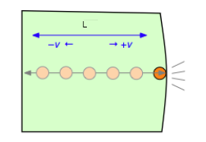
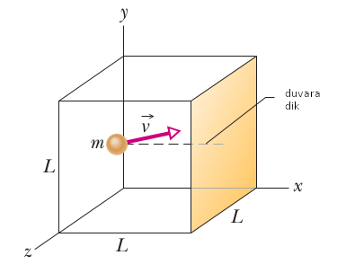
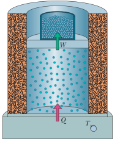
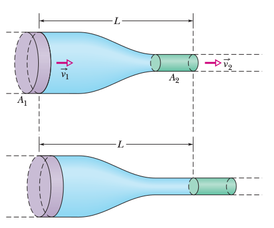
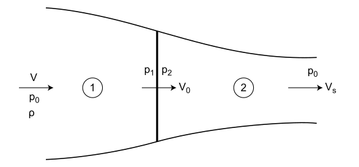
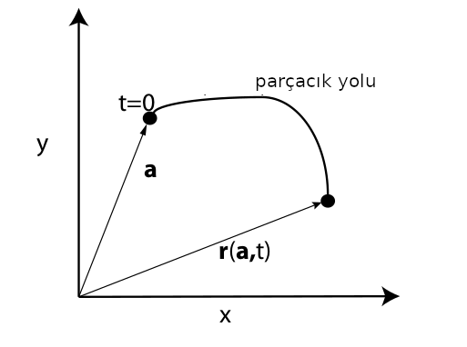
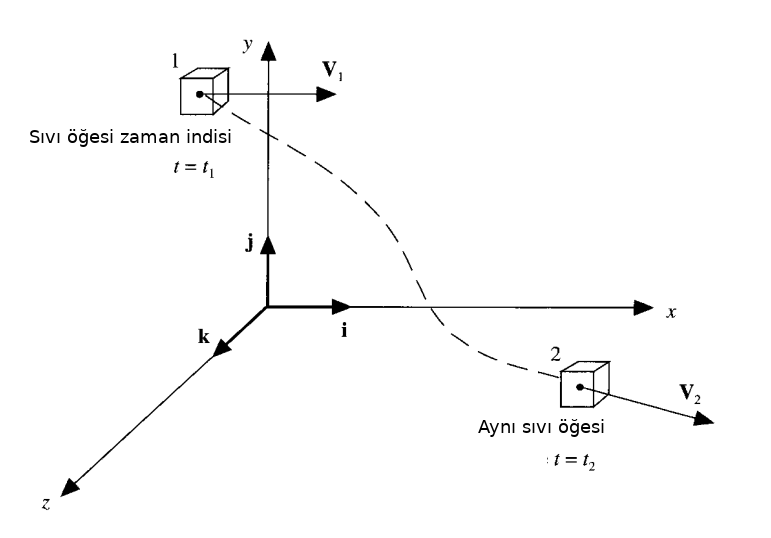
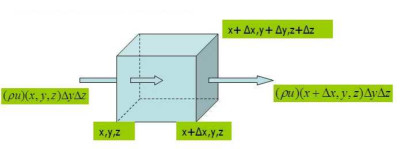
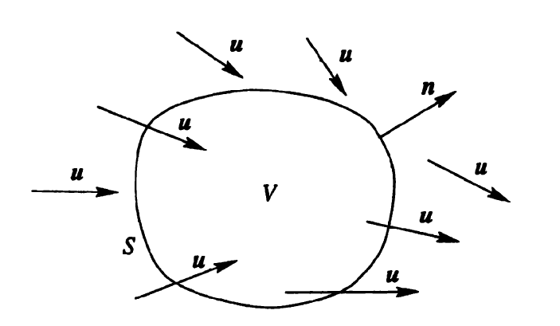
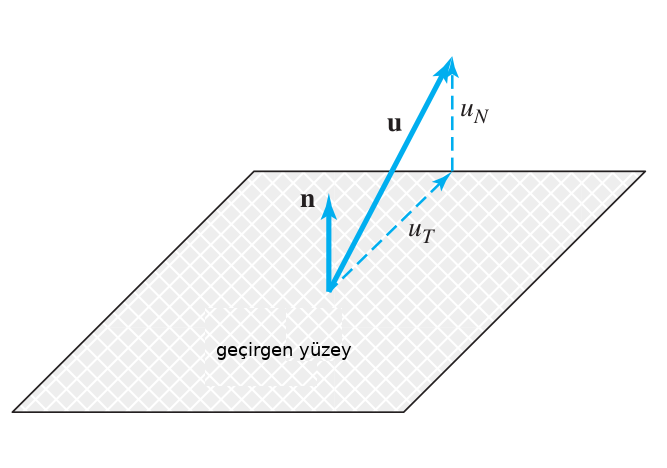

# Sıvı Mekaniği

İdeal Gazlar Kanunu (İdeal Gas Law)

Önce bazı terimler. Bir mol (mole) terimi mesela, mol önceden belirli bir
molekül sayısıdır. Tutarlı olması için herkesin kabul ettiği bir sayı, özel bir
temel parçacığa bağlanmış, bir mol 12 gramlık karbon-12 içindeki atom sayısı
[2, sf. 550]. Mole molekül sayısı aynı zamanda ünlü Avagadro sabitidir,
$N_A$ ile gösterilir,

$$
N_A = 6.02 x 10^{23} mol^{-1}
$$

Yani bir mol içinde üstteki kadar molekül var. Bir materyal içinde kaç mol var
hesabı için $n = N / N_A$ kullanabiliriz, $N$ tüm molekül sayısı, $N_A$ bir mol
içindeki molekül sayısı, bölüm bize istenen sonucu verir.

Basınç

Peki mikro etkileşimlerden yola çıkarak basınç kavramını türetebilir miyiz
acaba? 19'uncu yüzyıl sonlarına doğru bu başarıldı. Basıncın gaz moleküllerinin
bir yüzeye çarpmasından ortaya çıktığını hatırlayalım. Bu kuvvet tabii ki Newton
kanunundan hareketle,

$$
f = m a = m \frac{\mathrm{d} v}{\mathrm{d} t}
$$

Hız $v$'ye molekül içinde olduğu kabın / yüzey duvarına çarptığında ona dik olan
hız diyelim [1]. Bu türevi hesaplamak için, ki birim zamanda hız değişimi
gerekiyor, kenarları $L$ uzunluğunda bir küp içinde tek bir gaz molekül olduğunu
düşünelim.

Basitleştirme amacıyla diyelim ki bu molekül sürekli küp kutu içinde ileri geri
gidip geliyor, bir duvara çarpınca bir süre sonra geri geliyor. Bu molekül bir
duvara çarptığında $v$ hızında çarptığında (yani $mv$ momentumuyla) elastik
olarak geri sekecektir, ve $-v$ ile tam ters yöne geri gitmeye başlayacaktır.



O zaman her çarpışma için hız değişimi $2v$, momentum değişimi ise $2mv$
olur.

Tabii aslında eğer daha genel formülize etmek gerekirse bu çarpışma sırasında
$\bar{v}$ hızının duvara dik olan bileşeni $v_x$'yi düşünüyoruz.



Yani momentum değişimi

$$
\Delta p_x = (-m v_x) - (m v_x) = - 2 m v_x 
$$

Demek ki duvara transfer edilen momentum $2 m v_x$. 

Birim zaman $\Delta t$'ye bir molekün iki çarpışma arasında geçen zaman dersek,
ve $v_x$ hızında $2L$ yol katedilmişse, $\Delta t  = 2 L / v_x$ demektir, ve

$$
F = \frac{\Delta p_x}{\Delta t} = \frac{2 m v_x}{2 L / v_x} = \frac{m v_x^2}{L}
$$

Basınç birim alana uygulanan kuvvettir, ve küpün bir kenarının $L^2$ alanında
olduğunu düşünürsek, 

$$
P = \frac{m v^2}{L^3} = \frac{m v^2}{V}
$$

$V$'yi kutunun hacmi olarak aldık, ve $V = L^3$.

Birden fazla molekülü düşünmek istiyoruz şimdi, mesela bir averaj
üzerinden.. Fakat her molekül hem negatif hem pozitif yönde aşağı yukarı aynı
miktarda hareket yapar (rasgele hareket olduğu için) ve bu tür bir hareket
üzerinden averaj almak bizi sıfır değerine götürür. Bu sebeple ortalamasını
almadan önce hızların karesini almak istiyoruz,

$$
\bar{v^2} = \frac{v_1^2 + v_2^2 + ... + v_N^2 }{N} = \frac{\sum_i v_i^2}{N}
$$

ve ortalama değeri bulmak için $\sqrt{\bar{v^2}}$ kullanıyoruz. Bu hesaba kök
kare ortalaması (root mean square -RMS-) ismi de verilir. Şimdi tüm $N$
moleküller üzerinden bir basınç hesaplamak istersek, $N$ tane molekül, ama belli
bir anda sadece Kartezyen kordinat sisteminde sadece üç yönden sadece biri
yönünde etki var, o zaman $N$ ile çarpıp 3'e bölmek lazım, 

$$
P = \frac{N}{3} \frac{m \bar{v^2}}{V}
$$

Bu formül içinde bir kinetik enerji formülasyonu görülebiliyor, averaj kinetik
enerjiye $\epsilon = m \bar{v^2} / 2$ dersek, üstteki formülü

$$
PV = \frac{N}{3} m \bar{v^2} = \frac{2}{3} N \epsilon
$$

olarak yazabiliriz.

Eğer bu formülü sıcaklık içerek şekilde değiştirmek istiyorsak; biliyoruz ki
sisteme eklenen her Joule enerji ve bir derece sıcaklık değişimi arasındaki
ilişkiyi $k$ sabiti kontrol eder [5, 29-16] bu sabit $k = 1.38 x 10^{23}$ Joule
/ Kelvin'dir, o zaman enerjiden sıcaklığa geçiş için $kT$ kullanabiliriz, hatta
bir $3/2$ eklenerek üstteki 2/3 iptali amaçlanır,

$$
\epsilon = \frac{3}{2} k T
$$

Ve,

$$
PV = \left( \frac{2}{3} N \right) \left( \frac{3}{2} k T \right) = N k T
$$

Devam edelim, $n = N / N_A$ olduğunu da biliyoruz ki $N_A = 6.02 x 10^{23}$,
Avagadro'nun sayısı, $n$ örneklemdeki mol sayısı, $N$ ise örneklemdeki tüm
moleküller [2, sf. 550],

$$
PV = n N_A k T
$$

Tabii bu bizi $R$ denen bir diğer sabite götürüyor, $R = 8.31 J/mol \cdot
K$. Onun $k$ ve $N_A$ ile ilişkisi şöyle,

$$
k = \frac{R}{N_A}
$$

O zaman,

$$
PV = n R T
$$

İdeal gazlar kanununa erişmiş olduk.


Mol sayısını şöyle ifade edebilirdik,

$$
n = m / w_m
$$

ki $m$ gazın kütlesi, $w_m$ ise moleküler ağırlık. Bunları birbirine bölünce
doğal olarak mol sayısı ortaya çıkar, $n$'yi iki üstteki formüle koyunca,

$$
PV = \frac{m}{w_m} R T
$$

Bir düzenleme yaparsak,

$$
P = \frac{m}{V} \frac{R}{w_m} T
$$

$m/V$ yoğunluk, ona $\rho$ diyebiliriz, $R / w_m$ ise evrensel gaz
sabiti $R$'nin gazın moleküler ağırlığına bölünmüş hali, ona
yeni bir sabit $R_m$ diyebiliriz, o zaman daha öz

$$
P = \rho R_m T
$$

formülü elde edilir.

İç Enerji (Internal Energy)

Daha önce görmüştük, tek atomun ortalama hareketsel kinetik enerjisi
sıcaklığa bağlıydı, ona daha önce $\epsilon$ demiştik, şimdi $K_{avg}$
diyelim, ki $K_{avg} = 3/2 k T$. O zaman, ve $n$ mol miktarında bir
örneklemin içinde $n N_A$ molekül olacağı için, örneklemin iç
enerjisi $E_{int}$ şöyle hesaplanabilir [2, sf. 564],

$$
E_{int} = (n N_A) K_{avg} = (n N_A) (\frac{3}{2} k T)
$$

Daha önce gördük $k = R/N_A$, üstteki $E_{int}$ içine koyarsak,

$$
E_{int} = \frac{3}{2} n R T
$$

Mol Spesifik Isı (Molar Specific Heat of a Gas)

Bir gazın sıcaklık artışına tekabül eden ısı enerjisi (girdisi) faydalı
olabilecek bir büyüklüktür, fakat aynı sıcaklık değişimine giden ayrı yollar,
farklı ısı hesaplarına sebep verebilir. Değişimin en çok ortaya çıkan iki
versiyonu için farklı bir mol spesifik ısı öne sürmek daha iyi olur, bunlardan
biri basınç sabit tutulduğu durumdaki, diğeri de hacim sabit tutulduğu
durumdaki mol spesifik ısı.

$$
Q = n C_P \Delta T
\qquad (2)
$$

$$
Q = n C_V \Delta T
\qquad (1)
$$

Üstteki $C_V$ sabit hacimdeki mol spesifik ısı, $C_P$ sabit basınçtaki.

Sabit hacim durumu için $Q = \Delta E_{int}$, o zaman 

$\Delta E_{int} = n C_V \Delta T$

Eğer sıcaklıkta değişim yoksa 

$E_{int} = n C_V T$

Bu denklem tüm ideal gazlar için geçerlidir, ideal gaz derken molekülünde birden
fazla atom olan gazlar için.

Basınç sabit tutulduğu durumdaki molar spesifik ısıdan hareket ederek bir ilginç
formüle daha ulaşabiliriz; Bu durumda ideal gazın sıcaklığını daha önce olduğu
gibi ufak $\Delta T$ kadar arttırdığımızı düşünüyoruz, fakat şimdi eklenen
enerji hem gazın sıcaklığını arttıracak, hem de iş yapacak, altta görülen
pistonu üste itmek gibi (çünkü basınç sabit dedik, hacim sabit demedik). 



Erişmek istediğimiz hem $C_P$ hem $C_V$ içeren bir formül bulmak, o zaman
Termodinamiğin İlk Kanunu ile başlayalım,

$$
\Delta E_{int} = Q - W
$$

$E_{int}$ bir materyelin iç ısısı, ve sadece materyelin o anki iç konumuna bağlı
(sıcaklığı, basıncı ve hacmi). $Q$ değişkeni sistemin çevresindekilerle yaptığı
ısı alışverisini temsil ediyor, artı değerler materyel ısı çekiyor, negatif ısı
veriyor demektir. $W$ ise sistemin yaptığı iş (work). Eğer sistem genişliyorsa
mesela iş yapılıyordur, genişleme ya da daralma yoksa $W=0$.

Üstteki formül içine bildiğimiz diğer formülleri koyabiliriz, mesela (1)'i
sokarsak,

$$
n C_V \Delta T = Q - W
\qquad (5)
$$

Yapılan iş $W$ hesaplamak için üstteki resmi düşünelim, alt bölmedeki gaz
pistonu yukarı doğru iterek iş yapabilir. Bu işin pistonu $\vec{F}$ kuvvetiyle
ve $\mathrm{d} \vec{s}$ kadar sonsuz ufak bir değişime uğrattığını düşünelim.  Bu
değişim çok ufak olduğu için $\vec{F}$'nin o değişim sırasında sabit olduğunu
farz edebiliriz [2, sf. 529]. Bir diğer çıkarsama $\vec{F}$'nin $p A$'ya eşit
olduğu - basınç $p$ kuvvet bölü alan $A$ ise aynı $p$ ile $A$'yi çarparsak
kuvvete geri geliriz. Diferansiyel yapılan iş

$$
\mathrm{d} W = \vec{F} \cdot \mathrm{d} \vec{s} = (pA) (\mathrm{d} s) = p (A \mathrm{d} s)
$$

O zaman $V_i$ ile $V_f$ hacim değişimleri arasında yapılan iş üstteki formülün
entegralidir,

$$
W = \int \mathrm{d} W = \int_{V_i}^{V_f} p \mathrm{d} V
$$

Bu hesabın detaylarına şimdi girmeyeceğiz, ama baktığımız sabit hacim
durumu için üstteki hesap daha basitleşiyor, $W = p \Delta V$. Ayrıca
ideal gaz kanunu $pV = n R T$ olduğu için $p \Delta V = n R \Delta T$
de yazılabilir, o zaman $p \Delta V$ yerine $n R \Delta T$ kullanmak
mümkün, (5)'e sokarsak,

$$
n C_V \Delta T = Q - n R \Delta T
$$

$Q$ ise basınç sabit durumdaki (2) formülünden geliyor zaten,

$$
n C_V \Delta T = n C_P \Delta T - n R \Delta T
$$

Her şeyi $n \Delta T$ ile bölersek,

$$
C_V = C_P - R
$$

Ya da

$$
C_P - C_V = R
\qquad (4)
$$

Bir diğer kullanışlı ilginç sabit

$$
\gamma = C_P / C_V
\qquad (3)
$$

oranıdır. Bu oran, politropik (polytrophic) gazlar denen, sabit hacimdeki
durumun enerjisinin hesaplamak için faydalı. Tek bir mol için

$$
E_{int} = C_V T
$$

ile başlarsak, ve $T = p / R\rho$ formülünü $T$'ye sokunca [3, sf. 295],

$$
E_{int} = \frac{C_V}{R} \frac{p}{\rho}
$$

Gruplamayı bu şekilde yaptık çünkü birazdan $C_V/R$ yerine başka bir formül
bulacağız. Devam edelim (3)'ten hareketle $\gamma C_V = C_P$ diyebiliriz. Bu
formülü $C_P$ için (4)'ye koyalım,

$$
\gamma C_V - C_V = R \implies C_V(\gamma-1) = R \implies \frac{C_V}{R} =
\frac{1}{\gamma-1}
$$

Bu sonuç iki üstteki ilk terim ile uyumlu, o zaman 

$$
E_{int} = \frac{p}{\rho (\gamma - 1)}
$$

Bu form politropik ideal gazların konum formülü (equation of state for an ideal
polytropic gas) olarak biliniyor.

Gazlar, Sıvılar, Hava Dinamiği

Süreklilik Denklemi

Farklı noktalarda boyutları farklı olan bir tüp içinde istikrarlı akış içindeki
bir sıvının $v$ ve $A$ ifadelerini birbiriyle ilintilendiren bir formül kurmak
istiyoruz. Bir $t$ zamanından başlayarak $\Delta t$ kadar süre içindeki tüpün
solunda oluşan hacim ve bu hacmi dışarı itmesi gereken, eğer sıvı sıkıştırılamaz
ise, sağda eşit bir hacim vardır. Soldan $\Delta V$ girmişse sağdan $\Delta V$
çıkmalıdır.



Genel bağlamda $\Delta x = v \Delta t$ ise,

$$
\Delta V = A \Delta x = A v \Delta t
$$

Şimdi tüpün solu ve sağı özelinde,

$$
\Delta V = A_1 v_1 \Delta t = A_2 v_2 \Delta t
$$

$$
A_1 v_1 = A_2 v_2
$$

Üsttekine süreklilik denklemi adı veriliyor.

Bu denklemi 

$$
R_V = A v = \textrm{sabit}
$$

olarak ta yazabiliriz, çünkü süreklilik denklemi herhangi iki nokta için
doğru olmalıdır, o zaman üstteki ifade de geçerlidir. $R_V$'ye hacim akış
oranı denir. 

Ek olarak sıvının yoğunluğu her yerde eşit ise, mesela $\rho$ diyelim, o
zaman 

$$
R_m = \rho R_v = \rho A v = \textrm{sabit}
\qquad (3)
$$

sonucuna da varılabilir [9, sf. 399].

Bernoulli Deklemi

İstikrarlı akış halindeki bir sıvıyı düşünelim, alttaki resimdeki gibi
yandan görülen bir tüpte / boruda akıyor. Diyelim ki 1. resim ile 2. resim
arasında geçen zaman $\Delta t$ ve o zaman içinde koyu mavi olan bölüm
kadar sıvı hacmi yer değiştiriyor [8, sf 402].


Bu değişimin tüp sonunda yeşil bölge kadar hacim değişikliğine yol
açar diyelim, ve önemli bir nokta iki hacim birbirine eşittir.  Eğer
1. resimdeki sıvının girişteki yükseklik, hız, ve basıncı
$y_1,v_1,p_1$ ile temsil ediliyorsa, 2. resimde diğer uçtaki
$y_2,v_2,p_2$ diyelim, bu değişkenler

$$
p_1 + \frac{1}{2} \rho v_1^2 + \rho g y_1 =
p_2 + \frac{1}{2} \rho v_2^2 + \rho g y_2 
\qquad (1)
$$

formülü ile birbiriyle bağlıdır, ki $\rho$ sıvı yoğunluk
sabiti. Üstteki denklemi

$$
p + \frac{1}{2} \rho v^2 + \rho g y = \textrm{bir sabit}
\qquad (2)
$$

olarak ta yazabiliriz. Bu son formül Bernoulli'nin formülüdür, onun
daha yaygın bilinen formudur.

Formüle erişmek için iş-kinetik enerji teorisinden başlayabiliriz, 

$$
W = \Delta K
$$

Yapılan iş kinetik enerjideki değişime eşittir. Sıvı için kinetik enerji
değişimi sıvının tüp başında ve sonundaki hızı ile alakalı olmalıdır [9,
sf. 403],

$$
\Delta K = \frac{1}{2} \Delta m v_2^2 - \frac{1}{2} \Delta m v_1^2 
$$

ki $\Delta m$ tüpün başında $\Delta t$ anında içeri giren sıvı kütlesi. Onu
$\Delta m = \rho \Delta V$ olarak ta yazabiliriz ki $\Delta V$ aynı zaman
aralığında giren sıvı hacmi.

$$
= \frac{1}{2} \rho \Delta V(v_2^2 - v_1^2)
$$

Şimdi basıncı dahil edelim, bu da bir kuvvet, tüpün başında pozitif iş
yapıyor, sonunda içerideki tüm sıvının kütlesi üzerinden ters yönde iş
yapıyor, genel olarak 

$$
F \Delta x  = (pA)(\Delta x) = p(A\Delta x) = p \Delta V
$$

denebilir, o zaman baştaki iş $p_1 \Delta V$, sondaki iş $p_2 \Delta V$,
toplam

$$
W_p = -p_2 \Delta V + p_1 \Delta V
$$

$$
= - (p_2-p_1) \Delta V
$$

Yerçekimin yaptığı iş negatiftir, $W_g$ diyelim, kuvvet çarpı yer
değişikliği. Kuvvet $\Delta m g$, yer değişikliği $y_2-y_1$. 

$$
W_g = -\Delta m g (y_2 - y_1)
$$

$$
= -\rho g \Delta V (y_2-y_1)
$$


Hepsini bir araya koyarsak, yapılan iş eşittir kinetik enerji değişimi
üzerinden,

$$
W = W_g + W_p = \Delta K
$$

$$
-\rho g \Delta V(y_2-y_1) - \Delta V(p_2-p_1) = 
\frac{1}{2} \rho \Delta V(v_2^2 - v_1^2)
$$

Tekrar düzenlersek (1)'e erisebiliriz. (2) denklemi (1)'e bakmanın bir
diğer yönü, çünkü aslında (2) diyor ki basınç $P$ artı kinetik enerji
$\frac{1}{2} \rho v^2$ artı yerçekimsel potansiyel enerji yoğunluğu
$\rho g y$'yi tüp akışındaki herhangi iki noktada hesaplarsak birbirlerine
eşit olmalılar. O zaman, $p + \frac{1}{2} \rho v^2 + \rho g y$ formülü her
noktada aynı olacağına göre bu ifadenin bir sabite eşit olduğu da
söylenebiliyor. Yani

$$
p + \frac{1}{2} \rho v^2 + \rho g y = \textrm{bir sabit}
$$

oluyor. Diğer bir yönden bakarsak, üstteki formüle bir enerji denklemi de
denebilir. Tüm formülü $\rho$ ile bölersek,

$$
\frac{p}{\rho} + \frac{1}{2} v^2 + gh = \textrm{sabit}
$$

Buradaki $p / \rho$ basınç enerjisi, $\frac{1}{2}v^2$ kinetik enerji, $gy$ ise
potansiyel enerji. Bir sıvı (ya da aerodinamik durumunda hava) ögesi, parçacığı
bir tüpte akarken toplam enerjisinin muhafaza eder.

Bir hava taşıtının etrafından akan hava durumunda öğelerin dikey yer
değişimi genellikle çok küçüktür o zaman yok sayılabilirler, bu durumda
Bernoulli denklemi 

$$
p + \frac{1}{2} \rho v^2 = \textrm{sabit}
$$

formuna indirgenebilir [7, sf 97]. $\frac{1}{2}\rho v^2$ terimine dinamik basınç
(dynamic pressure) ismi de veriliyor, bu terim birim hacimdeki ve $\rho$
yoğunluğundaki havaya $v$'ye hızlandırılınca eklenen kinetik enerjiyi temsil ediyor.

Basınç Katsayısı (Pressure Coefficient)

Aerodinamikte bazı öğeleri tekil boyutsuz sayılara indirgemek faydalı
olabiliyor. Mesela eğer bir kanat kesidi (airfoil) etrafındaki havanın kesite
nasıl basınç uyguladığına bakıyorsak, basınç katsayısı $C_p$ burada faydalı
olabiliyor, örnek için [9], $C_p$'yi şöyle tanımlıyoruz,

$$
C_p \equiv \frac{p - p_\infty}{\frac{1}{2} \rho_\infty v_\infty^2}
$$

ki $p_\infty$ incelenen parçanın dışında kalan havanın normal basıncı,
$v_\infty$ hızı, $\rho_\infty$ ise o havanın yoğunluğu.

Denkleme yakından bakarsak olabilecek en az $v=0$ ile $C_p$'nin olabileceği en
büyük değer 1'dir. Akışın olmadığı noktaları tıkanıklık bölgeleri (stagnation
point) ismi verilir. Akışın $p < p_\infty$ bölgelerinde ise $C_p$ negatif
olacaktır.

Helikopter

Bir helikopterin pervanesi dönerken üstteki hava parçacıklarını alıp aşağı
doğru iter. Olanları sanki bir tüp içinde sıvı akışıymış gibi görebiliriz,
ama ufak bir fark var, altta dikey çizgiyle gösterilen (yandan bakış)
pervane sıvıya, daha doğrusu havaya bir enerji ekler.



Bu sebeple bir enerji hesabı yapmak istiyorsak Bernoulli denklemini iki
bölgeye ayrı ayrı uygulamamız gerekir. Pervane öncesi, ve sonrası [8,
sf. 66].

$$
p_0 + \frac{1}{2} \rho V^2 = p_1 + \frac{1}{2} \rho V_0^2
$$

Ve

$$
p_2 + \frac{1}{2} \rho V_0^2 = p_0 + \frac{1}{2} \rho V_s^2
$$

Değişkenlerin ne olduğunu açıklamak gerekirse pervane diskine girmeden önce
hava heryerde birörnek $V$ hızında ve $p_0$ basıncına sahip. Diske
yaklaştığında hava $V_0$ hızına getiriliyor ve basıncı $p_1$'e
düşüyor. Disk üzerinde onun uyguladığı enerji ile basınç $p_2$'ye
arttırılıyor ama süreklilik bağlamında hızının çok fazla artışı mümkün
değil. Disk arkasında, tüpün ikinci bölümünde hava genişliyor, basınç
$p_0$'ye dönüyor, bu noktada hızı $V_s$.

Şimdi üstteki denklemleri şu şekilde yazarsak, 

$$
p_1 + \frac{1}{2} \rho V_0^2 = p_0 + \frac{1}{2} \rho V^2
$$

$$
p_2 + \frac{1}{2} \rho V_0^2 = p_0 + \frac{1}{2} \rho V_s^2
$$

ve bir üstteki denklemi iki üstteki denklemden çıkartırsak, 

$$
\left(p_2 + \frac{1}{2} \rho V_0^2 \right) - 
\left(p_1 + \frac{1}{2} \rho V_0^2 \right) = 
\left(p_0 + \frac{1}{2} \rho V_s^2 \right) - 
\left(p_0 + \frac{1}{2} \rho V^2 \right)
$$

Basitleştirince,

$$
p_2 - p_1 = \frac{1}{2} \rho (V_s^2 - V^2)
\qquad (4)
$$

Devam edelim, daha önce (3)'te gördük ki, eğer alan için $S$, hız için
$V_0$ kullanırsak, 

$$
R_m = \rho S V_0
$$

Momentum kütle çarpı hızdır, momentum artışı ise diske giren kütle artış
oranı çarpı hız olarak temsil edilebilir, o zaman biraz önce gördüğümüz
$V_s-V$ hız artışının ima ettiği momentum artışı üstteki eşitliğin sol
tarafında $R_m (V_s - V)$. Tüm formüle uygulayınca 

$$
R_m (V_s - V) = \rho S V_0  (V_s - V)
$$

Üstteki eşitliğin sol tarafına itiş kuvveti (thrust) de denebilir. Yani
$T$,

$$
T = \rho S V_0  (V_s - V)
$$

olur. Değişik bir açıdan bakarsak itiş $T$ diskin iki tarafındaki basınç
farkından da hesaplanabilir, basınç çarpı alan eşittir kuvvet üzerinden,

$$
T = S (p_2 - p_1)
$$

Şimdi (4)'e dönelim. Eğer (4)'daki ifadeyi üstteki formüle $p_2-p_1$'den
sokarsak, ve her iki $T$'yi birbirine eşitlersek, 

$$
\frac{1}{2} \rho S (V_s^2 - V^2) = \rho S V_0 (V_s - V)
$$

Basitleştirmek için

$$
\frac{1}{2} \rho S (V_s - V)(V_s + V) = \rho S V_0 (V_s - V)
$$

$$
V_0 = \frac{1}{2} (V_s + V)  
\qquad (5)
$$

Helikopter Asılı Dururken

$W$ ağırlığındaki bir helikopterin askıda kalması için ne kadar güç
gerekir? Bir helikopterin askıda kalması için onun ağırlığına eş büyüklükte
bir itiş kuvveti olmalı. 1'inci itiş formülünden hareketle

$$
W = T = \rho S V_0  (V_s - V)
$$

Hareket ettirilen hava hızı $V = 0$ olacak, pervane alanı dışında kalan
havanın hızını yok sayıyoruz.

Bu durumda, ve pervane alanı $A$ diyerek

$$
W = \rho A V_0 V_s
$$

Diğer yandan (5)'i alırsak, ve $V=0$,

$$
V_0 = \frac{1}{2} V_s
$$

Ya da

$$
V_s = 2 V_0
$$

Bunu alıp $W$ formülüne sokalım,

$$
W = 2 \rho A V_0^2
$$

Ya da

$$
V_0 = \sqrt{W / 2 \rho A} 
\qquad (6)
$$

Şimdi uygulananması gereken gücü düşünelim, güç tanımı birim zamandaki
enerji aktarımıdır. Enerji nedir? Üstteki durumda enerji kinetik enerjidir.
Birim zamanda hız pervane dışında $V$, enerji ise $\frac{1}{2}V^2$, pervane
enerji eklemesi sonucu $\frac{1}{2} V_s^2$. Yani enerji eklemesi
$1/2(V_s^2 - V^2)$. Birim zamandaki kütle farkı $R_m = \rho S V_0$
demiştik, hepsini bir araya koyarsak,

$$
P = R_E = \rho S V_0 \frac{1}{2} (V_s^2 - V^2)
$$

Bu formül birim zamandaki havanın kinetik enerjisindeki artışı gösteriyor,
yani uygulanacak güç $P$'yi gösteriyor. Basitleştirelim, $V=0$ olacak,
$V_s = 2 V_0$, alan $S=A$,

$$
= \rho A V_0^3 \frac{1}{2} 2^2 V_0^2
$$

$$
= 2 \rho A V_0^3
$$

(6)'daki $V_0$'yu buraya sokarsak,

$$
= 2 \rho A \left( \frac{W}{ 2 \rho A} \right)^{3/2}
$$

$$
P = \sqrt{ \frac{W^3}{2 \rho A} }
$$

ki $\rho$ standart deniz seviyesi hava yoğunluğu. Demek ki diske
uygulanması gereken güç budur.

Dikkat; üstteki hesaplar uygulanan gücün tamamının pervaneye
aktarılabildiğini varsayıyor. Pratikte bu doğru olmayabilir, pervane şekli,
ve diğer sebeplerden uygulanan güçte kayıp olabilir. Hesaplar idealize
ortamdaki hesaplardır yani, kabaca akıl yürütmek için faydalıdır. İyi bir
başlangıç noktası olacaklardır.

Örnek

Bir helikopter düşünelim, ağırlığı $W = 24000$ Newton olsun, disk alanı
$A = 176.7$ $m^2$. Deniz seviyesi hava yoğunluğu $\rho = 1.226$
$kg \cdot m^{-3}$ üzerinden helikopteri havada tutmak için gereken güç
nedir?

```python
rho0 = 1.226
W = 24000
A = 176.7
print ( np.sqrt( W**3 / (2 * rho0 * A)  ), 'Watt'  )  
```

```
178623.4013246838 Watt
```

Birimlerin doğru olduğunu kontrol edebilirsiniz. Newton $kg \cdot m \cdot
s^{-2}$, Joule $kg \cdot m^2 \cdot s^{-2}$. Üstteki hesaplar $kg \cdot m
\cdot s^{-3}$ verecek, yani Joule / saniye, yani enerji bölü saniye ki bu
da Watt tanımı. 

Örnek

Ufak bir helikopter düşünelim, ağırlığı $W = 1.22$ kg olsun, disk alanı
$A = 0.18$ $m^2$. Helikopteri havada tutmak için gereken güç nedir?

Dikkat kg verildi, ama Newton lazım, önce $9.8 m \cdot s^{-2}$ ile çarpmak gerekli.

```python
rho0 = 1.226
W = 1.22*9.8
A = 0.18
print ( np.sqrt( W**3 / (2 * rho0 * A)  )  )  
```

```
62.22750295064798
```

Örnek

100 kg yükü 3 $m$ pervane yarıçapı ile taşımak için ne kadar güç gerekir?

```python
rho0 = 1.226
W = 100 * 9.8
r = 3.0
A = np.pi * r**2
print ( np.sqrt( W**3 / (2 * rho0 * A)  ), 'Watt'  ) 
```

```
3684.5350274555626 Watt
```

Euler ve Lagrange, Materyel Türev

Euler ve Lagrange bakış açısı arasındaki farklarla başlayalım. Bu iki bakış
açısı bir sıvının dinamiğini nasıl incelediğimiz ile alakalı. Eğer bir nehirdeki
kirlilik yoğunluğunu ölçüyorsak mesela, bunu herhangi bir $x,y,z$ noktasında
yapabiliriz, ve diyelim ki kirlilik belli bir yerde hiç değişmiyor, ertesi gün
gelsek aynı yerde aynı ölçümü alıyoruz [11, sf 78]. Bu yere bağımlı Euler açısı.

Fakat farklı yerlerde farklı ölçümler olabilir, mesela nehir boyunca bir kayık
içinde sabit hızda gidersek yoğunluk lineer oranda artıyor. Bu durumda pir paket
sıvıyı takip ettiğimizi düşünebiliriz, o paketin açısından elde edilen ölçümler
Lagrange bakış açısıdır. 

İki bakış açısı arasında gidip gelmenin yolu materyel türev. Böylece Euler
bazındaki değişim kullanılarak Lagrange tarifi yapılabiliyor. Bu önemli çünkü
ölçümler çoğunlukla Euler formatında düşünülür (bir yerde duran ölçüm aleti
idare etmesi ve temsili daha rahat bir kavramdır), ayrıca matematik Euler
ortamında biraz daha kolay manipüle edilebilir hale geliyor [12].

Lagrange ile bir parçacık hayal ediyoruz, onu tanımlamanın bir yolu $t=0$ anında
nerede olduğu. Daha sonra bu başlangıç noktasındaki sıvı paketinin hangi yolu
takip ettiğini $\bar{r}(t)$ ile tarif ediyoruz, ki $\bar{r}(t)$ parametrik bir
eğri olarak alabiliriz, $r = ( x(t), y(t), z(t) )$. Eğer bir başlangıç
noktasını $a$ olarak tanımlarsak bu başlangıcın ve yol denkleminin bir parçacığı
tarif ettiğini düşünebiliriz,



Herhangi bir ölçümü alalım [13], biraz önce kirlilik örneği verdik, bu
sıcaklık ta olabilirdi, ölçüm $F(t,x,y,z)$ olsun, $t$ anında ve $x,y,z$
noktasında yapılan ölçüm, bu ölçüme Calculus'un Zincirleme Kuralını uygularsak,
değişim oranını materyel türev $D F / Dt$'yi nasıl elde edebileceğimizi
görebiliriz,

$$
\frac{D F}{D t} =
\frac{\partial F}{\partial t} +
\frac{\partial F}{\partial x} \frac{\partial x}{\partial t} + 
\frac{\partial F}{\partial y} \frac{\partial y}{\partial t} + 
\frac{\partial F}{\partial z} \frac{\partial z}{\partial t} 
$$

$(\frac{\partial x}{\partial t}, \frac{\partial y}{\partial t},\frac{\partial
z}{\partial t})$ hız olarak görülebilir, ona $\bar{u} = (u,v,w)$ vektörü diyelim,

$$
\frac{D F}{D t} =
\frac{\partial F}{\partial t} +
\frac{\partial F}{\partial x} u + 
\frac{\partial F}{\partial y} v + 
\frac{\partial F}{\partial z} w 
$$

Ayrica $(\frac{\partial F}{\partial x},\frac{\partial F}{\partial y},\frac{\partial F}{\partial z})$
gradyan vektoru $\nabla F$,

$$
\frac{\partial F}{\partial t} + \bar{u} \cdot \nabla F
$$

Burada $\frac{\partial F}{\partial t}$ ölçülen $F$'nin tek, sabit bir yerde
zamana göre değişimidir. Bu terime yapılan ekler hareket halindeki parçanın ek
olarak göreceği ölçüm değişim oranı olacaktır.

Alınan türev bir operatör olarak görülebilir, 

$$
\frac{D ()}{D t} = \frac{\partial () }{\partial t} + \bar{u} \cdot \nabla ()
$$

Üzerinde operatör uygulanan $()$ içine gider, $F$ için

$$
\frac{D F}{D t} = \frac{\partial F}{\partial t} + \bar{u} \cdot \nabla F
$$

ile önceki formüle eriştik.

Şimdi ilginç bir noktaya geldik, süreklilik denklemi (1)'i, $\rho$ ölçümü
üzerinde materyel türev uygulanmış formu olarak görmek mümkün,

$$
\frac{D \rho}{D t} + \rho \nabla \cdot \bar{u} = 0
$$

İlginç bir diğer bakış açısı Anderson kitabından [16, sf. 43]. Hız $x,y,z$
noktasında $t$ anındaki $u,v,w$ hız vektörü

$$
u = u(x,y,z,t)
$$

$$
v = u(x,y,z,t)
$$

$$
w = u(x,y,z,t)
$$

ile gösteriliyor olsun, ve bu nokta ve zamandaki yoğunluk $\rho$ ise

$$
\rho = \rho(x,y,z,t)
$$


Ufak sıvı hacimlerine bakıyoruz, ve $t_1$ anında 1 noktasındaki öğenin
yoğunluğu

$$
\rho_1 = \rho(x_1,y_1,z_1,t_1)
$$



Daha sonraki bir $t_2$ anında aynı sıvı öğesi 2 noktasına gitti diyelim, bu
noktada yoğunluk

$$
\rho_2 = \rho(x_2,y_2,z_2,t_2)
$$

Şimdi 1 noktası etrafında 2 noktasına doğru bir Taylor açılımı yapabiliriz,
yüksek dereceli diğer terimler (high-order terms) HOT ile belirterek,

$$
\rho_2 =
\rho_1 + \left( \frac{\partial \rho}{\partial x}  \right)_1 (x_2-x_1) +
\left( \frac{\partial \rho}{\partial y}  \right)_1 (y_2-y_1) +
\left( \frac{\partial \rho}{\partial z}  \right)_1 (z_2-z_1) +
\left( \frac{\partial \rho}{\partial t}  \right)_1 (t_2-t_1) +
HOT
$$

$\rho_1$ terimini sol tarafa geçirip her sey $t_2-t_1$ ile bolersek ve
HOT'yi yoksayarsak,

$$
\frac{\rho_2-\rho_1}{t_2-t_1} =
\left( \frac{\partial \rho}{\partial x}  \right)_1 \frac{(x_2-x_1)}{t_2-t_1} +
\left( \frac{\partial \rho}{\partial y}  \right)_1 \frac{(y_2-y_1)}{t_2-t_1} +
\left( \frac{\partial \rho}{\partial z}  \right)_1 \frac{(z_2-z_1)}{t_2-t_1} +
\left( \frac{\partial \rho}{\partial t}  \right)_1
\qquad (3)
$$

Eşitliğin sol tarafına dikkat edersek bu sıvının 1 noktasından 2 noktasına
giderken deneyimlediği zamanda ortalama değişim değil midir? Limite giderken
yani $t_2$ zamanı $t_1$'e sonsuz yaklaştırılırken,

$$
\lim_{t_2 \to t_1} \frac{\rho_2-\rho_1}{t_2-t_1} = \frac{D\rho}{D t}
$$

ki burada $D\rho/D t$ sembolü yoğunluğun 1 noktasından geçerken yaşadığı
*anlık* değişimdir.

Yaygın adlandırma kuralları bu sembole maddi, materyel türev (substantial
derivative) $D/Dt$ adını verir. Dikkat edelim $D\rho/Dt$ yoğunluğun sıvı öğesi
hareket ederken zamana göre değişim oranıdır. Gözlerimiz o sıvı paketine
kitlenmiş durumdadır, onu izlemekteyiz, ve 1 noktasında geçerken onun
yoğunluğunun değişimini raporlamak istiyoruz. Bu rapor
$(\partial \rho / \partial t)_1$'den farklı, burada sabit 1 noktasındaki
yoğunluğun zamana göre değişim oranını raporluyoruz. Bu durumda gözler 1
noktasına kitlenmiş durumda, sadece orada olup bitenlerle ilgileniyoruz. 

(3) denklemine dönersek, alttakilerin doğru olduğunu bildiğimize göre,

$$
\lim_{t_2 \to t_1} \frac{x_2 - x_1}{t_2 - t_1} \equiv u
$$

$$
\lim_{t_2 \to t_1} \frac{y_2 - y_1}{t_2 - t_1} \equiv v
$$

$$
\lim_{t_2 \to t_1} \frac{z_2 - z_1}{t_2 - t_1} \equiv w
$$

o zaman (3) denkleminin tamamını $t_2 \to t_1$ ile limite götürdüğümüzde

$$
\frac{D\rho}{D t} =
u \frac{\partial \rho}{\partial x} + 
v \frac{\partial \rho}{\partial y} + 
w \frac{\partial \rho}{\partial z} + 
\frac{\partial \rho}{\partial t} 
$$

ifadesini elde ederiz. Bu ifadeyi genelleştirerek bir operatör haline de
getirebiliriz,

$$
\frac{D}{D t} =
u \frac{\partial }{\partial x} + 
v \frac{\partial }{\partial y} + 
w \frac{\partial }{\partial z} + 
\frac{\partial \rho}{\partial t} 
$$


Kütle Muhafazası, Süreklilik Formülü (Continuity Equation)

Ufak bir kutu ya da hacim ögesi hayal edelim [13, 16 sf. 50, 17 sf. 10, 19 sf. 404, 21
  sf 95, 20 sf. 9], kenarları çok küçük $\Delta x$, $\Delta y$, $\Delta z$
boyutlarında, ve bu kutu uzayda sabitlenmiş, içinden sıvı akıyor. Sabitlenmiş
bir noktada olanlara baktığımız için bu Euler bakış açısı, detaylarını ileride
göreceğiz. Neyse, şimdi sadece $x$ yönündeki kütle değişimine bakalım,



Sıvının akış hızı $u(x,y,z) = (u,v,w)$, ve yoğunluğu $\rho$ olsun. Birim zamanda
içeri akan net kütleyi giren eksi çıkan kütle olarak hesaplayacağız. Bu zamanda
$x$ yönünde akış kenarları $\Delta y$, $\Delta z$ ve $u(x,y,z)$ (ufak dik duran
bir pizza kutusu gibi) olan bir kesit düşünebilir. Bu birim zamandaki akış
hacmi.  Onu yoğunluk ile çarpınca kütle elde edilir, aynı şeyi $x + \Delta x$
noktası için de yaparız, ve farklarını alırız,

$$
\rho(x,y,z)u(x,y,z)\Delta y \Delta z -
\rho(x+\Delta x,y,z) u(x+\Delta x,y,z)\Delta y \Delta z
$$

Üstteki formüldeki bir bölüm bir kısmi türevi andırıyor, $\Delta x$ ile bölüp
çarpsak,

$$
= \frac{\rho(x,y,z)u(x,y,z)}{\Delta x}\Delta x \Delta y \Delta z -
\frac{\rho(x+\Delta x,y,z) u(x+\Delta x,y,z)}{\Delta x} \Delta x \Delta y \Delta z
$$

Evet iki bölme işlemini yaklaşıksal kısmi türev olarak görebiliriz,

$$
\approx -\frac{\partial (\rho u) }{\partial x} \Delta x \Delta y \Delta z
$$

Benzer işlemi tüm eksenler için ayrı ayrı yapsak onlar için de kısmi türevler
elde ederdik, o zaman tüm eksenler üzerinden olan değişim, ve farksal hacmi
$\Delta V = \Delta x \Delta y \Delta z$ olarak göstererek,

$$
\left(
-\frac{\partial (\rho u) }{\partial x} 
-\frac{\partial (\rho u) }{\partial y} 
-\frac{\partial (\rho u) }{\partial z} 
\right) \Delta V
$$

Üstteki gradyan vektörsel olarak daha rahat ifade edilebilir,

$$
= -\nabla \cdot (\rho \bar{u} ) \Delta V
$$

Birim zamandaki kütle artışı buna eşit. Üstteki ifadeyi farklı bir açıdan, birim
zamandaki kütle (yoğunluk çarpı hacim) artışı olarak, şöyle de belirtebilirdik,

$$
\frac{\partial }{\partial t} (\rho \Delta V) 
$$

Bu formül iki üstteki formül ile eşit olmalı. Ayrıca her iki tarafta $\Delta V$
var, çıkartılabilir, zaten sabit bir hacim, sonuç,

$$
\frac{\partial \rho}{\partial t}  = -\nabla \cdot (\rho \bar{u} )
$$

Literatürde çoğunlukla şu formda gösterilir,

$$
\frac{\partial \rho}{\partial t}  + \nabla \cdot (\rho \bar{u} ) = 0
\qquad (1)
$$

Bu denkleme süreklilik formülü (continuity equation) ya da kütle muhafaza kanunu
(mass convervation law) ismi veriliyor.

Bilinen Vektör Calculus eşitliğinden hareketle

$$
\frac{\partial \rho}{\partial t}  +
\bar{u} \cdot \nabla \rho +
\rho \cdot \nabla \bar{u} = 0
$$

Eğer bir sıvı sıkıştırılamaz (incompressible) ise, ki pek çok sıvı dinamiği
simülasyonlarında böyle olduğu kabul edilir, o zaman $\rho = sabit$ demektir,
$\frac{\partial \rho}{\partial t} = 0$ olur, değişim yok, süreklilik
formülünden geri kalan

$$
\nabla \cdot \bar{u} = 0
\qquad (2)
$$

olacaktır. $\nabla \cdot$ sembolünün uzaklaşım, ya da $\mathrm{div}$ olduğunu
hatırlayalım, ve uzaklaşım yaklaşık olarak bir bölgeye giren eksi çıkan akışı
gösterir, ve sıkıştırılamaz durumda uzaklaşımın sıfır olması mantıklı.

$\rho \bar{u}$ büyüklüğüne kütle akışı diyebiliriz, kütlenin ne hızla aktığını
gösterir. Uzaklaşım, akımın bir bölgede nasıl yayıldığını gösteriyorsa (bazı
durumlarda sanki orada bir su / sıvı kaynağı varmış gibi) o zaman süreklilik
formülünün fiziksel olarak şunu söylüyor denebilir; bir sıvının bir bölgedeki
yoğunluk değişimi o bölgeye giren ve çıkan akımların sonucudur.

Uzaklaşım Teorisi İle Muhafaza Kanunları

Kütle muhafaza kanununa değişik bir yönden erişmek mümkün. $\rho(r, t)$
yoğunluğuna sahip bir sıvı olsun, ve bu sıvının akışını $u(r, t)$ ile temsil
ediyoruz, bu bir hız, akış alanı. Şimdi uzayda sabitlenmiş rasgele bir $V$ hacmi
düşünelim, yüzeyi $S$ ve her noktadaki normali $n$, ki $r,n$ vektör değerleri. O
zaman $V$ içindeki sıvının toplam kütlesi $\rho$'nun entegrali olacaktır [14, sf. 86],



$$
V \textrm{ içindeki kütle} = \iiint_V \rho \mathrm{d} v
$$

Kütlenin bu hacme giriş oranı nedir? Bu oran akış ve hacmin yüzeyi üzerinden bir
yüzey entegrali olmalı,

$$
V \textrm{ hacmine kütle giriş oranı} = - \iint_S \rho u \cdot n \mathrm{d} S
$$

Eksi işareti var çünkü normal yüzeyden dışarı doğru işaret ediyor.

Şimdi kütlenin muhafaza edilme fiziksel şartını uyguluyabiliriz. $V$ içindeki
kütle değişim oranı kütlenin $V$'ye giriş oranına eşit olmalı diyoruz. İlk ifade
için kütle hesabının zaman üzerinden türevini alıyoruz, ve ikinci ifadeye
eşitliyoruz,

$$
\frac{\mathrm{d}}{\mathrm{d} t}  \iiint_V \rho \mathrm{d} V = - \iint_S \rho u \cdot n \mathrm{d} S
$$

Uzaklaşım Teorisi ile eşitliğin sağındaki yüzey entegrali bir hacim entegraline
çevirilebilir. Ayrıca eşitliğin solundaki türev ve entegral sırası arasında
değiş tokuş olabilir,

$$
\iiint_V \frac{\partial \rho}{\partial t} \mathrm{d} V = - \iiint_V \nabla \cdot (\rho u ) \mathrm{d} V
$$

Türev entegral içine geçince bir kısmi türev haline geldi çünkü $\rho$ hem zaman
hem yere bağımlı bir fonksiyondur.

Üstteki iki entegral artık birleştirilebilir,

$$
\iiint_V \frac{\partial \rho}{\partial t} + \nabla \cdot (\rho u ) \mathrm{d} V = 0
$$

Dikkat edersek bu hesap $V$ üzerinde hiçbir kısıtlama konulmadan elde edildi,
bu sebeple herhangi bir $V$ için doğru olacaktır. O zaman üstteki ifadenin,
yani entegralin sıfıra eşit olmasının doğru olması için entegral içindeki
terim sıfır olmalıdır, yani 

$$
\frac{\partial \rho}{\partial t} + \nabla \cdot (\rho u ) = 0
$$

Not: Muhakkak entegre edilen şey her yerde sıfır olmasa bile entegral hesabının
sıfır sonucu verdiği durumlar vardır. Mesela $\sin x$'i 0 ile $2\pi$ arasında
entegre etmek gibi, fonksiyon bazen negatif, bazen pozitif, her iki kısım
dengeli ve entegral sıfır [11, sf. 63]. Fakat üstte belirttiğimiz gibi entegral
aldığımız alan $V$ rasgele seçildi. Bu hacmi büyük, küçük, seçebilirdim, başka
bir yere taşıyabilirdim. Bu durum için entegralin her zaman sıfır vermesinin tek
yolu entegrali alınan şeyin sıfır olmasıdır. Ya da bir çelişki ile ispat
argümanı kullanırsak, eğer entegrali alınan ifadenin sıfır olmadığı bir yer
olsaydı, hacmi onun etrafına odaklayarak üstteki eşitliğe ters düşebilirdim. O
zaman entegre edilen her yerde sıfır olmalı.

Muhafaza Kanunları Tek Boyut

İçinde gaz olan sadece tek boyutuna baktığımız bir tüp düşünelim, $x$ tüpün
üzerindeki bir noktayı temsil edecek, $\rho(x,t)$ ise tüpün $x$ noktasında ve
$t$ anındaki yoğunluğunu verecek diyelim. Yoğunluğu kullanarak $x_1$ ve $x_2$
noktaları arasındaki $t$ anındaki kütle

$$
\int_{x_1}^{x_2} \rho(x,t) \mathrm{d} x
$$

ile hesaplanabilir. Tüpün duvarları tam izole ise ve kütle yoktan varedilip
yokedilemeyeceğine göre tüpe gaz giriş ya da çıkış sadece $x_1,x_2$
noktalarından olabilir [26, sf. 14]. Şimdi bir gaz hareket hızı düşünelim,
$u(x,t)$ ile, o zaman gaz akma oranı, ya da akış (flux)

$$
flux = \rho(x,t) u(x,t)
$$

olur. Üstteki fiziksel kurallardan hareketle $[x_1,x_2]$ deki kütlenin
değişim oranı $x_1$ ve $x_2$ noktalarındaki akışın farkına eşit olmalıdır,

$$
\frac{\mathrm{d}}{\mathrm{d} t} \int_{x_1}^{x_2} \rho(x,t) \mathrm{d} x =
\rho(x_1,t) u(x_1,t) - \rho(x_2,t) u(x_2,t)
$$

İşte bu muhafaza kanununun entegral formudur. 

Üstteki formülü $t_1,t_2$ zaman aralığı için entegre edersek, ki böylece
bu zaman içindeki tüm toplam akışı hesaplayabilelim, o zaman

$$
\int_{t_1}^{t_2} \left( \frac{\mathrm{d}}{\mathrm{d} t} \int_{x_1}^{x_2} \rho(x,t) \mathrm{d} x  \right)  =
\int_{t_1}^{t_2} \rho(x_1,t) u(x_1,t) \mathrm{d} t -
\int_{t_1}^{t_2} \rho(x_2,t) u(x_2,t) \mathrm{d} t
$$

Soldaki kısım zaman üzerinden türevin yine zaman üzerinden entegrali, o zaman
yokolabilir, Calculus'un Temel Teorisi üzerinden basitleştirirsek,

$$
\int_{x_1}^{x_2} \rho(x,t_2) \mathrm{d} x -
\int_{x_1}^{x_2} \rho(x,t_1) \mathrm{d} x  = 
\int_{t_1}^{t_2} \rho(x_1,t) u(x_1,t) \mathrm{d} t -
\int_{t_1}^{t_2}  \rho(x_2,t) u(x_2,t) \mathrm{d} t
$$

Ufak bir yer değiştirme sonrası

$$
\int_{x_1}^{x_2} \rho(x,t_2) \mathrm{d} x =
\int_{x_1}^{x_2} \rho(x,t_1) \mathrm{d} x  +
\int_{t_1}^{t_2} \rho(x_1,t) u(x_1,t) \mathrm{d} t -
\int_{t_1}^{t_2}  \rho(x_2,t) u(x_2,t) \mathrm{d} t
$$

Üstteki formun değişik bir şekli ileride lazım olacak, zaman adımı atmaya
uğraştığımız hesapsal yöntemlerde $t_1$ ve $t_2$ üzerinden bir entegral, hesabı
bir sonraki zamana geçirmeye uğraştığımızda, adım attığımızda.

Neyse şimdi diferansiyel forma geçise dönelim. Bu noktada $\rho(x,t)$ ve
$u(x,t)$'nin türevi alınabilir fonksiyonlar olduğunu farz ediyoruz. Üstekini,
yine ufak bir değişim sonrası,

$$
\int_{x_1}^{x_2} \rho(x,t_1) \mathrm{d} x  +
\int_{x_1}^{x_2} \rho(x,t_2) \mathrm{d} x -
\int_{t_1}^{t_2}  \rho(x_2,t) u(x_2,t) \mathrm{d} t -
\int_{t_1}^{t_2} \rho(x_1,t) u(x_1,t) \mathrm{d} t = 0
\qquad (4)
$$

olarak görelim. Eğer Calculus'un Temel Teorisi ile ilk iki terime
$\int_{t_1}^{t_2} .. \mathrm{d} / \mathrm{d} t$ son iki terime $\int_{x_1}^{x_2} .. \mathrm{d} / \mathrm{d} x$
ekleyebilirsek, tüm terimlerde aynı entegraller olacağı için, 
$\int_{t_1}^{t_2} \int_{x_1}^{x_2}$ altında tüm terimleri gruplayıp
basitleştirmek mümkün, ve bunlar sıfıra eşit olur. Bu bizi diferansiyel
forma götürebilir. Yani

$$
\rho(x,t_2) - \rho(x,t_1) = \int_{t_1}^{t_2}
\frac{\partial }{\partial t} \rho(x,t) \mathrm{d} t
$$

ve

$$
\rho(x_2,t)u(x_2,t) - \rho(x_1,t)u(x_1,t) =
\int_{x_1}^{x_2} \frac{\partial }{\partial x} (\rho(x,t)u(x,t)) \mathrm{d} x
$$

eşitliklerinden hareketle, bunları (4)'e uygulayıp

$$
\int_{t_1}^{t_2} \int_{x_1}^{x_2}  \left\{
\frac{\partial }{\partial t} \rho(x,t)  +
\frac{\partial }{\partial x} (\rho(x,t)u(x,t))
\right\} \mathrm{d} x \mathrm{d} t = 0
\qquad (5)
$$

elde ediyoruz. Bu ifadenin $[x_1,x_2]$ ve $[t_1,t_2]$ arasındaki tüm değerlerde
doğru olması gerektiği için entegre edilenin sıfır olması gerekiyor ([5]'dekine
benzer bir mantık yürütüldü), yani

$$
\rho_t + (\rho v)_x = 0
$$

olmalı. Böylece kütlenin muhafaza kuralını diferansiyel formda elde etmiş olduk.

Bu formu izole halde çözmenin tek yolu $v$'nin önceden bilindiği durumdadır, ya
da $v$ fonksiyon $\rho(x,t)$'ye bağlı bir fonksiyon olmalıdır, yani
$f(\rho) = \rho v$ gibi. Bu durumda üstteki ifade $\rho$ için tek sayısal
muhafaza kanunu haline gelir,

$$
\rho_t + f(\rho)_x = 0
$$

Diğer Muhafaza Edilen Büyüklükler

Tekrar üzerinden geçip, genişletelim, [28, sf. 15] notasyonu ile devam edelim,
ölçmek istediğimiz sıkıştırılamayan bir sıvı, gaz büyüklüğü var, ve bunu $x$
noktasında $t$ anı için $q(x,t)$ ile ölçüyoruz, takip ediyoruz. Mesela sıvı
içine bir işaretleyici karıştırılmış, mürekkep gibi, o takip ediliyor. Takip
edilen bu ölçümün yoğunluğu $q(x,t)$ olsun, bu fonksiyonun ne olduğunu anlamak
istiyoruz. Bu işaretleyicinin $x_1$ ve $x_1$ arasındaki kütlesinin hesabı için

$$
\int_{x_1}^{x_2} q(x,t) \mathrm{d} x
$$

hesaplanır. Şimdi akış (flux) kavramını tekrar tanıştıralım, herhangi bir $x$
noktasında ve $t$ anındaki işaretleyici yoğunluğunun akma oranı akistir.
Bilinen $u(x,t)$ hızı ve yoğunluk $q(x,t)$'yi çarparak onu elde edebiliriz,

$(x,t)$'deki akış  = $u(x,t) q(x,t)$

Dikkat, akış sıfırdan büyükse bu sağa doğru akış demektir, küçükse sola doğru
akış demektir. Hız bilinen bir büyüklük olduğuna göre bir akışı $f$'yi $q$'nun
fonksiyonu olarak yazabiliriz,

akış = $f(q,x,t) = u(x,t) q$ 

Şimdi üstteki entegral ile akış formülünü bağlayalım. Kütle muhafaza edildiği
için $x_1$ ve $x_2$ arasındaki kütleyi hesaplamıştık hatırlarsak, bu kütlenin
zamana göre değişim oranı sadece ve sadece o bölgeye sağdan ve solda olacak
akışlar ile mümkündür.

$$
\frac{\mathrm{d}}{\mathrm{d} t} \int_{x_1}^{x_2} q(x,t) \mathrm{d} x =
f(q(x_1,t)) - f(q(x_2,t)) 
$$

Dikkat, $x_2$ üzerindeki akışta eksi işareti var çünkü sağdaki sınırdan
sola doğru akışı istiyoruz, ve $x_1$ üzerindeki akışta artı işaret var,
çünkü o sınırdan sağa doğru giden, $[x_1,x_2]$ bölgesine giren akışa
bakıyoruz.

Üstteki formülün sağ tarafını Calculus'un standart notasyonu ile yazabiliriz,

$$
\frac{\mathrm{d}}{\mathrm{d} t} \int_{x_1}^{x_2} q(x,t) \mathrm{d} x =
-f(q(x_1,t)) \biggr\rvert_{x_1}^{x_2}
$$

Calculus'a geçtiğimize göre sağ tarafı Calculus'un Temel Teorisi üzerinden
türevin entegrali haline çevirebiliriz,

$$
\frac{\mathrm{d}}{\mathrm{d} t} \int_{x_1}^{x_2} q(x,t) \mathrm{d} x =
- \int_{x_1}^{x_2} \frac{\partial }{\partial x} f(q(x,t)) \mathrm{d} x
$$

Şimdi zaman türevini entegral içine alabiliriz. Ayrıca eşitliğin sol ve sağ
kısmı aynı entegrale sahip oldukları için onları birleştirmek mümkün,

$$
\int_{x_1}^{x_2}
\left[
\frac{\mathrm{d}}{\mathrm{d} t} q(x,t) + \frac{\partial }{\partial x} f(q(x,t)) 
\right]
\mathrm{d} x  = 0
$$

Daha önce (5) formülü için kullandığımız mantık geçerli, o zaman entegre
edilen sıfır olmalı, böylece alttaki diferansiyel denklemi elde ediyoruz,

$$
\frac{\mathrm{d}}{\mathrm{d} t} q(x,t) + \frac{\partial }{\partial x} f(q(x,t))  = 0
$$

Ya da

$$
q_t(x,t) + f(q(x,t))_x  = 0
$$

Aynen kütle muhafaza edildiği gibi momentum da muhafaza edilebilir. Bu durumda
$\rho(x,t) u(x,t)$ bir momentum yoğunluğu verir, ki $\rho$ kütle yoğunluğu, ve
$\rho u$ çarpımının iki nokta arasındaki entegrali o aralıktaki toplam momentumu
hesaplar, ve bu toplam sadece o aralığa sınırlardan girecek hareket eden sıvıyla
gelecek dış momentumlar ile değisebilir. Eğer $q = \rho u$ ise akış
$(\rho u) u = \rho u^2$ ile hesaplanır.

Fakat momentum hesabına etki eden başka faktörler de var. Üstteki makroskopik,
büyük ölçekteki bir etkiydi. Mikroskopik bir etki de var. Çünkü düşünürsek eğer
gaz hiç hareket etmiyor bile olsaydı, yani makroskopik görünen hız $u=0$
olsaydı, hala gaz içindeki moleküller hareket halinde olurdu [28, sf 292]. Öyle
değil mi?  Eğer gaz ısısı mutlak sıfır üzerinde ise bir hareket var
demektir. İşte bu hareketlilik gaz içinde basınç yaratır. Herhangi bir $x_1$
noktasındaki basıncı anlamak için tek boyutlu tüpümüzün o noktasına bir hayali
duvar soktuğumuzu düşünelim ve bu duvarın her iki tarafına gaz tarafından
uygulanacak kuvveti (birim alan bazlı olarak) hesaplayalım. Bu kuvvetler
normalde aynı mutlak büyüklükte ama ters işaretli olurlar. Fakat tüpün her
iki ucunu göz önüne alırsak eğer bu iki uçta basınç farkı var ise bu
iç titreşimlerin bir tarafta diğerine göre daha fazla olduğu anlamına gelir
ve bu fark bizim baktığımı tüp aralığına momentum eklenmesi olarak yansır.

O zaman momentum akışını $\rho u^2 + p$ olarak hesaplamak gerekir, entegral
muhafaza kanunu olarak,

$$
\frac{\mathrm{d}}{\mathrm{d} t} \int_{x_1}^{x_2} 
\rho(x,t) u(x,t) \mathrm{d} x = - [\rho u^2 + p]_{x_1}^{x_2}
$$

Dikkat $[ ... ]_{x_1}^{x_2}$ işlemi ile iki uç arasındaki basınç farkını
formüle katmış oluyoruz.

Ve tekrar daha önce gördüğümüz matematiksel işlemleri yine uygularsak,
$\rho,u,p$'nin pürüzsüz fonksiyonlar olduğunu varsayarak momentum denkleminin
diferansiyel formunu elde edebiliriz,

$$
(\rho u)_t + (\rho u^2 + p)_x = 0
$$

Enerji için de benzer bir taşınma formülü mümkün. $E$ sembolüyle birim hacimdeki
enerji yoğunluğunu temsil edelim, bu enerji de gaz akışı içinde taşınacaktır, bu
durum makroskopik akış terimi $E u$ sonucunu verir. Ayrıca mikroskopik seviyede
basınç $p$'nin yarattığı da kinetik enerjide bir $pu$ akışına sebep olacaktır.
Enerji denklemini o zaman,

$$
E_t + [(E + p) u ]_x = 0
$$

ile gösteririz. $E$ ile $p$'nin toplanmış olması garip gelebilir, birisi enerji
diğeri kuvvet. Fakat ölçüm birimlerini kontrol etmek gerekirse, $E$ içinde birim
hacimdeki enerji tutuluyor, mesela $m^3$ içindeki enerji $N m$, basınç ise tanım
itibariyle birim alandaki kuvvettir, yani $N / m^2$. $E$ için o zaman
$N m / m^3 = N / m^2$ elde edilir ki bu basıncın birimi ile aynıdır.

Euler Gaz Dinamiği Formülleri

Tüm bu denklemleri biraraya koyunca, Euler Gaz Dinamiği formülleri (Euler
Equation of Dynamics) elde edilir.

$$
\left[\begin{array}{c}
\rho \\ \rho u  \\ E
\end{array}\right]_t
+
\left[\begin{array}{c}
\rho u \\ \rho u^2 + p \\ (E+p) u 
\end{array}\right]_x 
= 0
$$

Fakat dikkat edersek bu noktada elimizde dört tane değişken var, ama sadece üç
tane muhafaza kanunu listelendi. Bu sistemi "kapatmak'' için yani dört
bilinmeyen için dört denkleme sahip olmak için bir tane daha denkleme
ihtiyacımız var. Bu denklem [25]'te işlenen ideal gazların konum formülü
olabilir, bu formül basıncın diğer büyüklüklere nasıl bağlı olduğunu gösterir,
biz politropik duruma odaklanacağız, $e$ ile baslarsak ([25]'te $E_{int}$),

$$
e = \frac{p}{\rho (\gamma - 1)}
$$

$$
\implies p = \rho e (\gamma - 1)
$$

ki [25]'te görüldüğü gibi $\gamma$ spesifik ısıların oranıdır.

Üstteki formül birazdan görülecek temel değişken formuna geçişte kullanılacak.

Temel Değişkenler

Euler formüllerinin belki daha rahat anlaşılacak formu öz / ilkel / temel
(primitive) formülasyonu diye bilinir ve sadece $\rho,u,p$ değişkenlerini baz
alır, yani $t$ ve $x$ türevi alınan değişken vektörü bu üç temel değişkeni
içerecektir. Bunun için biraz cebirsel manipulasyon gerekiyor. Başlayalım,

$$
\rho_t + (\rho u)_x = 0 
$$

$$
\implies \rho_t + \rho_x u + \rho u_x = 0
\qquad (3)
$$

Öyle değil mi? Tek yaptığımız parantez içindeki türevi açmak oldu. 

İkinci denklem için de benzer işlemi yapabiliriz,

$$
(\rho u)_t = (\rho uu + p)_x
$$

$$
= \rho_t u + \rho u_t + \rho u u_x + u (\rho u)_x + p_x
$$

Birinci ve dördüncü terimleri dikkat edersek, onlar aslında (sıfıra eşit)
yoğunluk diferansiyel formülünün $u$ ile çarpılmış hali değil mi?

$$
= \cancel{u (\rho_t + (\rho u)_x )} + \rho u_t + \rho u u_x + p_x
$$

Parantez içi sıfır olduğu için orası iptal oldu, geriye kalanları $\rho$
ile bölersek,

$$
u_t + u u_x + \frac{1}{\rho} p_x = 0
\qquad (2)
$$

Enerji
denklemine gelelim; enerji çoğunlukla

$$
E = \rho e + \frac{1}{2} \rho u^2
\qquad (1)
$$

şeklinde ayrıstılır, ki $e$ iç enerji, $\frac{1}{2}\rho u^2$ ise kinetik
enerjidir. Değişken $e$ birim kütle bazlı iç enerji. İç enerji yer değişimsel,
dönüşsel, titreşim, vb. formdaki pek çok enerji türünü temsil eder [28, sf. 293].
Politropik ideal gazların konum formülünden $e$ tanımını alıp kullanırsak,

$$
E = \frac{p}{\gamma - 1} + \frac{1}{2} \rho u^2
$$

Üstteki form [28] bazlı, biz [29] bazlı olarak $E$'için $\rho$ ile çarpılmamış
hali baz alacağız, böylece kısmi türev $\rho E$ üzerinden alınacak, yani

$$
E = e + \frac{1}{2} u^2
$$

Euler denklemindeki muhafazakar enerji formu da

$$
\frac{\partial (\rho E)}{\partial t} + \frac{\partial }{\partial x} (\rho u E + up) = 0
$$

oluyor. Buradan devam edersek, türevleri açalım,

$$
\frac{\partial \rho E}{\partial t} + \frac{\partial \rho u E}{\partial x} +
\frac{\partial }{\partial x} (up) = 0
$$

$$
\rho \frac{\partial E}{\partial t} + E \frac{\partial \rho}{\partial t} +
\rho u \frac{\partial E}{\partial t} + E \frac{\partial (\rho u)}{\partial x} +
\frac{\partial }{\partial x} (up) = 0
$$

Üstte ikinci ve dördüncü terim birarada gruplama sonrası süreklilik denklemini
verir,

$$
\rho \frac{\partial E}{\partial t} +
E ( \cancel{\frac{\partial \rho}{\partial t} + \frac{\partial (\rho u)}{\partial x}}) +
\rho u \frac{\partial E}{\partial x} +
\frac{\partial }{\partial x} (up) = 0
$$

$$
\rho \frac{\partial E}{\partial t} +
\rho u \frac{\partial E}{\partial x} +
\frac{\partial }{\partial x} (up) = 0
$$

Şimdi $E = e + \frac{1}{2} u^2$ kullanalım, ve üstte yerine koyarak türevi
açalım,

$$
\rho \frac{\partial e}{\partial t} + \frac{1}{2} \rho \frac{\partial u^2}{\partial t}+
\rho u \frac{\partial e}{\partial x} + \frac{1}{2} \rho u \frac{\partial u^2}{\partial x}+
\frac{\partial }{\partial x} (up) = 0
$$

$$
\rho \frac{\partial e}{\partial t} +
\rho u \frac{\partial u}{\partial t} +
\rho u \frac{\partial e}{\partial x} +
\rho u^2 \frac{\partial u}{\partial x} +
\frac{\partial }{\partial x}(up) = 0
$$

Üstteki $u_t$ için (2)'deki denklemi baz alarak bir eşitlik ortaya
çıkartabiliriz, yani

$$
u_t = -u u_x - \frac{1}{\rho} p_x
$$

Bunu iki üste sokalım,

$$
\rho \frac{\partial e}{\partial t} +
\rho u \left[
  \cancel{-u \frac{\partial u}{\partial x}} - \frac{1}{\rho} \frac{\partial p}{\partial x}
\right] +
\rho u \frac{\partial e}{\partial x} +
\cancel{\rho u^2 \frac{\partial u}{\partial x}} +
\frac{\partial }{\partial x} (up) = 0
$$

$$
\rho \frac{\partial e}{\partial t} -
u \frac{\partial p}{\partial x} +
\rho u \frac{\partial e}{\partial x} +
\frac{\partial }{\partial x} (up) = 0
$$

İkinci ve dördüncü terimleri de basitleştirebiliriz, çünkü

$$
\frac{\partial }{\partial x} (up) =
u\frac{\partial p}{\partial x} + 
p\frac{\partial u}{\partial x}  
$$

$$
\implies
\frac{\partial }{\partial x} (up) - u\frac{\partial p}{\partial x} =
p\frac{\partial u}{\partial x}
$$

Ana denklemde yerine koyarsak iç enerji denklemini elde ediyoruz,

$$
\rho \frac{\partial e}{\partial t} +
\rho u \frac{\partial e}{\partial x} +
p \frac{\partial u}{\partial x} = 0
$$

$\rho$ ile bölelim,

$$
\frac{\partial e}{\partial t} +
u \frac{\partial e}{\partial x} +
\frac{p}{\rho} \frac{\partial u}{\partial x} = 0
$$

Şimdi $e$ için [25]'de işlenen politropik ideal gazların konum formülünü koyalım,
ama dikkat, üstteki türetimde $\rho$ ile çarpılmamış hali baz aldık, yani

$$
e = \frac{p}{\rho (\gamma - 1)}
$$

$$
\frac{\partial }{\partial t} \left(\frac{p}{\rho}\right) +
u \frac{\partial }{\partial x} \left(\frac{p}{\rho} \right) +
(\gamma - 1)\frac{p}{\rho} \frac{\partial u}{\partial x} = 0
$$

Buna nasıl eriştik görülüyor herhalde; $e$ içindeki $1/(\gamma-1)$ sabit
olduğu için türev dışına çıkacaktı, türev sonrası tüm terimleri $(\gamma-1)$
ile çarparsak üstteki sonuca ulaşabiliyoruz.

Devam edelim, üstteki türevleri açalım,

$$
-\frac{p}{\rho^2} \frac{\partial \rho}{\partial t} +
\frac{1}{\rho} \frac{\partial p}{\partial t} -
\frac{up}{\rho^2} \frac{\partial \rho}{\partial x} +
\frac{u}{\rho} \frac{\partial p}{\partial x} +
(\gamma - 1)\frac{p}{\rho} \frac{\partial u}{\partial x} = 0
$$

Birinci ve üçüncü terimleri gruplarsak,

$$
-\frac{p}{\rho^2}
\left[
  \frac{\partial \rho}{\partial t} + u \frac{\partial \rho}{\partial x}
\right] +
\frac{1}{\rho} \frac{\partial p}{\partial t} -
\frac{u}{\rho} \frac{\partial p}{\partial x} +
(\gamma - 1)\frac{p}{\rho} \frac{\partial u}{\partial x} = 0
$$

Köşeli parantez içi (3)'teki formülün değişik bir formu, o zaman

$$
-\frac{p}{\rho^2} \rho \frac{\partial u}{\partial x} +
\frac{1}{\rho} \frac{\partial p}{\partial t} -
\frac{u}{\rho} \frac{\partial p}{\partial x} +
(\gamma - 1)\frac{p}{\rho} \frac{\partial u}{\partial x} = 0
$$

İlk terimdeki $\rho^2$ gider,

$$
\frac{p}{\rho} \frac{\partial u}{\partial x} +
\frac{1}{\rho} \frac{\partial p}{\partial t} -
\frac{u}{\rho} \frac{\partial p}{\partial x} +
(\gamma - 1)\frac{p}{\rho} \frac{\partial u}{\partial x} = 0
$$

Her şeyi $\rho$ ile çarparsak,

$$
p \frac{\partial u}{\partial x} +
\frac{\partial p}{\partial t} +
u \frac{\partial p}{\partial x} +
(\gamma - 1)p \frac{\partial u}{\partial x} = 0
$$

Bir basitleştirme daha,

$$
\frac{\partial p}{\partial t} +
p \frac{\partial u}{\partial x} +
\gamma p \frac{\partial u}{\partial x} = 0
$$

Böylece Euler denklemlerinin temel değişkenleri baz alan formu için gerekli üç
denklemi erişmiş oluyoruz. Tekrar listemek gerekirse, [28, sf. 299] notasyonuyla,

$$
\rho_t + u \rho_x + \rho u_x = 0
$$

$$
u_t + uu_x + (1/\rho) p_x = 0
$$

$$
p_t + \gamma p u_x + u p_x = 0
$$

Matris formunda yarı-hiperbolik sistem şu şekilde gösterilebilir,

$$
\left[\begin{array}{c}
\rho \\ u \\ p
\end{array}\right]_t +
\left[\begin{array}{ccc}
u & \rho & 0 \\
0 & u & 1/\rho \\
0 & \gamma p & u
\end{array}\right]
\left[\begin{array}{c}
\rho \\ u \\ p
\end{array}\right]_x
= 0
$$

Taşınımsal Nakil (Convective Transport)

Bu kavramı anlamak için bir akışın önünde duran geçirgen bir yüzey
düşünelim. Akışı temsil eden hız alanını biliyoruz, bu alanın yüzeydeki
vektörleri bir sıvı parçacığının o noktadaki, o andaki hareketini gösteriyor.

Bir sıvı parçacığı yeri değiştirilebilecek belli oranda bir madde, öğe
içerebilir, ve o parçacık yüzeyin bir tarafından diğer tarafına geçtiğinde
parçacıkla beraber ögenin yeri de değişmiş olur. Dikkat nakletme direk bir
geçiş ima eder, hızın normal bileşenine oranla bir geçiştir bu. Bu bağlamda
hızın sadece normal (yüzeye dik) olan bileşenine bakarız, çünkü yüzeye
teğet olan bileşen hiç bir geçiş oluşturmazdı, yüzeye paralel olan bir
gidiştir bu. Tabii ki yüzeyin farklı noktalarında farklı hızlar, ve farklı
öğe değerleri olabilir, bu sebeple taşınımsal naklinin matematiksel
tarifi bu farklılıkları göz önüne almalıdır. 



Şimdi taşınımsal nakil $\Gamma_C$ ile tanımlarsak, bu değişken bir zaman anında
sıvının akışı sebebiyle bir öğenin yüzeyi geçme oranı olacaktır. Eğer $\epsilon$
birim kütledeki öğe miktarı ise, $\rho \epsilon$ birim hacimdeki o öğenin
miktarı olur (çünkü $\rho$ yoğunluk, birim hacimdeki kütle). O zaman herhangi
bir noktada bu ögenin hız alanı içinde yerel bir hız vektörü yönünde anlık
taşınma oranı / hızı $\rho \epsilon u$ olur, $u = \bar{u}(\bar{x},t)$. Bu
oranı yüzeyden geçise tercüme edersek, yüzeydeki $n$ normaline sahip $\mathrm{d} S$
yüzey alanından geçiş oranı

$$
\delta \Gamma_C = \rho \epsilon (u \cdot n) \mathrm{d} S
$$

Daha önce belirttik yüzeyin her noktasında farklı nakil oranları olabilir,
tüm geçirgen yüzey için $\Gamma_C$ hesabı için her yüzey ögesinden olan geçiş
oranlarını bir yüzey entegrali ile toplarız,

$$
\Gamma_C = \int_S \rho \epsilon (u \cdot n) \mathrm{d} S
$$

Bu tür entegrallere taşınımsal akış entegrali (convective flux integral) ya da
kısaca taşınımsal entegral ismi veriliyor. Fakat dikkat bu hesabın sonucu bir
oran (birim zamandaki öğe), akış değil (birim alandaki öğenin birim zamandaki
hızı).

Kabaca öğe dedik, ama pek çok kavram üstteki formüller kapsamına giriyor, mesela
kütle hesabı için $\epsilon = 1$ diyebiliriz, ya da momentum için
$\epsilon = u$. Isı taşınımı da benzer şekilde temsil edilir.

Reynolds Nakletme Teorisi (Reynold's Transport Theorem)

Daha önce pür kütle hesabında $\epsilon = 1$ üzerinden türetilen muhafaza
kanununu görmüştük,

$$
\frac{\partial \rho}{\partial t} + \nabla \cdot (\rho u ) = 0
$$

Ya da 

$$
\frac{\partial \rho}{\partial t} + \mathrm{div} (\rho u ) = 0
\qquad (1)
$$

Bu $\epsilon = 1$ durumudur, daha genel $\epsilon$ için

$$
\frac{\partial \rho \epsilon}{\partial t} + \mathrm{div} (\rho \epsilon u ) = 0
$$

elde edileceğini ispat etmek zor değil. Terim $\mathrm{div}$ içindekilere çarpım
kuralını uygularsak, ve $\epsilon$ yerine $\phi$ kullanınca açılım [30, sf. 24]

$$
\rho \frac{\partial \phi}{\partial t} +
\phi \frac{\partial \rho}{\partial t} + 
\rho \mathrm{div} (\phi u ) +
\phi \mathrm{div} (\rho u ) = 0
$$

$$
\rho \frac{\partial \phi}{\partial t} +
\phi \mathrm{div} (\rho u ) +
\phi \left(
  \frac{\partial \phi}{\partial t} + \mathrm{div} (\rho u ) 
\right) = 0
$$

Akış alanı süreklilik kuralını destekliyor, yani (1) geçerli, o zaman
parantez içindekiler yok sayılır,

$$
\rho \frac{\partial \phi}{\partial t} + \phi \mathrm{div} (\rho u ) = 0
$$

Üstteki formülü kontrol hacmi $V$ üzerinden entegre edip Gauss'un uzaklaşım
teorisini uygulayınca,

$$
\iiint_V \left(
\rho \frac{\partial \phi}{\partial t} + \phi \mathrm{div} (\rho u )
\right) \mathrm{d} V =
\iiint_V \rho \frac{\partial \phi}{\partial t} +
\oint \oint_S \phi u \cdot n \mathrm{d} S
\qquad (2)
$$

Reynolds nakletme teorisi budur. Eşitliğin sağ tarafının sıfıra eşit olduğunu
düşününce ifadenin söylediği $\phi$'deki değişim oranının kontrol hacmi
üzerindeki akışların (flux) net dengesine eşit olduğudur; denge derken girenler
eksi çıkan akışların net toplamı [30, sf. 25].

Momentum Dengesi

Kütle aktarıldığı gibi momentum da aktarılabilir, ve bir kontrol hacminde
incelenebilir. Önce Newton'un kanununu hatırlayalım,

$$
\frac{\mathrm{d} (m u)}{\mathrm{d} t} = F
$$

ki $F$ ve $u$ vektör. Momentumun muhafaza edildiğini vurgulamak için Newton'un
kanununu sabit kontrol hacmi üzerinden entegre edelim, ve sağ tarafta bu
Reynolds nakil teorisinin momentum muhafaza formuna tekabül edecektir. O sağ
taraf nasıl formülize edilir? Daha önce $\epsilon = 1$ ile kütle $\epsilon = u$
ile momentum formülüne erisebileceğimizi söylemiştik. Ya da Reynolds nakil
formülü (2)'de $\phi = \rho u$ ile momentum dengesi elde edebiliriz [30, sf. 26],

$$
\iiint_V \frac{\mathrm{d} (m u)}{\mathrm{d} t} \mathrm{d} V =
\iiint_V \rho \frac{\partial u}{\partial t} \mathrm{d} V +
\oint \oint_S \rho u u \cdot n \mathrm{d} S =
\iiint_V F \mathrm{d} V
\qquad (3)
$$

Kaynaklar

[1] Chang, *Physical Chemistry for the Biosciences*,
    [https://chem.libretexts.org/@go/page/41408](https://chem.libretexts.org/@go/page/41408)

[2] Resnick, Fundamentals of Physics, 10th Ed

[3] Leveque, Finite Volume Methods

[4] Feynman, *Feynman Lectures on Physics, I*


[5] Resnick, *Fundamentals of Physics, 10th Ed*

[6] Khanacademy, 
    [https://www.khanacademy.org/science/physics/fluids/fluid-dynamics/a/what-is-bernoullis-equation](https://www.khanacademy.org/science/physics/fluids/fluid-dynamics/a/what-is-bernoullis-equation)

[7] Wittenberg, *Flight Physics*

[8] Carpenter, *Aerodynamics for Engineering Students*

[9] Bayramlı, *SU2*,
    [https://burakbayramli.github.io/dersblog/sk/2021/10/su2.html](https://burakbayramli.github.io/dersblog/sk/2021/10/su2.html)

[10] Aerodynamics for Engineering Students

[11] Storey, *Fluid Dynamics*

[12] Lumley, *Eulerian and Lagrangian Descriptions in Fluid Mechanics*,
    [https://www.youtube.com/watch?v=XDrt-uATAY8](https://www.youtube.com/watch?v=XDrt-uATAY8)

[13] Berloff, *Introduction to Geophysical Fluid Dynamics*,
    [https://wwwf.imperial.ac.uk/~pberloff/gfd_lectures.pdf](https://wwwf.imperial.ac.uk/~pberloff/gfd_lectures.pdf)

[14] Matthews, *Vector Calculus*

[15] Bayramlı, *Cok Boyutlu Calculus, Ders 28,29*
    
[16] Anderson, *Computational Fluid Dynamics, the basics with applications*

[17] Liu, *Particle Methods for Multi-scale and Multi-physics*

[19] Kreyzig, *Advanced Engineering Mathematics, 10th Edition*

[20] *Mathematics, Numerics, Derivations, and OpenFOAM*

[21] *Introduction to Atmospheric Physics, 2nd Edition*

[22] Hesthaven, *Numerical Methods for Conservation Laws*

[23] Versteeg, *An Introduction to CFD*

[24] Katz, *Introduction to Fluid Mechanics*

[25] Bayramlı, *Fizik, İdeal Gazlar Kanunu*

[26] Leveque, *Numerical Methods for Conservation Laws*

[27] Bayramlı, *Fizik, Gazlar, Sıvılar 1*

[28] Leveque, *Finite Volume Methods*

[29] Zingale, *Tutorial on Computational Astrophysics*,
    [https://zingale.github.io/comp_astro_tutorial/advection_euler/euler/euler.html](https://zingale.github.io/comp_astro_tutorial/advection_euler/euler/euler.html)

[30] Mueller, *Essentials of Computational Fluid Mechanics*
    

