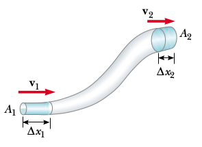

# Bernoulli's Eqn

Sureklilik denklemi

$$
A_1 v_1 = A_2 v_2 = \textrm{sabit}
$$

The product of the area and the fluid speed at all points along the
pipe is a constant for an incompressible fluid.

When you press your thumb over the end of a garden hose so that the
opening be- comes a small slit, the water comes out at high speed, as
shown in Figure 15.19. Is the water under greater pressure when it is
inside the hose or when it is out in the air? You can answer this
question by noting how hard you have to push your thumb against the
water inside the end of the hose. The pressure inside the hose is
definitely greater than atmospheric pressure.

