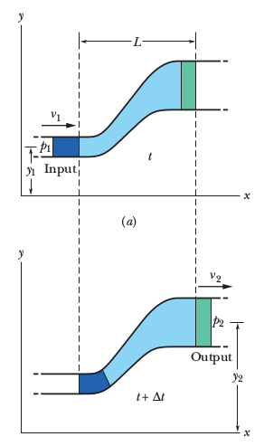

# Bernoulli

İstikrarlı akis halindeki bir sıvıyı düşünelim, alttaki resimdeki gibi
yandan görülen bir tüpte / boruda akıyor. Diyelim ki 1. resim ile
2. resim arasında geçen zaman $\Delta t$ ve o zaman içinde koyu mavi
olan bölüm kadar sıvı hacmi yer değiştiriyor [1, sf 402]. 

Bu değişimin tüp sonunda yeşil bölge kadar hacim değişikliğine yol
açar diyelim, ve önemli bir nokta iki hacim birbirine eşittir.  Eğer
1. resimdeki sıvının girişteki yükseklik, hız, ve basıncı
$y_1,v_1,p_1$ ile temsil ediliyorsa, 2. resimde diğer uçtaki
$y_2,v_2,p_2$ diyelim, bu değişkenler

$$
p_1 + \frac{1}{2} \rho v_1^2 + \rho g y_1 =
p_2 + \frac{1}{2} \rho v_2^2 + \rho g y_2 
$$

formülü ile birbiriyle bağlıdır, ki $\rho$ sıvı yoğunluk
sabiti. Üstteki denklemi

$$
p + \frac{1}{2} \rho v^2 + \rho g y = \textrm{bir sabit}
$$

olarak ta yazabiliriz. Bu son formül Bernoulli'nin formülüdür, onun
daha yaygın bilinen formudur.

Kaynaklar

[1] Resnick, Fundamentals of Physics, 10th Ed

