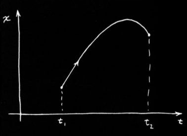
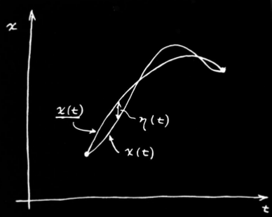

# Lagrange Biçimi (Formalism)

Feynman'dan [3, 19-1].  Diyelim ki bir obje bir noktadan diğerine serbest
hareketle (dışarıdan iteklenmeden, baştan bir ittirmeyle) ilerliyor. Bir
"yerçekim alanında'' hareket ettiği söylenir, fakat bu dünya üzerinde
bariz olanın ilanı, dünyada hareket eden herşey onun yerçekimi
alanında. Neyse, bu şekilde ilerleyen bir objenin $x(t)$ yolunu takip
ettiğini düşünelim. Şimdilik tek bir eksene bakalım, dikey eksen, yani
objenin nasıl yukarı çıkıp aşağı indiği. Eğer $x(t)$'yi zamana göre
grafiklersek diyelim takip edilen yol alttaki gibi,

Bu yol, doğanın zorladığı yol, öyledir ki, yolun her noktasında o noktadaki
kinetik enerji $1/2 m(\mathrm{d} x/\mathrm{d} t)^2$'den potansiyel enerji $mgx$'i
çıkartırsak ve bu farkı $t$ üzerinden entegre edersek (yani bir nevi
averajını alırsak) elde edilen sonuç diğer yollara nazaran en minimal
olandır. Bu entegral,

$$ 
S = \int_{t_1}^{t_2} 
\left[ 
\frac{1}{2} m \left( \frac{\mathrm{d} x}{\mathrm{d} t} \right)^2 - mgx 
\right] \mathrm{d} t
$$

Not: Üstteki fark notasyonel olarak ileride $L = K - P$ olarak görülecek
büyüklük, bazı kaynaklar farkı $T - V$ olarak ta gösterebilir.

Kimi yollarda belki başta çok fazla kinetik enerji olurdu, ama aynı zamanda
aynı notaya gelmek için bu sefer hızlı yavaşlamak gerekirdi, yani doğru
cevap, doğanın optimize ettiği cevap kinetik ve potansiyel enerji arasında
öyle bir denge bulmak ki averaj hızdan fazla sapmadan (yani en az
enerjiyle) bir noktadan diğerine gitmek. 

Asında örnek daha da basitleştirilebilirdi, bu kural diyor ki diyelim bir
serbest parçacık var, üzerinde potansiyel enerji etkisi olmasın, sadece
hıza bakalım, bu parçacığın belli bir zaman içinde bir noktadan diğerine
gitmesi için averaj, sabit hızda gitmesi gerekir. Sabit derken tüm mesafe
bölü istenen zaman, eğer 200 km'yi 2 saatte gideceksek 200 km/h. Niye?
Çünkü parçacık başka bir şekilde gidiyor olsaydı bazen averajdan çok bazen
averajdan az hızla gidiyor olurdu, ve gidilmesi için gereken hız belli,
mesafe bölü zaman. Yani eğer evden ise arabayla belli bir zamanda gitmeniz
gerekiyorsa sabit hızda gidebilirdiniz, ya da başta çok hızlanıp sona yakın
sürekli frene basıp yavaşlayabilirdiniz, belki bazen geri giderdiniz, sonra
ileri, vs. Fakat sabit hız dışında herhangi bir şekilde giderseniz bazen
çok bazen az hızlı gitmiş olurdunuz. Bir ortalama etrafında sürekli sapma
gösteren bir değişkenin karesinin ortalaması her zaman ortalamanın
karesinden fazladır. Bunu {\em İstatistik, Beklenti, Varyans, Kovaryans ve
  Korelasyon} yazından gördük,

$$ Var(Y) = E( Y^2  - 2YE(Y) + (E(Y)^2) )$$

$$  = E(Y^2)  - 2E(Y)E(Y) + (E(Y)^2)$$

$$ Var(Y) = E(Y^2) - (E(Y)^2)$$

$E(Y^2)$ karenin ortalaması, $E(Y)^2$ ortalamanın karesi. İlki ikinciden
büyük çünkü eşitliğin sol tarafında varyasyon $Var(Y)$ var. 

Potansiyel enerjiyi dahil edince aradaki averaj farkın minimal olduğu yol
takip ediliyor, potansiyel ve kinetik enerji arasında bir al-ver ilişkisi
var, top atsak yukarı yukarı giderken potansiyeli artıyor, artıyor ama hızı
yavaşlıyor; ya da aşağı düşerken potansiyel azalıp kinetik enerji artıyor,
bu al-ver ilişkisinin basit bir çıkartma ile yakalayabiliyoruz. 

Bu prensibe dayalı olarak Newton kanunları türetilebilir. Öyle bir yol
$\underline{x}(t)$ var ki bu optimal yol, o yol bazlı olarak hesaplanan
$S$'nin birinci derece yaklaşıklamasının optimal yoldan farkı
sıfırdır. Yani bir anlamda optimizasyon problemlerinde türevi sıfıra
eşitleyip çözdüğümüz gibi (1. derece yaklaşıksallama) burada da
$\underline{x}(t)$'dan ufak bir sapma $\eta(t)$ hayal edebiliriz, ve ana
formülde $x(t) = \underline{x}(t) + \eta(t)$ ile açılım yapıp elde edilen
sonucu $\underline{x}$ noktasındaki $\underline{S}$'ten çıkartıp sıfıra
eşitleyip çözebiliriz, optimalliğin bize hangi formülleri sunduğuna
bakabiliriz. 

Ana formülü tekrar yazalım ve potansiyeli $V(x)$ ile belirtelim,

$$ 
S = \int_{t_1}^{t_2} 
\left[ 
\frac{m}{2} \left( \frac{\mathrm{d} x}{\mathrm{d} t} \right)^2 - V(x)
\right] \mathrm{d} t
$$

Yerine koyduktan sonra

$$ 
S = \int_{t_1}^{t_2} 
\left[ 
  \frac{m}{2} 
   \left(  \frac{\mathrm{d} \underline{x}}{\mathrm{d} t} + \frac{\mathrm{d} \eta}{\mathrm{d} t} \right)^2 - 
   V(\underline{x})
\right] \mathrm{d} t
$$

Karesel işlemi açalım, 

$$ 
\left( \frac{\mathrm{d} \underline{x}}{\mathrm{d} t}\right)^2 + 
2 \frac{\mathrm{d} \underline{x}}{\mathrm{d} t} \frac{\mathrm{d} \eta}{\mathrm{d} t} +
\left( \frac{\mathrm{d} \eta}{\mathrm{d} t}\right)^2
$$

Birinci yaklaşıksallamaya baktığımız için $\eta^2$ içeren tüm terimleri
"iki veya daha fazla derece'' denen bir kutuya atabilirim, 

$$ 
\frac{m}{2} \left( \frac{\mathrm{d} \underline{x}}{\mathrm{d} t}\right)^2 + 
m \frac{\mathrm{d} \underline{x}}{\mathrm{d} t} \frac{\mathrm{d} \eta}{\mathrm{d} t} + 
(\textrm{iki veya daha fazla derece})
$$

Potansiyel $V$'ye gelelim. $\eta$'yi çok ufak bir değişim kabul ettiğim
için $V(x)$'in $\underline{x}$ yakınında Taylor açılımını kullanabilirim, 

$$ 
V(\underline{x} + \eta) = 
V(\underline{x}) + \eta V'(\underline{x}) + 
\frac{\eta^2}{2}V''(\eta) + ...
$$

Her şeyi bir araya koyuyorum, $\eta^2$ içeren terimler daha önceki kutuya
düşecek tabii, 

$$ 
S = \int_{t_1}^{t_2} \left[
\frac{m}{2} \left( \frac{\mathrm{d} \underline{x}}{\mathrm{d} t}^2 \right)^2
- V(\underline{x}) 
+ m \frac{\mathrm{d} \underline{x}}{\mathrm{d} t} \frac{\mathrm{d} \eta}{\mathrm{d} t} 
- \eta V'(\underline{x}) + (\textrm{iki veya daha fazla derece})
\right] \mathrm{d} t 
$$

Şimdi ilk iki terime bakarsak bu terimlerin optimal yol $\underline{x}$
için hesaplayacağım formülde de aynen bu şekilde olacağını görebilirdim. O
zaman $S$ ile $\underline{S}$ arasındaki farkı alırken bu terimler
yokolacak, geri kalanları (ve ikinci derece ve fazlası terimleri atarak)
aradığım fark $\delta S$ diyeceğim büyüklükte kullanabilirim.

$$ 
\delta S = \int_{t_1}^{t_2} \left[ 
m \frac{\mathrm{d}\underline{x}}{\mathrm{d} t} \frac{\mathrm{d}\eta}{\mathrm{d} t} - \eta V'(\underline{x})
\right] \mathrm{d} t 
\qquad (5)
$$

Artık diyebilirim ki $\underline{x}$'in ne olduğunu bilmiyorum, ama her ne
olursa olsun üstteki entegral (fark) sıfır olmalı. Şimdi $\eta$ türevinden
kurtulmak istiyoruz, $\eta$'nin herhangi bir şey olabileceğini söyledik, ve
görmek istediğimiz "$\eta$ çarpı birşeyler'' ki o birşeylerin sıfır olması
gerekeceğinden hareketle ileri gidebilelim. Parçalı entegral alarak bunu
yapabiliriz, parçalı entegral genel formu hatırlarsak,

$$ 
\int u \mathrm{d} v = uv - \int v \mathrm{d} u
$$

$u = m \frac{\mathrm{d}\underline{x}}{\mathrm{d} t}, \quad \mathrm{d} v = \frac{\mathrm{d} \eta}{\mathrm{d} t}$

O zaman (5) şu şekilde yazılabilir,

$$ 
= m \frac{\mathrm{d} \underline{x}}{\mathrm{d} t} \eta \bigg\vert_{t_1}^{t_2} 
- \int_{t_1}^{t_2} \frac{\mathrm{d}}{\mathrm{d} t} \left( m \frac{\mathrm{d} \underline{x}}{\mathrm{d} t} \eta(t) \mathrm{d} t\right)
- \int_{t_1}^{t_2} V'(\underline{x}) \eta(t) \mathrm{d} t
$$

İlk terim yokolacak çünkü $\eta$'nin $t_1,t_2$'de sıfır olması gerektiğini söyledik,

$$ 
\delta S = 
\int_{t_1}^{t_2} \left[ 
-m \frac{\mathrm{d}^2 \underline{x}}{\mathrm{d} t^2} - V'(\underline{x})
\right] 
\eta(t) \mathrm{d} t
$$

İstediğimiz forma eriştik. Üsttekinin sıfır olması için köşeli parantez
içindekinin sıfır olması gerekir, yani

$$ 
\left[ 
-m \frac{\mathrm{d}^2 \underline{x}}{\mathrm{d} t^2} - V'(\underline{x})
\right]  = 0
$$

olmalı. İşte Newton'un $F = ma$ formuna eriştik! Birinci terim kütle çarpı
ivme (ikinci türev), ikinci terim potansiyel enerjinin türevi, yani kuvvet.

Newton Yönünden Lagrange Yönüne

Aynen Lagrange formalizminden Newton'un ikinci kanununu elde ettiğimiz gibi ters
yönde de gidebilirdik. Bu öteki yönü göstermeden önce şu soruyu soralım, bu
başlangıç noktalarından hangisi daha asıl / temel olanıdır? İkisi de aşağı
yukarı aynı seviyede aslında.. Lagrange formülü kinetik ve potansiyel enerji
farkından bahsetti, fakat bu kavram biraz "denesem acaba ne çıkar?'' gibi bir
akıllıca tahmininin sonucuydu. Daha temel bir kanuna dayanarak bulunmuş bir
seçim değildi. Ayrıca literatür bu seçimin doğruluğunun ispatı olarak Newton
kanununa erişmeyi gösteriyor, demek ki Newton kanunu daha temel. Gerçi Newton
kanunlarının altında yatan daha baz kuvvetler olmalı. Bu konular Fizik alanının
şu anda meşgul olduğu konular.

Önceki derste gördüğümüz Euler denkleminden başlayalım, değişkenlerde birkaç
değişim yapalım, $y(x)$ yerine $x(t)$ olsun, o zaman denklem,

$$
\frac{\partial F(t,x,\dot{x})}{\partial x} - 
\frac{\mathrm{d} }{\mathrm{d} t} \frac{\partial F(t,x,\dot{x})}{\partial \dot{x}} = 0
$$

Newton kuralı nedir? Bir potansiyel $V(x)$'nin yarattığı kuvvet etkisi altındaki
bir noktasal kütle $m$ eksen $x$ boyunca hareket ediyor [1, sf. 499]. Kinetik
enerji $T$ ve potansiyel enerji $V$ olsun. Bu durumda hareket kanunu

$$
m \frac{\mathrm{d}^2 x}{\mathrm{d} t^2} = -V'(x)
$$

ya da

$$
m \frac{\mathrm{d}^2 x}{\mathrm{d} t^2} + V'(x) = 0
$$

Eğer $\dot{x} = \frac{\mathrm{d} x}{\mathrm{d} t}$ kabul edersek üsttekini

$$
\frac{\mathrm{d} V}{\mathrm{d} x} + \frac{\mathrm{d}}{\mathrm{d} t} (m\dot{x}) = 0
$$

ya da

$$
\frac{\mathrm{d} (-V)}{\mathrm{d} x} -
\frac{\mathrm{d}}{\mathrm{d} t}
  \left[
     \frac{\mathrm{d} }{\mathrm{d} \dot{x}} \left( \frac{m\dot{x}^2}{2} \right)
  \right] =0 
$$

$\mathrm{d} / \mathrm{d} x$ dışarı çekince nasıl $\frac{m\dot{x}^2}{2}$ elde edildiğini
görüyoruz herhalde, eğer $\mathrm{d} / \mathrm{d} \dot{x}$ türevini uygulasak $m\dot{x}$
elde ederdik. Diğer yandan $\frac{m\dot{x}^2}{2} = \frac{1}{2} m\dot{x}^2$
kinetik enerji değil midir? Eğer hız $v = \dot{x}$ dersek daha da tanıdık
forma erişiyoruz, $T = \frac{1}{2} mv^2$.

Üstte kinetik enerji için $T$ kullanalım,
  
$$
\frac{\mathrm{d} (-V)}{\mathrm{d} x} -
\frac{\mathrm{d}}{\mathrm{d} t}
  \left[ \frac{\mathrm{d} (T)}{\mathrm{d} \dot{x}} \right] =0 
$$

$T$ değişkeni $x$'den bağımsızdır, enerji nerede olursak olalım aynıdır, $V$
değişkeni de $\dot{x}$ yani hızdan bağımsızdır. Bu durumda

$$
\frac{\partial T}{\partial x} = 0, \quad
\frac{\partial V}{\partial \dot{x}} = 0
$$

olacaktır. Eğer sıfır getirecek her türevi kendi grubu içine koyarsak üstteki
sonucu değiştirmemiş oluruz,

$$
\frac{\partial }{\partial x} \left( T - V  \right) -
\frac{\mathrm{d}}{\mathrm{d} t} \left( \frac{\partial }{\partial \dot{x}} (T - V)  \right) = 0
$$

Eger $L = T - V$ dersek,

$$
\frac{\partial L}{\partial x} - \frac{\mathrm{d}}{\mathrm{d} t} \frac{\partial L}{\partial \dot{x}} = 0
$$

şeklindeki ünlü Euler-Lagrange formuna erişmiş oluyoruz. Varyasyonel problemleri
çözmek için tipik olarak

$$
S = \int_{t_1}^{t_2} L \mathrm{d} t
$$

entegrali çözülür.

Hangisi Daha Temel

Akla şu soru gelebilir. Potansiyel eksi kinetik enerji kullanan Lagrange
formundan Newton kanununa erişiyoruz, fakat biraz önce gördüğümüz gibi ters
yönde de gidebiliyoruz. Bunlardan hangisi daha temeldir (fundamental)? Hangisi
fiziksel dünyanın esas işleyişini tarif eder ki diğer formülasyonlar ondan
türetilsin?

Her ne kadar Feynman $T - V$ yaklaşımına çok güzel bir açıklama getirmiş olsa da
bu açıklama fiziğin temel kanunu olarak kullanılamıyor.

Diğer bir yaklasim Maupertuis tarafından ortaya atılmıştır, daha sonra Euler bu
açıklamayı kullanarak kütle çarpı hız çarpı alınan mesafe şeklinde bir $\int
mvds$ entegrali kurgulamıştır ve bu entegral ile de Euler-Lagrange formuna
erişilebilir. Acaba Maupertuis formülü mü daha temeldir?

Ne yazık bu formül de akıllı tahminsel (heuristic) öğeler içeriyor. Yani daha
temel kavramlara dayanmadan diyorsunuz ki onu şununla, sonra bununla çarpayım,
optimize edeyim bakalım ne olacak?  Newton kanununa erişince diyorsunuz ki "ah
demek ki doğru seçim yapmışım''. Bu da yeterince temel değildir.

Eğer başarı kıstası Newton kanunlarına erişmek ise o zaman denebilir ki Newton
daha temeldir. Bu doğrudur. Fakat Newton kanunlarının da nereden geldiğini hala
bilmiyoruz. Doğru ölçümleri açıklayan bir formülasyondur, fakat mesela
yerçekimin nasıl işlediğini bilmediğimiz için (Einstein da bunu yapamadı)
bu kanunları temelden aciklayan kavramlar hala elimizde yok.

Bildiklerimiz şunlar, Lagrange formülasyonu daha çetrefil sistemlerin dinamik
formüllerini bulmak için faydalıdır, bu tür bir örneği ileride göreceğiz.

Kaynaklar

[1] Zeldovich, *Elements of Applied Mathematics*

[3] Feynman, *Feynman's Lectures on Physics, Millenial Edition, Vol 2*

