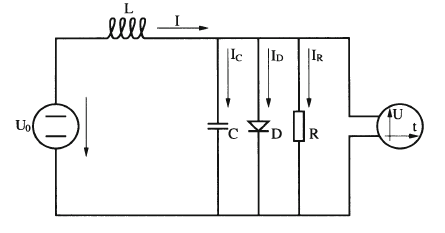
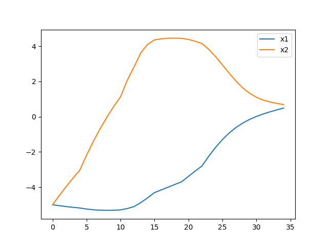
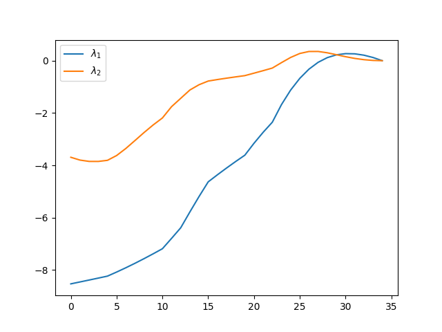
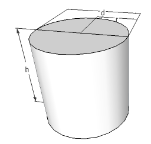

# Sayısal Kontrol ve Sınır Değer Problemleri (BVP)

Bu bölümde optimal kontrol problemlerini sayısal çözmenin yöntemlerini
göreceğiz. 

Rayleigh Problemi

Bir elektrik devresi düşünelim, bu devre düz voltajı salınıma çevirebiliyor, 



Devreyi sol taraftan verilen $U_0(t)$ ile kontrol etmek mümkün [1,
sf. 189], [2, sf. 413]. Devreninin denklemi

$$
\ddot{x} = -x(t) + \dot{x}(t) ( 2.0 - p \dot{x}(t)^2 ) +  u(t)
$$

ki biz $p = 0.1$ seçeceğiz, ve konum değişkeni $x(t)$ $t$ anındaki elektrik
akımı $I$'yı temsil ediyor. ODE sistemini çıkartmak için $x_1 = x$,
$x_2 = \dot{x}$ dersek,

$$
\dot{x_2} = -x_1 + (2.0 - 0.1 x_2^2)x_2 + 4 u(t)
$$

Acaba $x_1(t=0)=-5$ ve $x_2(t=0)=-5$ başlangıç şartları için,
$t_f=2.5$ anına kadar kontrolü ve salınımı az seviyede tutmaya
çalışsak nasıl bir kontrol uygulamamız gerekir?

Yani minimize etmek istedigimiz, 

$$
J(u) = \int_{0}^{2.5} V  \mathrm{d} t = \int_{0}^{2.5} (x_1^2 + u^2)  \mathrm{d} t
$$

ki $V = x_1^2 + u^2$.

Not: Üstteki formül tam formül $J(u) = \phi(x(t_f) + \int_{0}^{2.5} V  \mathrm{d}
t$ formulunden biraz farklı, $\phi$ yok, yani varılan son konum için bir
bedel tanımlanmadı. Bunun sonucu $\lambda(t_f)$'in sıfır olmasıdır.

Hamiltonian'ı tanımlarken

$$
\mathcal{H} = V + \lambda^T f
$$

formülü verilmişti. $f$ formülü üstte görülen $\dot{x}_1$ ve
$\dot{x}_2$'den oluşuyor tabii.

Şimdi $\mathcal{H}$'yi sembolik olarak bulalım,

```python
import sympy

u, x1, x2, lam1, lam2 = sympy.symbols('u x1 x2 lam1 lam2')
x = sympy.Matrix([[x1],[x2]])
lam = sympy.Matrix([[lam1],[lam2]])
f = sympy.Matrix([[x[1]],[  -x[0]+(2.0 - 0.1*x[1]**2)*x[1] + 4*u ]])
V = x[0]**2 + u**2
H = V + lam.T.dot(f)
print (H)
print (sympy.latex(H))
```

```
lam1*x2 + lam2*(4*u - x1 + x2*(2.0 - 0.1*x2**2)) + u**2 + x1**2
lam_{1} x_{2} + lam_{2} \left(4 u - x_{1} + x_{2} \left(2.0 - 0.1 x_{2}^{2}\right)\right) + u^{2} + x_{1}^{2}
```


$$
\mathcal{H} = \lambda_{1} x_{2} + \lambda_{2} \left(4 u - x_{1} + x_{2} \left(2.0 - 0.1
x_{2}^{2}\right)\right) + u^{2} + x_{1}^{2}
$$

Eğer bu formülü biraz masajlarsak, [2]'deki sonucu elde ederiz,

$$
= x_1^2 + u^2 + \lambda_1 x_2 - \lambda_2
\left( x_1 - 4u + x_2 \left( \frac{x_2^2}{10} - 2 \right)  \right)
$$

$\dot{\lambda} = -(\partial \mathcal{H} / \partial x)^T$ ve  $\lambda(t_f) = (\partial \phi / \partial x)^T$ üzerinden ,

```python
lam_dot = -sympy.diff(H, x).T
print (lam_dot)
```

```
Matrix([[lam2 - 2*x1, -lam1 - lam2*(2.0 - 0.3*x2**2)]])
```


$$
\left[\begin{array}{c}
\dot{\lambda_1} \\ \dot{\lambda_2} 
\end{array}\right] =
\left[\begin{array}{c}
\lambda_2 - 2 x_1 \\
\lambda_1 \left( \frac{3 x_2^2}{10} - 2  \right) - \lambda_1
\end{array}\right],
\quad
\left[\begin{array}{c}
\lambda_1(t_f) \\ \lambda_2(t_f) 
\end{array}\right] =
\left[\begin{array}{c}
0 \\ 0
\end{array}\right]
$$

Optimal kontrol girdisi için $u(t)$'yi için bir çözüm bulmayı gerektiriyor,

```python
u, x1, x2, lam1, lam2 = sympy.symbols('u x1 x2 lam1 lam2')
HH = lam1*x2 + u**2 + x1**2 - lam2*(x1 - 4*u + x2*(x2**2/10 - 2))
uopt = sympy.solve(HH.diff(u),u)[0]
print ( uopt )
```

```
-2*lam2
```

Yani

$$
u^\ast(t) = -2 \lambda_2(t)
$$

sonucuna eriştik. Bulduğumuz optimal $u^\ast$ değerini $f$ denklemindeki
$u$'lar yerine koyarsak,

```python
x_dot = f.subs({u: uopt})
print (x_dot)
```

```
Matrix([[x2], [-8*lam2 - x1 + x2*(2.0 - 0.1*x2**2)]])
```

Daha önceden bulduğumuz $\dot{\lambda}$ formülünü hatırlayalım,

```python
print (lam_dot)
```

```
Matrix([[lam2 - 2*x1, -lam1 - lam2*(2.0 - 0.3*x2**2)]])
```

Artık elimizde bir iki noktalı sınır problemi var, bu problemi sayısal
olarak çözebiliriz. 

$$
\left[\begin{array}{c}
\dot{x}_1 \\ 
\dot{x}_2 \\ 
\dot{\lambda}_1 \\ 
\dot{\lambda}_2 
\end{array}\right] = 
\left[\begin{array}{c}
x_2 \\ 
-x_1 + (2 - 0.1 x_2^2 ) x_2 - 8 \lambda_2 \\
\lambda_2 \\
\lambda_1 \left( \frac{3x_2^2}{10} - 2  \right) - \lambda_1
\end{array}\right], 
\quad
\left[\begin{array}{c}
x_1(0) \\ x_2(0) \\ \lambda_1(t_f) \\ \lambda_2(t_f)
\end{array}\right] = 
\left[\begin{array}{c}
-5 \\ -5 \\ 0 \\ 0
\end{array}\right]
$$


```python
from scipy.integrate import solve_bvp

def fun(x, y):
    return np.vstack((
        y[1],
        -8*y[3] - y[0] - y[1]*(y[1]**2/10.0),
        y[3]-2*y[0],
        y[3]*(3/10*y[1]**2-2) - y[2]
        )
    )

def bc(ya, yb):
    return np.array( [ ya[0]+5, ya[1]+5, yb[2], yb[3] ]   )
                     
t = np.linspace(0, 2.5, 10)
y = np.ones((4, t.size))
sol = solve_bvp(fun, bc, t, y)
print (y.shape)
print (sol.y[0].shape)
```

```
(4, 10)
(35,)
```

```python
df = pd.DataFrame()
df['x1'] = sol.y[0]
df['x2'] = sol.y[1]
df.plot()
plt.savefig('phy_num_02.png')
```



```python
df = pd.DataFrame()
df['$\lambda_1$'] = sol.y[2]
df['$\lambda_2$'] = sol.y[3]
df.plot()
plt.savefig('phy_num_03.png')
```



```python
df = pd.DataFrame()
df['u'] = -2*sol.y[3]
df.plot()
plt.savefig('phy_num_04.png')
```


Son grafikte optimal kontrol politikasını görüyoruz. 

Fonksiyon ve Fonksiyonel Optimizasyonu, Lagrangian, Hamiltonian

Fonksiyon*el*den önce fonksiyon optimizasyonuna bakalım. Bu yazıda
özellikle şartlı durumlar içeren optimizasyonlara bakacağız. Eğer elimizde
bir bedel fonksiyonu var ise, bir diğer fonksiyonu Lagrange çarpanları
yöntemi ile minimize edebiliriz.

Örnek

Bir depo üreticisi, silindir şeklinde ürettiği depoların eldeki sabit
materyel ile maksimum hacim kapsayacak şekilde üretilmesini istiyor. Eğer
materyelin (mesela demir olabilir) deponun her yerinde sabit kalınlıkta
olacağını farz edersek, deponun ölçütleri ne olmalıdır? [3, sf. 42]



Çözüm

Aynı kalınlıkta materyel olacaksa, ve sabit materyel de olduğuna göre, depo
dış alanının da sabit olması gereklidir. O zaman bu problem 'verili bir
silindir dış alanına sahip en maksimal hacmi verecek depo boyutları nedir?'
sorusuna dönüştü. Diyelim $d$ deponun çapı, $h$ yüksekliği. O zaman hacim

$$
V(d,h) = \pi d^2 h / 4
$$

Alan

$$
A(d,h) = 2 \pi d^2 / 4 + \pi d h = A_0
$$

$\pi d h$ nereden geldi? Bu silindirin yan taraflarını iki dikdörtgen
olacak şekilde açabilirdik, bu dikdörtgenlerin bir kenarı
$\pi r = \pi \cdot d/2$, yüksekliği $h$, onlardan iki tane var, toplam alan
$\pi \cdot d/2 \cdot h \cdot 2 = \pi d h$. Alt ve üstte iki tane daire var
zaten, her biri $\pi \left( \frac{d}{2} \right)^2$ iki tane
$2 \pi d^2 / 4$. 

Amacımız $A(d,h) = A_0$ seviyesinde tutarken (bu bir kısıtlama, şart)
$V(d,h)$'yi maksimize etmek. 

Lagrange çarpanlarıyla bu işi yapabiliriz, hem ana fonksiyonu hem de
şartları birleştirip yeni bir genişleştirilmiş fonksiyon yaratırız, ve bu
yeni fonksiyonun ekstrem noktasını klasik yöntemle buluruz, tüm
değişkenleri üzerinden kısmı türevlerini alıp sıfıra eşitleriz, ve tüm bu
denklem sistemini çözeriz. 

Maksimize edilecek hacim formülünü 

$$
f(d,h) = \pi d^2 h / 4
$$

olarak yazalım, tatmin edilecek kısıtlamayı

$$
g(d,h) = 2 \pi d^2 / 4 + \pi d h - A_0 = 0
$$

Şimdi *Lagrangian* adı verilen yeni bir birleşmiş fonksiyon 

$$
\mathcal{L}(d,h,\lambda) = f(d,h) + \lambda g(d,h) 
$$

$$
= \pi d^2 h / 4 + \lambda (2 \pi d^2 / 4 + \pi d h - A_0 )
$$

yaratılır, ki Lagrange çarpanı denilen $\lambda$ daha
bilinmiyor. Lagrangian $\mathcal{L}$ üç değişkenin fonksiyonu olduğuna göre
$\mathcal{L}$'in bu üç değişkene göre kısmi türevini alıp sıfıra eşitlemek
gerekiyor. 

$$
\frac{\partial \mathcal{L}}{\partial d} = \pi d h / 2 + \lambda (\pi d + \pi h) = 0
$$

$$
\frac{\partial \mathcal{L}}{\partial h} = \pi d^2 / 4 + \lambda (\pi d) = 0 
$$

$$
\frac{\partial \mathcal{L}}{\partial \lambda} = 2\pi d^2 / 4 + \pi d h - A_0 = 0
$$

Üstteki üç denklemi çözünce 

$$
d^\ast = \sqrt{\frac{2 A_0}{3 \pi}}, \quad
h^\ast = \sqrt{\frac{2 A_0}{3 \pi}}, \quad
\lambda^\ast = -\sqrt{\frac{A_0}{24 \pi}}
$$

Bu sonuçlar diyor ki silindirsel deponun hacmini maksimize etmek için onun
çapını ve yüksekliğini aynı tutmalıyız. 

Hamiltonian Biçimi 

Daha önce Lagrangian biçimini gördük, $x=x(t)$, $u=u(t)$,
$\dot{x}=\dot{x}(t)$, $\lambda=\lambda(t)$ olmak üzere, sistem denklemi

$$
\dot{x} = f(x, u, t)
$$

idi, sınır şartları $x(t_0)$ sabit, $x(t_f)$ serbest
bırakılmış. Performans ölçütü bizim tanımlayabileceğimiz bir $V$
üzerinden basit haliyle şöyleydi,

$$
J(u) = \int_{t_0}^{t_f} V(x, u, t) \mathrm{d} t
$$

Sınır şartı $g$ sistem denklemi üzerinden,

$$
g(x, \dot{x}, u, t) = f(x, u, t) - \dot{x} = 0
$$

Lagrangian'i oluşturalım ($g$ burada), 

$$
\mathcal{L} = \mathcal{L}( x, \dot{x}, u, \lambda, t) =
V( x, u, t) +  \lambda^T g 
$$

$$
= V(x, u, t) +  \lambda^T \big\{ f(x, u, t) - \dot{x} \big\}
\qquad (4)
$$


Performans ölçütü şimdi şöyle oldu,

$$
J_a(u) = \int_{t_0}^{t_f} \mathcal{L}( x, \dot{x}, u, \lambda, t)
$$

Eğer Hamiltonian biçimine geçmek istiyorsak, bir $\mathcal{H}$ tanımlarız,

$$
\mathcal{H}(x, u, \lambda, t) = V( x, u, t) + \lambda^T f(x, u, t)
$$

o zaman Lagrangian $\mathcal{H}$ formu da şu hale gelir,

$$
\mathcal{L}( x, \dot{x}, u, \lambda, t) = 
\mathcal{H}(x, u, \lambda, t) - \lambda^T \dot{x}
\qquad (5)
$$

Bu aslında (4)'ün açılmış hali, ve o ilk bölümün $\mathcal{H}$ olarak tanımlanması,

$$ 
\mathcal{L} = \underbrace{V( x, u, t) + \lambda^T f( x, u, t))}_{\mathcal{H}} - 
\lambda^T \dot{x}(t) 
$$ 

Şimdi Euler-Lagrange işlemini hatırlayalım, eldeki değişkenler
$x,\lambda,u$ üzerinden bu denklemler

$$
\left( \frac{\partial \mathcal{L}}{\partial x} \right) -
\frac{\mathrm{d}}{dt} \left( \frac{\partial \mathcal{L}}{\partial \dot{x}} \right) 
= 0 
\quad
\textrm{konum (state) denklemi}
$$

$$
\left( \frac{\partial \mathcal{L}}{\partial \lambda} \right) -
\frac{\mathrm{d}}{dt} \left( \frac{\partial \mathcal{L}}{\partial \dot{\lambda}} \right) 
= 0
\quad
\textrm{eşkonum (costate) denklemi}
$$

$$
\left( \frac{\partial \mathcal{L}}{\partial u} \right) -
\frac{\mathrm{d}}{dt} \left( \frac{\partial \mathcal{L}}{\partial \dot{u}} \right) 
= 0
\quad
\textrm{kontrol (control) denklemi}
$$

Üstte belirtildiği gibi bu denklemlere konum, eşkonum, kontrol
denklemleri ismi veriliyor. Şimdi biz bu türetmeyi içinde
$\mathcal{H}$ olan $\mathcal{L}$ için yapacağız, çünkü bu şekilde
belli daha uygun formlar elde etmek istiyoruz, yani (4) denklemini baz
alarak, üstteki üç formülü uygulayınca,

$$
\frac{\partial \mathcal{L}}{\partial x} = 
\frac{\partial \mathcal{H}}{\partial x} - 
\frac{\mathrm{d}}{\mathrm{d} t} \left( -\lambda \right)   = 0
$$

$$
\frac{\partial \mathcal{L}}{\partial \lambda} = 
\frac{\partial \mathcal{H}}{\partial \lambda} - \dot{x} -
\frac{\mathrm{d}}{\mathrm{d} t} \left( 0 \right)   = 0
$$

$$
\frac{\partial \mathcal{L}}{\partial u} = 
\frac{\partial \mathcal{H}}{\partial u} - 
\frac{\mathrm{d}}{\mathrm{d} t} \left( 0 \right)   = 0
$$

Ve bu türetme üzerinden konum, eşkonum, kontrol denklemlerinin yeniden
düzenlenmiş hali şöyle olur,

$$
\dot{x} = + \left( \frac{\partial \mathcal{H}}{\partial \lambda} \right)
$$

$$
\dot{\lambda} = - \left( \frac{\partial \mathcal{H}}{\partial x} \right)
$$

$$
0 = + \left( \frac{\partial \mathcal{H}}{\partial u} \right)
$$


Üstteki son denklem Hamiltonian $\mathcal{H}$'nin kontrol $u$'ya göre
nasıl optimize edileceğini gösteriyor. Yani $J$ fonksiyonelin sistem
denklemine göre optimize edilmesi problemi şimdi Hamiltonian
fonksiyonunun $u$ bazında optimize edilmesi problemine
dönüştü. Böylece orijinal fonksiyonel optimizasyonunu normal bir
fonksiyon optimizasyon problemine indirgemiş olduk [3, sf. 86].

Örnek [3, sf. 70]

Çift entegre edici (double-integrator) sistemine bakalım. 

$$
\dot{x}_1(t) = x_2(t)
$$

$$
\dot{x}_2(t) = u(t)
$$

Performans ölçütü 

$$
J = \frac{1}{2} \int_{t_0}^{t_f} u^2 \mathrm{d} t
$$

Yani $u(t)$'nin, tüm değerlerinin, ortalama olarak fazla büyük
olmasını istemiyoruz. Sınır şartları $\underline{x} =
\left[\begin{array}{cc} x_1 & x_2 \end{array}\right]^T$ 
olmak üzere,

$$
\underline{x}(0) = \left[\begin{array}{cc} 1 & 2 \end{array}\right]^T \quad 
\underline{x}(2) = \left[\begin{array}{cc} 1 & 0 \end{array}\right]^T 
$$

Yazının geri kalanında $\underline{x}$, vs. kullanılmayacak, çerçeveden
boyut tahmin edilebilir.

Çözüm

Hamiltonian'ı oluşturalım çünkü tüm sonuç türevleri ona göre alınıyor
artık; o zaman $V,\lambda,f$ gerekiyor. 

$$
V(x,u,t) = V(u) = \frac{1}{2} u^2
$$

$$
f(x,u,t) = \left[\begin{array}{cc} f_1 & f_2 \end{array}\right]^T
$$

oyle ki $f_1 = x_2(t)$, $f_2 = u(t)$. 

Hamiltonian

$$
\mathcal{H} = \mathcal{H}(x_1, x_2, u, \lambda_1, \lambda_2)
$$

$$
= V(u) + \lambda^T f(x,u)
$$

$$
= \frac{1}{2} u^2 + \lambda_1 x_2 + \lambda_2 u 
$$

Optimal $u^\ast$'yu bulmak için $\frac{\partial \mathcal{H}}{\partial u}$
denklemini kullanıyoruz,

$$
\left( \frac{\partial \mathcal{H}}{\partial u} \right) = 0 \to
u^\ast + \lambda_2^\ast = 0
$$

$$
u^\ast = -\lambda_2^\ast
$$

Optimal $\mathcal{H}$'yi bulmak için üstteki değerleri üç üstteki
formüle sokuyoruz, 

$$
\mathcal{H}^\ast(x_1^\ast, x_2^\ast,\lambda_1^\ast,\lambda_2^\ast) = 
\frac{1}{2} \lambda_2^\ast + \lambda_1^\ast x_2^\ast - \lambda_2^\ast 
$$

$$
= \lambda_1^\ast x_2^\ast - \frac{1}{2} {\lambda_2^\ast}^2  
$$

Devam edersek, $\dot{x} = \left( \frac{\partial \mathcal{H}}{\partial
\lambda} \right)$  denkleminden hareketle,

$$
\dot{x}^\ast_1 = \left( \frac{\partial \mathcal{H}}{\partial \lambda_1} \right) =
x_2^\ast
$$

$$
\dot{x}^\ast_2 = \left( \frac{\partial \mathcal{H}}{\partial \lambda_2} \right) =
\lambda_2^\ast
$$

Ve $\dot{\lambda} = - \left( \frac{\partial \mathcal{H}}{\partial x}
\right)$ denkleminden hareketle,

$$
\dot{\lambda}_1^\ast = - \left( \frac{\partial \mathcal{H}}{\partial x_1} \right) = 0
$$

$$
\dot{\lambda}_2^\ast = - \left( \frac{\partial \mathcal{H}}{\partial x_2} \right) = 
- \lambda_1^\ast
$$

```python
from sympy import symbols, Eq, Function, dsolve, latex, simplify

t = symbols('t') 
x1,x2,lam1,lam2 = symbols('x1 x2 lam1 lam2',cls=Function)

system = [Eq(x1(t).diff(t), x2(t)), \
          Eq(x2(t).diff(t), -lam2(t)), \
          Eq(lam1(t).diff(t), 0), \
          Eq(lam2(t).diff(t), -lam1(t)),  \
          ]

sol = dsolve(system, [x1(t),x2(t),lam1(t),lam2(t)])
print (latex(simplify(sol[0])))
print (latex(simplify(sol[1])))
print (latex(sol[2]))
print (latex(sol[3]))
```

```
x_{1}{\left(t \right)} = C_{1} + C_{2} t + C_{2} + \frac{C_{3} t^{2}}{2} + C_{3} t + C_{3} + \frac{C_{4} t^{3}}{6} + \frac{C_{4} t^{2}}{2} + C_{4} t + C_{4}
x_{2}{\left(t \right)} = C_{2} + C_{3} t + C_{3} + \frac{C_{4} t^{2}}{2} + C_{4} t + C_{4}
lam_{1}{\left(t \right)} = C_{4}
lam_{2}{\left(t \right)} = - C_{3} - C_{4} t - C_{4}
```

$$
x_{1}{\left(t \right)} = C_{1} + C_{2} t + C_{2} + \frac{C_{3} t^{2}}{2} + C_{3} t + C_{3} + \frac{C_{4} t^{3}}{6} + \frac{C_{4} t^{2}}{2} + C_{4} t + C_{4}
$$

$$
x_{2}{\left(t \right)} = C_{2} + C_{3} t + C_{3} + \frac{C_{4} t^{2}}{2} + C_{4} t + C_{4}
$$

$$
lam_{1}{\left(t \right)} = C_{4}
$$

$$
lam_{2}{\left(t \right)} = - C_{3} - C_{4} t - C_{4}
$$

Sınır şartlarını tanımlayarak çözersek, ve sadece $\lambda_2$'ye
bakarsak (çünkü $u(t)$ sonucunu $u(t) = -\lambda_2^\ast (t)$ olarak bulmuştuk),

```python
ics = { x1(0):1, x2(0):2, x1(2):1, x2(2):0 } 
sol = dsolve(system, [x1(t),x2(t),lam1(t),lam2(t)], ics=ics)
print (latex(sol[3]))
```

```
lam_{2}{\left(t \right) = 4 - 3 t
```

$$
\lambda_{2}{\left(t \right)} = 4 - 3 t
$$

O zaman, 

$$
u = -\lambda_2 = 3t - 4
$$

Ozetlemek gerekirse, aynen bir bedel üzerinden fonksiyon optimize ettiğimiz
gibi, bir fonksiyonel bedel üzerinden bir optimal fonsiyon da
bulabiliriz. Lagrange çarpanları yöntemi hala geçerli, bir birleşmiş
fonksiyonel yaratıyoruz, ve Euler-Lagrange üzerinden bu yeni fonksiyonelin
alt denklemlerini çıkartıyoruz, ve sonra bu diferansiyel sistemini
çözüyoruz.

İki değişken üzerinden bakalım, şu fonksiyonel olsun [3, sf. 48], 

$$
J(x_1(t),x_2(t),t) = J = 
\int_{t_0}^{t_1} V(x_1(t), x_2(t), \dot{x}_1(t), \dot{x}_2(t), t) \mathrm{d} t
$$

kısıtlama şartı (kontrol teorisindeki sistem denklemi buraya geliyor)

$$
g(x_1(t), x_2(t), \dot{x}_1(t), \dot{x}_2(t)) = 0
$$

ve şu sabit uç noktaları geçerli olacak şekilde, 

$$
x_1(t_0) = x_{10}, \quad x_2(t_0) = x_{20}
$$

$$
x_1(t_f) = x_{1f}, \quad x_2(t_f) = x_{2f}
$$

Euler-Lagrange

$$
\left( \frac{\partial \mathcal{L}}{\partial x_1} \right) -
\frac{\mathrm{d}}{dt} \left( \frac{\partial \mathcal{L}}{\partial \dot{x}_1} \right) 
= 0
$$

$$
\left( \frac{\partial \mathcal{L}}{\partial x_2} \right) -
\frac{\mathrm{d}}{dt} \left( \frac{\partial \mathcal{L}}{\partial \dot{x}_2} \right) 
= 0
$$

$$
\left( \frac{\partial \mathcal{L}}{\partial \lambda} \right) -
\frac{\mathrm{d}}{dt} \left( \frac{\partial \mathcal{L}}{\partial \dot{\lambda}} \right) 
= 0
$$

Örnek

Performans değerini

$$
J = \int_{0}^{1} \left[ x^2(t) + u^2(t) \right] \mathrm{d} t
$$

optimize edin ki uç noktalar

$$
x(0) = 1, \quad x(1) = 0
$$

ve kısıtlama (sistem denklemi)

$$
\dot{x}(t) = -x(t) + u(t)
$$

olacak şekilde.

Çözüm

İlk önce sistem denklemini $g$ formunda yazalım,

$$
g( x(t), \dot{x}(t), u(t) ) =  \dot{x}(t) + x(t) - u(t)  = 0
$$

Lagrange çarpanlar yöntemi ile birleşik fonksiyoneli yaratalım,

$$
J = \int_{0}^{1} \left[ 
  x^2(t) + u^2(t) + \lambda(t) \left\{ \dot{x}(t) + x(t) - u(t)  \right\}
\right] \mathrm{d} t
$$

$$
=  \int_{0}^{1} \mathcal{L} (x(t), \dot{x}(t),u(t),\lambda(t)) \mathrm{d} t
$$

Şimdi üstteki Lagrangian üzerinde Euler-Lagrange formülünü uygulayalım, 

$$
\left( \frac{\partial \mathcal{L}}{\partial x_1} \right) -
\frac{\mathrm{d}}{dt} \left( \frac{\partial \mathcal{L}}{\partial \dot{x}_1} \right) =
0 \to 2 x(t) + \lambda(t) - \dot{\lambda}(t) = 0
\qquad (1)
$$

$$
\left( \frac{\partial \mathcal{L}}{\partial u} \right) -
\frac{\mathrm{d}}{dt} \left( \frac{\partial \mathcal{L}}{\partial \dot{u}} \right) =
0 \to 2u(t) - \lambda(t) = 0
\qquad (2)
$$

$$
\left( \frac{\partial \mathcal{L}}{\partial \lambda} \right) -
\frac{\mathrm{d}}{dt} \left( \frac{\partial \mathcal{L}}{\partial \dot{\lambda}} \right) =
0 \to \dot{x}(t) + x(t) - u(t) = 0
\qquad (3)
$$

(2) ve (3) formüllerini birleştirince,

$$
\lambda(t) = 2 u(t) = 2 (\dot{x}(t) + x(t) )
$$

Sonra (1) formülünü dahil edelim,

$$
2 x(t) + 2 (\dot{x}(t) + x(t)) - 2(\ddot{x}(t) + \dot{x}(t) ) = 0
$$

Basitleştirirsek, 

$$
\ddot{x}(t) - 2x(t) = 0
$$

Çözelim,

```python
import sympy

t = sympy.symbols('t')
x = sympy.Function('x')
diffeq = sympy.Eq(x(t).diff(t, t) - 2*x(t),0)
print (sympy.latex (sympy.dsolve(diffeq, x(t))))
```

```
x{\left(t \right)} = C_{1} e^{- \sqrt{2} t} + C_{2} e^{\sqrt{2} t}
```

$$
x{\left(t \right)} = C_{1} e^{- \sqrt{2} t} + C_{2} e^{\sqrt{2} t}
$$

Eğer başlangıç ve bitiş şartlarını verirsek,

```python
diffeq = sympy.Eq(x(t).diff(t, t) - 2*x(t),0)
solved = sympy.dsolve(diffeq, x(t), ics={x(0):1,x(1):0 } ) 
solved = sympy.simplify(solved)
print (sympy.latex (solved))
```

```
x{\left(t \right)} = \frac{\left(e^{2 \sqrt{2} t} - e^{2 \sqrt{2}}\right) e^{- \sqrt{2} t}}{1 - e^{2 \sqrt{2}}}
```

$$
x{\left(t \right)} = \frac{\left(e^{2 \sqrt{2} t} - e^{2 \sqrt{2}}\right) e^{- \sqrt{2} t}}{1 - e^{2 \sqrt{2}}}
$$

Ve $u$ için [3]'e bakarsak, 

$$
u(t) = \dot{x}(t) + x(t) 
$$

olduğu için

$$
u(t) = C_1(1-\sqrt{2}) e^{-\sqrt{2t}} + C_2(1-\sqrt{2}) e^{\sqrt{2t}} 
$$

ki $C_1 = 1/(1-e^{-2\sqrt{2}})$ ve $C_2 = 1/(1-e^{2\sqrt{2}})$

Böylece tanımladığımız bedeli optimize edecek bir kontrol aksiyonu $u$ ve
$x$ elde etmiş olduk. 

Kaynaklar

[1] Bittner, *Variational calculus, optimal control and applications*

[2] Wilson, *Advanced Control using MATLAB*

[3] Naidu, *Optimal Control Systems*


