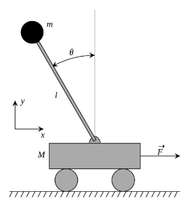
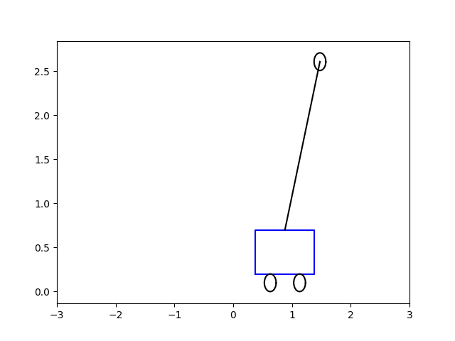
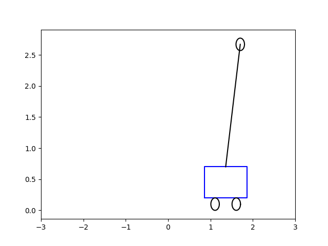
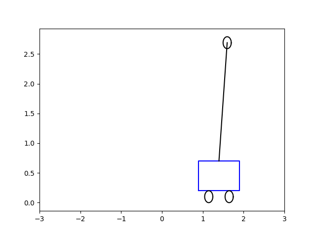
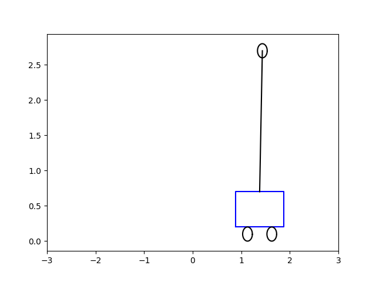
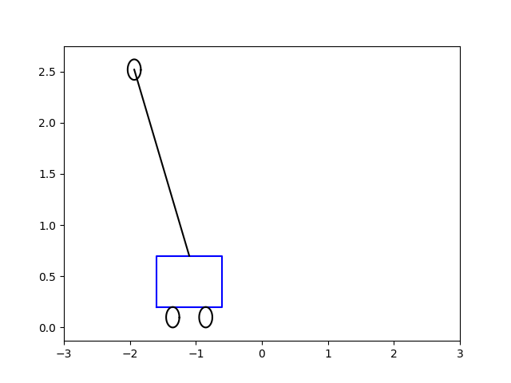
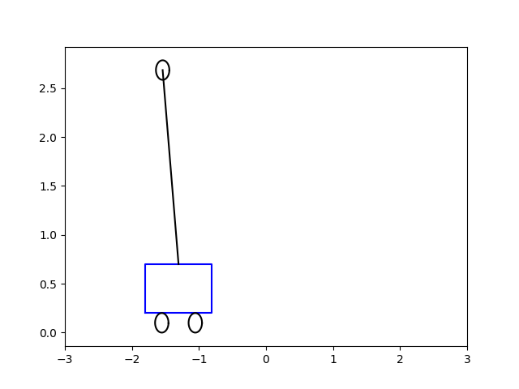
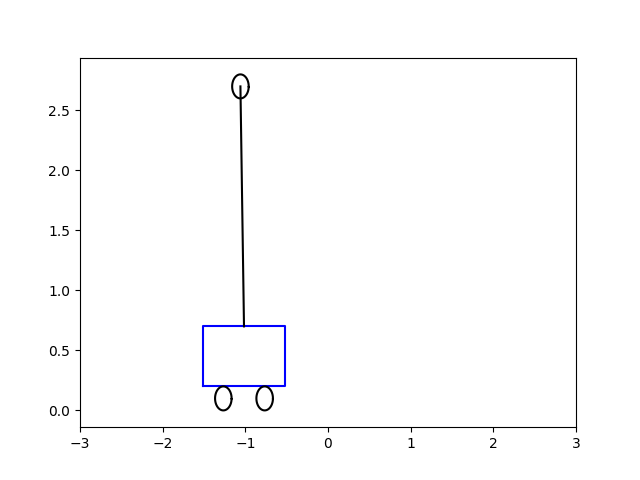

# Direkli Araba, Ters Sarkaç (Cart Pole, Inverted Pendulum)

Sadece sağa ve sola giden bir araba üzerinde duran bir direk var. Bu
direğin üzerinde bir kütle var; acaba bu direği sadece arabaya uygulanan
bir $F$ kuvveti ile sağa sola götürerek dengeleyebilir miyiz? Belki
bazılarımız elimiz üzerinde bir sopayı dengelemeye uğraşmışızdır, yapmaya
çalışacağımız buna çok benziyor.



Sistemin hareket denklemlerini modellemek için Lagrange formüllerini
kullanacağız. $L = K - P$ üzerinden,

$$
L = \frac{1}{2} M v_1^2 + \frac{1}{2} m v_2^2 - m g \ell \cos\theta
$$

$v_1$ arabanın hızı, $v_2$ ise sarkacın hızı. $x(t)$ arabanın yerini
belirleyecek. Hızları yer türeviyle değiştirebiliriz, mesela
$v_1^2 = \dot{x}^2$. Sarkacın hızı $v_2$'yi onun yeri üzerinden tanımlamak
gerekiyor, sarkacın yeri nedir? Onun yatay, dikey kordinatlarına bakalım,
dikey $x-\ell\sin\theta$, dikey $\ell\cos\theta$. Genel
$v^2 = v_x^2 + v_y^2$ formülü üzerinden,

$$
v_2^2 = 
\left( \frac{\mathrm{d}}{\mathrm{d} t} (x - \ell\sin\theta) \right)^2 + 
\left( \frac{\mathrm{d}}{\mathrm{d} t} (x - \ell\cos\theta) \right)^2 
$$

$v_2$'yi basitleştirince, 

$$
v_2^2 = \dot{x}^2 - 2 \ell \dot{x}\dot{\theta}\cos\theta + \ell^2 \dot{\theta}^2
$$

Lagrangian şu hale geliyor,

$$
L = 
\frac{1}{2} (M + m) \dot{x}^2 - 
m \ell \dot{x}\dot{\theta} \cos\theta +
\frac{1}{2} m \ell^2 \dot{\theta}^2 - 
m g \ell \cos\theta
$$

Şimdi Euler-Lagrange denklemlerini yazalım,

$$
\frac{\mathrm{d}}{\mathrm{d} t} \frac{\partial L}{\partial \dot{x}} -
\frac{\partial L}{\partial x}  = F
$$

$$
\frac{\mathrm{d}}{\mathrm{d} t} \frac{\partial L}{\partial \dot{\theta}} -
\frac{\partial L}{\partial \theta}  = 0
$$

İki üstteki denklemde eşitliğin sağ tarafında $F$ var, niye sıfır değil?
Hamilton ve Lagrange-d'Alembert prensibine göre dış kuvvetler bir sisteme
eşitliğin sağ tarafından dahil edilebilir. Ayrıca hıza doğru oranda ters
yönde etki eden bir sürtünme kuvveti $\mu\dot{x}$ de ekleriz. $L$'yi
üstteki denklemlere sokarsak ve basitleştirirsek ters sarkacın hareket
denklemlerini elde ediyoruz.

$$
(M+m) \ddot{x} + 
m \ell \ddot{\theta} \cos\theta - 
m \ell \dot{\theta}^2 \sin\theta + \mu\dot{x} = F
$$

$$
\ell \ddot{\theta} - g \sin\theta + \ddot{x} \cos\theta = 0
$$

Ya da

$$
\left[\begin{array}{rr}
M+m & m l \cos\theta \\ \cos\theta & l
\end{array}\right]
\left[\begin{array}{r}
\ddot{x} \\ \ddot{\theta}
\end{array}\right] 
=
\left[\begin{array}{c}
m l \dot{\theta}^2 \sin\theta - \mu \dot{x} \\
g \sin\theta
\end{array}\right] + 
\left[\begin{array}{r}
1 \\ 0
\end{array}\right] F 
$$

$$
\left[\begin{array}{r}
\ddot{x} \\ \ddot{\theta}
\end{array}\right] 
=
\left[\begin{array}{rr}
M+m & m l \cos\theta \\ \cos\theta & l
\end{array}\right]^{-1}
\left(
  \left[\begin{array}{c}
  m l \dot{\theta}^2 \sin\theta - \mu \dot{x} \\
  g \sin\theta
  \end{array}\right] + 
  \left[\begin{array}{r}
  1 \\ 0
  \end{array}\right] F
\right)
\qquad (1)
$$

Örneğe dönelim; Noktalı kısımları atarsak 1. dereceden bir yaklaşıksallama
ve lineerizasyon elde ediyoruz ve görülen $x^\ast,y^\ast$ noktasındaki değerleri
kullanılan 2x2 matrisi Jacobian matrisidir.

Birinci derece ODE sistemi elde etmek için konum vektörünü tanımlayalım,

$$
\frac{\mathrm{d}}{\mathrm{d} t} \left[\begin{array}{r}
x_1 \\ x_2 \\ x_3 \\ x_4
\end{array}\right] = 
\frac{\mathrm{d}}{\mathrm{d} t} 
\left[\begin{array}{r}
x \\ \theta \\ \dot{x} \\ \dot{\theta}
\end{array}\right]
$$

(1)'den elde edilen matrisin 1. ve 2. satırı sırasıyla alttaki noktalı
yerlere gelecek,

$$
\frac{\mathrm{d}}{\mathrm{d} t} \left[\begin{array}{rrr}
x_1 \\ x_2 \\ x_3 \\ x_4
\end{array}\right] = 
\left[\begin{array}{c}
x_3 \\ x_4 \\ \textrm{.. 1. satır ...} \\ \textrm{.. 2. satır ...}
\end{array}\right]
$$

Görüldüğü gibi $x_1,x_2$'nin ne olduğu basit. $x_3,x_4$ için (1)
denklemindeki matris işlemlerini yapıp 1. ve 2. satırlarını $x_3,x_4$ için
kullanabiliriz. Önce (1) formülündeki gerekli $x_i$ değişken değişimlerini
yaparız,

$$
\left[\begin{array}{rr}
M+m & m l \cos x_2 \\ \cos x_2 & l
\end{array}\right]^{-1}
\left(
  \left[\begin{array}{c}
  m l x_4^2 \sin x_2 - \mu x_3 \\
  g \sin x_2
  \end{array}\right] + 
  \left[\begin{array}{r}
  1 \\ 0
  \end{array}\right] F
\right)
$$

Bu cebirsel olarak oldukca çetrefil bir işlem. `sympy` ile işlemler
daha kolay yapılabilir,

```python
import sympy

x1, x2, x3, x4 = sympy.symbols('x1 x2 x3 x4')
M, m, l, mu, g, F = sympy.symbols('m M l mu g F',constant = True)

a = sympy.Matrix([[M+m, m*l*sympy.cos(x2)],[sympy.cos(x2), l]])

b = sympy.Matrix([m * l * x4**2 * sympy.sin(x2) - mu*x3 + F , g * sympy.sin(x2)])

c = a.inv() * b

sympy.pprint(sympy.latex(sympy.simplify(c)))
```

```
\left[\begin{matrix}\frac{F - \frac{M g \sin{\left(2 x_{2} \right)}}{2} + M l 
x_{4}^{2} \sin{\left(x_{2} \right)} - \mu x_{3}}{M \sin^{2}{\left(x_{2} \right
)} + m}\\\frac{g \left(M + m\right) \sin{\left(x_{2} \right)} - \left(F + M l 
x_{4}^{2} \sin{\left(x_{2} \right)} - \mu x_{3}\right) \cos{\left(x_{2} \right
)}}{l \left(M \sin^{2}{\left(x_{2} \right)} + m\right)}\end{matrix}\right]
```

İki matris satırı elde ettik, bunları yerine koyalım,

$$
\frac{\mathrm{d}}{\mathrm{d} t} \left[\begin{array}{rrr}
x_1 \\ x_2 \\ x_3 \\ x_4
\end{array}\right] = 
\left[\begin{array}{c}
x_3 \\ x_4 \\ 
\frac{F - \frac{M g \sin{\left(2 x_{2} \right)}}{2} + M l 
x_{4}^{2} \sin{\left(x_{2} \right)} - \mu x_{3}}{M \sin^{2}{\left(x_{2} \right
)} + m} \\
\frac{g \left(M + m\right) \sin{\left(x_{2} \right)} - \left(F + M l 
x_{4}^{2} \sin{\left(x_{2} \right)} - \mu x_{3}\right) \cos{\left(x_{2} \right
)}}{l \left(M \sin^{2}{\left(x_{2} \right)} + m\right)}
\end{array}\right]
\qquad (2)
$$

Bir gayrı-lineer ODE elde etmiş olduk. Şimdi yapmak istediğimiz bu sistemi 

$$
\dot{x} = Ax(t) + B u(t)
$$

$$
y(t) = C x(t) + D u(t)
$$

haline sokmak, yani lineer bir şekilde temsil edebilme, örnekte birinci
denklem $\dot{x} = Ax(t) + B u(t)$ yeterli. Lineerizasyonu kritik nokta
yakınında yapacağız, o zaman LQR adlı bir teknik sistemin o noktada kalması
için gerekli kontrol $u$ değerini hesaplayabiliyor.

*Gayri-Lineer Dinamik ve Kaos, Ders 6*'da Jacobian matrisi ile denge
noktaları yakınında bir sistemi nasıl lineerize edebileceğimizi gördük. İki
boyutta $x^\ast,y^\ast$ denge noktası yakınında, $\dot{u} = \dot{x} = f(x,y)$ ve
$\dot{v} = \dot{y} = g(x,y)$ ODE sistem için mesela (buradaki $u$ üstteki
$u$ ile karıştırılmasın), ya da,

$$
\left[\begin{array}{r}
\dot{u} \\ \dot{v}
\end{array}\right] = 
\left[\begin{array}{r}
f(x,y) \\ g(x,y)
\end{array}\right] 
$$

için, lineerizasyon sonrası şöyle bir görüntü var,

$$
\left[\begin{array}{r}
\dot{u} \\ \dot{v}
\end{array}\right]
=
\left[\begin{array}{rr}
\frac{\partial f}{\partial x} & \frac{\partial f}{\partial y} \\
\frac{\partial g}{\partial x} & \frac{\partial g}{\partial y} 
\end{array}\right]_{x^\ast,y^\ast  }
\left[\begin{array}{r} u \\ v \end{array}\right]
+ ...
$$

Örneğe dönelim; (2) matrisinin Jacobian'inin kritik nokta $(0,0,0,0)$'daki
değerini bulabiliriz. Jacobian'ın ana matris 1. ve 2. satırı için alınan
kısmı türevleri basit,

$$
J_x = \left[\begin{array}{cccc}
0 & 0 & 1 & 0 \\
0 & 0 & 0 & 1 \\
& \textrm{..... 3. satır ...} &  &  \\ 
& \textrm{..... 4. satır ...} &  & 
\end{array}\right]
$$

3. ve 4. satır Jacobian işlemleri de `sympy` ile yapılabilir. İlginç
olan tek sonuçlar $x_2,x_3$ üzerinden Jacobian,

```python
tmp = sympy.diff(c[0], x2).subs({x1:0,x2:0,x3:0,x4:0}).simplify()
print(sympy.latex(tmp), ',')
tmp = sympy.diff(c[0], x3).subs({x1:0,x2:0,x3:0,x4:0}).simplify()
print(sympy.latex(tmp), ',')
tmp = sympy.diff(c[1], x2).subs({x1:0,x2:0,x3:0,x4:0}).simplify()
print(sympy.latex(tmp), ',')
tmp = sympy.diff(c[1], x3).subs({x1:0,x2:0,x3:0,x4:0}).simplify()
print(sympy.latex(tmp), ',')
```

```
- \frac{M g}{m} ,
- \frac{\mu}{m} ,
\frac{g \left(M + m\right)}{l m} ,
\frac{\mu}{l m}
```

Bu değerleri $J_x$'deki yerlerine koyarsak,

$$
A = J_x = \left[\begin{array}{cccc}
0 & 0 & 1 & 0 \\
0 & 0 & 0 & 1 \\
0 & - \frac{M g}{m} & - \frac{\mu}{m} & 0 \\ 
0 & \frac{g \left(M + m\right)}{l m}  & \frac{\mu}{l m}  & 0
\end{array}\right]
$$

Ardından $F$ için Jacobian, yine 1. ve 2. satır atlanıyor, (2)'nin 3. ve
4. satırları için kısmı türev,

```python
tmp = sympy.diff(c[0], F).subs({x1:0,x2:0,x3:0,x4:0}).simplify()
print(sympy.latex(tmp), ',')
tmp = sympy.diff(c[1], F).subs({x1:0,x2:0,x3:0,x4:0}).simplify()
print(sympy.latex(tmp))
```

```
\frac{1}{m} ,
- \frac{1}{l m}
```

$$
B = J_F = \left[\begin{array}{c}
0 \\
0 \\
1/m \\
- 1 / lm
\end{array}\right]
$$

Böylece $(0,0,0,0)$ kritik noktası etrafında lineerize edilmiş sistemimiz
için bir $\dot{x} = A x + B u$ denklemi elde etmiş olduk, 

Lineer Karesel Düzenleyici (Linear Quadratic Regulators -LQR-)

Sistemi belirtilen kritik nokta etrafında lineerize etmemizin bir sebebi
vardı; çünkü bir lineer sistem varsa, o sistem herhangi bir denge noktası
etrafında LQR ile tutulabilir. $(0,0,0,0)$ noktası çubuğun tam dik olduğu
(açı orada sıfır) yerdir, amacımız çubuk dengelemek, o zaman dengelemeyi
burada yapabiliriz. Eğer sistem bu duruma yakınsa (çubuğun tam aşağı düşmüş
olduğu durumlarda bu yaklaşım ise yaramaz), LQR kullanılabilir. Tam tanım;
başlangıcı $x_0$ olarak bilinen bir

$$
\dot{x} = A x + B u
$$

sistemi için amaç

$$
J = \frac{1}{2} \int_{0}^{\infty} [ x^T(t) Q x(t) + u^T(t) R u(t) ] \mathrm{d} t
$$

$$
x(t_0) = x_0
$$

bedel fonksiyonunu minimize etmektir, yani bu minimizasyonu yapacak kontrol
$u$ değerini bulmaktır. Çözüm $u(t) = -K(t) x (t)$, ve $K$ cebirsel
Riccati denklemi üzerinden bulunur [2]. Hesapsal pek çok kütüphanede bu
çözümü yapacak `lqr` çağrıları vardır. $Q,R$ ile $x,u$ içindeki hangi
değişkenlere daha önem, ağırlık vereceğimizi tanımlayabiliriz, mesela iki
boyutlu durumda köşegen matriste 

$$
Q = \left[\begin{array}{rrr}
2 & 0 \\ 0 & 1
\end{array}\right]
$$

tanımlamak $x_1$'e $x_2$'ye göre iki kat daha önem verildiğini gösterir. 

O zaman gerekli $u(t)$'yu bulduktan sonra bu aksiyonu sisteme
uygulayabiliriz, yani $\dot{x} = A x + B u$ sistemini bulunan $u$ ile
entegre ederiz, ve bu sistem dengeye giden bir çubuk olacaktır. Altta bu
çözümü, başlangıç acısı $\theta = 0.5$ ve $-5$ için görüyoruz. Sonuçlar
animasyon olarak [5,6]'da.

```python
from scipy.integrate import odeint
import control, gym, time
import numpy as np
from numpy import sin, cos

import matplotlib.pyplot as plt
import numpy as np
import math
import time

l_bar = 2.0  # length of bar
l = l_bar 
m = 0.3  # [kg]
g = 9.8
m = 0.3
M = 1.0
l = 1.0
mu = 0.1 # friction
Q = np.array([[100., 0., 0., 0.],[0, 1, 0, 0],[0, 0, 1000, 0],[0, 0, 0, 1]] )
R = 0.0001
init_theta = -5.0
#init_theta = 0.5
x0 = [0.0, 0.0, init_theta, 2.0]

def flatten(a):
    return np.array(a).flatten()

def show_cart(fout, xt, theta):
    cart_w = 1.0
    cart_h = 0.5
    radius = 0.1

    cx = np.matrix([-cart_w / 2.0, cart_w / 2.0, cart_w /
                    2.0, -cart_w / 2.0, -cart_w / 2.0])
    cy = np.matrix([0.0, 0.0, cart_h, cart_h, 0.0])
    cy += radius * 2.0

    cx = cx + xt

    bx = np.matrix([0.0, l_bar * math.sin(-theta)])
    bx += xt
    by = np.matrix([cart_h, l_bar * math.cos(-theta) + cart_h])
    by += radius * 2.0

    angles = np.arange(0.0, math.pi * 2.0, math.radians(3.0))
    ox = [radius * math.cos(a) for a in angles]
    oy = [radius * math.sin(a) for a in angles]

    rwx = np.copy(ox) + cart_w / 4.0 + xt
    rwy = np.copy(oy) + radius
    lwx = np.copy(ox) - cart_w / 4.0 + xt
    lwy = np.copy(oy) + radius

    wx = np.copy(ox) + float(bx[0, -1])
    wy = np.copy(oy) + float(by[0, -1])

    plt.figure()
    plt.plot(flatten(cx), flatten(cy), "-b")
    plt.plot(flatten(bx), flatten(by), "-k")
    plt.plot(flatten(rwx), flatten(rwy), "-k")
    plt.plot(flatten(lwx), flatten(lwy), "-k")
    plt.plot(flatten(wx), flatten(wy), "-k")
    plt.xlim(-3, 3)
    plt.savefig(fout)
        
A = np.array([[0, 0, 1, 0],
    [0, 0, 0, 1],
    [0, -(M/m)*g, -mu/m, 0],
    [0, (m+M)*g/m*l, mu/m*l, 0]])
    
B = np.array([[0], [0], [1/m],[-1/m*l]])

K,X,e = control.lqr(A,B,Q,R);

def rhs(x, t):

    x1,x2,x3,x4 = x
    xs = np.array([1,0,0,0])
    F = np.float(np.dot(K,(xs - np.array([x1,x2,x3,x4]))))

    tmp1 = (F - M*g*sin(2*x2)/2 + M*l*x4**2*sin(x2) - mu*x3) \
           / (M*sin(x2)**2 + m)

    tmp2 = (g*(M + m)*sin(x2) - (F + M*l*x4**2*sin(x2) - mu*x3)*cos(x2)) \
           /(l*(M*sin(x2)**2 + m))

    return [x3, x4, tmp1, tmp2 ]


t = np.linspace(0, 5, 100)
sol = odeint(rhs, x0, t)

for i,row in enumerate(sol):
    if i % 5 == 0:
        show_cart('frames2/cart-%04d' % i, row[0], row[1])
```

$\theta = 0.5$







$\theta = -5.0$







Kodlar genel hatlarıyla [4]'u baz almıştır. 

Özyineli bir şekilde LQR yapan bir diğer kod [7]'de, `ilqr.py` dosyasında
bulunabilir.

Ödev

[4] bağlantısında paylaşılan kodda bir "yukarı fırlatma (swing-up)''
tekniği görülüyor. Bu teknik direğin tam aşağı düşmüş olduğu durumlarda
kullanılabilir, (üst denge noktasından uzaktayız, bu sebeple mevcut
sistem ise yaramaz), arabaya hızlı ve belli bir şekilde sağ-sol hareketi
yaptırarak direği "yukarı fırlatıyoruz''. [4]'teki kod bağlantısını takip
edip Matlab kodlara bakarak aynısını üstteki koda uygulayın. 

Kaynaklar

[1] Wikipedia, *Inverted Pendulum*, [http://www.wikipedia.com/wiki/Inverted_pendulum](http://www.wikipedia.com/wiki/Inverted_pendulum)

[2] Wikipedia, *Optimal control*, [http://wikipedia.com/wiki/Optimal_control](http://wikipedia.com/wiki/Optimal_control)

[3] Gutman, *Technion, Linear Systems Lecture*, [http://leo.technion.ac.il/Courses/LS/](http://leo.technion.ac.il/Courses/LS/)

[4] Suhm, {\em LQR Control Tutorial For An Inverted Pendulum With Octave /
  Matlab}, [https://www.youtube.com/watch?v=KqdP0DVZ-lQ](https://www.youtube.com/watch?v=KqdP0DVZ-lQ)

[5] Bayramlı, *Animasyon*, [https://github.com/burakbayramli/classnotes/blob/master/phy/phy_050_cont5/frames1/cart.gif](https://github.com/burakbayramli/classnotes/blob/master/phy/phy_050_cont5/frames1/cart.gif)

[6] Bayramlı, *Animasyon*, [https://github.com/burakbayramli/classnotes/blob/master/phy/phy_050_cont5/frames2/cart.gif](https://github.com/burakbayramli/classnotes/blob/master/phy/phy_050_cont5/frames2/cart.gif)

[7] Eiting, *ilqr*, [https://gist.github.com/jeiting/c381e195d6153eaf657c21f691c2e456](https://gist.github.com/jeiting/c381e195d6153eaf657c21f691c2e456)


