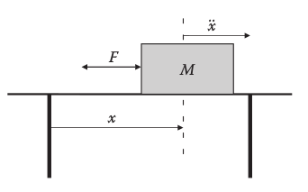
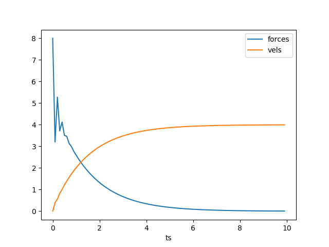
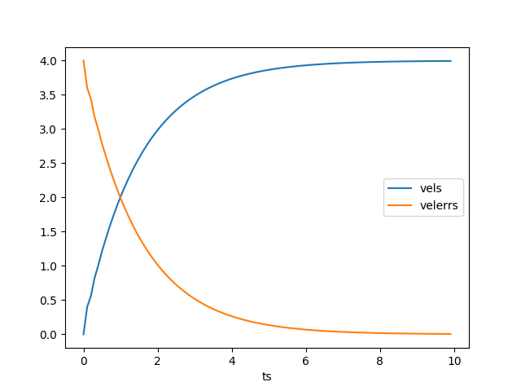
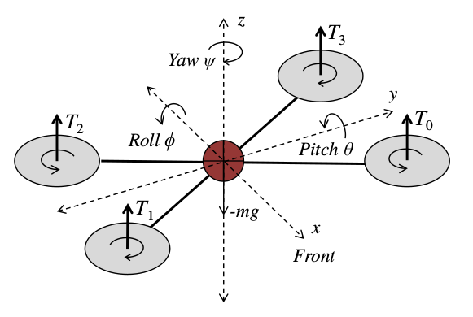
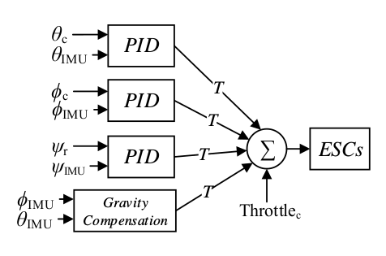

# PID (Proportional, Integral, Derivative) Kontrol

Endüstride en yaygın kullanilan, en basit kontrol yöntemi PID kontrol
yöntemi. Bu yaklaşım kontrol edilen mekanizma, süreç, fabrika, vs için elde
denklemler elde olmasa bile çoğunlukla işler (mekanizmanın fazla gayrı
lineer olmaması kaydıyla). Elde edilmek istenilen bir parametre hedefi
vardır, mesela bu arabanın hızı olabilir, kontrol edilen ise bir gaz pedalı
olabilir (pedalın basılma açısı gibi), ve arabanın belli $\Delta t$
aralıklarında hız ölçümüne bakılır, ve en basit formda istenilen hız ile o
anda olunan hız arasındaki fark, hataya oranlı bir kontrol uygulaması
yapılır. Eğer 60 km/saat ile gidilmek isteniyorsa ama ölçüm 40 km/saat
diyorsa aradaki farka oranla gaz pedalına biraz daha basılır. En basit
formda dedik, bazı ekler, o ana kadar olan hataların toplamına oranlı
(integral), ya da hatanın önceki hataya göre artışına oranlı (derivative)
da olabilir.

Tüm bunlar biraraya koyulunca PID kontrolünü elde ederiz [1, sf. 42] [3]. Formül,

$$
u(t) = 
K_p \cdot e(t) + 
K_i \cdot \int_0^t e(\tau) \mathrm{d} \tau + 
K_d \frac{\mathrm{d} e(t)}{\mathrm{d} t}
$$

$K_p$ ile hataya oranlı (proportional) bir kontrol uygulanır, $K_I$
üzerinden önceki hataların entegrali (toplamı) üzerinden bir kontrol, $K_D$
ile hata değişimine oranlı kontrol uygulamış oluruz. Bu sabitlerin
bulunması deneme / yanılma ile olabilir (ayar -tune-) safhasında bunlar
yapılabilir.

Bu yaklaşımda genel olarak kontrol edilen parametre ve hedef değişken
arasında yapay / lineer bir ilişki kurulduğu söylenebilir. Sabitleri
ayarlayarak herhangi bir sistem için bu ilişkinin işlemesini sağlıyoruz,
fakat formülsel olarak elimizde daha derin bir bağlantı yok. "Hata''
büyüklüğüne, onun birkaç formuna bakarak, bunlara oranla bir kontrol
uygulamak PID yaklaşımının özüdür. Pratikte iyi işliyor.

Bir sistemi kontrol etmek için birden fazla değişken olabilir, tipik olarak
her değişken için ayrı bir PID hesabı işletilir. Kod idaresi açısından bu
sebeple üstteki formülü bir obje içine koymak böylece her değişken için
ayrı bir PID objesi yaratmak iyi bir yaklaşım olabilir. Her obje kendi eski
hatasını, kendi değişkenini takip edip, ona özel kontrol hesabını her
adımda hesaplayacaktır.

```python
class PID:
   def __init__(self, dt, Kp, Ki, Kd, lastErr=0.0):
      self.Kp = Kp
      self.Ki = Ki
      self.Kd = Kd
      self.dt = dt
      self.errSum = 0
      self.lastErr = lastErr

   def compute(self, setpoint, input):
      error = setpoint - input
      self.errSum += (error * self.dt)
      dErr = (error - self.lastErr) / self.dt
      output = self.Kp * error + self.Ki * self.errSum + self.Kd * dErr
      self.lastErr = error
      return output

```

(Kurucuda `lastErr` geçildi, bu başta çok yüksek olabilecek 'önceki
hata' problemini düzeltmek için)

Örnek olarak basit bir hedef, 10, ve rasgele bazı çarpanlar üzerinden
uygulanacak kontrolü hesaplayalım. 3 ile başlıyoruz,

```python
p = PID(0.01, 1, 1, 0, 10)

print (p.compute(10,3))
print (p.compute(10,4))
print (p.compute(10,5))
print (p.compute(10,8))
```

```
7.07
6.13
5.18
2.2
```

Örnek

Klasik fizik üzerinden ilerleyelim.. Alttaki örnek [2, sf. 12]'den
alınmıştır, $M$ kütlesindeki bir objeyi masa üzerinden ittirerek bir hedef
hızına ulaştırmak istiyoruz. 



$F = m \ddot{x}$ formülü standart fizik, herhangi bir zaman noktasındaki
$T$ zaman aralığındaki hız artışı için gereken kuvvet
$F = \frac{m v_t - m v_{t-1}}{T}$ ile hesaplanabilir. Sürtünmeyi hesaba
katmayalım. Zaman aralığı 10 milisaniye olsun, kütle $M = 2$ kg, ulaşılmak
istenen hedef hız 4 metre / saniye. Durağan hızdan başlıyoruz, ve PID
kontrol ile her $t$ anında uygulanması gereken kuvveti görmek
istiyoruz. Endüstriyel uygulamalarda bu tür problemler için PD yaklaşımı
kullanılıyor, yani I yok, o yüzden onun sabitini sıfır yapıyoruz (iptal
etmiş oluyoruz), geri kalanlar için $K_p=2$, $K_D=1$ üzerinden,

```python
import pandas as pd

T = 0.1
M = 2.0
desired_vel = 4.0
vel = 0
p = PID(T, 2.0, 0, 1.0, 4.0)
forces = []; vels = []; velerrs = []; ts = []
for i in range(100):
    vels.append(vel)
    force = p.compute(desired_vel, vel)
    accel = force / M
    vel = vel + accel*T
    forces.append(force)
    velerrs.append(p.lastErr)
    ts.append(i*T)

df = pd.DataFrame([ts, forces, vels, velerrs]).T
df.columns = ['ts','forces','vels','velerrs']
df = df.set_index('ts')
df[['forces','vels']].plot()
plt.savefig('phy_030_pid_03.png')
df[['vels','velerrs']].plot()
plt.savefig('phy_030_pid_04.png')
```




Quadkopter

Bir quadkopter dört tane motor üzerinden kontrol edilen bir İHA'dır (drone,
insansız hava aracı). Helikopter aksine pervanelere / dört motora eğim
verilemez, sabit dururlar, ve araç sadece bu motorların daha az veya daha
çok döndürülmesi üzerinden kontrol edilir. Her motorun pervanesi bir
yanındakinin tersi yönünde döner, böylece her motorun getirebileceği
savrulma dengelenmiş olur, teorik olarak dengeli bir quadkopterde her motor
aynı hızda döndüğünde araç havada asılı duruyor olmalıdır. Tabii pratikte
pek çok sebep dolayısıyla bu olmayabilir, o yüzden asılı durma, herhangi
bir yöne uçma, dönme için quadkopter sürekli kontrol edilmelidir.



Resimde dönüş açıları gösteriliyor, havacılıktaki adım, yalpa , sapma
(pitch, roll, yaw) açıları bunlar, mesela z ekseni bazlı bir dönüş
sapma. Kontrol $T = [T_0,T_1,T_2,T_3]$ üzerinden dört motora uygulanacak
güçtür [1, sf. 44], quadkopterin hedeflenen duruş açıları
$\theta_c, \phi_c, \psi_c$ olsun, ölçüm aletlerinden o andaki duruş
$\theta_{IMU}, \phi_{IMU}, \psi_{IMU}$ ile geliyor olsun.



Kontrol için üç açı, artı, yukarı aşağı iniş çıkış amaçlı yerçekimi
telafisiyle (gravity compensation) beraber dört tane PİD kontrolü
tasarlanıyor. Mesela [1, sf. 46]'daki koda bakarsak, istenen adım açısına
ulaşmak için adım PID'den gelen kontrolü alıyoruz, ve bu kontrolü yine
belli bir sabitle çarpıp $T_0,T_1$'e ekliyoruz, $T_2,T_3$'ten
çıkartıyoruz. İki üstteki resimden pozitif bu şekilde uygulanan bir değerin
İHA'yı ön kısma göre yukarı kaldıracağını, yani $y$ eksen bazlı bir dönme
yaratacağını kestirebiliriz. Tabii her quadkopterin fiziki yapısı sebebiyle
her açının hatasına oranla uygulanacak düzeltme $K_p,K_I,K_D$ sabitleri
farklı olabilir, ne olduklari başta bilinmez, bu sabitler tasarlama
evresinde deneme / yanılma ile ayarlanarak İHA işler hale getirilir.

Kaynaklar

[1] Zimmerman, *Flight Control and Hardware Design of Multi-Rotor Systems*

[2] Jamshidi, *Intelligent Control Systems with an Introduction to System of Systems Engineering*

[3] Beauregard, *Improving the Beginner's PID - Introduction*, 
    [http://brettbeauregard.com/blog/2011/04/improving-the-beginners-pid-introduction/](http://brettbeauregard.com/blog/2011/04/improving-the-beginners-pid-introduction/)


