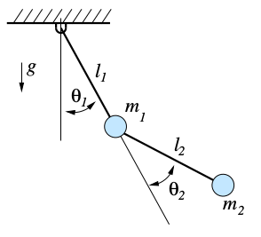
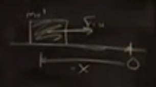
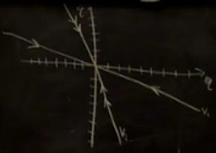
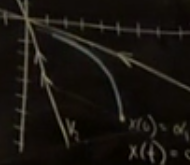
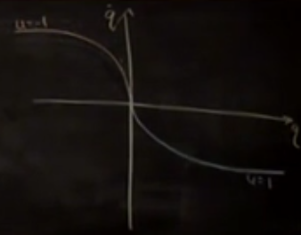
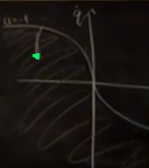
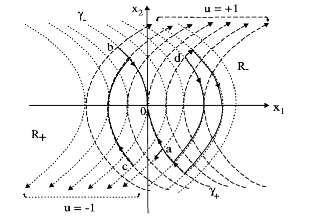

# Daha Az Kumandalı Robotlar 

HONDA şirketinin Asimo adlı robotu 1996 yılında ortaya çıktığında herkes
robotik konusunda önemli bir noktaya erişildiğini anlamıştı. Asimo rahat
bir şekilde yürüyor, merdiven çıkıyor, hatta futbol oynuyordu [1,
3:50]. Fakat robotun hareketlerine yakından bakarsak bir ayağının sürekli
düz şekilde yerde olduğunu görüyoruz, robot sanki kendi dinamiği ile
barışık değil / ondan istifade etmiyor. Çok muhafazakar bir şekilde hareket
ediyor, ve her hareketinin her noktası planlı, ve güvenli. 

Bu niye tercih edilir değil? Öncelikle çok fazla enerji sarfediliyor,
Asimo'nun yürüyüşü normal insanın yürüyüşüne kıyasla 20 kat daha fazla
enerji gerektiriyor, bu sebeple büyük bir pil taşıması gerekiyor ve o pil
bile ancak yarım saat yetiyor. 

Pek çok açıdan Asimo fabrikalardaki robot işçi kolların evriminin vardığı
nihai nokta. Yüksek kazançlı (bunun anlamını ileride göreceğiz) bir sistem,
aynen fabrika robot kollari gibi çok miktarda enerji ve geri besleme
kullanıyor, ve üzerinde çok detaylı düşündüğü planladığı bir aksiyonu
uyguluyor.

Ama yürümenin farklı yolları var. Mesela insanların yürüyüşü aslında bir
nevi "kontrollü düşüş'' denebilir. Yani insanlar çevre dinamiğine,
çevrenin fiziğinden istifade ederek yerçekim, yukarı gidiş, sürtünme
arasında bir optimal nokta bulup az mıktarda bir kontrol uygular, ve bu
şekilde yürür. Mesela şuradaki robot [1, 7:22] pasif dinamik yürüyüş
sergiliyor, bu robot dış enerji bile kullanmıyor, sadece yerçekiminden
istifade ederek düşmeden, aşağı yürüyor. Bu robotun yürüyüşü insan
yürüyüşüne daha çok benziyor aslında. Robot bize şunu sergiliyor, yürümek
için etrafın dinamiğini aşırı kontrol, aşırı geri beslemeli müthiş planlı
bir gidiş yoluyla sıfırlamak yerine o dinamiği daha yakından
inceleyebiliriz. Burada bütün işi yapan robotun kontrol dinamiği,
bilgisayar yok, kontrol sistemi yok.

[Uçuş, denizaltı örnekleri atlandı]

Doğada gördüğümüz çok verimli çalışan örnekler bir bakıma daha az kumandalı
(underactuated) denen sistemler. Dersimizin ana konusu bu. Amacımız insan
gibi koşan, kartal gibi inen robotlar yapmak.  Şimdi daha az kumandalı
tarifi ile ne demek istediğimi daha detaylı şekilde anlatmaya uğrasayım.

Bir örnek görelim, iki bağlantısı olan bir robot kol. 

İki uzunluk, iki acı var burada. Ders boyunca $q$ ile robotun kordinatları
kastedilecek, örneğimiz için bu kordinatlar $\theta_1,\theta_2$. Büküm
noktalarına kontrol $u$ amaçlı bir dönme kuvveti (torque) uygulayabildiğimiz
düşünelim, bunları üstten alta doğru $\tau_1,\tau_2$ ile gösterelim.

$$
q = 
\left[\begin{array}{r}
\theta_1 \\
\theta_2
\end{array}\right], \quad
u = \left[\begin{array}{r}
\tau_1 \\
\tau_2
\end{array}\right]
$$

Bu sistemin, bu şarkacın nasıl hareket ettiğini tarif etmek istiyorsak, bu
derste ilgilendiğimiz çoğu robot ikinci derece sistemler. Herşeyi kontrol
eden ünlü,

$$
F = ma
$$

formülü. Bu örnekte $a$, $q$'nun ikinci türevi olacak. $\dot{q}$ birleşik
hız, $\ddot{q}$ birleşik ivme. Bu sistemin ivmelenmesini mevcut yer, hız,
ve kontrol girdisi üzerinden tarif eden bir formüle ihtiyacım var. İkinci
seviye mekanik dünyada yaşıyorsak, şöyle bir denklem lazım,

$$
\ddot{q} = f(q,\dot{q},u,t)
$$

Bu dersin aşağı yukarı tamamında üstteki türden gayri lineer bir denklemle
temsil edilen ikinci derece sistemlere bakacağız. Hatta bizim
ilgilendiğimiz çoğu robot daha da basit bir formda olabiliyor, hareket
denklemleri $u$ bazında lineer olabiliyor, robota dönme kuvveti ekleyince
bu etki sistemin ivmesine lineer bir etki uyguluyor yani.

$$
\ddot{q} = f_1 (q, \dot{q}, t) + f_2 (q, \dot{q}, t) u 
\qquad (1)
$$

Pek yeni bir şey söylemişim olmadım aslında, $f_1$ ile bir takım gayrı
lineer ilişkilerle görülen değişkenler sisteme etki ediyor, sonra $f_2$ ile
yine bir takım gayrı lineer ilişkilerle bir ilişki daha var, tek değişik
söylediğim $u$'nun lineer olarak etki ettiği. 

Devam edelim, tamamen kumandalı ne demek? Üstteki denkleme bakalım, $q$ bir
2x1 vektör, tabii ki $\ddot{q}$ da öyle, yani (1)'de gördüğümüz bir vektör
denklemi. $f_1$ aynı şekilde. $u$ da öyle, 2x1 vektör. Bu durumda
boyutların uyması için $f_2$'nin 2x2 matris olması gerekir. Hayatı
kavramsal, düşünüş olarak en kolaylaştıran, ve çoğu robot tasarımcısının
yaptığı $f_2$ matrisinin tam kerte olduğunu düşünmektir. O zaman deriz ki
eğer $f_2$ tam kerte ise bir robot tamamen kumandalıdır. Matematiksel olarak,

$$
\mathrm{rank} [f_2(q,\dot{q},t)] = \mathrm{dim} [q]
$$

Bu demektir ki eğer $f_1,f_2$'yi biliyorsam $u$ ile istediğim $\ddot{q}$'yu
elde edebilirim. Değil mi? Tam kerte bu demek, eğer $f_2$ tam kerte olmasa,
tüm uzayı kapsayazdım, çünkü içinde tekrar eden kolonlar olurdu ve bu
tekrar yeni bilgi eklemezdi, bu sebeple belli bir $u$ ile her $\ddot{q}$'ya
erisemezdim.

Daha az kumandalı nedir? Eğer 

$$\mathrm{rank} [f_2(q,\dot{q},t)] < \mathrm{dim} [q] 
\qquad (2)$$ 

ise. 

[geri besleme lineerlestirme atlandi]

Tarif edersek, bir sistemin kontrol girdisi sistemi her yönde
ivmelendiremezse o sistem daha az kumandalıdır. 

Bu arada (2) formülüne dikkatle bakarsak, $f_2$, $q,\dot{q}$'a bağlı, o
zaman daha az, tam kumandalı olma olmamama irdelemesi o anki konuma
bağlı. Sistem dinamiği sırasında bazen tam kumandalı olabilirim, bazen
olmayabilirim. Bu nasıl olur? Bir engel vardır belki, dinamiği belli
şekillerde değiştirir, ve bazı şeyler mümkün olur, bazıları olmaz... 

Asimo örneğine dönersek çok dikkatli, muhafazakar bir şekilde hareket
ediyor değil mi? İşte bu şekilde dikkatli olarak tam kumandalı konumlarda
kalmaya uğraşıyor, yaptığı bu. 

Umarım bu tarif ettiğim ayrımın ne kadar derin olduğunu
anlatabilmişimdir. Robotik alanında bu fark her yerde; son 30 senedir çoğu
araştırmacı robot kontrol tasarlarken $f_2$'nin tam kerte olduğunu
farzetmiştir. Mesela uyarlanır (adaptıve) kontrol, hesaplanan dönme kuvveti
metotları, tüm bunlar dolaylı olarak bu tam kerte faraziyesini yapar, ki
böylece kafanıza esen şekilde kontrol uygulayarak kafanıza esen şekilde
ivme yaratabilesiniz.  İşte bu sebeple uyarlanır kontrolde mesela tüm bu
matematiksel ispatlar vardır, ki sistemi lineerize edebilesiniz, onun
hakkında kolay şekilde düşünebilesiniz.

İşte bu sebeple tam ile daha az kumandalı sistemler, tasarımcılar arasında
bu kadar ayrılık var, çünkü eğer gayrı lineer sistemi alıp lineer hale
getirme şansımız yoksa, o zaman gayrı lineer dinamiği anlamaya uğraşmaktan,
onun uzun vadeli davranışı hakkında düşünmekten başka bir şansınız
yoktur. Analitik yaklaşımlar neredeyse ise başlar başlamaz ise yaramaz hale
gelir, bilgisayarlar burada yardım edebilir.

Fabrikadaki montaj bantında çalışan robot kolların çoğu tam kumandalıdır,
yürüyen robotların çoğu değildir. 

[atlandi]

Daha Az Kumandalı Robotlar - 3

Önceki derste gayrı-lineer dinamikten bahsettik, faz grafiklerine baktık,
çekim bölgesine (basın of attraction) baktık, sabit noktalara baktık..
Kontrol konusuna hafifçe dokunduk ve bu konuya işaret ederken onu bir takım
matris denklemlerinin manipülasyonu olarak değil, faz grafikleriyle
alakalandırmaya uğraştım, öyle ki kontrol demek bu faz grafiklerini
değiştirmek, onları hareket ettirmek demek oluyordu, sistemi kendi
istediğiniz noktaya kanalize etmek için grafiği (sistemi) tekrar
şekillendirmiş, eğip, bükmüş oluyorduk. Tabii biraz eğmekten bahsediyoruz,
bu derste çok fazla eğme bükme yapmıyoruz [1]. 

İlk bakacağımız örnek çift entegratör, $\ddot{q} = u$. Bu örnekte herşeyi
analitik olarak yapabilirim. Bu denklemin fiziksel karşılığını düşünmek
istersek, buz üzerinde duran birim kütlede bir tuğla düşünebiliriz. Tuğlaya
uygulanan kontrol kuvveti $F = u$, sürtünme yok. 

[Dikkat hem kordinat üzerinde hem de konumsal değişken olarak $x$
kullanılmış, karışıklık olmasın] 

Bu çift entegratör ile yapmak istediğimiz onu orijin noktasına ve sıfır
hıza getirmek. Bariz olmayabilir ama bunu yapmanın pek çok yolu var ve
bizim amacımız bu işi yaparken bir tür optimallik kriterine uyarak onu
yapmak. Derslerimizin geri kalan tümünde optimallik kriteri bizim için bir
tür hesapsal baston görevini görecek.

İlk önce kutup yerleştirme (pole placement) analiziyle başlamak
istiyorum. Sistemi durum uzay (state space) formatında yazalım. Durum için
çoğunlukla $x$, kordinat için $q$ kullanılır, altta solda görülüyor. Altta
sağda durum uzay dinamiğidir, genel bir sistemi tarif ediyor,

$$ 
x = \left[\begin{array}{c} q \\ \dot{q}  \end{array}\right] \quad
\dot{x} = A x + Bu
$$

O zaman üstteki en basit sistemi tarif etmek için

$$ 
\dot{x} = \left[\begin{array}{rr}
0 & 1 \\ 0 & 0
\end{array}\right] x + 
\left[\begin{array}{c} 0 \\ 1 \end{array}\right] u
$$

Verili $A,B$ ile açılımı yapınca çift entegratör sistemini elde ettiğimizi
göreceğiz.

Amacımız $u$'yu bulmak, tuğla üzerinde etki eden öyle bir kontrol eylemi
$u = \pi(x)$ bulalım ki sistemi sıfır noktasına getirsin. Yani amacımız bir
geri besleme kanunu $\pi$ bulmak ($\pi$ sembolünü $x$'in fonksiyonu olan
kontrol ilkeleri için kullanıyorum). Şu formdaki $u$'lar ile
başlayabiliriz; $u = -K x$. Görülen $K$ bir matris, $x$ alınıyor ve $-K$
ile ölçekleniyor. Bu örnekte $K$ matrisi $1 \times 2$ boyutunda,
$\left[\begin{array}{cc} k_1 & k_2 \end{array}\right]$,

$$ 
-K x = 
\left[\begin{array}{cc} k_1 & k_2 \end{array}\right] 
\cdot
\left[\begin{array}{cc} q \\ \dot{q} \end{array}\right] =
-k_1 q - k_2 \dot{q}
$$

Bazılarımız bir formu orantılı türevsel kontrolör olarak tanıyacaktır. 

Şimdi $K$'yi değiştirince sistemime ne olacak diye düşünüyorum, bu hesap
lineer sistemlerde kolay, $u = -Kx$'i denkleme geri sokarsam 

$$ 
\dot{x} = (A - BK)x = \left[\begin{array}{rr}
0 & 1 \\ -k_1 & -k_2
\end{array}\right] x
$$

elde ederim. Diferansiyel denklemler dersi alanlar üstteki denklemi nasıl
çözeceğimizi bilir, çözüm sistemin özdeğerlerini kullanır, üstteki matrisin
özdeğerlerini hesaplarız, sonra özvektörler $v_1,v_2$'yi buluruz,

$$ 
\lambda_{1,2} = \frac{-k_2 \pm \sqrt{k_2^2 - 4 k_1}}{2}, \quad
v_1 = \left[\begin{array}{r}
1 \\ \lambda_1
\end{array}\right], \quad 
v_2 = \left[\begin{array}{r}
1 \\ \lambda_2
\end{array}\right]
$$

Peki sistemin stabil olması için özdeğelerin belli değerlerde olması
gerekiyor değil mi? İkisinin de negatif olması. Sistemde salınım olup
olmadığını merak ediyoruz, bu durum kompleks özdeğerler varsa olur, ki bu
durum üstteki karekök içinde eksi değer varsa ortaya çıkar, onun olması
için de $4 k_1$ değeri $k_2^2$ olmalı. 

Biz salınım istemiyoruz, $4 k_1 > k_2^2$, bu durumda sistem aşırı sönümlu,
$4 k_1 = k_2^2$ ise kritik sönümlu, $4 k_1 < k_2^2$ ise eksik sönümlu,
ayrıca stabilite için $\lambda_{1,2} < 0$ olmalı.

Bu sonuçları faz grafiklerine bağlayalım; özdeğer ayrıştırması yapmamızın
bir diğer sebebi sistemi çok güzel grafiksel şekilde yorumlamamıza izin
vermesi. Spesifik bir duruma bakalım, $k_1 = 1$, ve aşırı sönümlu bir
sistem için $k_2$ en az 2 olmalı, onu $k_2 = 4$ yapayım. Özdeğerler bu
durumda  

$$
\lambda_{1,2} =  \frac{-4 \pm \sqrt{16-4}}{2} =
-2 \pm 3 
$$

$$
\lambda_1 = 0.25, \lambda_2 = -3.75
$$
 
Şimdi durum uzay grafiğini çizebilirim, $q,\dot{q}$ kordinat sisteminde,
ilk önce $-0.25$ eğiminde $v_1$ bir çizgisi çizerim,  sonra kabaca $-4$
eğiminde bir çizgi daha çizerim, $v_2$. Sonumlu sistemdeyiz, bu yüzden
çizgilerdeki oklar dışarıdan içeri doğru. 

Bu arada anlatım açısından, ve birkaç tane grafik çizmemek için aşırı
sönümlü sistem seçtim, böylece tekrarlanan özdeğer çıkmadı, yani salınım
olmadı. Ama aşırı sönümlü sistem konuyu irdelemek için yine de iyi çünkü
tekrarlanan özdeğer olmayınca özvektörler uzayı kapsar (span). Ya da, her
başlangıç konumu iki özvektörün lineer kombinasyonu olarak yazılabilir.

$$
x(0) = \alpha_1 v_1 + \alpha_2 v_2
$$

gibi, ki $\alpha_{1,2}$ bir kombinasyonu oluşturacak herhangi iki
sabit. Nihai sistem ise 

$$ 
x(t) = \alpha_1 e^{\lambda_1 t}v_1  + \alpha_1 e^{\lambda_2 t} v_2
$$

Lineer sistemlerin güzel tarafı bu. Bu demektir ki özvektörleri
grafiklediğim zaman sistemın tüm faz grafiğini biliyorum. Mesela altta
görülen başlangıçtan $v_2$ çok hızlı, $v_1$ biraz daha az hızda bizi sıfıra
götürecek, bu ikisinin birleşimi sonucunda alttaki gibi bir gidiş yolu
takip edilecektir.

Kontrol konusuna gelelim. $k_1,k_2$'yi değiştirebiliyoruz, ve bu
parametreleri değiştirmek demek faz portresini değiştirmek demektir değil
mi? Onları öyle değiştirmeliyim ki sistem istediğim şeyi yapsın. Bu
değişimi, o değişimi yaratacak $k$'leri nasıl ortaya
çıkartmalıyım. Optimalliğe girmeden önce mesela $k_2^2$ $4k_1$'ten büyük
olduğu sürece salınıma girmeyeceğimi biliyorum, bu iyi. O zaman niye
$k_{1,2}$'yi sonsuza çıkartmıyorum, hemen kut diye sonuç ulasayım? Bu başka
problemler çıkartabilir, biriniz fazla enerji diyor, doğru. $k_{1,2}$
olmasa ne olurdu? O zaman $\dot{x} = Ax$ kalır sadece bu sistem sadece
direk grafikte sağa doğru gider. 

Biz bu basit sistemde optimal geri beslemeli kontrol hesaplayacağız. 

Katı bir kısıtlama ekleyelim, $|u| < 1$, $u$'nun mutlak değeri 1'den küçük
olsun. Bu pek çok şeyi değiştirir, biraz önceki lineer sistem analizim ise
yaramaz hale gelir mesela. Formülize ederken 

$$ 
u = sat(-Kx)
$$

diyebilirim, $sat$ ifadesi İngilizce satüration'dan (doygunluk) geliyor, -1
altı için -1, +1 üstü için +1 yapıyorum. Üstte görülen gidiş yolları hala
hafiften geçerli, hala orijine gideriz, ama yol biraz daha uzayabilir çünkü
kut diye inebilmek yerine daha ufak artışlarla gitmek zorundayız, ve hala
stabilliği kaybetmiyoruz. Ama katı kısıtlılıkları iyi ayarlamam gerekiyor
ki yol da çok uzamasın. 

Bu ayarı yapmanın bir yolu optimal kontrol ile. Tek yolu değil muhakkak,
bir yolu. Diyelim ki hayattaki tek amaçım orijine gidebileceğim en hızlı
şekilde gitmek, ama $|u| \le 1$ kısıtlamasına tabiyim. Bu aslında ünlü
minimum zaman problemi, 

$\left[\begin{array}{cc} 0 & 0 \end{array}\right]^T$'a gidebildiğin kadar
çabuk git $|u| \le 1$ kısıtlamasına tabi olarak. Tabii hem $q=0$ hem de
$\dot{q}=0$, yani hız da sıfır olacak. Orijin derken yer ve hızdan oluşan
kordinat sistemindeki "orijinden'' bahsediyoruz. 

Soruya teorik olarak daha dalınca bu sorunun iyi şekillenmiş olması için
kısıtlamanın olması gerektiğini de görürdük, yoksa, daha önce dediğim gibi,
sonsuz büyüklükte $u$ kullanabilirdim, sonsuz hızda ulaşırdım ve birşey
öğrenmemiş olurdum. 

Şimdi buz üzerinde tuğla hakkında zihnimizdeki tüm hayal gücü, bilgi
kırıntısını kullanalım. Eğer sınırlı bir kuvvet uygulayabiliyorsam, ve
orijine en çabuk şekilde ulaşmak istiyorsam, ne yapmalıyım? Biriniz çat-çat
(bang-bang) dedi. Doğru. İleride bir yere mümkün olduğu kadar çabuk ulaşmak
istiyorsam çat diye gaza basarım hızlanabildiğim kadar hızlanırım, sonra
belli bir kritik noktada çat diye frene başarım ve yavaşlamaya başlarım ve
kaya kaya hedef noktasına geleceğim. Bundan daha iyisi mümkün değil. Bunu
ispatlayacağız tabii. Bu cevabı çift entegratör olarak kafadan
düşünebilirdik, ama yürüyen bir robot için o kadar kolay düşünülemeyebilir,
ve biz cevabı genel bir altyapı üzerinden türetmeye uğraşacağız.

Bazen bazılarının "çat-çat kontrol optimaldir'' dediğini duyabilirsiniz,
bu sonuç yapıcılarınız (actuator) üzerinde katı sınırlar olduğu zaman sıkça
ortaya çıkar, ve bu sınırlar olduğu zaman o sınırlara en yakın şekilde
davranmak her zaman daha iyidir (o yüzden cat diye hızlanmak gerekli).
Robotlarda bu yaklaşım her zaman işlemiyor, çünkü tek bir zaman aralığında
yapıcıya maksimum kuvvet, sonra maksimum negatif kuvvet o durumda iyi
olmuyor.

İşin püf noktası herhalde çat diye gaza bastıktan sonra ne zaman frene
geçeceğimizi bulmak değil mi? Önce onu bulmaya uğraşalım, ortaya çıktığı
sistem durumları herhalde birkaç tanedir. O durumları bulmaya
çalışalım. $q>0$ durumuna bakalım önce, bir bölüm seçelim, bu durumda fren
$u=1$ değil mi (gidiş orijine doğru ise fren onun tersi yönde, yani pozitif
yönde olmalı)? O zaman alttaki formülü entegre edelim,

$$ 
\ddot{q}(t) = u = 1
$$

$$ 
\dot{q}(t) = u t + \dot{q}(0) 
\qquad (1)
$$

Bir daha entegre

$$ 
q(t) = q(0) + \dot{q}(0) t + \frac{1}{2} u t^2 
\qquad (2)
$$

Formüle bakalım ve $u=1$ ile bizi bir nihai $t$'de $q(t)=0$ ve
$\dot{q}(t)=0$ götürecek hangi gidiş yollarının ortaya çıktığına bakalım. 

$\dot{q}(t)=0$ formülünü (1)'e sokarsak, 

$$
\dot{q}(0) = - u t 
\qquad (3)
$$

Üstteki formülü (2)'ye sokarsak, ve $q(t)=0$ olduğu için (2) formülü

$$
q(0) = \frac{1}{2} ut^2 \qquad (4)
$$

$t$ için çözelim, $u=1$ demiştik, o zaman (3)

$$
t = -\dot{q}(0)
$$

olur. Ve üsttekini (4)'e koyarsak, ve yine $u=1$ ile

$$
q(0) = \frac{1}{2} \dot{q}(0)^2
$$

Bu sonucu konum uzayında grafiklersem bir sonuçlar manifoldu elde edeceğim.

Sağ üst köşe niye boş, orada zaman eksi olmalı ama negatif zamana izin
yok. Sağ alt köşede bir sürü çözümlerin oluşturduğu bir çizgi
görüyoruz. Diyelim çizginin sonunda frene basıyoruz, ve çizgi boyunca
yavaşlayıp yavaşlayıp orijine eriseceğiz (durmuş olacağız). $-q$ durumu
için sol üstteki grafiği elde ediyoruz, orada $u=-1$.

Peki eğer karalanan yerlerden birinde isem mesela yeşil noktada ne yaparım?
Gösterilen manifold fren yapmanın grafiği. Önce hızlanırım sonra fren
yaparım demiştim değil mi? O zaman yeşil noktadaysam yukarı çıkarım ve
grafiğe gelirim ve oradan frenler orijine erişirim. 

Eğer çizginin üstteki başlıyorsam? O zaman manifolda paralel bir şekilde
aşağı inerim, ve yukarı doğru ufak bir gidiş yaparım. 

Göstermesi daha zor olan bunları yapmanın optimal olduğunu
ispatlamak. Optimallik konusu diger derslerde islenecek.

Çift Entegre Edici ve Hamiltonian Çözüm

Cift-entegre edici (double-integrator) problemine farkli bir sekilde
bakalim [3, sf. 519], [2, sf. 308], [4, sf. 250]. Bu problemde amac
tek eksen üzerinde $y$ diyelim, bir objeyi bir konumdan diğerine
hareket ettirmekti.

Ana fizik formülleri $F = ma$'dan hareketle,

$$
m \ddot{y} = f(t)
$$

olabilir, hız $\dot{y}(t)$, ivme $\ddot{y}(t)$, konum $y(t)$. Eğer

$$
x_1(t) = y(t), \quad x_2(t) = \dot{y}(t)
$$

dersek ODE sistemini şu şekilde tanımlayabiliriz,

$$
\dot{x}_1(t) = x_2(t)
$$

$$
\dot{x}_2(t) = u(t)
$$

ki $u(t) = f(t)/m$ olacak. O zaman sistem formulu

$$
\dot{x} = f(x) = \left[\begin{array}{r}
x_2(t) \\ u(t)
\end{array}\right]
$$

Şimdi bir optimal zaman problemi soralım, ve bir kısıtlama
yaratalım.

Kontrol $|u(t)| < 1, \forall t \in [t_0,t_f]$ olmalı. Bu objeyi
herhangi bir $[x_1(0),x_2(0)]$ başlangıcından orijine minimal zamanda
götürmek için kullanılacak optimal kontrol nasıl hesaplanır?

Zaman optimize edildiği için, $V = 1$ kabul ederiz çünkü onun
üzerinden alınan entegral zamanı optimize etmeye çalışacaktır,

$$
J = \int_{t_0}^{t_f} V \mathrm{d} t  = \int_{t_0}^{t_f} 1 \mathrm{d} t = t_f - t_0
$$

Hamiltonian şöyle oluşturulur,

$$
\mathcal{H}(x,\lambda,u) = V + \lambda^T f 
$$

$$
= 1 + \lambda_1 x_2 + \lambda_2 u
$$

Elimizde lineer ve içbükey bedelli sistem var, bu sistemler için optimalliğin
yeterli şartı $0 = \left( \frac{\partial \mathcal{H}}{\partial u} \right)$, optimallik noktasında elde edilen $u^\ast$ için

$$
\mathcal{H}(x^\ast,\lambda^\ast,u^\ast) \le \mathcal{H}(x^\ast, \lambda^\ast, u) 
$$

$$
= \min_{|u|<1} \mathcal{H}(x^\ast, \lambda^\ast, u)
$$

doğru anlamına gelir. Problemimiz icin

$$
1 + \lambda_1^\ast x_2^\ast + 1 + \lambda_2^\ast u^\ast \le
1 + \lambda_1^\ast x_2^\ast + 1 + \lambda_2^\ast u 
$$

ki bu da

$$
\lambda_2^\ast u^\ast \le \lambda_2^\ast u
$$

demektir. Bu şartı tatmin eden optimal kontrol $u^\ast$ ne olabilir?
Eğer $\lambda_2^\ast$ pozitif ise $u^\ast$ mümkün olan en büyük negatif
değere sahip olmalıdır ki üstteki küçüklük şartı her zaman geçerli
olsun, yani $-1$. Eğer $\lambda_2^\ast$ negatif ise $u^\ast$ mümkün olan
pozitif değerde kalmalıdır, yani $+1$. Bu değerleri en basit şekilde

$$
u^\ast(t) = -sgn(\lambda_2^\ast (t))
$$

ile özetleyebiliriz, ki $sgn$ fonksiyonu işaret (sign) fonksiyonu, bir
sayının sadece işaretini verir, yani -, + anlaminda, ya da -1, +1.
Mesela 3,4 gibi değerler için +1 döndürür, -3,-4 gibi değerler için -1
döndürür.

Kontrolün $\lambda_2^\ast$'ya bağlı olduğu görülüyor, o zaman
$\lambda_2^\ast$'yi bulmak için, eskonum denklemlerini kullanarız,

$$
\dot{\lambda}_1 ^\ast(t) = \frac{\partial \mathcal{H}}{\partial x_1^\ast} = 0
$$

$$
\dot{\lambda}_2 ^\ast(t) = \frac{\partial \mathcal{H}}{\partial x_2^\ast} = -\lambda_1^\ast(t)
$$

Üstteki denklemleri entegre edersek, mesela $\dot{\lambda}_1 ^\ast(t)=0$ ile başlayalım,

$$
\lambda_1^\ast(t) = \lambda_1^\ast(0)
$$

Değil mi? Sıfırı entegre edince bir sabit elde edilir, bu sabit
$\lambda_1^\ast(t)$'nin başlangıç değeri $\lambda_1^\ast(0)$. İkinci
entegrasyon $\dot{\lambda}_2 ^\ast(t)$ için, bu değişken
$-\lambda_1^\ast(t)$'a eşit, biraz önce bu değeri bulduk, onu yerine
koyup entegre edince,

$$
\lambda_2^\ast(t) = \lambda_2^\ast(0) - \lambda_1(0) t
$$

$u^\ast(t)$'nun bağlı olduğu $\lambda_2^\ast (t)$ ortaya çıktı, bu bir düz çizgiyi
gösteriyor. Bir düz çizgi ya eksiden artıya, ya artıdan eksiye, ya da
ekside, artıda kalacağı için (başka seçenek yok), optimal kontrol
seçenekleri [-1], [+1], [+1,-1], [-1,+1] olabilir.

Çözümde daha da ilerleyince [3, sf. 519] sonuç olarak $x_1,x_2$
grafiğinde paraboller ortaya çıkar.

Bu grafikte -1 aşağı giden gidiş yollarını +1 yukarı giden gidiş
yollarını temsil eder. Eğer bir başlangıç noktası, mesela $d$'den
orijine gitmek istiyorsak, önce -1 ile aşağı ineriz, sonra +1 ile
$a$'dan geçen yukarı yolla kesiştiğimiz yerde o gidiş yoluna değişim
yaparız ve orijine ulaşırız.

Kaynaklar

[1] Tedrake, *MIT, 6.832 Underactuated Robotics, Ders 1*, [https://youtu.be/Z8oMbOj9IWM](https://youtu.be/Z8oMbOj9IWM)

[2] Athans, *Optimal Control An Introduction to the Theory and Its Applications*

[3] Naidu, *Optimal Control Systems*

[4] Kirk, *Optimal Control Theory An Introduction*

