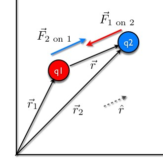
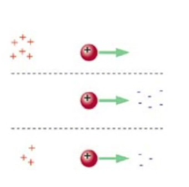
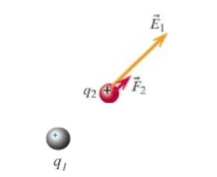
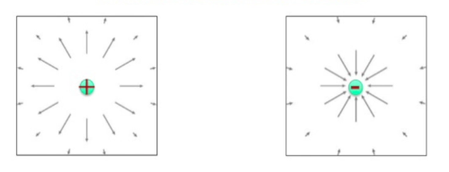
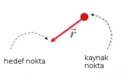
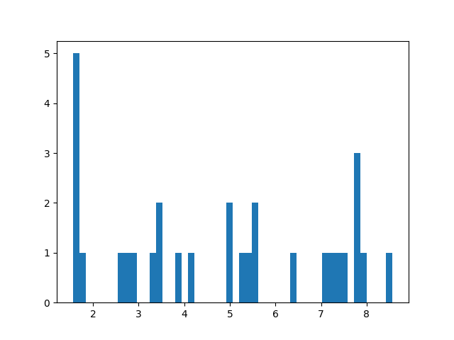

# Elektrik ve Manyetik Etkileşimler - Ders 1

Elektrik ve Manyetik Etkileşimler dersine [7] hoşgeldiniz. Ben Professor
Carlson, ben fiziği çok seviyorum onun için buradayım. Ben teorik fizikçiyim,
her gün matematikle uğraşıyorum yani, bu benim işim, dünyanın nasıl olması
gerektiğini / olabileceğini anlamaya uğraşmak, teorisyenler bununla
meşguldurlar. Bir de deneyci arkadaşlarımız var tabii, onlar dünyanın gerçekte
nasıl olduğuyla alakalıdır. Bu iki kanat, biz ve onlar biraraya geliriz sonra,
buluşuruz, konuşuruz. Anlaşamadığımız zaman yeni bir şeyler öğrenmemiz
gerektiğini anlarız, böyle devam eder.

Fizik size net düşünmeyi öğreten derslerden biridir. Çoğunlukla ufak bir
mantıklı prensip demeti olur elimizde, ve bu demeti mantık zinciri kura
kura bir sonraki daha büyük anlayışa ulaşmamız mümkün olur. 

Başlayalım o zaman. İlk kanun Columb'un Kuvvet Kanunu.


Bu kanun iki yüklü parçacık birbirinin yakınına gelince ne olduğunu
kontrol eder. 

Bildiğiniz gibi etrafınızda dokunabildiğiniz herşey atomdan
yapılmıştır. Atomların içinde yüklü parçacıklar vardır, atom çekirdeği
içinde protonlar ve nötronlar vardır ki protonlar artı yüklüdür, çekirdeğin
etrafında koca onu dairesel şekilde kaplayan elektronlar vardır,
elektronlar negatif yüklüdür. Maddelerin temeli budur. Bazı diğer
parçacıklar da var ama etrafımızda dokunabileceğimiz maddelerin çoğunluğu
bu tarif ettiklerimden oluşuyor. Yani etrafta bir sürü pozitif ve negatif
yüklü parçacıklar var. Bir masaya dokunduğum zaman mesela benim
elektronlarım masadaki elektronlara dokunuyor. Dokunma ile hissettiğim bu
etkileşim. Columnb'un Kuvvet Kanunu, büyüklükler üzerinden,

$$ 
|\vec{F}|  = F = \frac{1}{4\pi \epsilon_0} \frac{|Q_1 Q_2|}{r^2}
$$

Bu formül şunu söylüyor: iki yüklü parçacık birbiri üzerinde bir kuvvet
uygular. Bu kuvvetin büyüklüğü [mutlak değer olarak] bir sabit
($\frac{1}{4\pi \epsilon_0}$ ifadesinin tamamını bir sabit olarak
aklımızda tutabiliriz, sabitin birimininde yanlış yapmamak suretiyle) çarpı
yük bir çarpı yük iki bölü $r^2$, ki $r$ iki parçacığın birbirine olan
mesafesi. Vektörel olarak

$$ 
\vec{F}  = \frac{1}{4\pi \epsilon_0} \frac{Q_1Q_2}{r^2} \hat{r} 
\qquad (1)
$$

$\hat{r}$ kuvvetin etki yönü için eklenmiş, bu yön
$\vec{r} = \vec{r}_2 - \vec{r}_1$ yönüdür, daha doğrusu $\vec{r}$'nin birim
vektor hali $\hat{r}$'dir.



Not: Yük (charge) $q$ ile gösterilmiş, bu nedir?  Yük pek çok elektrondan
oluşur, ve columb birimindedir.  Tek elektronun sahip olduğu yük Milikan
Yağ Deneyi sayesinde biliniyor ve bu $-1.60 x 10^{-19}$ columb'dur. Yazının
sonunda bu deneyi anlatıyoruz.

İki parçacık arasındaki kuvvet bu parçacıkların yüküyle doğru orantılı, ve
aralarındaki mesafenin karesi ile ters orantılı. İki parçacığı alıp
birbirlerinden uzaklaştırmaya başlasam gittikçe aralarındaki çekimi daha az
hissederim değil mi? Bu mantıklı değil mi? Bu azalma
$1/\textrm{mesafe}^2$'ye oranlıdır. Fizikteki pek çok kural
$1/\textrm{mesafe}^2$'ye oranlı azalır bu arada, yani bu kavramı "arkadaş
edinmek'' iyi olur.

Kuvvet yönü ters işaretli yükler için birbirine doğru, aynı işaretler için,
iki negatif ya da iki pozitif olabilir, birbirinden ters yönde.


Ama her halukarda kuvvet her zaman iki yükün arasında direk çizilebilecek
bir hayali çizgi üzerindedir, bu çizginin iki yükün merkezinden geçtiği
düşünülebilir.

Kullanacağımız birimler SI birimleridir, elektrik yükü Coulomb, $C$.

$\epsilon_0 = 8.85 x 10^{-12} C^2/N m^2$, elektriksel geçirgenlik
(permittivity) sabiti,

$1/4\pi \epsilon_0 = 9 x 10^9 N m^2 /C^2$, ki bu sabit birimlerin düzgün
çıkması için kullanılır. Eşitliğin solunda gereken bir birim var, sağında
belli birimler biraraya geliyor, sabit bunların hepsini tercüme eder.

En temel yük birimi [Millikan deneyinden], 

$ e = 1.602 x 10^{-19}$

Bakacağımız her parçacık bu temel yük birimini baz alır, yükleri bu sayının
katlarıdır. Mesela elektronlar $-e$ katlarındadır, protonlar $+e$.

Şimdi bize elektrik alan (electric field) denen bir kavram lazım. 



Diyelim ki bir pozitif yüklü parçacık var. Eğer bu parçacığı, nesneyi
bıraksam ve bu nesne 9.8 $m/s^2$ hızında aşağı düşse, bunun sebebi olarak
aklınıza ilk gelen şey ne olurdu? Yerçekimi tabii. Bazen hepimizin başına
gelmiştir, [düşmek üzere olan birinin taklidini yapıyor] kulak
etrafınızdaki algılayıcılar der ki "98 $m/s^2$ ile aşağı iniş var'', biz
de hemen elleri uzatıp küt diye düşmekten kendimizi kurtarmış olabiliriz.

Peki eğer şimdi bu parçacığı bıraksam pat diye yan duvara doğru gitse?
Bunun sebebinin yerçekimi olduğunu düşünmezdim değil mi? Başka bir şey buna
sebep olurdu. Eğer elimdeki yüklü bir parçacık ise büyük bir ihtimalle
sebep yakındaki diğer yüklü parçacıklar.

Peki detayda nasıl? Belki parçacık yan duvarın karşısındaki pozitif yüklü
pek çok parçacık tarafından itiliyor, o sebeple gördüğümüz hareket oluyor,
ya da gittiği yöndeki duvarda negatif yüklü parçacıklar var, onlar
çekiyor. Bu hareketin ortaya çıkmasının pek çok şekli var, o sebeple pek
çok durumu tarif eden, daha evrensel kavramlar üzerinden, elektrik alanı
kavramını kullanarak düşünmemiz daha iyi olur.

Ana fikir ortada bir alanın olduğu ki bu alan birim yük üzerinde etki eden
kuvvettir. Parçacık niye hareket etti? Bu parçacık olsa da olmasa da
ortada, parçacığın içinde olduğu uzayda etkili olan bir şey vardı, o şey bu
alandı. Bu alan içine gelen parçacığı itmek ya da çekmek için orada hazır
bekliyordu.

O zaman test parçacığının hızlandığını (ivme var) görüyorsam, bu parçacık
üzerinde belli bir kuvvet var demektir, ve bu kuvvet test parçacığın yükü
çarpı şimdi elektrik alanı diyeceğimiz bu diğer şeyin sonucuna bağlı
olacaktır. Bu şey, bu kuvvete sebep olan bu oluş, elektrik alanının
tanımıdır.

$$ 
\vec{F} = q \vec{E} 
\qquad (2)
$$

İki tarafı $q$ ile bölersem,

$$ \vec{E} = \vec{F} / q = \left[\frac{Newton}{Coulomb}\right]$$

Alanın birimi newton/coulomb'dur, ileride göreceğiz ki volt/metre de
kullanılabilir.

Peki şimdiye kadar bir elektrik alanını birince elden deneyimlemiş
olanlarınız var mı? Onu hiç hisseden farkeden oldu mu? [Öğrenci cevap
verdi]. Evet, arkadaşınızın dediği gibi, mesela belki bunu kendiniz
yaptınız ya da yapan arkadaşınızı gördünüz, mesela bir balonu aldınız,
kafanıza sürttünüz, sürttünüz, ondan sonra duvara koydunuz, ve baktınız ki
balon duvara yapışık kaldı! Bu deneyi şu anda sınıfta yapmayı çok isterdim
ama bugün müthiş nemli bir gün, daha kuru bir havada deneyin başarı şansı
daha fazla.

Evet bu statik elektriği deneyimlemenin bir yolu. Başka yol var mı?
Hissetme duyumuzla mesela? Daha önce bahsettiğimiz gibi dokunma duyumuz
elektrik alanına bağlı, ben elektronlar, protonlar ve nötronlardan
oluşuyorum, ve dış yüzeyim, dışarısı ile temas eden elektronlar [çünkü
atomların dış cepherinde onlar var atomları bir bulut gibi
sarmalıyorlar]. Bir şeye dokunduğumda benim elektronlarım dokunduğum
şeylerin elektronlarına dokunuyor, ve bu "Coulomb itişini'' [temeli
elektriksel olan] sinir sistemim ile hissediyorum.

Başka bir yol? [Bir öğrenci 'gözler' diyor]. Gözler, evet. Bunu
açıklayabilir misin [cevap veriyor]. Evet dediği gibi bizim ışık dediğimiz
aslında elektrik. Işığın yayılmasına sebep olan bir manyetik alanla beraber
bir elektrik alandır, bu örneğin ilk değil 5., 6. örnek olarak aklımıza
gelmesi ilginç aslında, ve yerinde bir bakıma, çünkü insanlığın pek çok
elektriksel sonucun aynı sistemin parçası olduğunu keşfetmesi çok uzun
zaman aldı. Aynı derken balonu kafamıza sürtüp duvara koymak ya da şaka
amaçlı halıda sürte sürte yürüyüp arkadaşımızla tokalaşmak ve o sırada
elektrik şoku yaşamak, ve gözümüzde hissettiğimiz ışığın aynı şey olduğunu
kavramaktan bahsediyorum. Bu kavramsal birleştirme biz insanlar için uzun
zaman aldı.

Yani elektrik alanlar aslında her tarafımızda, onlar her yerde. Onları
sürekli deneyimliyoruz, bazen bilinçli olarak çoğu zaman farkında
olmadan. Hatta bizim gözlerimizin algılayabildiği ışık olarak
deneyimlediğimiz elektromanyetik alanlar aslında sınırlı bir frekans
aralığından geliyor, değil mi? Doğadaki bazı hayvanlar bizim gördüğümüz
frekans aralığından daha geniş bir alanı algılayabiliyor. Kimisi
kızılötesini (infrared), kimisi morötesini (ultraviolet) görüyor
mesela. Tabii özel cihazlar, mesela özel bir gözlük kullanarak biz de bu
aralıkları görebiliyoruz.

Devam edelim, alttaki gibi iki pozitif yüklü parçacık var elimizde diyelim,
denklemler negatif için de işler ama ben akıl yürütme, test amaçlı olarak
pozitif yükle başlamayı daha faydalı buluyorum.



Ve yine diyelim 1. parçacık yerinde sabit tutuluyor, ama 2. parçacık
serbest. Bu parçacık $\vec{F}_2$'yi hissedecek yani 2. parçacık üzerinde
etki eden kuvvet. Bu durumu Coloumb kuvvet kanunu ile nasıl temsil
edeceğimizi biliyoruz, (1). denklemi hatırlayalım. Diğer yandan
(2). denkleme göre kuvvet etrafta olan elektrik alanına da doğru
orantılı. Bu iki fikri birleştirirsek, 2. parçacığı inceliyorum, ona etki
eden elektrik alanı 1. parçacıktan geliyor olmalı, her iki denklemde kuvvet
var, ve bu kuvvet aynı kuvvet. (2) bu örnekte şöyle,

$$ \vec{F}_2 = q_2 \vec{E}_1$$

(1) ve (2) aynı olan $\vec{F}_2$ üzerinden birleşince,

$$ \vec{E}_1 = \frac{1}{4\pi \epsilon_0} \frac{q_1}{r^2}\hat{r} $$

İşte bu $q_1$'in ürettiği elektrik alan. 

Eğer $q_2$'yi iki boyutlu uzayda gezdirseydim ve ona etki eden elektrik alanın
her zaman 1. parçacıktan dışarı yönde olduğunu bulurdum (alt soldaki resim).



Tüm bu okların birarada gösterirsem elektrik alanının genel görüntüsünü
elde edebilirdim. Pozitif yüklü parçacığın yarattığı alanın her zaman
dışarı doğru olduğuna dikkat, ben hatırlama numarası olarak "pozitif
insanlar hep başkalarını düşünürler [oklar onlara doğru bu sebeple]'' diye
bir cümle yarattım aklımda (!) sizin için de faydalı olabilir
belki. Negatif için ters yönde, "negatif insanlar sadece kendilerini
düşünürler''.

Her yönde giden bu okların olduğu resim önemli, elektrik alanı bir tür
kirpi gibi düşünüyoruz, dikenleri her yönde gidiyor, tabii uzaklaştıkça
daha inceliyor bu dikenler [etkileri azalıyor].

Örnek

$q_1 = 2nC = 2 x 10^{-19} C$ büyüklüğünde bir yüke sahip parçacık orijinde
duruyor. Gözlemlenen yer (observed location), $[-0.2, -0.2, -0.2]$ metre
noktasında, buradaki elektrik alanı nedir? Kusura bakmayın eksenleri
çizmeyi unutmuşum, ama parçacığı (source location) orijinde düşünün, $x,y$
yana ve yukarı gidiyorlar, $z$ bize doğru geliyor.



$r$ bana doğru işaret ediyor unutmayalım, ve vektörsel büyüklükler
bağlamında, bir vektörün bir yön ve ve büyüklükten oluşan bir kavram
olduğunu hatırlayalım. Bu derste sizden bir vektör sonucu hesaplamanız
istendiğinde bunu iki şekilde yapabilirsiniz, ya salt yön (birim vektör
üzerinden) çarpı tek sayısal büyüklük, ya da tek vektör içinde kendi başına
hem yön hem de büyüklüğü belirtebilen bir sonuç olarak.

Neyse bizden elektrik alan hesaplamamız istendi ki bu bir vektördür (o
sebeple $E$ sembolünün üzerinde bir ok var, $\vec{E}$ şeklinde). Bu tür
hesapları yaparken benim ilk yaptığım iş $\vec{r}$'yi hesaplamak, ki bu
hedef yeri eksi kaynak yeri olarak hesaplanır. Hedef $[-0.2, -0.2, -0.2]$
demiştik, kaynak orijin, yani $[0.0, 0.0, 0.0]$.

O zaman

$$
\vec{r} = [-0.2, -0.2, -0.2]-[0.0, 0.0, 0.0]=[-0.2, -0.2, -0.2]
$$

Birim yön için büyüklüğü hesaplayıp üstteki vektöre böleriz,

$$ |\vec{r}| = \sqrt{(-0.2)^2 + (-0.2)^2 + (-0.2)^2 } = 0.35 m$$

$$
\hat{r} = \frac{\vec{r}}{|\vec{r}|} = \frac{[-0.2, -0.2, -0.2]}{0.35} =
[-0.57, -0.57, -0.57]
$$

Bu arada $\hat{r}$ birimsizdir, bu mantıklı çünkü sadece bir yöne işaret
etmek için hesaplandı. Şimdi elektrik alanı formülü ile alanın bahsedilen
noktadaki büyüklüğünü hesaplayalım,

$$ E = \frac{1}{4\pi \epsilon_0} \frac{q_1}{r^2} =
\left( 9 x 10^{9} \frac{Nm^2}{C^2} \right)
\left(\frac{2 x 10^{-9} C}{0.35^2} \right) = 147 \frac{N}{C}
$$

Vektör formunda

$$ \vec{E} = E \vec{r} = \left( 147 \frac{N}{C} \right) [-0.57, -0.57, -0.57] $$

$$ = [-0.84, -0.84, -0.84] \frac{N}{C}$$

Ekler

Milikan Yağ Damla Deneyi

Tek bir elektronun yükü nedir? Acaba birim yük denen bir şey var mıdır?
Amerikalı bilimci Robert Millikan bu soruların cevabını bulmak için kolları
sıvadı. Tasarladığı deneye göre yağ damlaları bir ölçüm aletine yukarıdan
damlatılıyor, ya da bir aletten püskürtülüyordu, ve damlalar iki elektrik
plakası arasına gidiyordu. Plakalar bir elektrik kaynağına bağlıdır, yani
onlara eksi ya da artı yönde değiştirilebilir bir voltaj uygulanabiliyor
(böylece damlalara etki eden elektrik alanı önceden biliniyor), ve değişik
voltajlarda yağ püskürtülerek ne olduğuna bakmak mümkün oluyordu. Burada
amaç damlaların elektron miktarını bir şekilde ölçmekti, tabii ekstra ya da
kayıp elektronlar sahip olunması istenen bir şeydi ki elektrik alanı ile
etkileşim daha rahat ortaya çıkabilsin, bu ekstra ya da kayıp elektronların
yağ püskürtülürken hava ile olan sürtünme üzerinden, ya da bazı deneylerin
yaptığı bir ilerlemeyle, dışarıdan iyonlaştırıcı ışıma (ionizing radition)
ile bombardımana tutularak kazanmaları planlanıyordu.

Üniversite ilk sınıf için yapılan bir basitleştirme yağ damlalarının bir
plastik kapsül içinde ve standard boyda, bu aşağı yukarı 1 mikrometre
($\mu m$ ya da mikron) ve ağırlığı $m = 5.7 x 10^{-16}$ kg.
olması. Millikan'ın deneyinde elektrik alanın çekmesi, itmesi ile yavaş
yavaş yukarı çıkan, ya da düşen damlaların hızları ve (standard olmayan)
boyutları ölçülerek hesaplar yapılıyor. Daha basitleştirilmiş deneyde
sadece havada asılı kalan standard damlalara bakılıyor.

Ana formüller $\vec{F} = q \vec{E}$ ve yerçekim $m\vec{g}$. Eğer bir damla
askıda ise yukarı çeken elektrik alan kuvveti ile yerçekim eşittir
demektir, yani

$$ q \vec{E} = -m\vec{g}$$

Tabii deney sırasında her veri noktası için değiştirilen ve kaydedilen
voltajdır, üstteki formülü içinde voltaj barındıran formüle çevirmek için
$E = V / d$ üzerinden

$$ q = \frac{m g d}{V}$$

elde edilecektir. Bu şekilde yapılan deneylerde [3, sf. 89] asılı kalan
damlalara uygulanmış voltaj altta görülebilir. Bu veriye üstteki $q$
formülü uygulanır, $m$ biliniyor, plakalar arasındaki mesafe $d = 4.0 mm$.

$q$'ler elde edilince ilk yaptığımız $|q|$ değerlerinin bir histogramını
hesaplamak. Acaba yük değerleri belli değerler etrafında öbekleniyor mu?
Belli kutulara düşüyorlar mı? Belki bu sayede onların belli tek bir birim
yükün katları olduğunu bulabilirdik.

```python
import pandas as pd

data = [-30, 28.8, -28.4, 30.6, -136.2, -134.3, 82.2, 28.7,\
        -39.9, 54.3, -126.3, -83.9, -44.6, -65.5, \
        -139.1, -64.5, -28.8, -30.7, 26.1, -140.8, -31.5, -66.8, 41.5,\
        -34.8, -44.3, -143.6, 77.2, -39.9, -57.9, 42.3]
df = pd.DataFrame(data)
df.columns = ['V']

d = 4e-3;
g = 9.81
m = 5.7e-16;
df['q'] = m * g * d / df.V
df['q'] = np.abs(df.q)*1e19
ax = plt.hist(df.q ,bins=50)
plt.savefig('elecmag_02.png')
```



Histograma göre böyle bir gruplama var gibi duruyor. Şimdi grupları içine
bir tepe noktası düşecek şekilde ayıracak sınır noktalarını bulup,
aralıklara düşen değerlerin ortalamasını alırsak,

```python
m1 = df.q[df.q < 2.5].mean()
m2 = df.q[(df.q > 2.5) & (df.q < 4.0)].mean()
m3 = df.q[(df.q > 4.0) & (df.q < 5.5)].mean()
m4 = df.q[(df.q > 5.5) & (df.q < 7.5)].mean()
m5 = df.q[(df.q > 7.5) & (df.q < 8.0)].mean()
print m1,m2,m3,m4
```

```
1.6387763052353757 3.1968559766438944 4.972056517681478 6.684265107125632
```

Ayraç değerlerini kabaca seçtik, öyle ki iki ayraç arasında bir tepe
noktası olsun ve diğerlerinden aşağı yukarı eşit uzaklıkta olsun.

Neyse görülüyor ki değerler bir şeylerin katı olabilir. O zaman birbirini
takip eden değerlerin farkını alırsak, ve bu farkların da ortalamasını
alırsak belki bir birim yükü elde ederiz.

```python
ms = [m1,m2-m1,m3-m2,m4-m3]
print np.mean(ms)
```

```
1.671066276781408
```

Yani sonuç $1.67 x 10^{-19}$ çıktı. Gerçek sonuç $1.60217662081 x 10^{-19}$
değeridir. Fena değil!

Elde edilen elektron yükü birimsizdir (kimyadaki mol gibi). Peki 1 Coulomb
içinde kaç elektron vardır o zaman? Bu hesap için 1 değerini üstteki
sonuçla bölersek (yani tersine çevirirsek),

```python
e = 1.60217662081e-19
print 1.0/e
```

```
6.24150912584e+18
```

sonucu elde edilir. Bu sayı ünlü bir sayı, Avogadro'nun Sayısı olarak ta
biliniyor.

Ödev

Milikan deneyini simülasyon ortamında yapmak için [1] kullanılabilir
(orijinali [2]'de). Bu deneyin üstteki ölçümlerden bir farkı damlaların
farklı boyutta olabilmesi, püskürtme sonrası hareketsiz kalan bir yağ
damlasına mercekle bakılıyor ve onun çapı ölçülüyor. Bu çaptan hacim,
hacimden kütle $m$ hesaplanabilir. Ödeviniz bu deneyi yeterince damla için
yapmak, her yağ damlası için farklı olan $m$'leri kullanarak ve üstteki
yaklaşımla birim yükü tekrar hesaplamak.

Volt, Amper, Watt

Elektriği şu gibi düşünürsek amper akan şu miktarı (belli bir zaman
aralığında), volt ise suyun basıncı (hareket etmekte olan her şu
molekülünün arkasındaki itiş kuvveti, çünkü bir şeyin hızı ile onun
arkasındaki kuvvet farklı olabilir) [8]. Amperi yük akışı gibi
düşünebiliriz, bir güç kaynağından çıkan elektron sayısı, oran olarak,
belli bir zaman aralığında. 

Volt her yükün enerjisi. Güç kaynağının bu yükleri ne kadar kuvvetle
ittiği bir anlamda. Her iki ölçütün ortak noktası yük, yani Çuloumb
(C). Amper bir saniyedeki yük, yani Coulomb / saniye, A = C/s. Volt ise
Joules / Coloumb, V = J/C. Elektrik gücü elde etmek için bu ikisini
çarparız, ve W = A * V = C/s * J/C = J / s, yani Joule / saniye, ki bu
gücün tanımıdır.

Alternatif Anlatım

Coulomb hesabı yapıyoruz, fakat bu hesabın temel aldığı mesela voltaj
nerede geliyor? 1 Volt'u kim tanımlamıştır? Ya da ondan önce 1 Amper nedir?

Bunun için Ampere'in Kuvvet Kanunu [4] bilmek gerekir. Bu kanun yeterince
temeldir,

$$ \frac{F_m}{L} = 2 k_A \frac{I_1I_2}{r}$$

Yani birbirine paralel iki iletken düşünüyoruz, bu iki iletkenin birim
uzunlukta birbirine uyguladığı kuvvet üsttekidir. Aslında bu uygulanan
kuvvet $F_m/L$ hangi iletken daha kısaysa o kabul edilir, daha uzun olan
iletkenin sonsuz olduğu farz edilir, $r$ iki iletken arasındaki mesafedir.


$k_A$'yi biz (bilimciler) seçiyoruz. Ayrıca $k_A$'yi bir başka sabit
$\mu_0$ ile ilintilendirmişler,

$$ k_A \mathrm{tr}iangleq \frac{\mu_0}{4\pi}$$

ve 

$$ \mu_0 \mathrm{tr}iangleq 4\pi x 10^{-7} N / A^2$$

Devam edersek, 1 Amper $r = 1$ metre seçildiği zaman, üstteki sabit
üzerinden $2 x 10 ^{-7} N/m$ sonucunu verecek şeydir. Her iki iletkene bu
aynı "şey'' verilir, ve 1 Amper budur. Peki ama kuvvet ölçmek zor değil
mi? Zor değil. Newton bazlı kuvvet ölçümü mümkün, iletken, tel üzerindeki
itme, çekme gibi etkiler bir aletle ölçülebilir.

1 Newton 1 kg kütleyi saniye karede 1 metre ivmelendiren kuvvete denir. 

1 Amper 1 Coulomb yükün 1 saniyede akmasıdır. 

1 Volt çinko sülfat ve bakır sülfat sıvıları hazırlanıyor, ve içlerine
bakır ve çinko elektrotlar sokuluyor. Bu sıvı bir elektrik üretir ve
bilimciler bu yapının ürettiği elektriği 1 Volt olarak kabul etmiştir [5,
6]. Altta görülüyor, voltmetre bağlanınca tam 1 V çıkıyor (-1 diyor ama
ölçüm kablolarını değiş tokuş yapsa +1 V olur)


Kaynaklar

[1] Millikan Yağ Damla Deney Labaratuarı (Yerel Kopya), [https://burakbayramli.github.io/dersblog/elecmag/elecmag_01/millikan.html](https://burakbayramli.github.io/dersblog/elecmag/elecmag_01/millikan.html)

[2] Millikan Oil Drop Lab, [http://www.thephysicsaviary.com/Physics/Programs/Labs/MillikanOilDropLab/index.html](http://www.thephysicsaviary.com/Physics/Programs/Labs/MillikanOilDropLab/index.html)

[3] Thornton, *Modern Physics for Scientists and Engineers*

[4] Wikipedia, *Ampère's force law*, [https://en.wikipedia.org/wiki/Amp%C3%A8re%27s_force_law](https://en.wikipedia.org/wiki/Amp%C3%A8re%27s_force_law)

[5] Wikipedia, *Daniel Cell*, [https://en.wikipedia.org/wiki/Daniell_cell](https://en.wikipedia.org/wiki/Daniell_cell)

[6] Powell, *Daniell cell - Volt Defined*, [https://www.youtube.com/watch?v=HVLgydntcSU](https://www.youtube.com/watch?v=HVLgydntcSU)

[7] Carlson, *Prof. Carlson, YouTube Kanalı*, [https://www.youtube.com/channel/UCCkXe14p5a5udg75GhVbN7Q/videos](https://www.youtube.com/channel/UCCkXe14p5a5udg75GhVbN7Q/videos)

[8] Quora, [https://www.quora.com/What-is-the-difference-between-volts-and-amps](https://www.quora.com/What-is-the-difference-between-volts-and-amps)

[12] [https://www.bixpower.com/Battery-Cell-Chemistry-Comparison-s/2392.htm](https://www.bixpower.com/Battery-Cell-Chemistry-Comparison-s/2392.htm)

[13] [https://www.rapidtables.com/calc/light/how-lumen-to-watt.html](https://www.rapidtables.com/calc/light/how-lumen-to-watt.html)


