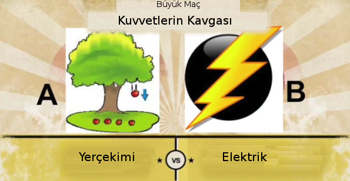
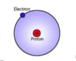
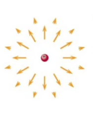
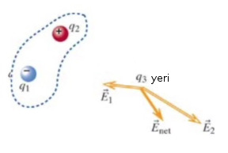
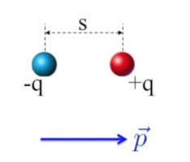
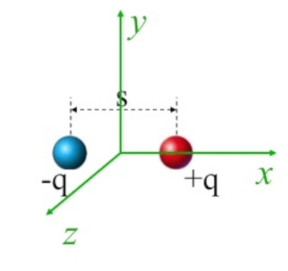

# Elektrik ve Manyetik Etkileşimler - Ders 2

Bir soruyla başlayalım: eğer yerçekimi kuvveti ve elektrik kuvveti kavga
etse kim yenerdi?



[Hoca bu soruya cevabı sınıf içi oy verme sisteminde sordu, oylar geldi,
87\% elektrik dedi]. Tamam. Şimdi bu sorunun cevabını bilimsel olarak
vermeye uğraşacağız. Matematik ve mantık kullanarak cevabı bulmaya
uğraşacağız.  

Kavganın tabii ki kuralları olmalı, ki adil bir kapışma olsun. 

Kapışmanın yeri olarak bir hidrojen atomunu seçeceğiz. Hidrojen atomu bir
proton ve bir elektrondan oluşur, bu ikisi arasında özel bir mesafe
olduğunu varsayacağım, ve bu mesafe üzerinden bu iki öğe arasında hem
yerçekimi, hem de elektrik kuvvetini hesaplayacağım. 



Üstte görülen biraz karikatürsel tabii, gerçekte eletronlar "bulanık
(fuzzy)'', kesin olmayan, bulutumsu bir yapıda. Bu resmin doğru olmadığını
kimyadan biliyoruz değil mi? Elektron çekirdek etrafında o kadar hızlı
dönüyor ki bu bir bulanık bir top şekli oluşturuyor, dokunduğunuzda o topa
dokunmuş oluyorsunuz [eğer elektron küresel dış cepheri oluşturuyorsa
farklı farklı sürekli farklı yörüngelerde gidiyor demektir, yani iki
boyutta tek çember üzerinde değil sürekli merkeze aynı mesafede ama farklı
şekillerde dönüşü gerçekleştiriyor]. Bu dokunsal deney bir vantilator ile
olana benzer. Orada da pervane o kadar hızlı dönüyor ki elimizi uzatınca
pervaneye bir şekilde dokunmuş oluyoruz.

Bu çılgın dönüşün tabii ortalama bir merkeze uzaklığı var, bu mesafe, adil bir
kavga olsun diye bunu seçtik, $r = 5.3 x 10^{-11}m$, ki bu Bohr yarıçapı olarak
ta biliniyor. O zaman yerçekimi kuvveti $F_{grav}$ hesabı için

$$ F_{grav} = G \frac{m_1 m_2}{r^2} \hat{r}$$

Eletronun kütlesi altta, oldukça az,

$$ m_{electron} = 9 x 10^{-31} kg $$

Proton altta, biraz daha fazla,

$$ m_{proton} = 1.7 x 10^{-27} kg $$

Bu iki kütlenin büyüklük/boyut sırası (üstelsel fark olarak -orders of
magnitude-) bağlamında ne kadar farklı olduğunu görüyoruz. Bir proton elektronun
aşağı yukarı 10,000 katı daha ağır.

$$
F_{grav} =
\frac{ (6.7 x 10^{-11} Nm^2 / kg^2) (1.7 x 1^{-27} kg) (9 x 10^{-31} kg) }
     { (5.3 x 10^{-11} m)^2 }
\approx O(10^{-46})    
$$

$\hat{r}$ bize bir yön veriyor sadece, ama bizim sadece bir büyüklüğe
ihtiyacımız var o sebeple $\hat{r}$'i kullanmadım. Bu arada aslında
hidrojen protonu da biraz hareket ediyor, elektron ve proton birbirlerinin
etrafında dönüyorlar, ama proton o kadar ağır ki hidrojen atomu olarak onu
kabul ediyoruz, ve proton sanki yerinde duruyormuş gibi düşünüyoruz.

Üstteki hesabın büyüklük/boyut sırası olarak alındığına dikkat, dediğim
gibi kabaca bir büyüklük ile ilgileniyorum, hatta büyüklüğün en büyük
kısmiyla ilgileniyorum. Kaç tane sıfır var elimde bunu bilmek istiyorum,
$O()$ notasyonu bu sebeple kullanıldı. Yani 10'un katları nedir, buna
bakıyoruz, ondan önce gelen kısmı dikkate almıyoruz, $2 x 10^{5}$ ile
$5 x 10^{5}$ aynı şey oluyor.

Üstteki $10^{-46}$ sonucunu aslında çarpımı sadece 10'un katlarının
uygulayarak kafadan hesapla bulabilirdim. Neyse sağlama olsun diye alta
veriyoruz,

```python
print ((6.7e-11 * 1.7e-27 * 9e-31) /  (5.3e-11)**2)
```

```
3.64934140263e-47
```

[-47 çıktı ama neyse, hoca hesabı yanlış yapmış olabilir] Fakat kabaca bir
hesap yapmak istesek çarpımlar 10 katları için toplam bölüm ise çıkartma
olacağı için sadece 10'un katları üzerinden toplama çıkartma ile bir sonuca
erisebilirdik,

```python
print (-11-27-31-(-22))
```

```
-47
```

-22 çünkü -11'in karesi alındı. Niye bu hesabı yapmanızı istedim? Hesap
makinaları, bilgisayarlar ile pek çok hesabı yapabiliyoruz tabii ki. Ama
kontrol amaçlı olarak bu hesabı akıldan kabaca yapmak çok faydalı. Çünkü
belki bilgisayara bazı değerleri yanlış girmişizdir, ya da hesap
kodlamasında hata olur, vs. Ayrıca boyut sırası konusunda fiziksel akıl
yürütme, sezgi yetisini kazanmak iyidir.

Neyse $O(10^{-46}) N$, yani Newton olarak yerçekimi kuvvetini hesapladık.

Şimdi elektrik kuvvetini hesaplayalım. Hesap yani hesap sadece farkı sayıları
kullanarak.

$$ r = 5.3 x 10^{-11} m $$

Sabit lazım (sadece birimlerin doğru çıkması için kullanıyoruz)

$$ \frac{1}{4\pi \epsilon_0} = 8.99 x 10^{9} Nm^2$$

Formülü hatırlarsak,

$$ F_{elec} =
\frac{1}{4\pi \epsilon_0}
\frac{Q_1 Q_2}{r^2} \hat{r}
$$

Sayıları yerine koyalım, genel büyüklük ile ilgilendiğim için $\hat{r}$'i
yoksayıyorum. 

$$ F_{elec} =
\frac{(8.99 x 10^{9} Nm^2) (1.60 x 10^{-19} C)^2  }{ (5.3 x 10^{-11} m )^2  }
\approx O(10^{-7}) N
$$

Hesap formatı yerçekimine ne kadar çok benziyor değil mi? Her iki kuvvet te
$1/r^2$'e oranlı olarak azalıyor, çünkü daha önce dediğim gibi fizikte
$1/r^2$ kanunları çok yaygındır. Ayrıca görüldüğü gibi mesafeyi eşit aldım
çünkü adil bir dövüş olmalı, aynı mesafe üzerinden yerçekimi ve elektriği
karşılaştırıyoruz. Yük $1.60 x 10^{-19} C$, bu mantıklı çünkü tek bir
parçacık (elektron, proton) bakıyoruz ve Millikan deneyinden biliyoruz ki
tek parçacıgin yükü bu sayıdır. Ve sonuç boyut sırası olarak $-7$. Kabaca
hesap,

```python
print (9 + (-19*2) - (-11*2) )
```

```
-7
```

Aynı sonuç.

Peki maçta kim galip geldi? Elektrik kesinlikle galip geldi. Eğer sadece üstteki
büyüklükleri alsam ve bir oran hesaplasam,

$$ \frac{F_{elec}}{F_{grav}} \approx 2.27 x 10^{39}$$

Yani hidrojen atomu içinde elektrik kuvveti ile yerçekimi arasında 39 boyut
sırası var, işte bu sebeple [eğer aldıysanız] kimya öğretmeniniz size hidrojen
atomunu anlatırken hiç yerçekim kuvvetinden bahsetmedi, çünkü o çerçevede
hakikaten hiç anlamlı, önemli değil. Demek ki elektrik kuvveti yerçekiminden
çok, çok daha kuvvetli.


Deney olarak şunu yapalım, bir tahta parçasını masa üzerinde koyuyorum, onu
ufak bir platform üzerine koydum, hassas bir dengede duruyor, böylece
çekilip itilirse bunu hemen göreceğim.  Ona demir bir boruyu
yaklaştırıyorum, hem tahtada hem boruda kütle var, aradaki çekim kuvveti
tahtayı etkilemeli. Ama etkilemiyor çünkü bu tür çekim çok zayıf. Ama demir
boruya bir kumaşı sürte sürte onu yüklü hale getirirsem şimdi
yaklaştırıyorum [ve tahtanın hareket ettiği görülüyor].

39 boyut sırası üstünde olmak nasıl bir şey hayal etmesi zor olabilir, eğer
üç sıfır bin ise, 39 boyut sırası bin tane milyar milyar milyar milyara
tekabül eder, buna İngilizce duodecillion deniyormuş, dün gece İnternet'ten
baktım. Bu tür bir sayının ayrı isminin olduğunu beklemiyordum açıkcası,
ama varmış.


Hepinize 10'un Katları video'sunu [1] seyretmenizi tavsiye ederim. Lisede
belki öğretmenlerinizden biri bu video'yu göstermiştir. 70'li yıllarda
çekilmiş, video evrende ölçülebilecek en büyük yapılardan başlıyor, ki
bunlar galaksi kümeleri, ve en ufak ölçülebilecek şeylerden biri, protona
bakıyor. İşte o video anlatıyor ki bu en ufak ile en büyük arasında 39
boyut sırası var.

Devam edelim; eh karşılaştırmayı yaptık, elektrik yerçekimin 39 boyutu
sırası üzerinde. Peki o zaman niye günlük yaşamda sürekli yerçekimini
hissediyoruz ama elektrik çekimini hissetmiyoruz? Yani şu anda yerçekimini
hissediyoruz değil mi?  Eğer sandalyenizde oturabiliyorsanız, durduk yerde
oraya buraya savrulmuyorsanız yerçekim etkisi var demektir. Neler oluyor o
zaman?

[Bir öğrenci büyük kütle diyor] Evet olan şu: insanlara etki eden
yerçekiminden bahsedince koca dünyanın kütlesinin üzerimizdeki kuvvetini
hesap etmemiz gerekir. Dünyanın kütlesi çok büyük olduğu için yerçekimi
genelde etkisi olsa bile dünya çapında olunca çok etkili hale gelir.

[Bir diğeri elektrik kuvvetini de hissediyoruz aslında hocam diyor]
Doğru!. Bunun etkisini şurada çözülüp bir biyolojik çorba gibi yerde
yayılmamamda görebiliyorum. Elektriksel kuvvetler beni, hepimizi bir arada
tutuyor. Bu bir bakıma nefes aldığımız havayı hissetmememiz gibi, sürekli
orada, onu normal görüyoruz artık.

[Bir başka öğrenci sizi iten çok elektriksel kuvvet var diyor] Evet şu anda
pek çok şey tarafından itiliyorum da.. Mesela yerçekimi beni çekip ta
birinci kata göndermiyor. Altımdaki yer tabakası bunu engelliyor ve bu
engelleme sonuçta bir elektriksel etkileşim, altımdaki kat tabakasının
elektronları benim elektronlarımı itiyor.

Genel olarak şu yorum en iyisi belki: elektrik kuvveti müthiş kuvvetli
evet, 39 boyut sırası yerçekiminin üzerinde, ama bu kuvveti hissetmiyor
olmamızın sebeplerinden biri pozitif ve negatif yüklerin olması. Ben + ve -
yüklerden oluşuyorum (ve nötr olan nötronlardan), ama elektrik kuvveti (ve
kuantum mekaniği) tüm bunları birarada tutuyor, eksi ve artı yükler
arasında çekim var, kuvvetli bir çekim, ama makro seviyede bakarsanız bu
kuvvetler birbirini dengelemiş bir halde. Net olarak fazla bir - ya da +
yüküm yok. Kış zamanı gelince halıda yürüyerek, vs. net yük elde edebilirim
ve bir demiri tutunca elektrik kuvvetini görebilirim, ama genelde bu
dengesizlik görülmez. Diğer yandan eksi kütle diye bir şey yok, öyle ki
yerçekimi kuvvetini dengeleyip yoketsin.

Şimdi ilginç bir soru: daha önce Coulomb'un kanunundan bahsettik, iki yük
arasında kuvvet

$$ \vec{F} = \frac{1}{4\pi \epsilon_0} \frac{Q_1 Q_2}{r^2} \hat{r}$$

Sonra dedik ki bu iki yükün birbirine kuvvet uygulamasının sebebi her yük
etrafında bir elektrik alan var, diğer yük bu alanı hissediyor, ve
etkileniyor. Yani öteki yükü resimden çıkartsam bile hala etrafındaki uzayı
her yönde etkiliyor, bir anlamda bu etki alanına gelecek diğer bir yükü
itmeyi ya da çekmeyi bekliyor. Bu durum şu denklemde idi

$$
\vec{F}_2 = q_2 \vec{E}_1 \quad
\vec{E}_1 = \frac{1}{4\pi \epsilon_0} \frac{q_1}{r^2} \hat{r}
\qquad (1)
$$



Tamam, bir alan var, parçacığın etrafından kirpinin dikenleri gibi çıkıyor,
$1/r^2$'e oranlı olarak zayıflıyor. Şimdi soru şu, elektrik alanını üreten
parçacık kendisi bu alanı hisseder mi? Orijinde ne olur?  Bu alan kendi üzerinde
bir kuvvet uygulamış olur mu? Ne düşünüyorsunuz [öğrencilere soruyor] ? Acaba
formülde $r \to 0$ iken neler olur?

Biriniz dedi ki formül uygun bir formül değil, çünkü orijinde patlıyor. Evet
matematik geçmişinden gelenleriniz bu formülü pek beğenmeyecektir, anlıyorum. Bu
tür formüller genelde orijin merkezli tanımlanır, üstteki formül böyle
değil.. Doğru. Evet, sonuç olarak protonun kendisi üzerinde etkisi yok, çünkü
önemli bir sebep formül orijinde tanımlı bile değil (doğru çünkü o noktada
bölende $r^2$ yüzünden sıfır olur). Diğer sebep $\hat{r}$ vektorü de orijin
durumunda garip bir halde, bu vektör nereye işaret ediyor?  Hiçbir yere.

Ayrıca orijinde kuvvet etkisi olsaydı hangi yöne işaret ederdi? Simetri
üzerinden her tarafa işaret etmesi gerekirdi, çünkü kuvvet bir yöndür sonuçta,
ve her yöne doğru olan kuvvet etkisinin toplam etkisi sıfır olurdu. Yani nasıl
bakarsak bakalım bu parçacık kendisi üzerinde kuvvet uyguluyor olamaz.

O ya da bu sebepten, şimdiye kadar konuştuklarımız arasından favori birini
seçebilirsiniz, hepsi doğru.

Şimdi yükü birörnek (eşit) olarak dağılmış bir küresel (sphere) kabuğun yükünü
hesaplamaya gelelim.


Yük kürenin dışında, bir top düşünelim, elektrik yükü sadece dış cepherine eşit
şekilde dağılmış olsun. Ayrıca yükün o halde takılı kalmış olduğunu düşünelim,
yani gerçek dünyada mümkün olsa da oradan oraya yer değiştiremiyorlar. 

Nokta parçacıklar için elektrik alanı (1) formülünde. Üstteki küre için elektrik
alanı $\vec{E}_{sphere}$ uzaktan neye benzer? Diyelim bu üstteki resmi, küreyi
dışarı, dışarı binanın dışına gönderdik, ta oradan alanın nasıl gözüktüğünü
düşünelim. O kadar uzaktan küre bir nokta gibi olurdu değil mi? Evet. Küre bir
nokta gibi olurdu ve elektrik alanı da bir noktasal parçacığın alanı gibi
davranırdı. Yani $r >> R$ için ($r$'nin $R$'den çok çok büyük olduğu durumlarda,

$$ \vec{E}_{sphere} = \frac{1}{4\pi \epsilon_0} \frac{Q}{r^2} \hat{r} $$

Ya peki küreye çok yakın dursam? Mesela x ekseni üzerindeyim ve kürenin hemen
dışındayım. Bu durumda da $\hat{r}$ dışarı doğru işaret eder, nokta parçacık
faraziyesinde olduğu gibi.  Tüm bu hesapları detaylı olarak 16. bölümde
yapacağız, fakat üstdüşüm (superposition) prensibini kullanarak üstteki formülün
tüm $r > R$ için geçerli olduğunu söyleyebiliriz, $\vec{E}_{sphere} = 0$ ise
$r<R$ içindir. İlginç değil mi? Küre içinde net elektrik alanı sıfır [bu durum
  Faraday kafesi (cage) deneyindeki [2] durum herhalde]. Olan içeri dönük olan
elektrik alan etkilerinin birbirini iptal etmesi, ki burada ana faktor üstdüşüm
prensibi.

Üstdüşüm prensibi şimdiye kadar sezgisel seviyede tarif edip kullandım, fakat
şimdi daha detaylı olarak işleyelim. Üstdüşüme göre bir noktadaki elektrik
alanının etkisi o noktaya etki eden tüm parçacıkların alanlarının doğrusal
toplamıdır. Kitabınızda uzun uzadıya bir tarif var, ona da bakın, ama daha kısa
olarak tarif budur.



Mesela resimde $q_1$ negatif yükte, $q_3$ üzerinde elektrik alanı $E_1$'yi
yaratıyor, ki bu alan kendisine doğru yönde işaret ediyor. $q_2$ farklı bir
yönde. Bu arada $q_1,q_2$'nin nispı büyüklüklerinden bahsetmedim, ama figüre
bakarak kabaca tahmin edebiliriz, $\vec{E}_2$ oku $\vec{E}_1$ okundan daha
büyük. Herneyse, bu noktadaki hissedilen elektrik alanı bu iki alanın vektör
toplamı, ki bu toplam $\vec{E}_{net}$. Bu toplam aşağı yukarı resimde görülen
yönde olurdu. 

Elektriksel İki-Kutup (Dipole)

Peki elektriksel iki-kutbun elektrik alanı nedir? Ondan önce iki-kutup nedir?
Bir iki-kutup adı üstünde, iki tane ama ters yüklü parçacığa verilen isimdir.



Örnekte bir eksi bir artı yük olsun, aralarındaki mesafe $s$. İki-kutup momenti
denen bir kavram var, bu sadece $q \cdot s$, eğer vektör olarak hesaplamak
istersek $\vec{p} = q \vec{s}$. Yön negatif yükten pozitif yüke doğru gidiyor.

Şimdi orijini düzgün bir yere koyalım, problemlerde muhakkak orijini seçme
şansımız oluyor, şimdi onu üstte görülen iki parçacığın tam ortasına koyuyoruz.



X-ekseni parçacıklar arasındaki hayali çizgiye paralel olsun, ve şimdi elektrik
alan hesaplarına girmek istiyorum. Altta yeşil noktadaki elektrik alanı
hesaplayalım.


Üstdüşüm prensibini ve noktasal parçacıklar için olan (1) formülünü
kullanacağız. Orijinden yeşil noktaya olan uzaklığı $< x,0,0 >$ olarak
yazabiliriz. Bu noktaya etki eden $\vec{E}_{+}$ ve $\vec{E}_{-}$'i bulmam
lazım. Resime bakarsak $\vec{E}_{+}$ daha uzun bir vektör olarak gösterilmiş
çünkü pozitif yük daha yakın. Onun o noktaya uyguladığı elektrik alan daha
kuvvetli. Ayrıca elektrik alanının sadece $x$ ekseni yönündeki bileşeniyle
ilgileniyorum.

$$
E_{1,x} = E_{+,x} + E_{-,x} =
\frac{1}{4\pi\epsilon_0} \frac{q}{(r-s/2)^2} +
\frac{1}{4\pi\epsilon_0} \frac{+q}{(r+s/2)^2} 
$$

Resimdeki $\vec{r}_{-}$ ve $\vec{r}_{+}$ birim vektör, aynı yönü
gösteriyorlar. $r$ iki kutbun ortasından yeşil noktaya olan mesafe. 

Soru

Hocam orijini bu şekilde seçince acaba kestirme bir yola mı girmiş olduk?

Cevap

Her problem için hangi koordinat sistemini seçmekte serbestsiniz. İşinizi hangi
sistem kolaylaştırırsa onu seçin (tabii bazı problemler özü itibariyle bir
orijini kendisi tanımlar). Fakat sonuçta aynı fiziksel sonuçlara erişmemiz
gerekir. Mesela bu problemde farklı bir kordinat sistem seçsem ara sonuçlarda
bazı farklı sonuçlar olabilir ama nihai ana sonuç aynı rakamları vermeli.

Devam edelim, iki kesiri nasıl toplayacağımızı biliyoruz, her kesirin bölenini
diğer kesir ile çarparız ve böylece bölenleri eşitleriz.

$$
E_{1,x} =
\frac{1}{4\pi\epsilon_0}
\frac{qr^2 + qrs + qs^2 / 4 - qr^2 + qrs - qs^2 / 4}
     {(r+s/2)^2  (r-s/2)^2 } 
$$

Bu açılımın biraz hammaliyeti vardı, ama bu tür problemleri çözerken acele
etmeyin, diyagramda olanları formüle iyi tercüme ettiyseniz, adımlarda hata
yapmadıysanız doğru cevaba erişirsiniz. 

Bir iptal var,

$$
= \frac{1}{4\pi\epsilon_0}
\frac{\cancel{qr^2} + qrs + qs^2 / 4 - \cancel{qr^2} + qrs - qs^2 / 4}
     {(r+s/2)^2  (r-s/2)^2 } 
$$

Bir tane daha,
     
$$
= \frac{1}{4\pi\epsilon_0}
\frac{qrs + \cancel{qs^2 / 4} + qrs - \cancel{qs^2 / 4}}
     {(r+s/2)^2  (r-s/2)^2 }  =
\frac{1}{4\pi\epsilon_0}
\frac{2 qrs} {(r+s/2)^2  (r-s/2)^2 }       
$$

Bayağı karışık bir denkleme eriştik. Bu arada, fizik dersinde, bu fizik dersinde
bu tür formülleri ezberlemenizi beklemiyorum. İlgilendiğimiz şey bu
değil. Enformasyon çağındayız, herhangi bir bilgiyi İnternet'ten kolayca
bulabilirsiniz. "Bilgi güçtür'' sözü artık doğru değil, bilgiyle ne yapacağını
bilmek esas önemli olan.

Bu problemde dikkat edersek çok ufak bir bilgiyle başladık, bir nokta parçacığın
elektrik alan denklemiyle. Sonra diyagrama bakarak matematiğini yazdık, ve
üstteki nihai sonuca eriştik. Öğrenmenizi istediğim işte bu problemi formülize
edebilme ve adımları takip ederek sonuca erişebilme becerisi. 

Üstte bulduğumuz x-ekseninde olan iki kutuplu elektrik alanı. Peki çok uzakta bu
alanın etkisi ne olurdu? Bu durumda $r$ değerinin $s$ değerinden çok daha büyük
olduğunu söyleyebilirim, $s$ iki kutbun büyüklüğü. $r >> s$ durumunda,

$$
\left( r-\frac{s}{2}\right)^2 \approx \left( r+\frac{s}{2}\right)^2 \approx r^2
$$

O zaman

$$
E_{1,x} = \frac{1}{4\pi\epsilon_0} \frac{2sq}{r^3}
$$

$$
\vec{E}_1 = \left<  \frac{1}{4\pi\epsilon_0} \frac{2 sq}{r^3}, 0, 0 \right>
$$

Bu sonuç bize şunu söylüyor, elektrik alanı ne kadar uzağa gidilirse gidilsin
tamamen yokolmuyor. Alanın kuvveti iki kutbun kuvvetine bağlı, formülde $sq$
var, yani $q$ ne kadar büyükse, iki yükün arasındaki mesafe ne kadar büyükse,
alan o kadar kuvvetli. $r^3$ etkinin mesafe arttıkça azalışının normal
formüllere göre daha hızlı azalması demektir.. Nokta parçacıklarda azalış
$1/r^2$'ye oranlıydı, burada aşağı yukarı $\tilde 1/r^3$'e oranlı. 

Kaynaklar

[1] *Powers of Ten*, [https://www.youtube.com/watch?v=0fKBhvDjuy0](https://www.youtube.com/watch?v=0fKBhvDjuy0)

[2] Wikipedia, *Faraday cage*, [https://en.wikipedia.org/wiki/Faraday_cage](https://en.wikipedia.org/wiki/Faraday_cage)


