# Elektrik ve Manyetik Etkileşimler - Ders 3

Daha önce nokta yüklerinin elektrik alan hesabını gördük. Eğer daha çetrefil bir
elektrik alan tipi varsa, bu tür alanları birden fazla noktasal yükün üstdüşümü
(toplamı) olarak görebiliriz. Bu şekilde bir kürenin, bir iki-kutup yükünün
elektrik alanını hesapladık. İki-kutup alttadır,

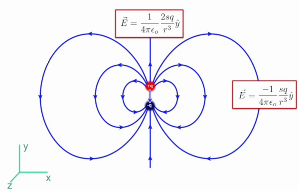

Resimdeki notasyon ders kitabından geliyor, bu notasyonda $\hat{y}$ bir birim
vektördür ve y ekseninde boyunca yukarı gösteren birim vektördür, yani
$<0,1,0>$. Bu eksen boyunca belli bir elektrik alanı var. Diğer her yerde biraz
daha farklı bir alan var, burada pozitiften çıkıp negatife doğru bir gidiş
görülüyor, bu demektir ki eğer tüm kordinatı yatay olarak keşsek, orada elektrik
alanı hep aşağı doğru gitmek zorunda. Bunun formülü sağ tarafta görülüyor. Son
derste bunları gördük.

Bugün yükün korunması / muhafaza edilmesi (conservation of charge) konusunu
göreceğiz. Plastik bantla ilginç bir deney yapacağız, bu tür bantın niye her
şeye yapıştığını göreceğiz (yapışkan kısmı var tabii, ama bunun haricinde hala
ek bir yapışkanlığı var). Sonra atomların kutuplaşması (polarization) konusuna
bakacağız, ve bir nötr atom ile noktasal parçacık arasındaki kuvveti
hesaplayacağız. 

Yükün muhafaza edilmesi kuralı der ki bir sistemin toplam yükü, yani sistemin
[baktığımız bölge] yükü artı onun etrafındaki yüklerin toplamı hep aynı
kalmalıdır. Sistemi nasıl tanımlarız? Bir fizik problemini incelerken
"sistemin'' ne olduğuna biz karar veririz. Problem alanının etrafına hayali bir
kutu çizeriz, ve o kutunun içindekiler bizim sistemimiz olur, kutu dışındaki her
şey onun "etrafı'' olur. Ve her durumda sistem + etrafındakiler tüm fiziksel
evren olmalıdır. Yani sistem artı etrafının toplam yükü değisemez derken evrenin
yükü değisemez diyoruz, ki bu doğru.

Fakat yükü bir yerden diğerine kaydırmak mümkün. Mesela yükü sistemden alıp
etrafındaki bölgeye taşıyorum, ya da ters yönde. Mesela alttaki resimde keyifsiz
adam var, onun kafasına balonları sürtersek, saçı fazla yok ama sürtülen
yerlerde balonlar negatif yüklü, kafası pozitif yüklü hale gelecektir. Bu
durumda bir yerden diğerine yük transferi yapmış olduk, ama toplam yük
aynı. Sistem adamın saçı diyebilirim, geri kalan her şey, balon, vs. etraf olur,
toplam yük değişmedi ama yükü taşımış olduk.

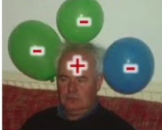

Peki yükü yoketmek, ya da yoktan yaratmak mümkün müdür? Bir hayır cevabı
geldi. Bir yükün yaratılmış gibi durduğu bir örnek aklınıza geliyor mu? Evet,
biriniz çok güzel bir gerçek dünya örneğinden bahsetti, bir pil. Bir pile
bakarsak negatif ucu vardır, pozitif ucu vardır, onlar işaretlenmiştir, sanki o
pili kullanıp "bitirince'' yükler bir yere gitmiş, yokolmuş gibi duruyor.. Ama
biraz önce bahsettiğimiz kurala göre pil + etrafının toplam yükü değişmemiş
olmalı.

Biriniz madde, anti-madde fenomeninden bahsetti. Bir parça maddeyi alıp bir
anti-parçayla etkileşime soksam birbirlerini yokederler. Ve bu yokolma olmadan
önce muhakkak bir yük taşıyor olurlardı değil mi? Her iki taraf ta nötr olabilir
tabii, ama arkadaşınızın dediği gibi bir elektron ve pozitron etkileşime
girerse, bu iki parçacık madde / anti-madde eşidir, ve bum diye birbirlerini
yokederler, ve o zaman yük kaybolmuş mu olur? Bu tür bir etkileşim nadir bir
olay değildir bu arada, her tarafınızda, vücudunuzda, elektron / pozitron
eşlerini birbirlerine sürekli yoketmekle meşgullar. Diğer yandan elektron,
pozitronlar ortaya da çıkıyorlar. Uzay parça / anti-parça eşlerinin kaynayan
suyun baloncukları gibi sürekli fıkır fıkır bir hareket halindedir. Eşler
sürekli ortaya çıkar, ve sürekli yokolurlar, bu sürekli olur.

Hmm.. o zaman evren yük yaratıyor, yük yokediyor mu demektir bu? Evet, bu
hakikaten oluyor. Ama, dikkat, yokolma, yaratılma hep eşli oluyor, bir
negatif-pozitif çift (toplam yük sıfır) beraber yokoluyor, ya da beraber
yaratılıyor, hala toplamda bir değişim yok. Yani yük yaratmak, yoketmek çiftler
üzerinden mümkün, bu şekilde yük muhafaza kuralı çiğnenmemiş oluyor.

Bant konusuna gelelim. [Hoca biraz dramatik şekilde bir kağıdı katlayıp onu
  bantla kapatmaya uğraşıyor, şakadan biraz beceriksiz hareketler yapıyor ve
  bant sürekli yanlış yerlere yapışıyor, el tersine vs]. Bu sizin başınıza geldi
mi?  Görüyorsunuz bantın sadece yapışkan kısmı değil, öteki tarafı da absürt
şekillerde oraya buraya yapışıyor. Burada bir şeyler dönüyor gibi geliyor bana...

Şimdi kontrollü bir deney yapmak için iki bant parçasını üst üste masanın üstüne
yapıştıracağım. 

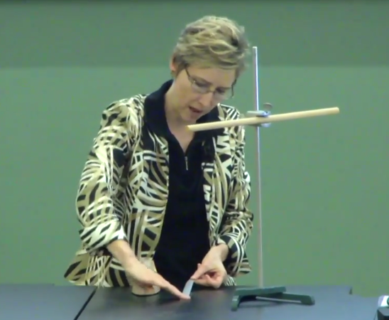
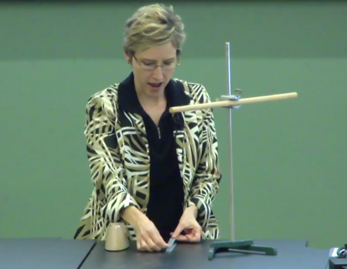

Çünkü bantı açarken bir şeyler oluyor gibi geliyor bana [hoca biliyor tabii ne
olduğunu ama bir düşünme şeklini göstermek için bunları aktarıyor], o sebeple
iki bantı üst üste koydum, birini çekince ne olduğuna bakacağım. Ve çekiyorum,

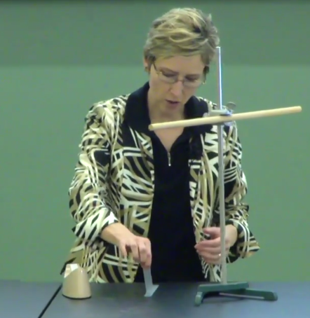

ve bakıyorum bant ters dönüp acaip bir şekilde bana yapıştı bile.. Deneyi
tekrarlayayım [tekrar yapıştırıp çekiyor] bu sefer dikkatli olayım bana
yapışmasın. Alıp bantı platforma yapıştırıyorum.
Sonra ikinci bir bantı alıyorum, deneyi tekrarlıyorum, bu ikinci bant ile
birinci arasındaki etkileşime bakacağım şimdi. Sürekli masadaki aynı banta
yapıştırıp çekmemin sebebi onu "referans bantı'' olarak kullanmak istemem,
böylece 2. banta olanın 1. banta olanla tıpatıp aynı olduğunu garantilemiş
oluyorum. 

Bir bantı referans bantına yapıştırıp çekip çıkarmadan önce nötr bir pozisyondan
başlamayı garantilemiş oluyorum [çünkü hoca dokunarak eğer varsa fazla yükü
 kendi almış olur, ya da masa bir nevi "toprak'' olacaktır, nötr referanslık
 buradan gelir]. Sonra bantı çekip çıkartınca ilginç şeyler olabilir
tabii. Devam edelim, 2. bantı 1. banta yaklaştırayım,


Görüyor musunuz? Nasıl birbirlerini itiyorlar?  Burada bir şeyler dönüyor.. Bu
ders elektrik ve manyetik iletişimler dersi, o zaman yüklerle alakalı bir şeyler
oluyor olmalı. Şimdi üçüncü bir bant hazırlayalım, aynı şekilde, ve bu bant ta
1. ve 2. bantı itiyor.

Acaba bu bantlar eğer yaklaşsam bana çekilir mi itilir mi? Önce kendimi
topraklayım [sınıftaki masaya dokunuyor, sonra asılı bantlardan birine
yaklaştırıyor]. Bir çekim olduğunu görüyoruz. Bu etki her ne ise çok kısa
menzilli çünkü etkisini görmek için elimi çok yaklaştırmam gerekti. Kıyasla
iki bantın arasındaki etki çok daha uzun menzilli idi. Şimdi bu olanları
açıklayalım.

Olanlar nedir? Bantı çekerken yüklerin bir şekilde bir değişimden geçerek,
dağılımını değiştirdiğini tahmin edebiliriz. Evreninin toplam yükünü
değiştiremeyiz, ama yükleri bir yerden diğerine taşıyabiliriz, ya da çiftsel
olarak yaratıp yokedebiliriz (bu örnekte olan büyük bir ihtimalle bu
değil). Büyük ihtimalle olan şudur: görülen bantın bir yapışkan kısmı var. Ben
kimyacı değilim, hikayenin tamamı için bir kimyacıya danışmak iyi olur, ama
bantın yapışkan kısmının uzun, sarkık moleküllerden oluştuğunu
biliyoruz. Genelde kimyada bu oluş bilinir, yapışkanlık uzun, sarkık molekül
demektir. Ve tahminimiz o'dur ki bir bantı ötekinden çekip çıkardığımızda bu
uzun sarkık moleküllerden bazıları parçalanır. O parçalanma sırasında bir
elektron bazen bir tarafta, bazen öteki tarafta kalabilir, o zaman o tarafın
toplam yükü negatife doğru değişir, diğer tarafta pozitif yüklü yarı molekül
kalır, vs.

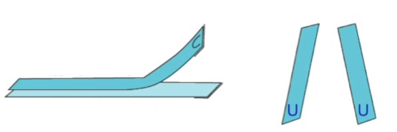

Bir elektriksel kuvvet olmalı diye düşünüyoruz çünkü gördüğümüz itme kuvveti 1)
yükler (bantlar) arasında direk bir çizgi üzerinde etki ediyor 2) yükleri
uzaklaştırdıkça etkisi azalıyor 3) kuvvet yüklerin miktarına doğru oranlı.

Şimdi ipek bir bezi kullanarak banttaki yüklerin işaretlerini kontrol
edelim. Bir ipek bezi cam boruya sürtersek bezde eksi camda artı yük
oluşur. Niye olduğunu ispatlamayacağım, böyle olduğunu kabul edelim, deneysel
olarak en azından bunu biliyoruz. 

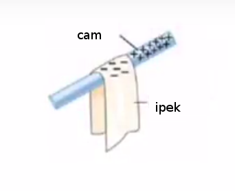

Camdaki yükün bilgisini kullanarak bantlarda ne olduğunu anlayabileceğiz. Tamam,
yeterince sürttük, bantlara yaklaştırıyoruz, ve ne oluyor? Bantlar itiliyor, o
zaman bantlarda da aynı yük, yani pozitif yük olmalı. Diğer yandan bezde negatif
yük olmalı, onu yaklaştırıyoruz, o bantları çekmeli [hafif bir çekim görüldü,
 hoca bezin daha dağınık, büyük yapısı sebebiyle yükünün herhalde tam odaklı
 olmadığını söyledi]. 

Sürtme ile hangi yük, nasıl oluşuyor? Tahmin edilen büyük moleküllerin
parçalandığı ama niye bu parçalanmanın negatif ya da pozitif yarattığı bilinmiyor,
şu anda bu araştırma konusu. Camın, ya da bant örneğinde bile uzun bir molekülün
parçalanması durumu var ama niye buradan negatif ya da pozitif yük çıkar bunu
bilmiyoruz.

Şimdi nötr obje ile pozitif yük arasındaki çekime gelelim. Hatırlarsak bantları
hazırladıktan sonra elimi banta yaklaştırdım ve çekim vardı. Ben etrafa, yere
bağlı objelere dokuarak kendimi topraklamıştım, yani yüküm nötr
durumdaydı. Benimle bantın arasında çekim vardı, yani pozitif yük ile sıfır /
nötr yük arasında, bu durumu da bir şekilde açıklamamız lazım.  Belki elimde,
nötr olmasına rağmen, hala elektronlar, protonlar, nötronlar var, ve elimdeki
elektronlar bir şekilde banttaki pozitif yük ile etkileşime geçiyor. Bu fikri
inceleyelim isterseniz.

Tekrar hidrojen atomuna dönelim; insan vücudu, ya da cam, bant daha çetrefil
atomlardan oluşuyor ama basit örnek ile başlamak her zaman öğreticidir. 

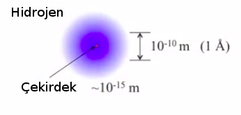

Hidrojen atomu tek bir proton ve tek bir elektrondan oluşur, merkezinde
çekirdeği vardır, proton buradadır ve bu çekirdeğin büyüklüğü aşağı yukarı
$10^{-15}$ metredir. Elektron protonun etrafında, onu küresel bir bulut
olarak gösterdim, elektron müthiş hızlı bir şekilde bir orada, bir burada
hareket ederek bu küreyi oluşturuyor. Bu kürenin büyüklüğü yaklaşık olarak
$10^{-10}$ metre, yani 1 ${\AA}$ (angstrum).

Hidrojin çekirdeğindeki proton noktasal bir yüktür, bu yüklerin alanını
hesaplamayı biliyoruz. Peki elektron küresi? Onu da noktasal yük olarak
görebiliriz, eğer yeterince uzaktaysak o kürenin dışında elektronun etkisi yine
noktasal olarak görülebilir. O zaman dışarıdaki herhangi bir nokta için toplam
etki sıfır olacaktır, iki noktasal yük, biri negatif, biri pozitif, toplam etki
sıfır. 

Daha detaylı bakmak gerekirse, pozitif bir yükün atoma yaklaştığını düşünelim.
Elektron bulutu o yüke bir çekim hisseder ve fiilen çekilir de, bunun sonucu
olarak negatif yükün merkezi noktası biraz kaymış olur.

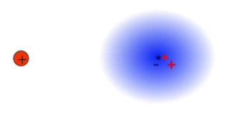

Protonun itildiğini / yer değiştirdiğini iddia etmeyeceğim, çünkü o çok daha
büyük bir kütleye sahip. Bu kayma sonucunda atomda bir iki kutupluluk momenti
(dipole moment) ortaya çıkar değil mi? (Kaymış) bulutun merkezini noktasal eksi
yük, protonu noktasal artı yük olarak düşünürsek,

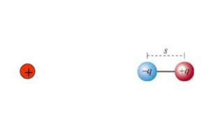

gibi bir iki kutuplu resim ortaya çıkar. Bu duruma özendirilmiş iki kutupluluk
denir, kalıcı değildir, yaklaşan pozitif yük sayesinde ortaya çıkmıştır. Eğer
pozitif yükü dışarı çıkartırsam iki kutupluluk ta ortadan kalkar. 

Soru

Negatif yüklü bir bant yapabilir miydik?

Cevap

Bu ilginç bir soru. Deneyelim. Daha önce bantı çektiğimizde üstteki bant pozitif
halde oluyordu, o zaman onu çekip çıkarttığımız şey negatif olacaktır. Fakat bu
bant topraklanmış masadan çıkartıldığı için oradaki yük nötr kalacaktı. O zaman
bantı masadan çıkartalım, başka bir bant üzerine yapıştıralım ve o banttan çekip
çıkartalım. Bu durumda üstteki bant yine pozitif, ama alttaki negatif
olabilecektir. 

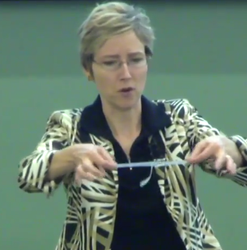

Asılı bantlara yaklaştırınca görüyoruz ki üstteki yine itiyor, ama şimdi
alttakine bakıyoruz, çektiğini görüyoruz.

İki kutupluluğa dönelim, pozitif yük yaklaştı, iki kutupluluğu özendirdi, ve
böylece ortaya bir iki kutuplu yük çıktı. İki kutbun arasındaki mesafe $s$,
moment $p = qs$.

Benzer durumu bir örnek üzerinde daha görelim. Pozitif yükler elime yaklaşsa,
bir iki kutupluluk elimde ortaya çıkardı, elektron bulutu kayar, ve çekirdekteki
pozitif yük ile biraz önce olanlar olurdu. Tabii bu bulut kaymasının çok ufak
ölçekte olduğunu belirtmek isterim, yani el örneğinde elektronlar parmak ucuna,
protonlar elimin tersine gitmiyor, bir ufak atomun elektron bulutunda çok ufak
bir kayma oluyor. Ama bu kayma dışarıda etki yaratacak kadar bir değişime sebep
oluyor. 

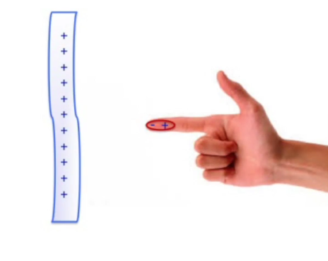

Şimdi hepinize bir soru sorayım: atom A, atom B'den daha rahat
kutuplaştırılabiliyor. Bu atomlardan hangisi $r$ uzaktaki bir noktasal yüke daha
çok çekilir? Cevap, daha rahat kutuplaştırılabilen atomun daha büyük
özendirilmiş iki kutuplu momenti olduğu ve bunun daha kuvvetli bir elektrik alan
oluşturacağı. Bu arada bu tür düşünce egzersizlerini her zaman noktasal yük
bağlamına indirgeyebilirsiniz. Zaten iki kutuplu momentleri noktasal yüklerden
başlayarak inşa ettik değil mi? Aynısını burada da yapabiliriz. Bir noktasal yük
diğerinden daha çok hareket ettiyse bu birinci yük o harekete sebep olan dış
faktöre daha yakın olacaktır, bu da mesafe kısalığı sebebiyle daha fazla kuvvet
etkisi var demektir. Her iki düşünce şekli de doğru. Yani atom A daha fazla
kuvvet hisseder.

Bu kutuplaşma fikrini tekrar gündeme getiriyor. Biraz önce gördüğümüz farklı
atomların, kimyasal yapılarının farkı sebebiyle, elektrik alan uygulandığında
farklı davranma durumuydu. Olanlar neydi? Elektrik alanı atoma uyguluyorum,
atomun elektron bulutu kayıyor, bu atomu kutuplaştırıyor, ama bu kutuplaşma
hangi kuvvette olur? Bu bir açıdan elektrik alanın kuvvetine bağlı tabii, daha
kuvvetli alan daha kuvvetli bir etkiye, kutuplaşmaya sebep olur. Ama alanı
uyguladığımız atom türü de bu etkide bir faktördür. Bir atomun kimyası, ya da
hangi molekül içinde olduğu onun ne şekilde kutuplaştırılabildiğini
etkileyecektir.

$$ \vec{p} = \alpha \vec{E} $$

ki $\alpha$ bir materyelin "kutuplaştırılabilme (polarizability)'' oranı. Bu
bir sabittir, kitaplarda (mesela kitap arkasıdaki bir referans bölgesinde) her
tür madde için ne olduğu yazar. Bu sabiti hesaplamanın yolları da vardır,
ölçmenin yolları da vardır (ve birbirine yakın çıkarlar bu arada, iyi bir şey).

İki kutupluluk, özendirilmiş iki kutupluluk momenti daha önce gördüğümüz gibi

$$ p = q s $$

Ve iki üstteki denklem aslında üsttekine eşit,

$$ |\vec{p}| = p = qs $$

Değişkenler arasındaki ilişki şöyle, alan ne kadar kuvvetliyse $s$ o kadar büyük
olur. 

Şimdi bir noktasal yük ile yakınındaki kutuplaştırılabilir bir atomun arasındaki
kuvveti hesaplayalım.

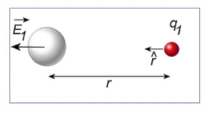

1. Adım: Kolaylık olsun diye bu tür problemleri çözerken her zaman noktasal
yükün pozitif olduğunu farzederim. Denklemler geneldir, negatif yük ile de
işlerler fakat fiziksel fikirleri kabaca tartabilmek için ben pozitif yükü
tercih ediyorum. Neyse, yük atomdan bir $r$ kadar uzaktadır, atomun merkezi ve
yük sabit durmaktadırlar (hareket yok), yük $q_1$ etrafındaki uzayda bir
elektrik alan etkisi yaratıyor, bunun noktasal yük için nasıl hesaplanacağını
biliyoruz, 

$$ 
\vec{E}_1 = \frac{1}{4\pi\epsilon_0} \frac{q_1}{r^2}\hat{r} 
\qquad (1)
$$

2. Adım: Atom kutuplaşarak bu olanlara cevap veriyor.

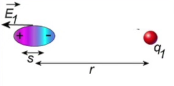

Atomun elektron bulutu pozitif yüke doğru biraz yaklaşıyor, yani alan elektronu
kutuplaştırıyor. Bu kutuplaştırma denklemini daha önce vermiştim, 

$$
\vec{p} = \alpha \vec{E}_1 =
\frac{1}{4\pi\epsilon_0} \frac{\alpha q_1}{r^2}\hat{r}
$$

$\alpha$'nin ne olduğunu bilmiyorum, bize verilen atom türüne bağlı bir sabit
bu. Ama kutuplaşmanın bağlı olduğu bir diğer faktör uygulanan elektrik alanın
kuvveti.

Bu kuvveti biliyoruz, zaten bu sayede üstteki formüldeki $\vec{E}_1$ için (1)
kullanarak onu açabildik. Tüm bunlarla $\vec{p}$'yi hesaplayabiliyoruz, ve daha
önce $\vec{p}$'yi iki kutuplu moment olarak görebildiğimizi söylemiştim. O
gördüğümüz kutuplaşma iki kutuplu moment'tir.

3. Adım: özendirilen iki kutuplaşma yaşayan atomun kendisi de şimdi bir elektrik
alan yaratıyor olacak. 

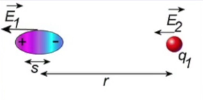

Daha önce böyle değildi, mesela bir hidrojen atom durumunda nötr olduğu,
kutuplaşmamış halde iken bir elektrik alan yaratmaz. Ama elektron bulutunu atom
çekirdeğine nazaran kaydırınca ortaya bir iki kutuplu elektrik alan çıkacak.

Bu alanı üstte gördüğümüz eksen bağlamında hesaplamak için $\vec{E}_2$
formülümüz var.

$$
\vec{E}_2 = \frac{1}{4\pi\epsilon_0} \frac{2\vec{p}}{r^3} =
 \frac{1}{4\pi\epsilon_0} \frac{2\alpha \vec{E}_1}{r^3} =
 \frac{1}{4\pi\epsilon_0} \frac{2\alpha}{r^3}
 \left(  \frac{1}{4\pi\epsilon_0}  \frac{q_1}{r^2} \hat{r} \right)
$$

Üstte içinde $\vec{p}$ olan formla başlıyoruz, daha önce bu şekilde
göstermemiştim, içinde $qs$ olan formu göstermiştim, tabii $qs$ iki kutuplu
moment, ki o $p$, ve o çift kutuplu moment aynı zamanda üstte gördüğümüz
kutuplaşma, $\alpha \vec{E}_1$. Bu bağlantıyı görüyor muyuz? Yani $p$ yerine
$\alpha \vec{E}_1$ koyacağım, ve $\vec{E}_1$ noktasal yükün elektrik alanıdır.

Etrafta bir sürü $r$ var, çift kutbun yaydığı alan $r^3$ oranında
zayıflıyor, noktasal yükün alanı $r^2$'e oranla zayıflar, bu her iki üstel öğe
üstteki formülde var. Her beraber bölende $r$ için üstel 5 olacak. 
 
$$
= \left( \frac{1}{4\pi\epsilon_0} \right)^2 \frac{2\alpha q_1}{r^5} \hat{r}
\sim 1/r^5
$$

Yani yakındaki bir noktasal yükün etkisiyle ortaya çıkan özendirilmiş
kutuplaşmanın yarattığı elektrik alan $r^5$'e oranla azalır. Kutuplaşmış moment
noktasal yük üzerinde $\vec{E}_2$ alanıyla etki yaratıyor, ve bu alanın
yarattığı kuvvet altta hesaplanabilir. $\vec{E}_2$ zaten hesaplanmıştı,

$$
\vec{F}_1 = q_1 \vec{E}_2 =
= \left( \frac{1}{4\pi\epsilon_0} \right)^2
\frac{2\alpha q_1^2}{r^5} \hat{r}
$$

Bu kuvvet $q_1$ üzerinde etki eden kuvvet, ama ona eşit ve ters yönde bir kuvvet
atomun üzerinde de uygulanıyor demektir, çünkü aynı kuvveti birbirlerine
uyguluyorlar, yani $\vec{F}_2 = -\vec{F}_1$ olacak. 

Böylece bir noktasal yük ile atom arasındaki kuvvetin aşağı yukarı $1/r^5$
olduğunu bulmuş olduk, çünkü bu hesabın içinde çift kutupluluktan ortaya çıkan
ve $r^3$'e oranla azalan bir kuvvet, ve noktasal yükün $r^2$'ye oranla azalan
kuvvet etkisi var. Hep beraber $1/r^5$ elde ediyoruz. 

Eğer bir grafikleme yazılımı kullanmayı biliyorsanız bunu kontrol
edebilirsiniz. $r^2$ azalması yukarıdan aşağı sağa / sola açılan etekler gibi,
$r^3$ daha aşağı inip açılan etekler, $r^5$'e oranla azalmanın bu ikisinin
toplamının bu sebeple müthiş hızlı aşağı inip açılan etekler olduğunu
göreceksiniz.

```python
plt.xlim(-1,1)
x = r = np.linspace(-4,4,100)
y1 = 1/np.abs(r)**2
plt.plot(x,y1,label='$r^2$')
y2 = 1/np.abs(r)**3
plt.plot(x,y2,label='$r^3$')
plt.legend()
plt.savefig('03_17.png')
```

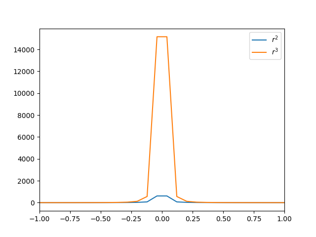

(Üstte grafikte $1/r^5$ göstermedik, çok hızlı düştüğü için diğer grafikler
yanında yokoluyor).

İşte bu sebeple artı yüklenmiş iki bantı yaklaştırınca normal bir mesafede etki
görebiliyordum, çünkü bu etki $r^2$'e oranla azalıyor. Fakat elimi banta
yaklaştırdığımdaki hangi kuvvet etkidedir? $1/r^2$ kanunu mu, $1/r^3$ kanunu mu,
$1/r^5$ kanunu mu geçerli burada? Cevap $1/r^5$ değil mi, çünkü elim kutuplaşmış
olacak. İşte bu sebeple elimi banta çok, çok yaklaştırmam gerekiyor ki bir etki
görebileyim. 


