# Elektrik ve Manyetik Etkileşimler - Ders 4

Önceki derste yükün muhafaza edildiğinden bahsettik, evrenin toplam yükünün
değişmesi imkansız, Bu demektir ki evrendeki tüm pozitif yüklerden tüm negatif
yükleri çıkartırsam, o sayı her neyse değişemez, ne olduğunu bilmiyoruz ama
farketmez. Yük yaratıp yoketmek mümkün, eğer bunu çiftler üzerinden yaparsak.

Bugün yalıtkanlar ve iletkenler hakkında konuşacağız. Yalıtkanlarda elektronlar
atomlarına yakın dururlar, iletkenlerde yükler sanki bir sıvının aktığı gibi
akarlar, hatta formel olarak onların bir sıvı olduğunu da iddia edebiliriz,
bunun anlamını daha detaylı olarak göreceğiz. Ayrıca her iletkende, denge
durumunda ki "denge'' sözüyle ne demek istediğimi de açıklayacağım, toplam
elektrik alan sıfır olmalıdır. Ayrıca iyonsal çözeltiler ve metallere yakından
bakacağız. Zamanımız kalırsa nesneleri yüklemek ve boşaltmak (charging and
discharging) konusuna da bakacağız. 

Çift kutupluluğun (dipole) üzerinden geçelim. İki yük var elimizde, üstte artı
altta eksi, bu çift etrafında bir elektrik alan etkisi yaratıyor, öyle ki alan
artı yüklü parçacıktan dışarı doğru, ve eksi olana doğru / onun yönünde etki
ediyor. 

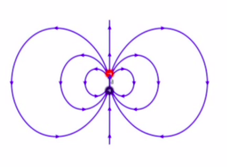
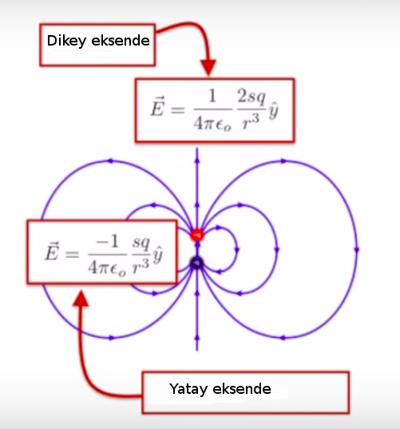

Eksen üzerinde (on-axis), y-ekseninde, yukarı doğru etkili olan alan üst sağ
resimde üstteki kutu. Çift kutupluluk momenti $sq$, kutbun bir ucundaki yük $q$,
$s$ ise negatif ve pozitif iki yükün arasındaki mesafe.

Üst sağ resimle devam edelim, yatay eksen üzerinde farklı bir formül görüyoruz,
çünkü orada elektrik alanı yukarıdan aşağı giderken işaret değiştirmek zorunda
değil mi? Yatay bağlamda alan biraz daha zayıf.

Şimdi bir soru: diyelim ki alttaki resimdeki sol kısımda olan bir çift kutup
var. Ve yine diyelim ki X ile görülen yere ikinci bir çift kutup koyuyoruz,
ve bu kutup ortaya buraya dönebiliyoruz, acaba bu ikinci çift kutup görülen
seçeneklerden hangisi olurdu? 

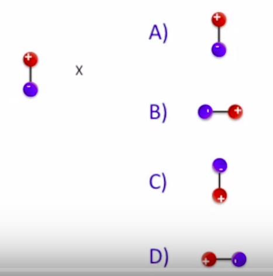

Acaba X noktasındaki elektrik alan hangi yönde olurdu? Aşağı doğru. O zaman
üstteki dört seçenekteki çift kutupların hangisi bu tür bir alan yönünde en
mutlu olurdu? C seçeneği değil mi? Çünkü pozitif yükler alan üzerinde akmaya
meyilli, negatif ters yönde, bu kuvvet eşittir yük çarpı elektrik alan, yani
$F=qE$, formülüyle alakalı tabii. Pozitif yük alanı takip eder, negatif tersine
gider. O zaman C orada en mutlu olur. 

Peki şimdi? Sadece çift kutbu çevirdim, alt üst, üst alt oldu, 

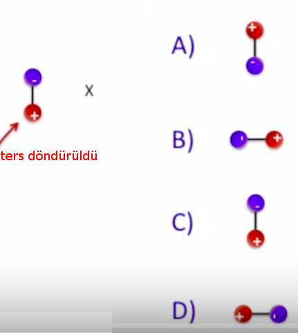

O zaman A tabii ki.

Peki eğer X'e bir çift kutup koyduktan sonra (ve yine serbest bırakıp) soldaki
kutbu bir aşağı, bir yukarı olacak şekilde habire değiştirip dursam? X
üzerindeki kutup nasıl davranırdı? Aynen solundaki kutup gibi o da bir aşağı bir
yukarı inip çıkardı değil mi?  

Bu olay aslında yüzeylerde görülen çok ilginç bazı fiziksel ve kimyasal
olayların kaynağıdır. Van der Waals kuvvetleri mesela, kimyadaki VdW etkileşimi
duyanınız var mı? Büyük bir ihtimalle öğrenirken VdW kuvvetini tarif eden çok
çetrefil gözüken bir enerji ifadesi okutulmuştur, fakat bu fenomenin fiziksel
çıkış noktası biraz önce tarif ettiğimiz gibi dalgalanmakta olan çift kutuplu
momentlerdir.

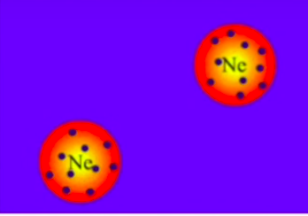

Üstteki resimde görülen atomlar meseala nötr, ama etrafındaki elektron bulutu
düşünelim şimdi, bu bulut şekil olarak simetriktir, eğer çok hızlı fotoğraf
çekebilen bir fotoğraf makinemiz olsaydı ve atomun resmini çeksek herhangi bir
anda bu elektronların belli bir yerde olduğunu görebilirdik, sürekli
hareketlilik simetrik küreyi veriyor, ama herhangi bir anda elektronlar
çekirdeğin ya bir tarafında ya diğer tarafında olacaktır, o zaman herhangi bir
anda ufak bir çift kutupluluk durumu ortaya çıkar, ve bu ufak çift kutupluluk
sürekli dalgalanma halinde olacaktır. Ve biraz önce gördüğümüz iki çift kutbun
birbiriyle senkronize olmasında olduğu gibi, birbirine yakın iki atomun çift
kutupluluğu da bu şekilde senkronizasyona yol açacaktır, dönen bir atom
diğerinde dönüş hareketine sebep olur. Bu beraber dönüş atomların birbirine
biraz daha çekilmesine sebep olur ve buna VdW kuvveti diyoruz.

Geko [1] isimli hayvan türünü biliyorsanız, onların önemli bir özelliği bu VdW
kuvvetine bağlı. Geko gördüyseniz, ya da evinize girdiyse görmüşsünüzdür, bu
mahlukatlar düz tavanda bile yürürler. Bunu nasıl yapıyorlar? Ayaklarında bant
mı var? Bant yok ama gekoların yapışkan uzuvları var. Bu yapışkanlığı bazı bilim
adamları inceledi, acaba bazı dersler alıp suni yapıştırıcı üretmek için
kullanamaz mıyız ilgisiyle baktılar, ve gördüler ki geko ayaklarında kılcıklar
var, bu kıllar / kılcıklar gittikçe ayrılıp inceliyor, bölünüyor, bölünüyor, ve
bu kılcıklar gekonun ayağını bastığı yerdeki her türlü ufacık çıkıntılara
dolaşıyor, onlara yakınlaşıyor. İşte bu yakınlaşma sayesinde yüzey ve geko
atomları yeterince yaklaşıyor ki o anlattığımız dalgalanan çift kutupluluk
olmaya başlıyor, ve zayıf ta olsa bir çekim meydana geliyor, VdW kuvveti yani.

Şimdi düşünüyorum da bunu nasıl buldular acaba? Deneyle mi yoksa hesapla mı?
İnşallah hesaptır. Bu arada duydum ki dört tane geko bacağı bir insanı bile
tutabilir. Çok kuvvetli yani.

Bir soru daha: bir tane değil iki tane çift kutup olsun şimdi, altta görüldüğü
gibi. Bu durumda X'e koyulan bir çift kutup hangi yönü göstermeye meyilli olur? 

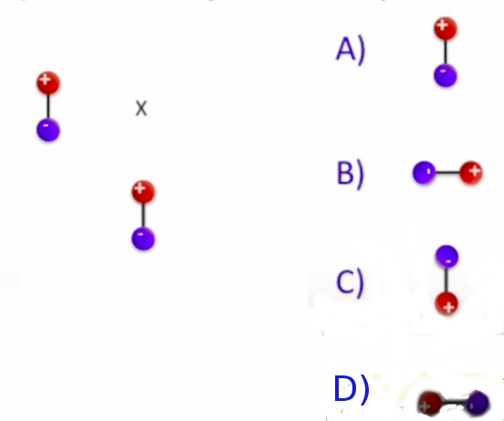

Ayrıca dikey ve yatay yöndeki alan formüllerini de dikkate alalım.. Bu soru
biraz daha alengirli, dolambaçlı değil mi? Sizden gelen elektronik cevapları
bilgisayarda görüyorum şimdi, tüm seçeneklere eşit dağılmış gibi
duruyor. Sınıfın cevabı her telden çalıyor! Bu sorunun zorluğu, bir çift kutup
bir yönü isterken diğerinin ters yönü istemesi.. Ne olacak?

Bazılarınızın yana doğru, yatay işaret eden seçenekleri seçtiğini gördüm. Bunun
niye olamayacağını anlamak iyi olur. Alttaki çift kutbu X ile aynı dikey eksende
olacak şekilde yerleştirdim, onun alanı tam yukarı doğru etki yapacak. Daha
üstte olan çift kutbu X ile aynı yatay eksene koydum, onun alanı ise yukarıdan
dolanıp tam aşağı etki yapacak. Burada hiçbir $x,z$ bileşeni yok. Bu sebeple
çift kutuplardan gelen iki vektörü topladığım zaman muhakkak $y$ ekseninde bir
sonuç bulmalıyım. Değil mi? Ve biri yukarı, diğeri aşağı giden iki vektör
toplamı bana yine dikey yönde sonuç verir, hiçbir zaman yana doğru sonuç
vermez. Bu demektir ki B,D secenekleri elenebilir. O zaman, biri aşağı diğeri
yukarı bastıran etkilerin hangisi daha kuvvetli? Aynı dikey eksende olan
diğerine göre 2 kat daha fazla. O zaman onun etkisi baskın çıkar, ve toplam etki
A seçeneğindeki sonucu ortaya çıkartacaktır.

Bu dersi çok sevdiğimi söylemiştim ama bugünün dersini daha bir seviyorum, çünkü
farklı materyellerden bahsettik ve benim araştırma alanım sıkıştırılmış madde
fiziği (condensed matter physics). Bu alanın ana konusu dokunabileceğimiz
şeylerdir, elle tutulabilecek maddelerdir. Elde tutulabilen, bir bardağa
koyulabilen, vs. bir şey varsa ortada, onun incelenmesi sıkıştırılmış madde
fiziğine düşer. 

Bu konu ayrıca faz geçişleriyle de ilgilenir, mesela suyun buz olması, gazın
soğuyup sıvı haline gelmesi gibi. Şimdi bazılarınız düşünüyor ki "bunlar zaten
araştırılmış konular değil mi?''. Size bir soru sorayım: maddenin hangi
fazlarını biliyorsunuz? [Bazı tipik cevaplar geliyor, birisi 'Bose-Einstein
kondensatı (condensate)' diyor hoca bunu beğeniyor, bir başkası
süperakışkanlar diyor]. Evet maddeleri süper ısıtıp süper soğutabilirsiniz,
süperakışkanlar var sonra, mesela helyum atomlarını alıp yeterince soğutursam
hiç ağdalığı olmayan bir süperakışkana dönüşürler. Mesela, aman bunu evde
tekrarlamayın, parmağınızı alıp bir süperakışkanı karıştırmaya uğraşsanız, sıfır
ağdalık hissedersiniz, yani parmak hiçbir engelle karşılaşmazdı.. Mesela bal çok
ağdalıdır, su daha az ağdalıdır, süperakışkan madde ise sıfır ağdalıdır. Ilginç
değil mi?

Başka? Kimin sıvı kristal görüntü birimi (liquid crystal display) olan bir
aleti var? [Öğrenciler biraz şüpheli bazıları uyanıyor, cep telefonlarının
ekranı bu maddeden, yani herkesde var]. Eveet.. hepimizin cebinde var
bundan. Sıvı kristal.. be biçim bir şey bu..? Hem sıvı hem kristal..? İşte
bu öğe de aslında maddenin apayrı bir fazı. Bu maddede bir yönde akış var,
kristal olan diğer yönde akış yok. Bu arada bir sürü sıvı kristal fazı
vardır, bunların çoğunun egzotik isimleri vardır, nomatikler, smektikler,
heksatikler, vs. Yani size lisede anlatıldığından çok daha fazla faz çeşidi
vardır, ve tüm bu faz çeşitleri benim alanımın ilgi alanına giriyor.

Özelde söylemek gerekirse benim araştırdığım konu elektronların katı
maddeler içinde nasıl davrandığı, ki bu konuyu bugün derste
işleyeceğiz. Maddelerin içindeki elektronların kendi fazları, ve faz
geçişleri vardır. Bu aslında hepimizin bildiği bir şey; bir metali düşünün,
mesela bir bakır kablo, ona elektrik uyguluyoruz, kablodaki elektronlara ne
olur? Hareket ederler değil mi ve böylece bir akım oluşur. Ve bu şekilde
akan herhangi bir şey "sıvı'' olarak nitelendirilebilir, formel, matematik
olarak bu maddenin tarifi onun sıvı olduğunu gösterir. Yani bir metalin
içinde bir elekton "sıvısı'' ortaya çıkar.

Kıyasla bir yalıtkan maddede, mesela o köpükle yapılan kahve bardaklarını
düşünelim, bu bardağa voltaj uygularsam elektronları hareket etmez, akmazlar,
yani bir yalıtkan içindeki elektronlar katı maddesel bir faz
içindedir. Elekronların bir faz değişimi geçirmesi ve katı maddesel yalıtkan
davranışından sıvı maddesel iletken davranışı göstermeye başlaması mümkündür, bu
tür bir faz geçişi var.

Diğer türlü faz geçişleri de vardır. Mıknatısı olan var mı? Ben mıknatısları çok
severim, çocuklarım var onların sayesinde bir sürü mıknatıslı oyuncak var
etrafta, bunlar sadece çocuklar için tabii [hoca şaka yapıyor kendisi de sevdiği
  için]. Hernseyse bir mıktanıtısı alıp yeterince sıcak bir ocakta ışıtırsanız,
çok, çok yüksek ısıda bir süre sonra mıknatıs eriyip bir ufak sıvı havuzuna
dönüşür. Ama bu olmadan çok önce bir geçiş ısısında birdenbire küt diye
manyetikliğini kaybederdi. Eğer mıknatısı soğutsanız manyetikliğini pat diye
tekrar kazanırdı. Herhangi bir geçiş ışışında bu şekilde birdenbire oluveren her
şey bir faz geçişinin örneğidir. 

Süperiletkenler bir diğer örnek. Konu katı maddeler içindeki elektronların
davranışı olunca görülebilecek farklı davranışların sınırı yok. Katı maddeler
içindeki elektronlar sonsuz tane faz şekline yol açabiliyor. Bu benim alanım
işte. Hatta ben kendim de bir bir madde fazi keşfettim, vorteks smektik, belki
biriniz kullanır birgün. Ama biz bu derste daha basit örneklere odaklanacağız,
yalıtkanlar ve iletkenler. Yalıtkanlarda, daha önce dediğimiz gibi, yükler
hareket etmez, yerinde durur, bağlı oldukları atomda kalırlar. Bir iletkende
yükler akabilirler, aynen bir sıvıda olduğu gibi, ve biz onları bu şekilde tarif
ederiz.

İletken ve yalıtkanlardaki elektronları biri atomuna bağlı diğeri serbest iki
köpek gibi düşünebiliriz.

Peki o zaman bir yalıtkanı alıp ona bir elektrik alanı uygularsam ne olur?
Yükler biraz kayarlar ve materyel kutuplaşır değil mi? Her elektron azıcık
yana kayar, çok çok az, 1 Angstrum'dan daha az. Elle tutulabilecek bir
materyel içinde aşağı yukarı $10^{23}$ atom vardır, büyük bir sayı, ve tüm
bu atomların her birinde elektron azıcık kayarsa bu büyük bir toplam etki
yaratır. Bu etki alttaki gibi resmedilebilir, bir noktasal yük
yaklaştırdığımızı düşünelim, bu bir alan yaratır, ve kutupsallaşma oluşur.

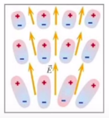

Elektronlar yüke biraz yaklaşır, ama atomundan, molekülünden kaçamaz tabii
(tasmalı köpek durumu, biraz hareket alanı var, çok uzağa gidiş yok). 

Bu kayma özellikle maddenin yüzeyinde ölçülebilir etkiye sebep
olur. Elektrik alan uygulanan bir yalıtkanın alt yüzeyinde toplam negatif,
use yüzeyinde toplam pozitif yüzey yükü ölçerdin. Bu yüzey yükünün ne kadar
büyük olduğunu niceliksel olarak tanımlamanın bir yolu var. Eğer üstte
toplam pozitif, altta toplam negatif yük var ise, bu iki bloğun temel
alarak toplam bir kutuplaşmayı hesaplayabilirim. Kutuplaşabilme (sabiti)
$\alpha$, uygulanan elektrik alan $\vec{E}$ üzerinden kutuplaşma
$\vec{p} = \alpha \vec{E}$'yi veriyor. Bu formülü tek atom için
kullanmıştık daha önce.

Yan uygulanan alan için toplam çift kutuplu moment $\vec{p}$ vardır, bu
$\alpha$'yi baz alır, kuantum kimyacıları $\alpha$'yi hesaplayabilir, ama
nihai etkinin üzerinden de bu hesabı yapabiliriz.

Fakat işler biraz daha karışabilir. Alan uygulanınca materyelin içindeki
her şey kutuplaşmış hale geldi, her tarafta çift kutuplu momentler var. Bu
momentlerin her biri de ayrı ayrı bir elektrik alan yaratacaktır. Yani bir
dışarıdan gelen alan, bir de onun etkisiyle içeride oluşan ek alan. Şimdi
toplam alanın, etkisinin ölçmesi daha zorlaştı. 

Fakat biliyoruz ki tipik mateyeller ve yalıtkanlar için dışarıdan uygulanan
alan $\vec{E}_{applied}$ çift kutupların oluşturduğu alan
$\vec{E}_{dipole}$ çok, çok daha büyüktür,
$\vec{E}_{applied} >> \vec{E}_{dipole}$.  O zaman yaklaşık olarak
sistemdeki toplam alanın dışarıdan uygulanan alan olduğunu
söyleyebiliriz. Derslerimizde bu yaklaşıklamayı kullanacağız.

İletkenlerde değişik bir durum var tabii, orada yükler daha serbest hareket
edebiliyorlar, bu tasmalı değil serbest koşan mutlu köpek oluyor,

İletkenlere örnek mesela bakır, hatta iyonize edilmiş sıvılar; tuzlu su bu
tür bir sıvıdır, sodyum ve klorür (sodium chloride) atomları ayrılır ve her
ikisinde bir toplam yük oluşur, ve bu yük serbestçe dolaşabilir, pozitif
iyonlar, negatif iyonlar vardır, değişik yönlere gidebilirler.

Kuvvet yük çarpı o noktadaki toplam elektrik alansa, pozitif yükler alanın
yönünde o kuvvetle itilirler, negatif yükler ters yönde kuvvet hissederler.
Kuvvet yük çarpı alan, yükün işareti eksiyse gidiş ters yönde
olur. Herhangi bir iletken içinde yükler bir sıvının aktığı gibi akar. Bir
iletkenin içinde, herşey durulmuş, yerli yerine oturmuş ise elektrik alan
sıfırdır. Yalıtkanların içinde alan uygulandıkça zayıf bir toplam elektrik
alan vardır, ama dışarıdaki daha kuvvetlidir, olduğu sürece onu
sayarız. İletkende sıfır. Bunu ispatlaması biraz zor ama göreceğiz.

İspatlamak istediğimiz bir iletkenin içindeki yüklerin alan kalmayıncaya
kadar hareket edeceği. Denge noktasında (equilibrium) hiçbir şey hareket
etmiyor. Bir diğer konum kalıcı durum (steady state), bu akım sabit demek.

İspat için çelişki ile ispat (proof by contradiction) yöntemini
kullanacağız. Bu yöntem şöyle işler; ilk önce ispat etmek istediğimiz şeyin
tersinin doğru olduğunu farz ederiz, sonra bu faraziyeyle devam edince bu
ters olanın kendisiye çeliştiğini gösteririz. Böylece tersini aldığımız
söylem doğrulanmış olur.

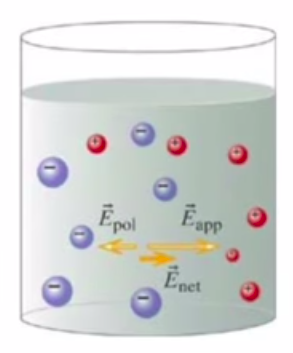

ki $\vec{E}_{net} = \vec{E}_{pol} + \vec{E}_{app}$, $\vec{E}_{app}$
uygulanan alan, $\vec{E}_{pol}$ kutuplaşmadan ortaya çıkan alan,
$\vec{E}_{net}$ toplam. Örnekte iletkenin kalıcı, duruk (static) bir denge
noktasının olduğunu farz ediyoruz, bu faraziyenin bir diğer kısmı bu toplam
(net) elektrik alanı sıfır *olmaması*. Tersini aldığımız söylem alanın
sıfır olması.

Şimdi, eğer bu doğru olsaydı, $E_{net} \ne 0$ olunca yükler hareket
edecektir. Yükler sıvıdır, hareket edebilirler. Ama o zaman bu denge durumu
olamaz, çünkü denge durumu yüklerin hareketinin durduğu konumdur. Faraziye
kendisiyle çelişti, o zaman bir iletkenin içinde denge durumunda toplam
elektrik alanı sıfır olmalı. Ana fikir yüklerin etrafta onları itecek
elektrik alanı kalmayıncaya kadar hareket edecek olmaları.

Şimdi alttaki gibi bir iletken düşünelim, biraz yamuk yumuk bir
görüntüde. Diyelim ki madde dengede, o zaman toplam elektrik alan sıfır
$E_{tot} = 0$, hiç yük hareketi yok. Ama ben dışarıdan bu maddeye ek yük
verebilirim değil mi? Bir şekilde onu yüklerim, ek yük olur. Diyelim ki bu
iletken maddeye ekstra elektronlar yükledim. Bu olunca ekstra yük her zaman
maddenin yüzeye akmak zorundadır.

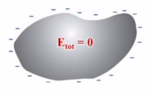

Eğer iç bölgede olsalardı birbirlerinin elektrik alanlarını hissederlerdi,
birbirlerini iterlerdi, yani birbirlerini maddenin dış (en uzak)
noktalarına doğru gitmeye zorlarlardı. İşte bu sebeple ek yükler maddenin
dışında bulunurlar.

Farklı bir cisme bakalım. Alttaki mesela. Beyaz yerler boşluğu temsil
ediyor, boşluk, vakum olabilir, gri yerler iletken bölge. 

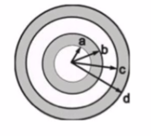

Soru: bir iletkenin iç yüzeyinde yük olması mümkün mü? Evet, içi boş bir
iletken kabuk bu şekilde bir yüke sahip olabilir. Elde etmek için bir
pozitif noktasal yükü alırız, ve onu küresel bir iletken kabuk ile
sarmalarız. Ortada pozitif yük olduğu için kürenin elektronlar orta noktaya
çekilecekler, ve bir miktar negatif yük bu şekilde içeri doğru yönelmiş
olur. Bu durumda arkada pozitif yükler kalır, ve toplam artı bu yükler
kürenin dış kısmında olurlar. Fakat her iki durumda da toplam negatif ya da
pozitif yükler yüzeye gitmiş olurlar.

Şimdi metaller konusuna gelelim. Elektrik alanlar metalleri nasıl etkiler?
Günlük hayatta alışık olduğumüz metaller, bakır mesela, onların atomsal
yapısına yeterince yakından bakabilsek düzenli bir yapı görürdük. Bakır
atomları kristalsel bir yapıda durmayı severler. 

Bu dışarıdan metalleri görüşümüzle uyuşmayabilir, çünkü metaller rahat
eğilebilen, şekil verilebilen şeyler, biz lokal atomik dizimden
bahsediyoruz, çok ufak boyutta. Elektronlar ise bu yapının etrafında bir
deniz gibidir, akarlar. 

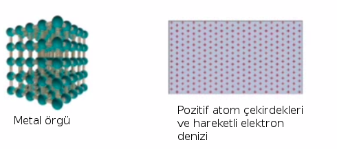

Bakırın çok sayıda elektronu vardır, ve elektronlarının çoğunluğu, atom bazında,
atomun çekirdeğine yakında dururlar. Ama bakırın dışında, çekirdeğinin uzağında
da elektronları vardır, ve bu elektronlar kopup üstte görülen elektron denizine
katılabilir, ve materyelin her tarafında gezinebilir. Bu kimyasal bağlanmaya
benziyor. Eğer birbirine yaklaşan iki atomu alırsam bu iki atomun en dıştaki iki
elektronu iki yaklaşmış atomun yörüngesinde sanki tek bir atommuş gibi dolaşmaya
başlayabilirler. Eğer üçüncü bir atom yaklaştırırsam, 4. 5., vs. bu böyle devam
edebilir. İşte bahsettiğim elektron denizi bu şekilde ortaya çıkar. En dıştaki
elektron tüm materyel boyunca gezinebiliyor. İşte bu elektron bir sıvı gibi
davranır, sıvı gibi akabilirler.

Altta metalin bir modelini görüyoruz,

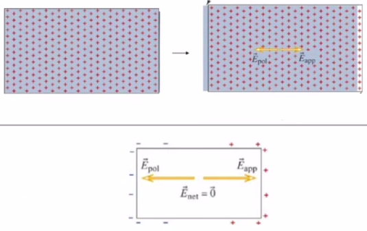

Atomları normal bir kafes / örgü şeklinde organize olmuş, ayrıca daha önce
bahsettiğimiz elektron denizi de var tabii. Bu metale sağ yönde bir elektrik
alanı $\vec{E}_{app}$ uygularsak o zaman üst resimdeki üst sol resimden üst sağ
resimdeki durum olur, elektron denizi alana doğru gider, o zaman materyelin
solunda toplam negatif bir yük oluşur, sağında ise toplam pozitif bir yük
oluşur. Tabii bir iletkende, her şey yerli yerine oturduktan sonra, toplam yük
sıfır olmalıdır. Metal her diğer şeyden izole, alan uyguluyorum, toplam yük
sıfır. Metalin solu ve sağındaki yükler koca bir çift kutup (dipole) oluşturur,
ki bu kutup ta bir elektrik alan yaratır, bunu da üstteki diyagramın altındaki
resimde görüyoruz. Kutuplaşma alanı $\vec{E}_{pol}$ uygulanan alanın tam ters
yönünde, ki bu alan uygulanan alanı iptal edecektir.  Bu mantıklı değil mi?
$\vec{E}_{pol}$ alanı pozitif yüklerden dışarı negatiflere doğru olmalıdır, ve
bu yön uygulanan yöndeki alanı iptal eder. Yani bir iletken uygulanan alana göre
kutuplaşabilir.

Şimdi bir sürü denkleme dalmadan önce bir materyeldeki elektronlara kalıcı
durum halinde ne olur onu anlatmak istiyorum. Şimdiye kadar denge durumunu
gördük, alanı bir metal parçasına uyguluyorum, yeterince bekliyorum, herşey
yerine oturuyor, bir denge oluşuyor. Kalıcı durum bundan farklı mesela
denge olmayan ama sürekli bir akımın geçtiği (kalıcı) materyel durumu
böyle. Bu tür bir durumu hayal edelim ve bir elektronun atomların çekirdeği
ile nasıl etkileşim içinde olduğunu düşünelim.

Örnek olarak bir atom örgüsü seçmemiz lazım, bu odadaki koltukları örnek
kullanalım. Odadaki her koltuk bir atom çekirdeği olsun. Şimdi siz bir elektron
olduğunüzü düşünün, ve odanın bir tarafından diğer tarafına geçmek
istiyorsunuz. Önünüzde bir sürü engel olacak, masalar var [ve hoca masa
aralarından değil üstüne basarak gidilme şartını koydu]. Şimdi iyi bir
koşucu  olsa aramızda ona söylesek şuradan şuraya git, o masalara bakıp
onların üstüne belli bir ritmde / şekilde / aralıkla basarak öteki tarafa
gidebilirdi değil mi? Ya da bir başka yöne... Eğer masalar yerli yerinde
duruyorsa koşucunun gözlerini bile bağlayabilirdim, o ritmi takip ederek
gidişini yapardı. 

Bir materyelin içindeki elektronlar da böyledir. Gidecekleri yöndeki
atomsal duruma bakarlar, bu atomların periyotsallığını [statik bağlamda,
aradaki yapının boşluk kalıbını] görürler, elektronlar kuantum mekaniktir
yani bir dalga fonksiyonları vardır, hareketlerinin bir ritmi vardır yani
(dalga ritimseldir nihayetinde), elektronlar bir ritm seçerler ve bu
onların örgü içinden "akabilmesini'' sağlar. Bu elektronların sıvıya
benzer hale gelmek için kullandığı kuantum mekanik numaralardan biridir.

Peki biraz önce bahsettiğimiz koşucu masalar üzerinde sekerken, biz gidip
üzerine basılacak bir masanın yerini değiştirsek ne olur? Koşucu düşer
tabii. Benzer bir durum elektronların da başına gelir. Elektron belli bir kalıba
göre yola çıkmış ama onun beklediği örgünün bir noktasında bir atom eksik
olabilir, bu normal, her materyelde kusurlar olabilir, bu kusurla karşılaşınca
belli bir ritme göre giden elektron oraya çarpar ve hızını kaybeder. Materyele
uygulanan elektrik alanının o elektronu tekrar hareketlendirmesi gerekecektir,
bu olunca elektron belki başka bir yere çarpacaktır, ekstra bir atom var bu
sefer belki, aynı şey olacaktır, vs.

Drude Modeli denen teorinin temeli üstte tarif edilen elektronun bir materyel
içindeki hareket ediş şeklidir.

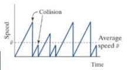

Elektrik alanı elektrona uygulanıyor, bu elektronda lineer bir hızlanma
başlatıyor (grafiğin ilk kısminda görüyoruz), dersimize giriş olan önceki
dönemdeki kavram, momentum prensibi. Hızlanma oluyor ta ki bir kusurlu noktaya
çarpıncaya kadar, o noktada elektron hız kaybediyor, grafikte bu düşüşü de
görüyoruz. Sonra tekrar başlangıç görüyoruz, biraz önce anlattığımız gibi, bu
da bir sonraki lineer tırmanış, vs. Böyle devam ediyor, ve grafikte görülen
zigzaklı şekil burada geliyor.

Ayrıca elektronun çarpığı sadece kusurlar değil; materyel örgüyü oluşturan
atomik çekirdekleri düşünelim, eğer materyel üzerindeki ısıyı arttırırsak bu
atomlara ne olur? Titremeye başlarlar değil mi? Titreyince yerleri biraz sağa
sola kayacaktır, bizim gözleri bağlı koşucu elektronumuz bu yer değişikliklerine
de çarpabilir.

Fiziksel kavramlar bunlar. Şimdi formüllere bakalım. Bir metale net
elektrik alan uyguluyoruz, her elektronun üstteki grafikte görülen testere
şeklinde görüntüsü olacak. Buna veriye / grafiğe bakarak averaj hızı nasıl
hesaplarım? İlk üçgene alalım, hız çarpışa kadar zamana göre lineer bir
şekilde artıyor, oradaki averaj hızı hesaplayacağım. Çarpma anından az önce
elektronun bir bir net hızı vardı, bu hız nedir? Onu momentum prensibinden
elde edebiliriz, $\Delta p / \Delta t$ net kuvvete eşittir, burada $p$
momentum demek, biz fizikçilere harfler yetmiyor o yüzden eski harfleri
kullanıp duruyoruz (!). Neyse $\Delta p / \Delta t$ net kuvvet ise
$qE$'dir, bir elektron için bu $-E$, yani negatif yük, -1, çarpı elektronun
hissettiği net elektrik alan. Momentumdaki değişimi elde etmek için
çarpmadan az önce $p$ idi, sıfırdan başladı, o zaman

$$ \Delta p = p - 0 = e E_{net} \Delta t$$

Burada $\Delta t$ çarpma anına kadar geçen zaman, yani figürdeki ilk
üçgenin tabanı bir anlamda (çünkü x-ekseninde zaman var). Şimdi üstteki
formülü $v$'yi bulmak için kullanabilirim. Hız momentum bölü kütle, tabii
her şey gayrı-izafi kaldığı sürece, elektronlar bir materyel içinde hızlı
hareket ederler ama hala hareketleri gayrı-izafi kabul edilir. Üstteki
formülü de kullanırsak, ve dikkat hala tek bir üçgeni hesaplıyorum hala, 

$$ v = \frac{p}{m_e} = \frac{eE_{net} \Delta t}{m_e}$$ 

Şimdi tüm üçgenler üzerinden bir ortalama hesaplamak istiyorum, üst çizgi
ortalama demek, 

$$ \overline{v} = \frac{e \overline{\Delta t}}{m_e} E_{net} \equiv \mu E_{net} $$ %

Ortalamanın sadece iki çarpma arasındaki zamana uygulandığını gördük. Niye?
Çünkü formüldeki diğer şeyler, yük, alan, elektronun kütlesi bu zaman
boyunca değişmiyorlar. Her üçgeni farklı yapan onun tabanı, yani
oluşmasındaki geçen zaman. 

O zaman çarpmalar arasında geçen ortalama zaman $\overline{\Delta t}$'i
biliyorsam, onu üstteki formüle koyabilirim, ve size ortalama hızı
söyleyebilirim. 

O zaman formülde $E_{net}$'den önce gelen her şeyi alıp, yani $e$,
$\overline{\Delta t} / m_e$, onları bir sembol, mesela $\mu$, altında
gruplayabilirim. Çünkü bilmek istediklerimizden biri, eğer bir materyele
bir elekrik alan uygularsam her elektronun ortalama hızının ne olacağı, ve
yer değiştirme katsayısı olarak tanımlanabilecek bu $\mu$ ile bir
materyelin elektronlarının ne kadar hareketli olduğunu gösterebiliriz.
Mesela herhangi bir elektrik alanı için yüksek yer değiştirme katsayısı
yüksek hız demek olacaktır. 

Kaynaklar

[1] Wikipedia, *Gecko*, [https://en.wikipedia.org/wiki/Gecko](https://en.wikipedia.org/wiki/Gecko) 

