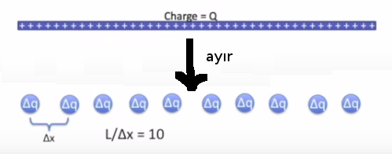
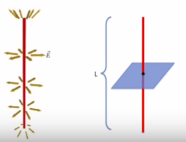
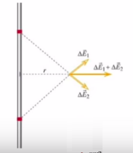
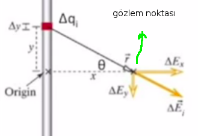

# Elektrik ve Manyetik Etkileşimler - Ders 5

Geçen derste iki farklı materyele baktık ve elektrik bir alan uygulanınca
nasıl davrandıklarını irdeledik. Dünyada bir sürü materyel var, biz
bunlardan günlük hayattan bilinen iki gruba odaklandık, yalıtkanlar ve
iletkenler. 

Bir yalıtkanda elektronlar fazla serbestliğe sahip değildir, oldukları
yerden fazla farklı yere gidemezler, ait oldukları atoma bağlıdırlar. İple
bağlı küçük köpek örneği vermiştim. Bir iletkendeki yükleri kıyasla mutlu,
koşturan bir köpekle göstermiştim, bir çit içinde koşturuyordu gerçi ama
daha serbestti. İletken ortamını iyonların kendisinin etrafta gezindiği bir
iyonsal çözelti olarak görebiliriz, ya da bir metal olarak görebiliriz,
çünkü bir metal içinde elektronlar sıvısal bir konumdadır ve akmakta
serbesttirler.

Bugün yük yoğunluğu (charge density) konusuna bakacağız ve yük dağılımının
[belli bir matematiksel dağılım bağlamında] elektrik alanını hesaplamayı
öğreneceğiz, özelde bakacağımız örnek bir çubuk (rod) olacak [dağılım
çubukta ve onun alanı hesaplanacak]. Bunu yaparken şimdiye kadar derste
takip ettiğimiz felsefeyi kullanacağız, sadece tek bir başlangıç noktasına
ihtiyacımız var gerisini inşa edebiliriz, buradaki başlangıç noktası ise
tek bir nokta yükten gelen elektrik alanı. Noktasal yükten gelen alan
bildimiz gibi $1/r^2$'e oranla azalır, ve biz bu bilgiyi daha çetrefil
durumların elektrik alanını hesaplamak için kullanabiliriz.

Yüklü çubuğu alırız mesela, ve bu çubukta eşit şekilde dağılmış noktasal
yüklerin olduğunu düşünelim, bu yüklerin elektrik alanını toplarsak bir
sonuç elde edebiliriz.  

Burada üstdüşüm özelliğini kullanacağız. Toplam (net) elektrik alan ayrı
ayrı nesnelerden gelen alanların doğrusal toplamı. Uzaydaki herhangi bir
noktaya herhangi bir yerden gelen birden fazla elektrik alan etki ediyor
olabilir, yan odada bir yük olabilir, hemen yanımda yükler olabilir, ne
bileyim, ta ayda yükler olabilir, tüm bu yükler bir noktadaki elektrik
alanının kuvvetini arttıracaktır. Benim tek hatırlamam gereken prensip bu
noktadaki toplam alanın etki eden tüm alanların vektör toplamı olduğu,
yani $\vec{E}_{net} = \vec{E}_1 + \vec{E}_2 + \vec{E}_3 + ...$. 

Tekrar üzerinden geçmek gerekirse, yüklenmiş herhangi bir şekildeki obje
noktasal yüklerin toplamı olarak görülebilir,


Noktasal yükün elektrik alanını biliyoruz, ve toplamı (entegrali) bu tüm
obje şekli üzerinden yapıyoruz, tüm alanı elde ediyoruz. Basit başlayalım,
bir çubuk üzerinde. Çubuğun bir yalıtkan olduğunu düşünelim, bu sebeple bir
yükü nereye koyduysam orada kalıyor, ben de yükleri alttaki şekilde koydum, 

Çubuğun belli bir yük miktarı ve belli bir uzunluğu olacak. Uzunluğu
bilinen, sonlu kabul ediyoruz başta, ama ileride bu uzunluğun limite
gittiği, yani sonsuz olabileceği durumu da göz önüne alacağız. Çubuktaki
toplam yük $Q$, uzunluk $L$ olsun. Çubuğu tek boyutlu düşünüyoruz, ve
bir sürü yük yanyana bu çubukta diziliyor. Bu pek çok yük üzerinden bir
toplam (entegral) yapabilirim ama bu entegrali doğru kurmam lazım. Önce
basit bir yaklaşımla başlayalım, bu çubuğu 10 eşit parçaya bölelim. Her
parçada eşit miktarda yük olacak tabii ki, ona $\Delta q$ diyelim. 



Bu demektir ki $\Delta q = Q/10 = (Q/L) \Delta x$. Denklemleri bu şekilde
kurdum çünkü genel olmalarını istiyorum, matematiği farklı şartlarda da
kullanabilmek istiyorum. $\Delta q$'müz $Q/10$, genelde bu $Q/L \cdot
\Delta x$ olacak. Böylece $\Delta x$'i istediğim kadar küçültebilirim,
çubuğu 20, 100, milyon parçaya bölebilirim. 

Calculus zamanı geldi. Bir toplamdan entegrale nasıl giderim? Toplamı
çubuğun uzunluğu üzerinden yapmam lazım, tüm ufak $\Delta x$'leri toplarım
ve $\Delta x$'i limite götürürüm. Eğer fizikçi değil matematikçi olsaydım
bu limiti belirgin şekilde gösterirdim, ki bu $dx$ üzerinden entegrale
dönüşürdü. Fizikçi olarak birimleri kontrol ederdim tabii, $\Delta x$'lerin
toplamı bir uzunluk birimi vermeli, entegral de bu şekilde olacak, güzel.

Ama unutmayalım bizim toplam çubuk üzerinden ama toplamın kendisi yüklerin
toplamı. O zaman yükler toplamından o yüklerin uzunluklar üzerinden olan
haline bir şekilde geçiş yapmak lazım. $\sum \Delta q$ ile başlıyoruz,
$\Delta q = (Q/L) \Delta x$ eşitliğinden hareketle toplamı onun üzerinden
yapabiliyoruz,

$$ \sum \Delta q = \frac{Q}{L} \sum \Delta x \to \frac{Q}{L} \int \mathrm{d} x $$

Eşitliğin en sol tarafından birim yük, sağ tarafında da yük. $Q/L$ toplam
dışına çıktı çünkü sabit kabul edilebilir.

Çubuğun her noktasındaki elektrik alan neye benzer? Çubuğa tek boyutlu
demiştik, onu düz ip üzerinde dizili bilye yükler gibi görebiliriz, tekil
yükler bir çizgi üzerinde. O zaman herhangi bir çubuk kesitinde sadece tek
bir yük var, alt soldaki resim, 



Peki çubuğu kesen bir düzlem düşünsek onun üzerindeki elektrik alanı ne
olur? Düzlemi bu şekilde seçtim çünkü entegral böylece daha kolay
olacak. Ama ana prensibi bir kere öğrenince bu entegrali başka bir şekil
üzerinden alabiliriz. 

Basitleştirme şu şekilde; eğer üstteki problemde görülen simetrik durumu
kullanırsam entegral basıtleşiyor. Bazıları şu şekilde yaklaşabilir,
matematiği baştan bariz olan haliyle, belirgin şekilde kurarım, beni nereye
götüreceğine bakarım. Ama fizikçi gibi düşünülünce "uğraşmam gerekeek
matematiği nasıl yarışına indiririm'' yaklaşımı daha uygun olur. 

Simetri şu şekilde yardım eder. Eğer yüklere ortadan başlayıp ikişer ikişer
bakarsam ki biri çubuğun üst yarısında diğeri orta düzleme eşit uzaklıktaki
alt yarışında olmak üzere, toplamları sürekli bu "simetrik ikizler''
üzerinden yapabilirim. Biriyle isim bitince yukarı / aşağı birer adım
atarak aynı işlemi tekrarlarım.



İkizlerden gelen alan vektörleri farklı yönleri gösteren aynı büyüklükte
iki vektör olacaktır, fakat simetri sayesinde bir başka şey elde ettik, o
da bu iki vektörün y bileşenlerinin birbirini iptal edecek olması. O zaman
toplam işlemi sadece x-bileşeni üzerinden yapılacak. 

Geometrisiyle beraber tekrar gösterelim,



Çubukta orijin düzlemin olduğu yer, gözlem noktası görülüyor. Bu gözlem
noktası ile yük $\Delta q$ arasındaki mesafeye ihtiyacım var, bu mesafe
$r$. Fakat bu $r$ yani $\vec{r}$'nin büyüklüğü görülen üçgenin
hipotenüsü. Bu hesap için bilinen Pitagor hesabı. Ayrıca kosinüs te lazım, 

$$ r = (x^2 + y^2)^{1/2}, \quad \cos(\theta)  = \left( \frac{x}{r}\right)$$ 

Şimdi işin fizik kısmına gelelim, problemin fiziğini matematiğe tercüme
edeceğiz. Gözlem noktasındaki tüm elektrik alan $\vec{E}_{tot}$'a ihtiyacım
var, önce

$$ 
\Delta E_{i,x} = |\Delta E_i| \cos (\theta)  
\qquad (1) 
$$

Önce $\Delta E_i$'in büyüklüğünü aldım, ama bu büyüklüğün kendisini değil x
bileşenini kullanacağız, $\cos$ çarpımı bundan. Toplam,

$$ \vec{E}_{tot} = \sum_i \Delta \vec{E}_i = \sum_i \Delta E_{i,x}\hat{x} $$

Devam edelim, $\Delta E_i$ nereden geliyor? Genel nokta yük formülüne
alırsak ve $q$ yerine $\Delta q$ olacak, çünkü çubuğun sadece bir
kısmındaki yüke bakıyoruz, (1) şöyle olur,

$$ 
\Delta E_{i,x} = 
\left( 
  \frac{1}{4\pi\epsilon_0} \frac{\Delta q}{r^2} 
\right) 
\left(\frac{x}{r} \right)
$$

Tekrar düzenleme yapalım şimdi. Bölen kısmında $r$'nin üstelliği 3 gibi
gözüküyor, Üstteki $r$ formunun küpünü alalım,

$$ 
= \left(   \frac{\Delta q}{4\pi\epsilon_0}  \right) \left(\frac{x}{r^3} \right)
= \left(   \frac{\Delta q}{4\pi\epsilon_0}  \right) 
  \left(\frac{x}{(x^2+y^2)^{3/2}} \right)
$$

Üstteki bulduğumuzu $\vec{E}_{tot}$'a sokarsak,

$$ 
\vec{E}_{tot} = \sum_i 
\left(   \frac{\Delta q}{4\pi\epsilon_0}  \right) 
  \left(\frac{x}{(x^2+y^2)^{3/2}} \right) \hat{x}
$$

Calculus yapma zamanı geldi, toplamı entegrale çevireceğiz.

$$ 
= \frac{1}{4\pi\epsilon_0} \frac{Q x}{L} \int_{-L/2}^{L/2}
\left(\frac{\mathrm{d} y}{(x^2+y^2)^{3/2}} \right) \hat{x} 
\qquad (2) 
$$

Peki $x$ nasıl $\mathrm{d} y$'a dönüştü? Çünkü önceki örnekte çubuk x
eksenindeydi, yatay duruyordu, burada çubuk dikey duruyor, y ekseninde,
ondan. Matematiksel bir gizem yok yani! 

Bazı numaralar yaptık ama.. Mesela $x$'i entegralden dışarı çıkarttık? Bu
doğru mu? Doğru çünkü entegral $y$ üzerinden. Bu entegrali alırken $x$'i
sabit tutmuş oluyorum. $x$ gözlem noktasıyla alakalı değil mi? O nokta
değişmiyor [daha doğrusu istenen, üzerinden entegral alınacak $x$ hesabı
için, belli bir $x$'teki entegral hesabı isteniyor, o sebeple değişmiyor]. 

Ayrıca entegral limitleri $-L/2$ ve $L/2$. Niye? Çünkü orijin çubuğun
ortasında, $L$ uzunluğundaki çubuğun en alt noktası doğal olarak $-L/2$
noktasında üst noktası $L/2$ noktasında. Entegrali çözüp basitleştirince
[hoca Internet'te Wolfram Alpha ile yaptım diyor]

$$ 
= \frac{1}{4\pi\epsilon_0} \frac{Q}{x \sqrt{x^2 + (L/2)^2}}\hat{x} 
\qquad (3)
$$

ki bu $\hat{x}$ yönünde.. 

Not: aynı sembolik işlemi biz de `sympy` ile yapalım.

```python
from sympy import integrate, sqrt, Symbol, pprint
from sympy import simplify
y = Symbol('y')
x = Symbol('x')
print ('entegral', (integrate('1/ ((x**2+y**2)**(3/2))',y)))
L = Symbol('L')
x = Symbol('x')
rs = simplify(
             ((L/2)/(x**3*sqrt(1 + (L/2)**2/(x**2)))) - \
             ((-L/2)/(x**3*sqrt(1 + (-L/2)**2/(x**2)))))
print (u'sınır değerlerini verip basitleştirince')
print (rs)
print (u'güzel görünümlü\n')
pprint(rs)
```

```
entegral y/(x**3*sqrt(1 + y**2/x**2))
sınır değerlerini verip basitleştirince
2*L/(x**3*sqrt(L**2/x**2 + 4))
güzel görünümlü

       2*L       
-----------------
         ________
        /  2     
 3     /  L      
x *   /   -- + 4 
     /     2     
   \/     x      
```

Tabii entegralin dışında bir $L$'ye bölüm bir de $x$ ve $Q$ çarpımları
vardı, onları da üstteki sonuca uygularsak,

$$ 
= \frac{2 Q}{x^2 \sqrt{(L/x)^2 + 4}  }
$$

elde ederiz. Bu sonuç hocanın gösterdiğinden biraz farklı fakat cebirsel
olarak aynı. 

Derse dönelim. Gördüğümüz gibi nihai sonuç sadece $x$'e bağlı çünkü $y$
üzerinden entegre ettim, $y$ gitti, belgin entegral ile sınır şartları
$y$'lere verildi ve $y$'ler üzerinden hesap yapılmış oldu. İşte bu hesap
üstteki düzlem için.. düzlemin yakın tarafında uzak tarafında her tarafında
işe yarıyor.

Şimdi çubuğu sonsuz uzunlukta düşünelim.. yani $L \to \infty$ durumu.. $L$
sonsuza gittikçe tüm yüke ne olur? O da sonsuz büyür değil mi? Çubuk
üzerinde belli miktarda yük var, onu sonsuza uzatmak bu yükleri sonsuz kere
kopyalamak demek olur, o zaman toplam yük sonsuz hale gelir. Hem
$L \to \infty$ hem de $Q \to \infty$ kullanmak lazım demek ki..  Aranızdaki
matematikçiler panikle dışarı koşmaya başlayacak belki :) Formül
içinde $Q/L$ de var, onu sabit tutmak istiyorum, $\frac{Q}{L} \to \lambda$
diyebilirim. $\lambda$ bir sabit olarak düşünülüyor, "birim uzunluktaki
yük miktarı'', ya da "çubuğun yük yoğunluğu''  olarak görülebilir. Bu
mantıksız değil, eğer çubuğu belli (birim) parçalara bolşem her parçada şu
kadar yük vardır diyebilirim, bu $\lambda$ o değer işte. 

(2) üzerinde yeni sınır değerlerini kullanalım. $L$'yi sonsuz yapıyoruz,
ama $Q/L$ kısmını olduğu gibi bırakıyoruz çünkü bu bölümü sabit kabul
ediyoruz demiştik. Bu arada (2)'nın sonucu olan (3)'te de sonsuzluğa
bakabilirdik ama bir adım geriye atıp (2)'de bu yerine koymayı yapmak daha
temiz olacak.

$$ 
= \frac{1}{4\pi\epsilon_0} \frac{Q x}{L} 
\int_{-\infty}^{\infty} \left(\frac{\mathrm{d} y}{(x^2+y^2)^{3/2}} \right) \hat{x} 
$$

Bu entegrali yine sembolik matematik programı ile çözünce, $2/x^2$ cevabı
geldi, üstte yerine koyunca,

$$ 
= \frac{1}{4\pi\epsilon_0} \frac{2(\lambda)}{x} \hat{x}
$$

Bir sonraki soru: hesaba çubuğu kesen düzlemden başladım. Sonra çubuğun
uzunluğunu sonsuza çıkarttım. Düzleme ne oldu, o nerede? Cevap artık
herhangi bir yerde.. :) Çubuk sonsuz uzunluğa gelince onun ortası vs. gibi
kavramların anlamı kalmadı, artık çubuğu düzlemle istediğimiz yerden
kesebiliriz, o kestiği yerde sonsuzu yarıdan kesmiş gibi görebilirdik, ve
sonsuzun yarısı hala sonsuzdur. O zaman üstteki denklem uzaydaki herhangi
bir nokta için geçerlidir.

[bir soru cevap kısmı atlandı]

Pek çok şekildeki yük dağılımlarını hesaplamada kullanabileceğimiz genel
yöntem bu. Ana felsefe şöyle özetlenebilir; yük dağılımı ne kadar çetrefil
olursa olsun onları üzerinden toplam alabileceğimiz parça yükler olarak
görebiliriz. Yük dağılımını alırız, ufak parçalara böleriz, ve o ufak her
parça bizim bildiğimiz bir şey olmalı / olacak. Çubuk örneğinde düz çizgide
yanyana duran nokta yükleriydi bu parçalar. Ama o ufak parçalar küre de
olabilirdi, ve [artık] tüm bir çubuktan gelen alanın neye benzediğini de
biliyoruz, o zaman parça çubuk ta olabilir, bir problemde mesela yanyana
duran bir sürü çubuğun toplam alanını bulmak gerekebilir (bir kutunun alanı
belki). İşte ufak parçalara böleriz, üzerinden toplam alınacak ufak
bölgedeki teker teker çubukların alan formülüyle hesabı yaparız.

Tekrar üzerinden geçmek gerekirse;


   * Yük dağılımını elektrik alan formülü bilinen parçalara böl
   * Her parça için alan formülünü yaz
     
        * Orijin noktasını seç
        * $\Delta E$ ve bileşenleri için formülü yaz
     
   * Ufak parçaların etkisini topla. Uygunsa simetri kullan, böylece
     formülde iptaller olabilir. Toplamları entegrasyona çevir. 
     
        * Sembolik / cebirsel entegre etmeye uğraş
        * Olmuyorsa, mümkün değilse sayısal olarak entegre et
     


Tüm bunlardan sonra sonucu kontrol ederiz tabii, sonucun fiziksel bir
anlamı var mı? Yön mantıklı mı? Birimler doğru çıktı mı (bunu her zaman
kontrol etmek lazım tabii)? Özel limit durumlarını da kontrol etmek iyi
olur, çubuk örneğinde yaptığımız gibi..mesela ona çok yaklaşınca ne oluyor
vs [atlanan bölüm].     


