# Elektrik ve Manyetik Etkileşimler - Ders 6

Bugün önceki derste öğrendiğimiz kavramları farklı şekiller üzerinde
uygulayacağız. Bu şekiller içi boş çember / halka, içi dolu halka ya da
disk, sonsuza giden bir düzlem (alttaki resim, soldaki şekil, düzleme
kenarından bakılırsa), ve sonsuza giden iki düzlem.

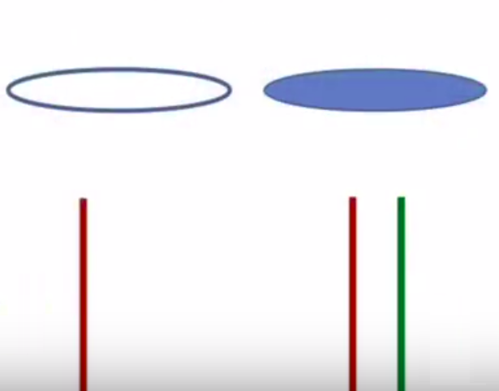

Daha önce bir noktasal yükün $1/r^2$'e oranlı olarak azaldığını
görmüştük. Sonsuz uzunluktaki bir çizgi yükünün $1/r$'ye oranlı azaldığını da
gördük (burada $r$ çizgiye olan uzaklık). Peki acaba sonsuz bir düzlemin azalma
oranı ne olurdu? Belki sabittir (aslında öyle). Ama bunu hesaplayarak göreceğiz.

İlk önce bir halkanın elektrik alanını hesaplayacağız, sonra disk, diski
yaptıktan sonra onun alanının sonsuza gittiği duruma bakacağız ve bu sonsuz
düzlem olacak.

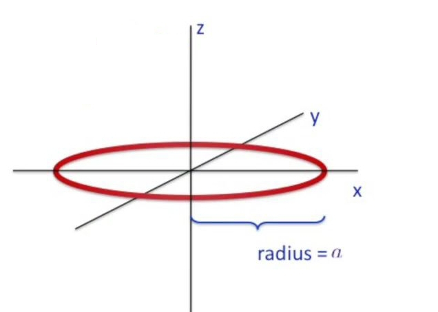

Halkayı hesaplamak için onu $x-y$ düzlemine yatıracağım, ve tam ortasından $z$
çıkıyor olacak, halkanın yarıçapı $a$. Sonra simetrisi yüksek bir nokta
bulacağım, ki $z$ ekseni üzerindeki tüm noktalar böyledir, ve tüm bu $z$
noktaları için elekrik alanı hesaplayacağım.

İlk adım halkayı bir sürü ufak nokta yüküne bölmek. Sonra bu noktalardan birini
seçiyorum, mesela en soldaki noktadaki yüke göre $z$'deki bir yerde oluşan
elektrik alanını hesaplamak istiyorum.

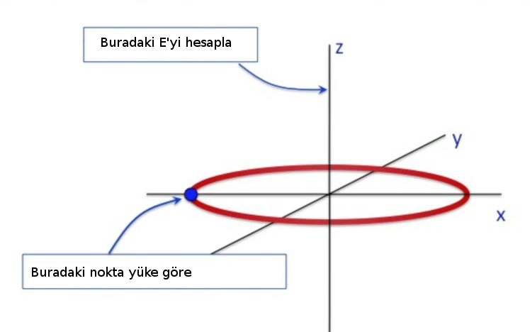

Yaklaşım böyleydi hatırlarsak, problemi çözmeyi bildiğimiz ufak parçalara
bölüyoruz, ki burada bildiğimiz şey nokta yük, ve sonra oradan toplama
bakıyoruz.

Şimdi çok dikkatli bir şekilde bir diyagram çizmemiz lazım, sonra bu diyagramı
yine dikkatli bir şekilde matematiğe çevireceğiz. 

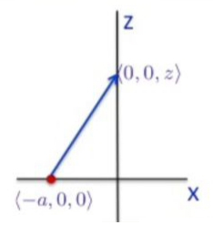

Nokta yük alan hesabı için $|r|$ ve $\hat{r}$ lazım. Dikkatle çizdiğimiz
diyagram burada faydalı işte, $r = <a,0,z>$. Gözlem noktaları $z$ üzerinde ve
bu noktalarda duruyorsam $r$ bana doğru işaret ediyor. Soru: kordinatta $-a$ var
ama vektörde $a$ bu nasıl oldu? Çünkü vektör $z$'ye doğru işaret ediyor.

Buradan $r$'nin büyüklüğünü hesaplamak kolay,

$$ |r| = (a^2 + z^2)^{1/2}$$

$\hat{r}$'yi hesaplamak için $r$'yi alıyorum ve yine $r$'nin büyüklüğüne
bölüyorum,

$$
\hat{r} = \vec{r} / |r|  = \frac{ < a,0,z > }{(a^2 + z^2)^{1/2}}
$$

$<0,0,z>$ noktasının hissettiği elektrik alanı nokta yük hesabı ile bulurduk, bu
alan hesabı nasıldı? Yuk $<-a,0,0>$'da, ve $<0,0,z>$'deki $E$,

$$
E = \frac{1}{4\pi\epsilon_0 } \frac{q}{|r|^2}\hat{r}
$$

Formulde $\hat{r}$'yi yerine koyarsak,

$$
E = \frac{1}{4\pi\epsilon_0 } \frac{q}{a^2 + z^2}
    \frac{< a,0,z >}{(a^2 + z^2)^{1/2}}
$$


$$ 
= \frac{1}{4\pi\epsilon_0 }  \frac{q}{(a^2 + z^2)^{3/2}}  < a,0,z > 
\qquad (5)
$$ 

Üzerinde nokta yükleri olan halkaya dönersek, bu halkanın ortasından $z$
kordinatı geçiyor, ve halkadaki yüklerin $z$ üzerindeki bir noktaya olan
etkisini hesaplamak istiyoruz. Halkadaki her yükten bu noktaya doğru bir etki
var, tüm bu etkileri düşünürsek ortaya bir köni çıkıyor sanki. Önemli bir nokta,
koniyi oluşturan etki oklarının yatay bağlamda her birinin bir karşıtı var
(simetrinin bu problemin bir parçası olduğunu unutmayalım) ve bu yatay etkiler
birbirini yokediyor. Geri kalanlar sadece $z$ yönünde olan etkiler. 
    
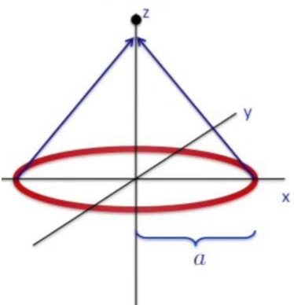

Bu tür simetri argümanı kullanmak bu arada matematiğimizi oldukca
kolaylaştırır. Aslında tüm modeli kör bir şekilde yazıp iptallerin olduğunu
orada görebilirdik, ama öncede simetri üzerinden bu iptali yapmak bizi bir sürü
cebirsel ifadeden kurtarmış oldu. 

O zaman toplam elektrik alan halka etrafından alınmış bir toplamdır, daha
doğrusu halka etrafında dönerken görülen ufak elektrik alan etkilerinin
toplamıdır.

$$
\vec{E}_{tot} = \sum_{\textrm{halkanın etrafında}} \Delta E_z \hat{z} 
\qquad (2)
$$

Bize lazım olan $E$'nin $z$ yönündeki bileşenleri. 

$$
\Delta E_z =
\frac{1}{4\pi\epsilon_0 }
\frac{z \Delta Q}{(a^2 + z^2)^{3/2}}
\qquad (3)
$$

Görüldüğü gibi $Q$ yerine $\Delta Q$ kullandık çünkü halkanın tek bir parçasına
bakıyoruz.

Entegrali nasıl oluştururuz? Bize lazım olan

$$
\sum \Delta Q \to \int \mathrm{d} \theta
$$

Bu toplam için hakikaten Kartezyen kordinatları kullanmak istemiyorum. Problemi
tanımlamakta tam bir özgürlüğe sahibiz, sistemi tanımlarken ne sistem içinde ne
sistem dışında bunları hep tanımlamak bizim elimizde. Problemin kordinat
sistemini tanımlamak ta bizim elimizde. Bu örnekte mesela üstteki entegrali
hesaplamanın en rahat yolu $x,y,z$ kordinatı kullanmak değil, elimizde bir
çember var, o çember etrafında dönmek için tek bir değişken, açı $\theta$'yi
kullanmak daha kolay, böylece o tek değişkeni değiştirerek çember etrafında
dönebilirim. Bu amaçla kutupsal kordinat kullanıyoruz.

Entegrali nasıl hazırlarız? Sonsuz çizgidede yük hesabı için entegral alırken ne
yaptığımızı hatırlayalım: çizgiyi $\Delta x$ büyüklüğünde ufak parçalara böldük,
he parçanın yükü $\Delta Q$ idi. Sonra $\Delta q$ toplamlarından $Q/L$ çarpı
ufak mesafeler $\Delta x$ toplamlarına nasıl geçileceğini gösterdik. 


Yeni problem için buna benzer bir şeye ihtiyacımız var. Ufak $q$'ler
toplamından, bir şekilde, birim mesafe üzerindeki yüklerin mesafeler üzerinden
alınan toplamına (entegraline) geçmeliyiz. Yani toplam alırken değiştirilen şey
mesafe olmalı, yük değil.

$$
\Delta Q = \frac{q}{L}\Delta L = \frac{q}{2\pi L}\Delta L \qquad (1)
$$

Üstteki $\Delta L$'yi $\theta$'lar bazında istiyoruz.  Üstteki örnek için ufak
mesafeler halka etrafında olacak, ve halkanın etrafında tamamen dönmemiz
gerekecek.

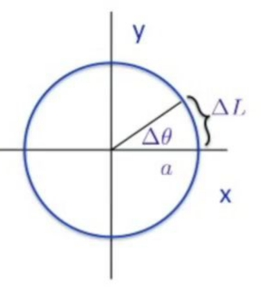

$\theta$'lar üzerinden bir entegrale ihtiyacımız var demiştik, o zaman üstteki
şekildeki $L,\theta$ gibi kavramları yerine koymamız lazım. Tüm uzunluk $L$
nedir? Cevap çember formülünden geliyor, $L = 2\pi a$, ki $a$ yarıçap. Peki
ufak bir $\Delta \theta$ için uzunluk ne olacak? Önceki $L$ formülünü tüm $2\pi$
onun ufak bir parçası $\theta$ için adapte edebilir miyiz acaba?

$$
\Delta L = a \Delta \theta
$$

olabilir mi? Bu mümkün, eğer $\pi/2$ dönsek, bu bize $L/2$ vermez miydi? Evet!
Ama yine de ufak açı değişimleri üzerinden entegral kontrolü yapalım,

$$
\sum \Delta L \to a \int_{0}^{2\pi} \mathrm{d} \theta = 2\pi a = L
$$

İfade doğru demek ki. Üstteki hesapta sinüs, kosinüs kullanılmamış olmasına
dikkat. Şimdi biraz önceki $\Delta L$'yi (1)'e koyabiliriz,

$$
\Delta Q = \frac{q}{2\pi a} a \Delta \theta = \frac{q}{2 \pi} \theta
$$                              

ve

$$
\sum \Delta Q \to \frac{q}{2\pi} \int_{0}^{2\pi} \mathrm{d} \theta
$$

Böylece artık elimizde tüm gerekli bileşenler var. Baktığımız noktadaki toplam
yük $\vec{E}_{tot}$, $\Delta E_z$'ler üzerinden bir toplam, bkz (2) ve (3), ve
bu $\Delta E_z$'ler $\Delta Q$'lere bağlı, ve nihai toplam $\Delta Q$ üzerinden
toplama dönüştüğünde toplamın hangi değere yaklaştığını biraz önceki entegral
üzerinden bulabiliriz. Tabii sadece $z$ bileşeninin sağ kaldığını unutmayalım,
diğerleri birbirini iptal etti. 

(2) ve (3)'ü birleştirelim,

$$
E_{z}^{tot} = 
\frac{1}{4\pi\epsilon_0 }
\sum 
\frac{\Delta Q z}{(a^2 + z^2)^{3/2}}
$$

Bu toplamın $\Delta Q$'lara sonsuz ufaklıkta nasıl etki edeceğini, yani
entegrali, biliyoruz,

$$
= \frac{1}{4\pi\epsilon_0 }
\frac{q}{2\pi}
\int_{0}^{2\pi} \frac{z \mathrm{d} \theta}{(a^2 + z^2)^{3/2}  }
$$

Bu entegrali hesaplarken ne sabittir ne değildir onu düşünmemiz lazım. Çember
etrafında dönerek entegrali alıyoruz, bu dönme sırasında çemberin yarıçapı
değişir mi? Tabii ki hayır. Benim gözlem noktam $z$ ekseninde bir yerde,
dönüyoruz, ama aynı yarıçap üzerinden dönüyoruz. Peki gözlem noktası $z$? O da
aynı. Bu değişkenlerin hiçbiri, ne $a$ ne $z$ $\theta$'ya bağlı değil.

O zaman bu iki değişkeni dışarı çıkartırsam,

$$
= \frac{1}{4\pi\epsilon_0 }
\frac{q}{2\pi}
\frac{z}{(a^2 + z^2)^{3/2}}
\int_{0}^{2\pi} \mathrm{d} \theta 
$$

Geri bir tek $\mathrm{d} \theta$'in $0,2\pi$ arasındaki entegrali kaldı, bu entegralin
ne olduğunu kafadan biliyoruz artık, $2\pi$. Bu $2\pi$ dışarıdakini iptal eder,
geri kalanlar,

$$
E_{z}^{tot} = 
\frac{1}{4\pi\epsilon_0 }
\frac{qz}{(a^2 + z^2)^{3/2}}
$$

İşte bu sonuç halkanın eksen etrafında yarattığı elektrik alanın formülüdür, ve
$\hat{z}$ yönünde işaret eder. 

Not: $z$ sabittir dedik bu entegral bağlamında tabii. $z$ bir fonksiyona
veriliyor, yani her farklı $z$ için (ki bu $z$ fonksiyona verildiği anda bir
tane, o $z$ için sabit) farklı sonuçlar ortaya çıkacaktır. O $z$ için ve
entegral bağlamında tabii ki $z$ sabittir.

Disk

Halkadan sonra sıra diskte.

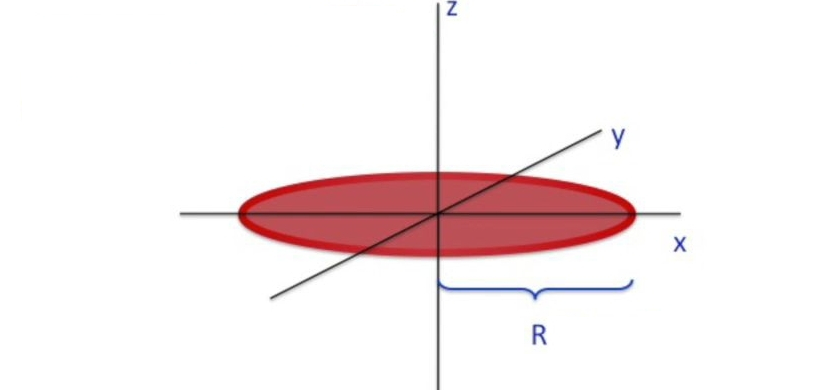

Yarıçap $R$, bir sürü küçük yarıçaplar var onun içinde (bu duruu temsil etmek
için büyük harf sembol kullandım), ve halka örneğindekine benzer bir $z$
noktasındaki elektrik alanı bulmak istiyorum. 

Bu diskteki yükün birörnek (uniform), yani her noktasında eşit olacak şekilde
dağılmış olduğunu düşünelim. Şimdi bir soru: birörneklikten bahsedince dışkın
maddesinin yalıtkan mı iletken mi olduğunu anlarsınız?

Cevap yalıtkan. Çünkü eğer madde iletken olsaydı yükler madde içinde serbest bir
şekilde dolaşabilirlerdi ve, pozitif yükleri düşünelim (ki ben her zaman pozitif
yükleri baz alarak başlamayı tercih ediyorum) birbilerini iterek dışkın en uç
noktalarına gitmiş olurlardı. O zaman birörnek dediğim zaman yalıtkanlığı
düşünmemiz lazım.

Yük hesabına dönelim, bu hesap için halka için yaptıklarımızdan başlayalım, yine
dışkın (halkada olduğu gibi) en dış noktasındaki bir noktaya göre $z$
eksenindeki gözlem noktasına olan etkiyi hesaplayacağız. $<0,0,z>$'daki $E$ (4)
formülünde vermiştik. Peki entegrale nasıl geçiş yapıyoruz?

Daha önce yükler tek halka etrafındaydı, onun için kutupsal kordinat
kullanmıştık, tek parametreyi döndürerek hesabı basitleştirdiği için. Şimdi dış
halkayı entegre edip sonra daha ufak yarıçaplı daha ufak onun içindeki halka,
sonra ondan ufak bir halka daha, vs. diye devam etmek gerekecek, ki böylece tüm
disk üzerinden entegral almış olalım. Tabii bu yapılması gerekenleri tarif etmek
için, matematiksel olarak illa bu şekilde çözmek şart değil. 

Bu hesabı yapmanın farklı yolları var, ben onu bir alan üzerinden
yapacağım. Altta kırmızı okla gösterilen alanı Calculus mantığı üzerinden temsil
edebilirsem tüm disk üzerinden entegral alabilirim.

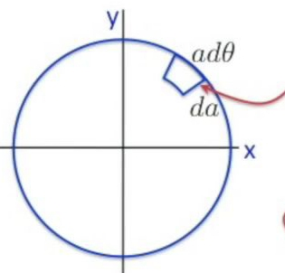

Calculus bir tarafa, bir çemberin alanı nedir? $\pi R^2$. Ona bir şekilde ufak
parçadan başlayarak ulaşabilmem lazım. 

Tüm diskteki toplam yük $Q$, tüm alan $A = \pi R^2$. Şimdi bu diskte bir alana
bakıyorum diyelim, o ufak alandaki yük bölü o alan olmalıdır, ve bu rakam büyük
yük $Q$ bölü büyük alan $A$'ya eşit olmalıdır. Yani birim alandaki yük nasıl
hesaplarsak hesaplayalım aynı değer çıkmalı.

Üstteki figürde gösterilen ufak alana gelelim, orada $\Delta q$ kadar bir yük
vardır diyelim. Ufak alan hesabı için $\mathrm{d} \theta$ kadar bir açınin çemberde $a
\mathrm{d} \theta$'lık bir uzunluğa tekabül ettiğini biliyoruz. Yarıçapın da ufak bir
parçasını alacağız bu sefer, onu da $\mathrm{d} a$ ile temsil ediyoruz. O zaman o ufak
alan yaklaşıksal olarak $\mathrm{d} \theta \cdot \mathrm{d} a$ olarak, sanki bir dikdörtgenmiş
gibi hesaplanabilir. Ve limite giderken Calculus devreye girecek ve hesabımız
işleyecek. 

O zaman tüm yüklerin toplamı o ufak alanlardaki ufak $\Delta q$'lerin toplamı
olacak, ve bu toplam birim yük (tüm yük bölü tüm alan çarpı entegrasyon
üzerinden hesapladığımız tüm alan olarak gösterilebilir.

$$
\sum \Delta q \to \frac{Q}{\pi R^2} \int \mathrm{d} a \int a \mathrm{d}\theta \qquad (4)
$$

İlerlemeden önce alan entegralinın işleyip işlemdiğini kontrol edelim [benzer
 bir entegral [1]. Yani

$$
Alan = \int \mathrm{d} a \int a \mathrm{d} \theta
$$

ifadesi bize alanı verir mi? Biraz tekrar düzenleme, $a$ ve $\theta$ birbirinden
bağımsız değişkenler olduğu için onları alttaki gibi gruplayabilirim,

$$
= \left[ \int \mathrm{d} a \right] \left[ \int a \mathrm{d} \theta \right]
$$

Entegral sınırları..? Baktığımız bir çember o zaman $\mathrm{d} \theta$'nin sınırları
nedir? 0 ve $2\pi$. $a$ için 0 ve $R$.

$$
=  \left[ \int_{0}^{2\pi} a \mathrm{d} \theta \right] \left[ \int_{0}^{R} \mathrm{d} a \right]
$$

$$
= (2\pi) \left( \frac{a^2}{2} \biggr\rvert_{0}^{R} \right)
$$

$$
= (2\pi) (\frac{1}{2}R^2)
$$

$$
Alan = \pi R^2
$$

Şimdi halka üzerinden alan hesabına dönersek, halka yerine bir sürü iç içe gibi
duran halkalar var, yani bir disk. 

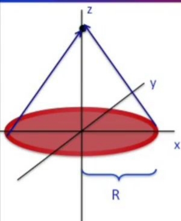

Düşünce şekli benzer, hala $z$ üzerinde bir nokta için yük hesabı, zıt yönde
$x,y$ kuvvetleri birbirini iptal ediyor, geri $z$ kalıyor. Tek fark halka yerine
halkalar var. O zaman (3) formülü üzerinden bir toplam alıp, onu $E_z^{tot}$ ile
temsil edip, bu toplamda biraz önceki entegrali kullanabiliriz.

$$
E_z^{tot} =
\frac{1}{4\pi\epsilon_0 }
\sum \Delta q
\frac{z}{(a^2 + z^2)^{3/2}}
$$

$\sum \Delta q$'nin ne oldugunu (4)'te gosterdik. 

$$
E_z^{tot} =
\frac{1}{4\pi\epsilon_0 }
\frac{Q}{\pi R^2} \int \mathrm{d} a \int a \mathrm{d}\theta 
\frac{z}{(a^2 + z^2)^{3/2}}
$$

Bu çetrefil entegrali çözmek için bir yazılım paketine vermeden önce içinde
sabit var mı onu kontrol etmem lazım, varsa onu dışarı çekebiliriz, bu ifadeyi
basitleştirerek işimizi kolaylaştıracaktır. $z$ formül bazında sabit
görülebilir, $\mathrm{d} \theta$ için $a$ ve $\theta$ bağımsızdır, o zaman bunların
hepsi $\mathrm{d} \theta$'dan dışarı alınabilir. Yine gruplama yaparsak

$$
= \frac{1}{4\pi\epsilon_0 }
\frac{Q}{\pi R^2}
z \left[
\int_{0}^{R} \mathrm{d} a
\frac{a}{(a^2 + z^2)^{3/2}}
\right]
\left[ \int_{0}^{2\pi} \mathrm{d} \theta \right]
$$

$\mathrm{d} a$ üzerinden olan entegrali sembolik olarak sympy entegre edelim,

```python
from sympy import integrate, Symbol
a = Symbol('a')
R = ('R')
z = Symbol('z')
e = integrate(a / ((a**2+z**2)**(3/2)),(a,0,R))
print (e)
```

```
-1.0*z**(-1.0)*(R**2/z**2 + 1)**(-0.5) + 1.0*z**(-1.0)
```

[Hoca Wolfram Alfa ile yapmış, onun sonucu altta, pek farklı değil galiba]

$$
E_z^{tot} = \frac{1}{2\epsilon_0} \frac{Q}{\pi R^2}
\left[  1 - \frac{z}{\sqrt{R^2 + z^2}}  \right] \hat{z}
$$

Artık sonsuz düzleme hazırız. Diski hallettim, artık onu sonsuza doğru büyüterek
sonsuz düzleme erisebilirim. $R \to \infty$ olacak, disk sonsuz buyuyecek. Bunu
yaparken tabii ki disk uzerindeki yuk $Q$ de buyuyecek, bu buyume tabii ki $Q/A$
sabit olacak sekilde olmali, bu orana $Q / \pi R^2 = \sigma$ diye bir deger
atayalim. Simdi limit kullanabiliriz, 

$$
E_z^{tot} = \frac{1}{2\epsilon_0} \underbrace{\frac{Q}{\pi R^2}}_{\sigma}
\left[  1 - \cancelto{0}{\frac{z}{\sqrt{R^2 + z^2}}} \quad \right] \hat{z}
$$

Üst sağdaki bölüm niye sıfıra gitti? Bölende $R$ var ve o sonsuza gidiyor,
bölünende $z$ var, ve $z$ herhangi bir değer olabilir demiştik, ama ne olursa
olsun verilir bir $z$ için o $z$ değişmiyor, fakat $R$ hala sonsuza
gidiyor. Geri kalanları yazarsak,

$$
E = \frac{\sigma}{2\epsilon_0}
$$

Matematik böyle. İşin fiziğini hatırlarsak şimdi eğer düzlem pozitif yüklü ise
alan dışarı doğru işaret ediyor olacak. 

Üstteki sonuç ne demek istiyor biraz daha düşünelim. Sonuç diyor ki sonsuz
düzlemden ne kadar uzak olursam olayım, aynı elektrik alanı hissediyor
olacağım. Düzleme burnum değecek kadar yaklaşmış olabilirim, ya da bir milyon
kilometre uzakta olabilirim, ama hep aynı alanı hissederim. Biraz garip değil
mi?

Noktasal yükte ne olduğunu hatırlayalım, onun alanı uzaklaştıkça $1/r^2$'ye
oranla azalıyordu. Noktasal yükün alan etkisi her yöne doğru giden, dışarı
yayılan oklar olarak hayal edilmişti, bu her yöne yayılma sebebiyle zaten ondan
uzaklaştıkça etkisi azalıyordu (çünkü yakındayken üst üste binen etki
"okları'' uzakta yayıla yayıla daha az etki gösterebiliyordu).

Fakat sonsuz bir düzlemden çıkan etki okları dümdüz, birörnek dağılımlı, eşit
olarak gidiyorlar. Hiç yayılma yok, bu sebeple etkisi azalmıyor. 

Sonsuz düzlemler böyle. Senaryo: biri pozitif diğeri negatif, birim alanda aynı
yüke sahip iki tane sonsuz düzlemi yanyana koysam ne olur? Belli noktalardaki
elektrik alan ne olacaktır?

Cevap için alttaki  resme bakabiliriz. 

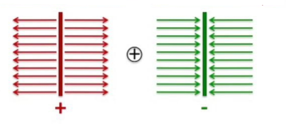
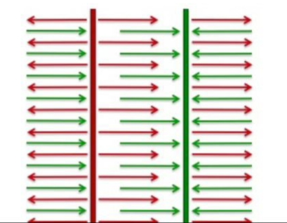

Orta bölümde alan toplanacak etkisi artacak. Her iki düzlemin dış taraflarında
etki birbirini yokedecek ve orada alan sıfır olacak.

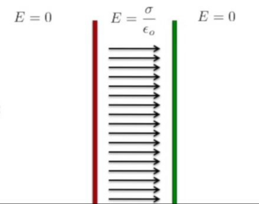

Soru: ya üstteki senaryoda yeşil düzleme daha yakın olsaydım, onun etkisini daha
fazla hissetmez miydim?

Cevap: biraz önce tek düzlem bazında düzleme ne kadar yakın olduğumuzun
farketmediğini söylemiştik. İki düzlem için de durum aynı, teker teker her
birinin etkisi ona ne kadar uzakta olursak olalım aynı.

Yani, mesela, bu iki sonsuz düzlem bizim yan odada olsaydı onların orada
olduğunu farketmezdik bile. Ta ki yan odaya gidip düzlemlerin birinde bir delik
açıp iki düzlem arasında bir ölçüm alıncaya kadar.

Bu kavramlar gerçek dünyada nasıl kullanım bulur? Elektrik devrelerinde
kullanılan kapasıtörlerde. Gerçi orada sonsuz değil, sonlu, alanı belli iki
düzlem var, ama diyelim ki bu çapı belli düzlemleri birbirine çok yaklaştırırsak
bu düzlemler arasındaki ve dışındaki alan briaz önce gördüğümüz sonuca
parallellik gösteriyor. Aradaki alan kuvvetli dışarıda sıfıra yakın, düzlemler
birbirine ne kadar yaklaştırılırsa dışarıdaki alan o kadar zayıflıyor. 

Kaynaklar

[1] Bayramlı, Çok Boyutlu Calculus Ders 17


