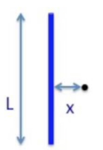
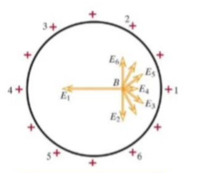
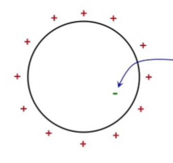
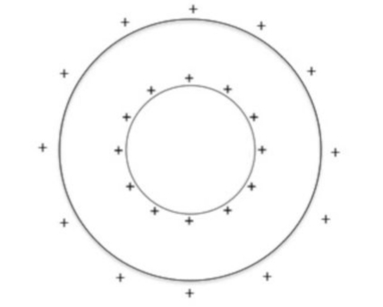
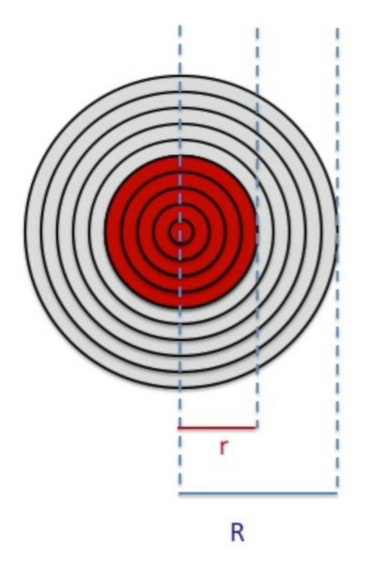

# Elektrik ve Manyetik Etkileşimler - Ders 7

Şimdiye kadar pek çok yaklaşıklama yaptık, mesela sonsuz düzlem bunlardan
biri. Ya da bir diske, çubuğa çok yaklaşmak. Peki yaklaşıklama yapma zamanı ne
zamandır? Ne zaman bu tekniği kullanmak uygundur? Bahsettiğimiz örneklerde hep
iki farklı uzunluk ölçeği olduğuna dikkat edelim. Bu ölçekleri karşılaştırırız,
ve biri diğerinden önemli ölçüde büyükse, bu yaklaşıklama için iyi bir zaman
olduğunun işareti olabilir. Mesela elimde bir noktasal yük varsa, ve bu yükten
belli bir mesafede duruyorsam, bu problemdeki önemli olan tek mesafe noktasal
yükten ne kadar uzakta durduğum.  Çünkü yük çok ufak, onun uzunluk bağlamında
uzaklığa kıyasla bir önemi yok.

Eğer elimizde bir disk var ise, şimdi iki tane ölçekten bahsediyoruz, biri bu
disk mesafe, biri diskin ne kadar büyük olduğu. Ne zaman bu şekilde iki ölçek
var ise, yaklaşıklama yapabilir miyim diye kendimize sormamız lazım. 

Örnek

Elimizde bir metal çubuk var, çubuğun uzunluğu $L$. Çubuğun elektrik alanını
nasıl hesaplayacağımızı gördük. Çubuk uzunluğu $L=100m$ olsun, ve ben ondan $x=1
mm$ uzakta duruyor olayım. 

Ölçekler öyle farklı ki üstteki diyagram aslında temsili değil, gerçek ölçülere
yakın çizmeye kalksam $x$ gözükmezdi bile. İşte iki farklı uzunluk ölçeği.
Hemen acaba yaklaşıklama yapabilir miyim diye düşünüyorum. İki uzunluğun oranına
bakabiliriz, $x/L = 10^{-5}$ ki bu sayı $0.1\%$'den bile küçük. Ben $0.1\%$'i
bir eşik değeri olarak kullanırım, ne zaman bir ölçek oranı bu yüzdeden küçükse
bunu bir yaklaşıklama işareti olarak algılıyorum ben.

O zaman çubuğun elektrik alan formülünü yazalım (çubuğu kesen düzlem için),

$$
\vec{E} = \frac{1}{4\pi\epsilon_0} \frac{Q}{x \sqrt{x^2 + (L/2)^2}} \hat{x}
$$

Eğer bölendeki karekök içindekilere bakarsak bir $x^2$ var bir de $(L/2)^2$ var,
birbirleriyle toplanıyorlar. Yaklaşıklama için aradığımız bu tür bir işlem,
toplama var, ama işlemdeki bir kısım diğerinden ölçek olarak çok çok
farklı. Çarpma değil toplam olması önemli çünkü ufak sayı büyük olana o zaman
fazla etki etmez, ama çarpma olsaydı küçük olan sayı nihai çarpımı küçüklüğe
doğru çekebilirdi. Devam edelim $L$ ölçeği $x$ ölçeğinden çok daha büyük. O
zaman bu problemde $x$'in ne olduğu umrumuzda değil, onu yok sayıyoruz,

$$
 = \frac{1}{4\pi\epsilon_0} \frac{Q}{x \sqrt{\cancel{x^2} + (L/2)^2}} \hat{x}
$$

ve matematiğe geri kalanlarla devam ediyoruz. 
 
$$
 = \frac{1}{4\pi\epsilon_0} \frac{Q}{x (L/2)} \hat{x}
$$

$$
 = \frac{1}{4\pi\epsilon_0} \frac{2(Q/L)}{x} \hat{x}
$$

ve tekrar etmek gerekirse bu çubuğa çok yakın yerlerde, $x << L$ olduğu durumlar
için.

Devam edersek şimdi boş ve dolu kürelerin yüklerini hesaplamak istiyorum. Boş
küre durumunda bir ince dış tabaka olacak ve yüklerin bu katmanda yüklerin
birörnek dağılmış olduğunu düşüneceğiz. Dolu durumda içeride materyel olacak, ve
yük bu durumda kürenin her tarafında birörnek dağılmış olacak. Faraziyemiz
materyelin yalıtkan olduğu.

Toplam yük hesabını daha önceki gibi yapabilirdik, küre dışı ya da içindeki ufak
bir noktasal yükün alanından başlayıp, bunu alansal olarak toplamak, entegralini
almak ve toplamı bulmak. Disk, çubuk, vs. için kullandığımız bu yaklaşım bu
problemde çok fazla başımızı ağrıtacak. Şimdilik simetri kullanarak hesabın
kendisini atlayacağız, bu bir kısayol. Daha ileride Gauss'un Kanunu adındaki bir
teknik ile bu hesabı daha hızlı yapmamızı sağlıyor. Şimdi simetriyi kullanalım.

Kürenin simetrisi nerede? Diyagramsal olarak düşünürsem bir küreyi sağa, sola
cevirsem hala bir küre değil midir? Fiziğin güzel tarafı eğer diyagramda fark
görülmüyorsa matematikte de fark görülmez demektir. Yani bir küreyi çevirmek
fiziksel durumda değişikliğe yolaçmaz. Kullanabileceğimiz bir diğer faktör çok
uzaktan kürenin noktasal yük gibi gözükeceği.

Yalıtkan madde düşünürsek kürenin içindeki elektrik alanı her notada
sıfırdır. Bunu ispatsız veriyorum ama alttaki diyagram ikna edici
olacaktır. Küre içindeki herhangi bir $B$ noktasını düşünürsek ona etki eden tüm
kuvvetler gösteriliyor. Buradan hareketle kürenin içindeki toplam elektrik alan
sıfır olacaktır, çünkü her noktayı düşünürsek ortaya çıkan tüm alan etkileri
birbirini yokeder.

Farazi bir durum sorusu: eğer bu küre içine bir negatif yük koysaydım alan
açısından ne olurdu?  Hiçbir şey. Yalıtkan madde faraziyesi bize küre içi toplam
sıfır elektrik alanı verdi, bu alan içine koyulan negatif yük yerinden oynamaz.

Peki iletken durumda ne olur? Diğer pozitif yükler nasıl davranırlardı? Negatif
yüke doğru biraz daha yaklaşırlardı. Tamamen değil ama biraz kayma olurdu, yakın
yerlerde daha fazla uzaklarda daha az. Bu kayma olduktan sonra küre içinde bir
toplam yük ortaya çıkar, ve negatif yüke bir kuvvet uygulanmaya başlanır ve
negatif yük çekilir. Gayri stabil bir durum ortaya çıkar. Bu durumda negatif yük
pat diye dış katmana doğru gider.

Şimdi iki küreli duruma bakalım. Yavaş yavaş dolu küre durumuna yaklaşmak
istiyorum ama şimdilik iki küreye bakalım. Küreler içiçe geçmiş olsunlar.

Soru: iki küre arasındaki toplam elektrik alan nedir? Tek kürenin elektrik
alanının formülüne bakalım, $R$ yarıçaplı bir küre için, herhangi bir $r$
noktasındaki alan,

$$
\vec{E} = \left\{ \begin{array}{ll}
\frac{1}{4\pi\epsilon_0} \frac{Q}{|r|^2} \vec{r} & r>R \textrm{ ise}\\
0 & r<R \textrm{ ise}
\end{array} \right.
$$

Yani küre içinde alan sıfır, dışında üstte, ilk satırda görülen formül. Küre
içindeyken küre hiç yokmuş gibi düşünebiliriz. İçiçe durumunda yarıçapları $a,b$
olan iki küre olsun, ki $a<b$, arada iken dış kürenin içinde, iç kürenin dışında
oluyoruz değil mi? O zaman orada sadece iç küreyi hissederdik, yani

$$
\vec{E} = \left\{ \begin{array}{ll}
\frac{1}{4\pi\epsilon_0} \frac{2Q}{|r|^2} \vec{r} & r>b \textrm{ ise}\\
\frac{1}{4\pi\epsilon_0} \frac{Q}{|r|^2} \vec{r} & a<r<b \textrm{ ise}\\
0 & r<a \textrm{ ise}
\end{array} \right.
$$

Her iki küre dışında $2Q$ durumu var çünkü her iki kürenin toplam etkisi orada
hissediliyor.

Dolu küre durumuna gelelim. Herhalde birazdan yapacağımız tahmin edilebilir;
içiçe bir sürü küre düşünürsek, bu bir tür doluluğu temsil edebilir. Diyelim ki
bu içiçe kürelerde $r$'de dursak, bu durumda belli miktarda dış küre belli
miktarda iç küre var. Bu hesabı nasıl yaparız? Toplam yükü nasıl buluruz?

Daha önce iki küre dışında $2Q$ toplam yük demiştik, şimdi tüm içiçe kürelerin
toplam yükü $Q$ diyelim. Küre için hacim hesabı $V = \frac{4}{3} \pi
R^3$'dir. O zaman alttaki oran da doğrudur,

$$
\frac{Yuk}{Hacim} = \frac{Q}{(4/3)\pi R^3}
$$

Daha önce birörnek yük dağılımı vardır demiştik, o zaman bu dolu küreden
herhangi bir parçayı çekip çıkarsak o parça için üstteki oran doğru olmalıdır. O
zaman $r$ noktasında olan yüke $\Delta q$ dersek, o noktaya kadar olan hacme
$\Delta V$, ki $\Delta V = 4/3 \pi r^3$, o zaman $\Delta q / \Delta V$ önceki
oranla aynı olur. Yani

$$
\frac{Q}{(4/3)\pi R^3} = \frac{\Delta q}{(4/3)\pi r^3}
$$

Bu denklemi tekrar düzenleyerek $\Delta q$ için bir formül elde edebiliriz, 

$$
\Delta q = Q \left( \frac{r^3}{R^3} \right)
$$

O zaman kırmızı bölgedeki elektrik alanını hesaplayabiliriz, çünkü o noktaya
kadar olan yükü biliyoruz,

$$
\vec{E} = \frac{1}{4\pi\epsilon_0} \frac{\Delta q}{r^2} \vec{r}
$$

$$
= \frac{Q}{4\pi\epsilon_0} \frac{r}{R^3} \vec{r}
$$

Üstteki formül küre içinde olduğumüz sürece geçerli olan bir formül, en iç
noktadan başlayıp $r$'yi büyüttükçe lineer olarak elektrik alan artıyor,
artıyor. Dışarı çıktıktan sonra tüm kürenin alan etkisi tüm kürenin yarıçapının
karesine oranlı azalıyor. 

