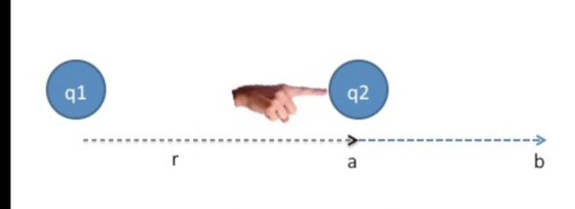
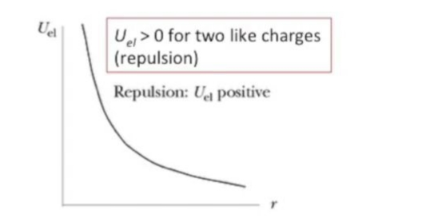
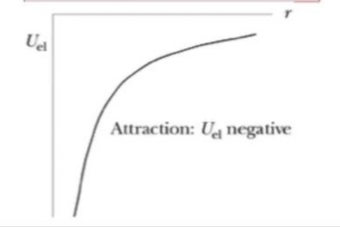
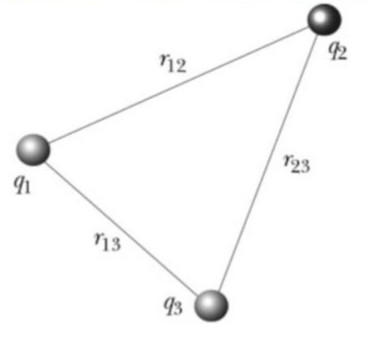
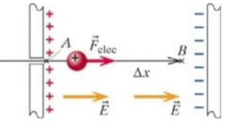
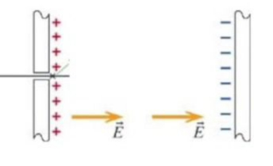

# Elektrik ve Manyetik Etkileşimler - Ders 8

Bugünkü derse potansiyel enerji konusunun bir kez daha üzerinden geçerek
başlayacağız, ardından elektriksel potansiyel, sonra iki yükün ortaya çıkarttığı
potansiyel konusu. İkiden fazla yük potansiyeli de işlenecek.

Tek parçacığın (particle) enerjisi neydi? Bu dersin önkoşul dersi olan giriş
dersini alanlar formülü görmüştür, mekanik konuları orada işlenmişti, tek
parçacık enerjisi

$$
E_{particle} =
\frac{mc^2}{\sqrt{1-\frac{v^2}{c^2}}} =
mc^2 + K \approx
\underbrace{mc^2}_{\textrm{duragan enerji}} +\underbrace{\frac{1}{2}mv^2}_{\textrm{kinetik enerji}}
$$

Eşitliğin ilk bölümünde $mc^2$'yi o büyük formülle bölüyoruz, ki ona Lorenz
faktörü deniyor ($\gamma$ ile gosterilir).

Not: [3] yazısında izafi mekanikteki kinetik enerji tanımında
$E_k = (\gamma - 1)mc^2$ ifadesine erişilmişti, üstteki

$$
E_{particle} = K = \frac{mc^2}{\sqrt{1-\frac{v^2}{c^2}}} -mc^2
$$

olarak gösterilince bu izafi tanımla aynıdır.

Devam edelim, iki üstte eşitliğin en sağındaki toplamda iki terim var, bu
terimlerden ilki durağan haldeki enerji. Nesnenin durduğu haliyle bile bir
enerjisi var, ona eklenen her enerji hareketlilikten ortaya çıkıyor, ki bu da
ikinci terimde, ona $K$ dedik. Bu arada büyük bir ihtimalle kinetik enerji size
daha önce salt bu ikinci terim ile anlatıldı. Fakat bu formül (2. terim) aslında
bir yaklaşıksal temsil. Eğer parçacık ışık hızına oranla yavaş hareket ediyorsa
çok iyi işe yarıyor.

Şimdi enerji prensibini hatırlayalım. Hatırlarsak bu dersin önkoşul dersinde iki
ana prensip vardı. 1) Enerji [evrende] muhafaza edilir 2) nesnenin momentumu
muhafaza edilir. Bir nesnenin enerjisini arttırmak istiyorsam o nesne üzerinde
iş yaparım.

Yapılan iş $W$ şu şekilde gösterilir,

$$
\Delta E_{particle} = W = \int \vec{F} \cdot \mathrm{d} \vec{r}
$$

Bu süreç sırasında tabii parçacığın kütlesinin değişmediğini farz ediyoruz, ki
bu sağlam bir faraziye. O zaman enerjideki tek değişim kinetik enerjiyle alakalı
olur, yani

$$
\Delta E_{particle} = \Delta K = W
$$

Eğer bir parçacık üzerinde iş yaparsam, onu hızlandırabilirim, onun kinetik
enerjisini arttırabilirim.

Şimdi iş hesabının nasıl yapıldığını hatırlatmak için bir örnek; bir ip üzerinde
boncuk var, ip 10 metre, boncuğa sabit olarak 10 Newton uyguluyoruz. İp yatay. Bu
durumda sabit kuvveti entegral dışına alıp sadece baştan sona olan yer
değişimine bakabiliriz, ki bu 10 m, 10 N çarpı 10m = 100 Joule.

Şimdi tek parçacıklıdan çok parçacıklı duruma geçelim. Burada potansiyel
enerjiyi elektrik sistemler bağlamında tanımlamak gerekiyor. Potansiyel enerji
için birden fazla öğe gerekir, çünkü potansiyel enerji bir 'etkileşim
enerjisi'dir, iki veya daha fazla öğenin etkileşiminden ortaya çıkar. Bu durumda
birden fazla parçacığın enerji prensibini bulmak gerekir.

Bir sistem tanımlayalım, içinde iki parçacık olsun, parçacık 1 ve 2. Kuvvetleri
1, 2, ve 'çevreden (surroundings)' gelen kuvvetler diye ayıracağız, yani sistem
dışından olan her şey 'çevre' altında sınıflanacak. Yani parçacık 1 üzerinde
parçacık 2 ve çevre etki ediyor olacak. 

O zaman parçacık 1 üzerinde yapılan iş

$$
\Delta E_1 =
W_{\textrm{\textrm{parçacık 1 üzerinde}}} =
\int \vec{F}_{1,surr} \cdot \mathrm{d} \vec{r} +
\int \vec{F}_{12} \cdot \mathrm{d} \vec{r}
$$

$$
= W_{1, surr} + W_{1,2}
$$

Parçacık için benzer formül,

$$
\Delta E_2 =
W_{\textrm{\textrm{parçacık 2 üzerinde}}} =
\int \vec{F}_{2,surr} \cdot \mathrm{d} \vec{r} +
\int \vec{F}_{21} \cdot \mathrm{d} \vec{r}
$$

$$
= W_{2, surr} + W_{2,1}
$$

Şimdi herşeyi biraraya koyalım; bu sistemin toplam enerji prensibini bulmak
için, enerjideki toplam değişime bakıyoruz, bu değişim iki parçacık sisteminde
çevre ile parçacıkların birbiri üzerinde yaptıkları işin toplamı,

$$
\Delta (E_1 + E_2) = (W_{1, surr} + W_{2, surr}) + (W_{1,2} + W_{2,1})
$$

Şimdi toplam enerji değişimi için her iki enerji değişimini topluyoruz,

$$
\Delta (E_1 + E_2) = W_{surr} + W_{internal} 
$$

ki $W_{surr} = W_{1, surr} + W_{2, surr}$ ve
$W_{internal}=W_{1,2}+W_{2,1}$. Burada $W_{internal}$ sistemin içinde yaptığı /
olan iş, $W_{surr}$ ise çevrenin sistem üzerinde yaptığı iş.

Tek parça sistemini hatırlarsak o formül parçacık enerjisindeki değişim onun
üzerinde çevrenin yaptığı iştir diyordu, çünkü o durumda iş yapacak ikinci bir
parçacık yoktu. Ben üstteki formülü tek parçacık durumuna benzetmek
istiyorum. $\Delta K$ ekleyelim,

$$
\Delta (E_1 + E_2) = \Delta K = W_{surr} + W_{internal} 
\qquad (1)
$$

Soru

İki parçacık birbirini eşit şekilde çekiyor, birbirlerini iptal ederler, hiç
hareket olmaz, o  zaman yapılan iş sıfır olmaz mı?

[Verilen cevaba göre şu söylenebilir, normal şartlarda böyle olurdu [1], fakat
 çevre etkisi de var, onun etkisiyle her iki parçacık hareket ediyor
 olabilirler, bu yollarını az da olsa değiştirebilir, yani hareket ve iki
 parçacığın birbirine uyguladığı kuvvet tam birbirini iptal ediyor denemez cunku
birbirlerine tam karsit halde durmazlar].

Şimdi formülü çevrenin yaptığı ise göre tekrar düzenleyelim. İki parçacığı tek
bir ünite olarak görelim, ki bu sistemimiz, ve bu sisteme dışarıdan gelen
enerji, onun üzerinde yapılan işi bulmaya uğraşalım. 

Bir tanım yapacağım; çevrenin yaptığı işi sistemin kinetik enerjisindeki değişim
ve bizim şimdi potansiyel enerji diye adlandıracağımız bir şeydeki değişimin
toplamı olarak tanımlayacağım. Potansiyel enerjinin dersimizde ilk ortaya
çıktığı her burası.

$$
\Delta U + \Delta K = W_{surr} 
$$

Bu denklemi (1) ile karşılaştıralım,

$$
\Delta (E_1 + E_2) = \Delta K = W_{surr} + W_{internal}
$$

Bu iki denklemi kullanarak $W_{surr}$ için çözersek,

$$
\Delta U = -W_{internal}
$$

olacağını görürüz. Yani sistemin kendi içinde yaptığı işin negatif değerli hali
potansiyel enerjideki değişim oluyor. Demek ki bir sistemin kendi içinde yaptığı
iş, o sistemdeki parçacıkların birbiri üzerinde yaptığı iş potansiyel enerjide
değişime yol açıyor. Bu sistemde enerji değişimine yol açıyor. Mesela örnek
olarak arasında yay olan iki top sistemimiz diyelim,

 
sistemin kendi içinde yaptığı iş sonucunda toplar iki yana doğru daha açılmış
olsun, o zaman potansiyel enerji artıyor [doğru, yaylar daha gergin hale
  geliyor]. Potansiyel enerji olduğunu biliyoruz çünkü toplardan birini bıraksam
[diğer top ötekine doğru havada gidiyor]. 

Burada anlaşılması gereken önemli nokta potansiyel enerjinin etkileşim enerjisi
olduğu, yani parçacıkların arasındaki etkileşimden ortaya çıkan bir enerji
bu. Tek bir parçacığın hiçbir potansiyel enerjisi yoktur çünkü yakınında
etkileşimde olabileceği başka parçacık yoktur.

Bir sistemdeki potansiyel enerjinin ne olduğunu bir sistemin büyümesi sırasında
etkileşimlerin nasıl değiştiğine bakarak bulabiliriz. Örnek için elektrik
yüklerine dönelim, iki yük olsun elimizde, $q_1,q_2$. Diyelim ki bu yüklerden
$q_1$'i sabit tutacağız, $q_2$'yi hareket ettireceğiz, onun üzerinde iş
yapacağız. Bu işin iki yük arasındaki belli bir kuvveti yenerek onu yapması
gerekir, bu kuvvet standart Coloumb kanunundan bilinen kuvvet, 

Dışarıdan / cevreden yapılan işi bir elle temsil edelim, bu el $q_2$'yi $a$'dan
$b$'ye doğru itecek.

Bu sırada sistem üzerinde iş yapmış olacağım ve sistemın potansiyel enerjisini
değiştirmiş olacağım.

$$
W = \int_{a}^{b} \vec{F} \cdot \mathrm{d} \vec{x} =
-\int_{a}^{b} \frac{q_1 q_2}{4 \pi \epsilon_0 r^2} \hat{r} \cdot \mathrm{d} \vec{r}
$$

$$
= \left[ \frac{q_1 q_2}{4 \pi \epsilon_0} \frac{1}{r} \right]_{a}^{b} 
$$

$$
= \frac{q_1 q_2}{4 \pi \epsilon_0} (\frac{1}{b} - \frac{1}{a})
$$  

Üç üstteki formülde eksi işareti nereden geldi (ve sonra niye kayboldu)? İlk
eksi işareti yüklerin birbirini çekiş kuvvetine ters yönde bir iş yaptığımız
için eklendi. Daha sonra entegral alırken bölende olan $r^2$'nin entegrali
alındığı sırada bir eksi daha ortaya çıkar ve mevcut eksiyi artı yapar.

İşaretleri bu şekilde kontrol etmek önemli. Tabii sonra elde edilen sonuca bakıp
kabaca akla yatkın olup olmadığına da bakmak iyidir. Çekim kuvvetine ters iş
yapıyorum, eksi, bunun sonucu potansiyel enerjiyi arttırıyor olmalı, artı.

Peki enerji nereye gitti? Sistemi öyle ayarlayacağım ki başlangıçta ve bitişte
hız sıfır olacak, yani $V_i=V_f=0$, ve kinetik enerjide değişim de sıfır olur,
$\Delta K = 0$. Peki o zaman enerji nereye gitti? Bir sistem üzerinde iş yapınca
o sistemin enerjisini değiştiririz. Yapılan iş potansiyel enerjiye gitti. 

$$
\Delta U = W_{surr} =
\frac{q_1 q_2}{4 \pi \epsilon_0} \left( \frac{1}{b} - \frac{1}{a} \right) \equiv 
U_b - U_a
$$

$\Delta U$ hesabında $a,b$ noktalarındaki farkın formüle nasıl yansıdığını
görüyoruz. Bu formüle bakarak belli bir noktadaki $U$ formülünü çıkartmak zor
olmaz, bir $r$ noktasındaki potansiyel enerji, ki $r$ iki yük arasındaki
uzaklıktır,

$$
U = \frac{q_1 q_2}{4 \pi \epsilon_0 r}
$$

Üstteki formül bana herhangi bir andaki iki yük sisteminin toplam potansiyel
enerjisini verir.

Peki eğer iki yük aynı işarette olsaydı ve dışarıdan iş yaparak onları birbirine
doğru itseydim? $U$ formülünde artı olan iki işaret bize ilk örneğe benzer bir
sonuç verir. Alttaki grafikte bu $U$'nin $r$'ye göre nasıl değiştini
görüyoruz. Yükleri birbirine bastırdıkça, yani mesafe kısaldıkça ($x$ ekseninde
sağdan sola doğru) enerji $y$ ekseninde yukarı doğru çıkacak.

Daha zor durum, iki yük ters işarette ise? 

Üstteki durum ortaya çıkar. İki ters işaret birbirini çeker, onları çok
ayırırsam ve bırakırsam birbirlerine doğru gitmeye meyilli olurlar, diğer
örnekte uzaklaşmaya meyilli idiler. 

Şimdi kadar gördüğümüz formüllerin yerçekimi (gravity) kuvveti, potansiyel
enerjisi formülleriyle benzer gözüktüğü belki gözünüze çarpmıştır.

Elektrik için,

$$
\vec{F} = \frac{1}{4 \pi \epsilon_0} \frac{q_1 q_2}{r^2}\hat{r}, \qquad
U_{el} = \frac{1}{4 \pi \epsilon_0} \frac{q_1 q_2}{r}
$$

Kütlesel çekim,

$$
\vec{F} = -G \frac{m_1 m_2}{r^2} \vec{r}, \qquad
U_{grav} = -G \frac{m_1 m_2}{r}
$$

Yerçekimi durumunda potansiyel enerji çekimsel, o sebeple formüle bir eksi
işaretik konulmuş (kütleler hep artı işaretli olacaktır, yüklerde olduğu gibi
bir yükün eksi olma şansı yok).

Bazılarımız merak edebilir, o bilinen $mgh$ formülüne ne oldu? bu formül aslında
yeryüzüne çok yakın olunduğunda üstteki potansiyel formülünün yaklaşıksal
halinden geliyor [2]. 

Potansiyel enerji farkı $\Delta U$ yeryüzünden biraz, $h$ kadar yukarıdaki bir
objenin potansiyel enerjisi, $\Delta U = U_f - U_i$, yeryüzünde $i$, $h$ kadar
üstte $f$ noktasındayız. $U = -G \frac{m_1 m_2}{r}$ olduğunu üstten biliyoruz,
$M = m_1$, $m=m_2$ diyelim, $r$ dünya yarıçapı,

$$
U = -G \frac{M m}{r}
$$

$$
\Delta U = -G \frac{M m}{r+h} - (-G \frac{M m}{r})
$$

$$
=  G \frac{M m}{r} -G \frac{M m}{r+h}
$$

$$
= GMm \left( \frac{1}{r} - \frac{1}{r+h} \right)
$$

$$
= GMm ( \frac{h}{r^2 + rh}
$$

$$
= \frac{GM}{r^2}m \frac{h}{1 + (h/2)}
$$

$h$ $r$'den çok küçük olduğu için, yani $h<<r$ durumu için, $h/r \approx 0$
diyebiliriz,

$$
= \frac{GM}{r^2}mh
$$

$g = GM / r^2$ olduğuna göre, 

$$
\Delta U = mgh
$$

Ders bitmeden elektriksel potansiyeli tanımlamak istiyorum, şimdi üsttekileri 3
tane yük için görelim, sonra potansiyel enerjiden elektriksel potansiyel
konusuna geçeceğiz. 

Üç yük için etkileşimler üç tane olacaktır,

Resimdeki çizgiler yükler arasındaki etkileşim enerjisini temsil ediyor. $q_1$
ile $q_2$ arasında bu enerji $U_{12}$, $q_2$ ile $q_3$ arasında bu enerji
$U_{23}$, vs.. Tüm etkileşim,

$$
U = U_{12} + U_{23} + U_{31}
$$

$$
U_{el} =
\frac{1}{4 \pi \epsilon_0} \frac{q_1 q_2}{r_{12}} + \
\frac{1}{4 \pi \epsilon_0} \frac{q_2 q_3}{r_{23}} + 
\frac{1}{4 \pi \epsilon_0} \frac{q_1 q_3}{r_{13}} + 
$$

Peki bu sisteme daha fazla yük eklersem ne olur tahmin edebilir miyiz? Daha
fazla terim ekleriz, ve etkileşim enerjisi daha da artar tabii ki. 

Şimdi potansiyel kelimesine gelelim; yani potansiyel enerji demiyorum, ama
voltaj bağlamında elektriksel potansiyel diyorum. Bu kelimenin anlamı nedir?
Elektriksel potansiyel, potensiyel enerjiye sahip olma potansiyeli
demektir. Karışık oldu biraz değil mi? Alttaki diyagrama bakalım, bir elektrik
alan içinde pozitif yüklü bir parçacık var.

Bu alan içindeyken bu parçacığın elektrik alanını oluşturan iki yanindaki
paralel düzlemler ile bir etkileşim enerjisi var. Eğer parçacığı dışarı
çıkarsaydım,

o zaman orada bir şey yok, potansiyel enerji de yok, ama geri koyarsam yine
potansiyel enerjiyi tanımlayabiliyorum. Fakat daha parçacığı geri koymadan önce
şunu düşünebilirdim, potansiyel enerji olmasının potansiyeli nedir? Yani
parçacığı koymadım ama koysaydım enerji ne olurdu? Bu akıl yürütmesini bir test
parçacığı üzerinden yapardım, ve bunu test yükü çarpı şimdi potansiyel
diyeceğimiz bir büyüklük üzerinde yapardım. O zaman etkileşimsel enerjiyi yük
çarpı potansiyel olarak tekrar tanımlıyorum. İşte voltaj olarak bildiğimiz şey
budur.

$$
V \equiv \frac{U_{el}}{q} = \left[ \frac{Joules}{Coloumb} \right] = Volt
$$

Kaynaklar

[1] Physics Stackexchange, [https://physics.stackexchange.com/questions/121955/is-there-work-being-done-if-no-displacement-occurs](https://physics.stackexchange.com/questions/121955/is-there-work-being-done-if-no-displacement-occurs)

[2] Physics Stackexchange, [https://physics.stackexchange.com/questions/122767/is-gravitational-potential-energy-proportional-or-inversely-proportional-to-dist](https://physics.stackexchange.com/questions/122767/is-gravitational-potential-energy-proportional-or-inversely-proportional-to-dist)

[3] Bayramlı, Fizik, *Diferansiyel Denklemler, Temel Fizik, İvme, Hız, Yerçekimi*

