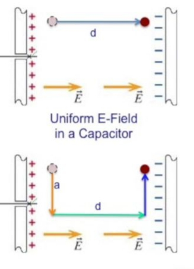
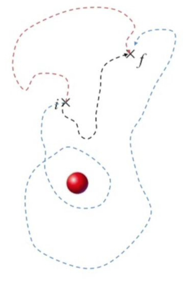

# Elektrik ve Manyetik Etkileşimler - Ders 9

Bu derste elektriksel potansiyeli biraz daha işleyeceğiz, sonra potansiyel farkı
elektrik alanına ilintilendireceğiz, ve son olarak potansiyel farkın 'yol
bağımsızlığından' bahsedeceğiz.

Basit örnekle başlayalım, elimde bir kapasitor var diyelim,

Kapasitor elektrik yüklü iki düzlem / plaka, biri negatif diğeri
pozitif. Elektrik alanın ölçüsü birim yük üzerindeki kuvvet, burada $|E|= 100$
Newton / Coloumb. Alan orada duruyor, bekliyor, eğer içine bir yük koyulursa onu
pat diye itecek, biraz önce belirttiğimiz kuvvetle.

Sorumuz şu, alan içine üstte görüldüğü gibi bir proton koyunca bu proton $A$
noktasından $B$ noktasına itilince sistemin potansiyel enerjisindeki değişim
nedir? Yer değişimi $\Delta x = x_B - x_A = 1$ cm, test yükü tek bir proton, o
zaman yükü $1.6 x 10^{-19}$ C.

Potansiyel enerjideki değişimi daha önce sistemin içinde kendi üzerinde yaptığı
işin negatifi olarak göstermiştik,

$$
\Delta U = -W_{internal}
$$

İş hesabını hatırlarsak $\mathrm{d} r$ üzerinden alınan kuvvet entegrali idi, ki $\mathrm{d}
r$ bir şeylerin hareket ettiği anlamına gelir, çünkü yer değişimidir, ki bu
örnek sistemde tek hareket eden proton o zaman o hareketi hesaba dahil
edeceğiz. Eğer kapasitor hareket ediyor olsaydı onu da bir şekilde hesaba dahil
etmem gerekirdi. Ama kapasitor sabit, sadece proton hareket ediyor.

Peki kuvvet nedir? Elektrik alanın yük üzerinde oluşturduğu kuvvet, o zaman $q
E$, hepsi bir arada

$$
W =
\int \vec{F} \cdot \vec{r} =
\int q \vec{E} \cdot \mathrm{d} \vec{r} = -q \int E_x \mathrm{d} \vec{r}
$$

En son formülde $q$ entegral dışına alında çünkü $q$ sabit. $E_x$ için de aynısı
yapılabilir, çünkü elektrik alanı birörnek dedik. Geriye sadece $\mathrm{d} x$
entegrali kalıyor, ki bu entegralin sonuç yer değişimini verecek, yer değişimi
basit, $\Delta x$.

$$
\Delta U = -q E \Delta x
$$

Üstteki rakamlarla hesap

$$
= -1.6 x 10^{-19} J
$$

Soru: potansiyel enerjideki değişim negatif çıktı; bu içsel enerjinin azaldığı
mı çoğaldığı mı anlamına geliyor? Azaldığı. Olanları su şekilde tarif
edebiliriz, eğer bir sistemin zaten yapacağı şeyi yapmasına izin verirsem, bu
örnekte protonu elektrik alanı içine koydum, ve doğal olarak proton alan
tarafından itildi, bu sistemin potansiyel enerjisini azaltır. Her problem
çözümünden sonra olanlara bu şekilde,  şöyle bir kabaca bakmak faydalı olur. 

Elektrik potansiyeli ise potansiyel enerji olma potansiyeli demiştik, o zaman

$$
\Delta U = q (-E \Delta x ) 
$$

formülünden $q$ haricinde olanlara bakarsak bu bize elektrik potansiyelini
verecektir. O zaman üstteki parantez içinde olanlar potansiyel enerji farkı
potansiyeli, o kısma $\Delta V$ diyelim,

$$
\Delta U \equiv q \Delta V
$$

Birim olarak $V$ nedir? 

$$
\Delta U = q (-E \Delta x )  \equiv q \Delta V 
\qquad (1)
$$

Üstteki formülde $q \Delta V$'den hareketle, eşitliğin sol tarafında enerji,
$\Delta U$ var, orada Joule birimi olmalı. Oradan geriye doğru gidersek, $q
\Delta V$ çarpımında Coloumb çarpı 'birşey' ile eşitliğin solunda Joule çıkması
için 

$$
V = Volt = \frac{Joule}{Coloumb}
$$

olmalı. Bu sayede elektrik alanına farklı bir bakış açısı da kazanmış oluyoruz
aslında. Şimdiye kadar elektrik alanı boşlukta etkisi olan, bir test yükü içine
atılınca hazır ve nazır bir şekilde ona etki edecek yani birim yük üzerinde
etkili enerji, Newton / Coloumb olarak görüldü. İki üstteki eşitlikte $E$'yi tek
başına gelecek şekilde düzenlersek ve birimleri ona göre ayarlarsak, iki tarafı
$q$ ile bölünce Coloumb yokolur, mesafe ile sağı bölünce elektrik alanı volt /
metre haline gelir.

$$
|E| = \frac{Newton}{Coloumb} = \frac{Volt}{Metre}
$$

Yani elektrik alanı aynı zamanda volt / mesafe olarak görülebilir, birim mesafe
üzerinde etkili olan voltaj olarak. Elektrik alanına bu şekilde bakmakla daha
çok haşır neşir olacağız ileride.

Şimdi eV denen bir şeyi göreceğiz, kimya dersinde bu kavramı görenler vardır
belki. 

Potansiyel enerjide değişimi (1)'de gördük. $q (-E \Delta x )$ ve o da $q \Delta
V$'ya eşit. Bu formülde olanları, yani yük çarpı voltajda değişimi tarif etmenin
bir diğer yolu eV; tarifsel olarak bir elekronu 1 voltluk yük içinden hareket
ettirmek için gereken enerji. Yani daha önce Joule üzerinden bulduğumuz sonucun
tamamı 1 eV'ye eşit çünkü o hesapta test yükü kullanmıştık,

$$
-1.6 x 10^{-19} J = 1 eV
$$

[elektrik alani, tepe analojisi atlandi]

Tabii şimdiye kadar gördüklerimiz birörnek elektrik alan ve düz hareket eden
yükler üzerinden idi. Elektrik alanı çok daha çetrefil şekilde tarif ediliyor
olabilir, aynı şekilde alan içindeki yükün hareketi de çetrefil olabilir. Basit
durumda, elektrik alan sadece $x$ yönünde,

$$
\Delta V = -E \Delta x
$$

Birörnek ama artık uzayda değisen, yani her noktada farklı olabilecek bir $E$
elektrik alanla hesaba giris için alttaki yaklaşımı kullanabiliriz. Gidiş
yönümüz $x,y,z$ vektörü ile gösteriliyor, bir yönde ufak bir $\Delta x, \Delta
y, \Delta z$ adımı atıyoruz. O yöndeki, o yöne paralel olan $E$'nin bileşenini
alıyoruz, mesela $x$ yönündeki $E$ bileşeni $E_x$. Bu bileşenleri ona tekabül
eden adımlar ile çarpıp toplarsak üstteki basit noktasal çarpımın karşılığını
elde ederiz.

$$
\Delta V =
-(E_x \Delta x + E_x \Delta y + E_y \Delta x + E_z \Delta z ) \equiv
-\vec{E} \cdot \Delta \vec{x}
$$

Eğer uzayda her noktada değişik olabilecek, birörnek olmayan bir $E$ var ise,
artık Calculus'a ihtiyacımız var, üstteki işlemi ufak ufak birçok adım için
yapıp sonucu topluyoruz, ve Calculus bağlamında, limite giderken o adımlar
küçülürken gerçek sonuca iyice yaklaşmış oluyoruz.

$$
\Delta V = -\int_{i}^{f} \vec{E} \cdot \mathrm{d} \vec{l}
$$

Üstteki entegrale 'çizgi entegrali (line integral)' ya da 'yol entegrali (path
integral)' ismi veriliyor. İsimlendirme mantıklı, çünkü biri alan içinden
gidilen bir *yola* bakıyorum, o yol üzerinden entegral alıyorum, üstte tarif
ettiklerimiz işte, adım atmak, çarpım yapıp sonuçlar toplamak, vs. Tüm bunlar
bir yol üzerinden yapılıyor. 

Bu gördüğümüz potansiyel fark içindi. Potansiyeldeki değişim $\vec{E} \cdot
\mathrm{d}\vec{l}$'in baslangıç $i$'den bitiş $f$'e kadar olan entegraline eşit. Bu
arada ne zaman bir entegral görürseniz formülün her iki tarafının
diferansiyelini almayı düşünebilirsiniz, çünkü diferansiyel entegralin tersi
olduğu için onu yokeder, ve geri kalanlara bakarak bazı irdelemeler yapabiliriz
belki. Üstteki durumda

$$
\vec{E} = \frac{\mathrm{d} V}{\mathrm{d} \vec{x}}
$$

elde edilir. Türevin bir vektör olan $\vec{x}$'e göre alınmış olduğuna
dikkat. Yani bu türev bir gradyan aslında

$$
= -\left[
  \left( \frac{\partial }{\partial x} V \right) \hat{x} + 
  \left( \frac{\partial }{\partial y} V \right) \hat{y} + 
  \left( \frac{\partial }{\partial z} V \right) \hat{z} 
  \right]
$$

$$
-\vec{\nabla} V
$$

Örnek

Elimizde birörnek bir $E$ var, ve onun içinde parçacık $d$ mesafesi alıyor (alt
üstteki resim),

Potansiyel farkı

$$
\Delta V = - E_x d 
\qquad (2)
$$

Fakat ya üst alt resimdeki gibi hareket etseydi? Önce aşağı, sonra sağa, sonra
yukarı? Bu hesabı üç parça olarak yapabilirdik,

$$
1) \Delta V = -E_y \Delta y = E_y a = 0
$$

$$
2) \Delta V = -E_x d
$$

$$
3) \Delta V = -E_y \Delta y = -E_y a = 0
$$

1. ve 3. formüllerdeki sıfırlığın sebebi $E_y$'nin sıfır olması. Tüm
parçalardaki potansiyel değişimi toplarsak yine (2) ile aynı sonucu elde
ediyoruz. Demek ki potansiyel fark hesabı yoldan bağımsız. Bu bağımsızlık
hesaplar sırasında $i$'den $f$'ye gitmek için herhangi bir yolu seçebilirim
demek. Alttaki resimde mesela hesap için kırmızı yolu, ya da mavi olanı, ya da
siyah olanı takip edebilirdim. Entegral hangisi için basit ise onu seçebilirdim.

