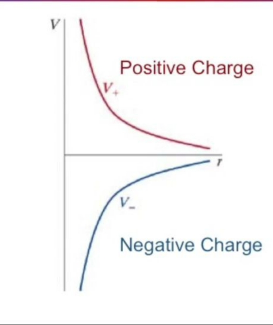

# Elektrik ve Manyetik Etkileşimler - Ders 10

Önceki derste

   * Elektriksel potansiyel (sonsuz ayırıma göre olan voltaj)
   * Potansiyel fark ve elektrik alanı
   * Potansiyel fark hesabının yoldan bağımsız olması

Bugün işlenecek konular

   * Elektrik potansiyel üzerinden geçmek
   * Tek noktadaki potansiyel
   * Bir iletken içindeki potansiyel
   * Bir yalıtkan içindeki potansiyel
   * Bir alanda depolanan enerji

Tek noktadaki elektrik potansiyelle başlayalım: bu hesap mümkün mü? Elektrik
potansiyel farkını $E$'nin bir mesafe üzerinen entegralinin negatifi olarak
görmüştük, bir çizgi entegraliydi.

$$
\Delta V \equiv -\int_{a}^{b} \vec{E} \cdot \mathrm{d} \vec{x}
$$

Elimizde iki nokta yük olduğunu düşünelim. Bu iki yük arasındaki fiziğe
bakmıştık. Birbirlerine yaklaşınca çekim hissedilir, uzaklaşınca daha az
hissedilir. Eğer yükler birbirlerinden sonsuz (yani çok) uzakta ise, çekim hiç
hissedilmez.

Şimdi yüklerden birini sabit tutayım, onu referans yükü kabul edeyim. Serbest
olanı sabit olana yaklaştırdıkça çekim etkisi artar, etkileşimin enerjisi artar,
artar.. Sabit alanın elektrik alanı var, yaklaşıldıkça o alanın etkisi artıyor
doğal olarak. Daha önce yaptığımıza çok benziyor bu, sabit olan pozitif yük
etrafına hareketli olan yükün hissettiği potansiyeli değişik mesafelerde
hesaplamak istiyorum.

Matematiksel olarak potansiyel hesabı bir fark olduğu için $a,b$ bağlamında bir
$b$ gerekli, bu $b$'yi sonsuz uzaklık olarak tanımlıyorum, o uzaklıkta hiç
potansiyel hissedilmiyor, o zaman tek bir noktadaki potansiyeli sonsuz uzaklığa
kıyasla tanımlıyorum, yani

$$
V_A \equiv V_A - V_\infty
$$

Bu tanımın işlemesi için tabii ki $V_\infty = 0$ olmalı.

O zaman, bir yükün elektrik alanı

$$
\vec{E} = \frac{1}{4\pi\epsilon_0} \frac{q}{r^2}\hat{r}
$$

olduğuna göre, 

$$
V_r - V_\infty =
-\int_{\infty}^{r}  \frac{1}{4\pi\epsilon_0} \frac{q}{x^2} \mathrm{d} x
$$

$$
= \frac{1}{4\pi\epsilon_0} \frac{q}{x} \bigg|_{r}^{\infty} 
$$

Entegral hesabında çıkartılan tarafta sonsuzluktaki yük $q$ var, ki buna
sonsuzluktaki yüke sıfır demiştik, o zaman çıkartmada bu terim
yoksayılır. Kalanlarla, noktasal yükün potansiyeli,

$$
V_r = \frac{1}{4\pi\epsilon_0} \frac{q}{r}
$$

Pozitif yük için bu azalma $1/r$'ye oranlı olarak alttaki gibi gözükür (kırmızı
çizgi). Negatif yük benzer ama yukarı çıkıyor (mavi). Her iki durumda da yatay
eksene yaklaşma durumu var.

Kaynaklar

[1] [http://hyperphysics.phy-astr.gsu.edu/hbase/electric/potpoi.html](http://hyperphysics.phy-astr.gsu.edu/hbase/electric/potpoi.html)

