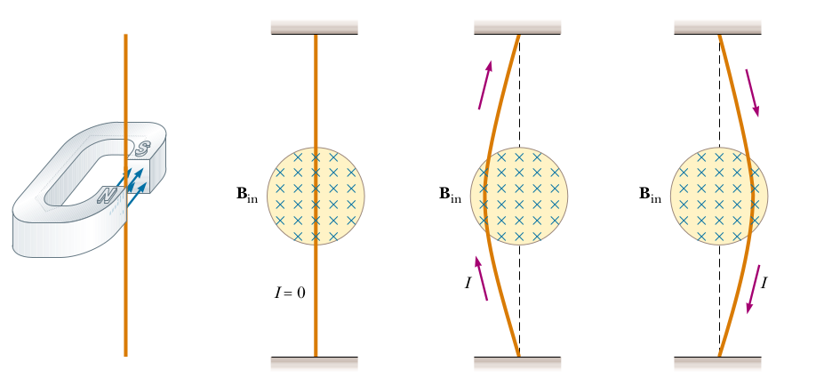
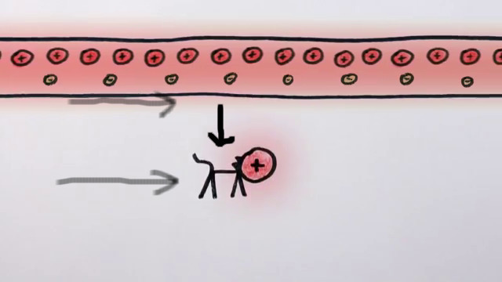
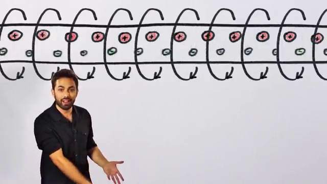

# Elektrik ve Manyetik Etkileşimler - Ders 19

Ekler

Bu dersin orijinal içeriğini atlıyoruz, kendi topladığımız materyeli
sunacağız. Elektromanyetik etkiyi anlatmak için özel izafiyetten bahsetmek
gerekiyor.

Manyetik Alanı Oluşturan Nedir?

Elektrik alanı ölçmek için yapılan $\vec{E}$'yi bir yük $q$'yü durur halde
koymak, ve onun üzerindeki elektrik kuvvet $\vec{F}_E$'yi ölçmektir. Ardindan
$\vec{E}$

$$
\vec{E} = \frac{\vec{F}_E}{q}
$$

olarak tanımlandı, yani birim yükün hissettiği elektrik kuvveti. Fakat manyetik
bağlamda bu deney işlememiştir. Manyetik alan $\vec{B}$'yi bulmak için hareket
halindeki parçacıklar gerekmiştir. Deneyde parçacık farklı yönlerine, $\vec{v}$,
ile ateşlenir ve onun hissettiği $\vec{F}_B$ ölçülür. Pek çok deney ardından
özel bir yönde / eksende $\vec{F}_B$'nin sıfır olduğu görülmüştür. Ayrıca
$\vec{F}_B$'nin yönünün her zaman $\vec{v}$'nin yönüne dik olduğu görülmüştür.

Ayrıca $\vec{F}_B$'nin büyüklüğünün her zaman $v \sin\phi$'ye oranlı olduğu
görülmüştür, ki $\phi$ açısı sıfır-kuvvet ekseni ile gidilen yön $\vec{v}$'nin
arasındaki açıdır (bu durum tabii ki nihai kanunda bir çapraz çarpım
olabileceğini bize tiyolamış olur). O zaman manyetik alan $\vec{B}$'yi o
bahsettiğimiz sıfır-kuvvet yönü olarak tanımlayabiliriz. Özet olarak alttaki
formül yazılabilir [1, sf. 805],

$$
\vec{F}_B = q \vec{v} \times \vec{B}
$$

Formül diyor ki yükün hissetiği $\vec{F}_B$ yük miktarı $q$ çarpı yükün hızı
$\vec{v}$ ve alan $\vec{B}$'nin çapraz çarpımına eşittir (aynı referans
çerçevesi, kordinat sistemı içinde). Eğer temel vektör aritmetiğini hatırlarsak,
$\vec{a}$ ve $\vec{b}$'nin çapraz çarpımı bir üçüncü $\vec{c}$ veriyordu ve bu
vektörün büyüklüğü

$$
c = a b \sin \phi
$$

formülüne eşitti. Aynı şeyi manyetik kuvvet için kullanabiliriz,

$$
F_B = |q| v V \sin\phi
$$

Sağ el kuralı faydalı olabilir [2, sf. 908],

Eğer pozitif bir yükü tutuyorsak elin içi $\vec{v}$'yi gösteriyor, kıvrılmış
parmaklar $\vec{B}$'yi gösteriyorsa, o zaman başparmağı $\vec{F}_B$'yi
gösterir. Negatif yük tutuyorsak $\vec{F}_B$ ters yöndedir. Aslında bu el
kuralları dikgenliği göstermenin bir diğer yolu, $\vec{B}$ ve $\vec{v}$ bir
düzlem oluşturuyor da diyebilirdik ve bu düzlemin normali bahsedilen çapraz
çarpım ile hesaplanır ve o normal $\vec{F}_B$'nin ta kendisidir.

Alttaki örnekte kuvvet yönünü yine görüyoruz. Solda manyetik bir alan
oluşturulmuş bir alan N kutbundan S kutbuna gidiyor, 2., 3. ve 4. resimde ilk
resimdeki mavi oklar açısından baktığımız düşünüyoruz, elektrik akışı (yükler)
kabloda yukarı doğru, bu durumda kablo 3. resimde görüldüğü şekilde sola doğru
çekilecektir. Eğer elektrik akışı ters yönde olursa kablo sağa çekilecektir.

İzafiyet                       

Einstein'ın buluşu izafiyete göre evrenimizde uzunluk ve zaman mutlak değildir,
bakış açısına göre izafidir, birbirine göre farklı şekillerde hareket eden
kişiler farklı zaman ve obje büyüklüklerini gözlemleyebilirler. Altta yari saka
olarak [3] programinda sunucu yanindan hizla gecen bir arabanin kuculdugunu
goruyor. 

Bu etki her ne kadar çok, çok cüzi olsa da elektromıknatısların işlemesini
sağlayan prensip budur.

Bir bakır kablo düşünelim, pozitif yükleri ve negatif elektronları var. Bunlar
dengede olduğu kablo nötr durumda olacaktır ve yakında duran pozitif yüklü bir
kedi hiçbir kuvvet hissetmeyecektir. Negatif yuk akiyor olsa bile bu durum
degismez, cunku toplam yuk hala notr. 

Fakat kediyi elektronlar ile aynı yönde yakın hızda hareket ettirsem ne olur?
İzafiyete göre kedinin bakış açısına göre elektronlar hareket etmiyor, ama
pozitif yükler hareket ediyor. Hareket eden şey kısalır, yoğunluğu artar,
duran ise daha geniştir. Bu durumda kedi ona göre daha "yoğun'' olan pozitif
yükler tarafından, kablodaki dengenin değişmiş olması sebebiyle, itilir! Halbuki
kabloda atomik hiçbir değişim olmadı. Sadece kediyi hareket ettirdik. 

İlginç değil mi? Sunucunun bakış açısına göre bu acaip, hareketsiz kedi
itilmiyor, ama hareket eden kedi kabloya dik olarak (dik kuvvetin nereden
geldiğini böylece anlamış oluyoruz) itiliyor. İşte manyetik kuvvet denen şey
aslında budur.

Kaynaklar

[1] Resnick, *Fundamentals of Physics, 10th Edition*

[2] Resnick, *Fundamentals of Physics, 8th Edition*

[3] Veritasum, *How Special Relativity Makes Magnets Work*,
    [https://www.youtube.com/watch?v=1TKSfAkWWN0](https://www.youtube.com/watch?v=1TKSfAkWWN0)

