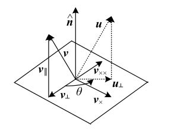
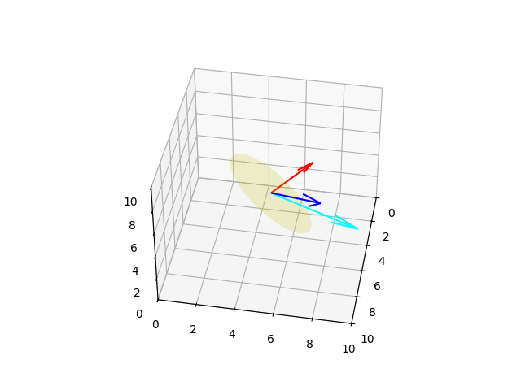
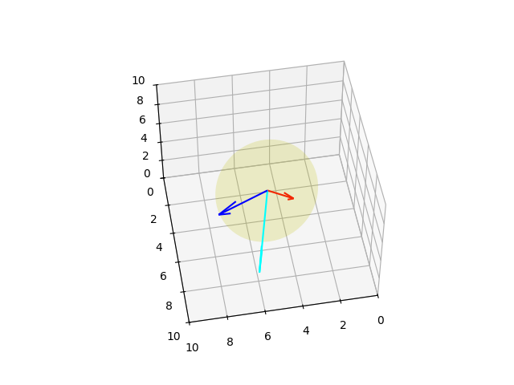

# Döndürme (Rotation) - 1

Herhangi bir boyutta döndürme işlemi, yani bir noktayı ya da bir vektörün yönünü
değiştirmek lineer cebirsel bir matris çarpım işlemi üzerinden hesaplanabilir.
Daha önce [2]'de gördüğümüz baz değiştirme tekniği burada da geçerli. Baz
değiştirme de iki boyutta $i$,$j$, ya da $[\begin{array}{cc} 0 & 1 \end{array}]$
ve $[\begin{array}{cc} 1 & 0 \end{array}]$ vektörlerinin yeni bir yöne işaret
etmesi ve bu değişim sırasında ilk uzaydaki şeklin bu değişimle beraber
değişmesi olarak görülebilir. Bu yeni bazı kolonlarında taşıyan şey ise bir nevi
döndürme matrisi $R$'dir.

Not: Bu matrisin her zaman dikgen olacağını görmek zor değil, çünkü yamultma,
kesme olmadan, direk $i,j,k$ baz vektörlerini belli bir şekilde yeni yerlere
taşıyoruz, bu taşıma sonucunda tabii ki yeni yerlerinde de bu baz vektörler
birbirine dik olacaktır, ve onları içeren döndürme matrisi de ortonormal, dikgen
halde olacaktır.

Eğer bir vektörü 90 derece saat yönü tersine döndürmek isteseydik, yeni baz
nasıl olurdu? $i$'yi kaldırıp tam yukarı işaret ettirmek lazım, o zaman
$[\begin{array}{cc} 0 & 1 \end{array}]^T$, $j$ ise aynı şekilde sola
yatırılmalı, $[\begin{array}{cc} -1 & 0 \end{array}]$. Rotasyon matrisi,

$$
R = \left[\begin{array}{rr}
0 & -1 \\ 1 & 0
\end{array}\right]
$$


```python
v = np.array([1,1])
plt.quiver(0,0,v[0],v[1],scale=5)
R = np.array([[0, -1],[1,0]])
vnew = np.dot(R, v)
plt.quiver(0,0,vnew[0],vnew[1],scale=5,color='red')
plt.xlim(-2,2)
plt.ylim(-2,2)
plt.grid(True)
plt.savefig('phy_072_rot_04.png')
```


Doksan derece dönüş görülüyor.

Peki doksan derece değil $\theta$ kadar bir saat yönü tersi döndürüşü
nasıl temsil edilebilirdi? Yine bazın nereye gittiğine bakıyoruz,


Eğer $i$'yi kaldırıp $i'$ haline getirirsek bu yeni vektörün
$[\cos\theta,\sin\theta]$ durumuna gelmesi, $j$'yi döndürüp $j'$ yapınca
$[-\sin\theta,\cos\theta]$ haline gelmesi demektir. Dönüş matrisi,

$$
R = \left[\begin{array}{rr}
\cos\theta & -\sin\theta \\
\sin\theta & \cos\theta
\end{array}\right]
$$

```python
theta = np.deg2rad(20)
v = np.array([1,1])
plt.quiver(0,0,v[0],v[1],scale=5)
R = np.array([[np.cos(theta), -np.sin(theta)],[np.sin(theta),np.cos(theta)]])
vnew = np.dot(R, v)
plt.quiver(0,0,vnew[0],vnew[1],scale=5,color='red')
plt.xlim(-2,2)
plt.ylim(-2,2)
plt.grid(True)
plt.savefig('phy_072_rot_05.png')
```


Euler Açıları (Euler Angles)

Bir katı gövdenin, ya da aerodinamik simülasyonda uçağın, bir arabanın hangi
yöne baktığını (orientation) temsil etmek için Euler açıları yaygın şekilde
kullanılır. Bu açılar herhangi bir, ne kadar çetrefil olursa olsun dönüşün,
peşpeşe, her eksen etrafında uygulanabilecek üç tane ardı ardına yapılan
döndürme ile temsil edilebileceğinden hareketle bulunmuştur. Mesela altta ardı
ardına YXZ eksenleri üzerinde yapılan döndürme gösteriliyor.


Genelde kullanım kalıbı ZYX ya da ZXZ üzerinden yapılır. Altta ZXZ örneğini
göreceğiz. Herhangi bir eksen etrafındaki dönüş tek bir dönüş matrisi ile
gösterilebilir, mesela Z etrafındaki $\phi$ kadar bir dönüş $D$ matrisinde olsun
[1, sf 153],

$$
D = \left[\begin{array}{rrr}
\cos \phi & \sin\phi & 0 \\
-\sin \phi & \cos\phi & 0 \\
0 & 0 & 1
\end{array}\right]
$$

O zaman $z$ ekseni etrafındaki bir dönüş

$$
\bar{x}' = D \bar{x}
$$

yani $\bar{x} = [x, y, z]$ döndürülerek $\bar{x}' = [x', y', z']$ elde edildi.

Şimdi $x'$ ekseni etrafında $\theta$ kadar döndürüyoruz, bunu $C$ ile yapalım,

$$
C = \left[\begin{array}{rrr}
1 & 0 & 0 \\
0 & \cos\theta & \sin\theta \\
0 & -\sin\theta & \cos\theta
\end{array}\right]
$$

$$
\bar{x}'' = C \bar{x}'
$$

Ve son olarak $\bar{x}'' = [x'',y'',z'']$ içindeki $z''$ etrafında $\psi$ kadar
döndürüyoruz, bunu $B$ ile yapalım,

$$
B = \left[\begin{array}{rrr}
\cos \psi & \sin\psi & 0 \\
-\sin \psi & \cos\psi & 0 \\
0 & 0 & 1
\end{array}\right]
$$

$$
\bar{x}_f = B \bar{x}''
$$

Tüm bu matris çarpımlarını tek bir satırda

$$
\bar{x}_f =  B C D \bar{x}
$$

ile yapabilirdik, ya da

$$
\bar{x}_f =  A \bar{x}
$$

olarak ki $A = BCD$ olmak üzere.. Bu $A$ matrisinin içeriği neye benzerdi? Cebirsel
olarak $BCD$ çarpımını gerçekleştirince,

$$
A = \left[\begin{array}{ccc}
\cos\psi\cos\phi-\cos\theta\sin\phi\sin\psi &
\cos\psi\sin\phi + \cos\theta\cos\phi\sin\psi &
\sin\psi\sin\theta \\
-\sin\psi\cos\phi-\cos\theta\sin\phi\cos\psi &
-\sin\psi\sin\phi + \cos\theta\cos\phi\cos\psi &
\cos\psi\sin\theta \\
\sin\theta \sin\phi &
-\sin\theta\cos\phi &
\cos\theta
\end{array}\right]
$$

Not: dikkat edelim, eksenlerde ardı ardına yapılan rotasyonların birleşimi
sırabağımsız değil, mesela alttaki iki döndürme, aynı temel döndürmeleri
yapıyor olsalar da farklı sıralarda yaptıkları için farklı sonuçları veriyorlar,


Tabii üstteki durum lineer cebirin mantığı ile uyumlu, çünkü matris çarpımı da
sırabağımsız değildir.

Paket

Kütüphane `scipy` içinde faydalı kodlar var, mesela `scipy.spatial.transform`
içinde,

```python
from scipy.spatial.transform import Rotation as R

r = R.from_euler('zyx', [90, 45, 30], degrees=True)
print (np.round(r.as_matrix(),2))
```

```
[[ 0.   -0.71  0.71]
 [ 0.87 -0.35 -0.35]
 [ 0.5   0.61  0.61]]
```

Rodriguez Matrisleri

Genel olarak rotasyon bir eksen ve o eksen etrafındaki bir açı olarak
gösterilebilir,


Ya da rotasyon eksenini $\hat{n}$ olarak gösterelim, ve dönüşün o eksene
dikgen olan bir düzlem üzerinde olduğunu düşünelim [4, sf. 37],



Yani $v$ vektörü, $\hat{n}$ etrafında $\theta$ kadar dönüp $u$ olacak. $\hat{n}$ birim vektör, 
ve dikgen olduğu düzlemi tanımlamak için kullanılıyor.

$v$'nin dönüşten etkilenmeyen bileşeni $v_\parallel$'yi hesaplamak için
$v$'nin $\hat{n}$ üzerine olan yansımasını (projection) hesaplayabiliriz. 
Yansıtma formülü, bkz [5],

$$ v_\parallel =  \frac{\hat{n}\hat{n}^T}{\hat{n}^T\hat{n}} v 
= (\hat{n}\hat{n}^T) v
$$

Peki $v$'nin düzlem üzerindeki yansıması $v_\perp$ nedir? Resme göre $v =
v_\perp + v_\parallel$ olduğuna göre ve üstteki formülü yerine koyunca,

$$ v_\perp = v - v_\parallel 
= v - (\hat{n}\hat{n}^T) v 
= (I - \hat{n}\hat{n}^T) v
$$

Burada $v_\perp$'in 90 derece çevrilmiş hali $v_x$ nedir? Aslında bu
$\hat{n} \times v$ olmalı, sağ el kuralıyla bu görülebilir. Eğer $N$
matrisini $\hat{n}$'i baz alan bir eksi bakışımlı matris olarak alırsak, 

$$ v_x = \hat{n} \times v = Nv $$

ki $\hat{n}$ öğeleri $\hat{n}_x,\hat{n}_y,\hat{n}_z$ olacak şekilde

$$ 
N = \left[\begin{array}{rrr}
0 & -\hat{n}_x  & \hat{n}_y \\
\hat{n}_z & 0 & -\hat{n}_x \\
-\hat{n}_y & \hat{n}_z & 0
\end{array}\right]
 $$

Eğer $v_\perp$'u tekrar saat yönü tersinde 90 derece döndürmek istesek,
tekrar aynı çarpımı yapardık,

$$ v_{xx} = \hat{n} \times v_x =  N  v_x = N \cdot N v = N^2v = -v_\perp
$$

çünkü $v_{xx} = -v_\perp$. Şimdi tekrar $v_\parallel = v - v_\perp$ formülüne dönelim,

$$ v_\parallel = v - v_\perp = v + v_{xx} = v + N^2v  = (I+N^2)v $$

Eğer $u_\perp$'u $v_\perp$ ve $v_x$ üzerinden tanımlamak istersek, önce $u_\perp$'un $v_\perp$ 
vektörünün $\theta$ kadar döndürülmüş hali olduğu bilgisini kullanabiliriz. 

Bu dönme işlemi iki boyuttadır (yani aynı düzlem üzerinde) o zaman standart
rotasyon matrisi yeterli,

$$ 
u_\perp = R_\theta \cdot v_\perp = 
\left[\begin{array}{rrr}
\cos \theta & -\sin \theta \\
\sin \theta & \cos \theta
\end{array}\right]
\left[\begin{array}{rrr}
v_\perp^1 \\
v_\perp^2
\end{array}\right] = 
\left[\begin{array}{rrr}
v_\perp^1 \cos \theta  - v_\perp^2 \sin \theta \\
v_\perp^2 \cos \theta  + v_\perp^1 \sin \theta  
\end{array}\right]
$$

$$ =
\cos \theta
\left[\begin{array}{rrr}
v_\perp^1  \\
v_\perp^2   
\end{array}\right] 
+ 
\sin \theta
\left[\begin{array}{rrr}
 - v_\perp^2  \\
 + v_\perp^1  
\end{array}\right] 
$$

Dikkat, $\sin \theta$ ile çarpılan vektör, aynı zamanda $v_\perp$'un 90 derece
döndürülmüş hali. Kontrol edelim, $\theta = 90$'lik rotasyon matrisi 
üzerinden,

$$ 
\left[\begin{array}{rrr}
0 & -1 \\ 1 & 0
\end{array}\right]
\left[\begin{array}{rrr}
v_\perp^1 \\
v_\perp^2
\end{array}\right] = 
\left[\begin{array}{rrr}
-v_\perp^2 \\
v_\perp^1
\end{array}\right]
$$

Doğrulandı. Ayrıca önceden biliyoruz ki $v_\perp$'u 90 derece döndürerek $v_x$'i elde
etmiştik. O zaman iki üstteki formül

$$ u_\perp = \cos \theta v_\perp + \sin \theta v_x $$

olarak gösterilebilir. Daha önce hesapladığımız $v_\perp$ ve $v_x$'i
yerlerine koyarsak, 

$$ = \sin \theta Nv - \cos \theta N^2 v $$

$$ u_\perp = (\sin \theta N - \cos \theta N^2) v $$

Hepsini bir araya koyarsak, 

$$ u = u_\perp + v_\parallel $$

$$ = ( \sin \theta N - \cos \theta N^2 + I + N^2)v  $$

$$ = \big( I + \sin \theta N - (1-\cos \theta) N^2 \big) v  $$

Yani bir eksen $\hat{n}$ etrafında $\theta$ kadar dönüşü bir matris olarak
yazabiliriz ki bu matrisin formülü şu şekilde olur, 

$$ R(\hat{n},\theta) =  I + \sin \theta N - (1-\cos \theta) N^2 $$

ki bu Rodriguez formülüdür. 

Altta $(-1/3,2/3,2/3)$ ekseni etrafında 70 derece dönüş birkaç farklı
açıdan gösteriliyor. 

```python
def skew(a):
   return np.array([[0,-a[2],a[1]],[a[2],0,-a[0]],[-a[1],a[0],0]])

o = np.array([5,5,5])
v = np.array([3,3,3])
n = [-1/3.,2/3.,2/3.]
   
theta = np.deg2rad(70)
N = skew.skew(n)
R = np.eye(3) + np.sin(theta) * N - (1-np.cos(theta))*N**2
print R
vr = np.dot(R,v)
print vr
```

```
[[ 1.         -0.91889724  0.33402626]
 [ 0.33402626  1.          0.240122  ]
 [-0.91889724 -0.38633975  1.        ]]
[ 1.24538705  4.72244477 -0.91571096]
```

```python
from mpl_toolkits.mplot3d import Axes3D
import plot3d
fig = plt.figure()
ax = Axes3D(fig)
plot3d.plot_vector(fig, o, v)
ax.hold(True)
plot3d.plot_vector(fig, o, vr, 'cyan')
ax.hold(True)
plot3d.plot_vector(fig, o, 3*np.array(n), 'red')
ax.hold(True)
plot3d.plot_plane(ax, o, n, size=3)
ax.view_init(elev=40., azim=10)
plt.savefig('vision_02_01.png')
ax.view_init(elev=30., azim=40)
plt.savefig('vision_02_02.png')
ax.view_init(elev=40., azim=50)
plt.savefig('vision_02_03.png')
ax.view_init(elev=50., azim=80)
plt.savefig('vision_02_04.png')
```







Kaynaklar

[1] Safko, *Classical Mechanics*

[2] Bayramlı, *Lineer Cebir, Giris*

[3] Widnall, *16.07 Dynamics*

[4] Sastry, *An Invitation to 3-D Vision*

[5] Bayramlı, Lineer Cebir, *Ders 15*


