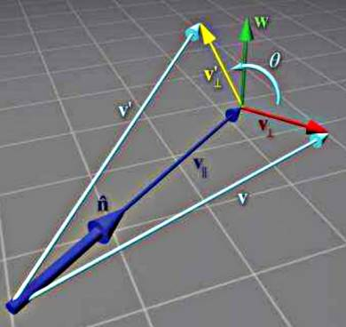
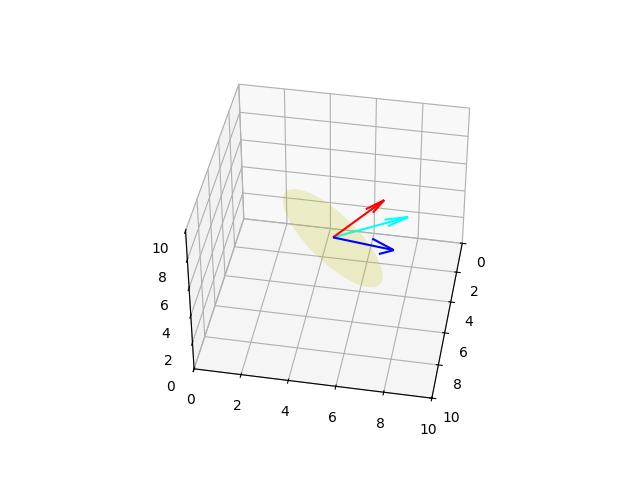
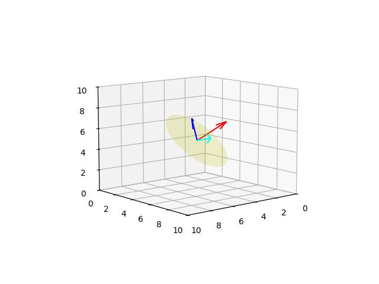

# Döndürme (Rotation) - 2

Herhangi Bir Eksen (Vektör) Etrafında Dönüş

Daha öne Rodriguez yöntemi ile yaptığımız döndürme yaklaşımını bir başka
teknikle göstereceğiz. Bulmak istediğimiz $\vec{n}$ etrafında $\theta$ dönüşü
yaptıracak bir matris, yani öyle bir matris $R(\vec{n},\theta)$ arıyoruz ki bu
matrisle $\vec{v}$ vektörünü sağdan çarpınca $\vec{v}'$ elde edilecek ve bu yeni
vektör $\vec{v}$ vektörünün $\vec{n}$ etrafında $\theta$ kadar dönmüş hali
olacak [1, sf. 142]. Yazının geri kalanında $\vec{v} = v$, $\vec{n} = n$.. 

$$
v' = v R(n,\theta)
$$

$R(n,\theta)$ matrisini türetmek için önce $v'$ vektörünü $v,n,\theta$ bazında
temsil etmeyi görelim. Ana fikir problemi $n$'ye dik olan düzlem üzerinde
çözmek, ki bu şekilde 3 boyutlu problemi 2 boyutlu bir probleme indirgemiş
oluyoruz. İndirgeme için $v$ vektörünü iki $v_\parallel$ ve $v_\perp$ vektörüne
ayıracağız, öyle ki $v = v_\parallel + v_\perp$. Sonra bu ki vektörü ayrıca
döndüreceğiz ve böylece onların toplamları da dönmüş olacak, yani $v' =
v'_\parallel + v'_\perp$. Buraya kadar gördüklerimiz Rodriguez yaklaşımına
benziyor.



Tekniğin iyi tarafı $v_\parallel$ vektörü $n$ vektörüne paralel olduğu için $n$
etrafında dönüşten etkilenmez, o zaman sadece $v_\perp$ vektörünü döndürmek
yeterlidir, böylece $v' = v_\parallel + v'_\perp$ hesaplanabilir.

Hesap için şu adımları takip ediyoruz,


   * $v_\parallel$ vektörü $v$ nin $n$ ye paralel olan şeklidir, ya da
     $v$ vektörünün $n$ üzerinde yansıtılmış halidir [2], bu formülün
     $v_\parallel = (v \cdot n) n$ olduğunu biliyoruz.
   * $v_\perp$ vektörü $v$ nin $n$ ye dik olan kısmıdır.
     $v = v_\parallel + v_\perp$ olduğu için $v_\perp = v - v_\parallel$.
   * Üstteki şekilde $w$ vektörü var, bu vektör $v_\perp$ ve $v_\parallel$
     ile diktir, ve uzunluğu $v_\perp$ ile aynıdır. Bu vektör $v_\perp$
     vektörünü 90 derece döndürerek elde edilebilir. Bu sebeple $w = n \times v_\perp$.
     


Bu vektörlerle nasıl $v'$ hesaplayacağız? Dikkat edersek $w$ ve $v_\perp$ bir 2D
kordinate uzayı oluşturuyor. $v'_\perp$ vektörü $v'$ yi bu uzayda $\theta$ kadar
döndürerek elde edilebilir. Bu dönüşün formülünün

$$
v'_\perp = \cos \theta v_\perp + \sin \theta w
$$

olduğunu biliyoruz (ispatı bu anlatım ardından paylaşılıyor).

Şimdi eldeki formüllere bakalım:

$$
v_\parallel = (v \cdot n) n
$$

$$
v_\perp = v - v_\parallel
$$

$$
= v - (v \cdot n) n
$$

$$
w = n \times v_\perp
$$

$$
= n \times (v - v_\parallel)
$$

$$
= n \times v - n \times v_\parallel
$$

$n$ ve $v_\parallel$ birbirine paralel olduğu için çapraz çarpımları sıfırdır,

$$
= n \times v - 0 
$$

$$
w = n \times v
$$

$$
v'_\perp = \cos \theta v_\perp + \sin \theta w
$$

$$
= \cos \theta (v - (v \cdot n) n) + \sin \theta (n \times v)
$$

Üstteki değeri $v'$ formülü içine sokalım,

$$
v' = v'_\perp + v_\parallel
$$

$$
v' = \cos \theta (v - (v \cdot n) n) + \sin \theta (n \times v) + (v \cdot n) n
\qquad (1)
$$

Eğer (1) formülünü matris formunda göstermek istiyorsak, baz vektörleri
$[\begin{array}{ccc} 1 & 0 & 0 \end{array}]^T$,
$[\begin{array}{ccc} 0 & 1 & 0 \end{array}]^T$,
$[\begin{array}{ccc} 0 & 0 & 1 \end{array}]^T$ teker teker (1) ile çarpıp
sonuçları bir diğer 3 x 3 matrisin kolonlarına yazabiliriz [1, sf. 143][1, sf. 757], 
böylece alttaki matrisi elde ederiz,

$$
\scriptsize
R(n,\theta) =
\left[\begin{array}{ccc}
n_x^2(1-\cos\theta)+\cos\theta & n_x n_y (1-\cos\theta)+n_x \sin\theta & n_x n_z (1-\cos\theta)-n_x\sin\theta\\
n_x n_y (1-\cos\theta)-n_z\sin\theta & n_y^2(1-\cos\theta)+\cos\theta & n_y n_z (1-\cos\theta)n_x\sin\theta\\
n_x n_z (1-\cos\theta)+n_y \sin\theta & n_y n_z (1-\cos\theta)-n_x \sin\theta & n_z^2 (1-\cos\theta)+\cos\theta
\end{array}\right]
\qquad (2)
$$

```python
import sys; sys.path.append('../phy_072_rot')
from mpl_toolkits.mplot3d import Axes3D
import plot3d

def rotate(v, n, theta):
    return np.cos(theta) * ( v - np.dot(v,n) ) + \
           np.sin(theta)* np.cross(n,v) + \
           np.dot(v,n)*n
 
o1 = np.array([5,5,5])
v1 = np.array([3,3,3])
n1 = np.array([-1/3.,2/3.,2/3.])

theta = np.deg2rad(20)

v1r = rotate(v1, n1, theta)

fig = plt.figure()
ax = Axes3D(fig)
plot3d.plot_vector(fig, o1, v1)
plot3d.plot_vector(fig, o1, v1r, 'cyan')
plot3d.plot_vector(fig, o1, 3*np.array(n1), 'red')
plot3d.plot_plane(ax, o1, n1, size=3)
ax.view_init(elev=40., azim=10)
plt.savefig('phy_073_rot_02.jpg')
```



Teori

3D A,B vektörleri birbirine dikgen ve bir 2D uzay yaratıyorlar, ki sanki A
vektörü $x$ ekseni, B ise $y$ ekseni. A vektörünün $\theta$ açısı kadar
döndürülmesi $Y = \cos \theta A + \sin \theta B$ vektörünü verir (üstteki
problemde $A = v_\perp$, $B = w$).

İspat

A ve B 3D uzayında bir 2D düzlemi kapsayan iki dikgen vektör ise, A ve B'yi bu
2D düzlem için baz vektörleri olarak düşünebiliriz. A ve B tarafından kapsanan
düzlemdeki herhangi bir X vektörü, A ve B'nin bir doğrusal birleşimi olarak
ifade edilebilir:

$X = x_A A + x_B B$

Burada, $x_A$ ve $x_B$, X'in A ve B doğrultularındaki bileşenleridir.

A vektörü için, {A, B} bazındaki temsili, A doğrultusundaki bileşenin
1 ve B doğrultusundaki bileşenin 0 olduğu durumdur. Yani, A'yı bu 2D
baz sisteminde "x ekseni" ve B'yi "y ekseni" olarak düşünebiliriz,
burada A'nın "koordinatları" (1, 0) olur.

Şimdi, A vektörünü A ve B'nin kapsadığı düzlem içinde $\theta$ açısı
kadar döndürelim. Ortaya çıkan vektöre Y diyelim. Standart bir 2D
Kartezyen koordinat sisteminde, koordinatları $(x, y)$ olan bir vektör
$\theta$ açısı kadar saat yönünün tersine döndürüldüğünde, yeni
koordinatları $(x', y')$ şu şekilde bulunur:

$x' = x \cos \theta - y \sin \theta$

$y' = x \sin \theta + y \cos \theta$

Bizim durumumuzda, A vektörünün {A, B} bazındaki başlangıç
"koordinatları" $(1, 0)$'dır. A'yı $\theta$ kadar döndürdüğümüzde,
ortaya çıkan Y vektörünün {A, B} bazındaki yeni "koordinatları",
$(y_A, y_B)$, $(x, y) = (1, 0)$ kullanılarak 2D döndürme formülleriyle
bulunabilir:

$y_A = 1 \cdot \cos \theta - 0 \cdot \sin \theta = \cos \theta$

$y_B = 1 \cdot \sin \theta + 0 \cdot \cos \theta = \sin \theta$

Dolayısıyla, döndürülen Y vektörünün {A, B} bazındaki bileşenleri, A
doğrultusunda $\cos \theta$ ve B doğrultusunda $\sin \theta$ olur.

Şimdi Y vektörünü, bu bileşenleri kullanarak baz vektörler A ve B'nin
doğrusal birleşimi olarak yazabiliriz:

$Y = y_A A + y_B B$

$Y = \cos \theta A + \sin \theta B$

Bu, A vektörünün A ve B'nin kapsadığı 2D düzlem içinde $\theta$ açısı
kadar döndürülmesinin $Y = \cos \theta A + \sin \theta B$ vektörünü
verdiğini kanıtlar. Bu, bir 2D Kartezyen düzlemde x eksenindeki $(1,
0)$ vektörünün $\theta$ kadar döndürüldüğünde $(\cos \theta, \sin
\theta)$'ye dönmesiyle benzerdir. A ve B vektörleri, 3D uzayında bu 2D
dönüşüm için eksenleri sağlar.

Dörtlü Grup / Kuaterniyon (Quaternions)

Bir vektörü, fiziksel objeyi döndürmek için çok faydalı bir diğer kavram
kuaterniyon kavramı.  Kuaterniyon matematiği hayali (imaginery, complex)
sayıları baz alan bir cebir sistemidir, William Hamilton tarafından
keşfedilmiştir. Bir kuaterniyon sayı dört reel sayı ve üç tane hayali sayı
içerir,

$$
q = [\begin{array}{cccc} w & x & y & z \end{array}]
$$

olarak yazılabilir, ki son üç sayı hayalidir, ya da

$$
q = w + i x + j y + k z
$$

Görüldüğü gibi bu cebirin olabilmesi için sadece $i$ değil, ek olarak $j,k$
hayali sayıları sisteme ekleniyor, ve önkabul olarak şu ifade ileri sürülüyor
[1, sf. 247],

$$
i^2 = j^2 = k^2 = ijk = -1
$$

Üstteki ifadelerden geri kalan eşitlikler türetilebilir [4, sf. 170], mesela

$$
ijk = -1 = k^2 \Rightarrow ij = k
$$

Ayrıca $ij = -ji$, yani sırabağımsızlık yoktur.

Tüm önverili ve türetilmiş ifadeleri biraraya koyarsak,

$$
i^2 = j^2 = k^2 = ijk = -1
$$

$$
ij = -ji = k
$$

$$
jk = -kj = i
$$

$$
ki = -ik = j
$$

Üsttekilere Hamilton'un kurallları adı veriliyor.

Eşlenik (conjugate) hesabı bir $q$ için $q^{\ast}$ olarak gösterilir, hayali
olan kısmın negatiflenmesi ile elde edilir, yani

$$
q^{\ast} = [\begin{array}{cccc} w & -x & -y & -z \end{array}]
$$

Tersi (inverse) işlemi ise eşleniğin büyüklüğe bölünmüş halidir,

$$
q^{-1} = \frac{q^{\ast}}{|| q ||}
$$

Kuaterniyon çarpımı mesela $q_1,q_2$ arasında, parantez içi dört sayının çarpım
ve toplamsal açılımı yapılıp üstteki kurallar uygulanarak elde edilebilir
[1, sf. 773],

$$
q_1 = w_1 + x_1 i + y_1 j + z_1 k
$$

$$
q_2 = w_2 + x_2 i + y_2 j + z_2 k 
$$

\begin{align*}
q_1 q_2 =
w_1 w_2 + w_1 x_2 i + w_1 y_2 j + w_1 z_2 k + \\
x_1 w_2 i + x_1 x_2 i^2 + x_1 y_2 ij x_1 z_2 ik + \\
y_1 w_2 j + y_1 x_2 ji + y_1 y_2 j^2 + y_1 z_2 jk + \\
z_1 w_2 k + z_1 x_2 ki + z_1 y_2 kj + z_1 z_2 k^2
\end{align*}

\begin{align*}
= w_1 w_2 + w_1 x_2 i + w_1 y_2 j + w_1 z_2 k + \\
x_1 w_2 i + x_1 x_2 (-1) + x_1 y_2 k + x_1 z_2 (-j) + \\
y_1 w_2 j + y_1 x_2 (-k) y_1 y_2 (-1) + y_1 z_2 (i) + \\
z_1 w_2 k + z_1 x_2 j + z_1 y_2 (-i) + z_1 z_2 (-1)
\end{align*}

Nihai çarpım denklemi

\begin{align*}
= w_1 w_2 - x_1 x_2 - y_1 y_2 - z_1 z_2 + \\
(w_1 x_2 + x_1 w_2 + y_1 z_2 - z_1 y_2 + \\
(w_1 y_2 + y_1 w_2 + z_1 x_2 - x_1 z_2) j + \\
(w_1 z_2 + z_1 w_2 + x_1 y_2 - y_1 x_2) k
\end{align*}

Ve nihayet döndürme işleminin nasıl yapılacağına geliyoruz, $n$ vektörü
etrafında bir $p$ noktasına $\theta$ dönüşü yaptırabilmek için bir şu şekilde
bir kuaterniyon yaratıyoruz,

$$
q = [\begin{array}{cccc}
    \cos(\theta/2) &
    \sin(\theta/2) n_x &
    \sin(\theta/2) n_y &
    \sin(\theta/2) n_z \end{array}]
$$

$p$ noktasını skala değeri 0 olan bir diğer kuaterniyon olarak yazıyoruz,

$$
p = [\begin{array}{cccc} 0 & p_x & p_y & p_z \end{array}]
$$

Ve şu şekilde bir çarpım yapıyoruz,

$$
p' = q p q^{-1}
$$

Kod üzerinde görelim [3],

```python
import math

def q_mult(q1, q2):
    w1, x1, y1, z1 = q1
    w2, x2, y2, z2 = q2
    w = w1 * w2 - x1 * x2 - y1 * y2 - z1 * z2
    x = w1 * x2 + x1 * w2 + y1 * z2 - z1 * y2
    y = w1 * y2 + y1 * w2 + z1 * x2 - x1 * z2
    z = w1 * z2 + z1 * w2 + x1 * y2 - y1 * x2
    return w, x, y, z

def q_conjugate(q):
    w, x, y, z = q
    return (w, -x, -y, -z)

def normalize(v, tolerance=0.00001):
    mag2 = sum(n * n for n in v)
    if abs(mag2 - 1.0) > tolerance:
        mag = math.sqrt(mag2)
        v = tuple(n / mag for n in v)
    return v

def axisangle_to_q(v, theta):
    v = normalize(v)
    x, y, z = v
    theta /= 2
    w = math.cos(theta)
    x = x * math.sin(theta)
    y = y * math.sin(theta)
    z = z * math.sin(theta)
    return w, x, y, z

def rotate(q1, v1):
    q2 = (0.0,) + v1
    tmp1 = q_mult(q1, q2)
    tmp2 = q_conjugate(q1)
    return q_mult(tmp1, tmp2)[1:]
    
```


```python
o1 = (5.0,5.0,5.0)
v1 = (3.0,3.0,3.0)
n1 = (-1/3.,2/3.,2/3.)

theta = np.deg2rad(30)

r1 = axisangle_to_q(n1, theta)
v1r = rotate(r1, v1)

fig = plt.figure()
ax = Axes3D(fig)
plot3d.plot_vector(fig, o1, v1)
plot3d.plot_vector(fig, o1, v1r, 'cyan')
plot3d.plot_vector(fig, o1, 3*np.array(n1), 'red')
plot3d.plot_plane(ax, o1, n1, size=3)
ax.view_init(elev=10., azim=50)
plt.savefig('phy_073_rot_03.jpg')
```



Farklı bir açıdan daha bakalım, bazen kamera bakış yönüne göre sonuç tam
belli olmayabiliyor. Etrafında dönüş yapılan $n$ vektörü direk $y$ eksenine
bakıyor olsun, kamerayı o yöne koyalım ve 90 derece dönüş yapalım,

```python
o2 = (5.0,5.0,5.0)
v2 = (3.0,3.0,3.0)
n2 = (0, 1, 0)

theta = np.deg2rad(90)

r2 = axisangle_to_q(n2, theta)
v2r = rotate(r2, v2)

fig = plt.figure()
ax = Axes3D(fig)
plot3d.plot_vector(fig, o2, v2)
plot3d.plot_vector(fig, o2, v2r, 'cyan')
plot3d.plot_vector(fig, o2, 3*np.array(n2), 'red')
plot3d.plot_plane(ax, o2, n2, size=3)
ax.view_init(elev=0., azim=90)
plt.savefig('phy_073_rot_04.jpg')
```


Kuaterniyon hesabının rotasyon yaptığının belki de bir diğer ispatı $q v q^{-1}$
hesabını (2) formundaki rotasyon matrisı formatında gösterebilmek. (2)
matrisindeki her hücreyi teker teker alıp onu $n_x,n_y,n_z,\theta$
değişkenlerinden $w,x,y,z$ kuaterniyon değişkenlerine tercüme edebilirsek, ve bu
matrisin döndürme yaptığını görürsek bir tür ispat elde etmiş olabiliriz,
detaylar için [1,sf. 282].

Farklı Teorik Yaklaşım

Buraya kadar güzel, fakat Hamilton'un sunduğu şekildeki teoride bazı boşluklar
var, mesela $ijk = -1$ önkabulü biraz zorlanmış gibi geliyor, daha doğrusu
rasgele (arbitrary) seçilmiş gibi. Bir şey denenmiş ve işlediği görülünce
kullanılmaya devam edilmiş. Fakat bir önkabul olsa da bu ifadenin, ve ek hayali
sayılar $j,k$ seçimlerinin daha baz bir temelden geliyor olmaları iyi olurdu.

[5] bağlantısında bu tür açıklamalar görüyoruz. Bunlardan biri der ki $i,j,k$
aslında $\mathbb{R}^4$ uzayında birer *bazdır*,

$$
i = \left[\begin{array}{cccc}
0 & 1 & 0 & 0 \\ -1 & 0 & 0 & 0 \\ 0 & 0 & 0 & 1\\ 0 & 0 & -1 & 0 
\end{array}\right], \quad 
j = \left[\begin{array}{cccc}
0 & 0 & 0 & -1 \\ 0 & 0 & -1 & 0 \\ 0 & 1 & 0 & 0\\ 1 & 0 & 0 & 0 
\end{array}\right], \quad
k = \left[\begin{array}{cccc}
0 & 0 & -1 & 0 \\ 0 & 0 & 0 & 1 \\ 1 & 0 & 0 & 0\\ 0 & -1 & 0 & 0 
\end{array}\right]
$$

Ve Hamilton kuralları bu baz üzerinden hesaplanabilir,

```python
i = np.array([[0,1,0,0],[-1,0,0,0],[0,0,0,1],[0,0,-1,0]])
j = np.array([[0,0,0,-1],[0,0,-1,0],[0,1,0,0],[1,0,0,0]])
k = np.array([[0,0,-1,0],[0,0,0,1],[1,0,0,0],[0,-1,0,0]])
```

```python
np.dot(i,i)
```

```
Out[1]: 
array([[-1,  0,  0,  0],
       [ 0, -1,  0,  0],
       [ 0,  0, -1,  0],
       [ 0,  0,  0, -1]])
```

```python
np.dot(j,j)
```

```
Out[1]: 
array([[-1,  0,  0,  0],
       [ 0, -1,  0,  0],
       [ 0,  0, -1,  0],
       [ 0,  0,  0, -1]])
```

```python
np.dot(k,k)
```

```
Out[1]: 
array([[-1,  0,  0,  0],
       [ 0, -1,  0,  0],
       [ 0,  0, -1,  0],
       [ 0,  0,  0, -1]])
```

```python
i.dot(j).dot(k)
```

```
Out[1]: 
array([[-1,  0,  0,  0],
       [ 0, -1,  0,  0],
       [ 0,  0, -1,  0],
       [ 0,  0,  0, -1]])
```

Çarpımlarda elde edilen sonucun eksi birim (identity) matris olduğuna dikkat,
yani $jk = -1$ yerine $JK = -I$ elde ediyoruz ki $I$ standart notasyonda birim
matristir (paylaşılan bağlantıda farklı sembol $U$ kullanılmış çünkü $I$ matrisi
$i$'nin bazı olarak kullanılıyor, semboller karışıklık yaratmasın).

Bu yaklaşım rasgele bir $ijk=-1$ seçiminden ziyade problemi bir baz seçimi
haline dönüştürüyor, ki Lineer Cebir'de baz seçimi her zaman yapılır, bir
transformasyon olduğunda "yeni baz nedir?'' diye sorarız, bu daha anlaşılır
bir kavramdır.

[1, sf. 264]'te kuaterniyon ve matris cebiri bağlantısı daha ileri götürülüyor,
ve niye $\theta$ yerine $\theta / 2$ kullanılmış olabileceği açıklanıyor.  Bu
açıklamaya göre hiç kuaterniyon cebirine girmeden direk kuaterniyon sayılarına
tekabül eden matrisler ile temel lineer cebir işlemleri yaparak aynı sonuca
erişmek mümkündür.

Paketler

[6] bağlantısında faydalı bazı kodlar var, onu `euclid.py` içinde
bu dizine kaydettik, kullanım örnekleri,

```python
import euclid

q1 = euclid.Quaternion(1,1,1,1)
q1
```

```
Out[1]: Quaternion(real=1.00, imag=<1.00, 1.00, 1.00>)
```

```python
q1.conjugated()
```

```
Out[1]: Quaternion(real=1.00, imag=<-1.00, -1.00, -1.00>)
```

```python
q2 = euclid.Quaternion(2,2,4,4)
q1 * q2
```

```
Out[1]: Quaternion(real=-8.00, imag=<4.00, 4.00, 8.00>)
```

Kaynaklar

[1] Dunn, *3D Math Primer for Graphics and Game Development*

[2] Bayramlı, *Lineer Cebir - Giriş*

[3] Stackoverflow,
    [https://stackoverflow.com/questions/4870393/rotating-coordinate-system-via-a-quaternion/42180896#42180896](https://stackoverflow.com/questions/4870393/rotating-coordinate-system-via-a-quaternion/42180896#42180896)

[4] Millington, *Game Physics Engine Development*

[5] Wolfram Mathworld,
    [https://mathworld.wolfram.com/Quaternion.html](https://mathworld.wolfram.com/Quaternion.html)

[6] Ezag, PyEuclid,
    [https://github.com/ezag/pyeuclid](https://github.com/ezag/pyeuclid)
    


