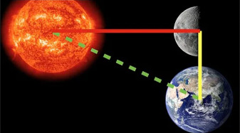
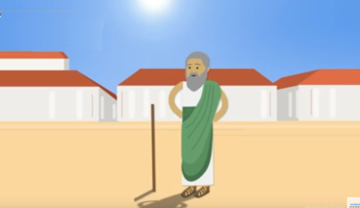
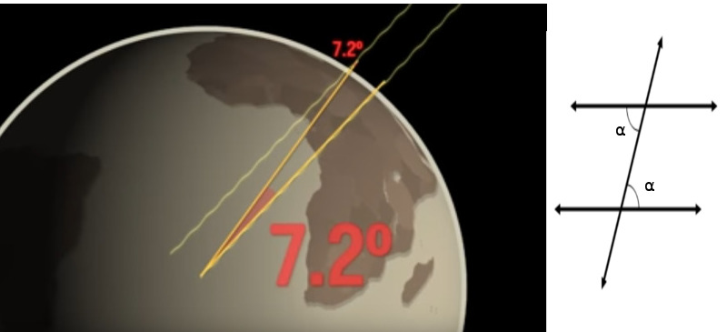
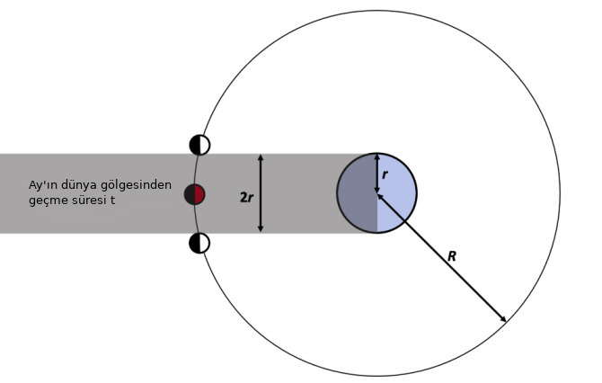

# Modern Bilim Öncesi Astronomi, Gezegenler, Yörüngeler

Dünya - Ay Mesafe Oranı

Aristarchus dünya-güneş ve dünya-ay mesafeleri arasında bir oran hesaplamayı
başardı [1]. Bunu yapmak için basit açılar kullanması yeterli oldu. Önce ayın
yarım ay fazına gelmesini bekledi,



Bu durumda güneş-ay-dünyanın birbirine belli bir şekilde duracağını biliyordu, ki
bu ilişki alttaki gibi çizilebilir,


Yani ortaya bir dik üçgen çıkmış oldu. Bulmak istediğimiz $S/L$ oranı. Açı
$\varphi$ dünyadaki aletlerle ölçülebilir, kabaca aya doğru kolumuzu dik
uzatırız, sonra döndürüp güneye doğru işaret ettik diyelim, bu geçişin açısı
$\varphi$ açısıdır. Bu açıyı Aristarchus 87 derece olarak ölçtü. Dünya-Güney-Ay
üçlüsünün o andaki yerlerinin bir dik üçgenin köşeleri (çünkü yarım ay fazından
bu böyle olmalı). O zaman $S/L$ oranı nasıl bulunur?  $\varphi$ için kosinüs
hesabı $L/S$ değil midir?  Evet. O zaman bilinen $\varphi$'ın kosinüsünü ters
çevirirsek, istediğimiz orana erişiriz, $S/L = 1/(L/S) = 1 / \cos\varphi$,

```python
print (1./np.cos(np.deg2rad(87)))
```

```
19.10732260929735
```

Yani güneş bize aydan yaklaşık 19 kat daha uzaktadır. Bunu sadece basit açılarla
hesaplayabilmiş olduk.

Dünyanın Yuvarlaklığı, ve Çevre Uzunluğu

Eratosten (Erotosthenes) MO 276 - MO 194 yıllarında yaşayan bilim adamıdır. Bir
gün birinden öğrendi ki yazın en uzun günü 21. Haziran'da daha güneyde olan
Syene şehrinde eğer yere bir çubuk dikilirse, saat 12'de çubuğun hiç gölgesi
olmuyor. Pitagor zamanından beri aslında dünyanın yuvarlak olabileceği
tahmin ediliyordu, Eratosten acaba aynı uzun yaz gününde daha kuzeyde olan
İskenderiye'de yere bir çubuk dikersem saat 12'de ne görürüm diye düşündü [2].

Bunu yaptı ve gördü ki ufak ta olsa bir gölge var. 



Sonra bu gölgenin sonuna kadar sopa basından doğru bir çizgi çekince, oluşan
açıya baktı,


Bu önemli bir bilgiydi çünkü şimdi gökyüzüne düşen güneş ışınlarını düşünelim,
ışın öyle düşüyor ki (ve dünya yuvarlaklığı sayesinde) o açı oluşmuş, 


Şimdi bu ışını düz uzatırsak, bir de sopanın yönünde direk bir çizgiyi direk
dünya merkezine çekersek, bir üçgen ortaya çıkar, bir diğer çizgiyi Syene
şehrinin sopasından direk dünya merkezine uzatırsak (bu çizgi direk merkeze
gider çünkü biliyoruz ki o anda oradaki sopanın gölgesi yok, güneş ışını direk
sopanın tepesine geliyor) ve ikinci bir üçgen oluşur, ve üstteki ile merkezdeki
açıların birbirine eşit olması gerekir (bkz alt sağdaki paralel çizgileri kesen
çizginin oluşturduğu ters $\alpha$ açılarının eşit olma durumu),



Böylece dünya merkezinden çıkan iki şehre doğru giden hayali iki çizginin
arasındaki açıyı bulmuş olduk. Bu açılar bize tüm 360 dereceye göre bir oran
verir. Eh eğer İskenderiye ve Syene arasındaki gerçek yeryüzü mesafesini
biliyorsak bu oranla o mesafeyi çarpınca tüm dünyanın çevre uzunluğunu elde
edebiliriz. Eratosten birine o mesafeyi ölçtürdü, kişi iki şehir arasında
yürüyerek bu ölçümü yaptı, bulduğu sonuç 5000 stadya, bugünkü ölçüyle yaklaşık
800 km, açılardan gelen oranla çarparsak,

```python
print ('%0.2f km' % (360 / 7.2 * 800.0))
```

```
40000.00 km
```

Bu iyi bir hesap, çünkü bugün daha kesin aletlerle yapılan ölçümlerin bulduğu
sonuç 40,075 kilometredir. 2000 sene önce sopalar, gölgeler, açılar ile bu bilim
adamı tüm dünyanın çevresini hesaplamış oldu.

Soru: Eski zamanda saat 12 nasıl bilinebilirdi? Cevap: Üstteki problem için,
İskenderiye bağlamında, en basit yöntem gün içinde gölgenin en küçük olduğu
zamana göre ölçümü kaydetmektir. 

Soru: Syene şehrinde 12'de hiç gölge olmaması raslantı mıdır? Cevap: Eratosten
için bir bakıma öyle, ama o şehirde gölge olmamasının bilimsel sebebi Syene'nin
ekvatora yakınlığı ve o sezonda dünya eksen eğiminin belli bir şekilde olması,
ki güneş ışınları bu sebeple o şehre tam direk geliyor.

Dünya - Ay Uzaklığı

Bu uzaklığı eski zamanlarda hesaplamayı başaran bilimci Aristrarchus, M.Ö. 270
tarihinde bunu başardı. Antik çağlarda tabii ki radar, lazer gibi araçlar yoktu
(modern ölçümler için bu teknikler kullanıldı). Faat Aristrarchus güzel bir
yol buldu, ay tutmasına baktı ve tutmanın başlaması ve bitiş arasındaki zamanı
ölçtü.

Bildiğimiz gibi ay tutması sırasında ay, güneşe kıyasla dünyanin öteki tarafına
düşer, iki boyutlu olarak durumu alttaki gibi gösterebiliriz,



Aristrarchus şöyle düşündü, $r$ çaplı dünya tutma sırasında ay üzerinde $2r$
genişliğinde bir gölge silindiri (yanda bakınca dikdörtgeni) yaratır [3]. Ay'ın
dünya etrafındaki yörüngesini çapı $R$ olan yaklaşık bir daire olarak
düşünebiliriz, o zaman tüm yörünge $2\pi R / T$ ki $T$ Ay'ın dünya etrafındaki
dönme süresi $T = 27.3$ gün, ya da $T = 655.2$ saat, ki bu bilgi en eski
çağlardan beri biliniyordu, basit bir gözlem çünkü.

O zaman ay'ın dünya gölgesinden gecerken ki ortalama hizi $2r / t$ ki $t$ ay
tutma zamani (3 saat 12 dakika). Ay hizini iki sekilde hesaplayabiliyoruz,
bunlari birbirine esitleyelim,

$$
\frac{2\pi R}{T} = \frac{2r}{t} \Rightarrow
\frac{\pi R}{T} = \frac{r}{t} \Rightarrow
R = \frac{r T}{\pi t}
$$

$t,T,r$ değerlerini yerine koyarsak, sırasıyla 3.2 saat, 655.2 saat ve yine eski
çağda bilinmekte olan dünya çapı 6371 kilometre,

```python
R = 6371 * 655.2 / 3.14*3.2
R, R*18/19
```

```
Out[1]: (4254042.496815287, 4030145.5232986924)
```

Gerçek değer 384,400 kilometredir, fakat eski çağlar için üstteki hesap fena
değil.

Eğer gölgenin dikdörtgen değil Ay'a doğru gittikçe azalan bir koni olduğunu
düşünürsek hesabı daha da azaltabilirdik, mesela güneşin dünyaya olan uzaklığına
oranlı bir şekilde, ki sağdaki rakam gerçek sayıya daha yakındır.

Güneşin Kütlesini Hesaplamak

Eğer güneşin kütlesini bilmiyor olsaydık, bu rakamı dünya kütlesi, yörünge çapı
hareket hızı ile hesaplayabilirdik. Bunun için dünyanin güneşe olan çekim
kuvvetini kullanmak gerekir. Bu kuvvet iki şekilde hesaplanabilir, biri
merkezcil kuvveti [3] kullanarak $m_d, v, r$ üzerinden, diğeri bilinen $F = G
m_d m_g / r^2$ formülü üzerinden. Kuvveti merkezcil formül ile hesaplayıp ikinci
formüle bilinen olarak dahil edersek bilinmeyen $m_g$ yani güneş kütlesi
hesaplanabilir. Yörünge çapı dünya, güneş uzaklığıdır, üstte gördük. Hareket
hızı yörünge uzunluğu bolu bir devir için geçen zaman, bu doğal olarak bir yıl,
yani 365 gün. Yani eski zamanlarda yaşıyor olsaydık güneş kütlesini bile
yaklaşık olarak hesaplayabilirdik.

Kaynaklar

[1] Wikipedia,
    [https://en.wikipedia.org/wiki/On_the_Sizes_and_Distances_(Aristarchus)](https://en.wikipedia.org/wiki/On_the_Sizes_and_Distances_(Aristarchus))

[2] Science Insider, *How The Ancient Greeks Proved Earth Wasn't Flat 2,200 Years Ago*,
    [https://youtu.be/EfZ2HZH5CkA](https://youtu.be/EfZ2HZH5CkA)

[3] *From the Earth to the Moon in 270 BC*,
    [https://physicsteacher.blog/2021/05/31/from-the-earth-to-the-moon-in-270-bc/](https://physicsteacher.blog/2021/05/31/from-the-earth-to-the-moon-in-270-bc/)
    
[4] Bayramlı, *Fizik 2*,
    


