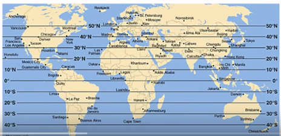
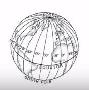
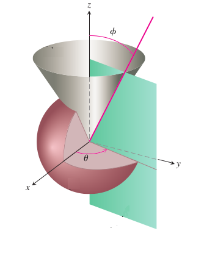
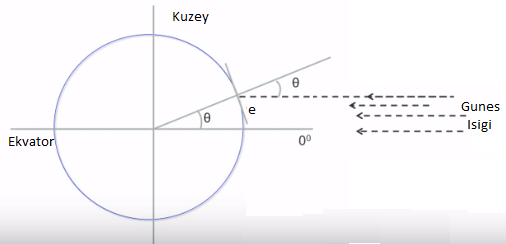
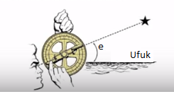
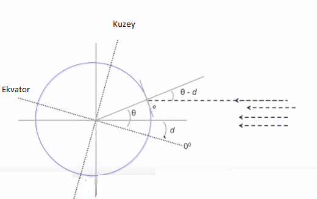
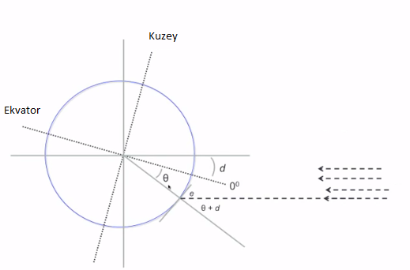
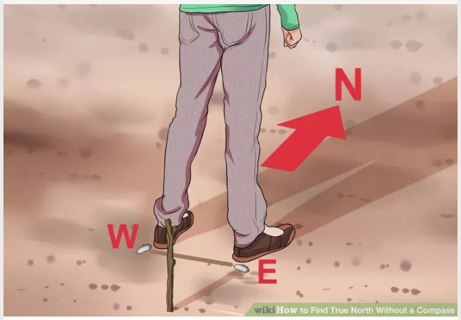
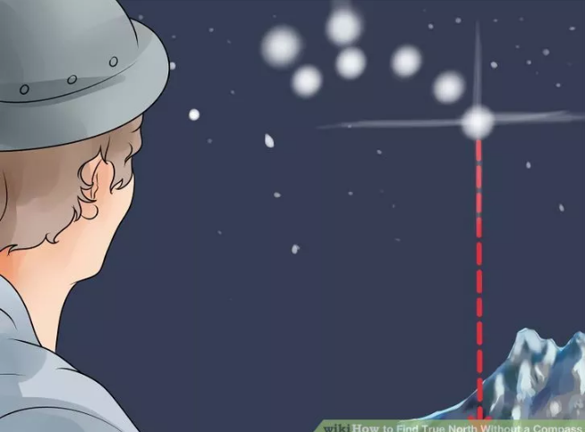
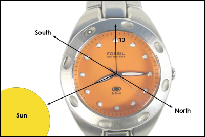

# Güneş ve Saat ile Dünya Kordinatımızı Bulmak

Cep telefonu, GPS gibi teknolojik ilerlemeler ile dünya üzerinde nerede
olduğumuzu bulmak artık çok kolay. Fakat bu teknolojiler olmadan da yerimizi
bulamaz mıyız? *The Last Ship* adlı bir diziyi seyrederken aklıma bu geldi,
dizi bir felaket senaryosu ardından kalan bir savaş gemisinde geçiyor, bir
bölümde bazı denizciler kaçırılır, gözleri bağlanıp bir yere tutsak
götürülür. Aralarındaki bir denizci öğlen vakti güneşe bakarak dünyadaki yerini
yaklaşıksal olarak hesaplamaya ugraşır. Bu hakikaten mümkün. Daha doğrusu enlem,
boylam hesabı içinden enlem hesabı güneşin açısına bakarak mümkün, boylam hesabı
başka bir şekilde. Ama önce kordinat sistemini görelim, ardından enlem, sonra
boylam.

Enlemler dünya üzerinde yatay çizili çizgiler olarak görülebilir,



Bu sistemde doğal sıfır noktası tam ortadan geçen ekvator (equator)
olacaktır. Boylam ise dikey kesilmiş dilimler olarak görülebilir,



Peki ölçü birimi olan açılar nereden geliyor? Açılar alttaki figür ile alakalı,



Yani $\phi$ enlem, $\theta$ ise boylam.

Güneşi kullanarak enlem ölçmek için güneş ışınlarının dünya ile nasıl bir açı
oluşturduğunu düşünmek lazım,



Bu şekle göre güneşin ufuk noktasına göre nerede olduğu bize $e$'yi
verecektir. Ölçümü yapan kişi teğet çizgi üzerinde duruyor tabii. Eski
denizcilerin kullandığı sekstant (sextant) adlı bir araç $e$'yi ölçebilir
(alttaki resimde görülüyor). Açıyı ölçmek için kolumu yere paralel de
tutabilirdim, sonra kaldırıp öğle vakti tam güneşe doğru tutunca, önceki
pozisyon ile aradaki açı, daha az kesin olsa da, bir açı ölçümü olabilir.

Bir diğer çözüm cep telefonlarındaki açı ölçüm programları (inclinometer app);
bu programlar telefonun yere olan açısını detaylı bir şekilde ölçebiliyorlar,
programı işletip telefonu güneşe tutmak yeterli!



Hesaba gelelim: iki üstteki resimde $\theta + e = 90^\circ$ olduğunu
görüyoruz. Ama bir pürüz daha var. İçinde olduğumuz mevsime göre dünyanın ekseni
değişebilir!



Bu durumda dünyanın eğimi $d$'yi (declination) göz önüne almak zorundayız. Yeni
açılara bakarsak, yeni formül

$$ e + (\theta - d) = 90 $$

olacak. Aynı eğimle, ama bu sefer güney yarımküre durumunda,



$$ e + \theta + d = 90^{\circ} $$

$$ \theta = 90^{\circ} - e - d $$

İyi haber şu, mevsimleri yaratan şey dünyanın eğimi olduğuna göre, içinde
olduğumuz mevsimden hareketle eğimi yaklaşık olarak hesaplayabiliriz. Hatta bir
formüle göre yılın kaçıncı gününde olduğumuzu direk $d$'ye çevirmek mümkün [2],
ki $N$ yılın başından bugüne geçmiş olan gün sayısı,

$$
d = -23.44^{\circ} \cdot \cos
\bigg[ \frac{360^{\circ}}{365} \cdot (N + 10) \bigg]
$$

```python
def decl(month, day):
    n = (month-1)*30. + day # yaklasik gun hesabi, her ayda 30 gun
    return -23.44 * np.cos( np.radians(360/365. * (n+10.)) )

print decl(9,20) # eylul 20
print decl(1,10) # ocak 10
```

```
1.51207805509
-22.0644779225
```

Soru

ABD'de Philadelphia'dayız, güneşin açısını 30 derece olarak ölçtük. Tarih Ocak
10, dünyanın eğimi $d=-22$. Philadelphia hangi enlemdedir?

Cevap

```python
e = 30; d = -22
print 'enlem', 90 - e + d, 'derece'
```

```
enlem 38 derece
```

Soru

Eylül ayında Miami'deyiz; öğlen vakti güneş 65 derecede. Enlem nedir?

Cevap

```python
e = 65; d = 1.5
print 'enlem', 90 - e + d, 'derece'
```

```
enlem 26.5 derece
```

Boylam

Boylamı bulmak için güneşin açısı yeterli değil; Bu problem aslında denizcileri,
bilimcileri çok uzun süre uğraştırdı, Galileo'dan, Newton'a kadar pek çok
kişinin zihnini kurcaladı. Bu konunun modern bilimin gelişmesi, Batı'nın
okyanusları keşfiyle paralel bir tarihi var. Boylam olmadan gemiler okyanusta
kayboluyorlardı, hatta pek çok denizci bu sebeple hayatını kaybetmiştir.

İlk başta bilimciler boylamı güneşe, sonra ay'a, sonra diğer gezegenlere bakarak
hesaplayabileceklerini düşündüler. Galileo Jüpiter'i baz alan bir metot buldu,
fakat icat ettiği alet gemilerde kullanılabilecek türden değildi. Pek çok diğer
bilimci denedi; Newton ölümüne dek bu işin gezegenler üzerinden çözülebileceğine
inandı. İngiliz hükümeti bu buluş için bir mükafat başlattı (Batı'ya kaybolmadan
seyahat karlı bir işti tabii), [3]'e göre bu mükafat devlet tarafından fonlanmış
ilk ciddi modern bilimsel araştırmadır.

Çözüm ilginç bir şekilde bir saat ustasından geldi. Gerçi saat bazlı boylam
hesabı yapılabileceğini pek çok kişi biliyordu, fakat denizcilerin yanında
götürebileceği geri kalmadan işleyen saat yapmak zor bir işti. John Harrison
bunu başardı. Saat ne işe yarar? Şöyle; eğer limandan ayrılmadan önce saati
çıkış şehri (mesela Londra) zamanına ayarlarsak, diyelim Jamaika'ya geldik,
oradaki yerel saate bakarız, en azından güneş en tepede olduğu zaman öğlen vakti
olduğunu biliriz, diğer yandan getirdiğimiz saat hala Londra zamanını
gösterecektir. Zaman dilimlerinde her dakika 1/4 derece anlamına gelir. Böylece
zaman dilimi farkından hareketle hangi boylamda olduğumuzu hesaplayabiliriz,
aradaki farkı dakika olarak 0.25 derece / dakika ile çarparız, ve boylamda kaç
derece ileri ya da geri gittiğimizi bulabiliriz.

Örnek

Doğu'ya seyahat ettik, yerel saat öğlen, yanımızdaki saat 4:17 diyor. Doğu'ya
gittiğimiz için Greenwich'ten ilerideyiz, aradaki fark 7 saat 43 dakika. Boylam
nedir?

```python
print ((7*60)+43) * 0.25, 'derece E (Dogu)'
```

```
115.75 derece E (Dogu)
```

Örnek

Kaptan Cook bir seyahatinde vardığı bir limanda şu hesabı yaptı; öğlen vaktiydi,
yanında getirdiği saat Londra için sabah 5:06 diyordu.

```python
print ((5*60)+6) * 0.25, 'derece W (Bati)'
```

```
76.5 derece W (Bati)
```

Cook ayrıca güneş eğimine bakarak 37.3 derece kuzeyde olduğunu da bulmuştu, yani
kordinatları $37.3^\circ N, 76.5^\circ E$.

Hangi Şehre Yakınız

Altta dünyanın tüm bilinen, büyük şehirlerini iceren bir CSV bazlı veri tabanını
kullanarak bu sehirlerden hangisine yakın olduğumuzu bulabilecek bir script
veriyoruz.

```python
import pandas as pd
import math

def distance(lat1, long1, lat2, long2):
    degrees_to_radians = math.pi/180.0
    phi1 = (90.0 - lat1)*degrees_to_radians
    phi2 = (90.0 - lat2)*degrees_to_radians
    theta1 = long1*degrees_to_radians
    theta2 = long2*degrees_to_radians
    cos = (math.sin(phi1)*math.sin(phi2)*math.cos(theta1 - theta2) + \
          math.cos(phi1)*math.cos(phi2)) 
    arc = math.acos( cos )
    return arc
    
def find_city(lat,lon):
    dist = df.apply(lambda x: distance(lat,lon,x['lat'],x['lng']), axis=1)
    return dist.argmin()

df = pd.read_csv('world_cities.csv',index_col=['city','country','province'])
df = df.drop(['city_ascii','pop'],axis=1)
print df[1000:1005]
print '\n', find_city(41.0082, 28.978) # bir test
```

```
                                     lat        lng iso2 iso3
city         country province                                
Itabuna      Brazil  Bahia    -14.789602 -39.280016   BR  BRA
Itamaraju    Brazil  Bahia    -17.039594 -39.529949   BR  BRA
Guanambi     Brazil  Bahia    -14.229585 -42.789983   BR  BRA
Porto Seguro Brazil  Bahia    -16.429606 -39.080028   BR  BRA
Valenca      Brazil  Bahia    -13.359612 -39.080028   BR  BRA

('Istanbul', 'Turkey', 'Istanbul')
```

Kaptan Cook hangi şehire yakındı? 

```python
print find_city(37.3, -76.5) # Bati, W eksi olarak gosteriliyor
```

```
('Hampton', 'United States of America', 'Virginia')
```

Cook ABD Virgina eyaletine gelmiş.

Saat ve boylam kullanarak dünyada çok detaylı yer bulunabilmesi keşif
mekanizmasını temelden değiştirdi. Diğer taraftan bakılırsa, mesela {\em
  1412} gibi kitaplarda iddia edilen "Çin (ya da diğer bir başka)
medeniyetin filanca kıtayı çok önceden keşfetmiş olduğu'' gibi fikirlerin
doğru olamayacağını anlıyoruz, çünkü bu medeniyetler global enlem ve boylam
bilmeden seyahat ediyorlardı, bu sebeple tüm dünyanın haritasını çıkaracak
durumda değildiler. Olsalar Çin'in hemen dibindeki Avustralya'yı kolonize
etmiş olması gerekirdi, onun yerine İngiltere saatli yöntemi sayesinde
oraya geldi, oranın bir kıta olduğunu anladılar, o kıtanın keşfi bu
oldu. Herkes muhakkak tarihinde cevher görmek ister (ya da bir başkasınin
tarihine meraklı olan egzotik farklılıklar arar), fakat gerçekleri fazla
çarpıtmamak gerekir. 

Peki saat bazlı sistem öncesi ne kullanılıyordu? Pusula bazlı hesabı
seyrüsefer (dead-reckoning) tekniği, belli bir yönde kabaca ne kadar
seyahat edildiğinden hareketle başlangıç noktasından gelinen yer
bulunuyordu, mesela "kuzey yönünde 10 kilometre gittim, sonra doğu yönünde
5 kilometre'' gibi.. Fakat bu tekniğin yanlış hesaplara, kaybolmaya çok
açık olduğu bilinmektedir, ve bir global teknik bulunur bulunmaz o
kullanılmaya başlanmıştır.

Pusula Olmadan Yön Bulmak

Pusulasız doğu, batı gibi yönleri nasıl buluruz? Birinci yöntem [4] gündüz
zamanı güneş, gölge kullanıp biraz zaman tutarak yapmak. Yere bir çubuk takın,
gölgesinin nereye gösterdiğini işaretleyin, sonra 15 dakika bekleyin, gölge uç
noktayı bir daha işaretleyin. Güneş doğudan doğup batıdan battığı için sağdaki
(E) gölgesi soldaki (W) gölgesine geçmiş olmalı, bu hayali çizgiyi arkanıza
alırsanız baktığınız yön kuzey (N) yönü olmalı.



İkinci yöntem gece zamanı, alttaki yıldız düzenini bulun, 


Bu yıldız kümelerinden sağda olanının uç noktası sağa doğru uzanır. Bu uzantının
geldiği son noktadan dünyaya doğru düz bir çizgi çekin, bu kuzey yönüdür. 



Üçüncü yöntem gündüz zamanı saat öğlen 12:00'de güneşin yerden direk yukarı
gidecek şekilde (ve eğim tabii ki 90 dereceden az olacak şekilde) hangi
yönde olduğuna bakmak, o yön eğer kuzey yarımkürede isek güneye işaret
eder, eğer güney yarımkürede isek kuzey yönüne işaret eder. 

Eger saat 12:00 degil ise alttaki kol saati yontemi ise yarar. 



Saatin ufak kolunun (tabii saat doğru zamanı göstermeli) güneşe doğru
durduğu durumu düşünürsek, o kolun ve büyük kolun oluşturduğu açıyi hayal
ederiz ve bu açının tam ortasından çıkan bir çizgiyi düşünelim, bu çizgi
kuzey yarımkürede güneye doğru işaret eder [5]. 


Kaynaklar

[1] Vaughen, *Determining Latitude and Longitude from the Sun*, [https://www.youtube.com/watch?v=ircLt-qvl3M](https://www.youtube.com/watch?v=ircLt-qvl3M)

[2] Wikipedia, *Position of the Sun*, [https://en.wikipedia.org/wiki/Position_of_the_Sun](https://en.wikipedia.org/wiki/Position_of_the_Sun)

[3] Sobel, *Longitude*

[4] Wikihow, *How to Find True North Without a Compass*, [http://www.wikihow.com/Find-True-North-Without-a-Compass](http://www.wikihow.com/Find-True-North-Without-a-Compass)

[5] HowStuffWorks, *How to Find True North*, [https://adventure.howstuffworks.com/survival/wilderness/true-north2.htm](https://adventure.howstuffworks.com/survival/wilderness/true-north2.htm)


