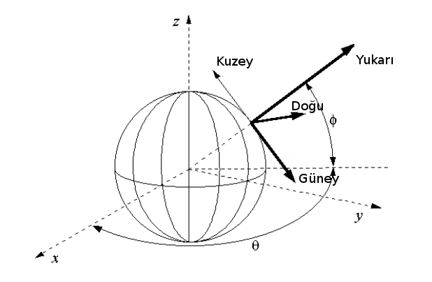
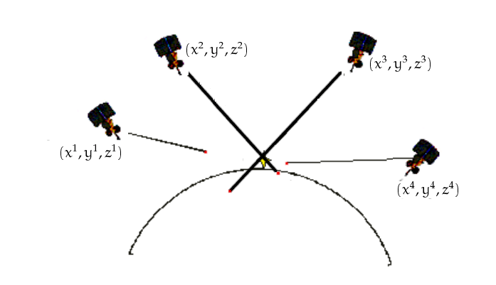
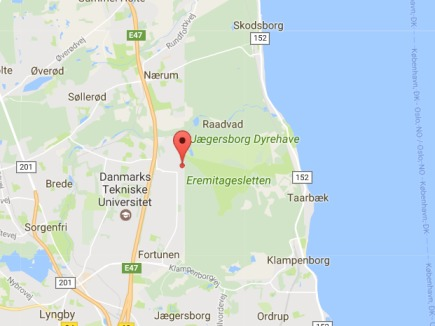

# GPS, Kullanıcı Yerini Bulmak, GPS Uydularına Olan Açı, Uzaklık

Küresel Konumlama Sistemi (Global Positioning System -GPS-) ile dünyada
nerede olduğumuzu kolay bir şekilde bulabiliyoruz. GPS'in temelinde eldeki
bir alıcının dünya etrafında sürekli dönen uydulara olan mesafesini ölçerek
bunlara göre bir konumlama yapması yatıyor. Eldeki alıcı, ki artık ucuz bir
akıllı telefon bile olabiliyor, önce Almanak denen bir bilgiyi (eğer o anda
elde yoksa) uydudan alıyor. Bu bilgi tüm GPS uydularının kesin yerlerini
alıcıya söyler. Ardından uydu ve alıcı arasında sinyallerin alınıp
verilmesindeki zaman farkına bakılarak olabildiğince detaylı bir mesafe
bilgisi alınır. Eğer en az 4 tane uyduya olan mesafe bu şekilde
alınabiliyorsa bir üçgenleme yapılarak alıcının yeryüzündeki yeri
saptanabilir. Uydular her biri yeterince büyük bir bölgeye servis edebilsin
diye çok uzaktaki bir yörüngededirler, dünyaya ortalama mesafeleri 20,000
kilometre (evet, yirmi bin), kıyasla ISS uzay istasyonu yaklaşık 200
km. mesafede.


Bu yazıda mesafeleri kullanıp nerede olduğumuz konusuna girmeden eğer
nerede olduğumuz biliniyor olsa uyduya olan yatay açı / azimut (azimuth) ve
yüksekliği (elevation) nasıl buluruz konusunu işleyeceğiz.

Azimut nedir? Yeryüzünde duruyoruz, yüzümüzü kuzeye dönelim, bu referans
duruşu. Eğer mesela azimut 320 derece ise, doğuya doğru o kadar döneriz (ya
da batıya 360-320 kadar dönebiliriz), ve başımızı yukarı doğru yükseklik
açısı kadar kaldırırız, mesela 60 derece yukarı doğru, ki 90 derece tam dik
yukarı bakıyoruz demektir. Aşağı yukarı alttaki resimdeki gibi bir durum
olur,


Üstteki türden bir gösterim kullanıcı merkezlidir. GPS uyduları, hatta
kullanıcının yerini dünyayı merkez alan, daha net şekilde belirtmek
gerekirse dünyanın merkezini merkez alan (orası orijin sayılıyor, (0,0,0)
noktası) sisteminde almak daha kullanışlı oluyor.


Bu sisteme ECI sistemi, ya da ECEF kordinatları deniyor. Tabii mesela
kilometre bağlamında mesela (1,1,1) noktası anlamsız olabilir, dünyanın
"içinde'', yerkabuğunun altında bir nokta olacaktır, fakat dünya yüzeyi,
ve yüzeyden daha üstteki uydular için anlamlı ve kullanışlı bir
sistem. Daha önemlisi bu sistem Kartezyen geometrisi kullanmamıza izin
verecek, ve daha ileride göreceğimiz gibi uzaklık hesaplarında faydalı
olacak. ECI ve alıcı bazlı kordinat sistemlerini aynı resimde görelim,



Hesabın detayları [3]'te bulunabilir. Dünyanın duruşunun hesabı için yıldız
günü (sidereal day) kavramı gerekli. Bilinen gün hesabı güneşin aynı
boylamdan iki geçişi arasındaki zamandır. Öğlen 12'de güneş yukarıdadır,
güneşin tekrar aynı noktada olduğu zaman bir gün geçmiş demektir. Fakat
astronomi hesapları için etrafında döndüğümüz güneş değil, daha uzaktaki
bir noktayı merkez almak gerekebiliyor, bu daha uzaktaki noktanın aynı
boylamın üzerinden iki geçişi arasındaki zaman bir yıldız günüdür. Normal
gün ile yıldız günü arasında 4 dakikalık bir fark var. Yıldız günü ve
ayrıca tek reel sayı bazlı tarih kullanabilmek için için Jülyen Tarihi
kullanılır, bu tarih bir referans başlangıç anından mevcut ana olan gün
sayısıdır. Altta bazı ölçümler aldığımız zamanı milisaniye olarak
kaydettik, onun Jülyen çevrimi alttaki gibi hesaplanıyor,

```python
import orbital
from datetime import datetime
millis = 1493036068479
dt = datetime.fromtimestamp(millis/1000.0)
dtj = orbital.jdays(datetime.fromtimestamp(millis/1000.0))
print dtj
```

```
2457868.09339
```

Azimut, yükseklik hesapları ölçüm aldığımız an için [1]'den uyduların
nerede olduğunu bir dosyaya kaydettik. GPS uydularının PRN kodları vardır,
örnek seçilen PRN 11,18,16,24,31 uydularının enlem / boylam pozisyonları
altta,

```python
import pandas as pd

df = pd.read_csv('Waas_Sv_Status.txt',sep='\s*',index_col=0)
sats = [11,18,16,24,31]
df = df.ix[sats]
print df[['Lat','Long']]
```

```
           Lat        Long
PRN                       
11   30.518234 -164.259351
18    1.027207  -57.092297
16  -55.533692 -122.123140
24   45.299193   17.625305
31   13.344068 -102.581100
```

Ölçüm alınan yerin kordinatları altta `lat,lon`  içinde. Şimdi bu
noktadan bakılacak olsa (Berlin'deyiz) uyduların hangi azimut, yükseklikte
olacağının hesabını yapalım,

```python
lon = 13.442383333333332
lat = 52.483086666666665
alt = 0
sat_alt = 20*1000*1000
print df.apply(lambda x: orbital.get_observer_look(x.Long, \
               x.Lat, sat_alt, dt, lon, lat, alt),axis=1)
```

```
PRN
11     (358.005492414, -6.99245765159, 20007166.964)
18        (254.95693367, 12.52250143, 20004991.9173)
16    (245.378821316, -64.1703023622, 20012088.4789)
24     (157.451172143, 82.3085240779, 20000057.3405)
31    (298.723320912, -4.42938085218, 20006877.4437)
dtype: object
```

[2]'den tüm uyduların o anda dünya üzerinde nerede olduğuna baktık,


Peki bu hesapları mesela cep telefonunun aldığı azimut, yükseklik ile
karşılaştırsak ne görürüz? 


Telefonun raporladığı rakamlar uydu ve alıcı pozisyonuna göre değil, antene
ve sinyale göre hesaplanıyor, GPS kitlemesi yapılmadan da bu değerleri bir
GPS programında [7] görebiliyoruz. 11,31,24 fena durmuyor, fakat 18 tam
ters yönde çıkmış. Telefondaki ölçümlere tam güvenilir diyemeyiz. Zihin
egzersizi: acaba elde yeteri kadar azimut, yükseklik ölçümü olsa ve uydu
pozisyonu ile birleştirince üstteki hesapta geriye doğru giderek bir alıcı
pozisyonu elde edilebilir mi? İstatistiki bir yaklaşım belki bunu
yapabilir. Ödev olsun!

Tüm kodlar

```python
from datetime import datetime
import numpy as np, math

F = 1 / 298.257223563 # Dunya duzlestirme WGS-84
MFACTOR = 7.292115E-5 
EPS_COS = 1.5e-12
F = 1 / 298.257223563  # Dunya duzlestirme WGS-84
A = 6378.137  # WGS84 ekvotarsal cap
a = 6378137.0 # tekrar
# yari minor eksen uzunlugu (m)
b = 6356752.3142
# elipsoid duzluk (birimsiz)
f = (a - b) / a
# eksentriklik (birimsiz)
e = np.sqrt(f * (2 - f))

def jdays2000(utc_time):
    return _days(utc_time - datetime(2000, 1, 1, 12, 0))
    
def jdays(utc_time):
    return jdays2000(utc_time) + 2451545

def _fdays(dt):
    return (dt.days + (dt.seconds + \
            dt.microseconds / (1000000.0)) / (24 * 3600.0))

_vdays = np.vectorize(_fdays)

def _days(dt):
    return _fdays(dt)

def gmst(utc_time):
    ut1 = jdays2000(utc_time) / 36525.0
    theta = 67310.54841 + ut1 * (876600 * 3600 + 8640184.812866 + ut1 *
                                 (0.093104 - ut1 * 6.2 * 10e-6))
    return np.deg2rad(theta / 240.0) % (2 * np.pi)    

def observer_position(time, lon, lat, alt):
    lon = np.deg2rad(lon)
    lat = np.deg2rad(lat)    
    theta = (gmst(time) + lon) % (2 * np.pi)
    c = 1 / np.sqrt(1 + F * (F - 2) * np.sin(lat)**2)
    sq = c * (1 - F)**2
    achcp = (A * c + alt) * np.cos(lat)
    x = achcp * np.cos(theta)  # kilometers
    y = achcp * np.sin(theta)
    z = (A * sq + alt) * np.sin(lat)
    vx = -MFACTOR*y  # kilometers/second
    vy = MFACTOR*x
    vz = 0
    return (x, y, z), (vx, vy, vz)   

def get_observer_look(sat_lon, sat_lat, sat_alt, utc_time, lon, lat, alt):
    (pos_x, pos_y, pos_z), (vel_x, vel_y, vel_z) = \
        observer_position(utc_time, sat_lon, sat_lat, sat_alt)

    (opos_x, opos_y, opos_z), (ovel_x, ovel_y, ovel_z) = \
        observer_position(utc_time, lon, lat, alt)

    lon = np.deg2rad(lon)
    lat = np.deg2rad(lat)

    theta = (gmst(utc_time) + lon) % (2 * np.pi)

    rx = pos_x - opos_x
    ry = pos_y - opos_y
    rz = pos_z - opos_z

    sin_lat = np.sin(lat)
    cos_lat = np.cos(lat)
    sin_theta = np.sin(theta)
    cos_theta = np.cos(theta)

    top_s = sin_lat * cos_theta * rx + \
        sin_lat * sin_theta * ry - cos_lat * rz
    top_e = -sin_theta * rx + cos_theta * ry
    top_z = cos_lat * cos_theta * rx + \
        cos_lat * sin_theta * ry + sin_lat * rz
    r = np.sqrt(top_s**2+top_e**2+top_z**2)
    az_ = np.arctan(-top_e / top_s)

    az_ = np.where(top_s > 0, az_ + np.pi, az_)
    az_ = np.where(az_ < 0, az_ + 2 * np.pi, az_)

    rg_ = np.sqrt(rx * rx + ry * ry + rz * rz)
    el_ = np.arcsin(top_z / rg_)

    return np.rad2deg(az_), np.rad2deg(el_), r

def ecef2lla(ecef, tolerance=1e-9):
    x = ecef[0]
    y = ecef[1]
    z = ecef[2]
    lon = math.atan2(y, x)
    alt = 0
    N = a
    p = np.sqrt(x**2 + y**2)
    lat = 0
    previousLat = 90
    while abs(lat - previousLat) >= tolerance:
        previousLat = lat
        sinLat = z / (N * (1 - e**2) + alt)
        lat = math.atan((z + e**2 * N * sinLat) / p)
        N = a / np.sqrt(1 - (e * sinLat)**2)
        alt = p / math.cos(lat) - N
    return (np.rad2deg(lat), np.rad2deg(lon), alt)
```

Uzaklıktan Kullanıcı Pozisyonunu Bulmak

Aynı zamanda bir GPS alıcısı olan akıllı cep telefonları GPS uydularına
olan mesafeyi hesaplayabilir. Bunu uydudan gönderilen sinyallerin erişim
süresini hesaplayarak yaparlar. Uydulardan gelen her sinyal içinde o
sinyalin gönderilme anı vardır, alıcı bu zamana bakar, ve kendi elindeki
saate bakar ve aradaki farkı sinyalin hızı ile çarparak mesafeyi
bulur. Birden fazla yeri bilinen uyduya olan mesafelerin kesişme noktası
alıcının olduğu yerdir. 


Yanlız bu hesap yapılırken iki potansiyel problem ortaya çıkar. 

Birinci problem alıcıdaki saat yanlılık problemi (clock bias). GPS sinyali
yerine ses dalgası temelli bir örnek üzerinde bu kavramı anlatalım:
Denizcilikte sis sireni (foghorn) denen bir şey var, sisli durumlarda
gemicileri yakında tehlikeli kayalar hakkında uyarmak için
kullanılır. Şimdi diyelim ki sis sirenini yerimizi bulmak için
kullanacağız. Yine basitleştirme amaçlı olarak tek boyutlu bir dünya
düşünelim, bir çizgi üzerindeyiz, bu çizgide ya sola ya da sağa
gidebiliyoruz, sis sireni ise çizginin sıfır noktasında.


Sis sireninin her gün öğlen 12:00'de çalındığını biliyoruz. Diyelim ki
saat 12:00:10 (yani 10 saniye sonra) sireni duyduk. Üstteki çizgide
neredeyiz? Ses hızı 330 metre / saniye, o zaman 10 saniye sonra 3.3
kilometre uzaktayız. 

Fakat bu hesap eğer saatimiz mükemmel bir şekilde siren saati ile
senkronize ise geçerli. Uzaktan bu senkronizasyon var mı yok mu
bilemiyoruz, çünkü sireni duyduğumuzda saate baktık acaba önceden 5 saniye
geri miydik de 15 saniye sonra gelen sireni acaba 12:00:10'da gördük?  Ya
da senkronizasyon haricinde belki saatimiz daha yavaş, ya da daha hızlı
işliyor, ses havada seyahat ederken bu hızlanma / yavaşlama ölçüme etki
etti?

Bu problemden kurtulmak için elimizdeki saatin yanlılığını denklemlerde
direk kullanarak onu da hesaplamak bir çözüm olabilir. Yanlılığı
modelleyebiliyoruz çünkü sis sirenleri birbirleri ile mükemmel şekilde
senkronize (GPS uyduları için de bu böyle, uydularda birbirleri ile
senkronize atomik saatler var), ve bizim saatimizde yanlılık varsa bu
yanlılık her iki siren için aynı. Yani yanlışlık olması önemli değil,
yanlışlık tutarlı ise ondan kurtulabiliriz!

Yanlılık ikinci bir bilinmeyen tabii, o zaman ikinci bir ölçüm
lazım. Diyelim ki birinci sirenden 990 m. sağda olan ikinci bir sirenden
saat 12:00:09'da bir sinyal aldık.


Şimdi nerede olduğumuzu bulabilir miyiz?  Uzaklık, daha doğrusu içinde
yanlılık ta olduğu için, "sözde uzaklık (pseudorange)'' şöyle modellenir,

$$ R_1' = v_{ses} (\Delta t_1 + \tau ) = x + v_{ses}\tau = 3300 $$

$$ R_2' = v_{ses} (\Delta t_2 + \tau ) = 990 - x + \tau = 2970$$

ki $\Delta t_1, \Delta t_2$ geçen zaman, $\tau$ yanlılık, $v_{ses}$ ses
hızı. Tekrar düzenlersek, 

$$ x + v_{ses} \tau = 3300$$

$$ x - v_{ses} \tau = -1980  $$

Çözersek, 

$$ \tau = 8 \textrm{ saniye} \quad x = 660 \textrm{ metre}$$

Yanlılık hesabı böyle. Şimdi ikinci probleme gelelim. Bu problem kesişme
hesabı sırasında ortaya çıkıyor. Yanlılık doğru modellense bile diğer pek
çok sebepten dolayı uzaklık hesabında eksikler olabilir. O zaman mükemmel
kesişme yerine alttaki gibi durum ortaya çıkabilir,



1. uydu uzaklığı normalden kısa, 2. ve 3. uzun gelmiş. Acaba bu
uzaklıkların gürültülü bir ortamda olsak bile kesiştiği yeri yaklaşık bir
şekilde bulamaz mıyız? Hatta sistemi öyle kuralım ki ne kadar çok uydu
ölçümü eklersek ölçüm o kadar ilerlesin, yani bir tür istatistiksel en az
kareler (least squares) çözümü arıyoruz.

Fakat yine bir problem var, alıcı $x,y,z$ pozisyonu ve uydu $i$ arasındaki
sözde mesafe, $P^i$ diyelim, gayrı-lineer bir hesap.

$$ 
P^i = \sqrt{ \big( (x^i-x)^2 + (y^i-y)^2 + (z^i-z)^2  \big) } + \tau
$$

Hesapta kareler, onların toplamı, karekök işlemi var. Üstteki denklemi, ve
bu denklemi kullanacağımız denklem sistemini bir şekilde lineerleştirmemiz
lazım.

Her sözde uzaklık ölçümünü üstteki model artı gürültü olarak gösterelim,

$$ P_{\textrm{gözlem}} = p_{model} + \textrm{gürültü} $$

$$ = P(x,y,z,\tau) + v $$

Şimdi model üzerinde çok boyutlu Taylor açılımı uygulayalım, 

$$ 
P(x,y,z,\tau) = P(x_0,y_0,z_0,\tau_0) + 
(x-x_0)\frac{\partial P}{\partial x} + 
(y-y_0)\frac{\partial P}{\partial y} + 
(z-z_0)\frac{\partial P}{\partial z} + 
(\tau-\tau_0)\frac{\partial P}{\partial \tau}  + ...
$$

Bu açılımda noktalı yerlerde daha yüksek üstelli terimler var, onları
atalım, geri kalanlar lineer terimler, ve atılan terimler sebebiyle açılım
yaklaşıksal olacak doğal olarak. Taylor açılımını $x_0,y_0,z_0,\tau_0$
noktası "etrafında'' yaptık, şimdi $P(x_0,y_0,z_0,\tau_0)$'e $P_{hesap}$
diyelim, bunun sebebini birazdan göreceğiz, ve tüm denklem şu hale gelir,

$$ 
= P_{hesap} + \frac{\partial P}{\partial x} \Delta x + 
\frac{\partial P}{\partial y} \Delta y + 
\frac{\partial P}{\partial z} \Delta z + 
\frac{\partial P}{\partial \tau} \Delta \tau 
$$

Şimdi

$$ \Delta P \equiv P_{\textrm{gözlem}} - P_{hesap} $$

diyelim, ve

$$ 
= \frac{\partial P}{\partial x} \Delta x + 
\frac{\partial P}{\partial y} \Delta y + 
\frac{\partial P}{\partial z} \Delta z + 
\frac{\partial P}{\partial \tau} \Delta \tau 
+ v
$$

Matris formunda yazarsak, 

$$ 
\Delta P = \left[\begin{array}{cccc}
\dfrac{\partial P}{\partial x} \Delta x & 
\dfrac{\partial P}{\partial y} \Delta y & 
\dfrac{\partial P}{\partial z} \Delta z & 
\dfrac{\partial P}{\partial \tau} \Delta \tau
\end{array}\right]
\left[\begin{array}{c}
\Delta x \\ \Delta y \\ \Delta z \\ \Delta \tau 
\end{array}\right] + v
$$

Üstteki tek bir ölçüm için. Her uydudan gelen ölçüm matriste yeni bir satır
oluşturur, $m$ tane ölçüm için,

$$ 
\begin{bmatrix}
\Delta P^1 \\[1ex]
\Delta P^2 \\[1ex] 
\Delta P^3 \\[1ex] 
\vdots \\[1ex]
\Delta P^m 
\end{bmatrix}
= 
\begin{bmatrix}
\dfrac{\partial P^1}{\partial x} & 
\dfrac{\partial P^1}{\partial y} & 
\dfrac{\partial P^1}{\partial z} & 
\dfrac{\partial P^1}{\partial \tau}
\\[2ex]
\dfrac{\partial P^2}{\partial x} & 
\dfrac{\partial P^2}{\partial y} & 
\dfrac{\partial P^2}{\partial z} & 
\dfrac{\partial P^2}{\partial \tau}
\\[2ex]
\dfrac{\partial P^3}{\partial x} & 
\dfrac{\partial P^3}{\partial y} & 
\dfrac{\partial P^3}{\partial z} & 
\dfrac{\partial P^3}{\partial \tau} 
\\[2ex]
\vdots & \vdots & \vdots & \vdots \\[2ex]
\dfrac{\partial P^m}{\partial x} & 
\dfrac{\partial P^m}{\partial y} & 
\dfrac{\partial P^m}{\partial z} & 
\dfrac{\partial P^m}{\partial \tau} 
\end{bmatrix} 
\begin{bmatrix}
\Delta x \\[1ex]
\Delta y \\[1ex] 
\Delta z \\[1ex] 
\Delta \tau
\end{bmatrix} + 
\begin{bmatrix}
v_1 \\[1ex]
v_2 \\[1ex] 
v_2 \\[1ex] 
\vdots \\[1ex] 
v_m
\end{bmatrix}
$$

Bu sistemi bir $b = Ax + v$ lineer sistemi olarak görebiliriz, ki en az
kareler yöntemi sistemi çözer. $A$ matrisinin içeriği için kısmi türevlerin
alınması lazım, bu türevler, mesela $P^1$ ve $x$ için 

$$ 
\frac{\partial P^1}{\partial x} = 
\frac{x^1-x}{\sqrt{ \big( (x^1-x)^2 + (y^1-y)^2 + (z^1-z)^2  \big) }} = \frac{x^1-x}{\rho}
$$

Tüm ölçümler ve değişkenler için yapalım,

$$ 
A = \left[\begin{array}{cccc}
\dfrac{x^1 - x}{\rho} & \dfrac{y^1 - y}{\rho} & \dfrac{z^1 - z}{\rho} & 1 \\
\dfrac{x^2 - x}{\rho} & \dfrac{y^2 - y}{\rho} & \dfrac{z^2 - z}{\rho} & 1 \\
\dfrac{x^3 - x}{\rho} & \dfrac{y^3 - y}{\rho} & \dfrac{z^3 - z}{\rho} & 1 \\
\vdots & \vdots & \vdots & \vdots \\
\dfrac{x^m - x}{\rho} & \dfrac{y^m - y}{\rho} & \dfrac{z^m - z}{\rho} & 1 
\end{array}\right]
$$

Böylece bir $b = Ax + v$ sistemi elde ettik, $\Delta$ değişkenleri
bilinmeyen, $A$'yı üstte kurduk, standart en az kareler uygulayınca $v$'yi
minimize eden bilinmeyenler bulunacaktır.

Şimdi çözülenin ne olduğuna dikkat, çözümler $\Delta$ değişkenleri, yani
$x_0,y_0,z_0,\tau_0$ noktası ile olan *fark*. Şimdi, bir de Taylor
açılımlarının püf noktasını hatırlayalım, bu açılımlar açılım noktası
etrafında, yakınında geçerlidir. O zaman nihai çözüme bir döngü içinde
erişmek gerekecek, yavaş yavaş, bir önceki çözüme ekleye ekleye. Herhangi
bir başlangıç noktası mesela dünyanın merkezi ve sıfır yanlılık
$x_0,y_0,z_0,\tau_0 = (0,0,0,0)$ ile başlarız, $\Delta$'ları hesaplarız, ve
başlangıca ekleriz, bunlar yeni "başlangıç'' noktası olur, hesabı
tekrarlarız, ve farklar çok ufak oluncaya kadar (çözüme yaklaştık) bunu
tekrar ederiz.

Başlangıç noktasını referans alıp ekleme yaparak hesabın bir ek faydası
var; mesela cep telefonu ile yürüme durumunda bir yeri hesapladıktan /
kitledikten sonra bir sonraki yer hesabı için tekrar dünya merkezini
başlangıç almamıza gerek yok, en son kitlenen yeri başlangıç kabul ederiz,
ve büyük ihtimalle tek bir ek hesap ile yeni konumu hesaplayabiliriz.

```python
import matplotlib.pyplot as plt
import scipy.linalg as lin

xtrue = [3507884.948, 780492.718, 5251780.403, 0]

xxyyzz = [[16577402.072, 5640460.750, 20151933.185],
	  [11793840.229, -10611621.371, 21372809.480],
	  [20141014.004, -17040472.264, 2512131.115],
	  [22622494.101, -4288365.463, 13137555.567],
	  [12867750.433, 15820032.908, 16952442.746],
	  [-3189257.131, -17447568.373, 20051400.790],
	  [-7437756.358, 13957664.984, 21692377.935]]

xxyyzz = np.array(xxyyzz)

pseudorange = np.array([20432524.0, 21434024.4, 24556171.0, 
                        21315100.2, 21255217.0, 24441547.2, 23768678.3])

```

Üstte örnek ölçümler görüyoruz. [6]'daki araştırmacı Danimarka'da bir ölçüm
merkezinde GPS aletinden 7 tane GPS uydusuna olan sözde uzaklığı ve bu
uyduların o anki yerlerini kaydetmiş, bu kişi acaba nerededir? Tarif edilen
yaklaşım ile hesaplayalım,

```python
xx = xxyyzz[:,0]
yy = xxyyzz[:,1]
zz = xxyyzz[:,2]
x = [0, 0, 0, 0]
A = np.ones((len(xxyyzz),4))
for iter in range(20):
    rng = np.sqrt((x[0]-xx)**2+(x[1]-yy)**2+(x[2]-zz)**2);
    F = rng + x[3]
    irange = 1/rng;
    A[:,0] = irange*(x[0]-xx)
    A[:,1] = irange*(x[1]-yy);
    A[:,2] = irange*(x[2]-zz);
    c = np.dot(A.T,pseudorange-F)
    N = np.dot(A.T,A)
    deltahat = lin.solve(N,c)
    x = x+deltahat
    if np.max(np.abs(deltahat))<0.001: break

print 'iter', iter
print np.reshape(x, (4,1))
```

```
iter 4
[[ 3507889.12958827]
 [  780490.02116445]
 [ 5251783.75537277]
 [   25511.14592576]]
```

Döngü beş kez tekrarladı ama dünya merkezinden başlamış olmamıza rağmen
sonuca çabukça erişti. ECEF sisteminden enlem / boylam çevirimini yapalım,

```python
import orbital
print orbital.ecef2lla(x)
```

```
(55.796250049381591, 12.543735075055356, 73.165498103015125)
```

Bu kordinatları bir harita uygulamasından kontrol ettik; yazar Danimarka'da
teknik üniversite yakınlarında imiş. Zaten [6] gerçek yerini de paylaşmış,
üstteki çözüme çok yakın. Sistem işliyor demektir.



GPS uydu uzaklıklarını baz alarak konum hesabı niye faydalı? Cep
telefonları zaten enlem / boylam raporlamıyor mu? Bu doğru, fakat farklı
mobil uygulamaları farklı şekilde bu hesabı yapmayı, hızlandırmayı
seçebilirler. Bu ihtiyaçtan dolayı olmalı Android işletim sistemi
tasarlayıcıları 7.0 (Nougat), API 24'ten itibaren ham uzaklık verisini bir
arayüz ile geliştiricilere açmaya karar verdi.

Kaynaklar 

[1] Federal Aviation Administration, *Uydu Pozisyonları*, [http://www.nstb.tc.faa.gov/incoming/Waas_Sv_Status.txt](http://www.nstb.tc.faa.gov/incoming/Waas_Sv_Status.txt)

[2] Federal Aviation Administration, *WAAS Satellite Status*, [http://www.nstb.tc.faa.gov/RT_WaasSatelliteStatus.htm](http://www.nstb.tc.faa.gov/RT_WaasSatelliteStatus.htm)

[3] Kelso, *Orbital Coordinate Systems, Part II*, [http://celestrak.com/columns/v02n02/](http://celestrak.com/columns/v02n02/)

[4] Raspaud, *PyOrbital*, [https://github.com/pytroll/pyorbital](https://github.com/pytroll/pyorbital)

[5] Blewitt, *Basics of the GPS Technique: Observation Equations*,  [http://www.nbmg.unr.edu/staff/pdfs/Blewitt%20Basics%20of%20gps.pdf](http://www.nbmg.unr.edu/staff/pdfs/Blewitt%20Basics%20of%20gps.pdf)

[6] Nielsen, *Least Squares Adjustment: Linear and Nonlinear Weighted Regression Analysis*, [http://www2.imm.dtu.dk/pubdb/views/edoc_download.php/2804/pdf/imm2804.pdf](http://www2.imm.dtu.dk/pubdb/views/edoc_download.php/2804/pdf/imm2804.pdf)

[7] Chartcross Limited, *GPS Test*, [https://play.google.com/store/apps/details?id=com.chartcross.gpstest](https://play.google.com/store/apps/details?id=com.chartcross.gpstest)

[8] Raquet, *Calculation of GPS PNT Solution*, [http://indico.ictp.it/event/a12180/session/21/contribution/12/material/0/0.pdf](http://indico.ictp.it/event/a12180/session/21/contribution/12/material/0/0.pdf)


