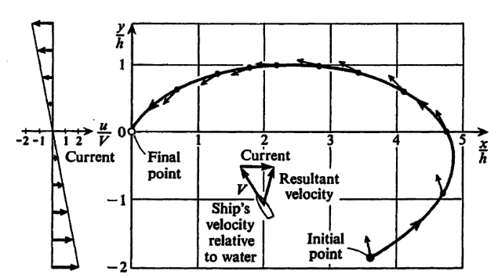
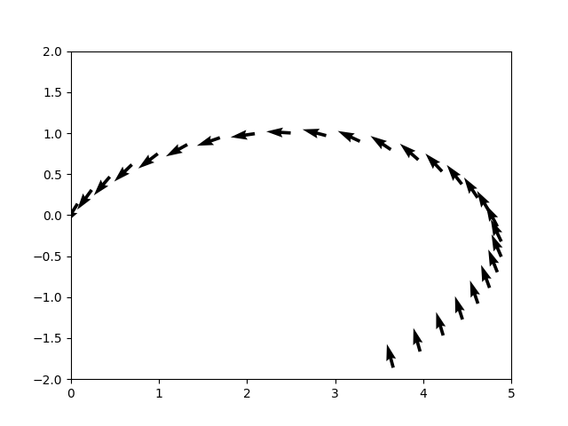
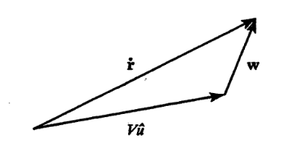

# Optimal Yol Hesabı, Zermelo

Bir geminin çok kuvvetli dalgaların olduğu bir bölgeden geçmesi
gerekiyor. Bu dalgaların büyüklüğü ve yönü her nokta için o noktaya
etki eden bir vektör olarak gösterilebilir [1, sf. 77]. Bu vektörün
iki öğesi, 

$$
u = u(x,y), \quad v = v(x,y)
$$

Geminin hızı $V$'nin suya göre sabit olduğunu düşünelim. Bu gemiyi
nasıl yönlendirirdik ki $A$ noktasından $B$ noktasına minimal zamanda
gidebilelim? Bu probleme literatürde Zermelo'nun problemi ismi verilir. 

Problemi çözmek için hareket denklemlerini yazalım, 

$$
\dot{x} = V \cos\theta + u(x,y)
\qquad (4)
$$

$$
\dot{y} = V \sin\theta + v(x,y)
\qquad (5)
$$

$\theta$ geminin burnunu hangi yöne doğru tuttuğumuzu kontrol ediyor,
yani geminin hızı $V$ o yönde uygulanmış oluyor. $\theta$ sabitlenmiş
kordinat eksenlerine göredir, ve $x,y$ bu eksende geminin yönünü
gösterir.  Dikkat: $u$ çoğunlukla kontrol girdisi olarak gösterilir,
burada böyle değil.

$$
\mathcal{H}(x, u, \lambda, t) = \mathcal{L}( x, u, t) + \lambda^T f(x, u, t) 
$$

Zaman optimizasyonu icin $\mathcal{L} = 1$. Niye? Mesela

$$
J = \int_{t_0}^{t_f} \mathcal{L}( x, \dot{x}, u, \lambda, t)
$$

performans ölçütünü düşünelim, $\mathcal{L} = 1$ seçmek entegral
çözümünden hareketle $J = t_f - t_0$ anlamına gelir, yani geçen
zamanın hesabı.

Diğer değişken $\lambda =
\left[\begin{array}{cc} \lambda_x & \lambda_y \end{array}\right]^T$
diyelim, sistem denklemi $f$ biraz önce verildi zaten.

Bu sistemin Hamiltonian'ı 

$$
\mathcal{H} = 
\lambda_x (V \cos \theta + u ) + 
\lambda_y (V \sin \theta + v ) + 1
\qquad (1)
$$

Devam edersek, Euler-Lagrange denklemleri

$$
\dot{\lambda}_x = -\frac{\partial H}{\partial x }  = 
-\lambda_x \frac{\partial u}{\partial x} - 
 \lambda_y \frac{\partial v}{\partial x}
\qquad (2)
$$

$$
\dot{\lambda}_y = -\frac{\partial H}{\partial y}  = 
-\lambda_x \frac{\partial y}{\partial y} - 
 \lambda_y \frac{\partial u}{\partial y}
\qquad (3)
$$

$$
0 = \frac{\partial H}{\partial \theta}  = 
V (-\lambda_x \sin \theta + \lambda_y \cos \theta ) \to
\tan\theta = \frac{\lambda_y}{\lambda_x}
$$

Hamiltonian $\mathcal{H}$ zaman $t$'ye direk / belirgin şekilde bağlı
olmadığı durumlarda $\mathcal{H} = \textrm{sabit}$ sistemin
entegrallerinden biridir. İspatlayalım,

$$
\frac{\mathrm{d} \mathcal{H}(x, u, \lambda, t)}{\mathrm{d} t} = 
\cancel{\frac{\partial \mathcal{H}}{\partial t}} + 
\frac{\partial \mathcal{H}}{\partial x}\frac{\partial x}{\partial t} + 
\frac{\partial \mathcal{H}}{\partial u}\frac{\partial u}{\partial t} + 
\frac{\partial \mathcal{H}}{\partial \lambda}\frac{\partial \lambda}{\partial t} 
$$

İptalleme mümkün çünkü $\mathcal{H}$ zamandan bağımsız. Devam edelim [1, sf 49],

$$
\dot{H} = \mathcal{H}_x \dot{x} + H_u \dot{u} + \dot{\lambda}^T f
$$

$f$ nereden geldi, Euler-Lagrange denklemlerini hatırlarsak,

$$
\dot{x} = + \left( \frac{\partial \mathcal{H}}{\partial \lambda} \right)
\quad
\dot{\lambda} = - \left( \frac{\partial \mathcal{H}}{\partial x} \right)
\quad
0 = + \left( \frac{\partial \mathcal{H}}{\partial u} \right)
$$

Soldan birinci denklem ile $\dot{x}$ yerine $\frac{\partial
\mathcal{H}}{\partial \lambda}$ kullanabiliyoruz, ayrica $\dot{x} = f$
olduğuna göre bu yerine geçirme mümkün oluyor. 

Aynı şekilde $\dot{x}$ yerine $f$ ve gruplama sonrası,

$$
\dot{H} = \mathcal{H}_u \dot{u} + (\mathcal{H}_x + \dot{\lambda}^T) f
$$

E-L soldan ikinci denklem ile parantez içi sıfır olur, geri kalanlardan,
E-L soldan üçüncü denklem ile $\mathcal{H}_u \dot{u}$ sıfır olur, geri
kalan,

$$
\dot{H} = 0
$$

Eğer üstteki doğruysa o zaman optimal gidiş yolu üzerinde $t$
üzerinden entegral $\mathcal{H}$'in sabit olması gerekir. Dikkat
edersek $\mathcal{H}_u = 0$ sıfır şartı optimal gidiş yolu üzerinde
geçerlidir. 

Varabileceğimiz bir diğer sonuç $\mathcal{H}$'nin sabit olmak ötesinde
sıfıra eşit olması mecburiyetidir. Bu nereden geliyor? Eğer zaman
üzerinden optimize ediyorsak ve $\mathcal{H}$ zamana bağlı değilse ve
sabitse, zamanın herhangi bir yerde olabilmesi için sadece sıfır
sabiti bu işi yapabilir.

Çözüme gelelim. (1)'den başlayalım, 

$$
0 = \lambda_x (V \cos\theta + u) + \lambda_y (W \sin\theta + v) + 1
$$

$$
-\frac{1}{\lambda_x} = \cancel{\frac{\lambda_x}{\lambda_x}}
(V  \cos\theta + u) + \frac{\sin\theta}{\cos\theta} (V \sin\theta + v)
$$

$$
\frac{-\cos\theta}{\lambda_x} = 
V \cos^2\theta + u\cos\theta + V \sin^2\theta + V \cos\theta
$$

$$
= V (\cancelto{1}{\cos^2\theta + \sin^2\theta}) + u + v
$$

$$
\lambda_x = \frac{-\cos\theta}{V + u\cos\theta + v\sin\theta} 
\qquad (7)
$$

Benzer işlemler sonrası 

$$
\lambda_y = \frac{-\sin\theta}{V + u\cos\theta + v\sin\theta}
$$

elde edilebilir.

Üstteki iki denklemi (2) ya da (3)'e sokarsak, 

$$
\dot{\theta} = \sin^2\theta \frac{\partial v}{\partial x} + 
\sin\theta \cos\theta \left( \frac{\partial u}{\partial x} - \frac{\partial v}{\partial y} \right)-
\cos^2 \theta \frac{\partial u}{\partial y}
\qquad (6)
$$

Bu son denklemi bir ODE sisteminin parçası olarak (4) ve (5) ile
beraber çözersek, gerekli minimum zaman gidiş yollarını
hesaplayacaktır. Verili bir B noktasına A noktasından varmak için
doğru $\theta$ seçilecektir, ve optimal yolda böylece gidilecektir. 

Örnek

Dalganın $u = -V(y/h), v=0$ şeklinde olduğunu düşünelim, yani bu yatay bir
dalga, eksende uzağa gittikçe büyüyor. Başlangıç noktası $x_0 = 3.66, y_0/h
= -1.86$ olsun. 

Fakat hala işimiz bitmedi, $A$ noktasından başlayıp $B$ noktasına giden
yolu, kontrol zincirini hesaplamak için doğru $\theta_A$'yi seçmemiz
gerekiyor, ya da $\theta_0$'yi. Eğer elimizdekiler $u=u(y)$ ve $v=v(y)$
olsaydı o zaman (2) denklemi şu hale gelirdi,

$$
\dot{\lambda}_x = 0 \to \lambda_x = \textrm{sabit}
$$

Ve (7) denklemi şu hale dönüşür,

$$
\frac{\cos\theta}{V + u(y)\cos\theta + v(y)\sin\theta} = \textrm{sabit}
$$

$u = -V(y/h), v=0$ üzerinden

$$
\frac{\cos\theta}{V - V(y/h)\cos\theta} = \frac{\cos\theta_f}{V} = \textrm{sabit}
$$

$$
\cos\theta = \frac{\cos\theta_f}{1 + (y/h)\cos\theta_f} 
$$

Bağımsız değişken için $t$ yerine $\theta$ kullanmak daha
rahat. Elimizde bir $y(\theta)$ var, 

$$
\frac{y}{h} = \sec\theta - \sec\theta_f 
\qquad (8)
$$

(6) şu hale gelir, 

$$
\frac{\mathrm{d} t}{\mathrm{d} \theta} = \frac{h}{V} \sec^2\theta \to
\frac{V(t_f-t)}{h} = \tan\theta - \tan\theta_f 
\qquad (9)
$$

Bu nasıl oldu? (6)'nin son terimi haricinde tüm diğer 
terimleri $u = -V(y/h), v=0$ yerine koyunca yokolur, kalanlardan

$$
-\cos^2 \theta \frac{\partial u}{\partial y} = 
\cos^2 \theta \frac{V}{h}=\frac{\mathrm{d} \theta}{\mathrm{d} t}
$$

Ve

$$
\frac{1}{\frac{\mathrm{d} \theta}{\mathrm{d} t}} = \frac{\mathrm{d} \theta}{\mathrm{d} t}
$$

üzerinden görülen sonuç varılır. 

Ve son olarak (4) denklemi, (8) ve (9) ile şu hale gelir,

$$
\frac{\mathrm{d} x}{\mathrm{d} \theta} = 
\frac{V \cos\theta + V (\sec\theta_f - \sec\theta}{-(V/h)\cos^2\theta} =
-h (\sec\theta + \sec\theta_f \sec^2\theta - \sec^3\theta)
$$

Bu denklemi entegre edince

$$
\frac{x}{h} = \frac{1}{2} \left[
\sec\theta_f (\tan\theta_f - \tan\theta) - \tan\theta (\sec\theta_f - \sec\theta)
+ \log \frac{\tan\theta_f + \sec\theta_f}{\tan\theta + \sec\theta}
\right] 
$$


Şimdi üstteki ve (8) denklemini beraber çözünce $\theta_0,\theta_f$
değerlerini elde edebiliriz, ki bunlar sırasıyla başlangıçtaki
$\theta$ değerleridir. 


Başlangıç noktaları $x_0/h = 3.66, y_0/h = -1.86$ değerlerini kullanarak 

$$
-1.86 = \sec\theta_0 - \sec\theta_f 
$$

$$
3.66 = \frac{1}{2} [ \sec\theta_f (\tan\theta_f - \tan\theta_0 ) - 
\tan\theta_0 (\sec\theta_f - \sec\theta_0) + 
$$

$$
\sin h^{-1} (\tan\theta_f) - \sin h^{-1} (\tan\theta_0) ]
$$

Bu denklemleri çözünce 

$$
\theta_0 = 105^0, \quad \theta_f = 240^0
$$

elde ediyoruz. 



Aslında bu problem bir nevi iki sınır koşullu problemi (two-boint boundary
value problem), yani başlangıcı ve bitişi tanımlanarak çözülen bir
ODE. Fakat biz şimdi kontrol amaçlı olarak eldeki başlangıç değerleri ile
sistemi entegre ederek nereye varıyoruz ona bakalım, bu çözüm diğer yandan
bize tüm $x(t),y(t),\theta(t)$ çözümünü de verecek, yani tüm gidiş
yolunu. Üstteki resim [1]'den alınmıştır,

```python
from scipy.integrate import odeint

V = 1.0
h = 1.0
def wave(z, t):
    x,y,theta = z
    tmp1 = V*np.cos(theta) + -V*(y/h)
    tmp2 = V*np.sin(theta) 
    tmp3 = -np.cos(theta)**2*(-V/h)
    return [tmp1, tmp2, tmp3]

t = np.linspace(0, 10, 50)

z0 = [3.66,-1.86,np.deg2rad(105)]
sol = odeint(wave, z0, t)
idx = 27
thetas = sol[0:idx,2]
print (sol[idx,:])
print (np.rad2deg(sol[idx,2]))
print (t[idx])
print (np.rad2deg(thetas))
```

```
[-0.04096147 -0.0363544   4.20008988]
240.64742384230138
5.510204081632653
[105.         105.82533902 106.74404915 107.77235927 108.93033001
 110.24297839 111.74181792 113.46692122 115.46973744 117.81688271
 120.59516753 123.91792862 127.932163   132.82416518 138.81708905
 146.14527764 154.97946458 165.28299453 176.64741416 188.27850714
 199.26873739 208.97172389 217.15287301 223.88529836 229.3803128
 233.87309753 237.57241404]
```

Görüldüğü gibi $x,y$'nin sıfıra en yakın olduğu noktada zaman ve bitiş
açısına bakıyoruz, üstte bulunan değerle aynı. $\theta$'ları grafiklersek,

```python
plt.xlim(-0,5)
plt.ylim(-2,2)
for i in range(idx):
    x,y,theta = sol[i]
    plt.quiver(x,y,np.cos(theta),np.sin(theta))
plt.savefig('phy_path_02.png')
```



Üstte görülen ilk resme oldukca benziyor. Bu $\theta$'lar her noktada bize
geminin burnunu hangi yöne tutmamız gerektiğini gösteriyor öyle ki
verili deniz dalgası içinden optimal zamanda istediğimiz sonuç noktasına
erisebilelim. 

Vektör Formu

Benzer bir problemi vektörel formda çözelim. Bir uçağın rüzgarlı bir
bölgede gitmesi gerekiyor. Rüzgarın büyüklüğünü ve yönünü bir vektör
alanı olarak temsil edebiliriz, rüzgar pozisyonun bir fonksiyonudur,
$w = \vec{w}, r = \vec{r}, u = \vec{u}$ olmak üzere, rüzgar $w =
w(r)$, ki $r = \left[\begin{array}{ccc} r_x, r_y, r_z\end{array}\right]^T$ 
üç boyutlu pozisyonu temsil ediyor [1, sf. 96]. Uçağın hızı $V$
sabit. 

Problem uçağın yönünü her $t$ anında optimal şekilde ayarlayabilmek
öyle ki A noktasından B noktasına, verili rüzgar alanı içinden en kısa
şekilde gidebilmek. 

Yere kıyasla uçağın toplam hızı 

$$
\dot{r} = V \hat{u} + w
\qquad (11)
$$

ki $\hat{u}$ uçağın yönünü gösteren birim vektör, $\hat{u} \cdot
\hat{u} = 1$. 



Üstteki resim toplamsal hızı temsil eden vektörsel toplamı temsili
olarak gösteriyor. 

Hamiltonian 

$$
\mathcal{H} = \lambda \cdot (V \hat{u}  + w) + 
\mu (1 - \hat{u}\cdot\hat{u}) + 1
$$

Euler-Lagrange denklemleri 

$$
\dot{\lambda} = - \frac{\partial H}{\partial r} = - \nabla (\lambda \cdot w)
\qquad (10)
$$

$$
0 = \frac{\partial H}{\partial \hat{u}} = V \lambda - 2\mu\hat{u}
$$

Son denkleme bakarak, ve $\hat{u}$'nun birim vektör olduğunu hatırlayarak,
$\hat{u},\lambda$ haricindekileri bir $C$ altında $C =V/2\mu$ gruplayıp,
$\hat{u} = C \lambda$ ve, ardından $\hat{u}$ birim vektör olduğu için
$C = 1/|\lambda|$ diyebilirdik, fakat bu son ifade yanlış olurdu; ya
$V/2\mu$ negatif ise? $C = 1/|\lambda|$ ile $C$'nin negatif olabilme şansı
kalmaz. Şöyle yazmak lazım,

$$
\hat{u} = \pm |C| \lambda = \pm \frac{\lambda}{||\lambda||}
$$

Minimum zaman problemi için $H=0$ olmalı. Bu durumda Hamiltonian formülünde
ikinci terim sıfır, üçüncü terim pozitif, ve genel resme bakınca
$\lambda \cdot (V \hat{u} + w) = \lambda \cdot \dot{r}$ hesabının aşağı
yukarı aynı yöne işaret eden vektörler olması sebebiyle pozitif olması
gerektiği için, o terimde negatifliği zorlamak için
$\hat{\lambda} = -\hat{u}$ seçmemiz gerekir, ki
$\hat{\lambda} = \lambda / |\lambda|$. Yani hız vektörü yer etki vektörü
$\lambda$'nin tam tersi yönünü göstermelidir.

Ana denklemleri ortaya çıkartmak için, şimdi (10) denklemindeki ana ifadeyi açalım,

$$
\nabla (\lambda \cdot w) = 
(\lambda \cdot \nabla) w + (w \cdot \nabla) \lambda + 
\lambda \times (\nabla \times w) + 
w \times (\nabla \times \lambda)
$$

$\nabla \times \lambda$'ya bakalım (bu bir curl hesabı),

$$
\nabla \times \lambda = \left[\begin{array}{ccc}
i & j & k \\
\frac{\partial }{\partial x} &
\frac{\partial }{\partial y} &
\frac{\partial }{\partial z} \\
\lambda_1 & \lambda_2 & \lambda_3
\end{array}\right]
$$


$$
= \left[\begin{array}{ccc} 
\frac{\partial \lambda_3}{\partial y} - \frac{\partial \lambda_2}{\partial z} & 
\frac{\partial \lambda_1}{\partial z} - \frac{\partial \lambda_3}{\partial x} & 
\frac{\partial \lambda_2}{\partial x} - \frac{\partial \lambda_1}{\partial y} 
\end{array}\right] 
= \left[\begin{array}{ccc} 
0 & 0 & 0
\end{array}\right]
$$

Çünkü $\lambda(t)$ sadece $t$'nin bir fonksiyonu, $x,y,z$ üzerinden
alınan tüm türevler sıfır sonucunu veriyor. Ayrıca sıfır vektörle
çapraz çarpım sıfır vektördür, o zaman 

$$
 = 
(\lambda \cdot \nabla) w + (w \cdot \nabla) \lambda + 
\lambda \times (\nabla \times w) + 
\cancel{w \times (\nabla \times \lambda)}
$$

Benzer şekilde $(w \cdot \nabla) \lambda$ yine $\lambda$ üzerinde
$x,y,z$ kısmi türev demektir, bu ifade de sıfırdır,

$$
= (\lambda \cdot \nabla) w + 
\cancel{(w \cdot \nabla) \lambda} +
\lambda \times (\nabla \times w) 
$$

$$
= (\lambda \cdot \nabla) w + \lambda \times (\nabla \times w) 
\qquad (12)
$$

Ana denklemleri artık ortaya koyabiliriz. Eğer $\hat{u} = -\hat{\lambda}$
ifadesini (11) içinde kullanırsak, ve (12) sonucunu kullanınca, iki
denklem,

$$
\dot{r} = w - V\hat{\lambda}
$$

$$
\dot{\lambda} = -(\lambda \cdot \nabla) w - \lambda \times (\nabla \times w) 
$$

Kaynaklar

[1] Bryson, Ho, *Applied Optimal Control*

[2] Radhakant Padhi, *Optimal Control, Guidence and Estimation*, 
    [https://nptel.ac.in/courses/101108057/downloads/Lecture-34.pdf](https://nptel.ac.in/courses/101108057/downloads/Lecture-34.pdf)


