# Adım Ölçmek, Pedometre

Cep telefonlarının çoğunda artık ivmeölçer (acceloremeter) algılayıcılar
var; bu algılayıcılar telefonun $x,y,z$ eksenlerini baz alarak tüm
eksenlerde ne kadar ivme etkisi olduğunu ölçüyorlar. Bu etkilerden en
büyüklerinden biri tabii ki yerçekimi, telefonda hiçbir hareket olmasa bile
telefonu tutuşa göre 9.8 metre / $s^2$'lik bir ivme tek ya da tüm eksenlere
dağılmış olarak ölçülecektir [4]. Yürürken, adım atarken meydana çıkan
yukarı ve aşağı yönde kuvvet uygulaması da ivmeölçerlerle yakalanır. Bu
ölçümleri kullanarak acaba atılan adım sayısını bulamaz mıyız? [5]'deki
uygulamayı kullanarak alınan ölçümlere bakalım,

```python
import pandas as pd
dfacc = pd.read_csv('acc.txt',header=None,sep='\\s+',engine='python')
print (dfacc.head())
```

```
               0         1         2         3
0  1493818386218 -0.147100  6.972528  6.707748
1  1493818386422 -0.215746  7.001948  6.854848
2  1493818386610 -0.304006  7.041174  6.697942
3  1493818386812 -0.304006  7.050981  6.884268
4  1493818387008 -0.225553  7.011754  6.943108
```

```python
steps1 = np.sqrt(np.sum(dfacc[[1,2,3]]**2, axis=1))
steps2 = steps1 - 9.8
steps2[:200].plot()
plt.savefig('compscieng_app40walk_01.png')
```

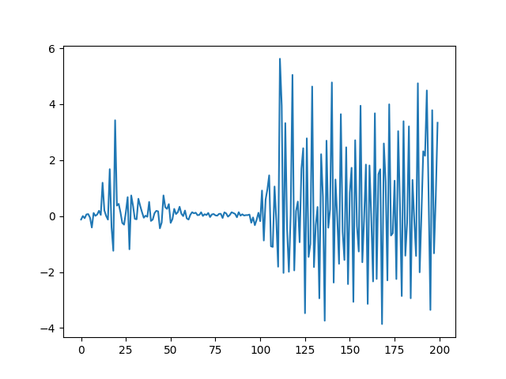

Üç eksendeki ivme ölçümünün normalize ettik (karelerinin toplamının
karekökü), 

$$ r = \sqrt{r_x^2 + r_y^2 + r_z^2}$$

Daha önce belirtildiğimiz gibi telefonun duruşu değişik şekillerde
olabilir, ve yerçekiminde olduğu gibi bu ölçümler üç eksene dağılmış
olacaktır. Bu üç ölçümü birleştirerek esas bizi ilgilendiren hesaba daha
yaklaşmış olmayı umduk. 

Sonuçlar fena değil, baştaki sıfıra yakın bölgede hiç hareket etmiyorduk
mesela, ve ivme hesabı burada ufak bir değer gösteriyor. Yapılan bir ek
işlemden daha bahsedelim, 9.8'lik yerçekimi ivmesini karekökten çıkarttık
çünkü yerçekimini ölçmekle de ilgilenmiyoruz (hep aynı zaten), bu değeri
çıkartarak yine bizi ilgilendiren veriyi daha net şekilde görebileceğimizi
umduk. Altta bu çıkartma öncesi ve sonrasında yapılan Fourier analizine
göre yerçekimi çıkartılmış verinin ilgilendiğimiz frekansları daha net
gösterdiği belli oluyor.

```python
import sys; sys.path.append('../../compscieng/compscieng_1_24')
import filt
f=plt.figure()
filt.plotSpectrum(steps1, 6)
plt.savefig('compscieng_app40walk_02.png')
f=plt.figure()
filt.plotSpectrum(steps2, 6)
plt.savefig('compscieng_app40walk_06.png')
```

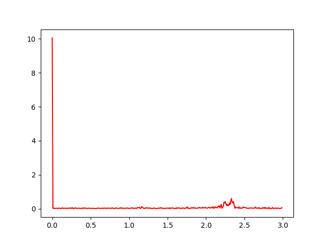
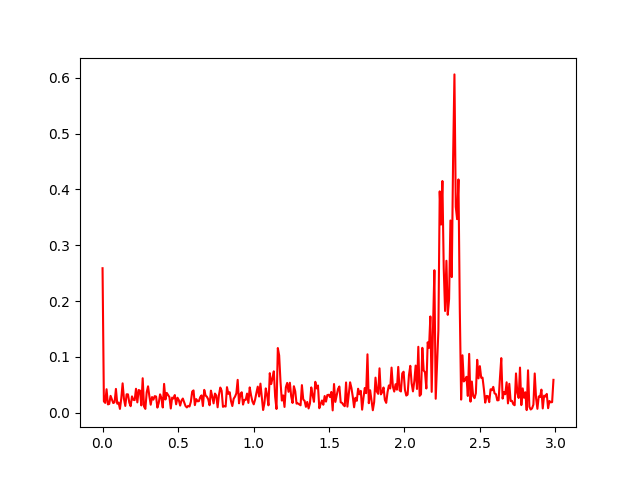

1 Hz. ve 2 Hz. seviyesindeki frekanslar ilginç, bunlar saniyede bir ve iki
adıma tekabül ediyor olmalılar. 

Adım saymak için zaman serilerinde tepe / uç nokta bulabilen kodlar
kullanacağız, `peakutils` altında bu kodları görüyoruz; bu kodlarla
belli eşik, minimum mesafe değerlerini belirleyerek bir zaman serisindeki
uç noktaları bulabiliyoruz.

```python
sys.path.append('../../compscieng/compscieng_1_30')
import peakutils
idx = peakutils.indexes(steps2, thres=0.1, min_dist=3)
print (len(idx), u'tepe noktası var')
plt.plot(steps2)
plt.plot(idx,steps2[idx],'rd')
plt.savefig('compscieng_app40walk_03.png')
```

```
89 tepe noktası var
```

Bu noktaların alt bölümü de var tabii, bu nihai sayı için üstteki sonucu
iki ile çarpabiliriz. Hesap fena değil, bu deney için 170 adım atmıştık.

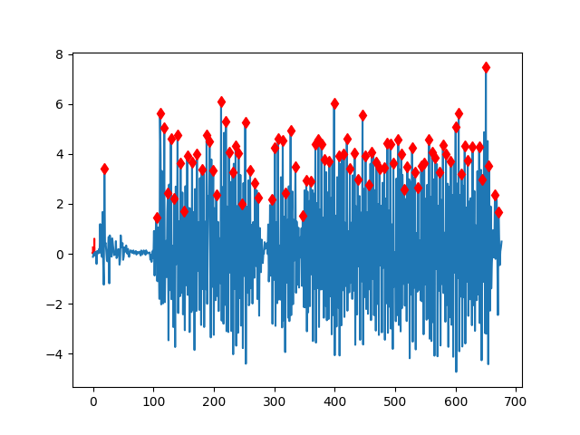

Tepe bulmaktaki farklı parametre etkilerini de gösterelim. Önce gürültülü,
iki büyük tepeden oluşan bir yapay veri üretelim,

```python
import peakutils
np.random.seed(0)
centers = (30.5, 72.3)
x = np.linspace(0, 120, 121)
y = peakutils.gaussian(x, 5, centers[0], 3) + \
    peakutils.gaussian(x, 7, centers[1], 10) + \
    np.random.rand(x.size)
```

Şimdi farklı parametrelerle tepe noktalarını bulalım,

```python
plt.figure()
plt.plot(x, y)
indexes = peakutils.indexes(y, thres=0.5, min_dist=30)
plt.plot(x[indexes], y[indexes], 'rd')
plt.savefig('compscieng_app40walk_04.png')
plt.figure()
plt.plot(x, y)
indexes = peakutils.indexes(y, thres=0.5, min_dist=3)
plt.plot(x[indexes], y[indexes], 'rd')
plt.savefig('compscieng_app40walk_05.png')
plt.figure()
plt.plot(x, y)
indexes = peakutils.indexes(y, thres=0.1, min_dist=5)
plt.plot(x[indexes], y[indexes], 'rd')
plt.savefig('compscieng_app40walk_07.png')
```

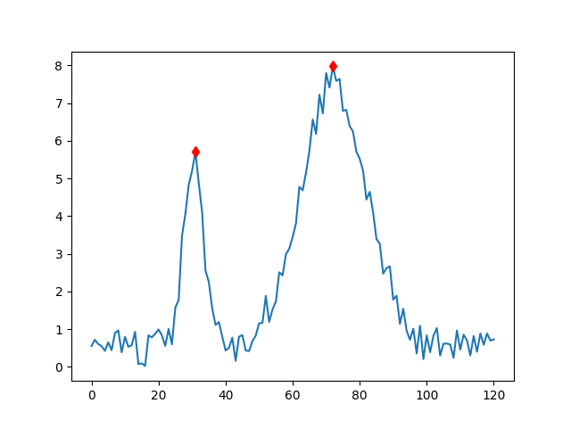
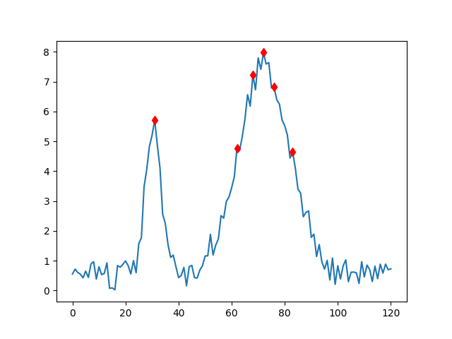
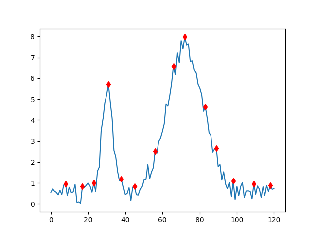

Parametre `thres` dikey bir eşik değeri tanımlıyor, en yüksek nokta
1.0 olacak şekilde. Mesela yarım seviyede minimal bir yükseklik eşik değeri
0.5 ile tanımlanabilir, o zaman sadece bu değer üstündeki noktalar tepe
olarak saptanacaktır. Yatay yönde ama bu sefer reel değer bazlı bir eşik
değeri `min_dist` ile verilir, bu durumda tepe noktaları arasında en
az bu kadar mesafe olması gerekir.

Yürüyüş Yönünü Bulmak

Cep telefonuyla, telefon hangi konumda olursa olsun (cepte, çantada, elde)
hangi yöne yürüdüğümüzü nasıl buluruz? Bilim kurgu filmleri biz
izleyicileri biraz şımarttı aslında -zamanda seyahat, istediği yere inen
uzay gemileri, ışıktan hızlı seyahat- fakat cep telefonu ile yürüyüş yönünü
hesaplamak 2014 civarına kadar hala tam, genel bir şekilde çözülmüş
değildi. GPS işe yaramıyor mu? GPS kesin çözüm olabilirdi çünkü dünya
üzerinde global kordinatları direk cihaza alıyoruz ve ardı ardına alınan
ölçümler bir gidiş yönünü gösteriyor olurdu, fakat GPS şehir ortamında
binalardan sinyal yansıması (multipath) problemi sebebiyle herhangi bir
yönde birkaç yüz metre hatalı olabiliyor, ve kapalı alanlarda zaten hiç GPS
sinyali alamıyoruz. Başka bir yöntemi kullanmamız gerekiyor.

Daha önce adım sayısında olduğu gibi ivmeölçer kullanımı akla gelecektir,
ivmeölçer önemli, fakat bu algılayıcıların kaydettikleri veri yürüyüş
sırasında pek çok diğer hareket ile karışmış halde. Sallanma, aşağı yukarı
gidiş geliş gibi. Ayrıca ivmeölçerin kaydettiği telefon bazlı bir eksen
sistemine göredir, bu sistem


Eğer telefonun ekranı bana tam dönük, yere dik şekilde tutup yürürsem
ivmeölçer y kordinatında daha yüksek değerler kaydediyor mesela. Bu bilgiyi
alıp telefonun bir diğer algılayıcısı elektronik pusula / manyetometre
(magnetometer) üzerinden bir global yön bilgisine belki çevirebilirim,
fakat pusula da tam güvenli değil, bu birleştirmeyi dikkatli yapmak
lazım. 

Birleştirme için Android ortamında rotasyon matrisi [3] bazlı bir yöntemi
tavsiye edenler var; bu yönteme göre ivmeölçer ve pusula birleştirilip
kamera kordinat sistemini dünya kordinat sistemine tercüme edecek bir
matris hesaplanıyor. Fakat bu hesap hareketli ortamda tam güvenilir değil,
ayrıca hesaplanan çok boyutlu bir ürün. Bu tür girift ara ürünler nihai
çözümdeki hata ihtimalini daha arttırır, bize gereken tek bir yön sadece,
*tüm* üç boyutlu eksenin bir diğer üç boyutlu eksene direk eşlemesine
ihtiyaç yok. Bir diğer problem bu hesabın nasıl kullanılacağı... Mesela
ivme hesaplarını rotasyon matrisi ile dünya kordinat sistemine çevirdik,
şimdi kuzey-güney doğu-batı bağlamında ivlenmeyi "biliyoruz''. Bu
ivmelenmeyi bir kere sayısal entegrasyon ile hıza çevirip oradan yön elde
edebilir miyiz?  Ne yazık ki entegrasyon hassas bir hesaptır. Eğer olmayan
yerde birkaç saniye bile fazla ivme ölçümü almışsak, hızda, yönde aşırı
farklılıklar ortaya çıkabiliyor.

Daha sağlam çözüm için yürüyüşün ivmeölçere nasıl yansıdığını yakından
incelemek gerekiyor, ki [1, 2]'deki araştırma aynen bunu yapmış. 

Not: Bu alanda bir diğer yaklaşım veri bilimi, yapay öğrenim
yaklaşımı. Eğer elde yeterince veri varsa, ham veri ve yürünen yön olarak,
bu veriler denetimli eğitimde bir yapay öğrenme algoritmasina verilir ve
algoritma aradaki ilişkiyi öğrenir. Hangi yaklaşımın nerede yeterli,
kuvvetli olacağını anlamak tecrübeye bağlı. Bazen problemi elden geldiği
kadar matematiksel olarak modellemek, temel fiziksel kavramlardan
başlayarak tanımlamak daha iyi olur, bazen diğer yaklaşım daha kolay
olabilir.

[1]'e göre insan yürüyüşü belli bölgelere ayrılabilir ve her bölgenin
ivmeölçerde farklı bir yansıması vardır. İki büyük bölge duruş ve sallanış
denebilecek konumlar; duruşta (aslında tam duruş değil, fakat senkronize
hareket) bacak ve üst gövde aynı anda öne doğru gitmekte, sallanış ise bir
bacağın arkadan öne doğru itilmesiyle üst gövdeden öne geçme anı.

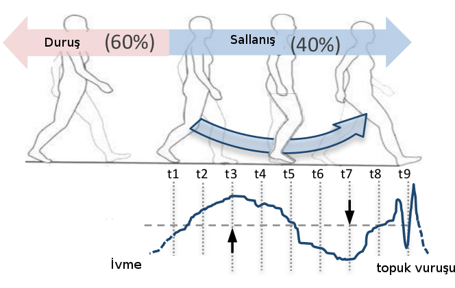

Sallanış bölgesinin ilk kısmında ivme pozitif, ikinci kısmında ise
negatif. Ayrıca, diyelim ki sallanış $t_1,..,t_9$ zaman kesitlerini
kapsıyor, ivme $t_3$'te maksimum, $t_5$'te sıfır, ve geriye doğru ters ivme
(deceleration) $t_7$'de en üst noktasında.

Araştırmanın en önemli bulgusu şudur: güvenli bir şekilde ivmeölçere
yansıyan ve yürüyüş yönü bilgisini taşıyan en iyi veri bölgesi topuk
vuruşuna giden maksimum yavaşlamanın olduğu bir bölgedir, bunun için [1]
önce ivme sinyalinde aşırı yüksek frekanslı sinyalleri eler, ardından sıfır
geçiş anlarını bulur - bu noktalar sinyalin artıdan eksiye doğru geçiş
yaptığı anlardır. Ardından sıfır geçiş ve tepe noktaları arasındaki topuk
vuruşuna en yakın bölgeye odaklanılır, ve bu kesit çıkartılarak bütün üç
eksenler üzerinden o bölgedeki ortalama alınır. Bu ortalama telefonun tüm
eksenlerindeki ivme ölçüsü olacaktır, sonuç üç boyutlu bir vektör. Vektörün
işaretini tersine çevirirsek (yavaşlama yönünün tersi) bu bize yürüyüş
yönünü verecektir. Tekrar vurgulayalım, negatiflik, pozitiflik, sıfır geçiş
irdelemeleri birleştirilmiş ivme verisinde, aranan bölge bulununca o
bölgedeki ortalama üç eksendeki ivme verisinde hesaplanır.

Alttaki kodda bizim [5]'teki uygulama *Steps*'i kullanarak
kaydettiğimiz verilerle yürüyüş yönü hesabını görüyoruz.

```python
import pandas as pd, health
import scipy.linalg as lin

dir = './data/pots1/'
dfacc = pd.read_csv(dir + 'lacc.txt',header=None,sep='\\s+',engine='python')
fr=100; to=250
dfacc = np.array(dfacc)[fr:to]
t = dfacc[:,0] / 1e9
ax = dfacc[:,1]
ay = dfacc[:,2]
az = dfacc[:,3]
data = np.abs(ax) + np.abs(ay) + np.abs(az)

sample_rate = 25.0 # orneklem orani
cutoff = 5.0 # kac Hz yukarisini eleyelim
threshold = 0.1 # esik degeri
order=4 # butterworth filtresinin derecesi
# sallanis bolumunu kac kesite bolelim (ki ilgilendigimiz son kesit). 
# [1]'e gore 4, altta 8 parcaya boluyoruz.
stride_fraction = 1.0/8.0 

# Tum eksenlerdeki degerleri pozitifle ve topla
data = np.abs(ax) + np.abs(ay) + np.abs(az)

# ortalamayi cikar
data -= np.mean(data)

# Veri uzerinde alcak geciren (low-pass) Butterworth filtre islet,
# esik noktasi  5 Hz. Bu cok alcak bir deger degil, Huseyin Bolt bile 
# saniyede 5 adimdan fazla atmiyordur herhalde
filtered = health.butter_lowpass_filter(data, sample_rate, cutoff, order)

# Pozitiften negatife gecis noktalarini bul
transitions = health.crossings_nonzero_pos2neg(filtered)

f=plt.figure()
plt.plot(filtered)
plt.plot(transitions,filtered[transitions],'rd')
plt.savefig('compscieng_app40walk_09.png')
```

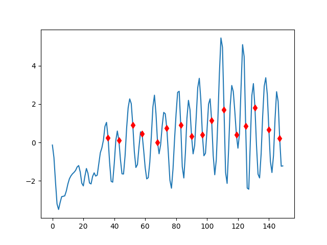

```python
strike_indices_smooth = []
filter_threshold = np.abs(threshold * np.max(filtered))
for i in range(1, np.size(transitions)):
    segment = range(transitions[i-1], transitions[i])
    imax = np.argmax(filtered[segment])
    if filtered[segment[imax]] > filter_threshold:
        strike_indices_smooth.append(segment[imax])

f=plt.figure()
plt.plot(filtered)
plt.plot(strike_indices_smooth,filtered[strike_indices_smooth],'rd')
plt.plot(transitions,filtered[transitions],'gx')
plt.savefig('compscieng_app40walk_10.png')

# Tepe noktalari arasinda kac veri noktasi oldugunu FFT'nin reel kismini 
# kullanarak hesapla
interpeak = health.compute_interpeak(data, sample_rate)
decel = int(interpeak / 2)

# Puruzlestirilmis verinin maksimum noktalarina yakin olan maksimum
# noktalarini bul
strike_indices = []
for ismooth in strike_indices_smooth:
    istrike = np.argmax(data[ismooth - decel:ismooth + decel])
    istrike = istrike + ismooth - decel
    strike_indices.append(istrike)

strikes = np.asarray(strike_indices)
strikes -= strikes[0]
strikes = strikes / sample_rate

f=plt.figure()
plt.plot(data)
plt.plot(strike_indices,data[strike_indices],'rd')
plt.savefig('compscieng_app40walk_11.png')
```

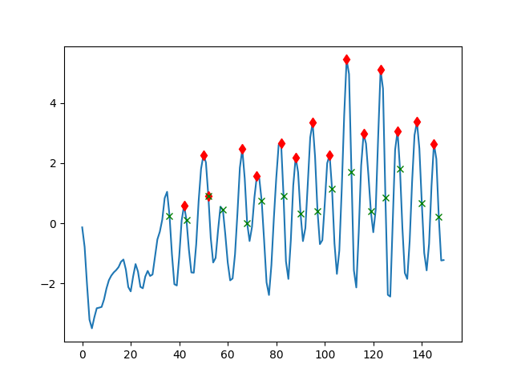


```python
decel = int(np.round(stride_fraction * interpeak))

# ters ivmenin oldugu bolgede ortalama al, sonuc uc boyutlu vektor
vectors = []
for ipeak in strike_indices:
    decel_vectors = np.asarray([[ax[i], ay[i], az[i]]
                                for i in range(ipeak - decel, ipeak)])
    vectors.append(np.mean(decel_vectors, axis=0))

# ve isareti tersine cevir
direction = -1 * np.mean(vectors, axis=0)

# Birim vektor haline getir / normalize et
direction /= np.sqrt(direction.dot(direction))

print (u'yürüyüş yönü', direction)
```

```
yürüyüş yönü [ 0.24212494 -0.25265038  0.93677281]
```

Pusula

Yürüyüş yönünü telefon eksenleri bazlı saptadık, peki bu yön dünyada nereyi
gösteriyor? Pusulayı kullabiliriz, cep telefonları pusula algılayıcısı ile
kuzey manyetik etkisinin telefon eksenlerine ne kadar etki ettiğini
kaydedebiliyor, yani bu üç eksenden alınan üç veri noktası bir vektör
olarak telefon kordinat sisteminde kuzeyin neresi olduğuna işaret
edecektir.

Son durum şöyle, bir telefonun standart elde tutuluş tarzını baz alalım, ve
iki örnek vektör alttaki gibi olsun,

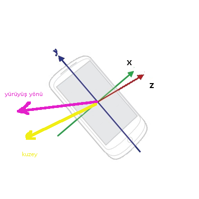

Güzel, şimdi pusula ve yürüyüş vektörlerini kullanarak kuzeye göre gidiş
yönünü bulalım. Üstteki vektörlerin üç boyutlu olduğuna dikkat, eğer
yürüyüş yönü ve kuzey vektörü arasında direk açı hesaplamaya uğraşsak,
diyelim biri çok yukarıda diğeri çok aşağıda ama yeryüzü bazında doğu-batı
temelli çok az farklı olan iki vektör arasında çok büyük açı ortaya
çıkabilirdi. Bize aslında gereken sadece kuzeye göre nasıl hareket
ettiğimizi verecek "yataysal'' bir açı. Şimdi işimizi kolaylaştıracak bir
yeni kavramı daha kullanabiliriz: yerçekim vektörü. 

Yerçekim ivmeölçerler tarafından sürekli kaydedilir, yerçekimi müthiş bir
kuvvettir, 9.8 $m/s^2$ ile sürekli üzerimizde etkisi var. Bunun iyi tarafı
telefonlar bu kuvveti, ve onun yönünü bir vektör olarak güvenilir bir
şekilde hesaplayabilirler. Hatta Android'in bu vektörü ivme verisinden
çıkartan bir "türevsel algılayıcısı'' bile var. Yerçekim vektör
algılayıcısı (gravity vector sensor) hızlı bir şekilde bu hesabı
veriyor. Telefon hangi konumda olursa olsun yerçekimin, yine telefon
kordinatlarına göre, hangi yönde olduğunu gösteriyor.

Yerçekim vektörünün faydası şurada: bu vektörün normal olduğu düzlemi hayal
edersek, bu üzerinde durduğumuz yeryüzeyi olacaktır! Ve, eğer pusula ve
yürüyüş yönü vektörlerini bu düzlem üzerine yansıtırsak, artık bu iki
vektör arasındaki açıyı bulmak çok basittir. Yansıtma için bkz [6]. Açı
hesabı için iki vektor arasındaki şu ilişkiyi hatırlayalım,

$$ \cos \theta = \frac{u \cdot v}{||u||||v|||}$$

Açı için,

$$ \theta = \arccos \frac{u \cdot v}{||u||||v|||}$$

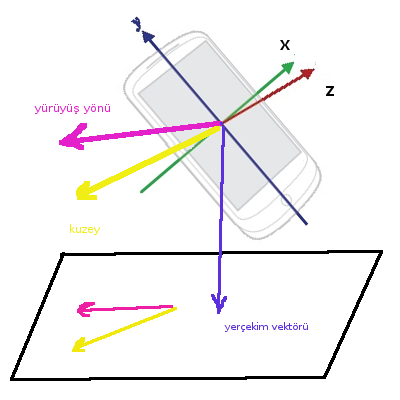
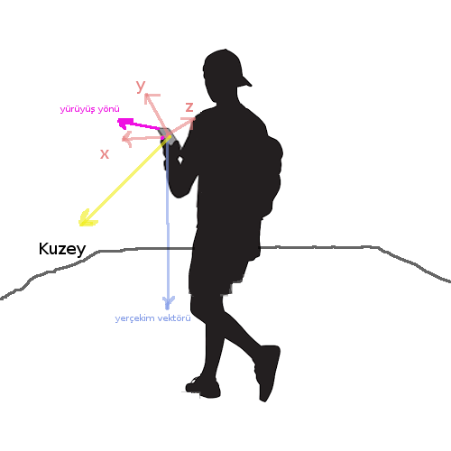

```python
def proj(u, n):
    return u - (np.dot(u,n) / np.dot(n,n)) * n

dfmag = pd.read_csv(dir + 'mags.txt',header=None,sep='\\s+',engine='python')
dfmag = np.array(dfmag)
dfmag = dfmag[fr:to,1:].mean(axis=0)
print (u'kuzey yönü', dfmag)

dfg = pd.read_csv(dir + 'grav.txt',header=None,sep='\\s+',engine='python')
dfg = np.array(dfg)
dfg = dfg[fr:to,1:].mean(axis=0)
print (u'yerçekim vektörü', dfg)

pmag = proj(dfmag, dfg)
print (u'kuzey vektörü yeryüzeyinde yansıtma sonrası')
print (pmag)

pwdir = proj(direction, dfg)
pwdir = pwdir / lin.norm(pwdir)
print (u'yürüyüş yönü yansıtma sonrası')
print (pwdir)
a = np.arccos(np.dot(pwdir, pmag) / (lin.norm(pwdir)*lin.norm(pmag)))
print (u'Açı', np.rad2deg(a))
print (u'Açı 180 den az mi?', np.dot(dfg, np.cross(pmag, pwdir)) > 0)
```

```
kuzey yönü [-41.02575884  16.51051212  -2.29159006]
yerçekim vektörü [ 0.70329063  3.60535991  9.0586454 ]
kuzey vektörü yeryüzeyinde yansıtma sonrası
[-41.098733    16.13641625  -3.23152448]
yürüyüş yönü yansıtma sonrası
[ 0.30343773 -0.89316924  0.33192509]
Açı 129.15898241
Açı 180 den az mi? True
```

Bu yön hakikaten doğru, ölçüm alırken aşağı yukarı o yönde yürüyorduk. 

Not: 180 dereden azlık irdelemesinin mantığı için bkz [6].

Üstteki kodun kullandığı yardımcı kodlar alttadır,

```python
# http://github.com/sage-bionetworks/mhealthx baz alinmistir
import pandas as pd
import numpy as np
import matplotlib.pyplot as plt
from scipy.fftpack import rfft, fftfreq
from scipy.signal import butter, lfilter

def crossings_nonzero_pos2neg(data):
    # sifir gecislerini burada hesapla
    pos = data > 0
    crossings = (pos[:-1] & ~pos[1:]).nonzero()[0]
    return crossings

def butter_lowpass_filter(data, sample_rate, cutoff=10, order=4):
    nyquist = 0.5 * sample_rate
    normal_cutoff = cutoff / nyquist
    b, a = butter(order, normal_cutoff, btype='low', analog=False)
    y = lfilter(b, a, data)
    return y

def compute_interpeak(data, sample_rate):
    freqs = fftfreq(data.size, d=1.0/sample_rate)
    f_signal = rfft(data)
    imax_freq = np.argsort(f_signal)[-2]
    freq = np.abs(freqs[imax_freq])
    # tepe noktalari arasindaki veri nokta sayisi
    interpeak = int(np.round(sample_rate / freq))

    return interpeak

```

Görüldüğü gibi bu hesap çok hassas ölçümlere dayanarak yapılmadı. Yürüyüş
yönü için [1] araştırması veride yürüyüşün en çok iz bıraktığı bölgeye
odaklanıyor, ve gürültüyü eleyip belli kesitler çıkartarak bir ortalama
alıyor. Bu sağlam bir hesap. Pusula ölçümleri için de yaklaşım öyle,
telefondan telefona, markadan markaya göre bir eksendeki ölçüm 20
mikrotesla yerine 40 mikrotesla gelebilir, fakat bu tür bir fark hesapta
savrulma yaratacaksa yaklaşımımız sağlam değil demektir. Fakat hesaplar
vektörsel, ama ölçümdeki değişiklik, hata her ne ise, *tutarlı* ise
vektörün tüm öğelerinde mevcut olacaktır, ve vektörün yönünde değişiklik
olmayacaktır. Vektörler, düzlemler, tek açılar ile iş yaparak, tek bir
amaca odaklı algılayıcıların verisine güvenerek ve onları bir araya
getirerek işimizi kolaylaştırmış olduk.

Önemli bir diğer özellik üstteki yaklaşım telefon hangi konumda olursa
olsun işlemesi. Bu çok faydalı çünkü telefon cebimizde, çantada herhangi
bir şekilde duruyor olabilir, fakat şimdiye kadar gördüğümüz tüm vektörleri
hesapladığımız anda kuzeye referanslı hangi yönde yürüdüğümüzü kolaylıkla
bulabiliriz.

Kaynaklar

[1] Roy, *WalkCompass: Finding Walking Direction Leveraging Smartphone's Inertial Sensors*, 
    [http://scholarcommons.sc.edu/etd/2352/](http://scholarcommons.sc.edu/etd/2352/)

[2] Roy, *I am a Smartphone and I can Tell my User's Walking Direction*, 
    [http://synrg.csl.illinois.edu/papers/walkcompass.pdf](http://synrg.csl.illinois.edu/papers/walkcompass.pdf) 

[3] Google, *Position Sensors*, 
    [https://developer.android.com/guide/topics/sensors/sensors_position.html](https://developer.android.com/guide/topics/sensors/sensors_position.html)

[4] Daskalov, *A Pedometer in the Real World*, 
    [http://www.aosabook.org/en/500L/a-pedometer-in-the-real-world.htm](http://www.aosabook.org/en/500L/a-pedometer-in-the-real-world.htm)

[5] Bayramlı, 
    *Algılayıcı Ölçümleri, Video, Android*, 
    [https://burakbayramli.github.io/dersblog/sk/2017/02/algilayici-olcumleri-video-android.html](https://burakbayramli.github.io/dersblog/sk/2017/02/algilayici-olcumleri-video-android.html)

[6] Bayramlı, Lineer Cebir, *Ders 15*


