# Kısmi Türevsel Denklemler

Ders 1

Konumuz [2] Kısmi Türevsel Denklemler (partial differential equations -PDE-). Bu
dersin ön gerekliliklerinden en önemlisi normal diferansiyel denklemlerdir
(ordinary differential equtions -ODE-), çünkü pek çok PDE'yi çözmenin tekniği
onları bir ODE sistemine indirgemekten geçiyor. Yani PDE çözmek için ODE çözme
tekniklerini de bilmek gerekiyor. Bir diğer gerekli bilgi Lineer Cebir dersi.

Bu dersin ana amacı, bir mühendislik dersi olarak, denklem çözmek, ve pek
çok denklemin çıkış noktası fiziksel problemler. Mesela sıcaklık yayılması
(heat diffusion), dalga hareketi (wave motion), titreşen hücre zarı
(vibrating membrane) gibi. Fakat PDE kavramı finansta bile ortaya çıkabilen
bir kavram, mesela Black-Sholes denklemlerinde olduğu gibi. 

Yani dersimiz çok teori odaklı olmayacak, bazı ispatlardan bahsedeceğiz,
ama onun haricinde teori üzerinde fazla durmayacağız. 

PDE nedir? İlk önce ODE tanımından başlayalım. 

$$ y = y(x) $$

$$ \frac{dy}{dx} = y $$

Başlangıç şartları

$$ y(0) = y_0 $$

Çözüm 

$$ y = y_0e^x $$

Bu bir ODE çünkü sadece bir tane bağımsız değişken var ($x$), ve bir tane
bağımlı değişken var ($y$). 

PDE ise içinde kısmi türevleri, ve bir veya *birden fazla* bağımsız
değişkeni barındıran bir denklemdir.

Eğer güneş etrafındaki yörüngeleri temsil etmek istiyorsanız gezegenleri
boyutsuz parçacıklar gibi kabul ederek ODE'ler ile temsil etmek yeterli
olabilir, ama diğer problemlerde daha fazla bağımsız değişken gerekeceği
için ODE yetmez, mesela zaman, cismin 3D uzaydaki boyutları gibi.

Mesela bir PDE

$$ u = u(x,y) $$

Çoğunlukla problem tanımının ilk başında fonksiyonel ilişkiyi hemen
göstermek iyi olur, mesela üstte bağımsız değişkenler $x,y$, ve $u$ bu iki
değişkene bağımlı. Devam edelim, PDE şöyle olsun

$$ \frac{\partial^3 u}{\partial x^3} + 
\cos(y)\frac{\partial u}{\partial y} + 3 = 0
$$

Bir PDE problemine çoğunlukla ek olarak sınır koşulları (boundary condition
-BC-) ve başlangıç koşulları (initial conditions) eklemek de gerekir.

Kısmi Türev nedir? 

$$ u = u(x_1, x_2,...,x_n) $$

$$ 
\frac{\partial u}{\partial x_i} = 
\lim_{\Delta x_i \to 0} 
\frac{
u(x_1,..,x_i+\Delta x_i,x_{i+1},...,x_n) - u(x_1,..,x_i,x_{i+1},...,x_n)}
{\Delta x_i}  $$

Yani bir fonksiyonun kısmi türevini almak istediğimiz değişken haricinde
tüm diğer değişkenlerinin sabit tutulduğu bir durum. 

Örnek

$$ u = x_1^2 + x_1\sin(x_2) $$

$$ 
\frac{\partial u}{\partial x_1} = 2x_1 + \sin(x_2)
$$

$$ 
\frac{\partial u}{\partial x_2} = x_1 \cos(x_2)
$$

Notasyon

Çoğunlukla kısmi türevler 3 farklı şekilde gösteriliyor. 

$$ \frac{\partial u}{\partial x} \equiv u_x \equiv \partial_x u $$

Üstte soldaki tanımı gördük, bazen ortadaki de tercih edilebiliyor, ya da
bazen en sağdaki. 

PDE Derecesi

Bir PDE'nin derecesi, o denklemdeki kısmi türevlerin en yüksek dereceli
olanın derecesi neyse o'dur.

Mesela

$$ u_{xxx} + u_y = 5 $$

derecesi 3. Aynı zamanda bu lineer ve homojen olmayan (inhomogeneous) bir
PDE. Bu son iki kavramı birazdan tanımlayacağım. 

Örnek 

$$ (u_{xx})^2 + u_xu_y = u $$

Bu 2. derece. Bu bazı insanların kafasını karıştırıyor, çünkü $u_{xx}$'in
karesi var. Bu aynı zamanda homojen, ve gayrı lineer. Bu dersteki çoğu PDE
lineer olacak. 

Lineer ve gayrı lineerlikten bahsetmişken, şunu ekleyelim. 

Şimdi diyelim ki bir girdi (input) fonksiyonu $I(t)$ bir işleme giriyor
($L$ operatörü) ve çıktı (output) olarak $R(t)$ çıkıyor. Yani sistem

$$ R = \mathcal{L} \ I $$

Bir lineer sistemde eğer girdiyi iki ile çarparsanız, çıktı da iki katına
çıkar. O zaman kurallar

   * $\mathcal{L}(\alpha I) = \alpha \ \mathcal{L}(I)$, ki $\alpha$ bir sabit.

   * $\mathcal{L}(I_1 + I_2) = \mathcal{L}(I_1) + \mathcal{L}(I_2)$, ki
     buna üst üste eklenebilme (superposition) prensibi deniyor. Bu
     prensibi bu dersteki çoğu PDE'yi çözmek için kullanacağız. Bir lineer
     sistem varsa çoğu zaman arka planda bir yerlerde üst üste eklenebilme
     prensibi geziniyordur.

Diyelim ki PDE'nizi şöyle yazdınız

$$\mathcal{L}u = f(\vec{x}) $$

Burada $u$ bağımlı değişken, $\vec{x}$ bir vektör, $\vec{x} \in \mathbb{R} ^n$, ve
bu vektörün içinde birden fazla değişken var, bu değişkenlerin hepsi
bağımsız.

$$ 
\vec{x} = 
\left(\begin{array}{r}
x_1,\\
.. \\
x_n
\end{array}\right)
$$

Bu denkleme benzer bir diğer denklem lineer cebirdeki $A\vec{x} = \vec{b}$
denklemidir.  PDE sisteminde de cevabını aradığımız, lineer cebir
sisteminde "$A$ ile çarpılıp $b$ sonucunu verecek $\vec{x}$ hangisidir?''
sorusuna benzer bir şekilde "$\mathcal{L}$ operatörü uygulanıp $f(\vec{x})$
sonucunu verecek $u$ hangisidir?'' sorusudur.

Bu analojiden devam etmek gerekirse, belli bir noktada $u$'nun içinde
olduğu "fonksiyon uzayı'' hakkında düşünmemiz gerekebilir, $\vec{x}$'in
içinde olduğu $\mathbb{R}^n$ uzayı gibi. Lineer cebir durumunda operatörün
özelliklerine bakılır, mesela " $b$'nin içinde olduğu ve $A$ operatörü
uygulanıp hiç sonuç alınamayacak uzayın belli kısımları var
mıdır?'' gibi sorularla uğraşılabilir, bunlar $A$'nin "ulaşamadığı
yerlerdir'' vs. PDE'deki $\mathcal{L}$ operatörü için de benzer sorular sorulabilir. 

Yani lineer cebirle pek çok kavram PDE dünyasına benziyor, orada vektör
uzayı var, burada fonksiyon uzayı var. Yani bir analoji olarak bu
benzerliği aklımızda tutmamız faydalı. 

Bir operatör şu şekilde de olabilir

$$ \mathcal{L} = \mathcal{L} \bigg(
\frac{\partial }{\partial x_1}, \frac{\partial }{\partial x_2},..,
u,..
\bigg)
$$

Yani operatör kısmi türevlere ve hatta $u$'nun kendisine de bağımlı
olabilir. 

Eğer elimizde gayrı lineer bir PDE var ise, başımız dertte demektir. Böyle
bir sistemi çözmek için çoğunlukla sayısal çözümlere başvurmak
gerekir. Eğer lineer ise çözümde bayağı ilerlemek mümkündür. 

Lineerlik

Bir operatör ve onun tanımladığı bir üst üste eklenebilme durumu düşünelim

$$ \mathcal{L} = \mathcal{L}(\alpha_1 u_1 + \alpha_2 u_2) = 
\alpha_1 \mathcal{L}u_1 + \alpha_2 \mathcal{L}u_2 $$

ki $\alpha_1,\alpha_2$ birer tek sayıdır (scalar), ya reel, ya da kompleks. 

Örnek

Birazdan bakacağımız denklem dalga denklemi. Orada

$$ u_{tt} - c^2u_x = 0 $$

Bu denklemi

$$ \mathcal{L}u = 0 $$

şeklinde yazabiliriz ki $\mathcal{L}$ şöyle tanımlı olacaktır

$$ \mathcal{L} = \frac{\partial^2}{\partial t^2} - 
c^2 \frac{\partial ^2}{\partial x^2 = 0}$$

$c$ bir sabittir. 

Şimdi diyelim ki şu denklemi çözmemiz lazım

$$\mathcal{L} u = f $$

ki

$$ \mathcal{L}: V \to V $$

Yani, $\mathcal{L}$ bir vektör uzayını bir diğerine eşlemekte (map), ve yine diyelim
ki bu uzaylar birer Hilbert Uzayı (bunun anlamına şimdi bilmemiz
gerekmiyor, ileride bu konuya döneceğiz, bu kelimeyi şöyle bir ortaya atmak
istedim). 

Yani sorduğumuz Hilbert Uzayı $V$'de bir $f$'e eşleyecek bir $u$ fonksiyonu
olup olmadığı. Bu arada tipik bir Hilbert Uzayı mesela kare alıp bir sınır
bölgesinde (boundary domain) entegre edince elde edilen sonlu (finite) bir
sonuçların oluşturduğu uzay. Yani "derli toplu'' fonksiyonlar bir anlamda,
absürt sonuçlar vermeyen türden, sonsuzluğa doğru patlayıp giden türden
olanları değil. 

Faraziyeye devam edelim, diyelim ki $V$ içinde bir baz (basis) var. Baz
nedir? Lineer cebirden hatırlayalım, mesela üç boyutlu Öklitsel (Euclidian)
uzayı $\mathbb{R}^3$. 

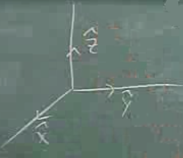

$$ 
\vec{x} = 
\left[\begin{array}{r}
1 \\ 0 \\ 0
\end{array}\right]
$$

$$ 
\vec{y} = 
\left[\begin{array}{r}
0 \\ 1 \\ 0
\end{array}\right]
$$

$$ 
\vec{z} = 
\left[\begin{array}{r}
0 \\ 0 \\ 1
\end{array}\right]
$$

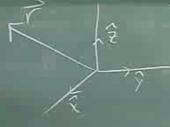

Bu uzaydaki herhangi bir vektör $\vec{r}$ üstteki üç baz vektörü
kullanılarak parçalarına ayırılabilir, ya da, onların bir lineer
kombinasyonu olarak gösterilebilir. Mesela

$$ \vec{r} = x\vec{x} +  y\vec{y} +  z\vec{z} $$

Bu üç vektörün bu uzay için bir "baz oluşturduğu'' söylenebilir, çünkü bu
uzaydaki her vektör bu üç vektörün bir kombinasyonu olarak temsil
edilebilir. Dikkat edelim, iki baz vektör yeterli olmazdı, dört taneye
gerek yok. Tamı tamına üç tane vektör bu uzayın bazını oluşturuyor. 

Bu sonlu (finite) miktarda bir uzay, herhangi bir vektörü tanımlamak için
sonlu miktarda baz vektörü yeterli. Sonsuz boyutlu bir uzay da olabilirdi,
o zaman herhangi bir fonksiyonu tanımlamak için sonsuz tane baz vektörü
gerekirdi. Mesela Fourier Serilerini düşünelim

$$ u = \sum_{i=1}^{\infty} \alpha_i \phi_i(x) $$

ki baz fonksiyonlar $\bigg\{ \phi_i(x)  \bigg\}_{i=1}^\infty$.

Bu fonksiyonların her biri trigonometrik fonksiyonlar olabilir (cos, sin)
gibi, o zaman seri Fourier Serisi olur. Her halükarda, yukarıdaki tanımla
diyoruz ki özgün (unique) $\alpha$ değerleri var ki, o değerleri zaten
önceden bilinen baz fonksiyonları ile çarpıp toplayarak $u$'yu
oluşturabiliyoruz.

Eğer lineer operatörümüzü hatırlarsak

$$ \mathcal{L} = \mathcal{L}(\alpha_1 u_1 + \alpha_2 u_2) = 
\alpha_1 Lu_1 + \alpha_2 Lu_2 $$

Bu operatör herhangi iki katsayıyı kullanıyordu, fakat iki üstteki sonsuz
tane toplamı da içerecek şekilde genişletilebilir, ve baz kavramı ile üst
üste eklenebilme kavramının arasındaki alakayı gösterir. 

Diyelim ki $\mathcal{L}$'nin her baz vektörünü nasıl eşlediğini biliyoruz, 

$$ \mathcal{L} \phi_i = -\lambda_i \phi_i $$

Üstteki ifade $\phi$'in $L$'in özfonksiyonu olduğunu söylüyor aynı
zamanda. Eğer alttaki açılımı yaparsak, ki bunu yapabiliriz çünkü
$\phi$'ler bazdırlar, 

$$ \mathcal{L}u = \mathcal{L} \bigg( \sum_i \alpha_i \phi_i(x) \bigg) =
\sum_i \alpha_i \bigg( \mathcal{L} \phi_i \bigg)
$$

$$ = -\sum_i \alpha_i \lambda_i \phi_i  $$

Bir operatörün herhangi bir baz üzerinde nasıl işlem yaptığını anladığımız
anda, o zaman $\mathcal{L}$'in herhangi bir $u$ fonksiyonu üzerinde ne etki yaptığını
bilebiliriz. Diğer bir deyişle bir uzayda sonsuz tane fonksiyon olabilir,
ama biz operatörümüzün bazlara nasıl etki ettiğini biliyorsak, o bazlarla
oluşturulan tüm fonksiyonlara nasıl etki ettiğini de biliyoruz demektir. 

Tekrar belirtelim, bu sadece $\mathcal{L}$ lineer bir operatör olduğu zaman mümkün. 

Örnek

Klasik Burger denklemi

$$ u_t + u u_x = v u_{xx} $$

Denklemi 

$$ \mathcal{L}u = 0 $$

olarak yazabiliriz, ki 

$$ \mathcal{L} = \frac{\partial }{\partial t} + 
u \frac{\partial }{\partial x} - v\frac{\partial ^2}{\partial x^2}
$$

Bu gayrı lineer

Örnek

$$ u_{xx} + u_{yy} + \sin(u) $$

$$ \mathcal{L} u = 0 $$

$$ \mathcal{L} = \partial_{xx} + \partial_{yy} + \sin(\cdot) $$

Üsttteki ilginç bir durum sinüs fonksiyonun da içi boş halde, operatör
olarak kullanılmış olması. Operatör tanımında bazen böyle nokta konulduğu
oluyor, ki neyin üzerinde operasyon yapıldığı anlaşılsın diye, mesela
üstteki şöyle de gösteriliyor bazen

$$ \mathcal{L} = \partial\cdot_{xx} + \partial\cdot_{yy} + \sin(\cdot) $$

Bu da gayrı lineer çünkü $\sin$ fonksiyonu lineer değil, yani

$$ \sin(u_1 + u_2) \ne \sin(u_1) + \sin(u_2) $$

Lineerlik üzerinde çok duruyoruz çünkü diferansiyel denklemimiz hakkında
bilmemiz gereken en önemli bilgilerden / ipuçlarından biri bu, çünkü
denklemimizin lineer ya da gayrı lineer olması, bizi çok farklı çözüm
teknikleri kullanmaya itecek.

Bir diğer önemli terim homojen (homogeneous), homojen olmayan
(inhomogeneous) kavramı. 

Homojenlik

Eğer $u=0$ bir çözüm ise PDE homojendir. 

Yani $\mathcal{L} u = f(\vec{x})$ denklem tanımında eğer $f(\vec{x})=0$ ise
PDE homojendir.

Ornek

$$ u_{xx} + u_y^2 = xu $$

Denklem 2. derece,  gayrı lineer çünkü bir kare var, ve homojen çünkü
$u=0$'in bir çözüm olduğunu görebiliyoruz. 

Örnek

$$ u_x^2 + u_y = 6y \sin\bigg(\frac{x^3}{5}\bigg) $$

PDE 1. derece,  gayrı lineer, ve homojen değil. 

Soru

Bağımsız değişkenlere bağlı bir lineer operatör olabilir mi? 

Cevap 

Evet. Mesela $u=u(x,y)$, ve denklem $xu_x + u_y = u$. 

Bu homojen bir denklem, ve $\mathcal{L} u = 0$ olarak gösterilebilen bir
denklem, ve 

$$ \mathcal{L} = x\frac{\partial }{\partial x} + 
\frac{\partial }{\partial y} - 1
$$

ve görüldüğü üzere operatör tanımında bağımsız değişken $x$ var.

Bu lineer bir operatör. Lineerliğin bağlı olduğu şey bağımlı değişkenler,
bağımsızlar değil, mesela üstteki $x$, $x^3$ gibi bir şey olabilirdi ama
problem hala lineer olurdu. 

Sınır koşulları da bu bağlamda çok önemli, mesela diyelim ki tanımı lineer
olan bir PDE var, ama problem tanımındaki sınır koşulları eğer fonksiyonun
gayrı lineer bir kombinasyonunu içeriyorsa o zaman problemin tamamı gayrı
lineer hale gelir. 

Biraz formel olarak düşünürsek, mesela tek boyutlu ısı denklemi

$$ u_t = k u_{xx} $$

ki $x$ mesafe belirten değişken, $t$ zaman, 

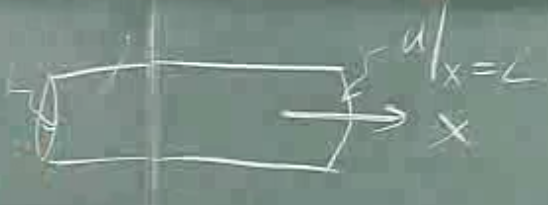

Bu denklem üstteki gibi bir borudaki ısının dağılımını, akışını gösteriyor
olsun. $u|_{x=L}$ ile gösterilen bir sınır şartı, yani $L$ uzunluğundaki
borunun en ucunda (sağındaki) olması şart olan ısı seviyesi. Mesela bu şart
$u|_{x=L} = T_2$ olsun, ki $T_2$ bir tek sayı, $100^o$ , $200^o$ gibi. Şimdi homojenliğe
ne oldu? Ana denklem homojen, ama homojenlik testini sinir şartına uyguladığımız
zaman $0 = T_2$ gibi bir sonuç alıyoruz, ki bu absürt bir sonuç demek ki sınır
şartı homojen değil. O zaman bu problemin tamamı homojen olamaz. 

Benzer şekilde borunun öteki ucu için tanımlanan şart gayrı lineer olsa

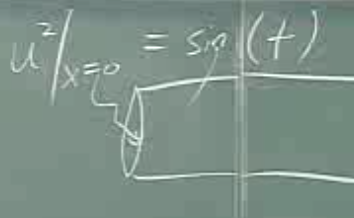

ki bu şart o uçtan bir tür sinüsoidal bir enerji, ısı verildiği bir durumu
tarif ediyor, o zaman ana denklem lineer olsa bile, sınır şartında gayrı
lineerlik olduğu için problemin tamamı gayrı lineer olacaktır. 

Aslında formel olarak sınır şartlarını alıp 

$$ \mathcal{L}  = \frac{\partial }{\partial t} - k \partial_{xx}$$

operatör tanımına bir şekilde dahil etmenin yolları var, ama biz bunlar çok
ileri seviye teknikler, bu derste bu teknikleri görmeyeceğiz. 

Başlangıç Şartları

Mesela yayılma (diffusion) denklemi $u(x,t)$ için $u(x,0) = f(x)$, yani
başlangıç anında ısı dağılımının tüm boru boyunca hangi seviyelerde
olduğunun (burada bu dağılım $f(x)$) belirtilmesi , başlangıç şartını
tanımlamak demektir.

Genel bir kural PDE'deki türev sayısı kadar şart tanımlanması
gerektiğidir. Mesela iki zaman türevi var ise, iki tane koşul gerekir,
mesela $t=0$ anındaki bir koşul, artı zamana göreve türevin $t=0$ anındaki
değeri, vs. 

Şöyle düşünebiliriz, $u_{xx}$'in olduğu bir denklemde $u$ elde etmek için
iki kere entegre edilir, ve bunun sonucu olarak iki tane entegrasyon sabiti
ortaya çıkar, ki bu değerler herhangi bir sayı olabilir. O iki sabiti
hesaplamak için iki tane koşul gerekecektir. 

Genel kuralı daha somutlaştırırsak, "her bağımsız değişken için gereken
sınır koşulu, o bağımsız değişkenin derecesine eşittir''. Tabii bu genel
bir kural, bazen gerçek dünyadaki fizik problemlerinde bu geçerli
olmayabiliyor, bir problem için düzgün sınır koşulları bulmak başlı başına
bir sanat denebilir aslında. 

Ornek

Laplace denklemi

$$ \nabla^2 u \equiv \frac{\partial ^2u}{\partial x^2} + 
\frac{\partial ^2u}{\partial y^2}  +
\frac{\partial ^2u}{\partial z^2} 
$$

ki $\nabla^2$ Laplacian operatörü olarak bilinir. 

Üstteki türden bir denklem hiç kaynak akım verilmeyen sonsuz uzayda
elektrik potansiyeli alanını temsil ediyor olabilir. 

Bu denklemin bir çözümün (ki sınır şartlarına dikkat edelim) şu şekilde
olduğunu göstermek kolaydır:

$$ u(\vec{x}) = \frac{1}{\sqrt{x^2+y^2+z^2}} $$

Bu Potansiyel Teori'sinde tipik bir problem, bir alan değişkeni var, ve
orijinden uzaklaştıkça bu değişken azalıyor, bu azalma $1 / $ uzaklığın
karesi oranında. 

Bu "bir'' çözüm, fakat bir sürü 2. derece türev var ortalıkta, o zaman
$x,y,z$'nin her türlü lineer fonksiyonu de aslında bir çözümdür. Mesela

$$ u(\vec{x}) = \alpha x + \beta y + \gamma z + \delta $$

formülü de bir çözüm olabilir. Niye? Herhangi bir lineer fonksiyonun iki
kere türevini alırsak o fonksiyon yokolur. 

Demek ki bu problemin tanımı eksik, sınır şartları da tanımlanması gerekli,
aksi takdirde elde edilen sonuçlar özgün olmayacak. Envai türden çözüm
mümkün. 

Bu problem için tipik bir sınır koşulu $\lim_{|\vec{x}|\to \infty} u = 0$
ifadesidir. Elektrik alan örneğine dönersek, elektrik alanı sonsuzluğa
giderken sıfıra düşüyor demiş oluyoruz. Bir sabite gidiyor da diyebilirdik,
o da işlerdi. 

O tür bir şart 

$$ u(\vec{x}) = \frac{1}{\sqrt{x^2+y^2+z^2}} $$

sonucunu sağlardı, diğer seçenekleri elemiş olurdu. Bu örneği sınır
koşullarının önemini belirtmek için seçtik, bu koşullar ana denklemin
kendisi kadar önemli. 

Bir nokta daha:

Şöyle bir ODE düşünelim

$$ \frac{du}{dt} = 1 $$

Entegre edince genel çözüm

$$ u(t) = t + c_1 $$

Fakat PDE için

$$ u = u(x,y) $$

$$ u_x = xy $$

Burada $y$ bazlı bir türev yok, basit bir PDE, çözmesi kolay, fakat unutmayalım,
entegre edince

$$ u = \frac{1}{2}x^2y + [..] $$

Noktaların olduğu yere ne gelecek? Bir sayı sabiti değil bir fonksiyon
gelecek. 

$$ u = \frac{1}{2}x^2y + g(y) $$

çünkü $u$, $y$'nin bir fonksiyonu, o zaman elimize geçen $y$'nin herhangi
bir fonksiyonu olacak, ki bu fonksiyonun değeri sinir koşulları üzerinden
tanımlanmış olmalı. Bunu özellikle vurgulamak istedim çünkü insanlar bu
detayı unutabiliyor.

Sınır koşulu nasıl olabilir? Mesela $u(\alpha,y) = f(y)$ şeklinde
olabilir. Bu koşulu yerine sokunca

$$ \frac{1}{2}\alpha^2 y + g(y) = f(y) $$

Bu bize $g(y)$'in ne olduğunu söyler

$$ g(y)  = f(y) - \frac{1}{2}\alpha^2 y $$

ve bu örnek için nihai çözüm

$$ u(x,y) = \frac{1}{2}x^2y + f - \frac{1}{2}\alpha^2 y $$

Tekrarlamak gerekirse

Bir Kısmi Türevsel Denklem (PDE) çok değişkenli bilinmeyen bir fonksiyon ve
o fonksiyonun kısmi türevleri arasında kurulan bir ilişkidir. 

Örnek 

$$ u = u(x,t) $$

olmak üzere

$$ \frac{\partial u}{\partial x} + \frac{\partial u}{\partial t} = 0$$

denklemi bir PDE'dir. Çözüm bir tek sayısal sonuç değil, bir
fonksiyondur. Düşünelim, mesela $f$ fonksiyonu tek değişkenli ve türevi
alınabilir bir fonksiyon ise

$$ u(x,t) = f(x-t) $$

çözümdür diyebilir miyiz? Yani çözüm $f(x-t)$ olabilir mi? Kontrol edelim 

$$ u_x = f'(x-t) $$

$$ u_t = -f'(x-t) $$

Bu iki kısmi türev toplanınca sıfır çıkar, yani sonuç üstte tanımlı PDE'ye
uyar. Bu genel tanıma uyan bir sürü fonksiyon vardır, mesela 

$$ u(x,t) = (x-t)^2 $$

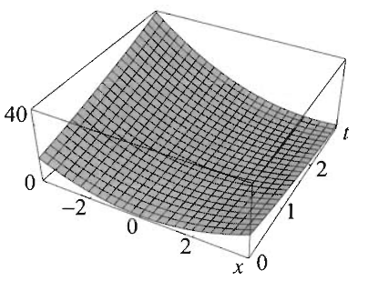

$$ u(x,t) = e^{-(x-t)^2} $$

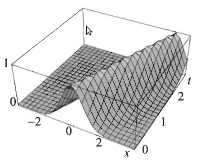

$$ u(x,t) = 3\sin(x-t) $$

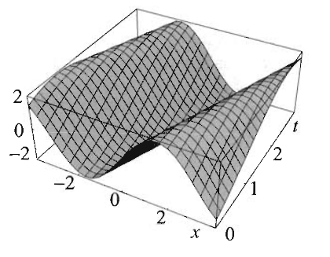

Not: Burada $f$'i bir $f(z)$ olarak görebiliriz, bu fonksiyona $(x-y)$
geçiliyor, yani bir içiçe fonksiyon ortaya çıkıyor. O zaman üstteki formlar
aslında $f(z) = z^2$, ve $e^{-z^2}$ şeklinde. Tabii kısmi türevler ile
türev alınca Zincirleme Kanunu devreye girmelidir ve geçilen değerlerin,
"fonksiyonların'' da türevi alınmalıdır, vs. 

Yani üstteki sonuç aslında diyor ki $x-t$ şeklinde hep beraber olmak üzere
bu ikiliyi kullanan herhangi bir fonksiyon, üstteki PDE'nin çözümüdür. Bu
şekilde çözüm birden fazla fonksiyon oluyor, ve bu çözüm fonksiyonlarının
birbirinden ne kadar farklı olabildiği, göstermeye çalıştığımız noktalardan
biri.

Üstteki PDE bir taşınım (convection) örneğidir, ve 1. seviye lineer homojen
bir denklemdir. 1. seviye en yüksek türev seviyesinin seviyesine işaret
eder, lineer homojen ise tüm çözümlerin lineer bir şekildeki kombinasyonu
yine bir çözümdür anlamına gelir. Üstteki PDE için ne kadar çeşitli
çözümler olabildiğini gördük, onların kombinasyonlarıyla bu çeşitlerin daha
da artacağını düşünebiliriz. kıyasla şöyle bir ODE 

$$  y' - y  = 0$$

için çözümler

$$ y = Ae^x $$

denklemidir Tek bir çözüme indirgemek için başlangıç şartı mesela $y(0) =2$ 
veririz ve oradan tek çözüm $y = 2e^x$ buluruz. 

Örnek PDE'miz için de, benzer şekilde, tek bir fonksiyonu bulmak için
başlangıç, ya da sınır şartları koymalıyız. 

Örnek

Örnek PDE çözümleri arasında hangisi x ekseni boyunca $u = e^{-x^2}$
şartını tatmin eder? 

$u = e^{-x^2}$ demek, $u(x,0)$ demektir, çünkü $t$ yoktur. Çözümlerimizi
teker teker gözden geçirirsek, $u(x,0)$ denklemi $u = e^{-x^2}$ olan
çözüm

$$ u(x,t) =  e^{-(x-t)^2} $$

çözümüdür. Görsel olarak durumu canlandırmak gerekirse, $t$'yi bir zaman
değişkeni olarak kabul edelim, ve 

her $t$ değerinde o anda $u$'nun $x$ üzerinde düşen yansımasının bir
fotoğrafını çekiyoruz sanki, üstteki resimde soldaki $t=0$ anındaki
mesela. 

Devam edelim. Örnek 1 için bir sürü çözümden bahsettik ama bu çözümleri
nasıl türettiğimizi söylemedik. Ayrıca bu örnekte "tüm mümkün çözümleri''
bulup bulmadığımızı da söylemedik. Şimdi göstereceğimiz işlemler hakikaten
tüm çözümleri bulduğumuzu gösterecek, ve akıllıca kullanılabilecek bir
değişken değiştirme (change of variables) tekniğinin bir problemi
basitleştirmekte nasıl faydalı olacağını anlatmaya uğraşacak. 

Örnek

Üstteki PDE'yi lineer değişken değişimi kullanarak bir ODE'ye indirgemeye
uğraşacağız. Diyelim ki

$$ \alpha = a x + b t $$

$$ \beta = cx + dt $$

Kısmi türevler $u_x$ ve $u_t$ şu şekilde genişletilebilir

$$ u_x = 
\frac{\partial u}{\partial \alpha}\frac{\partial \alpha}{\partial x}  +
\frac{\partial u}{\partial \beta}\frac{\partial \beta}{\partial x} 
$$

$$ u_t = 
\frac{\partial u}{\partial \alpha}\frac{\partial \alpha}{\partial t}  +
\frac{\partial u}{\partial \beta}\frac{\partial \beta}{\partial t} 
$$

İlk baştaki değişken değişimine göre bazı kısmi türevler şöyle:

$$ \frac{\partial \alpha}{\partial x} = a , \ \frac{\partial \alpha}{\partial t} = b, \ \frac{\partial \beta}{\partial x} = c , \
\frac{\partial \beta}{\partial t} = d 
$$

Bunları $u_x$ ve $u_t$ içinde yerlerine geçirirsek,

$$ u_x = 
\frac{\partial u}{\partial \alpha} a +
\frac{\partial u}{\partial \beta} c
\qquad (1)
$$

$$ u_t = 
\frac{\partial u}{\partial \alpha} b +
\frac{\partial u}{\partial \beta} d
\qquad (2)
$$

Üstteki iki kısmi türevi ana PDE'de yerine koyarsak

$$ \frac{\partial u}{\partial x} + \frac{\partial u}{\partial t} = 0$$

şöyle olur

$$ 
\frac{\partial u}{\partial \alpha} a  +
\frac{\partial u}{\partial \beta} c + 
\frac{\partial u}{\partial \alpha} b + 
\frac{\partial u}{\partial \beta} d = 0
$$

Benzer terimleri gruplayalım

$$ 
\frac{\partial u}{\partial \alpha} (a+b)
\frac{\partial u}{\partial \beta} (c+d) = 0
$$

Şimdi öyle $a,b,c,d$ değerleri seçelim ki bir kısmi türev yokolsun. Mesela 

$$ a = 1, b = 0, c=1, d=-1 $$

O zaman 

$$ \frac{\partial u}{\partial \alpha} = 0 $$

kalır. Bu artık bir basit diferansiyel denklemdir, çözüm için entegral
alırız, 

$$ u = C(\beta) $$

Unutmayalım, sıfırın entegrali bir sabittir, ama $u$ birden fazla değişkene
sahip olduğu için bu "sabitin'' $\beta$ içermesi gerekir. $C(\beta)$,
$\alpha$'ya göre bir sabittir. 

$C(\beta)$'yi daha somutlaştıralım, 

$$ \beta = cx + dt $$
 
demiştik, ayrıca $c=1,d=-1$. O zaman çözüm

$$ u = C(x-t) $$

Bu da başta bulduğumuz çözüm ile aynı zaten. 

Ders 2

Karakteristik Eğriler Metodu

Bu metot katsayıları sabit olmayan 1. derece, lineer PDE çözmemize yardım
eder. PDE şu formdadır

$$ \frac{\partial u}{\partial x} + 
p(x,y) \frac{\partial u}{\partial y} = 0 
\qquad (1)
$$

ve $p(x,y)$, $x,y$ değişkenlerinin bir fonksiyonudur. 

Üstteki denklemi iki vektörün noktasal çarpımı olarak ta görebiliriz. 

$$ 
<\frac{\partial u}{\partial x}, \frac{\partial u}{\partial y}> \cdot 
<1,p(x,y)> = 0
$$

Bu açıdan bakınca yukarıdaki ifade yeni bir şey söylüyor, $u$'nun
$<1,p(x,y)>$ vektörüne göre yönsel türevinin sıfır olduğunu söylüyor, yani
o yönde hiçbir değişim yok. 

Şimdi tek başına $<1,p(x,y)>$ vektörünü düşünelim, her değişik $x,y$ için
bu vektörler bir vektör alanı oluşturur, bu alandaki vektörleri bir eğrinin
"belli bir noktadaki eğimini gösterdiği'' şeklinde alabiliriz. O
noktalardaki eğim $p(x,y) / 1$ olacaktır doğal olarak, o zaman bu eğriler
için şöyle bir basit diferansiyel denklem (ODE) yazabiliriz.

$$ \frac{dy}{dx} = \frac{p(x,y)}{1} $$

ya da

$$ \frac{dy}{dx} = p(x,y) 
\qquad (2)
$$

Bu ODE bir yön alanı (direction field) oluşturur, bkz [1].

Şimdi geri adım atıp her şeye tekrar bakalım. (1) diyor ki $x,y$ noktasında
$u$'nun $<1,p(x,y)>$ yönündeki yönsel türevi sıfır. Yani $x,y$ noktasında
$<1,p(x,y)>$ yönünde ilerlersek $u$ hiç değişmeyecek. 

Aynı zamanda $<1,p(x,y)>$ vektörleri (2) için bir yönsel alan da
tanımlıyor!  Bilindiği gibi (2) denklemi çözüm eğrileri (solution curves)
ortaya çıkartır, ve ne raslantı ki (!) bu çözüm eğrilerinin her birinde
(1)'deki $u$ sabit kalır. 

Örnek 

$$ \frac{\partial u}{\partial x} + 
x \frac{\partial u}{\partial y} = 0 
$$

Yani $p(x,y) = x$. O zaman 

$$ \frac{dy}{dx} = x $$

denklemini çözeriz, ve 

$$ y = \frac{1}{2}x^2 + C $$

karakteristik eğrilerini elde ederiz. Tekrar düzenlersek

$$ y - \frac{1}{2}x^2 = C $$

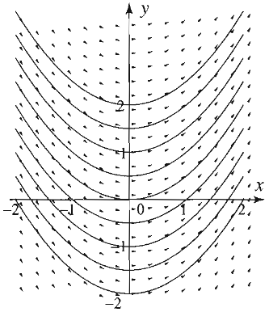

O zaman PDE'nin genel çözümü 

$$ u(x,y) = f(C) = f(y - \frac{1}{2}x^2) $$

diyebiliriz, $f$ rasgele bir fonksiyondur, söylenmeye uğraşılan farklı
sabitlere tekabül eden $u$'lardır. PDE çözümü $u$'nun sabite eşit olmasıyla
alakalı çünkü PDE'yi yönsel türev olarak temsil edince bu sonuca
varıyoruz. Üstteki denklem de karakteristik eğriler açısından gelerek o
sabiti bize sağlıyor.

$f$'in genel çözüm olduğunu ana denklemde yerine koyarak test edebiliriz.

Örnek 

$$ u_x + yu_y = 0 $$

O zaman 

$$ \frac{dy}{dx} = y $$

$$ y = Ce^x $$

ya da

$$  C = e^{-x}y$$

Genel çözüm 

$$ u(x,y) = f(C) = f(e^{-x}y) $$

PDE içinde yerine koyarak sonucu kontrol edelim

$$ u_x + yu_y = 
-f'(e^{-x}y)e^{-x}y + y f'(e^{-x}y) e^{-x} = 0
$$

Dalga Denklemi 

$$ u_{tt} = c^2 u_{xx} $$

dalga denklemi olarak bilinir. Bir diğer şekilde 

$$ u_{tt} - c^2 u_{xx} = 0$$

Bu denklemi operatörlerin faktorize edilmiş hali olarak görmek mümkündür. 

$$ u_{tt} - c^2 u_{xx} = 
\bigg( \frac{\partial }{\partial t} - c \frac{\partial }{\partial x} \bigg)
\bigg( \frac{\partial }{\partial t} + c \frac{\partial }{\partial x} \bigg)
u = 0
\qquad (3)
$$

Eşitliğin sağ tarafındaki operatörler hakikaten dalga denklemine tekabül
ediyor mu? Kontrol edelim, üstteki $u$ üzerinde etki eden ilk operatör şu
şekilde açılıyor

$$ \bigg( \frac{\partial }{\partial t} + c \frac{\partial }{\partial x}
\bigg) u = 
\frac{\partial u}{\partial t} + c \frac{\partial u}{\partial x}
$$

Şimdi ikinci operatörü uygulayalım (bu sefer eksi olan operatör), yani şunu
hesaplayalım, ve üstteki eşitliğin sağ tarafı şöyle olur

$$ 
\bigg( \frac{\partial }{\partial t} - c \frac{\partial }{\partial x} \bigg)
\frac{\partial u}{\partial t} + c \frac{\partial u}{\partial x} 
$$

$$ = 
\frac{\partial ^2 u}{\partial t^2} + 
c \frac{\partial u}{\partial x \partial t} - 
c \frac{\partial u}{\partial t \partial x} - 
c^2\frac{\partial ^2 u}{\partial x^2} 
$$

$u_{xt} = u_{tx}$ olduğuna göre ortadaki iki terim iptal olur

$$ = 
\frac{\partial ^2 u}{\partial t^2} -
c^2\frac{\partial ^2 u}{\partial x^2} 
$$

Açılımı ispatlamış olduk. 

Çözümü bulalım. Karakteristik kordinat (characteristic coordinate)
yöntemini kullanalım. Bu sefer ilginç bir şey yapacağız, kordinat
değişimini tanımlayan eşitliklerden sonra operatörler üzerinde sanki
cebirsel büyüklüklermiş gibi işlem yapacağız. 

$$ \xi = x + ct $$

$$ \eta = x - ct $$

Bu kordinat değişimi için bir tahmin yürüttük. Doğru olup olmadığını şimdi
göreceğiz. 

$$ \partial_x = \partial_\xi + \partial_\eta $$

$$ \partial_t = c\partial_\xi - c \partial_\eta $$

Bu formüller aslında 1. derste gördüğümüz (1),(2) formüllerine benziyor,
sadece üsttekiler pür operatör formunda ve sabitler bu probleme göre
ayarlı. 

Şimdi iki üstteki formülü $c$ ile çarpıp bir üstteki formül ile toplarsak,
sonuç 

$$ \partial_t + c\partial_x = 2c \partial_\xi $$

Toplamak yerine bir üstteki formülden iki üstteki formülü çıkartırsak

$$ \partial_t - c\partial_x = -2c \partial_\eta $$

Üstteki eşitliklerin sol tarafları, daha önce PDE için operatör açılımı
yaptığımızda ortaya çıkan operatörler ile aynı. O zaman açılımda yerlerine
koyarsak, PDE şöyle olur

$$ (2c\partial_\xi)(-2c\partial_\eta)u = 0 $$

Diğer bir deyişle 

$$ u_{\xi_\eta} = 0 $$

Biliyoruz ki $c \ne 0$. Bu transform edilmiş denklemin çözümü nedir? İlk
önce $\eta$'ya göre entegral alırız, 

$$ u_\xi = f(\xi) $$

Bir daha entegral alırız

$$ u = F(\xi) + G(\eta) $$

ki $F' = f$ olarak alındı. Burada aslında $f,F$'in ne oldukları pek önemli
değil, ikisi de rasgele fonksiyonlar, tek önemli olan aldıkları
parametreler. O zaman çözüm 

$$ u(x,t) = F(x+ct) + G(x-ct) $$

ki $F,G$ rasgele fonksiyonlar. 

Ders 3

Dalga Denklemi Başlangıç Değer Problemi (Initial Value Problem) 

Başlangıç değer problemi 

$$ u_{tt} = c^2u_{xx} $$

$$ -\infty < x < \infty $$

ve başlangıç şartları 

$$ u(x,0) = \phi(x) $$

$$ u_t(x,0) = \psi(x) $$

ki $\phi$ ve $\psi$, $x$'in herhangi bir fonksiyonu. 

Her $\phi$ ve $\psi$ için bu problemde tek bir çözüm vardır, yani tek bir
$u$ elde edilir. Mesela $\phi(x) = \sin(x)$ ve $\psi(x) = 0$ ise, o zaman
$u(x,t) = \sin x \cos ct$. 

Kontrol edelim. Çözüm şöyleydi:

$$ u(x,t) = f(x+ct) + g(x-ct)  
\qquad (5)
$$

$t=0$ dersek 

$$ u(x,0)  = f(x) + g(x) $$

$u(x,0) = \phi(x)$ demiştik

$$ \phi(x) = f(x) + g(x) 
\qquad (1) 
$$

Zincirleme Kanunu kullanarak $t$'ye göre türev alalım ve $t=0$ diyelim

$$ u_t(x,0) = cf' - cg' $$

$u_t(x,0) = \psi(x)$ demiştik

$$ \psi(x) = cf'(x) - cg'(x) 
\qquad (2) $$

Formül (1) ve (2)'yi bir denklem sistemi olarak görebiliriz, ve aynı anda
çözmeye uğraşabiliriz. (1)'in türevini alalım, ve (2)'yi $c$'ye bölelim

$$ \phi' = f' + g' $$

$$ \frac{1}{c}\psi = f' - g' $$

Üstteki iki denklemi toplarsak

$$ f' = \frac{1}{2} \bigg( \phi' + \frac{\psi}{c}  \bigg) $$

Çıkarırsak

$$ g' = \frac{1}{2}  \bigg( \phi' - \frac{\psi}{c}  \bigg) $$

$f'$'in entegralini alalım. Ek: $x$ yerine $s$ kullanacağız şimdi,

$$ \int f' = \int \frac{1}{2} \bigg( \phi' + \frac{\psi}{c}  \bigg) $$

$$ f = \frac{1}{2}\phi(s) + \frac{1}{2}\int_0^s \frac{\psi(x)}{c} + A$$

$$ f = \frac{1}{2}\phi(s) + \frac{1}{2c} \int_0^s \psi(x) + A 
\qquad (3)
$$

$g'$'nin entegrali

$$ g = \frac{1}{2}\phi(s) - \frac{1}{2c} \int_0^s \psi(x) + B
\qquad (4)
$$

ki $A$ ve $B$ sabitler. $A=0,B=0$ çünkü (3) ve (4) toplanınca içinde $A,B$
olmayan (1) elde edilir, o zaman $A=0,B=0$ olmalıdır. Böylece genel formül
(5) için gereken $f,g$ fonksiyonlarını elde etmiş oluyoruz. Genel formülde
biraz önce bulduğumuz $f,g$ yerine geçirirsek, ve $f$ için $s = x+ct$, $g$
için $s = x-ct$ kullanırsak,

$$ u(x,t) = 
\frac{1}{2}\phi(x+ct) + 
\frac{1}{2c} \int_0 ^{x+ct} \psi + 
\frac{1}{2}\phi(x-ct) -
\frac{1}{2c} \int_0 ^{x+ct} \psi 
$$

Basitleştirirsek 

$$ = \frac{1}{2}[\phi(x+ct) + \phi(x-ct)] + 
\frac{1}{2c} \int_{x-ct} ^{x+ct} \psi (s) \mathrm{d} s
$$

Bu çözüm matematikçi d'Alembert'in 1746'da bulduğu başlangıç değer
probleminin çözümdür. 

Örnek

$$ \phi(x) = 0, \psi(x) = \sin(x)\cos(ct) $$

Üstteki formüllerden 2.'yi 1.'den çıkartalım, 

$$ \sin(x+ct) - \sin(x-ct) = 2\cos(x)\sin(ct) $$

$u(x,t)$ içinde yerine koyalım

$$ u(x,t) = \frac{1}{c}\cos(x)\sin(ct) $$

Çözüm bu. Kontrol edersek, 

$$ u_{tt} = -c \cos(x)\sin(ct) $$

$$ u_{xx} = -(1/c)\cos(x)\sin(ct) $$

böylece 

$$ u_{tt} = c^2 u_{xx} $$

Başlangıç şartını kontrol etmek daha da kolay, ilk şart

$$ u(x,0) = \frac{1}{c}\cos(x)\sin(c \cdot 0)  = 0$$

İkinci şart

$$ u_t(x,t) = \frac{1}{c}\cos(x) c \cos(ct) $$

$$ u_t(x,0) = \frac{1}{c}\cos(x) c $$

$$  = \cos(x) $$

Yayılım (Diffusion) Denklemi

Bu bölümde çözmeye uğraşacağımız problem

$$  u_t = k u_{xx}  $$

$$ u(x,0) = \phi(x) $$

öyle ki 

$$ -\infty < x < \infty, 0 < t < \infty $$

Bu denklemi özel (particular) bir $\phi$ için çözeceğiz, ve sonra genel
çözümü bu özel çözümden elde edeceğiz. Bunu yaparken yayılım denklemin 5
tane değişmezlik (invariance) özelliğini kullanacağız.

a) Bir sabit $y$ için $u(x,y)$ çözümünü $u(x-y,t)$ olarak tercüme edilir /
taşınırsa (translate), ortaya çıkan denklem yeni bir çözümdür.

b) Çözümün her türevi, mesela $u_x$, $u_t$, $u_{xx}$ gibi, yeni bir
çözümdür. 

c) Çözümlerin lineer kombinasyonları yeni bir çözümdür. Bu lineerliğin
doğal bir sonucu zaten.

d) İki çözümün entegrali bir çözümdür, mesela $S(x,t)$ bir çözüm ise, o
zaman $S(x-y,t)$ de bir çözümdür -(a)'da söylendiği gibi-, o zaman

$$ v(x,t) = \int_{-\infty}^{\infty}S(x-y,t)g(y)\mathrm{d} y   $$

bir çözümdür. Aslında bu beyan, (c)'nin limite gidiyor iken olan versiyonu
/ şekli.

e) Eğer $u(x,t)$ yayılım denkleminin bir çözümü ise, o zaman genişletilmiş
(dilated) fonksiyon $u(\sqrt{a} x, at)$ da, herhangi bir $a>0$ için, bir
çözümdür. İspat (Zincirleme Kanunu ile)

$$ v(x,t) =  u(\sqrt{a} x, at) $$

$$ v_t = [\partial(at) / \partial t]u_t = au_t $$

$$ v_x = [\partial(\sqrt{a}x) / \partial x]u_x = \sqrt{a}u_x $$

$$ v_{xx} = \sqrt{a} \cdot \sqrt{a} u_{xx} = a u_{xx} $$

Hedefimiz özel bir çözüm bulmak ve özellik (d)'yi kullanarak tüm diğer
çözümleri inşa etmek. Aradığımız özel fonksiyon ise $Q(x,t)$ adını
vereceğimiz  bir fonksiyon ve bizim tanımladığımız özel başlangıç
şartları şöyle:

$$
Q(x,0) = 1, \ x>0 \textit{ için } \qquad (7)
$$

$$ Q(x,0)=0, \ x<0 \textit{ için }  $$

Bu başlangıç şartlarını seçmemizin sebebi genişletme (dilation)
operasyonunun bu şartlara etki etmemesi. 

$Q$'yu üç adımda bulacağız. 

1'inci Adım

Çözümün şu özel formda olacağını söylüyoruz. 

$$ Q(x,t) = g(p), \ p = \frac{x}{\sqrt{4kt}} 
\qquad (6) $$

$g$ tek değişkenli bir fonksiyon, fonksiyonun ne olduğunu sonra
tanımlayacağız, $\sqrt{4kt}$ ise daha ilerideki başka bir formülü
basitleştirmek için kullanılıyor. 

$Q$'nin niye bu özel formda olmasını istiyoruz? Çünkü çözümün genişletmeye
"dayanıklı'' olması gerekiyorsa, böyle bir çözüm sadece $Q$ $x,t$'ye
$x/\sqrt{t}$ kombinasyonu üzerinden bağlıysa mümkündür. Kontrol edelim,
genişleme $x/\sqrt{t}$'yi alıp $\sqrt{a}x/\sqrt{at} = x/\sqrt{t}$ yapar,
yani başlangıca döndürür. 

İkinci Adım

Öne sürdüğümüz çözümden ana PDE'ye erişmek için $Q_t,Q_{x},Q_{xx}$'i
bulmamız lazım. (6) üzerinde Zincirleme Kanunu kullanarak bunları elde
etmeye uğraşalım. 

$$ \frac{\partial Q}{\partial t} = 
\frac{\partial Q}{\partial p}\frac{\partial p}{\partial t}
$$

$Q$ tek bir değişken $p$'ye bağlı olduğuna göre $\partial$ yerine $d$
kullanabiliriz. 

$$ Q_t = 
\frac{dQ}{dp}\frac{\partial p}{\partial t}  = 
g'(p)\frac{\partial p}{\partial t} 
$$

$\partial p/\partial t$'yi şu şekilde hesaplarız

$$ 
\frac{\partial }{\partial t}
\bigg( 
\frac{x}{\sqrt{4k} t ^{-1/2}}
\bigg) = 
-\frac{1}{2} \frac{x}{\sqrt{4k}} t ^{-3/2} = 
-\frac{1}{2t} \frac{x}{\sqrt{4kt}}
$$

Yani 

$$ Q_t = 
- g'(p)\frac{1}{2t} \frac{x}{\sqrt{4kt}}
$$

Aynı mantıkla $Q_x$

$$ Q_x = g'(p)\frac{1}{\sqrt{4kt}} $$

Bir daha $x$'e göre kısmi türev alalım, yine Zincirleme Kanunu 

$$ Q_{xx} = \frac{\partial dQ_x}{\partial dp}
\frac{\partial p}{\partial x} = 
\frac{1}{\sqrt{4kt}}g''(p)\frac{1}{\sqrt{4kt}} 
$$

$$ = \frac{1}{4kt}g''(p) $$

$$ Q_t - kQ_{xx} = 
- g'(p)\frac{1}{2t} \frac{x}{\sqrt{4kt}} -
k\bigg[ 
 \frac{1}{4kt}g''(p) 
\bigg] = 0
$$

(6)'ya göre $p = x/\sqrt{4kt}$, o zaman 

$$ =
- g'(p)\frac{1}{2t} p - \frac{1}{4t}g''(p)  = 0
$$

$$ = \frac{1}{t} \bigg[
-p\frac{1}{2}g'(p) - \frac{1}{4}g''(p)
\bigg] = 0
$$

Tüm çarpım sıfıra eşitse, köşeli parantez içi sıfır demektir, çünkü $0 < t$
şartı var, $t$ sıfır olamaz, ayrıca parantez içini 4 ile çarparsak, sıfıra
eşitlik bozulmaz, o zaman 

$$ g'' + 2pg = 0 $$

Bu bir ODE ! Çözüm için entegre edici faktör (integrating factor) $\exp \int 2p
\mathrm{d} p = exp(p^2)$ kullanılabilir. $g'(p) = c_1 \exp(-p^2)$ elde ederiz.

$$ Q(x,t) = g(p) = c_1 \int e^{-p^2} \mathrm{d} p + c_2 $$

3'üncü Adım 

Bu adımda $Q$ için nihai bir formül üretmeye uğraşacağız. Üstteki formül
sadece $t>0$ şartını dikkate aldı, fakat bizim (7)'de belirttiğimiz
başlangıç şartlarımız da var. Bu şartları limit olarak ifade edebiliriz,
çünkü mesela $x>0$ sonrası tüm değerler için bir şey tanımladık, ve $Q$'nun bu
durum için olacağı nihai değer belli, şarta göre 1. Bu tanım limit tanımını
çağrıştırıyor, 

Eğer $x>0$ ise

$$ 1 = \lim_{t \to 0} Q = 
 c_1 \int_0^{\infty} e^{-p^2} \mathrm{d} p + c_2 = 
c_1 \frac{\pi}{2} + c_2
$$

Eğer $x<0$ ise

$$
0 = \lim_{t \to 0} Q = 
 c_1 \int_0^{-\infty} e^{-p^2} \mathrm{d} p + c_2 = 
-c_1 \frac{\pi}{2} + c_2
$$

Not: $\int_0^{-\infty} e^{-p^2} \mathrm{d} p$ entegralinin niye $\pi/2$ sonucunu
verdiğini "$e^{-x^2}$ Nasıl Entegre Edilir?'' yazısında bulabilirsiniz.

Böylece katsayılar $c_1 = 1/\pi$ ve $c_2 = 1/2$ sonuçlarına erişiyoruz. O
zaman $Q$ şu fonksiyon olmalı

$$
Q(x,t) = 
\frac{1}{2} + \frac{ 1}{\sqrt{\pi}} \int_{0}^{x/\sqrt{4kt}} e^{-p^2} \mathrm{d} p
$$

$t>0$ olmak üzere. Bu sonucun ana PDE denklemi, (6) ve (7) denklemlerini
tatmin ettiğine dikkat. 

4'üncü Adım

$Q$'yu bulduktan sonra şimdi $S = \partial Q/\partial x$ tanımını
yapalım. (b) özelliği üzerinden $S$'nin aynı zamanda ana denklemin bir
çözümü olduğunu biliyoruz. Herhangi bir fonksiyon $\phi$ için, ayrıca şunu
da tanımlıyoruz. 

$$
u(x,t) = \int_{-\infty}^{\infty} S(x-y,t) \phi(y) \mathrm{d} y  \qquad (8)
$$

$t>0$ için. (d) özelliği üzerinden $u$, PDE için yeni bir çözümdür. Biz ek
olarak şunu iddia ediyoruz ki $u$ özgün (unique) çözümdür. PDE'nin ve
sınır şartının çözüm için doğru olup olmadığını kontrol etmek için 

$$
u(x,t) = \int_{-\infty}^{\infty} 
\frac{\partial Q}{\partial x}(x-y,t)\phi(y) \mathrm{d} y
$$

$$ = -\int_{-\infty}^{\infty} 
\frac{\partial }{\partial x}[Q(x-y,t)]\phi(y)\mathrm{d} y
  $$

Parçalarla entegral (integration by parts) uyguladıktan sonra 

$$ 
=  + \int_{-\infty}^{\infty}  Q(x-y,t)\phi'(y)\mathrm{d} y - 
Q(x-y,t)\phi(y) \bigg|_{y=-\infty}^{y=+\infty}
$$

Limitlerin yokolacağını farzediyoruz. Özelde, geçici olarak $\phi(y)$'nin
büyük $|y|$ değerleri için sıfıra eşit olacağını farzedelim. O zaman 

$$ u(x,0) = 
\int_{-\infty}^{\infty} Q(x-y, 0) \phi'(y)\mathrm{d} y 
$$

$$ 
= \int_{-\infty}^{\infty} \phi'(y)\mathrm{d} y = \phi \bigg|_{-\infty}^{x} = \phi(x)
$$

Üsttekinin sonucun sebebi $Q$ için farzettiğimiz başlangıç şartları, ve
$\phi(-\infty) = 0$ faraziyesi. Bu PDE'nin sınır şartı. (8)'ın çözüm
formülü olduğunu anlıyoruz, ki 

$$ S = \frac{\partial Q}{\partial x} = \frac{ 1}{2\sqrt{\pi kt}} 
e^{ -x^2 / 4kt}
$$

$t>0$ için. Yani 

$$
u(x,t) =  \frac{ 1}{2\sqrt{\pi kt}} 
\int_{-\infty}^{\infty} e^{-(x-y)^2 / 4kt} \phi(y) \mathrm{d} y
$$

$S(x,t)$ literatürde *kaynak fonksiyonu* (source function), {\em Green'in
fonksiyonu}, *temel çözüm* (fundamental solution), *gaussian*, ya
da *aktarıcı / yayıcı* (propagatör) ya da *yayılım* (diffusion) denklemi
olarak bilinir. Ya da basitçe yayılım çekirdeği (diffusion kernel). Formül
sadece $t>0$ için bir çözüm verir, $t=0$ için anlamsızdır. 

Analitik PDE - Ders 1

Dersin kullanacağı ana kitap L. C. Evans'ın Kısmi Türevsel Denklemler
(partial differential equations -PDE-) kitabı olacak. Bir sonraki ders için
okuma ödevi şöyle:

1. Sf. 1-13'teki özet

2. Alt bölüm 2.1 sf. 17-19

3. Bölüm 3 sf. 91-115 arasını tamamen. 

PDE'leri incelerken çoğunlukla onların temsil ettiği fiziksel fenomenleri
de inceleyeceğiz. Mesela transportasyon (transport) denklemleri, ki

$$ \partial_t u + \vec{b} \cdot \vec{\nabla} u = 0 $$

Üstteki ifadede gradyan operatörü var, bu bilindiği gibi

$$ \vec{\nabla} = \bigg( 
\frac{\partial }{\partial x_1},.., 
\frac{\partial }{\partial x_n},
\bigg)
$$

$\vec{b}$ içinde sabitler olan bir vektör olabilir

$$ \vec{b} = (b_1,...,b_n)
$$

Bu denklem 1. derece PDE'lerin özel bir durumudur bu arada. 1. derece
PDE'ler 

$$ F(x, u(x), Du(x)) = 0 $$

şeklindedir. $D$ notasyonu Evans'ın gradyan için kullandığı notasyon,
alışsak iyi olur. Yani

$$ Du = \nabla u $$

Üstteki gibi denklemlere bakacağız, çözümlerini göreceğiz. Mesela üstteki
denklem direk ODE yaklaşımı ile çözülebiliyor. Bu hakikaten ilginç bir şey,
yani üstteki gibi geniş bir PDE kategorisi, $n$ tane değişken içerebilen
türden denklemler ODE'lere indirgenerek çözülebiliyor. Bu yönteme
"karakteristikler metotu (method of characteristics)'' ismi veriliyor.

Bu arada

$$ F(x, u(x), Du(x)) = 0 $$

formu oldukça geneldir, çok genel gayrı lineer, normal (ordinary)
diferansiyel denklemin formudur. Bir örnek

$$ |\nabla u|^2 = n^2(x) $$

denklemidir, ki bu denklem dalga denkleminde dalgaların uç noktalarını
(wavefront) incelerken ortaya çıkar. 

Lineer PDE

Lineer PDE'lerin örnekleri mesela ısı denklemi (heat equation), ya da
yayılma / difüzyon (diffusion) denklemi.

$$ \frac{\partial u}{\partial t} = 
\nabla  u
$$

Bir diğer örnek dalga denklemi (wave equation)

$$ \frac{1}{c^2} \frac{\partial ^2}{\partial t^2}u = \nabla u$$

yayılmanın hızı $c$ sabiti olarak gösteriliyor. 

Shrodinger denklemi ise şöyle

$$ i \frac{\partial }{\partial t}\psi  = -\nabla \psi $$

Isı denklemiyle alakalı önemli bir nokta denge (equilibrium)
noktasıdır. Denklem uzun zaman zarfı bağlamında incelendiğinde bir denge
noktasına eriştiği görülecektir. Ki bu bizi Laplaca denklemine götürür. 

$$ \nabla u = 0 $$

Ya da daha genel olarak 

$$ \nabla u = f $$

ise bu denkleme Poisson denklemi adı veriliyor. 

Tüm bu denklemler aslında pek çok uygulama alanında ortaya çıkan, çok geniş
belli başlı bazı kategorilerin prototipidirler. Mesela İşi denklemine
parabolik (paraboliç) kısmı denklem kategorisi deniyor. Dalga denklemi
hiperbolik (hyperboliç) kategorisi, Schrödinger ise dağılan (dispursive)
PDE kategorisi olarak anılıyor. Laplaca, Poisson denklemlerine elliptik
(elliptic) kategorisi ismi veriliyor. 

Tüm bu denklemleri incelerken onları temsil ettikleri daha geniş
kategorinin örnekleri olarak göreceğiz. 

Şimdi PDE'lerin ortaya çıktığı çok basit bir örneği görelim. 

Elimizde bir $\Omega$ bölgesi / alanı olduğunu hayal edelim, ki $\Omega \in
\mathbb{R}^n$ olsun, yani alttaki resimde çizdiğimiz $\mathbb{R}^2$.

Yine diyelim ki bu $\Omega$ bölgesinin etrafında bir tür sıvıyla kaplı, ve
bu sıvı hareket ediyor. Bu hareketi sabit bir hız vektör alanı olarak
gösteriyoruz. 

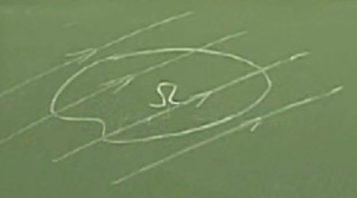

$\mathbb{R}^n$'deki bu sabit hız alanını $\vec{V}$ olarak gösterelim. $\vec{V}$'nin vektör işaretini 
koyduk, ama ileride bunu yapmayabiliriz, ama anlatımın çerçevesinden bir
şeyin  vektör olup olmadığını anlamak kolay. 

Yani bu sıvıyı oluşturan parçacıkler birörnek (üniform) hızda hareket
ediyorlar. 

Sıvının $x$ noktasındaki $t$ anındaki yoğunluğu $\rho(x,t)$ olarak
gösterilsin. O zaman $t$ anında $\Omega$ alanındaki kütleyi hesaplamak
istiyorsam, o zaman yoğunluğun hacim üzerinden entegralini alırım. 

$$ \textit{Kutle } = \int_\Omega \rho(x,t) \mathrm{d} x $$

Birimleri kontrol edeli, $\rho(x,t)$ kütle / hacim (mesela $kg / cm^3$)
birimine sahip, hacim üzerinden entegral alınca elimize kütle geçer. 

Bu sıvı belirlenen alan üzerinden sürekli akıyor. O alan içindeki kütlenin
değişim oranını merak ediyorum. Şu hesabı yapmam lazım

$$ \frac{d}{dt} \int_\Omega \rho(x,t) \mathrm{d} x   $$

Değişim oranı $\Omega$ bölgesinin sınırlarından ne geçiyorsa o'dur. 

Bölgenin dış sınırına dik olan birim normal vektörler düşünelim. Eğer bu
vektörlerden kırmızı okla gösterilen soldaki normale bakarsak, sıvı akisi
ona pek etki etmiyor, yani zarın o bölgesinde çıkış fazla yok. Fakat sağda
işaretli normal üzerinden oldukça fazla akış var.

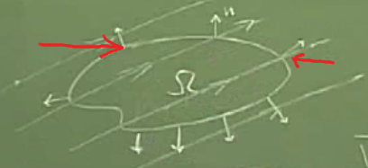

Bu durumu da

$$ \frac{d}{dt} \int_\Omega \rho(x,t) \mathrm{d} x   = 
- \int_{\partial \Omega} \rho(x,t) \vec{v} \cdot \vec{n} \mathrm{d} S 
$$

şeklinde gösterebiliriz (eşitliğin sağ tarafını şimdi ekledik). $\partial
\Omega$ bölgenin "sınırı'' anlamında kullanıldı, eğer 2 boyutlu düzlemde isek
$\partial \Omega$ sınırı bir eğridir, eğer 3 boyutta isek sınır 2 boyutlu bir
yüzey (surface), vs (genel kural olarak $n-1$ boyutlu bir yüzeydir).

$\vec{n}$ resimde çizilen birim normaller. 

Bu denklemin tek söylediği içeri giren ile çıkanın birbirine (eksi işaret
sonrasında) birbirine eşit olduğu. İki tarafın kütle / zaman birimine sahip
olduğunu kontrol edebiliriz. 

Şimdi İleri Calculus'tan hatırlayabileceğiniz bir kural 

Gauss'un Teorisi

$F: \mathbb{R}^n \to \mathbb{R}^n$ üzerinde tanımlı herhangi bir vektör alanı için,
$x \mapsto F(x)$ olmak üzere, $\mapsto$ işareti eşlenme (maps to) anlamına
geliyor, $\Omega \subset \mathbb{R}^n$ bölgesi var ise, ve bu vektör alanı
pürüzsüz (smooth) bir vektör alani ise (bu vektör bileşenlerinin
türevi alınabilir fonksiyonlar olduğunu söyler), o zaman şu da
doğrudur. Vektör alanının sapmasını (divergence) entegre ediyorum, 

$$ 
\int_\Omega \nabla \cdot F \mathrm{d} x =
\int_{\partial \Omega} F \cdot n \mathrm{d} S
$$

$\nabla \cdot$ operatörü $div$ anlamında kullanıldı, ve $\Omega$ bir alan. 

Gauss'un Teorisi, Calculus'un Temel Teorisinin çok boyutlu bir karşılığı
olarak düşünülebilir aslında.

Gauss'un Teorisini bizim formülasyona uygulayalım

$$ \int_{\partial \Omega} \rho \vec{v} \cdot \vec{n} \mathrm{d} S =
\int_\Omega \nabla \cdot (\rho \vec{v}) \mathrm{d} x 
$$

Şimdi şunu yazabilirim

$$
\frac{d}{dt} \int_\Omega \rho \mathrm{d} x = 
\int_\Omega \nabla \cdot (\rho \vec{v}) \mathrm{d} x
$$

Eşitliğin solundaki türevi alıp, sağ tarafı sola taşıyalım

$$ \int_\Omega \bigg( 
\partial_t \rho + \nabla \cdot (\rho \vec{v}) 
\bigg)dx = 0
$$

$\Omega$ işareti $\mathbb{R}^n$ içinde herhangi bir hacim ise (iki boyutta bir
alan, 3 boyutta hacim), bu hacimi sonsuz küçülttüğümüzde artık şu ifadenin 

$$ \partial_t \rho + \nabla \cdot (\rho \vec{v})  = 0 $$

noktasal (pointwise) olarak her $x,t$ için doğru olduğunu görebiliriz, eğer
$\rho$ yeterinç pürüzsüz bir fonksiyon ise tabii ki.

Üstteki fonksiyon suna da eşittir

$$ \partial_t \rho + \vec{v} \cdot \nabla \rho = 0$$

Bu denklem $F(x,\rho,\nabla \rho)=0$ formundaki bir denklemdir, genel
olarak bu formla ilgileniriz, bir üstteki örnek ise bu formun en basit
örneklerinden biri, transportasyon fenomeni (transport phenomena) denklemi.

Şimdi transport denklemini çözelim, önce direk olarak, sonra biraz dolaylı
gibi gözükebilecek bir şekilde ama sonra göreceğiz ki bu dolaylı yöntem
aslında çözüm için çok uygun. 

Tek boyutta formül şu formda

$$ \partial_t \rho + v \partial_x \rho = 0 $$

Daha genel olarak diyelim ki 

$$ \partial_t u + c\partial_x u = 0, \ \ c>0 $$

var diyelim, başlangıç şartı

$$ u(x,0) = F(x) $$

Böyle problemlere çoğunlukla Başlangıç Şart Problemleri (İnitial Value
Problem) ismi verilir. 

Diyelim başlangıç şartı $F \in C'$  şöyle bir fonksiyon

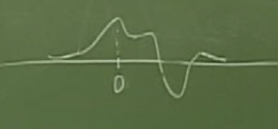

Çözüm nedir? Sudur 

$$ u(x,t) = F(x-ct) $$

Kaynaklar

[1] Bayramlı, Diferansiyel  Denklemler, *Ders 1*

[2] Weinstein, *Analytic Methods for PDEs, APMA E6301, Columbia University*

