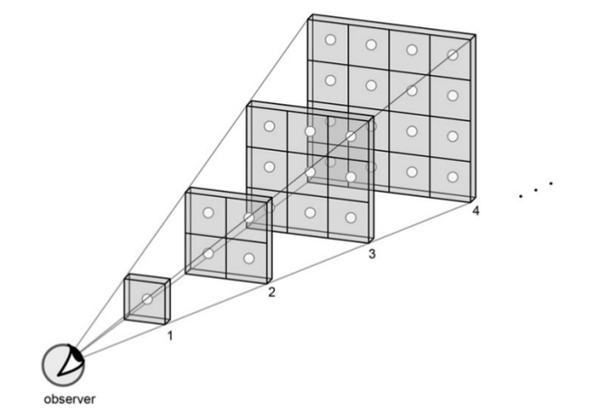

# Ekler

Evren Sonsuz mu?

Evreninin sonsuz olduğunu duymuş olabiliriz, bu aslında doğru değildir
çünkü düşünürsek, eğer evren sonsuz olsaydı sonsuz tane yıldız olurdu. O
zaman kafamızı kaldırıp gökyüzüne baktığımızda gece vakti bile gök tamamen
yıldızlarla kaplı olurdu, ve gökyüzü sonsuz aydınlıkta olurdu. Ama durum
böyle değil.

Webb adlı yazarın kitabından [1] alıntı yapalım. Yıldızların uzayda
birörnek olarak dağılmış olduğunu düşünelim. Bir yıldızın parlaklığı onu
gözleyene olan uzaklığının karesine oranla azalır, ama gözlemciye göre
gökyüzündeki yıldızlar da uzaklığın aynı karesine oranla çoğalır. Bu iki
etki birbirini iptal eder, o zaman üstteki resimde görülen her hücre
gözyüzünün parlaklığına aynı miktarda katkı yapacaktır. Ve bu hücreler
sonsuz tane olduğuna göre o zaman gece gökyüzü sonsuz aydınlıkta
olmalıdır. Yakın yıldızların bazı uzakta olanların ışığını blok
edeceklerini hesaba katsak bile gece gökyüzü kör edici aydınlıkta
olmalı. Neden böyle değil? 

Cevap: Ortaya çıktı ki bu paradoksun cevabı astronomların şimdiye kadar
yaptığı en dramatik buluşta gizli. Evrenin *sonlu* bir yaşı var,
kısıtlı bir zaman sürecinden bahsediyoruz yani. Tüm evrenin yaşı 13.8
milyar sene civarı olduğu (ve Büyük Patlama teorisine göre evren ufak bir
noktadan başlayıp büyümeye başladı) için bizim gördüğümüz kısmı da sonlu /
kısıtlı, sınırları olan bir kutu gibi. Gökyüzünün biraz önce tarif
ettiğimiz gibi kör edici aydınlıkta olması için görülen evrenin 1 milyon
kat daha fazla olması gerekirdi, ama evren o kadar büyük değil.

Kaynaklar 

[1] Webb, *Where is Everybody*

