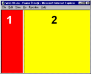
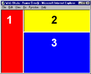

# Frame Kullanmak

Frame'ler web tarayicinizin penceresini birbirine yapisik parçalara
ayirarak her bir parçanin ayri bir içerik sergilemesine izin
verir. Yüklenen basit bir sayfayla yapilan pencereyi ayirma islemi,
her pencere için HTML standartlarina uygun bir sayfanin yüklenmesiyle
tamamlanir. Frame'ler bulunan bir sayfa olusturmak için herhangi bir
HTML editörüne gerek yoktur. Tek ihtiyaciniz olan basit bir metin
editörü ve kafanizda tasarladiginiz çerçeve stilini gerçeklestirmek
için biraz düsünmek.  Sayfanizda frame uygulamasina geçmeden önce
hemen bu özelliginin HTML 3.0 standartlarinda bulunmadigini fakat en
yeni web tarayicilari tarafindan desteklendigini belirtelim. Netscape
Navigator'in 2.0 ve Microsoft Internet Explorer'in 3.0 ve daha üstü
sürümleri frameleri destekliyor.  Frame'leri destekleyen bir sayfa
olusturuyorsaniz mutlaka sayfanin, bu özelligi desteklemeyen web
tarayicilari için bir alternatifini olusturmalisiniz, aksi takdirde
sitenize terminal ekranindan veya eski bir web tarayiciyla baglanan
kimseler içerikten faydalanamayacak ve sayfa ziyaret sayiniza katkida
bulunmayacaklardir (!) Frame'lere nasil alternatif olusturuldugunu
yazimizin ilerki bölümlerinde anlatacagiz. Baslamadan önce herkesin
yaptigi gibi frame'ler konusunda 1-2 örnek verip sadece TAG'lari
açiklamayacagimizi belirtelim, ayni zamanda kendi özgün
çerçevelerinizi olusturmaniz için isin mantigina da deginecegiz.
Frame'ler ne zaman kullanilmalidir?  Hiç geregi olmadigi halde web
sayfanizda frame'lerden faydalanmak hem sayfanizin islevselligini yok
edip kullanicinin kafasini karistiracak hem de sayfanin yüklenmesini
zorlayacaktir, web tarayiciniz bir web sayfasinin yüklenmesi için
sunucudan komutlar aldigindan en az iki sayfadan olusacak çerçeveli
bir sayfayi yüklemek için ana sayfa da içinde olmak üzere üç sayfa
için ayri ayri sunucudan bilgi alacaktir. Sayfa içerisinde, yüklenmesi
uzun süre alacak, büyük bir resim, menü gibi degismeyen ögeleri her
seferinde tekrar yüklememek için bu bölümler ayri bir pencere olarak
tanimlanabilir.  Sayfa içerisinde iliskilendirmeler olusturmak,
sayfanin degisik alanlarina tiklandiginda bagimsiz bir yerde bir
içerik olusturmak frame'ler sayesinde çok kolaydir.  Nasil oluyor da
oluyor?  Frame'lere sahip bir sayfa olusturmaya baslamadan önce web
tarayicilarinda bu teknolojiyi destekleyen iki rakip firmanin ortak
olarak kullandigi komutlari açiklayalim.  <FRAMESET> Bu tag, yatay ve
dikey pencerelerin tanimina "baslamak" için kullanilir. Tag ile
birlikte kullanilabilecek iki adet taki vardir ki bu takilar
olutturulacak pencerelerin cinsini belirler.  COL takisi dikey
nitelikte ROW takisi yatay nitelikte bir pencere olusturmak için
kullanilir.  <FRAMESET COL="100,50,*> komutu bundan sonra üç sayfanin
tanimi yapilacagini, bu sayfalarin kolon nitelikli olacagini,
bunlardan iki tanesinin sabit uzunluklu, üçüncüsünün uzunlugunun ise
degisebilir oldugunu gösterir. Tirnak içinde sabit bir sayi ve yildiz
kullanabileceginiz gibi "%30,%70" bir yüzde deger de
belirtebilirsiniz, bu durumda frame'in boyutu sayfanin boyutu göz
önüne alinarak otomatik olarak ayarlanir. <FRAMESET> takisi
</FRAMESET> ile bitirilmeden önce iç içe kullanilarak komplike pencere
tanimlari yapmaniza izin verir.  <FRAME> Bu tag ise ile
baslayacaginizi belirttiginiz sayfalari olusturmakta kullanilir ve
sayfanin genel yapisini belirler.  takisinin iki web tarayicisinin da
destekledigi 6 adet takisi vardir.  SRC="URL/DOSYA_ADI" Pencere
içerisine yüklenecek dosyayi seçmek için kullanilir. Bu deger sunucu
içinde herhangi bir dosya oldugu gibi degisik bir Internet adresi de
içerebilir.  NAME="FRAME_ADI" Daha sonra sayfayi çagirmak için
referans olarak kullanilacak isim bu degere atanmalidir.
MARGINWIDTH="DEGER" Sayfadaki ilk nesnenin soldan ne kadar uzak
olacagini belirler.  MARGINHEIGHT="DEGER " Sayfadaki ilk nesnenin
yukardan ne kadar uzak olacagini belirler.  SCROLL=AUTO/YES/NO
Kaydirma çubuklarinin durumunu belirler.  SCROLL=AUTO/YES/NO Kaydirma
çubuklarinin durumunu belirler.  SCROLL=AUTO/YES/NO Kaydirma
çubuklarinin durumunu belirler.  NORESIZE Pencerenin fare yardimiyla
genisletilip daraltilamamasini saglar.  <NOFRAME> Bu taki iki
çerçeveyi olusturacak sayfada kullanilir ve frame'leri desteklemeyen
web tarayicisinda sayfanin görünümünü olusturur. Web tasarimcisi
<noframe> ve </noframe> takilari arasina <HTML>, <BODY> tag'larini
barindiran tam bir HTML sayfasi girebilir.  Son olarak frame'leri
tanimlayan sayfada bulunmayan fakat frame'in tanimladigi sayfaya
koyabileceginiz bir tag daha vardir. <BASE TARGET="pencere"> tagi o
pencere içerisinden bir link'e tiklandiginda kaynagin hangi pencerede
açilacagini belirler.  Nelere dikkat etmeli ? Frame'lerin kullanimini
ve komutlarini anlatirken dikkat etmeniz gereken unsurlarin bir
kismindanbahsettik, ama yine de Internet üzerinde rastladigimiz
sayfalarda sik yapilan hatalari belirtelim. Böylece siz de ilk
deneyimlerinizde bu hatalardan kaçinabilirsiniz.  Frame içindeki bir
sayfada disariya bir referans bulunuyorsa <A HREF=".. ile
baslattiginiz tag içinde mutlaka TARGET="_TOP" veya TARGET="_BLANK"
takilarini kullanin. Bunu yapmazsaniz frame'li sayfaniz içinda baska
bir frame'li sayfa açilmasi veya küçücük pencerenize sigmayacak bir
sitenin yüklenmesi kaçinilmaz olur.  Frame'inizi tasarlarken kaydirma
çubuklarinin otomatik olmasina özen gösterin. Sayfanin içerisinde
yeterince içerik olmasa bile sayfa kenarlarinda kaydirma çubuklarinin
bulunmasi kullaniciya rahatsizlik verecektir.  Frame'lerin içerigini
her zaman iyi kontrol edin. Çerçevelerden birini menü olarak
kullaniyorsaniz o çerçeve içerisinde yanlislikla baska bir sayfanin
açilmasina mahal vermeyin.  Pencerelerden bir tanesini "kaydirilamaz"
olarak atiyorsaniz ya bu frame'in genisligini ve yüksekligini sabit
olarak atayin ya da sayfayi 640*480 çözünürlüge uygun olarak
tasarlayin. Bunu uygulamazsaniz 640*480 çözünürlükte frame'in
içeriginin bir kisminin görülmesi kullanici ne yaparsa yapsin mümkün
olmayacaktir.  Degisik çerçeve stilleri için kaynak kodlar <FRAMESET
COLS="100,*"><FRAME SRC="1.htm" NAME="1"><FRAME SRC="2.htm"
NAME="2"></FRAMESET> <FRAMESET ROWS="100,*"><FRAME SRC="1.htm"
NAME="1"><FRAME SRC="2.htm" NAME="2"></FRAMESET> <FRAMESET
ROWS="100,*"><FRAME SRC="1.htm" NAME="1"><FRAMESET COLS="100,*"><FRAME
SRC="2.htm" NAME="2"><FRAME SRC="3.htm"
NAME="3"></FRAMESET></FRAMESET> <FRAMESET COLS="100,*"><FRAME
SRC="1.htm" NAME="1"><FRAMESET ROWS="100,*"><FRAME SRC="2.htm"
NAME="2"><FRAME SRC="3.htm" NAME="3"></FRAMESET></FRAMESET> <FRAMESET
COLS="100,*"><FRAME SRC="1.htm" NAME="1"><FRAMESET ROWS="100,*"><FRAME
SRC="2.htm" NAME="2"><FRAME SRC="3.htm" NAME="3"><FRAME SRC="4.htm"
NAME="3"></FRAMESET></FRAMESET> Yazarin izni ile
http://draskin.150m.com sitesinden alinmistir

