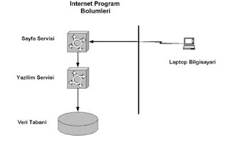

# İnternet Sayfası İstenince Ne Olur

Sayfa istenince yapılan işlemler aşağıda sıralanmıştır.

* Kullanıcı tarayıcı ile bir veb sayfası ister

* Bu komut, sayfa servisi tarafından alınır. Eğer sayfa HTML değil,
JSP/JHTML gibi yazılım servisi gerektiren bir sayfa ise, yazılım
servisine aktarılır.

* Yazılım servisi sayfa içindeki Java veya diğer kodu işletir, veri
tabanına ulaşması gerekiyorsa ulaşır ve sonuçları HTML olarak sayfa
servisine geri gönderir.

* Sayfa servisi öteki HTML bilgilerini ekleyerek bütün sayfayı
kullanıcıya yollar.

